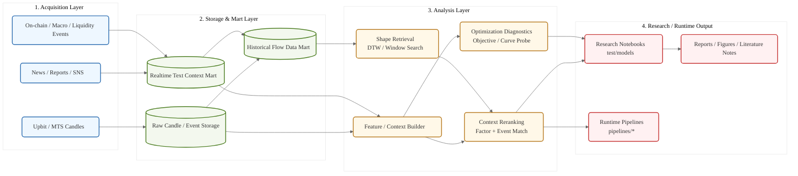

# AI 퀀트 트레이딩 연구

이 저장소는 가격 시계열, 실시간 텍스트 맥락, 과거 유사 흐름 데이터 마트를 함께 사용하는 다변량 퀀트 트레이딩 연구 프로젝트입니다. 단순히 다음 캔들을 맞히는 예측기가 아니라, 과거의 유사 사건과 현재의 맥락을 함께 읽어 하방 위험을 먼저 통제하는 연구 프레임워크를 목표로 합니다.

## 1. 전체 연구 개요

본 프로젝트는 전통적인 단변량 시계열 예측에서 벗어나, 다음 세 가지 축을 함께 다룹니다.

- 가격·거래량·변동성 기반 시계열 패턴
- 뉴스·리포트·SNS·규제·보안 이슈 같은 텍스트 맥락
- 과거 유사 사건을 재활용하기 위한 historical flow data mart

핵심 관점은 “무조건 수익률을 최대화하는 모델”보다 “큰 손실을 먼저 피하는 모델”입니다. 따라서 현재 구간의 차트 모양뿐 아니라, 왜 그런 흐름이 나왔는지에 대한 맥락 변수와 과거 사건의 원인 일치 여부까지 함께 보도록 설계합니다.

## 2. 핵심 연구 방향

- `Univariate -> Multivariate`: 가격만 보지 않고 텍스트, 온체인, 유동성, 레버리지, 거시 변수까지 결합합니다.
- `Shape + Context`: DTW 등으로 과거 유사 구간을 찾되, 사건 원인과 맥락이 맞는지까지 함께 비교합니다.
- `Data Mart First`: 반복 API 호출보다 재현 가능한 로컬/서버 데이터 마트를 우선합니다.
- `Defense First`: MDD 최소화와 잘못된 진입 회피를 우선 목표로 둡니다.
- `Research / Runtime Split`: 연구 실험은 `test/`, 실제 활용 프레임워크는 루트 패키지로 분리합니다.

## 3. 도메인 지식 자료

프로젝트의 도메인 지식 베이스는 [WikiDocs: Cherry Quant](https://wikidocs.net/148475)를 정리한 [materials/quant_and_stock.md](/c:/Users/jun99/OneDrive/바탕%20화면/Analysis/toy_agent_project/quantitative_trading/materials/quant_and_stock.md)입니다.

이 문서는 다음 역할을 합니다.

- 퀀트 트레이딩 기본 프로세스의 공통 언어 제공
- 과최적화 방지, 리스크 관리, 백테스트 해석 기준 정리
- AI 에이전트와 연구자가 같은 용어 체계로 협업하도록 가이드

## 4. 프로젝트 목표

- 실시간 가격 흐름과 외부 맥락을 함께 반영하는 다변량 분석 프레임워크 구축
- 과거 유사 사건 검색을 위한 historical flow mart 구축
- 연구용 노트북과 실제 활용 모듈을 분리한 재현 가능한 저장소 구조 유지
- 최종적으로는 “무엇이 비슷한 흐름인가”를 차트 모양이 아니라 원인·맥락·반응까지 포함해 정의

## 5. 문서 역할

- [AGENTS.md](/c:/Users/jun99/OneDrive/바탕%20화면/Analysis/toy_agent_project/quantitative_trading/AGENTS.md): 세션마다 반드시 지켜야 하는 강제 규칙
- [skills.md](/c:/Users/jun99/OneDrive/바탕%20화면/Analysis/toy_agent_project/quantitative_trading/skills.md): 기술 철학, 분석 원칙, 보고서 기준
- [history.md](/c:/Users/jun99/OneDrive/바탕%20화면/Analysis/toy_agent_project/quantitative_trading/history.md): 누적 작업 이력
- [process.md](/c:/Users/jun99/OneDrive/바탕%20화면/Analysis/toy_agent_project/quantitative_trading/process.md): 현재 단계와 다음 단계
- [conversation_l2_cache.md](/c:/Users/jun99/OneDrive/바탕%20화면/Analysis/toy_agent_project/quantitative_trading/conversation_l2_cache.md): 최근 요청 요약 캐시
- [test/README.md](/c:/Users/jun99/OneDrive/바탕%20화면/Analysis/toy_agent_project/quantitative_trading/test/README.md): 연구 실험 공간 사용 가이드

## 6. 디렉토리 구조

- `main.py`: 최상위 진입점
- `analysis/`: 공통 분석 로직
- `advisors/`: 전략/의사결정 보조 로직
- `contexts/`: 텍스트·외생 맥락 수집/가공
- `marts/`: 데이터 마트 구축과 질의 로직
- `integrations/`: 외부 시스템 연동
- `pipelines/`: 운영/재현 실행용 파이프라인 진입점
- `database/`: DB 경로, schema, helper
- `data/`: 공용 DuckDB 및 데이터 파일 위치
- `materials/`: 프로젝트 개요, 아키텍처, 도메인 문서
- `test/models/`: 연구 실험 노트북과 `.py` 미러
- `test/results/`: 실험 결과물
- `test/research_materials/`: 문헌 리뷰, 설계 근거
- `test/scripts/`: 재사용 가능한 연구 보조 유틸리티
- `.githooks/`: 노트북 미러 동기화 및 저장소 정책 검사

## 7. 시스템 아키텍처

아래 이미지는 현재 프로젝트의 전체 아키텍처 개요입니다.


문서 렌더링에서 구조를 텍스트로도 바로 볼 수 있도록 Mermaid 다이어그램도 함께 유지합니다.



### Historical Flow Data Mart의 위치

Historical flow mart는 단순한 과거 캔들 저장소가 아닙니다. 다음 역할을 맡습니다.

- KRW 마켓 전 종목 기준 sliding window 생성
- `shape + factor + context`를 함께 보는 유사 구간 검색
- 변곡점 당시의 이벤트성 맥락과 이후 반응 차이를 함께 저장
- 나중에 LLM이나 전략 엔진이 과거 유사 사례를 근거와 함께 참조할 수 있게 지원

즉, 본 프로젝트에서 데이터 마트는 “보관소”가 아니라 “과거 사건 재해석 계층”입니다.

## 8. 실행 정책

저장소에는 자동화 코드와 재현 가능한 실행 명령을 남기지만, Codex는 로컬에서 장시간 연구 실행을 수행하지 않습니다.

- 로컬 허용: 코드 작성, 문법 검사, import 확인, 작은 synthetic 테스트, 정적 리뷰
- 로컬 금지: 장시간 학습, 백테스트, 노트북 결과 산출, 대규모 시계열 분석
- 실제 연구 실행: 학교 서버 커널, CI, 스케줄러, 승인된 원격 환경

이 정책은 [AGENTS.md](/c:/Users/jun99/OneDrive/바탕%20화면/Analysis/toy_agent_project/quantitative_trading/AGENTS.md)에 더 엄격하게 정리되어 있습니다.

## 9. 환경 설정 및 실행 방법

### 9.1 기본 설정

```bash
git clone <repository_url>
cd quantitative_trading
uv sync
```

### 9.2 재현 실행 기본 원칙

- 운영 파이프라인 진입점은 `pipelines/` 아래에 둡니다.
- 연구 실험은 `test/models/*.ipynb` 원본과 같은 이름의 `.py` 미러를 함께 유지합니다.
- 공용 데이터 파일은 `data/` 아래에서 관리합니다.

### 9.3 문서/도메인 컨텍스트 주입

필요할 때 [materials/research_overview.docx](/c:/Users/jun99/OneDrive/바탕%20화면/Analysis/toy_agent_project/quantitative_trading/materials/research_overview.docx)와 [materials/quant_and_stock.md](/c:/Users/jun99/OneDrive/바탕%20화면/Analysis/toy_agent_project/quantitative_trading/materials/quant_and_stock.md)를 함께 참고해 프로젝트 목적과 도메인 기준을 맞춥니다.

## 10. 연구 워크플로우

1. 세션 시작 시 `AGENTS.md -> process.md -> history.md -> conversation_l2_cache.md -> test/README.md` 순서로 읽습니다.
2. 기존 실험, 문서, 파이프라인을 먼저 검색한 뒤 새 파일이 정말 필요한지 판단합니다.
3. 연구 실험은 `test/models/*.ipynb`를 먼저 만들고 같은 이름의 `.py` 미러를 유지합니다.
4. 공통으로 재사용할 가치가 있는 로직은 루트 패키지(`analysis/`, `contexts/`, `marts/`, `pipelines/`)에 캡슐화합니다.
5. 결과 요약과 다음 단계는 `history.md`, `process.md`, `conversation_l2_cache.md`에 반영합니다.

## 11. 재현 실행 명령

아래 명령은 학교 서버, CI, 스케줄러, 운영자가 재현 가능한 방식으로 실행하도록 저장소에 남겨 둔 기준 명령입니다.

```bash
uv run main.py
uv run pipelines/ingest_text_context.py
uv run pipelines/build_historical_flow_mart.py
uv run pipelines/query_historical_flows.py
uv run pipelines/simulate_and_send.py
```

## 12. 에이전트 협업 가이드

- AI 에이전트는 먼저 문서 컨텍스트를 읽고 작업을 시작합니다.
- 저장소 규칙은 `README.md`보다 `AGENTS.md`가 우선합니다.
- 기술 철학과 분석 기준은 `skills.md`를 기준으로 통일합니다.
- 연구 실험과 실제 활용 프레임워크를 섞지 않도록 `test/`와 루트 패키지를 구분합니다.

## 13. 향후 확장 및 배포 파이프라인

본 프로젝트는 연구 단계를 넘어서 다음 확장을 염두에 두고 있습니다.

- `n8n / Cron / Scheduler`: 수집, 마트 갱신, 알림 자동화
- `Docker / Kubernetes`: 분석기, context builder, retrieval engine 분리 운영
- `CI / Artifact Store`: 이미지, 모델, 보고서, 내부 패키지 버전 관리
- `LLM-assisted retrieval`: historical flow mart를 LLM이 설명 가능한 근거 검색 계층으로 활용

즉, 현재의 연구 코드와 문서는 미래의 에이전트형 자동 분석 시스템으로 자연스럽게 이어지도록 설계되어 있습니다.
