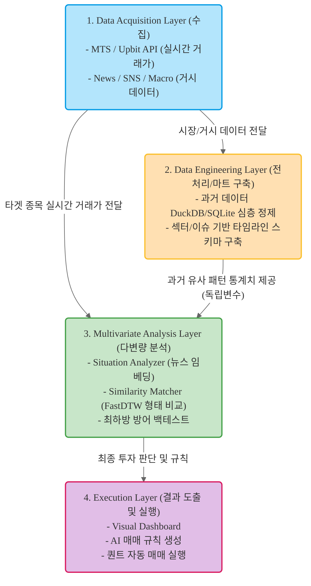

# AI 퀀트 트레이딩 연구: 다변량 분석 기반 최하방 방어 모델

<div align="center">
  
  
  
</div>

---

## 1. 연구 개요 (Research Overview)
본 연구는 전통적인 통계학적 시계열 모델의 한계를 극복하고, 거대언어모델(LLM)과 다변량 분석(Multivariate Analysis)을 결합하여 '**최하방 지지선 방어**'에 특화된 퀀트 매매 전략을 탐색합니다. 
단순히 수익률을 극대화하는 것이 아니라, 역사적 패턴 유사도(DTW)와 거시적 감성 분석(Sentiment)을 결합하여 하락장에서의 손실을 원천 차단하는 **'절대로 잃지 않는' 모델** 구축이 핵심 목표입니다.

---

## 2. 핵심 연구 방향 (Strategic Direction)
- **Univariate to Multivariate:** 주가 데이터(단변량)에 의존하지 않고 뉴스, 전쟁, 매크로 지표, SNS 반응 등 외부 변수를 포함한 다변량 분석을 수행합니다.
- **Pattern & Sentiment Matcher:** 현재의 주가 모양과 비슷한 과거 시점을 찾고, 당시의 '뉴스 맥락(감성)'까지 비교하여 현재 흐름을 예측합니다.
- **Data Mart 기반 분석:** 매번 API를 호출하는 비효율을 제거하기 위해, 섹터별/이슈별로 정제된 데이터 마트를 구축(DuckDB/SQLite)하여 즉각적인 백테스트 환경을 조성합니다.
- **AI-Agentic Workflow:** 연구의 전 과정(데이터 수집, 코딩, 분석, 리포트)을 **Codex CLI 에이전트**와 완벽히 통제된 환경에서 협업하여 수행합니다.

---

## 3. 시스템 아키텍처 (Architecture)
아래는 본 프로젝트의 데이터 수집부터 분석, 시각화까지의 전체 데이터 파이프라인입니다.



### 🖼️ System Architecture Image


---

## 4. Codex CLI (Codex CLI) 환경 설정 및 실행 방법

본 프로젝트는 속도와 의존성 관리에 최적화된 `uv` 패키지 매니저와, 플러그인/스킬이 극대화된 `Codex CLI (Codex CLI)`를 기반으로 구동됩니다.

### 4.1. 가상환경 및 종속성 동기화
```bash
# 1. uv를 활용한 가상환경 생성 및 종속성 동기화
uv sync

# 2. 메인 분석 스크립트 실행
uv run main.py
```

### 4.2. MCP 및 로컬 스킬 마이그레이션 구성
본 프로젝트는 `Codex CLI` 가동 시 자동으로 로드되는 로컬 에이전트 설정을 완비하고 있습니다.
- **ArXiv 학술 논문 MCP 서버:** `.agents/mcp_config.json`, `.mcp.json`, `.codex/config.toml`에 등록되어 있으며, `uv tool install 'arxiv-mcp-server[pdf]'` 후 `arxiv-mcp-server`를 통해 논문 자료를 즉각적으로 검색합니다.
- **Hugging Face Skills 라이브러리:** `.agents/skills/`에 14가지 정형 스킬(데이터셋 다운로드, 모델 탐색, Sentence Transformer 훈련, 가중치 최적화 등)이 마이그레이션되어 `Codex CLI`가 기본 툴 세트로 활용합니다.
- **중요:** Hugging Face는 MCP 서버가 아니라 **로컬 skill 세트**로 연동합니다. 즉, 논문 검색은 `arxiv-mcp-server`, 모델/데이터셋/훈련 작업은 Hugging Face skills로 분리해서 사용합니다.

---

## 🔥 5. AI 에이전트(Codex CLI) 활용법 & 생산성 극대화 꿀팁 (AI-Agentic Tips)

> [!NOTE]
> 본 프로젝트는 주기적인 세션 초기화(리셋) 환경에서도 에이전트가 이전의 기억과 분석 기조를 즉시 복원하고, 번거로운 클릭 승인 없이 100% 자동 구동할 수 있도록 정교한 **AI 자가 치유 및 상태 보존 아키텍처**를 채택했습니다.

### 🚀 Tip 1. full-auto (자동 승인) 모드 구동
작업 지시나 분석 명령을 실행할 때마다 에이전트가 파일 읽기/쓰기, 터미널 실행에 관해 허용 여부를 묻는 팝업을 거치는 것이 번거롭다면, `Codex CLI`를 구동할 때 **`--dangerously-skip-permissions`** 플래그를 추가하십시오.
```bash
Codex CLI --dangerously-skip-permissions "test/models/에 있는 시계열 모델 앙상블 분석하고 결과를 results에 적재해줘"
```
*이 플래그를 사용하면 모든 파일 수정 및 명령어 동작이 에이전트의 판단에 따라 **자동 승인(Full-Auto)**되어 백그라운드 태스크나 오랜 연산이 필요한 퀀트 분석 자동화에 최적화됩니다.*

### 🚀 Tip 2. 주기적인 세션 초기화 및 '원클릭 맥락 복원' 시나리오
컨텍스트 토큰 누적에 따른 성능 저하나 캐시 오염을 막기 위해 세션을 초기화(`/clear` 또는 터미널 재실행)한 뒤, **이전 작업의 맥락과 완료 목록을 원클릭으로 주입하여 Next Step을 자동 실행하게 하는 방법**입니다.

1. **상태 관리의 주축 (`history.md` & `process.md` & `AGENTS.md`):**
   - 프로젝트 루트의 `AGENTS.md` 파일은 `Codex CLI` 기동 시 자동으로 로드되어, 에이전트가 시작 시 무조건 `history.md`(수행 이력)와 `process.md`(연구 프로세스 ToDo 리스트)를 스캔하도록 강제합니다.
2. **세션 리셋 후 복원 Magic Command:**
   ```bash
   Codex CLI --dangerously-skip-permissions "history.md와 process.md를 읽고 현재 Next Step 작업을 바로 실행해줘"
   ```
   *이 단 한 줄의 명령만 실행하면, `Codex CLI`는 이전 세션의 마지막 종료 지점(예: Phase 2 / Step 2.1)을 정밀 인지하고, ToDo 목록 상의 다음 미완료 분석 모듈 개발 및 학습을 알아서 기계적으로 시작합니다.*

### 🚀 Tip 3. SOTA 학술 연동 및 결과 리포트 자동 생성 팁
- "~~ 찾아줘" 혹은 "특정 예측 모델 조사해줘"와 같은 명령이 내려지면, 에이전트는 `AGENTS.md`에 명시된 규칙에 의거해 ArXiv MCP와 Hugging Face Local Skills를 연동하여 최신(SOTA) 연구를 탐색합니다.
- 탐색을 마친 분석 보고서는 다음과 같은 **엄격한 전사적 6대 규격**에 맞춰 루트 또는 `test/results/` 경로에 Markdown으로 자동 생성됩니다.
  1. **실행 환경 명시:** 사용된 OS, CPU/GPU, 패키지 버전 및 데이터 스케일링/결측치 처리 방식 공개.
  2. **기초 통계량 분석:** 학습/예측 데이터의 `describe()` 결괏값 및 시계열 정상성 검정.
  3. **알고리즘 지표의 가격 역변환:** 예측 수치를 스케일링 그대로 표기하지 않고, **원본 KRW 스케일로 역변환**하여 표기.
  4. **고급 학술 지표 산출:** 2025년 이후 학술계 표준인 **DA (Directional Accuracy)** 및 **MASE (Mean Absolute Scaled Error)** 필수 포함.
  5. **그래프 시각화의 명확한 텍스트 맵핑:** 모든 시각화 시 **X축(예: Time in 15-min intervals)**과 **Y축(예: Price in KRW)**의 정보를 텍스트로도 완벽히 설명 및 지연 현상(Lagging) 진단.
  6. **종합 결론 및 용어 해설(Glossary):** 최하방 방어(MDD 제어) 퀀트 전략 제언 및 핵심 용어집 수록.

### 🚀 Tip 4. "Shallow but Wide" 모델 설계 팁
- 시계열 금융 데이터는 극심한 노이즈를 동반하므로 모델이 깊어질수록(Deep) 과거 가격을 단순히 완벽히 암기하는 과적합(Overfitting)의 늪에 빠집니다.
- 에이전트와 모델 아키텍처를 토론할 때(예: `/grill-me` 슬래시 명령어 활용 시) 반드시 **"1~2개 층으로 얕게(Shallow) 설계하고, 한 층의 퍼셉트론 노드 수를 64~128개로 넓게(Wide) 구성하여 핵심 추세에 집중하도록 강제"**하는 기조를 준수하십시오.

---

## 6. 향후 확장 및 배포 파이프라인 (Future Scalability)

본 프로젝트는 연구 단계를 넘어 실제 프로덕션(Production) 환경의 실시간 분석 시스템으로 확장될 수 있도록 다음과 같은 DevOps 인프라 연동을 설계에 반영하고 있습니다.

- **Workflow Automation (n8n):** 데이터 수집, 파이프라인 트리거, 결과 표준 Markdown 리포트 Slack/Telegram 자동 전송 오케스트레이션.
- **Containerization & Orchestration (Docker & Kubernetes):** `uv` 기반의 독립적 에이전트 컨테이너 배포 및 시장 폭락장 시 분석 트래픽 급증에 대처하기 위한 패턴 매칭 엔진 Pod의 HPA(Autoscale-out) 연동.
- **Artifact Management (Sonatype Nexus):** 학습이 완료된 딥러닝 모델 파일, 프라이빗 Docker 이미지, 패키지 가중치를 내부 망에 보안성과 속도 중심 배포.
---

## 7. Realtime Text Context Pipeline
News, market reports, and SNS text can be aligned to the same 15-minute
time buckets as the candle mart and used as independent variables for
multivariate analysis.

```bash
# Collect RSS/Naver/local CSV text and build DuckDB feature tables.
uv run ingest_text_context.py

# Run the simulation with text factors attached.
uv run simulate_and_send.py
```

- Default keyless source: Google News RSS search feeds.
- Optional API source: set `NAVER_CLIENT_ID` and `NAVER_CLIENT_SECRET` to enable Naver News Search API.
- Local report/SNS CSV input: set `TEXT_LOCAL_CSVS="reports.csv|sns_export.csv"`.
- Custom RSS input: set `TEXT_RSS_URLS="https://example.com/rss|https://example.org/feed"`.
- DuckDB raw table: `text_events_raw`.
- DuckDB 15-minute feature table: `text_features_15m`.
- Main factors: `text_event_count`, `text_sentiment_mean`, `text_shock_z`, `text_sentiment_momentum_1h`, `text_macro_count`, `text_risk_count`, `text_crypto_count`, `text_regulation_count`, `text_liquidity_count`.

## 8. Historical Flow Data Mart
Past analogs are matched across the full Upbit KRW universe, not BTC alone.
The mart stores full KRW-market windows while using a liquid subset for the
default neighbor index.

```bash
# Build on the school server or automation environment, not during local Codex sessions.
uv run build_historical_flow_mart.py --window-lengths 16,48,96,288 --stride 4 --top-k 10 --liquid-top-n 50

# Query similar historical flows for a ticker.
uv run query_historical_flows.py --ticker KRW-SOL --window-length 96 --top-k 10
```

- Standard source table: `upbit_krw_candle` with `ticker`, `timestamp`, `open`, `high`, `low`, `close`, `volume`, `value`.
- BTC fallback: `btc_15m_advance` is allowed only for lightweight development checks.
- DuckDB tables: `historical_flow_windows`, `historical_flow_features`, `historical_flow_neighbors`, `historical_flow_event_stats`, `historical_regime_stats`, `historical_flow_run_log`.
- Similarity score: `query_composite_distance = shape + factor + context`.
- Shape factors: normalized return path and DTW/L2 path distance.
- Independent-variable factors: return, volatility, MDD, trend slope, value/volume z-score, RSI, ROC, Bollinger Band Width, Amihud illiquidity.
- Context factors: if `text_features_15m` exists, sentiment, text shock, risk, macro, crypto, regulation, and liquidity counts are attached so large turning points are matched by both flow and likely cause.
