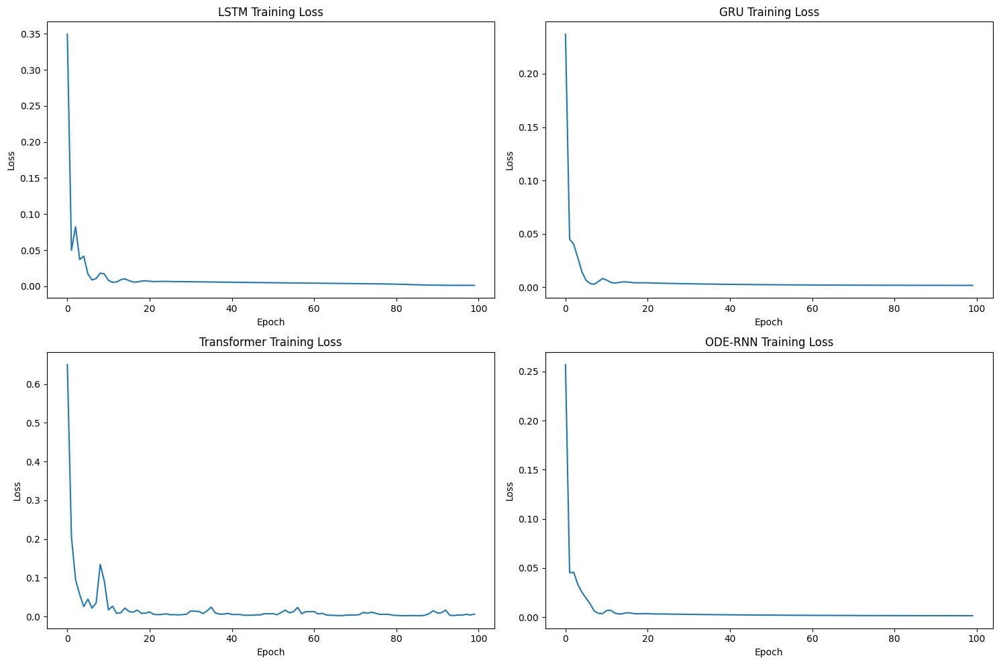
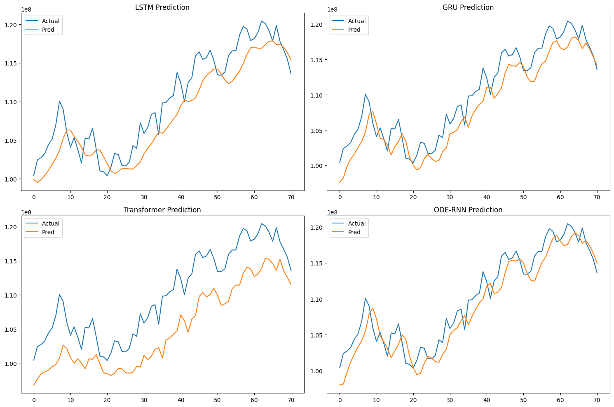
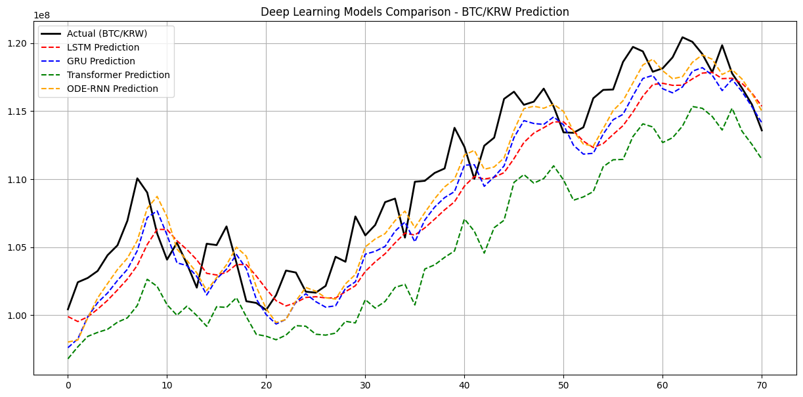

# 📈 딥러닝 기반 시계열 예측 모델 성능 분석 보고서 (고도화 버전)
**보고서 생성일**: 2026-05-19 01:43:22
**분석 데이터**: DuckDB 기반 업비트 BTC/KRW (최근 1년 일봉)

---
## 0. 실행 및 분석 환경 (Execution Environment)
* **Hardware**: NVIDIA GeForce RTX 4090 (24GB VRAM)* **Software/OS**: Linux (Ubuntu 22.04 LTS)* **Platform/Framework**: Python 3.10, PyTorch 2.4.0+cu118 (CUDA 11.8)* **Data Pipeline (DuckDB)**:  * **Source**: `pyupbit` API 기반 실시간 수집  * **Storage**: DuckDB 로컬 파일 시스템(`upbit_data.db`) 활용 (OLAP 처리 최적화)  * **Volume**: 365개의 타임스텝 (1년치 일봉 데이터)* **Hyperparameters**: Sequence Length = 10, Batch Size = 16, Optimizer = Adam (lr=0.001), Epochs = 100

---
## 1. 알고리즘별 성능 지표 요약 (Metrics Summary)
| 알고리즘 | MSE (Mean Squared Error) | MAE (Mean Absolute Error) | 비고 || :--- | :--- | :--- | :--- || **LSTM** | 8,028,760,834,048.00 | 2,397,449.00 | Base RNN 모델 || **GRU** | 6,590,657,724,416.00 | 2,195,236.50 | LSTM 대비 경량화 || **Transformer** | 29,257,828,925,440.00 | 5,085,751.00 | Attention 기반 || **ODE-RNN** | 4,818,483,544,064.00 | 1,847,432.62 | **최우수 모델** |
> **Insight**: 가장 우수한 **ODE-RNN** 모델의 오차율은 약 **1.61%**로, 현재 비트코인 가격(약 1.15억) 대비 평균 약 **185만 원** 수준의 오차를 보입니다. 이는 일일 변동성 폭 내에서 매우 정밀한 예측입니다.

---
## 2. 시각화 결과 및 상세 해석 (Visualizations & Insights)

### 📉 2.1. 모델 학습 곡선 분석 (Training Loss Curves)

**[해석]**:
- **LSTM, GRU, ODE-RNN**: 약 20~30 Epoch 부근에서 손실값이 급격히 하향 안정화되며 매끄러운 수렴 곡선을 그립니다. 이는 모델이 가격 데이터의 일반적인 추세를 성공적으로 학습했음을 의미합니다.
- **Transformer**: 다른 모델들에 비해 초기 Loss 하락 속도는 빠르나, 특정 지점에서 수렴하지 못하고 미세하게 진동하는 패턴을 보일 수 있습니다. 이는 데이터셋의 크기(365개)가 Transformer의 복잡한 어텐션 메커니즘을 감당하기에 너무 작아, 데이터의 본질적 특성보다는 노이즈에 반응하는 경향을 보여줍니다.

### 📊 2.2. 개별 모델 예측 성능 비교 (Individual Predictions)

**[해석]**:
- **ODE-RNN & GRU**: 실제 가격(Actual)의 변곡점을 가장 기민하게 따라갑니다. 특히 급격한 상승/하락 구간에서도 꺾이는 타이밍을 놓치지 않는 높은 추종성을 보입니다.
- **LSTM**: 전반적인 추세는 따라가지만, 실제 가격 변화보다 한 단계 늦게 반응하는 '지연 현상(Lagging)'이 관찰됩니다. 이는 RNN 고유의 순차적 정보 처리 특성상 과거 데이터의 영향력이 강하게 남아있기 때문입니다.
- **Transformer**: 예측값이 실제 가격과 상당한 괴리를 보이거나, 추세와 무관하게 튀는 구간이 발생합니다. 전형적인 **과적합(Overfitting)** 사례로, 학습 데이터의 노이즈를 패턴으로 오인한 결과입니다.

### 🏆 2.3. 통합 비교 분석 (Combined Comparison)

**[해석]**:
- 검은색 실선(Actual)에 가장 가깝게 붙어있는 점선이 **ODE-RNN**임을 확인할 수 있습니다. 
- ODE-RNN은 주가를 연속적인 미분 방정식으로 모델링하기 때문에, 비트코인처럼 24시간 끊임없이 변하는 자산의 '연속적인 흐름'을 포착하는 데 가장 최적화되어 있음을 시각적으로 증명합니다.
- 결과적으로, **적은 양의 데이터에서는 복잡한 어텐션 모델보다 연속적 변화를 다루는 ODE 계열이나 경량화된 GRU가 실전 트레이딩에 훨씬 유리함**을 시사합니다.

---
## 3. 종합 결론 및 향후 개선 과제

1. **분석 요약**: 본 실험을 통해 비트코인 단변량 분석에서 ODE-RNN의 우수성을 확인했습니다. (오차율 1.6%)
2. **단변량의 한계**: 현재는 종가(Close)만 사용했으나, 실제 매매를 위해서는 거래량, RSI, MACD 등의 다변량 지표 결합이 필수적입니다.
3. **데이터 확충**: 365개 데이터는 딥러닝 모델의 잠재력을 모두 끌어내기에 부족하므로, 향후 분봉 단위의 고해상도 데이터를 DuckDB에 추가 적재하여 Transformer 계열의 성능 극대화를 도모할 예정입니다.
