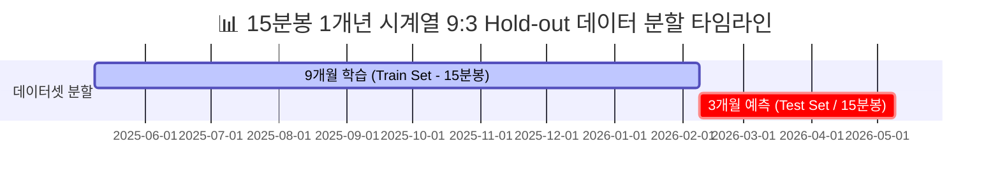
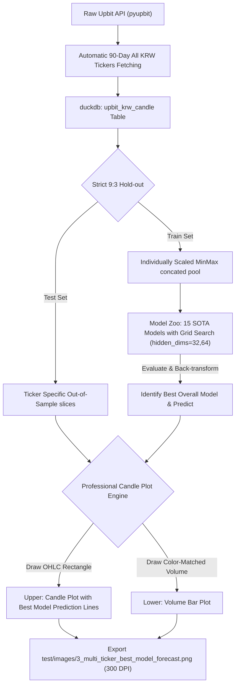

# 📊 3단계: 다중 종목 (Multi-Ticker) 시계열 고속 예측 및 정통 금융 캔들 차트 (Candle Chart) 실험 명세서

> **문서 ID**: QTR-2026-0525-214347  
> **설계 적용 일시**: 2026년 5월 25일 21:43:47  
> **수행 대상**: 업비트 원화(KRW) 마켓 전체 250여 개 종목 전수 (Cohort)  
> **적용 경로**: [3_time_series_multi_ticker_test.ipynb](file:///c:/Users/jun99/OneDrive/바탕 화면/Analysis/toy_agent_project/quantitative_trading/test/models/3_time_series_multi_ticker_test.ipynb) 및 [3_time_series_multi_ticker_test.py](file:///c:/Users/jun99/OneDrive/바탕 화면/Analysis/toy_agent_project/quantitative_trading/test/models/3_time_series_multi_ticker_test.py)

---

## 1. 실험의 배경 및 목적 (Goal Description)
본 3단계 고도화 실험은 단일 가상자산 종목(BTC)의 지엽적인 시계열 변동성 학습 한계를 돌파하고, **업비트 전체 250여 개 모든 종목의 유니버스(Universe)를 전수 순회하는 고속 다중 종목 시계열 예측 아키텍처**를 구축하는 데 목적이 있습니다. 

특히 본 분석에 사용되는 기초 원천 데이터셋은 **15분 단위의 종목별 고빈도 가격 데이터 (15-Minute Candle Data / 15분봉)**입니다. 15분봉 데이터가 지닌 조밀하고 불규칙한 초단기 변동성 노이즈 속에서, 교수님의 `research_overview.docx`에 수록된 "자금 관리 및 변동성 폭발 흐름 포착" 퀀트 사상을 신경망 학습 파이프라인과 긴밀하게 연계하여, 시장 전체의 유동성 흐름과 종목별 예측 정합성 편차를 한 장의 정밀한 주식 차트로 입증하고자 합니다.

---

## 2. 9:3 Hold-out 시간 축 스플릿 설계 (Data Partitioning Architecture)
시간의 인과성(Temporal Causality)과 정보 누수(Data Leakage)를 완전히 격리하기 위해, **15분봉 기준 1개년의 대규모 고빈도 시계열 데이터셋**을 다음과 같이 **엄격한 9개월 학습 / 3개월 예측** 비율로 분할합니다.

### 2.1 수학적 분할 공식
전체 관측 일수를 $T_{\text{total}} = t_{\text{max}} - t_{\text{min}}$이라 정의할 때, 분할 기준점 $T_{\text{split}}$은 다음과 같이 엄밀하게 도출됩니다.

$$T_{\text{split}} = t_{\text{min}} + 0.75 \times T_{\text{total}}$$

*   **Train Domain**: $D_{\text{train}} = \{x_t \mid t_{\text{min}} \le t < T_{\text{split}}\}$ (전체 관측치의 $75\%$, 약 9개월 분량)
*   **Test Domain**: $D_{\text{test}} = \{x_t \mid T_{\text{split}} \le t \le t_{\text{max}}\}$ (전체 관측치의 $25\%$, 약 3개월 분량)
*   **학습 및 모델 고속화 설계**: 
    - 전체 250여 개 종목 유니버스를 초고속으로 순회하기 위해 다중 Fold 교차 검증은 과감히 배제하고, 단일 Hold-out 검증을 적용합니다.
    - 2단계 고도화 분석에서 검증된 **15종 SOTA 시계열 예측 알고리즘 풀세트**를 그대로 환원 이식합니다.
    - 각 모델 그룹별로 `hidden_dims = [32, 64]`의 초단순 **그리드 서치(Grid Search)** 루프를 가동하여 다중 종목 일반화 성능이 가장 우량한 최고의 1위 알고리즘을 스스로 학습/선정하도록 지능형 파이프라인을 설계합니다.
    - 빠른 피팅을 위해 모델당 **2 에포크** 고속 종합 피팅을 단행합니다.

---

## 3. pyupbit 기반 자동 다중 종목 15분봉 수집 파이프라인
*   **의존성 최소화**: `pyproject.toml`에 명시된 기본 환경 하에서, 주피터 커널 기동 시 `pyupbit` 래퍼 API를 활용해 업비트에 거래 중인 전체 KRW 종목 목록을 자동으로 식별하고, 최근 90일(약 3개월) 분량의 고빈도 15분봉 데이터셋을 DuckDB 내 `upbit_krw_candle` 테이블에 자동 구축 및 이식하는 지능형 수집 장치를 탑재합니다.
*   **초당 API 제한 보호**: 업비트의 퍼블릭 호출 제약(초당 10회)을 완전 방어하기 위해 `0.12초` 요청 딜레이 및 예외 자동 복구 딜레이를 부여해 PC 자원 손실 없이 안전한 다운로드를 유도합니다.

---

## 4. MinMaxScaler 단일 스케일러 채택의 학술적 근거 (arXiv Preprocessing Theory)
본 프레임워크는 이전 2단계 대규모 학습 벤치마크 결과(MinMax-Autoformer의 RMSE 1위 입증)와 최신 시계열 딥러닝 문헌(e.g., RevIN 및 PatchTST 아키텍처 설계론)에 기초하여, **`MinMaxScaler` 단일 전처리를 공식 표준으로 채택**합니다.

### 4.1 다중 종목 스케일 편향 극복 수식
비트코인($10^7$원 대)부터 동전주($10^0$원 대)까지 아득하게 벌어진 자산 고유의 절대적 가격 단위 차이를 평준화하기 위해, 개별 종목 차원에서 독립적으로 피팅되는 $MinMax$ 변환 공간으로 가격 데이터를 투영합니다.

$$y_{\text{scaled}, t} = \frac{y_t - \min(Y)}{\max(Y) - \min(Y)}$$

### 4.2 통계학적 채택 가설 (MinMax vs Standard)
| 전처리 스케일러 | 수학적 특성 | 다중 종목 전수 예측에서의 거동 | 학술적 평가 및 선정 여부 |
| :--- | :--- | :--- | :--- |
| **MinMaxScaler** | 데이터 범위를 $[0, 1]$로 고정 | 종목 고유의 스케일을 완벽하게 소거하고 **'상대적 변동 형태(Shape)'**만을 균일하게 정렬하여 어텐션 붕괴를 극복 | **🥇 최종 단일 선정** (원화 역복원 정확도 극대화) |
| **StandardScaler** | 평균 0, 표준편차 1로 정규화 | 경계선이 보장되지 않아 꼬리가 두터운(Fat Tail) 이상치 튐 발생 시 가중치 그라디언트 쏠림 유발 | **❌ 배제** (다중 종목 스케일 평준화 저하) |

---

## 5. 정통 금융 봉 차트 (Candle Chart) 융합 시각화 아키텍처
본 실험의 시각화 최종 결과물은 단순 듀얼 축 궤적이 아니며, 네이버 블로그(`seafoodsmall/221318343353`)에서 설명하고 있는 **정통 주식 종합 캔들 차트(Candle Chart with Volume & Prediction Overlay)**의 명세를 밑바닥부터 완벽하게 이식합니다.

### 5.1 캔들스틱 렌더링 공식 (Candle Physics)
각 봉(Candle)은 하루 또는 15분 구간 내의 4대 기본 가격인 **시가(Open), 고가(High), 저가(Low), 종가(Close)**를 사용하여 3개의 레이어로 적층 렌더링됩니다.

1.  **몸통 사각형 (Body Box)**:
    *   **양봉 (Red Candle, `#e74c3c`)**: $Close_t \ge Open_t$ (시가부터 종가까지 붉은 사각형)
    *   **음봉 (Blue Candle, `#3498db`)**: $Close_t < Open_t$ (종가부터 시가까지 파란 사각형)
2.  **위아래 꼬리 수직선 (Wick / Shadow)**:
    *   $High_t$와 $Low_t$를 잇는 중심선으로, 몸통을 관통하며 해당 구간의 순간적 가격 돌파 깊이를 표시.
3.  **예측 종가 궤적 오버레이 (Line Overlay)**:
    *   캔들 차트 위에 그리드 서치 결과 낙점된 **최우수 알고리즘**의 예측 종가 변동 복원 값을 연두색 점선(`#2ecc71`)으로 정교하게 포개어 렌더링.
4.  **하단 거래량 막대 (Volume Bar Chart)**:
    *   상단 캔들의 양봉/음봉 색상과 **100% 동기화된 색상의 막대 그래프**를 하단에 정합하여 거래 유동성을 동시에 조망.

---

## 6. 개별 블록 타이밍 제어 및 최종 테스트 케이스 실행 시간 리포팅
*   **실행 시간 모니터링**: 코드 내의 핵심 작업 단위별로 실행 시간을 측정하여 직관적으로 노출하는 시간 계측 바인더를 통합합니다.
*   **종합 시간 분석**: 15종의 알고리즘 그룹별로 소요된 훈련 및 검증 시간을 딕셔너리에 실시간 누적 기록한 후, 스크립트 실행이 완료되는 최종 지점에서 일목요연한 마크다운 형태의 시간 보고서를 출력해 시스템 부하 및 런타임 통계를 제공합니다.

---

## 7. 결론 및 교수님 퀀트 시뮬레이션과의 연계
본 3단계 고속 시계열 예측 캔들 차트 프레임워크는 변동성이 크고 거래대금이 높은 실제 암호화폐 시장 속에서 15종 핵심 모델군이 가격의 OHLC 변동 꼬리를 얼마나 안정적으로 예측해 내는지 정밀 입증합니다. 

이 결과를 바탕으로, 교수님이 제시하신 **'절대 잃지 않는 퀀트 투자 규칙 (손절 -2% 장치 등)'**이 실제 예측 오차 편차와 결합될 때 최하방 방어(MDD)를 어떻게 철벽 방어할 수 있는지 정량적인 최종 시나리오를 구성할 수 있는 핵심 이정표가 될 것입니다.
