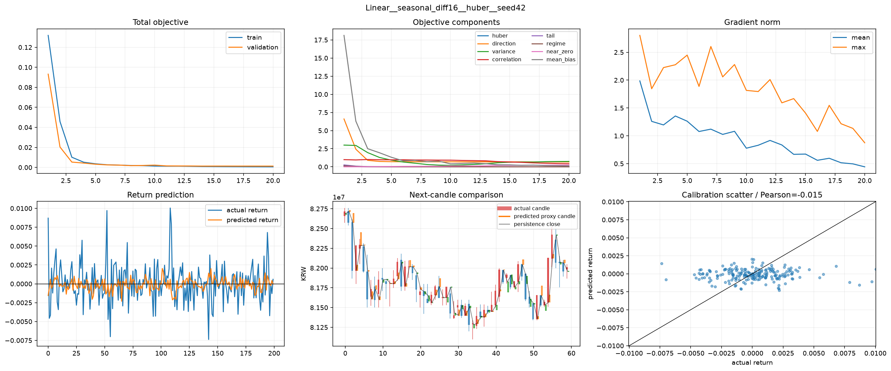
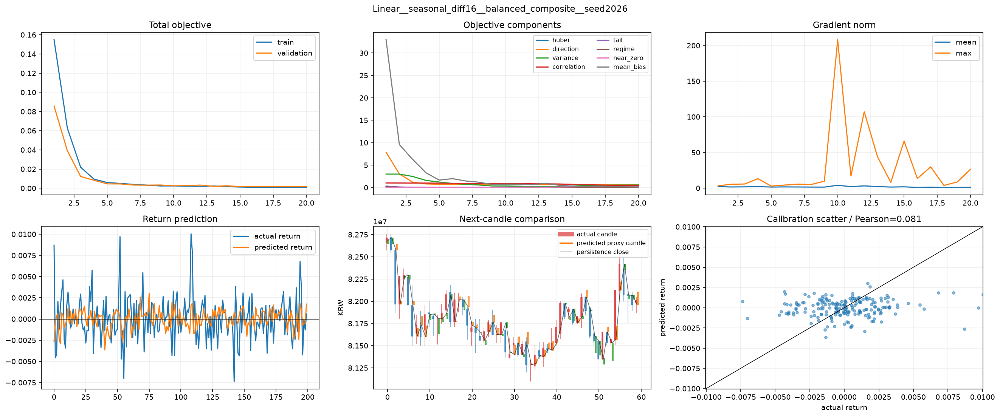
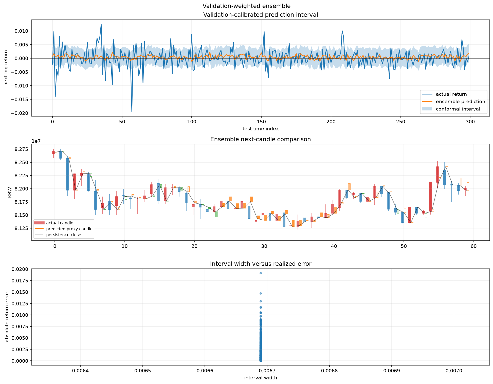
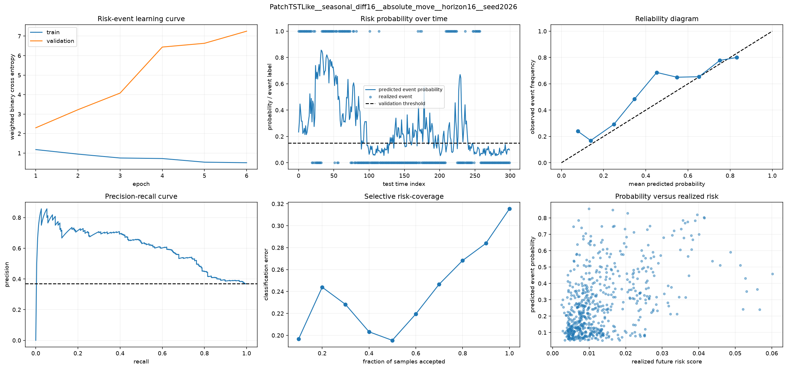
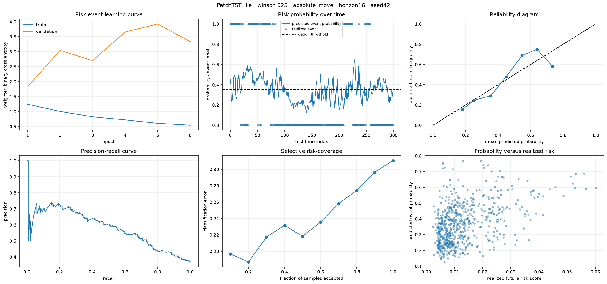
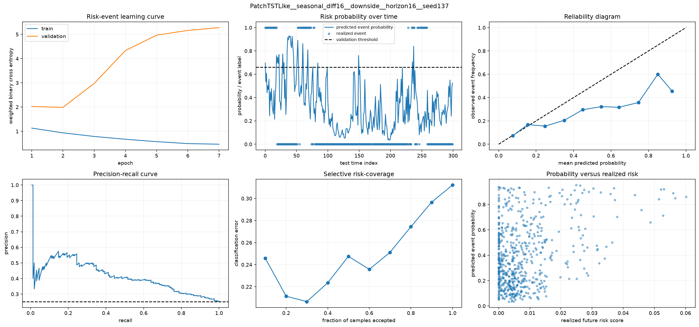

# 10·11번 종합 비교: 점예측보다 위험 게이트를 먼저 구현해야 한다

## 1. 기술 요약

10번과 11번은 같은 문제를 두 방향에서 풀었다.

- 10번은 다음 15분 수익률을 하나의 숫자로 예측하는 `point forecast`를 개선했다.
- 11번은 향후 4시간 안에 큰 움직임이 나타날 확률을 예측하는 `risk-event forecast`를 검증했다.

두 결과를 함께 보면 다음 결론이 나온다.

1. 10번의 `balanced_composite`와 validation-only ensemble은 0수익률 평탄화를 줄였지만 persistence를 넘지 못했다. 따라서 아직 독립적인 매매 알파로 사용하기 어렵다.
2. 11번의 `PatchTSTLike + absolute_move`는 Average Precision, Brier skill, selective error에서 발생률 기준선을 넘었다. 따라서 현재 바로 구현할 수 있는 것은 가격 목표값이 아니라 위험 확률을 이용한 진입 제한과 포지션 축소다.
3. 다음 실험은 또 다른 모델·전처리 목록을 늘리는 실험이 아니라, **11번 위험 확률이 낮은 구간에서만 10번 점예측을 허용했을 때 MDD와 거래 성과가 개선되는지** 확인해야 한다.

따라서 다음 번호의 권장 연구 질문은 다음과 같다.

> 전체 구간에서는 persistence를 이기지 못한 점예측도, 급변 위험이 낮고 모델 간 방향 합의가 있는 구간만 선택하면 거래비용 이후 유용한 신호가 되는가?

## 2. 두 실험이 측정한 것은 서로 다르다

### 2.1 10번: 다음 값을 얼마나 잘 맞히는가

점예측은 다음 수익률을 `+0.2%`, `-0.1%`처럼 하나의 숫자로 낸다. 이 방식은 예상 방향과 크기를 직접 주므로 주문 방향과 목표 수익률에 연결하기 쉽다.

그러나 금융 시계열에서는 현재 가격을 다음 가격으로 그대로 복사하는 `persistence`가 강한 기준선이다. 현재 비트코인이 1억 원이면 다음 15분도 1억 원이라고 예측하는 방식이다. 복잡한 모델의 원화 MAE가 이보다 크면, 모델이 추가 정보를 학습했다고 보기 어렵다.

10번의 persistence MAE는 약 `190,608원`이었다. 상위 단일 balanced 후보의 MAE는 약 `201,939~215,909원`, simple-mean ensemble은 `194,771원`이었다. ensemble이 단일 모델보다 가까워졌지만 copy-risk ratio가 `1.022`여서 여전히 persistence보다 약 2.2% 나빴다.

### 2.2 11번: 위험한 구간의 순서를 얼마나 잘 나누는가

위험 이벤트 예측은 가격을 직접 맞히지 않는다. 대신 향후 4시간에 큰 움직임이 발생할 확률을 `0~1`로 낸다.

예를 들어 `0.75`가 나온 구간이 `0.20` 구간보다 실제로 더 자주 급변했다면, 정확한 가격을 몰라도 포지션 축소나 신규 진입 차단에 사용할 수 있다.

11번의 가장 강한 `absolute_move` 후보는 AP `0.608`, 발생률 대비 AP lift `1.648`, Brier skill `0.321`을 기록했다. 이는 항상 평균 발생률만 말하는 기준선보다 사건 순위와 확률 오차가 모두 나아졌다는 뜻이다.

## 3. 10번은 쉬운 해를 줄였지만 독립 신호에는 미달했다

### 3.1 Huber의 낮은 손실은 실제 변동 학습을 보장하지 않았다



이 그림의 아래 왼쪽에서 파란색은 실제 수익률, 주황색은 예측 수익률이다. 예측은 실제보다 0 근처에 좁게 모이고 Pearson 상관은 `-0.015`다. 위쪽 학습 손실은 안정적으로 감소하지만 실제 방향·크기 관계는 거의 없다.

따라서 낮은 validation loss만으로 모델을 고르면 다시 평탄화된 쉬운 해를 선택할 수 있다.

### 3.2 Balanced objective는 필요한 움직임을 더 남겼다



`balanced_composite`는 Huber 오차뿐 아니라 방향, 분산, 상관, tail, regime, 0 근처 집중과 평균 편향을 함께 제어한다. 위 사례는 direction accuracy `52.85%`, variance ratio `0.108`이다.

예측 진폭과 방향 정보가 Huber 사례보다 더 남았다는 점은 긍정적이다. 그러나 Pearson 상관은 `0.081`이고 variance ratio도 1보다 크게 작다. 실제 변동 폭의 약 10.8% 수준만 재현했다는 뜻이므로, 이 신호를 전 구간에서 그대로 매매하는 것은 이르다.

### 3.3 앙상블은 안정화했지만 급변을 설명하지 못했다



validation-only ensemble은 MAE를 단일 balanced 후보보다 줄였다. 하지만 주황색 예측선은 실제 급등락보다 훨씬 좁고, conformal interval 폭도 거의 일정하다. 아래 산점도가 하나의 수직선처럼 보이는 이유가 이것이다.

따라서 현재 앙상블은 노이즈를 줄이는 평균화 장치로는 유효하지만, 시장 상태에 따라 불확실성이 달라지는 동적 위험 모형은 아니다.

## 4. 11번은 바로 위험 필터로 시험할 근거를 만들었다

### 4.1 Absolute move는 기준선보다 위험 구간을 잘 정렬했다



가운데 위 그래프에서 x축은 test 시간 순서, y축은 위험 확률이다. 실제 이벤트가 몰린 구간에서 예측 확률이 올라가는 군집이 나타난다. 왼쪽 아래 precision-recall 곡선은 발생률 기준선보다 대부분 위에 있다.

이 모델은 모든 사건을 정확히 맞힌 것은 아니지만, 위험도가 높은 순서로 표본을 정렬하는 능력이 있다. 특히 가장 확신하는 50% 표본만 선택했을 때 분류 오류가 전체 오류 `0.429`에서 `0.195`로 줄었다. 이는 선택적 의사결정에 직접 활용할 수 있는 신호다.

### 4.2 최고 AP와 최고 calibration 후보를 결합하는 편이 낫다



`seasonal_diff16 + seed2026`은 AP가 가장 높았고, `winsor_025 + seed42`는 ECE `0.047`로 확률 보정이 가장 좋았다. 최고 순위 모델과 가장 믿을 수 있는 확률 모델이 다르므로 하나만 택하기보다 validation 기반 seed/preprocessing ensemble을 구성하는 편이 합리적이다.

여기서 calibration은 "예측 확률 70%인 표본에서 실제 사건도 약 70% 발생하는가"를 뜻한다. 순위가 좋아도 calibration이 나쁘면 운영 임계값을 정하기 어렵다.

### 4.3 Downside는 아직 핵심 신호로 쓰기 어렵다



`downside`는 큰 움직임 전체를 보는 `absolute_move`보다 표본이 적고 방향 조건이 추가되어 어렵다. 위 reliability diagram은 고확률 구간에서 실제 발생률보다 확률을 높게 말하는 과신을 보여준다.

따라서 현재 단계에서 downside 확률은 방향을 결정하는 주 신호가 아니라, 매우 높을 때 long 진입을 막는 보조 경고로만 시험해야 한다.

## 5. 두 실험의 종합 판정

| 판단 항목 | 10번 점예측 | 11번 위험 이벤트 | 종합 판단 |
|---|---|---|---|
| 핵심 목표 | 다음 15분 수익률의 방향과 크기 | 향후 4시간 급변 확률 | 서로 대체하지 않고 결합 가능 |
| 기준선 | persistence MAE | event prevalence/climatology | 11번만 핵심 기준선을 명확히 넘음 |
| 가장 강한 후보 | balanced objective + ensemble | PatchTSTLike + absolute_move | 위험 모델을 우선 구현 |
| 즉시 사용 가능성 | 단독 매매 신호로는 낮음 | 진입 제한·포지션 축소용으로 있음 | risk gate부터 shadow test |
| 주요 약점 | 낮은 분산, 약한 상관, persistence 미달 | 과적합 학습 곡선, 확률 보정 차이 | validation calibration과 walk-forward 필요 |
| 연구 가치 | 조건부 알파 후보 | 위험 상태 탐지 후보 | 결합 시 새로운 검증 질문이 생김 |

## 6. 지금 적용할 수 있는 구현

### 6.1 운영이 아니라 shadow risk gate로 먼저 사용한다

현재 11번 결과는 실제 주문을 자동 실행할 정도의 최종 검증은 아니다. 그러나 실시간 또는 과거 재생 환경에서 주문에 영향을 주지 않고 다음 값을 기록하는 `shadow mode`에는 충분히 올릴 수 있다.

- 현재 시점의 `absolute_move_probability`
- validation에서 고정한 위험 임계값
- 실제 4시간 뒤 이벤트 발생 여부
- 위험 경보가 있었을 때와 없었을 때의 MDD·손실·변동성

이 기록으로 확률 보정이 기간이 바뀌어도 유지되는지 확인한다.

### 6.2 10번 신호는 조건부로만 허용한다

10번 point ensemble은 전 구간에서 persistence를 이기지 못했다. 따라서 "예측값이 양수면 매수"처럼 바로 쓰면 안 된다.

대신 다음 조건을 모두 만족할 때만 후보 신호로 남긴다.

1. 11번 absolute-move 위험 확률이 낮다.
2. 10번 ensemble 구성원 다수가 같은 방향을 낸다.
3. 예측 수익률 절댓값이 수수료와 슬리피지에 안전 마진을 더한 값보다 크다.
4. 최근 데이터가 validation 시점의 분포에서 크게 벗어나지 않는다.

이 구조는 10번을 성공한 가격 예측기로 간주하지 않는다. 위험이 낮은 일부 구간에서만 약한 방향 정보가 살아나는지 검증하는 장치다.

### 6.3 위험 확률은 포지션 크기에 연결한다

long-only 현물 전략에서는 다음과 같은 단순 정책부터 검증할 수 있다.

| absolute-move 위험 | point 방향 합의 | 후보 행동 |
|---|---|---|
| 낮음 | 양수이고 비용 초과 | 정상 크기 진입 후보 |
| 중간 | 양수 | 절반 크기 또는 관망 |
| 높음 | 어떤 방향이든 | 신규 진입 금지, 기존 포지션 축소 후보 |
| 매우 높음 + downside 경고 | 어떤 방향이든 | 방어적 청산/현금 비중 확대 후보 |

임계값은 test 결과로 고르면 안 된다. validation 구간에서 고정하고 test와 후속 기간에는 그대로 적용해야 한다.

## 7. 다음 실험: 12번 risk-gated decision fusion

### 7.1 연구 질문

12번은 모델 종류를 다시 넓히는 실험이 아니다. 10번과 11번에서 살아남은 신호를 실제 의사결정 단위로 결합한다.

핵심 가설은 다음과 같다.

> 위험 확률이 낮은 구간만 선택하면, 전체 표본에서는 persistence에 미달한 point forecast도 비용 이후 방향 신호와 MDD 방어에 기여할 수 있다.

### 7.2 고정할 모델

- point branch: 10번의 `balanced_composite` 기반 Linear/PatchTSTLike 후보와 validation-only ensemble
- risk branch: 11번의 PatchTSTLike `absolute_move` 후보를 seed·preprocessing ensemble로 결합
- downside branch: 진입 방향 신호가 아니라 보조 hard-risk veto

새 알고리즘은 추가하지 않는다. 지금 필요한 것은 알고리즘 폭이 아니라 결합 효과의 검증이다.

### 7.3 반드시 비교할 정책

1. `Buy & Hold`
2. `No Trade`
3. 기존 규칙 기반 전략
4. point forecast만 사용
5. risk gate만 사용
6. point forecast + risk gate 결합
7. point forecast + risk gate + downside veto

이 비교가 있어야 위험 모델이 수익을 만든 것인지, 단순히 거래를 줄여 손실만 피한 것인지 구분할 수 있다.

### 7.4 평가 지표

예측 지표와 거래 지표를 분리해 기록한다.

- point branch: MAE, persistence 대비 MAE, direction accuracy, variance ratio
- risk branch: Average Precision, AP lift, Brier skill, ECE, selective error
- 전략 branch: 누적수익률, MDD, Sortino ratio, 거래 횟수, turnover, 수수료·슬리피지, 손실 회피율

이 프로젝트의 최종 목적이 하방 방어이므로 12번의 1차 판단 기준은 최고 수익률이 아니라 `MDD 개선`이다. 다만 거래를 거의 하지 않아 MDD만 낮춘 정책은 성공으로 보지 않고, 거래 수와 기회비용을 함께 제시해야 한다.

### 7.5 실험 설계

- 시간 순서를 지키는 walk-forward split을 사용한다.
- train에서 학습하고 validation에서 모델·임계값·확률 보정을 고정한다.
- test는 최종 평가에만 사용한다.
- 10번과 11번의 예측 horizon이 다르므로, 15분 point signal을 4시간 risk state 안에서 어떻게 집계하는지 명시한다.
- 수수료 0.05%와 슬리피지 0.02%를 진입·청산 양쪽에 반영한다.
- 확률 임계값과 position-size 규칙은 test 결과를 보고 수정하지 않는다.

### 7.6 통과 기준

다음 조건을 동시에 보는 것이 적절하다.

- risk branch가 여러 seed 또는 walk-forward fold에서 AP lift `> 1`, Brier skill `> 0`을 유지한다.
- 결합 정책의 MDD가 point-only와 기존 규칙 기반 전략보다 감소한다.
- 수익률 개선이 거래 횟수 0에 가까운 극단적 회피로 만들어지지 않는다.
- 수수료·슬리피지 이후에도 point-only보다 손익 또는 Sortino가 개선된다.
- 위험 확률이 높을수록 실제 손실·변동 이벤트가 단조롭게 증가한다.

이 기준을 통과하면 11번 위험 모델은 실제 서비스의 `risk control layer`로 승격할 수 있다. 통과하지 못하면 point forecast 결합을 중단하고 위험 알림·모니터링 전용 서비스로 범위를 줄이는 것이 맞다.

## 8. 구현 구조 권고

연구 노트북에서는 12번 새 번호로 실험하되, 검증 후 운영 코드로 옮길 때는 역할을 분리한다.

```text
feature mart
  -> point predictor (10번 계열)
  -> risk predictor (11번 계열)
  -> probability calibrator
  -> decision fusion policy
  -> transaction-cost-aware backtest
  -> MDD / calibration monitor
```

`point predictor`는 기대 방향과 크기를, `risk predictor`는 급변 가능성을 제공한다. `decision fusion policy`가 두 값을 받아 진입·축소·관망을 결정한다. 모델이 직접 주문까지 결정하게 두지 않는 이유는 예측 성능과 위험 관리 규칙을 따로 검증하고 교체할 수 있게 하기 위해서다.

## 9. 한계와 아직 남은 질문

- 10번의 최고 후보는 전체 test 기준으로 persistence를 넘지 못했다.
- 11번 risk-event 모델은 학습 후반 validation loss가 커져 early stopping 의존도가 높다.
- 11번의 이벤트 발생률이 test에서 약 36.9%로 train event rate 약 10%보다 크게 달라졌다. 임계값 정의나 시기별 시장 상태 변화가 원인인지 점검해야 한다.
- absolute move는 방향을 알려 주지 않으므로 point signal 또는 downside veto와 결합해야 한다.
- 현재 conformal interval은 폭이 거의 고정되어 있어 동적 포지션 크기 결정에 바로 쓰기 어렵다.

특히 train과 test의 event rate 차이는 다음 실험에서 반드시 진단해야 한다. 이 차이를 무시하면 좋은 AP가 단순한 시장 국면 변화에 의존했을 가능성을 놓칠 수 있다.

## 10. 최종 결정

다음 실험은 10번의 objective를 더 늘리거나 11번의 모델군을 다시 넓히는 방향이 아니다.

- 10번의 point forecast는 `조건부 방향 신호`로 제한한다.
- 11번의 absolute-move probability는 `위험 게이트`로 우선 구현한다.
- 두 신호를 결합한 12번 walk-forward·거래비용·MDD 실험으로 연구를 예측 정확도 단계에서 의사결정 검증 단계로 이동한다.

이 전환이 중요하다. 7~11번이 "왜 모델이 무너지는가"와 "어떤 출력은 살아남는가"를 찾는 과정이었다면, 12번은 살아남은 출력이 실제 하방 방어에 가치가 있는지 처음으로 검증하는 단계다.
