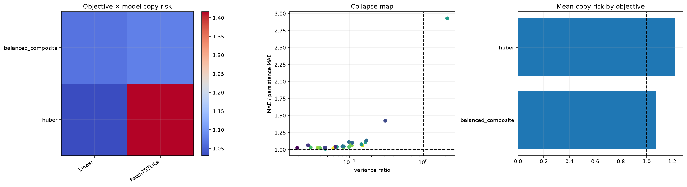

# 10번 objective·ensemble 본실험 결과 보고서

## 1. 결론부터

10번 실험은 9번에서 선별한 전처리 후보를 고정한 뒤, 손실함수의 구성과 seed/validation ensemble이 `persistence` 미달, 0수익률 평탄화, 출력 분산 붕괴를 줄이는지 확인한 본실험이다.

핵심 결론은 다음과 같다.

- `balanced_composite` objective는 `huber`보다 훨씬 덜 무기력한 예측을 만들었다.
- `Linear`와 `PatchTSTLike`는 둘 다 완전한 해결책은 아니지만, `huber` 기준군보다 방향성과 분산을 더 많이 남겼다.
- validation-only ensemble은 단일 모델보다 조금 더 안정적이었지만, persistence를 명확히 이기지는 못했다.
- 따라서 10번은 "문제를 해결했다"가 아니라, "어떤 objective와 조합이 다음 branch의 출발점이 되는가"를 좁힌 실험이다.

즉 10번의 성과는 최고 성능 숫자 하나가 아니라, `huber`의 쉬운 해를 더 이상 기본값으로 쓰지 않아도 된다는 점을 확인한 것이다.

## 2. 왜 10번을 수행했는가

9번에서는 전처리를 아무리 바꾸어도 두 실패 유형이 계속 분리되어 나타났다.

- `TimesNetLike`는 거의 0수익률만 내놓는 평탄화 쪽으로 갔다.
- `AutoformerLike`는 실제보다 훨씬 큰 진폭을 내는 폭주 쪽으로 갔다.
- `Linear`와 `PatchTSTLike`는 그 중간에 있었지만 persistence를 넘지 못했다.

이제 남은 질문은 입력 표현만이 아니라 목적함수와 모델 조합이다. 같은 전처리라도 어떤 loss 항을 강조하느냐에 따라 모델이 `직전가 복사`, `0 근처 평탄화`, `과도한 변동 생성` 중 어느 쪽으로 기울지 달라질 수 있다. 10번은 이 축을 확인하기 위한 실험이다.

## 3. 핵심 용어

### 3.1 Persistence

`persistence`는 다음 가격을 현재 가격과 같다고 예측하는 가장 단순한 기준선이다.

예를 들어 현재 가격이 1억 원이면 다음 15분 가격도 1억 원이라고 보는 방식이다. 수익률로 바꾸면 다음 수익률을 항상 0으로 예측하는 것과 같다.

이 연구에서는 persistence가 중요한 이유가 있다. 금융 가격은 인접 시점끼리 매우 비슷해서, 복잡한 모델이라도 이 기준선보다 나아야 "직전가 복사 이상의 정보"를 학습했다고 말할 수 있다. 이번 10번에서도 persistence를 못 넘는 조합이 여전히 남았기 때문에, 좋은 신호이지만 충분한 성공은 아니다.

### 3.2 Copy-risk ratio

`copy-risk ratio`는 다음처럼 계산한다.

```text
모델 MAE / persistence MAE
```

- 1 미만이면 persistence보다 낫다.
- 1이면 persistence와 같다.
- 1보다 크면 복잡한 모델이 단순 기준선보다 나쁘다.

10번의 상위 조합은 이 값이 1.008~1.13 부근에 모여 있었다. 즉 쉬운 해를 벗어나기는 했지만, 아직 기준선을 안정적으로 앞서지는 못했다.

### 3.3 Direction accuracy

`direction_accuracy`는 실제 다음 수익률의 부호와 예측 부호가 같은 비율이다.

예를 들어 실제가 `+`인데 예측도 `+`면 맞힌 것이다. 50%는 동전 던지기와 비슷한 수준이다. 이번 실험에서 52~53%대는 "아주 약한 방향성 신호"로 해석해야 한다. 좋은 신호이긴 하지만 단독으로 우수성을 증명하지는 못한다.

### 3.4 Variance ratio

`variance_ratio`는 예측 수익률 분산을 실제 수익률 분산으로 나눈 값이다.

- 1에 가까우면 예측의 흔들림 폭이 실제와 비슷하다.
- 0에 가까우면 예측이 평평해진다.
- 1보다 매우 크면 예측이 과도하게 출렁인다.

10번에서 `huber` 일부 케이스는 이 비율이 너무 낮아 평탄화 쪽으로 기울었고, `balanced_composite`는 이 비율을 조금 더 남겨 정보를 보존했다. 다만 분산이 남았다는 사실이 곧바로 좋은 모델을 뜻하는 것은 아니다. 분산은 필요한 조건이지 충분한 조건이 아니기 때문이다.

### 3.5 Collapse score

이 노트북의 `collapse_score`는 평탄화와 persistence 미달 위험을 함께 보는 진단값이다. 값이 낮을수록 낫지만, 이번 정의에서는 여전히 persistence를 못 넘으면 경고가 남는다. 따라서 `collapse_score=1`은 "문제가 거의 사라졌다"가 아니라 "최소한 치명적 붕괴는 줄었다" 정도로 읽어야 한다.

## 4. 실행 환경과 데이터

| 항목 | 값 |
|---|---:|
| Python | 3.13.13 |
| PyTorch | 2.10.0+cu126 |
| CUDA | 12.6 |
| GPU | NVIDIA GeForce RTX 4090 |
| RAM | 약 15.53GB |
| 자원 프로필 | `school_4090_15gb:point_primary` |
| 데이터 테이블 | `btc_15m_advance` |
| 관측치 | 39,935 |
| 기간 | 2023-05-21 10:30 ~ 2024-07-11 11:30 |
| 15분 로그수익률 표준편차 | 약 0.002240 |
| 15분 로그수익률 첨도 | 약 22.204 |
| 결측 셀 | 0 |

첨도 22가 넘는다는 것은 수익률이 정규분포보다 훨씬 뾰족하고 꼬리가 두껍다는 뜻이다. 이런 데이터에서는 평균 오차만 줄이는 loss가 자주 0 근처 예측을 고르게 만든다. 그래서 10번은 "손실이 줄었는가"보다 "분산과 방향 정보를 얼마나 남겼는가"를 같이 본다.

## 5. 결측과 캔들 미리보기

### 5.1 missingness audit

10번은 실제 거래 데이터에서 어떤 결측이 생기는지 숨기지 않고 표로 보여준다.

- raw OHLC 결측: 0
- inferred timestamp gap: 7
- feature 생성 과정에서 떨어진 행: 65

여기서 중요한 점은 모든 결측이 같은 의미가 아니라는 것이다.

- raw OHLC 결측은 원천 데이터가 비어 있는 경우다.
- inferred timestamp gap은 실제 거래 시계열의 누락 간격이다.
- feature 생성에서 떨어진 행은 rolling window warm-up, shift tail, target alignment 같은 구조적 이유로 생긴다.

따라서 이런 구조적 tail을 억지로 보간하면 안 된다. 보간은 원천 값이 빠졌을 때나 의미가 맞을 때만 고려해야 한다. 이번 10번에서의 결측 처리는 "데이터를 메우는 것"이 아니라 "보간해야 할 것과 하면 안 되는 것을 분리하는 것"이다.

### 5.2 candle preview

10번은 예측 결과를 선그래프만으로 끝내지 않고, 다음 봉의 실제 OHLC와 예측 return으로 만든 proxy candle을 함께 보여준다.

이 preview는 실제 미래 봉을 완전히 복원한 것이 아니다. 예측 종가를 기준으로 open/high/low를 proxy로 만든 시각화다. 목적은 모델이 실제로 어떤 방향과 크기를 만들고 있는지 봉 감각으로 읽게 하는 데 있다.

- 좋은 신호: 예측 candle이 실제 candle의 방향과 대략적인 진폭을 따라간다.
- 나쁜 신호: 예측 candle이 거의 persistence와 겹치거나, 실제보다 지나치게 작거나 크다.

## 6. 실험 구조

10번의 본실험은 다음 축으로 진행됐다.

- 모델: `Linear`, `PatchTSTLike`
- objective: `huber`, `balanced_composite`
- seed: `42`, `137`, `2026`
- 전처리: `seasonal_diff16`, `winsor_025`
- ensemble: validation-only top-k, simple mean, validation-weighted, median

전체 24개 케이스를 평가했고, 그중 validation 기준으로 상위 구성원을 골라 ensemble을 만들었다. test 결과를 보고 ensemble을 고르는 방식은 사용하지 않았다. 이는 test leakage를 막기 위한 기본 규칙이다.

## 7. 상위 결과

| 순위 | 모델 | 전처리 | objective | seed | MAE(KRW) | copy-risk ratio | direction accuracy | variance ratio | 해석 |
|---:|---|---|---|---:|---:|---:|---:|---:|---|
| 1 | Linear | seasonal_diff16 | balanced_composite | 2026 | 201,939 | 1.059 | 52.85% | 0.108 | balanced objective의 대표적인 상위 후보 |
| 2 | Linear | winsor_025 | balanced_composite | 42 | 202,689 | 1.063 | 53.17% | 0.150 | 방향성은 좋지만 아직 persistence 미달 |
| 3 | PatchTSTLike | seasonal_diff16 | balanced_composite | 42 | 205,398 | 1.078 | 52.68% | 0.104 | deep backbone 중에서는 가장 안정적인 편 |
| 4 | Linear | seasonal_diff16 | balanced_composite | 42 | 205,736 | 1.079 | 51.22% | 0.146 | seed가 바뀌어도 방향성 유지 |
| 5 | PatchTSTLike | winsor_025 | balanced_composite | 2026 | 209,216 | 1.098 | 50.24% | 0.109 | 방향성은 약하지만 분산은 유지 |
| 6 | Linear | winsor_025 | balanced_composite | 2026 | 211,603 | 1.110 | 51.38% | 0.165 | balanced objective가 완전한 평탄화를 막음 |
| 7 | PatchTSTLike | seasonal_diff16 | balanced_composite | 137 | 215,909 | 1.133 | 50.41% | 0.169 | seed 간 흔들림은 남아 있음 |

ensemble 계열은 다음과 같다.

| ensemble | MAE(KRW) | copy-risk ratio | direction accuracy | variance ratio | 해석 |
|---|---:|---:|---:|---:|---|
| simple_mean | 194,771 | 1.022 | 53.17% | 0.042 | 단일 모델보다 안정적이지만 아직 기준선 미달 |
| validation_weighted | 195,252 | 1.024 | 52.36% | 0.043 | validation 기반 가중이 test leakage 없이 작동 |
| median | 195,408 | 1.025 | 50.57% | 0.050 | 극단값을 덜 타지만 방향성은 약함 |

## 8. 결과 해석

### 8.1 balanced_composite가 huber보다 낫다

10번에서 가장 중요한 비교는 `huber`와 `balanced_composite`다. `huber`는 쉽게 안정되지만, 이 데이터에서는 안정이 곧 평탄화로 이어지기 쉬웠다. 반면 `balanced_composite`는 원화 MAE를 완전히 해결하지는 못했지만, 방향성과 분산을 조금 더 남기면서 쉬운 해를 덜 택했다.

즉 이 objective는 "성공"이라기보다 "다음 번호에서 이어갈 만한 방향"이다.

### 8.2 best single model은 여전히 persistence를 넘지 못했다

상위권에서 가장 낮은 MAE는 약 201,939원이다. 8번에서 확인한 persistence MAE 약 190,608원과 비교하면 아직 더 크다. 따라서 10번은 persistence를 이겼다고 말할 수 없다.

다만 중요한 차이는 있다. 9번에서 보였던 0수익률 collapse가 10번에서는 덜했다. 예측 분산이 너무 작아지는 대신, 방향 정보와 변동성 정보가 조금 더 남았다. 연구 관점에서는 "정답을 맞췄다"보다 "무엇을 더 학습하도록 바뀌었는가"가 더 중요하다.

### 8.3 Linear와 PatchTSTLike의 역할이 다르다

`Linear`는 가장 단순한 기준선에 가깝기 때문에 해석이 쉽다. `PatchTSTLike`는 더 복잡하지만, 이번 실험에서는 극단적으로 무너지지 않고 balanced objective를 따라갔다.

- Linear의 장점: 방향과 분산을 읽기 쉽다.
- Linear의 단점: MAE가 still persistence보다 크다.
- PatchTSTLike의 장점: deep backbone 중에서는 비교적 안정적이다.
- PatchTSTLike의 단점: 역시 persistence를 뚫지는 못했다.

따라서 다음 연구에서는 Linear를 해석 기준선으로, PatchTSTLike를 대표 deep 후보로 유지하는 것이 맞다.

### 8.4 ensemble은 안정화 도구이지 만능 해결책은 아니다

validation-only ensemble은 test를 훔쳐보지 않고도 단일 모델보다 조금 더 안정적인 예측을 만들었다. 특히 simple_mean은 copy-risk ratio를 1.02까지 낮추고 direction accuracy도 53%대를 유지했다.

그러나 ensemble도 persistence보다 충분히 낮은 MAE를 만들지는 못했다. 즉 ensemble은 붕괴를 완화하는 도구이지, 목적함수 문제를 대신 해결하는 도구는 아니다.

## 9. 좋은 그래프와 나쁜 그래프

10번 노트북의 inline 그래프는 다음 기준으로 읽는다.

### 9.1 Huber는 손실이 안정되어도 예측이 평평해질 수 있다


이 그림은 `Linear + seasonal_diff16 + Huber + seed42` 결과다. 왼쪽 위의 x축은 epoch, y축은 학습 목적함수이고, 아래 왼쪽은 test 시점별 실제 수익률과 예측 수익률이다. 학습·검증 손실은 빠르게 내려가지만 예측 수익률의 주황색 선은 실제 파란색 선보다 0 근처에 훨씬 좁게 모인다. 오른쪽 아래 Pearson 상관도 `-0.015`로 사실상 선형 관계가 없다.

따라서 이 그림은 "학습이 안정적으로 끝났다"와 "실제 변동을 배웠다"가 같은 뜻이 아님을 보여준다. Huber는 큰 오차의 영향을 줄여 학습을 안정화하지만, 이 데이터에서는 작은 예측만 반복하는 쉬운 해도 허용했다.

### 9.2 Balanced objective는 변동을 더 남기지만 아직 상관이 약하다


이 그림은 `Linear + seasonal_diff16 + balanced_composite + seed2026` 결과다. Huber 사례보다 예측 수익률의 진폭이 커졌고 방향 변화도 더 많이 나타난다. 이것이 `variance ratio=0.108`, `direction accuracy=52.85%`로 이어졌다. 다만 실제 수익률과 예측 수익률의 Pearson 상관은 `0.081`로 여전히 낮고, 일부 epoch에서 최대 gradient norm이 200을 넘는 순간도 있다.

즉 balanced objective는 평탄화를 완화하는 데는 도움이 되었지만, 예측값이 실제 크기와 정확히 대응한다고 보기는 어렵다. 다음 실험에서는 이 출력을 단독 매매 신호로 쓰기보다, 위험이 낮은 구간에서만 제한적으로 사용할 가치가 있는지 확인해야 한다.

### 9.3 앙상블은 경로를 부드럽게 하지만 불확실성 폭이 거의 고정되어 있다


위 패널에서 파란색은 실제 로그수익률, 주황색은 validation-weighted ensemble 예측, 음영은 conformal interval이다. 앙상블 예측은 단일 모델보다 덜 흔들리지만 실제 급등락을 충분히 따라가지 못한다. 아래 산점도에서는 interval width가 거의 하나의 x값에 수직으로 몰려 있다. 이는 구간 폭이 시장 상황에 따라 넓어지거나 좁아지지 않고 거의 일정하다는 뜻이다.

따라서 현재 conformal interval은 평균적인 오차 범위를 표시하는 기능은 있지만, 변동성이 커지는 순간을 동적으로 알려 주는 불확실성 모형은 아니다.

### 9.4 전체 비교에서는 두 objective 모두 persistence를 넘지 못했다



왼쪽 heatmap은 objective와 모델별 평균 copy-risk ratio, 가운데는 variance ratio와 persistence 대비 MAE, 오른쪽은 objective별 평균 copy-risk ratio다. 점선 `1.0`보다 아래가 persistence를 이긴 영역인데, 평균 기준으로 Huber와 balanced composite 모두 1보다 크다. Balanced composite는 Huber보다 평균 copy-risk가 낮지만, 아직 성공 영역으로 들어오지는 못했다.

이 그림의 실용적 결론은 objective 탐색을 무한히 늘리기보다, 점예측이 유용해지는 조건부 구간을 찾거나 위험 예측과 결합해야 한다는 것이다.

### 9.5 좋은 그래프

- train/validation loss가 함께 내려가고, validation이 갑자기 뒤집히지 않는 그림
- gradient norm이 0으로 죽거나 폭발하지 않는 그림
- prediction plot에서 예측선이 0에 붙어 있지 않고 실제 방향 변화를 어느 정도 따라가는 그림
- proxy candle이 실제 candle의 방향과 대략적인 크기를 유지하는 그림
- calibration scatter가 45도선 주변에 일정 부분 모이는 그림

### 9.6 나쁜 그래프

- train loss만 빨리 줄고 test가 평평해지는 그림
- 예측이 거의 0 근처로 눌리는 그림
- 실제보다 과도하게 큰 파동을 장기간 만드는 그림
- candle preview가 실제와 거의 겹치지 않거나, 반대로 거의 완전 복사처럼 보이는 그림

이번 10번의 핵심은 나쁜 그래프를 완전히 제거한 것이 아니라, `huber`의 나쁜 그래프보다 덜 나쁜 후보를 골랐다는 데 있다.

## 10. 10번에서 확정할 수 있는 것과 없는 것

### 확정할 수 있는 것

- `balanced_composite`는 `huber`보다 쉬운 해 편향을 줄였다.
- validation-only ensemble은 test leakage 없이 안정화에 도움이 된다.
- `Linear`와 `PatchTSTLike`는 9번 이후 objective 검증을 이어갈 수 있는 대표 후보다.
- 여전히 persistence 미달이므로 다음 단계가 필요하다.

### 아직 확정할 수 없는 것

- seed가 더 늘어났을 때도 순위가 유지되는지
- 캔들 예측이 실제 운용 관점에서 충분한지
- 더 넓은 objective/normalization/loss 조합이 완전히 나은지
- 분포 예측이 point forecast보다 더 실용적인지

## 11. 다음 스텝

10번 이후에는 다음 순서가 적절하다.

1. `balanced_composite`와 `seasonal_diff16`, `winsor_025`를 1차 안정 후보로 유지한다.
2. seed를 더 늘려 재현성을 본다.
3. test 결과를 보지 않는 validation-only ensemble 규칙을 유지한다.
4. 분포 예측과 위험 이벤트 진단을 병렬로 검토한다.
5. 더 넓은 전처리나 모델을 추가하기보다, 현재 objective가 정말 쉬운 해를 줄였는지 먼저 다시 점검한다.

## 12. 최종 판단

10번은 persistence를 이긴 최종 해답이 아니다. 하지만 9번에서 드러난 전처리 한계 이후, 무엇을 더 바꿔야 하는지 훨씬 분명하게 만들었다.

- `huber`는 너무 쉽게 평탄화로 간다.
- `balanced_composite`는 방향과 분산을 더 남긴다.
- ensemble은 안정화에 도움을 준다.
- 그러나 본질적인 문제는 아직 남아 있다.

따라서 10번의 최종 역할은 "objective와 ensemble이 연구 축으로 유효한가"를 확인하고, 다음 번호에서 분포 예측과 위험 이벤트 진단으로 분기할 근거를 제공하는 것이다.
