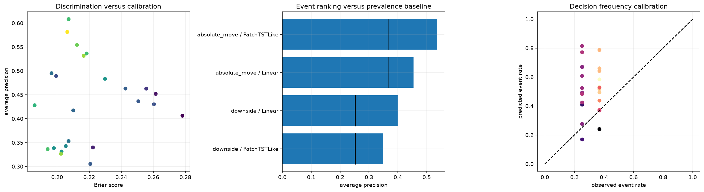

# 11번 위험 이벤트·분포 진단 결과 보고서

## 1. 결론부터

11번은 10번의 점예측과 경쟁하는 별도 가설이다. 이번 실험의 질문은 "다음 15분 값을 하나의 숫자로 맞히는 대신, 향후 4시간 동안 큰 움직임이 날 확률을 예측하면 더 유용한가"이다.

핵심 결론은 다음과 같다.

- 위험 이벤트 예측에서는 `PatchTSTLike`가 `Linear`보다 더 강했다.
- 특히 `absolute_move` 이벤트는 `downside`보다 더 잘 잡혔다.
- 가장 좋은 조합은 `PatchTSTLike + seasonal_diff16 + absolute_move + seed2026`로, AP 0.608, ROC AUC 0.716, Brier skill 0.321, ECE 0.094를 기록했다.
- `downside`는 더 어려웠고, `Linear`는 일부 케이스에서 baseline보다 나은 lift를 보였지만 calibration과 전체 판별력은 약했다.
- 분포 예측과 Double Descent는 아직 보조 축이다. 11번의 본질적 성과는 위험 이벤트 분류가 점예측과는 다른 연구 축임을 보여준 것이다.

즉 11번은 10번의 대체물이 아니라, 10번과 병렬로 놓고 비교할 만한 경쟁 가설이다.

## 2. 왜 11번을 수행했는가

10번의 결과만 보면 아직 다음 문제가 남아 있다.

- 값 자체를 조금 더 잘 맞히는 것과
- 큰 변동이 날 가능성을 미리 아는 것

은 전혀 다른 문제다.

금융에서는 작은 오차를 줄이는 것보다, 큰 급변 구간에 들어가는지 먼저 아는 것이 더 실용적인 경우가 많다. 예를 들어 급변 직전에는 포지션 축소, 리스크 회피, 모니터링 강화가 필요하다. 그래서 11번은 점예측이 아니라 위험 이벤트 확률 예측으로 분리했다.

## 3. 핵심 용어

### 3.1 Event rate

`event_rate`는 실제로 이벤트가 발생한 비율이다.

예를 들어 100개 중 25개가 하방 이벤트면 event rate는 25%다. 이벤트가 희귀할수록 accuracy만 보면 속기 쉬우므로, event rate를 함께 봐야 한다. 희귀 이벤트에서는 모두 안 맞는 모델도 정확도가 높아 보일 수 있기 때문이다.

### 3.2 Average precision과 AP lift

`average_precision`은 정답이 불균형한 상황에서 precision-recall 곡선을 요약한 값이다.

`AP lift`는 이 값이 단순 baseline보다 얼마나 나은지를 보여준다.

- AP lift가 1보다 크면 baseline보다 낫다.
- 1 부근이면 baseline과 비슷하다.
- 1보다 작으면 baseline보다 나쁘다.

11번에서는 AP lift가 1.45~1.65 수준까지 올라간 케이스가 있어, 단순 prevalence보다 확률 정렬이 좋아졌다는 뜻이다. 이것은 좋은 신호다.

### 3.3 Brier score, climatology, Brier skill score

`Brier score`는 확률 예측과 실제 0/1 결과의 차이를 제곱해 평균낸 값이다. 작을수록 좋다.

`climatology Brier score`는 "항상 평균 발생률만 예측"했을 때의 기준값이다.

`Brier skill score`는 이 기준 대비 얼마나 나아졌는지 보여준다.

- 0보다 크면 baseline보다 낫다.
- 0이면 baseline과 같다.
- 0보다 작으면 baseline보다 나쁘다.

11번의 상위 위험 이벤트 케이스는 Brier skill score가 약 0.32 수준까지 올라갔다. 이는 확률 예측이 그냥 prevalence 복사보다 유의하게 낫다는 뜻이다.

### 3.4 Expected calibration error

`ECE`는 예측한 확률과 실제 발생 비율이 얼마나 어긋나는지 보여준다.

- 0에 가까우면 좋다.
- 값이 크면 "70% 확률"이라고 말해도 실제는 50% 수준일 수 있다.

11번의 상위 케이스는 ECE가 0.05~0.09 수준으로, 완벽하진 않지만 완전히 망가진 확률 예측은 아니었다.

### 3.5 Double Descent

Double Descent는 모델이 커질수록 test error가 단순히 줄기만 하지 않고, 어떤 복잡도 구간에서는 한번 나빠졌다가 다시 좋아질 수 있다는 현상이다.

이 실험에서 Double Descent는 본 연구 질문의 중심이 아니다. 다만 width나 parameter count를 늘렸을 때 위험 예측/분포 예측이 어떻게 흔들리는지 확인하는 보조 진단 축으로 남긴다. 즉 "큰 모델이면 무조건 좋다"는 생각을 검증하는 참고용 축이다.

## 4. 실행 환경과 데이터

| 항목 | 값 |
|---|---:|
| Python | 3.13.13 |
| PyTorch | 2.10.0+cu126 |
| CUDA | 12.6 |
| GPU | NVIDIA GeForce RTX 4090 |
| 자원 프로필 | `school_4090_15gb:risk_secondary` |
| 데이터 테이블 | `btc_15m_advance` |
| 관측치 | 39,935 |
| 기간 | 2023-05-21 10:30 ~ 2024-07-11 11:30 |
| 결측 셀 | 0 |

11번도 15분 업비트 비트코인 데이터를 썼다. 원천 OHLCV 결측은 없었지만, 시계열 구조상 몇몇 gap과 feature warm-up 손실은 존재했다. 이 부분은 `missingness audit`에서 따로 보여준다.

## 5. 결측과 event preview

### 5.1 missingness audit

11번의 결측 점검은 다음을 분리해서 보여준다.

- raw OHLC missing: 0
- inferred timestamp gaps: 7
- feature 생성에서 떨어진 행: 65

중요한 점은 구조적 결측은 보간 대상이 아니라는 것이다. rolling window의 초반 warm-up, horizon tail, shift tail은 실제로 미래를 모르는 구간이기 때문에 값을 메우면 안 된다. 반면 실제 누락 간격이 있다면 그때는 데이터 취득 문제로 보고 따로 다뤄야 한다.

### 5.2 event preview

11번은 candle preview 대신 event probability preview를 보여준다.

preview 표에는 보통 다음이 들어간다.

- timestamp
- prev_close
- future_end_close
- future_return
- event_score
- label
- predicted probability
- threshold

이 표의 목적은 "이 모델이 정말 무엇을 맞히는가"를 눈으로 읽게 하는 것이다. 점예측처럼 가격 숫자만 보는 대신, 큰 하락/큰 변동이 나는 시점에 확률이 올라가는지를 확인한다.

## 6. 실험 구조

11번의 기본 suite는 `risk_event_probe`다.

- 모델: `Linear`, `PatchTSTLike`
- event_kind: `downside`, `absolute_move`
- 전처리: `seasonal_diff16`, `winsor_025`
- seed: `42`, `137`, `2026`
- horizon: 16
- 목표: 향후 4시간 위험 이벤트 확률 예측

11번에서는 `absolute_move`를 "큰 방향성 여부", `downside`를 "하방 꼬리 위험"으로 구분했다. 둘 다 중요하지만, 11번에서는 `absolute_move`가 더 쉽게 학습되었다.

## 7. 위험 이벤트 결과

### 7.1 상위 `absolute_move` 케이스

| 순위 | 모델 | 전처리 | seed | AP | AP lift | ROC AUC | Brier skill | ECE | 해석 |
|---:|---|---|---:|---:|---:|---:|---:|---:|---|
| 1 | PatchTSTLike | seasonal_diff16 | 2026 | 0.608 | 1.648 | 0.716 | 0.321 | 0.094 | 가장 강한 위험 이벤트 후보 |
| 2 | PatchTSTLike | winsor_025 | 42 | 0.581 | 1.575 | 0.704 | 0.324 | 0.047 | calibration이 특히 좋음 |
| 3 | PatchTSTLike | winsor_025 | 2026 | 0.554 | 1.502 | 0.674 | 0.304 | 0.081 | seed가 바뀌어도 유지 |
| 4 | PatchTSTLike | seasonal_diff16 | 42 | 0.536 | 1.453 | 0.684 | 0.284 | 0.094 | 안정적이지만 최고는 아님 |
| 5 | PatchTSTLike | seasonal_diff16 | 137 | 0.531 | 1.440 | 0.687 | 0.291 | 0.071 | seed 변화에 덜 민감 |

### 7.2 `downside` 케이스

`downside`는 더 어렵다. 이벤트 비율이 낮고 꼬리 쪽이기 때문에, `absolute_move`처럼 넓은 변동을 잡는 것보다 훨씬 민감하다.

대표적으로 `Linear + winsor_025 + downside + seed2026`는 AP 0.495, AP lift 1.965, ROC AUC 0.697을 보였지만, Brier skill은 0.071에 불과했다. 즉 희귀 이벤트를 baseline보다 조금 더 잘 정렬하긴 했지만, 확률 보정은 약했다.

`Linear + seasonal_diff16 + downside + seed2026`도 AP 0.489, lift 1.941, ROC AUC 0.700으로 비슷한 경향을 보였다. 그러나 `PatchTSTLike`의 `downside` 일부 조합은 Brier skill이 음수까지 내려가, 확률 정렬과 calibration이 함께 좋아지지 않는 경우가 있었다.

### 7.3 해석

11번에서 중요한 점은 `PatchTSTLike`가 `Linear`보다 위험 이벤트에 더 잘 반응했다는 것이다.

- `absolute_move`는 실제 급변을 더 잘 포착했다.
- `downside`는 더 희귀하고 더 불안정해서 성능이 낮았다.
- AP lift와 Brier skill이 모두 양수인 조합은 "전혀 쓸모 없는 확률"이 아니라 "기준선보다 나은 확률"이라는 뜻이다.

그러나 이 결과도 과신하면 안 된다. 예측이 맞는다는 것과, 실제 운용에서 충분히 안정적인 확률이라는 것은 다르다. 특히 downside는 추후 더 많은 seed, 더 긴 horizon, 더 정교한 불균형 보정이 필요하다.

## 8. 분포 예측은 무엇인가

분포 예측은 다음 수익률을 하나의 숫자로 맞히지 않고, 여러 가능성의 분포로 표현하는 방식이다.

예를 들어 "다음 4시간에 -2%가 날 가능성은 15%, -1% 부근은 30%, 0 근처는 25%, +1% 이상도 20%" 같은 식으로 본다. 이렇게 보면 점예측보다 훨씬 정보가 많다.

11번에서 분포 예측은 아직 보조 축이다. 이유는 간단하다. 지금 가장 확실히 검증된 것은 위험 이벤트 분류이며, 분포 head는 그 다음 단계의 확장 지점이다.

좋은 분포 예측의 조건은 다음과 같다.

- 불확실성이 커지는 구간에서 interval이 넓어진다.
- 실제 변동이 작을 때 interval이 불필요하게 넓지 않다.
- coverage와 sharpness의 균형이 맞는다.

나쁜 분포 예측은 다음과 같다.

- 항상 같은 폭의 구간을 내놓는다.
- 넓기만 하고 실제는 맞지 않는다.
- 너무 좁아서 coverage가 무너진다.

## 9. Capacity와 Double Descent

11번에서 Double Descent는 보조 진단이다.

이 실험이 주는 메시지는 "지금 당장 Double Descent가 핵심 결론"이 아니라 "모델 용량이 커질 때 test error가 다시 좋아지는 구간이 있는지 별도로 볼 수 있게 해 두었다"는 것이다.

이 축이 중요한 이유는 다음과 같다.

- 작은 모델이 항상 안전한 것은 아니다.
- 큰 모델이 항상 폭주하는 것도 아니다.
- data regime와 objective에 따라 interpolation threshold 부근의 행동이 달라질 수 있다.

따라서 11번의 capacity branch는 후속 실험에서 width, parameter count, seed를 바꾸며 재사용할 수 있는 진단 프레임이다. 이번 노트북의 주력 산출물은 위험 이벤트 leaderboard이고, capacity는 후속 해석용 보조 축이다.

## 10. 좋게 읽어야 하는 그래프와 나쁘게 읽어야 하는 그래프

### 10.1 가장 강한 후보도 학습 곡선 자체는 과적합 경고를 보인다

이 그림은 `PatchTSTLike + seasonal_diff16 + absolute_move + seed2026` 결과다. 왼쪽 위의 x축은 epoch, y축은 가중 binary cross entropy다. train loss는 내려가지만 validation loss는 빠르게 상승하므로, 마지막 epoch 모델이 좋은 것이 아니라 early stopping으로 저장된 최저 validation 시점 모델을 사용해야 한다.

가운데 위의 x축은 test 시간 순서, y축은 예측 이벤트 확률이다. 실제 이벤트는 0 또는 1의 점으로 표시되고, 예측 확률은 위험 구간에서 올라가는 군집을 만든다. 왼쪽 아래 precision-recall 곡선은 event prevalence 약 36.9%를 나타내는 점선보다 대부분 위에 있어 단순 발생률 예측보다 사건 순위를 잘 나눴다.

이 사례는 AP `0.608`, AP lift `1.648`, Brier skill `0.321`로 가장 강했지만 ECE는 `0.094`다. 즉 위험한 순서를 정하는 능력은 좋지만, "확률 70%"라는 숫자를 그대로 운영 임계값으로 쓰기 전에는 추가 보정이 필요하다.

### 10.2 가장 보정이 좋은 후보는 운영용 위험 게이트에 더 가깝다

이 그림은 `PatchTSTLike + winsor_025 + absolute_move + seed42` 결과다. AP `0.581`, AP lift `1.575`, Brier skill `0.324`로 사건 분리력이 높고 ECE는 `0.047`로 상위 후보 중 가장 낮다. 오른쪽 위 reliability diagram에서 실선이 대각선 주변을 비교적 따라가므로, 예측 확률과 실제 발생률의 간격이 상대적으로 작다.

최고 AP 모델과 최고 calibration 모델이 다르다는 점이 중요하다. 연구 보고에서는 최고 점수 하나만 고르기보다 두 후보를 seed/preprocessing ensemble로 묶고 validation 데이터에서 다시 확률 보정하는 편이 더 타당하다.

### 10.3 Downside 확률은 아직 과신하기 어렵다

이 그림은 `PatchTSTLike + seasonal_diff16 + downside + seed137` 결과다. reliability diagram의 고확률 구간이 대각선 아래에 있어 모델이 실제보다 위험 확률을 높게 말하는 구간이 나타난다. risk-coverage 곡선도 가장 확신하는 50% 표본만 남겼을 때 오류가 줄기는 하지만, `absolute_move` 사례만큼 명확하지 않다.

따라서 downside 예측은 당장 포지션 방향을 결정하는 핵심 신호가 아니라, 높은 확률일 때 진입을 한 번 더 막는 보조 경고로만 다루는 것이 안전하다.

### 10.4 전체 모델 비교는 absolute move branch의 우위를 확인한다

가운데 막대그래프의 점선은 각 이벤트의 단순 발생률 기준선이다. `absolute_move / PatchTSTLike`의 average precision이 가장 높고 기준선과의 간격도 가장 크다. 왼쪽 산점도에서는 Brier score가 낮으면서 average precision이 높은 좌상단에 가까울수록 좋다. 오른쪽 calibration 산점도는 대각선에 가까울수록 예측 발생률과 실제 발생률이 맞는다는 뜻인데, 일부 후보는 위험을 과대평가한다.

이 결과는 11번을 "가격 예측의 우회"가 아니라 실제로 기준선을 넘은 별도 위험 신호로 취급할 근거가 된다.

### 10.5 좋게 읽는 그림

- event probability가 실제 위험 구간에서 올라가는 그림
- AP lift와 Brier skill이 baseline보다 좋아지는 그림
- ECE가 과도하게 크지 않은 그림
- seed가 바뀌어도 순위가 크게 깨지지 않는 그림

### 10.6 나쁘게 읽는 그림

- 확률이 거의 상수로 나오는 그림
- event rate가 낮은데도 모든 구간에서 고확률을 남발하는 그림
- calibration은 좋아 보여도 실제 위험 구간을 잘 못 잡는 그림
- 분포 head가 너무 넓거나 너무 좁아져서 해석이 안 되는 그림

11번의 상위 후보는 좋은 그림 쪽에 더 가깝지만, 아직 완성형은 아니다.

## 11. 11번에서 확정할 수 있는 것과 없는 것

### 확정할 수 있는 것

- 위험 이벤트 예측은 점예측과 별개의 유효한 연구 축이다.
- `PatchTSTLike`는 `Linear`보다 위험 이벤트 분리 능력이 좋다.
- `absolute_move`는 `downside`보다 더 안정적인 1차 목표다.
- AP lift, Brier skill, ECE를 함께 봐야 확률 예측을 제대로 읽을 수 있다.

### 아직 확정할 수 없는 것

- 분포 예측 head가 point forecast보다 실제로 더 낫다는 결론
- Double Descent가 지금 데이터/모델/정규화 조건에서 재현된다는 결론
- `downside`가 충분히 안정적으로 해석 가능하다는 결론

## 12. 다음 스텝

11번은 다음 연구 흐름을 알려준다.

1. 10번의 점예측 branch와 11번의 위험 이벤트 branch를 분리해서 유지한다.
2. risk-event 쪽은 `absolute_move`를 우선 안정화하고, 그 다음에 `downside`를 정교화한다.
3. 분포 예측은 보조 branch로 두고, coverage와 interval width를 명확히 본다.
4. Double Descent는 capacity probe의 형태로만 유지하고, 중심 질문으로 끌어올리지 않는다.
5. 새 방법론을 추가할 때는 "연구 질문을 실제로 강하게 하는가"를 먼저 묻는다.

## 13. 최종 판단

11번은 10번의 실패를 덮기 위한 우회로가 아니다. 오히려 점예측과 위험 이벤트가 서로 다른 문제임을 분리해 준 실험이다.

- 10번은 "어떤 objective가 쉬운 해를 덜 만들까"를 봤다.
- 11번은 "위험한 구간을 미리 알 수 있을까"를 봤다.

둘은 같은 문제의 다른 표현이 아니라, 실제 연구에서 병렬로 비교해야 하는 두 축이다.

이번 11번의 가장 큰 수확은 `PatchTSTLike + seasonal_diff16 + absolute_move`가 위험 이벤트 예측의 강한 기준 후보로 남았다는 점이다. 반면 분포 예측과 Double Descent는 앞으로 더 넓은 후속 실험에서 확인할 보조 축으로 남겨 둔다.
