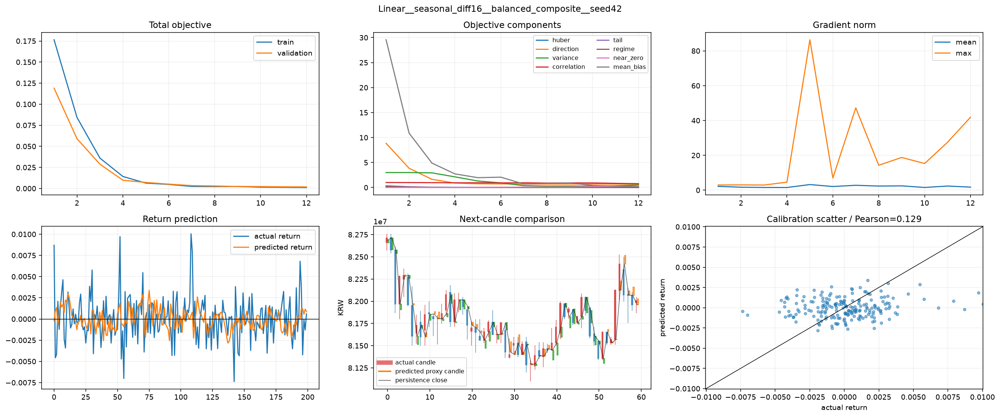
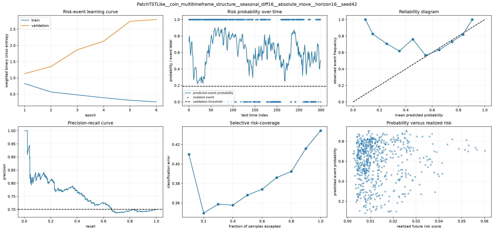
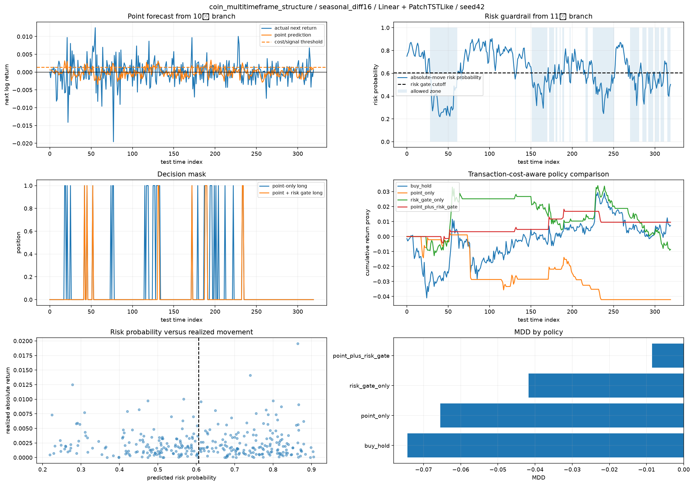
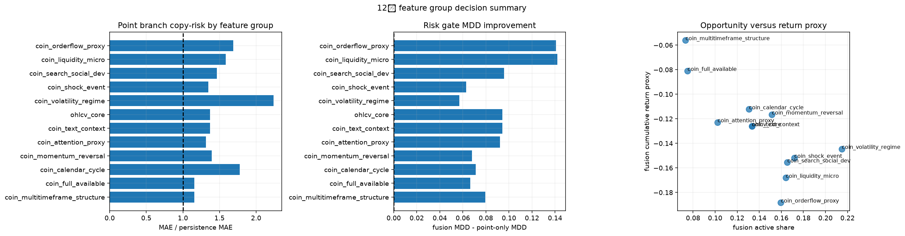

# 12번 feature guardrail fusion 결과 보고서

## 먼저 보는 결론

이번 실험의 1차 질문은 **어떤 독립변수 조합(feature group)을 다음 데이터마트 정식 스키마로 승격할 것인가**다. `Linear`, `PatchTSTLike`, `seed42`, `seed2026`은 독립변수 후보가 아니라, 같은 feature group이 모델 구조와 초기값이 바뀌어도 버티는지 확인하기 위한 검증 축이다.

즉 이 보고서는 아래 순서로 읽으면 된다.

1. **결론 요약표**에서 다음에 쓸 feature group을 먼저 고른다.
2. **결과 해석**에서 왜 그 결론이 나왔는지 본다.
3. **대표 케이스 그래프와 수치**에서 실제 그래프 모양을 확인한다.
4. **개념 설명과 96케이스 전체 표**는 필요한 용어나 누락 검증용으로 본다.

### 결론 요약표

|우선순위|feature group|다음 스텝 판단|근거|주의점|
|---:|---|---|---|---|
|1|`coin_multitimeframe_structure` = 15분, 1시간, 4시간, 16시간, 2일 근처의 수익률·변동성·추세 묶음|정식 feature group 1순위로 승격|평균 fusion MDD가 12개 group 중 가장 좋고, case 41에서 유일한 양의 fusion return `+1.7899%`|case 41 하나가 아니라 8케이스 평균 기준으로 계속 검증 필요|
|2|`coin_full_available`|상한선 후보로 유지|전체 feature를 합쳤을 때 평균 2위권, case 96도 상위|어떤 feature가 기여했는지 분해가 어려워 운영 입력으로 바로 쓰기에는 해석성이 낮음|
|3|`coin_calendar_cycle` = 코인의 24시간 거래 시간대와 요일 주기 묶음|보조 후보|case 68은 MDD `-0.4145%`로 가장 작음|거래 4회라 너무 보수적일 수 있고 seed 안정성 확인 필요|
|4|`coin_momentum_reversal` = 단기 추세와 되돌림 묶음|보조 후보|일부 case에서 방향 정확도와 MDD가 좋음|평균 fusion MDD는 `coin_multitimeframe_structure`보다 약함|
|보류|`coin_orderflow_proxy`, `coin_liquidity_micro`|현재 proxy만으로는 보류|평균 fusion MDD와 return이 하위권|실제 order book, spread, funding, liquidation 컬럼이 들어오면 재검증|
|보류|`coin_text_context`|현재 결과로 판단 불가|이번 실행에서는 text mart overlap이 없어 `ohlcv_core`와 동일 fallback|텍스트 timestamp와 가격 timestamp overlap 확보 후 다시 봐야 함|

### 이번에 바로 사용할 수 있는 최적 결과

|용도|선택|수치|해석|
|---|---|---:|---|
|최우선 feature group|`coin_multitimeframe_structure`|평균 fusion MDD `-0.062241`|12개 group 중 평균 하방 방어가 가장 좋음|
|최고 단일 case|case 41: `coin_multitimeframe_structure + seasonal_diff16 + Linear + seed42`|fusion return `+0.017899`, fusion MDD `-0.008542`|이번 96케이스 중 유일하게 양의 fusion return|
|seed 반복 후보|case 42: `coin_multitimeframe_structure + seasonal_diff16 + Linear + seed2026`|fusion return `-0.017136`, fusion MDD `-0.018614`|case 41보다 약하지만 같은 구조에서 MDD는 여전히 상위권|
|모델 복잡도 비교|case 44: `coin_multitimeframe_structure + seasonal_diff16 + PatchTSTLike + seed2026`|fusion return `-0.101817`, fusion MDD `-0.104421`|더 복잡한 PatchTSTLike가 이번 feature group에서는 Linear보다 불리|

### case 41 이름을 문장으로 풀면

`coin_multitimeframe_structure + seasonal_diff16 + Linear + seed42`는 아래 뜻이다.

- `coin_multitimeframe_structure`:
  15분 단일 봉만 보지 않고, 15분, 1시간, 4시간, 16시간, 2일 근처의 수익률과 변동성, 가격 위치, 추세 강도를 같이 넣은 변수 묶음이다.
- `seasonal_diff16`:
  각 시점의 입력값에서 16개 15분봉 전 값을 빼는 전처리다. 15분봉 기준으로 16칸 전은 약 4시간 전이므로, "현재 수준"보다 "약 4시간 전 대비 얼마나 달라졌는가"를 학습하게 만든다.
- `Linear`:
  시계열 입력 창을 펼쳐서 얕은 MLP형 구조로 다음 수익률을 예측하는 baseline 모델이다. 회귀식 하나만 두는 전통적 선형회귀보다는 조금 넓지만, PatchTSTLike 같은 Transformer 계열보다 훨씬 단순한 구조다.
- `seed42`:
  모델 초기 가중치와 데이터 셔플의 랜덤 시작점을 42로 고정했다는 뜻이다. 즉 독립변수가 아니라 재현성 확인용 반복 조건이다.

### fusion MDD, fusion return이 뜻하는 것

- `fusion MDD`:
  점예측 branch와 위험확률 gate를 합친 최종 정책의 최대 낙폭이다. test 구간에서 누적자산 곡선이 최고점 대비 얼마나 크게 떨어졌는지를 본 값이며, 0에 가까울수록 하방 방어가 좋다.
- `fusion return`:
  같은 최종 정책의 거래비용 반영 후 누적수익률 proxy다. test 구간 마지막 시점에서 시작 대비 얼마나 벌었는지, 혹은 잃었는지를 본다.
- `유일한 양의 fusion return`:
  96개 case 가운데 최종 정책 수익률이 0보다 큰, 즉 테스트가 끝났을 때 손익이 플러스였던 케이스가 case 41 하나뿐이었다는 뜻이다.

### 축 구분

|축|이번 실험에서의 의미|주 실험 축인가?|
|---|---|---|
|feature group|독립변수 조합. 이번 실험의 핵심 비교 대상|예|
|preprocessing|`seasonal_diff16`, `winsor_025`; 같은 feature group이 전처리에 따라 달라지는지 확인|보조|
|point model|`Linear`, `PatchTSTLike`; feature group이 단순/복잡 모델 모두에서 버티는지 확인|보조|
|seed|`42`, `2026`; 초기값과 학습 랜덤성에 따른 우연성을 확인|보조|
|risk model|`PatchTSTLike`; 11번에서 가져온 absolute-move guardrail branch|고정|

## 총 케이스 수

이번 12번 실행 결과는 **총 96케이스**다.

계산식은 `12개 사용 가능 feature group * 2개 preprocessing * 2개 point model * 1개 risk model * 2개 seed = 96`이다. 여기서 **독립변수 조합별 차이**는 `feature group`이 담당한다. `point model`과 `seed`는 독립변수 자체가 아니라, 그 조합이 특정 모델이나 특정 초기값에서만 우연히 좋아 보이는지 확인하기 위한 반복 조건이다.

실행 인자에는 `coin_cross_market`, `coin_macro_proxy`, `coin_onchain_proxy`, `coin_derivatives_proxy`도 들어 있었지만, 현재 데이터마트에 필요한 컬럼이 없어 자동 제외됐다. 따라서 실제 결과는 아래 12개 feature group만 기준으로 해석한다.

|feature group|feature 수|의미|
|---|---:|---|
|`ohlcv_core`|9|수익률, 단기/중기 return, 실현 변동성, 거래량/거래대금 z-score 기준선|
|`coin_liquidity_micro`|14|거래대금, turnover, range, Amihud-style illiquidity proxy|
|`coin_volatility_regime`|12|변동성 비율, 상승/하락 변동성, 꼬리 위험 proxy|
|`coin_momentum_reversal`|11|RSI, MACD gap, EMA gap, 추세 강도, 단기 되돌림|
|`coin_orderflow_proxy`|14|호가창 없이 캔들 몸통/꼬리/signed volume으로 만든 매수·매도 압력 proxy|
|`coin_multitimeframe_structure`|16|15분, 1시간, 4시간, 16시간, 2일 근처 구조를 같이 보는 multi-timeframe feature|
|`coin_shock_event`|11|급등락, 거래량 폭증, range 확장, jump 후 되돌림|
|`coin_attention_proxy`|10|거래량, 거래대금, range shock으로 만든 시장 관심도 proxy|
|`coin_calendar_cycle`|12|24시간 코인 시장의 hour/day, 한국/미국 시간대 proxy|
|`coin_text_context`|9|텍스트 mart가 없어서 이번 실행에서는 `ohlcv_core`와 사실상 동일 fallback|
|`coin_search_social_dev`|8|검색/소셜/개발자 컬럼이 없어서 현재 사용 가능한 proxy만 반영|
|`coin_full_available`|60|현재 데이터에서 쓸 수 있는 모든 코인 특화 feature를 합친 상한선 후보|

## 분석 목적과 데이터

이 분석을 수행한 이유는 10번과 11번의 결론을 실제 의사결정 구조로 합치기 위해서다. 10번에서 `balanced_composite` 점예측 branch는 Huber 단독보다 0수익률 collapse를 덜 보였지만, persistence를 안정적으로 넘지는 못했다. 11번에서 `absolute_move` risk branch는 향후 급변 위험을 어느 정도 구분했지만, 그 자체가 매수 신호는 아니었다. 그래서 12번은 **점예측을 단독 알파로 쓰지 않고, 위험확률 guardrail을 붙이면 MDD가 줄어드는지**를 feature group별로 검증한다.

데이터 원천은 `btc_15m_advance` 15분봉이다. 현재 실행 설정은 최대 40,000행을 사용하고, `seq_len=64`이므로 한 예측은 직전 64개 15분봉, 즉 약 16시간의 입력을 본다. point branch의 target은 **다음 15분봉 로그수익률**이고, risk branch의 target은 `risk_horizon=16`, 즉 **향후 16개 15분봉, 약 4시간의 absolute-move 위험 이벤트**다. 데이터 split은 시간 순서를 유지해 train 70%, validation 15%, test 15%로 나눴다.

결측 정책도 중요하다. 원본 OHLC 결측은 0개였고, timestamp 기준 inferred gap은 7개였다. rolling feature를 만들 때 생기는 warm-up 구간 112행은 보간하지 않고 제거했다. 마지막 구간의 next-return 또는 4시간 horizon label tail도 구조적으로 미래가 없어서 보간하지 않는다. 이 원칙을 지켜야 모델이 실제로 없던 미래 정보를 훔쳐보지 않는다.

이번 보고서의 성과 수치는 모두 test 구간 기준이다. 거래 정책 비교에는 거래비용 `14 bps`를 반영했다. 따라서 단순 예측 오차가 좋아도 실제 `point_plus_risk_gate` 누적수익률과 MDD가 나쁘면 좋은 케이스로 보지 않는다.

## RAW 변수와 파생변수 생성표

### RAW 입력 변수

|RAW 변수|의미|직접 사용 여부|비고|
|---|---|---|---|
|`timestamp`|15분봉 시점|예|시간대 파생변수 생성에도 사용|
|`ticker`|종목 코드|예|cross-market merge에 사용|
|`open`|시가|예|캔들 몸통, wick, 다음 봉 target open 계산에 사용|
|`high`|고가|예|range, wick, close location 계산에 사용|
|`low`|저가|예|range, wick, close location 계산에 사용|
|`close`|종가|예|수익률, 추세, EMA, drawdown의 핵심 기준값|
|`volume`|거래량|예|volume z-score, shock, attention, signed volume proxy 계산에 사용|
|`value`|거래대금|예|없으면 `close * volume`으로 대체|유동성, illiquidity, turnover, signed value proxy 계산에 사용|

### 파생변수 생성 방식

|파생변수 묶음|대표 변수|어떤 RAW 변수에서 만들었나|어떤 방법으로 만들었나|왜 만들었나|
|---|---|---|---|---|
|기본 수익률|`log_return_1`, `return_4`, `return_16`, `return_64`, `return_192`|`close`|`log(close)`를 만든 뒤 1, 4, 16, 64, 192칸 차분|15분, 1시간, 4시간, 16시간, 2일 근처의 방향과 누적 변화를 보기 위해|
|기본 변동성|`realized_vol_16`, `realized_vol_64`, `realized_vol_192`|`log_return_1`|rolling std|구간별 흔들림 크기를 보기 위해|
|가격 범위/위치|`hl_range_pct`, `range_z_96`, `range_mean_192`, `price_z_192`|`high`, `low`, `close`|고저폭 비율, rolling z-score, rolling mean|평소 대비 range 확대, 현재 가격 위치를 보기 위해|
|거래량/거래대금 이상치|`volume_z_96`, `value_z_96`, `volume_z_192`, `value_z_192`, `volume_shock_z_96`, `value_shock_z_96`|`volume`, `value`|`log1p` 후 rolling z-score|평소 대비 거래 집중과 shock를 보기 위해|
|유동성 proxy|`turnover_proxy`, `amihud_illiquidity_proxy`, `turnover_absorption_proxy`, `range_volume_interaction`|`value`, `close`, `high`, `low`, `volume`, `log_return_1`|로그 거래대금 차분, 절대수익률/거래대금 비율, range와 거래대금의 조합|주문이 들어와도 가격이 얼마나 쉽게 움직이는지 간접 측정하기 위해|
|가속도 변수|`volume_acceleration`, `value_acceleration`|`volume`, `value`|`log1p` 후 2차 차분|거래량/거래대금 증가 속도까지 보기 위해|
|캔들 미세구조 proxy|`candle_body_pct`, `upper_wick_pct`, `lower_wick_pct`, `close_location_value`|`open`, `high`, `low`, `close`|몸통 비율, 윗꼬리/아랫꼬리 비율, 종가의 봉 내부 위치 계산|호가창이 없을 때 봉 모양으로 매수·매도 압력을 추정하기 위해|
|서명된 압력 proxy|`signed_volume_proxy`, `signed_value_proxy`, `volume_pressure_16`, `value_pressure_16`, `intrabar_reversal_proxy`|`open`, `close`, `volume`, `value`, `close_location_value`|양봉/음봉 부호를 거래량·거래대금에 곱하고 rolling sum|실제 order book 없이도 방향성 있는 체결 압력을 흉내내기 위해|
|변동성 레짐|`vol_ratio_16_64`, `vol_ratio_64_192`, `downside_vol_64`, `upside_vol_64`, `vol_of_vol_64`, `tail_abs_return_96`, `drawdown_96`|`realized_vol_*`, `log_return_1`, `close`|단기/중기 변동성 비율, 하방/상방 std, 절대수익률 분위수, rolling max 대비 drawdown|지금이 조용한 장인지, 흔들리는 장인지, 하락 리스크가 큰지 보기 위해|
|멀티타임프레임 추세|`ema_gap_16`, `ema_gap_64`, `trend_strength_64`, `trend_strength_192`|`close`|EMA 대비 괴리율, rolling mean 대비 괴리율|단기/중기 추세 강도를 보기 위해|
|모멘텀/반전|`rsi_14_scaled`, `macd_gap_pct`, `macd_signal_gap_pct`, `reversal_4`|`close`, `return_4`|RSI, MACD 및 signal gap, 4칸 반전값|지속 추세와 단기 되돌림을 함께 보기 위해|
|쇼크/이벤트|`abs_return_z_96`, `range_shock_z_96`, `jump_reversal_4`|`log_return_1`, `hl_range_pct`|절대수익률 z-score, range z-score, 최근 점프와 그 직전 합의 부호 결합|급등락과 급변 직후 반응을 보기 위해|
|관심도 proxy|`attention_pressure_proxy`, `attention_direction_proxy`|`volume_shock_z_96`, `value_shock_z_96`, `range_shock_z_96`, `log_return_1`|양의 shock만 합산하고 최근 수익률 부호와 결합|시장 관심이 몰리는 구간과 그 방향을 보기 위해|
|시간대/요일|`hour_sin`, `hour_cos`, `day_sin`, `day_cos`, `korea_active_session`, `us_active_session`|`timestamp`|주기함수 인코딩과 세션 더미|코인 24시간 시장의 지역별 활발한 시간대를 보기 위해|

### 이번 1순위 변수셋이 실제로 포함한 변수

`coin_multitimeframe_structure`는 아래 16개 변수를 쓴다.

|변수|말로 풀면|
|---|---|
|`log_return_1`|직전 15분 수익률|
|`return_4`|직전 1시간 누적 수익률|
|`return_16`|직전 4시간 누적 수익률|
|`return_64`|직전 16시간 누적 수익률|
|`return_192`|직전 2일 누적 수익률|
|`realized_vol_16`|최근 4시간 변동성|
|`realized_vol_64`|최근 16시간 변동성|
|`realized_vol_192`|최근 2일 변동성|
|`vol_ratio_16_64`|4시간 변동성이 16시간 변동성보다 얼마나 큰지|
|`vol_ratio_64_192`|16시간 변동성이 2일 변동성보다 얼마나 큰지|
|`price_z_192`|현재 가격이 최근 2일 평균 대비 높은지 낮은지|
|`volume_z_192`|현재 거래량이 최근 2일 기준으로 과열인지 아닌지|
|`value_z_192`|현재 거래대금이 최근 2일 기준으로 과열인지 아닌지|
|`range_mean_192`|최근 2일 동안 평균적인 봉 range가 어땠는지|
|`trend_strength_64`|최근 16시간 추세 강도|
|`trend_strength_192`|최근 2일 추세 강도|

## 한 줄 결론

점예측 자체는 아직 완전한 알파라고 보기 어렵다. 다만 12번에서는 **risk guardrail을 붙였을 때 MDD가 대부분 크게 줄었고**, 특히 `coin_multitimeframe_structure`가 가장 안정적인 feature group 후보로 올라왔다. 단일 최고 케이스는 `case 41 = coin_multitimeframe_structure + seasonal_diff16 + Linear + seed42`로, fusion 누적수익률이 **+1.79%**, fusion MDD가 **-0.85%**였다. 이것은 이번 96케이스 중 유일하게 양의 fusion return을 냈다.

## 핵심 개념 설명

### Total Objective

`total objective`는 모델이 학습 중 최소화하려는 최종 손실값이다. 쉬운 말로는 "이번 epoch에서 모델이 얼마나 틀렸고, 그 틀림을 어떤 기준으로 벌점화했는지 합친 점수"다. 12번 점예측 branch는 10번에서 정한 `balanced_composite`를 사용한다. 그래서 Huber 하나만 보는 것이 아니라 `huber`, `direction`, `variance`, `correlation`, `tail`, `regime`, `near_zero`, `mean_bias` 같은 보조 항목을 같이 본다.

좋은 모양은 train과 validation이 함께 내려가되 validation이 다시 크게 튀지 않는 것이다. 다만 total objective가 낮다고 바로 수익이 좋다는 뜻은 아니다. 손실은 표준화된 next-return 공간에서 계산되고, 최종 의사결정은 거래비용, risk gate, MDD까지 거친다.

### Objective Components

`objective components`는 total objective를 구성하는 세부 벌점이다.

|component|쉬운 정의|이번 실험에서의 역할|좋은 해석과 주의점|
|---|---|---|---|
|`huber`|큰 오차에는 완만하고 작은 오차에는 민감한 예측 오차 손실|next-return 숫자 자체를 맞추게 함|낮을수록 좋지만, 금융에서는 작은 오차만 맞추고 방향/꼬리를 놓칠 수 있음|
|`direction`|상승/하락 방향이 맞는지 보는 손실|코인에서 중요한 하락 추세 회피와 진입 방향 판단에 필요|이번에는 방향 component가 두드러졌지만, 방향만 높아도 수익은 거래비용 때문에 나빠질 수 있음|
|`variance`|예측 변동성이 실제 변동성과 너무 다르지 않은지 보는 항|0수익률 평탄화 collapse를 막음|너무 낮으면 평평한 예측, 너무 높으면 폭주|
|`correlation`|예측과 실제 수익률 움직임이 같이 움직이는지 보는 항|타이밍과 패턴 동조를 확인|상관이 좋아도 크기와 비용을 못 맞추면 매매 성과는 나쁠 수 있음|
|`tail`|큰 변동 구간을 무시하지 않게 하는 항|사용자가 말한 "큰 상승/급변"을 놓치는 문제와 관련|tail만 키우면 평소 구간에서 false signal이 늘 수 있음|
|`regime`|시장 국면별 오차를 보는 항|변동성 높은 구간과 낮은 구간을 분리|국면 구분이 불안정하면 오히려 과적합 가능|
|`near_zero`|예측이 0 근처로만 몰리는 것을 벌점화|0수익률 collapse 방지|너무 강하면 불필요한 신호가 늘 수 있음|
|`mean_bias`|예측 평균이 실제 평균에서 한쪽으로 치우쳤는지 보는 항|항상 상승/하락으로 치우치는 모델을 막음|가장 좋아 보여도 평균만 맞춘 것일 수 있어 단독 기준으로 쓰면 위험|

이전 실험에서 Huber가 좋아 보였던 것은 "숫자 오차를 안정적으로 줄이는 학습 형태"였다는 뜻에 가깝다. 이번 12번은 Huber 단독이 아니라 방향, 분산, tail, bias를 섞은 상태이므로 component별 우열을 그대로 최종 모델 우열로 읽으면 안 된다.

### Gradient Norm

`gradient norm`은 한 번 업데이트할 때 모델 파라미터가 얼마나 강하게 움직이려 하는지의 크기다. 예를 들어 grad norm이 계속 1~3 근처면 안정적이고, 갑자기 80처럼 튀면 해당 epoch에서 모델이 매우 큰 수정을 하려 했다는 뜻이다. 이번 그림에서 mean은 완만하지만 max가 튀는 구간이 있다. 이는 전체 학습이 망가졌다는 뜻보다는 일부 batch가 급변 구간이라 강한 업데이트를 유발했다는 신호다. `clip1` gradient policy를 둔 이유가 바로 이런 급등을 제한하기 위해서다.

### Return Prediction

`return prediction`은 x축이 test time index, y축이 다음 봉 로그수익률이다. 파란선은 실제 다음 봉 수익률, 주황선은 모델 예측 수익률이다. 사용자가 말한 것처럼 하락 방향은 어느 정도 따라가지만 큰 상승 spike는 약하게 잡는 모양이 보인다. 코인에서는 큰 상승을 놓치면 수익 기회가 줄지만, 이번 연구의 1차 목표가 MDD 방어라면 큰 하락을 과하게 놓치지 않는 것도 중요한 신호다.

### Next-Candle Comparison

`next-candle comparison`은 예측 수익률을 KRW 가격으로 되돌려 다음 15분봉 캔들처럼 비교한 그림이다. x축은 최근 test 구간의 candle index, y축은 KRW 가격이다. 실제 캔들은 실제 open/high/low/close이고, 예측 proxy candle은 이전 종가에서 예측 수익률을 적용한 가상 종가다. 검은 persistence close는 "그냥 직전 종가가 다음 종가라고 가정"한 기준선이다.

이 그림은 모델이 단순히 선그래프에서 좋아 보이는지보다, 실제 매매자가 보는 봉 감각에서 너무 늦거나 너무 평평한지 확인하기 위한 장치다.

### Calibration Scatter

`calibration scatter`는 x축 실제 next-return, y축 예측 next-return이다. 점들이 대각선에 가까울수록 실제 수익률 크기와 방향을 잘 맞춘다. 점들이 수평으로 눕거나 y=0 근처에 몰리면 모델이 평평한 예측을 한다는 뜻이다. Pearson 값은 실제와 예측의 선형 상관이다. 0에 가까우면 타이밍 동조가 약하고, 1에 가까우면 강하다.

### Risk-Event Learning Curve

위험 이벤트 branch의 학습 곡선이다. x축은 epoch, y축은 weighted binary cross entropy다. binary cross entropy는 "위험 이벤트가 일어날 확률을 얼마나 틀렸는지"를 보는 손실이다. train은 내려가는데 validation이 올라가면 학습 데이터에는 맞지만 검증 구간에는 덜 맞는 과적합 신호다. 12번의 risk branch는 이 현상이 일부 보이므로 위험 확률을 절대값으로 신뢰하기보다 gate 후보로만 써야 한다.

### Risk Probability Over Time

x축은 test time index, y축은 예측된 risk probability다. 점은 실제 event label이다. 검은 점선은 validation에서 정한 threshold 또는 gate cutoff다. 선이 높을수록 향후 4시간 absolute-move 위험이 크다고 본다. shaded/allowed zone은 risk probability가 cutoff 이하라서 진입을 허용한 구간이다.

### Reliability Diagram

x축은 평균 예측 확률, y축은 실제 이벤트 발생 빈도다. 점선 대각선에 가까우면 "70%라고 말한 구간에서 실제로도 약 70% 발생"했다는 뜻이다. 대각선보다 위면 위험을 과소평가한 것이고, 아래면 과대평가한 것이다. 이번 risk branch는 구간별 흔들림이 있어 완전한 확률 예보라기보다 guardrail로 쓰는 것이 안전하다.

### Precision-Recall Curve

x축 recall은 실제 위험 이벤트 중 얼마나 많이 잡았는지다. y축 precision은 위험이라고 예측한 것 중 실제 위험이 얼마나 많았는지다. 코인 위험 이벤트는 드물거나 불균형할 수 있으므로 accuracy보다 precision-recall이 더 유용하다. 곡선이 baseline보다 위에 있으면 위험 이벤트를 무작위보다 잘 골라낸다.

### Selective Risk-Coverage

x축은 모델이 받아들이는 sample 비율, y축은 classification error다. coverage를 낮춘다는 것은 모델이 자신 없는 구간을 버리고 더 확실한 구간만 보겠다는 뜻이다. 좋은 모델은 coverage를 줄였을 때 error가 같이 낮아진다. 이번 결과는 일부 구간에서만 낮아지고 다시 올라가므로, gate cutoff를 너무 공격적으로 잡으면 기회 손실이나 false safety가 생길 수 있다.

### Probability Versus Realized Risk

x축은 실제 미래 risk score, y축은 예측 risk probability다. 오른쪽으로 갈수록 실제 변동이 컸고, 위로 갈수록 모델이 위험하다고 봤다는 뜻이다. 좋은 모양은 오른쪽으로 갈수록 점들이 위로 올라가는 것이다. 점들이 넓게 퍼지면 확률은 방향성을 주지만 개별 시점의 위험 크기를 정확히 재는 데는 한계가 있다.

## 그래프 묶음 구분법

12번은 한 케이스마다 그래프가 3묶음씩 나온다.

|그래프 묶음|무엇을 보여주나|보고서에서 보는 위치|좋은 판단 기준|
|---|---|---|---|
|점예측 6분할 그래프|`total objective`, `objective components`, `gradient norm`, `return prediction`, `next-candle comparison`, `calibration scatter`|point branch diagnostic|학습 손실이 안정적이고, 예측이 0으로 죽지 않으며, scatter가 대각선에 가까워야 함|
|위험확률 6분할 그래프|`risk-event learning`, `risk probability over time`, `reliability`, `precision-recall`, `selective risk-coverage`, `probability vs realized risk`|risk branch diagnostic|확률이 실제 위험을 어느 정도 순위화하고, PR curve가 baseline보다 위여야 함|
|정책 6분할 그래프|point forecast, risk guardrail, decision mask, policy comparison, risk probability vs realized movement, MDD by policy|fusion policy diagnostic|`point_plus_risk_gate`가 `point_only`보다 MDD를 줄이고 거래비용 후 수익을 덜 훼손해야 함|

주의할 점이 있다. 점예측 6분할 그래프의 제목은 코드상 `point_model + preprocessing + objective + seed`만 표시하고, **feature group은 제목에 나오지 않는다**. 그래서 `Linear__seasonal_diff16__balanced_composite__seed42`라는 제목만 보면 어떤 독립변수 조합인지 바로 알 수 없다. 보고서에서는 이 문제를 피하려고 각 대표 그림 설명에 `case 번호 + feature group + preprocessing + point model + seed`를 명시한다.

사용자가 첨부한 세 점예측 그래프는 같은 `seasonal_diff16 + balanced_composite` 조건에서 **모델과 seed가 다른 그림**이다. 같은 feature group 묶음에서 봤다면 차이는 아래처럼 읽으면 된다.

|그래프 제목|해당 case|차이점|해석|
|---|---:|---|---|
|`Linear__seasonal_diff16__balanced_composite__seed42`|case 41|Linear 모델, seed 42|fusion return이 +1.7899%로 최고. 점예측 자체보다 risk gate 결합이 좋았음|
|`Linear__seasonal_diff16__balanced_composite__seed2026`|case 42|Linear 모델, seed 2026|case 41의 seed 반복. fusion MDD는 -1.8614%, return은 -1.7136%로 case 41보다 약함|
|`PatchTSTLike__seasonal_diff16__balanced_composite__seed2026`|case 44|PatchTSTLike 모델, seed 2026|더 복잡한 모델이지만 fusion MDD -10.4421%, return -10.1817%라 Linear보다 나쁨|

즉 위 세 그래프의 핵심 차이는 **알고리즘 차이와 seed 차이**다. `Linear`는 시퀀스를 펼쳐 얕은 MLP형 구조로 예측하는 baseline이라 과한 패턴을 덜 만들고, 이번 multi-timeframe feature에서는 risk gate와 결합했을 때 더 보수적으로 작동했다. `PatchTSTLike`는 더 표현력이 크지만 이번 케이스에서는 예측 변동과 거래 신호가 더 불안정해 최종 정책 성과가 나빠졌다. seed 차이는 같은 모델이라도 초기 가중치와 학습 순서의 작은 차이가 결과를 바꿀 수 있다는 뜻이다. 그래서 case 41 하나만 보고 결론내리지 않고, feature group 평균 8케이스를 함께 본다.

## 대표 그래프 해석

### Case 41: 가장 좋은 fusion return

1. 아래 첫 번째 그림은 **case 41의 점예측 진단**이다. feature set은 `coin_multitimeframe_structure`, preprocessing은 `seasonal_diff16`, point model은 `Linear`, seed는 `42`다. 위쪽 세 칸은 total objective, objective components, gradient norm이고, 아래쪽 세 칸은 return prediction, next-candle comparison, calibration scatter다. 학습은 안정적으로 내려가지만 큰 상승 구간은 약하고, 대신 하락 구간과 정책 전환에 필요한 방향 정보는 비교적 남는다.

2. 아래 두 번째 그림은 **같은 case 41의 risk branch 진단**이다. 같은 feature set과 preprocessing을 쓰되, risk model은 `PatchTSTLike`, risk target은 `absolute_move` 4시간 위험 이벤트다. 위쪽은 risk-event learning curve와 time series probability, middle은 reliability diagram과 precision-recall curve, 아래쪽은 selective risk-coverage와 probability vs realized risk다. 이 그림은 "얼마나 위험한 구간을 거를 수 있는가"를 보여주며, 확률값을 직접 매수 신호로 보지 말고 gate 후보로 써야 한다는 점을 말해준다.

3. 아래 세 번째 그림은 **case 41의 최종 정책 비교**다. point branch와 risk branch를 합쳐서 `point_only`, `risk_gate_only`, `point_plus_risk_gate`, `buy_hold`를 거래비용 반영 후 비교한다. x축은 test time index, y축은 누적 return proxy 또는 MDD다. 여기서 `point_plus_risk_gate`가 `point_only`보다 거래를 줄이면서 최종 +1.79%로 돌아선 것이 핵심이다. 즉 이 그림은 "점예측이 맞았는가"보다 "feature group + risk gate가 실제로 MDD를 줄였는가"를 답한다.

이 세 그림을 한 문장으로 묶으면, `coin_multitimeframe_structure + seasonal_diff16 + Linear + seed42`는 점예측 자체가 완벽해서가 아니라, **점예측 branch가 너무 공격적으로 거래하지 않게 만들고 risk gate가 나쁜 구간을 잘라냈기 때문에** 이번 실험에서 가장 좋은 fusion return을 냈다.

### 최종 feature group 집계

왼쪽은 feature group별 평균 copy-risk다. 1보다 낮아야 persistence보다 좋은데, 모든 group이 1보다 높다. 즉 점예측만으로는 아직 persistence를 넘지 못했다. 가운데는 risk gate 결합 후 MDD 개선 폭이다. 모든 group에서 개선은 있지만, 오른쪽 opportunity-return proxy까지 같이 보면 `coin_multitimeframe_structure`가 가장 우선순위가 높다. `coin_full_available`는 성능이 나쁘지는 않지만 모든 feature를 다 넣은 상한선 후보라 해석 가능성이 낮다.

## 결과 요약

### Feature Group 평균

|feature_group|cases|평균 point MDD|평균 fusion MDD|평균 fusion return|평균 fusion active share|판정|
|---|---:|---:|---:|---:|---:|---|
|`coin_multitimeframe_structure`|8|-0.141759|-0.062241|-0.055972|0.073171|1순위 승격 후보|
|`coin_full_available`|8|-0.147690|-0.081279|-0.080988|0.075000|상한선 후보, 해석성 낮음|
|`coin_calendar_cycle`|8|-0.188931|-0.117763|-0.112271|0.130691|특정 seed에서 강함, 안정성 확인 필요|
|`coin_momentum_reversal`|8|-0.188120|-0.120188|-0.116541|0.151423|방향성은 좋지만 MDD 안정성은 약함|
|`coin_attention_proxy`|8|-0.215898|-0.123663|-0.122842|0.102236|보조 후보|
|`ohlcv_core`|8|-0.222317|-0.127948|-0.126027|0.133333|기준선|
|`coin_text_context`|8|-0.222317|-0.127948|-0.126027|0.133333|현재는 text mart 부재로 기준선과 동일|
|`coin_volatility_regime`|8|-0.204034|-0.147049|-0.144507|0.214837|위험 구간을 너무 많이 거래|
|`coin_shock_event`|8|-0.218814|-0.155856|-0.151797|0.171748|개별 좋은 case는 있으나 평균 약함|
|`coin_search_social_dev`|8|-0.251701|-0.156054|-0.155584|0.165447|현재 proxy만으로는 약함|
|`coin_liquidity_micro`|8|-0.312608|-0.170535|-0.168067|0.164024|단독 승격 보류|
|`coin_orderflow_proxy`|8|-0.331333|-0.190545|-0.188226|0.159553|현재 OHLCV proxy로는 가장 약함|

### 상위 케이스

|순위|case|feature_group|preprocessing|point_model|seed|fusion MDD|fusion return|해석|
|---:|---:|---|---|---|---:|---:|---:|---|
|1|41|`coin_multitimeframe_structure`|`seasonal_diff16`|Linear|42|-0.008542|0.017899|유일한 양의 fusion return, 1순위|
|2|68|`coin_calendar_cycle`|`seasonal_diff16`|PatchTSTLike|2026|-0.004145|-0.000595|MDD 최소, 거래 4회라 안정성 추가 확인 필요|
|3|28|`coin_momentum_reversal`|`seasonal_diff16`|PatchTSTLike|2026|-0.010469|-0.002873|방향 정확도 53.3%, 과소거래 후보|
|4|46|`coin_multitimeframe_structure`|`winsor_025`|Linear|2026|-0.016310|-0.015529|multi-timeframe의 seed 반복성 보조|
|5|42|`coin_multitimeframe_structure`|`seasonal_diff16`|Linear|2026|-0.018614|-0.017136|case 41의 seed 반복 후보|
|6|96|`coin_full_available`|`winsor_025`|PatchTSTLike|2026|-0.030536|-0.029682|전체 feature 상한선이지만 해석성 낮음|

## 96케이스 전체 결과

`point_mdd`, `risk_mdd`, `fusion_mdd`는 모두 음수이며 0에 가까울수록 낙폭이 작다. `fusion_ret`은 거래비용 반영 후 누적수익률 proxy다. `fusion_active`는 test 구간 중 실제 포지션을 잡은 비율이고, `fusion_trades`는 거래 횟수다.

|case|feature_group|prep|point|seed|point_mdd|risk_mdd|fusion_mdd|fusion_ret|fusion_active|fusion_trades|
|---:|---|---|---|---:|---:|---:|---:|---:|---:|---:|
|1|ohlcv_core|seasonal_diff16|Linear|42|-0.299067|-0.090530|-0.139354|-0.139354|0.126829|98|
|2|ohlcv_core|seasonal_diff16|Linear|2026|-0.280306|-0.085717|-0.182901|-0.181326|0.234146|165|
|3|ohlcv_core|seasonal_diff16|PatchTSTLike|42|-0.162786|-0.090530|-0.066350|-0.066350|0.071545|64|
|4|ohlcv_core|seasonal_diff16|PatchTSTLike|2026|-0.126347|-0.085717|-0.079650|-0.074667|0.050407|56|
|5|ohlcv_core|winsor_025|Linear|42|-0.114420|-0.137394|-0.076766|-0.074892|0.060163|63|
|6|ohlcv_core|winsor_025|Linear|2026|-0.324274|-0.177117|-0.195913|-0.195432|0.209756|137|
|7|ohlcv_core|winsor_025|PatchTSTLike|42|-0.188558|-0.137394|-0.099568|-0.099568|0.092683|88|
|8|ohlcv_core|winsor_025|PatchTSTLike|2026|-0.282774|-0.177117|-0.183085|-0.176624|0.221138|166|
|9|coin_liquidity_micro|seasonal_diff16|Linear|42|-0.286147|-0.148125|-0.212281|-0.212281|0.227642|167|
|10|coin_liquidity_micro|seasonal_diff16|Linear|2026|-0.330344|-0.133299|-0.174445|-0.173913|0.185366|148|
|11|coin_liquidity_micro|seasonal_diff16|PatchTSTLike|42|-0.343821|-0.148125|-0.214328|-0.214328|0.222764|172|
|12|coin_liquidity_micro|seasonal_diff16|PatchTSTLike|2026|-0.343881|-0.133299|-0.227559|-0.223396|0.224390|163|
|13|coin_liquidity_micro|winsor_025|Linear|42|-0.349674|-0.141517|-0.159846|-0.148345|0.138211|129|
|14|coin_liquidity_micro|winsor_025|Linear|2026|-0.267157|-0.209629|-0.132446|-0.129508|0.110569|103|
|15|coin_liquidity_micro|winsor_025|PatchTSTLike|42|-0.320758|-0.141517|-0.169936|-0.169324|0.159350|132|
|16|coin_liquidity_micro|winsor_025|PatchTSTLike|2026|-0.259079|-0.209629|-0.073437|-0.073437|0.043902|54|
|17|coin_volatility_regime|seasonal_diff16|Linear|42|-0.174089|-0.085422|-0.154510|-0.154510|0.297561|92|
|18|coin_volatility_regime|seasonal_diff16|Linear|2026|-0.250886|-0.092831|-0.184778|-0.176776|0.312195|114|
|19|coin_volatility_regime|seasonal_diff16|PatchTSTLike|42|-0.144072|-0.085422|-0.114184|-0.110045|0.071545|74|
|20|coin_volatility_regime|seasonal_diff16|PatchTSTLike|2026|-0.238107|-0.092831|-0.187966|-0.187250|0.193496|126|
|21|coin_volatility_regime|winsor_025|Linear|42|-0.202327|-0.070235|-0.118913|-0.116333|0.292683|121|
|22|coin_volatility_regime|winsor_025|Linear|2026|-0.264602|-0.053521|-0.176932|-0.176440|0.305691|151|
|23|coin_volatility_regime|winsor_025|PatchTSTLike|42|-0.177728|-0.070235|-0.084500|-0.082203|0.121951|86|
|24|coin_volatility_regime|winsor_025|PatchTSTLike|2026|-0.180464|-0.053521|-0.154608|-0.152499|0.123577|98|
|25|coin_momentum_reversal|seasonal_diff16|Linear|42|-0.281811|-0.036793|-0.155177|-0.154716|0.118699|102|
|26|coin_momentum_reversal|seasonal_diff16|Linear|2026|-0.278451|-0.063015|-0.157453|-0.156994|0.266667|162|
|27|coin_momentum_reversal|seasonal_diff16|PatchTSTLike|42|-0.218964|-0.036793|-0.083706|-0.078107|0.156098|97|
|28|coin_momentum_reversal|seasonal_diff16|PatchTSTLike|2026|-0.010469|-0.063015|-0.010469|-0.002873|0.008130|8|
|29|coin_momentum_reversal|winsor_025|Linear|42|-0.209611|-0.103845|-0.181025|-0.180578|0.151220|134|
|30|coin_momentum_reversal|winsor_025|Linear|2026|-0.222245|-0.076706|-0.152248|-0.138163|0.279675|179|
|31|coin_momentum_reversal|winsor_025|PatchTSTLike|42|-0.120329|-0.103845|-0.104536|-0.104001|0.131707|97|
|32|coin_momentum_reversal|winsor_025|PatchTSTLike|2026|-0.163081|-0.076706|-0.116893|-0.116893|0.099187|94|
|33|coin_orderflow_proxy|seasonal_diff16|Linear|42|-0.337923|-0.100658|-0.206660|-0.202298|0.169106|149|
|34|coin_orderflow_proxy|seasonal_diff16|Linear|2026|-0.348202|-0.218615|-0.212866|-0.211691|0.152846|146|
|35|coin_orderflow_proxy|seasonal_diff16|PatchTSTLike|42|-0.349060|-0.100658|-0.218570|-0.215247|0.216260|153|
|36|coin_orderflow_proxy|seasonal_diff16|PatchTSTLike|2026|-0.241020|-0.218615|-0.146857|-0.146857|0.105691|110|
|37|coin_orderflow_proxy|winsor_025|Linear|42|-0.340307|-0.243330|-0.189962|-0.188398|0.157724|136|
|38|coin_orderflow_proxy|winsor_025|Linear|2026|-0.296770|-0.246310|-0.137999|-0.130426|0.117073|121|
|39|coin_orderflow_proxy|winsor_025|PatchTSTLike|42|-0.411762|-0.243330|-0.240190|-0.239630|0.177236|158|
|40|coin_orderflow_proxy|winsor_025|PatchTSTLike|2026|-0.325618|-0.246310|-0.171258|-0.171258|0.180488|166|
|41|coin_multitimeframe_structure|seasonal_diff16|Linear|42|-0.065536|-0.041713|-0.008542|0.017899|0.022764|20|
|42|coin_multitimeframe_structure|seasonal_diff16|Linear|2026|-0.042115|-0.058784|-0.018614|-0.017136|0.011382|12|
|43|coin_multitimeframe_structure|seasonal_diff16|PatchTSTLike|42|-0.167793|-0.041713|-0.098779|-0.084435|0.157724|100|
|44|coin_multitimeframe_structure|seasonal_diff16|PatchTSTLike|2026|-0.283538|-0.058784|-0.104421|-0.101817|0.118699|80|
|45|coin_multitimeframe_structure|winsor_025|Linear|42|-0.172009|-0.122460|-0.068616|-0.067287|0.043902|30|
|46|coin_multitimeframe_structure|winsor_025|Linear|2026|-0.045868|-0.109413|-0.016310|-0.015529|0.009756|10|
|47|coin_multitimeframe_structure|winsor_025|PatchTSTLike|42|-0.182824|-0.122460|-0.085600|-0.084520|0.104065|74|
|48|coin_multitimeframe_structure|winsor_025|PatchTSTLike|2026|-0.174390|-0.109413|-0.097049|-0.094947|0.117073|78|
|49|coin_shock_event|seasonal_diff16|Linear|42|-0.213948|-0.094949|-0.151866|-0.151359|0.139837|107|
|50|coin_shock_event|seasonal_diff16|Linear|2026|-0.253103|-0.087986|-0.153355|-0.153355|0.203252|138|
|51|coin_shock_event|seasonal_diff16|PatchTSTLike|42|-0.228253|-0.094949|-0.118373|-0.116621|0.117073|106|
|52|coin_shock_event|seasonal_diff16|PatchTSTLike|2026|-0.206709|-0.087986|-0.169100|-0.165880|0.209756|149|
|53|coin_shock_event|winsor_025|Linear|42|-0.091993|-0.099421|-0.049981|-0.045213|0.055285|50|
|54|coin_shock_event|winsor_025|Linear|2026|-0.333507|-0.129219|-0.230651|-0.224374|0.274797|194|
|55|coin_shock_event|winsor_025|PatchTSTLike|42|-0.190974|-0.099421|-0.185950|-0.183037|0.159350|147|
|56|coin_shock_event|winsor_025|PatchTSTLike|2026|-0.232027|-0.129219|-0.187575|-0.174537|0.214634|182|
|57|coin_attention_proxy|seasonal_diff16|Linear|42|-0.138365|-0.161188|-0.069828|-0.066095|0.048780|52|
|58|coin_attention_proxy|seasonal_diff16|Linear|2026|-0.292943|-0.169767|-0.238204|-0.236075|0.240650|175|
|59|coin_attention_proxy|seasonal_diff16|PatchTSTLike|42|-0.197121|-0.161188|-0.079203|-0.079203|0.045528|54|
|60|coin_attention_proxy|seasonal_diff16|PatchTSTLike|2026|-0.229242|-0.169767|-0.140009|-0.139942|0.112195|111|
|61|coin_attention_proxy|winsor_025|Linear|42|-0.221922|-0.138863|-0.140309|-0.139675|0.095935|90|
|62|coin_attention_proxy|winsor_025|Linear|2026|-0.333177|-0.162575|-0.168369|-0.168369|0.165854|135|
|63|coin_attention_proxy|winsor_025|PatchTSTLike|42|-0.114359|-0.138863|-0.043018|-0.043018|0.027642|28|
|64|coin_attention_proxy|winsor_025|PatchTSTLike|2026|-0.200056|-0.162575|-0.110361|-0.110361|0.081301|80|
|65|coin_calendar_cycle|seasonal_diff16|Linear|42|-0.273356|-0.126245|-0.179721|-0.171014|0.248780|160|
|66|coin_calendar_cycle|seasonal_diff16|Linear|2026|-0.240829|-0.098200|-0.176417|-0.164457|0.253659|148|
|67|coin_calendar_cycle|seasonal_diff16|PatchTSTLike|42|-0.180401|-0.126245|-0.098465|-0.098465|0.056911|64|
|68|coin_calendar_cycle|seasonal_diff16|PatchTSTLike|2026|-0.018063|-0.098200|-0.004145|-0.000595|0.008130|4|
|69|coin_calendar_cycle|winsor_025|Linear|42|-0.273325|-0.142074|-0.199330|-0.199330|0.195122|117|
|70|coin_calendar_cycle|winsor_025|Linear|2026|-0.269326|-0.135970|-0.130479|-0.118732|0.159350|109|
|71|coin_calendar_cycle|winsor_025|PatchTSTLike|42|-0.152700|-0.142074|-0.088443|-0.084842|0.084553|77|
|72|coin_calendar_cycle|winsor_025|PatchTSTLike|2026|-0.103445|-0.135970|-0.065108|-0.060736|0.039024|46|
|73|coin_text_context|seasonal_diff16|Linear|42|-0.299067|-0.090530|-0.139354|-0.139354|0.126829|98|
|74|coin_text_context|seasonal_diff16|Linear|2026|-0.280306|-0.085717|-0.182901|-0.181326|0.234146|165|
|75|coin_text_context|seasonal_diff16|PatchTSTLike|42|-0.162786|-0.090530|-0.066350|-0.066350|0.071545|64|
|76|coin_text_context|seasonal_diff16|PatchTSTLike|2026|-0.126347|-0.085717|-0.079650|-0.074667|0.050407|56|
|77|coin_text_context|winsor_025|Linear|42|-0.114420|-0.137394|-0.076766|-0.074892|0.060163|63|
|78|coin_text_context|winsor_025|Linear|2026|-0.324274|-0.177117|-0.195913|-0.195432|0.209756|137|
|79|coin_text_context|winsor_025|PatchTSTLike|42|-0.188558|-0.137394|-0.099568|-0.099568|0.092683|88|
|80|coin_text_context|winsor_025|PatchTSTLike|2026|-0.282774|-0.177117|-0.183085|-0.176624|0.221138|166|
|81|coin_search_social_dev|seasonal_diff16|Linear|42|-0.259753|-0.084290|-0.177722|-0.177722|0.227642|156|
|82|coin_search_social_dev|seasonal_diff16|Linear|2026|-0.255558|-0.083485|-0.182596|-0.181292|0.229268|178|
|83|coin_search_social_dev|seasonal_diff16|PatchTSTLike|42|-0.214687|-0.084290|-0.142600|-0.142600|0.200000|148|
|84|coin_search_social_dev|seasonal_diff16|PatchTSTLike|2026|-0.282190|-0.083485|-0.237040|-0.235298|0.188618|166|
|85|coin_search_social_dev|winsor_025|Linear|42|-0.327655|-0.145566|-0.160676|-0.160057|0.162602|130|
|86|coin_search_social_dev|winsor_025|Linear|2026|-0.267181|-0.086405|-0.121384|-0.121384|0.169106|130|
|87|coin_search_social_dev|winsor_025|PatchTSTLike|42|-0.132202|-0.145566|-0.065444|-0.065444|0.045528|52|
|88|coin_search_social_dev|winsor_025|PatchTSTLike|2026|-0.274379|-0.086405|-0.160969|-0.160877|0.100813|110|
|89|coin_full_available|seasonal_diff16|Linear|42|-0.096337|-0.149982|-0.041006|-0.041006|0.035772|33|
|90|coin_full_available|seasonal_diff16|Linear|2026|-0.190298|-0.142408|-0.126301|-0.125779|0.099187|89|
|91|coin_full_available|seasonal_diff16|PatchTSTLike|42|-0.149810|-0.149982|-0.091519|-0.091519|0.053659|50|
|92|coin_full_available|seasonal_diff16|PatchTSTLike|2026|-0.220529|-0.142408|-0.161110|-0.161110|0.196748|114|
|93|coin_full_available|winsor_025|Linear|42|-0.184875|-0.103611|-0.073292|-0.073292|0.071545|56|
|94|coin_full_available|winsor_025|Linear|2026|-0.074263|-0.068781|-0.045996|-0.045044|0.022764|26|
|95|coin_full_available|winsor_025|PatchTSTLike|42|-0.168624|-0.103611|-0.080474|-0.080474|0.100813|74|
|96|coin_full_available|winsor_025|PatchTSTLike|2026|-0.096783|-0.068781|-0.030536|-0.029682|0.019512|22|

## 다음 결정

1. `coin_multitimeframe_structure`는 데이터마트 정식 feature group으로 승격한다. 단일 최고 case만이 아니라 평균 fusion MDD도 12개 group 중 가장 좋다.
2. `coin_full_available`는 상한선 후보로 유지하되, 실제 운영 feature로 바로 쓰지는 않는다. 성능은 준수하지만 어떤 독립변수가 기여했는지 분해하기 어렵다.
3. `coin_calendar_cycle`와 `coin_momentum_reversal`은 보조 후보로 남긴다. 특정 seed에서 매우 좋지만 거래 수가 너무 적거나 평균 성과가 불안정하다.
4. `coin_orderflow_proxy`, `coin_liquidity_micro`는 현재 OHLCV proxy만으로는 약하다. 실제 order book, funding, liquidation, spread 데이터가 들어오기 전까지는 단독 승격을 보류한다.
5. 현재 `coin_text_context`는 텍스트 mart가 없어 `ohlcv_core`와 동일하게 나온다. 텍스트 변수 효과를 보려면 `text_features_15m` timestamp overlap을 먼저 확보해야 한다.
