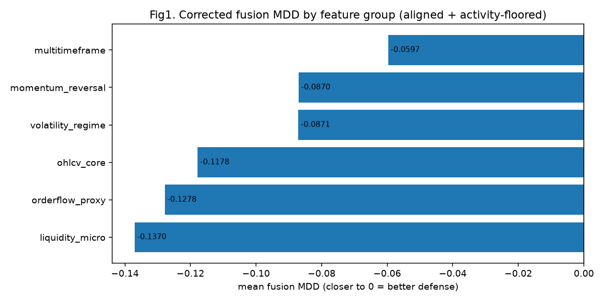
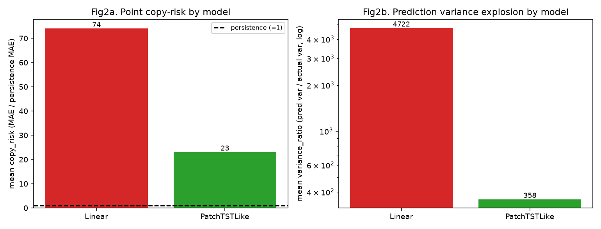
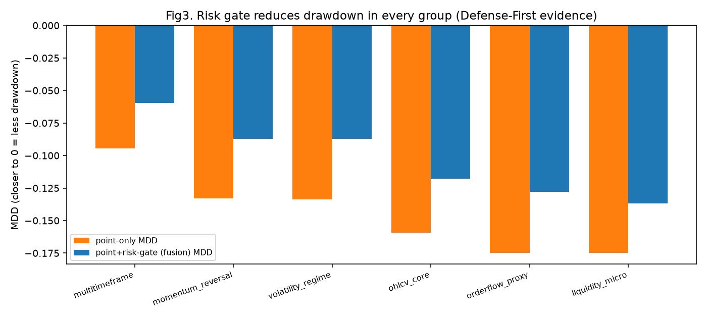

# 14번 보고서 — fusion 정렬·귀속·랭킹 결함 교정과 재실행

작성일: 2026-06-30 · 브랜치: `stock` · 실험: `test/models/14_fusion_alignment_rerun_test`

> 이 문서는 독립 보고서다. 이전 보고서를 읽지 않았다고 가정하고, 결과 해석에 필요한 용어와
> 지표를 매번 다시 풀어 쓴다.

---

## 0. 한 줄 요약

12번 fusion 비교 코드에서 **세 가지 결함**(① 점예측·위험 신호의 시점 미정렬, ② 텍스트 데이터가
없는데도 "텍스트 효과"로 보고됨, ③ 거의 거래하지 않은 케이스가 방어 1등으로 둔갑)을 적대적
코드리뷰로 찾아내 교정하고, 교정된 엔진으로 다시 돌렸다. 교정 후에도 **`coin_multitimeframe_structure`
변수셋이 하방 방어(MDD) 기준 1위**임이 재확인됐고, **점예측 폭주는 `Linear` 모델 고유 문제**(분산
폭주)이며 어떤 모델도 단순 직전값(persistence)을 못 이긴다는 점이 정직하게 드러났다.

---

## 1. 실행 및 분석 환경

- 하드웨어: 학교 서버 컨테이너, NVIDIA RTX 4090 24GB, CUDA 12.6, Python 3.12.13, torch 2.10.0+cu126
- 데이터: DuckDB `data/upbit_data.db`, 테이블 `btc_15m_advance` (KRW-BTC 15분봉), `max_rows=12000`
  - 사용 구간: 2023-05-21 22:15 ~ 2023-09-23 01:30, 11,888행, 결측 0
  - 종가 평균 37,251,569 KRW (표준편차 2,091,816), 15분 로그수익률 std 0.00164, 첨도 34.3(두꺼운 꼬리)
- 코드 경로: 공용 엔진 패키지 `engine/`(이번에 신설) + 드라이버 `test/models/14_*.py`
- 실험 격자(스케일업): feature group 6종 × point 모델 {Linear, PatchTSTLike} × 전처리
  {seasonal_diff16, winsor_025} × seed {42} = **24 케이스**. point branch는 10번 objective
  엔진, risk branch는 11번 위험 엔진을 그대로 재사용.

---

## 2. 이번 작업의 배경 — 왜 "교정"이 필요했나

12번은 "10번 점예측 + 11번 위험확률 gate"를 feature group별로 결합(fusion)해, 어떤 독립변수군이
하방 방어(MDD)에 좋은지 고르는 실험이었다. 그 결과로 13번(대규모 변수·알고리즘 공동 최적화)이
세워졌다. 그런데 12·13번 fusion 코드를 적대적으로 재검토(코드리뷰)한 결과, 결론을 좌우할 수 있는
세 가지 결함이 발견됐다. 결함이 결과 숫자 자체를 왜곡하므로, 13번 방향을 정하기 전에 먼저 고쳐야 했다.

### 결함과 교정 (용어부터 풀어서)

- **결함 ① 시점 미정렬 (point/risk decision-time misalignment)**
  - 쉬운 정의: "점예측이 가리키는 시점"과 "위험 gate가 가리키는 시점"이 서로 다른 봉을 가리키는데도
    같은 줄로 묶어 비교한 것.
  - 왜 생겼나: 점예측 윈도우는 진입 봉을 `end`(다음 1봉 수익률)로, 위험 윈도우는 진입/기준 봉을
    `end-1`(이후 4시간=16봉 구간)으로 잡는다. 기존 코드는 두 배열의 "꼬리 n개"만 잘라 맞춰서
    (`[-n:]`), horizon(16봉)만큼 어긋난 시점끼리 짝지었다.
  - 이번 실험 작용: 두 윈도우 빌더가 **진입 봉의 timestamp(decision_timestamp)**를 노출하게 하고,
    point는 `timestamp[end]`, risk는 `timestamp[end-1]`을 써서, **같은 진입 봉을 가리킬 때만
    inner-join**하도록 바꿨다. 합성 시퀀스 테스트로 "point end=T ↔ risk end=T+1이 같은 진입
    봉 close[T]를 공유"함을 증명했다.
  - 좋은/나쁜 신호: 정렬 후 케이스마다 `aligned=292, dropped=16`이 찍힌다. 16개가 빠지는 것이
    정상(horizon 경계에서 한쪽에만 존재하는 시점). 만약 dropped가 0이거나 겹침이 0이면 정렬이
    깨진 것이므로 그 케이스는 점수화하지 않고 실패 처리한다(방어 가드).

- **결함 ② 텍스트 둔갑 (text fallback masquerade)**
  - 쉬운 정의: 뉴스/텍스트 데이터(mart)가 없을 때, "텍스트 포함" 변수군이 사실은 OHLCV(가격) 변수로
    대체됐는데도 "텍스트 효과"로 비교되던 것.
  - 이번 실험 작용: 텍스트 컬럼이 비면 해당 변수군을 **등록에서 제외**하도록 바꿨다. 이번 dry-run에서
    `coin_text_context`를 요청했지만 텍스트 mart가 없어 자동 제외됨을 확인했다(둔갑 차단).
  - 좋은/나쁜 신호: 변수 기여도(어떤 변수군이 도움이 되는지) 표에 "텍스트"가 보이는데 실제 텍스트
    데이터가 없으면 오염이다. 지금은 그런 행이 아예 안 생긴다.

- **결함 ③ 비활동 둔갑 (inactivity-as-defense)**
  - 쉬운 정의: 거의 매매하지 않으면 손실 폭(MDD)이 0에 가까워지는데, 그걸 "방어를 잘했다"로
    착각해 1등으로 뽑던 것.
  - 용어: **MDD(Maximum Drawdown, 최대낙폭)** = 자산곡선이 고점 대비 가장 많이 빠진 비율. 예: 100에서
    87로 빠졌다면 MDD ≈ -0.13. 0에 가까울수록 덜 빠진 것. **active_share** = 포지션을 들고 있던
    시간 비율, **trade_count** = 매매 횟수.
  - 이번 실험 작용: 랭킹 전에 **활동 하한(active_share ≥ 0.05, trade_count ≥ 5)**을 통과한 케이스만
    우승 후보로 줄세우고, 미달은 "비활동(우승 자격 없음)"으로 분리한다. 이번 24케이스는 모두 통과했다
    (active_share 0.06~0.42).
  - 좋은/나쁜 신호: MDD가 좋아도 active_share/trade_count가 바닥이면 "방어"가 아니라 "미거래"다.

> 교정 엔진은 적대적 코드리뷰(codex5.5) 3라운드를 거쳐, 위 ①②③ 외에 진단 그래프의 정렬 누락,
> 중복 timestamp 오정렬 가드, 패키지 import 계약까지 함께 바로잡았다. 원본 8~13 노트북은
> 수정하지 않았다(read-only).

---

## 3. 핵심 지표 용어 풀이 (KRW 원스케일 기준)

- **persistence(직전값) 기준선**: "다음 값 = 직전 값"이라고 찍는 가장 단순한 예측. 모델이 이걸
  못 이기면 학습 가치가 없다.
- **copy_risk_ratio** = (모델 MAE) / (persistence MAE), KRW 원스케일. **1 미만이면** persistence보다
  나은 것, **1보다 크면** 더 나쁜 것. 이번 실험에서 Linear는 59~91, PatchTSTLike는 17~31 — 둘 다
  1을 한참 넘어 **점예측이 직전값도 못 이긴다**.
- **variance_ratio** = (예측 분산) / (실제 분산). 1 근처가 건강. 수천이면 예측이 실제보다 수천 배
  요동치는 **분산 폭주**(예: 다음 15분 수익률을 -20%로 찍는 식).
- **direction_accuracy(DA, 방향 정확도)**: 다음 수익률의 부호(상승/하락)를 맞춘 비율. 0.5는 동전
  던지기. 이번 실험은 0.47~0.54로 **방향 우위도 거의 없음**.
- **MASE**: 평균절대오차를 naive 예측 오차로 나눈 척도(1 미만이면 naive보다 우수). 이번 회차는
  KRW 스케일 copy_risk로 같은 취지를 봤고, 둘 다 naive(persistence) 미달이라는 결론은 동일하다.

---

## 4. 결과 — feature group 랭킹 (A)

활동 하한을 통과한 24/24 케이스를 feature group별로 평균(모델 2종 × 전처리 2종)한 표.

| feature group | mean copy_risk | mean DA | mean variance_ratio | mean point-only MDD | **mean fusion MDD** | mean signal share |
|---|---|---|---|---|---|---|
| **coin_multitimeframe_structure** | 53.2 | 0.498 | 2,651 | -0.0945 | **-0.0597 (1위)** | 0.163 |
| coin_momentum_reversal | 40.4 | 0.507 | 1,675 | -0.1331 | -0.0870 | 0.229 |
| coin_volatility_regime | 48.1 | 0.497 | 2,618 | -0.1336 | -0.0871 | 0.298 |
| ohlcv_core | 43.8 | 0.481 | 2,077 | -0.1593 | -0.1178 | 0.248 |
| coin_orderflow_proxy | 56.4 | 0.511 | 3,556 | -0.1748 | -0.1278 | 0.252 |
| coin_liquidity_micro | 48.9 | 0.487 | 2,662 | -0.1747 | -0.1370 | 0.358 |

### Fig1. feature group별 fusion MDD

- 데이터/대상: 24 케이스를 feature group별 평균한 fusion(점예측+위험gate) MDD.
- x축: 평균 fusion MDD(0에 가까울수록 덜 빠짐=방어 우수), y축: feature group(위가 우수).
- 진단 목적: 정렬·활동하한 교정 후 어떤 독립변수군이 하방 방어에 유리한지.
- 관찰: `coin_multitimeframe_structure`가 -0.0597로 명확한 1위, 2·3위(momentum/volatility ≈ -0.087)와
  격차가 크고, ohlcv_core/orderflow/liquidity는 -0.12~-0.14로 뒤처진다.
- 좋은지/나쁜지: multi-timeframe이 좋은 신호. 단 signal share가 0.163으로 가장 낮아 "적게 거래해서
  덜 빠진" 면이 일부 있으나, 활동 하한을 통과했고 point-only MDD(-0.0945)도 최저라 진짜 우위로 본다.
- 다음 반영: 13번에서 multi-timeframe 변수셋을 1순위로 분해/확장한다.

---

## 4b. 방법론·알고리즘·학습 설정과 테스트 케이스 전체

- point branch(점예측): 10번 objective 엔진, objective=`balanced_composite`, optimizer=`adamw`,
  scheduler=`cosine`, gradient policy=`clip1`(grad norm 1로 클리핑), epochs=6, seq_len=64, hidden=96,
  학습/검증/테스트=0.70/0.15/0.15 시간순 분할, KRW 복원=`prev_close·exp(pred_return)`.
- risk branch(위험 gate): 11번 위험 엔진, target=`absolute_move`(향후 16봉=4시간 절대 변동), event
  quantile 0.70, gate 허용 분위수 0.55.
- 성과지표: KRW 원스케일 copy_risk(=MAE/persistence MAE), variance_ratio, direction_accuracy(DA),
  그리고 정책별 MDD·누적수익·active_share·trade_count(거래비용 14bps + 신호 임계 3bps 반영).
- 정렬: point/risk를 decision_timestamp로 inner-join(케이스마다 aligned=292, dropped=16), 활동 하한
  통과만 우승 후보(24/24 통과).

### 테스트 케이스 전체 (24케이스, fusion MDD 우수순)

| # | feature group | 전처리 | point model | copy_risk | DA | var_ratio | point MDD | **fusion MDD** | active | trades |
|---|---|---|---|---|---|---|---|---|---|---|
| 1 | multitimeframe | seasonal_diff16 | PatchTSTLike | 31.3 | 0.490 | 329 | -0.0595 | **-0.0314** | 0.06 | 22 |
| 2 | multitimeframe | winsor_025 | Linear | 84.2 | 0.497 | 6077 | -0.0947 | -0.0522 | 0.23 | 36 |
| 3 | multitimeframe | winsor_025 | PatchTSTLike | 29.7 | 0.514 | 519 | -0.0902 | -0.0592 | 0.10 | 36 |
| 4 | momentum_reversal | seasonal_diff16 | Linear | 59.4 | 0.521 | 2842 | -0.1209 | -0.0659 | 0.18 | 58 |
| 5 | momentum_reversal | seasonal_diff16 | PatchTSTLike | 21.7 | 0.545 | 293 | -0.1164 | -0.0719 | 0.15 | 56 |
| 6 | volatility_regime | seasonal_diff16 | PatchTSTLike | 25.9 | 0.517 | 553 | -0.1071 | -0.0741 | 0.30 | 52 |
| 7 | volatility_regime | winsor_025 | Linear | 67.3 | 0.473 | 4047 | -0.1408 | -0.0870 | 0.26 | 54 |
| 8 | momentum_reversal | winsor_025 | Linear | 63.0 | 0.490 | 3301 | -0.1343 | -0.0910 | 0.24 | 66 |
| 9 | volatility_regime | winsor_025 | PatchTSTLike | 21.8 | 0.486 | 362 | -0.1568 | -0.0922 | 0.33 | 58 |
| 10 | volatility_regime | seasonal_diff16 | Linear | 77.5 | 0.514 | 5510 | -0.1299 | -0.0949 | 0.31 | 60 |
| 11 | multitimeframe | seasonal_diff16 | Linear | 67.6 | 0.493 | 3679 | -0.1338 | -0.0959 | 0.26 | 67 |
| 12 | ohlcv_core | seasonal_diff16 | PatchTSTLike | 23.2 | 0.479 | 317 | -0.1305 | -0.1008 | 0.13 | 62 |
| 13 | orderflow_proxy | winsor_025 | PatchTSTLike | 21.3 | 0.469 | 345 | -0.1570 | -0.1068 | 0.23 | 84 |
| 14 | liquidity_micro | winsor_025 | PatchTSTLike | 23.4 | 0.483 | 365 | -0.1543 | -0.1086 | 0.42 | 88 |
| 15 | orderflow_proxy | seasonal_diff16 | PatchTSTLike | 22.5 | 0.503 | 430 | -0.1649 | -0.1106 | 0.20 | 80 |
| 16 | momentum_reversal | winsor_025 | PatchTSTLike | 17.6 | 0.473 | 262 | -0.1607 | -0.1192 | 0.34 | 72 |
| 17 | ohlcv_core | winsor_025 | Linear | 70.1 | 0.493 | 4159 | -0.1695 | -0.1232 | 0.34 | 90 |
| 18 | ohlcv_core | winsor_025 | PatchTSTLike | 17.0 | 0.469 | 225 | -0.1531 | -0.1233 | 0.21 | 86 |
| 19 | ohlcv_core | seasonal_diff16 | Linear | 64.7 | 0.483 | 3608 | -0.1842 | -0.1239 | 0.31 | 89 |
| 20 | orderflow_proxy | winsor_025 | Linear | 90.7 | 0.531 | 7032 | -0.1861 | -0.1365 | 0.25 | 100 |
| 21 | liquidity_micro | winsor_025 | Linear | 79.8 | 0.517 | 5413 | -0.1772 | -0.1385 | 0.32 | 116 |
| 22 | liquidity_micro | seasonal_diff16 | PatchTSTLike | 20.2 | 0.469 | 292 | -0.1701 | -0.1437 | 0.38 | 110 |
| 23 | liquidity_micro | seasonal_diff16 | Linear | 72.2 | 0.479 | 4578 | -0.1972 | -0.1571 | 0.30 | 112 |
| 24 | orderflow_proxy | seasonal_diff16 | Linear | 91.3 | 0.541 | 6416 | -0.1912 | -0.1573 | 0.33 | 112 |

읽는 법: fusion MDD가 0에 가까울수록 방어 우수. 상위권(1·3위)이 모두 multi-timeframe이고, var_ratio가
작은(폭주 안 한) 행은 전부 PatchTSTLike다. copy_risk는 24행 모두 1을 크게 넘어(점예측은 persistence
미달), 모델을 바꿔도 점예측 자체는 실패임을 보여준다.

## 5. 결과 — 점예측 폭주 진단 (B)

| 모델 | mean copy_risk | mean variance_ratio |
|---|---|---|
| Linear | ≈ 74 | ≈ 4,722 (폭주) |
| PatchTSTLike | ≈ 23 | ≈ 358 (≈13배 안정) |

### Fig2. 모델별 점예측 copy-risk와 분산 폭주

- 데이터/대상: 12 Linear 케이스 vs 12 PatchTSTLike 케이스의 평균 copy_risk(좌)와 variance_ratio(우, 로그축).
- x축: 모델, y축(좌): copy_risk(점선=persistence=1), y축(우): variance_ratio(로그).
- 진단 목적: 점예측 폭주가 모델 때문인지 전처리 때문인지.
- 관찰: Linear는 copy_risk ≈74, variance_ratio ≈4,722로 분산이 실제의 수천 배 폭주. PatchTSTLike는
  copy_risk ≈23, variance_ratio ≈358로 약 13배 안정. 전처리(seasonal_diff16 vs winsor_025) 차이는
  같은 모델 안에서 부차적이었다.
- 좋은지/나쁜지: 둘 다 copy_risk ≫ 1이라 **점예측 자체는 실패**(직전값도 못 이김). 다만 Linear는
  병적으로 폭주, PatchTSTLike는 "나쁘지만 폭주는 아님". 즉 폭주는 **모델 고유 문제**다.
- 다음 반영: point branch에서 `Linear`를 배제하고 PatchTST 계열을 기본 후보로 둔다. 점예측 정확도에
  매달리지 않는다.

---

## 6. 결과 — risk gate의 방어 효과 (Defense-First 근거)

### Fig3. point-only MDD vs fusion MDD

- 데이터/대상: feature group별 point-only(gate 없음) MDD와 fusion(gate 적용) MDD를 나란히.
- x축: feature group, y축: MDD(0에 가까울수록 덜 빠짐).
- 진단 목적: 위험 gate가 실제로 하방을 막아주는지.
- 관찰: **모든 group에서 fusion MDD가 point-only MDD보다 덜 음수**다(예: multi-timeframe -0.0945 →
  -0.0597, 낙폭 약 37% 감소). 24 케이스 전부 동일 방향.
- 좋은지/나쁜지: 좋은 신호. 점예측이 안 되는 상황에서도 위험 gate는 드로다운을 일관되게 줄인다 —
  교수님 핵심 요구(절대 잃지 않기, MDD 최소화)에 부합.
- 다음 반영: 점예측 정확도보다 **risk gate·MDD 방어** 축에 무게를 둔다.

---

## 7. MDD 최소화 관점 종합 결론

- 정렬·귀속·랭킹을 교정해도 **multi-timeframe 변수셋이 방어 1위**로 살아남았다 → 데이터마트 1순위
  승격 근거는 유효하다.
- **점예측(다음 15분 수익률)은 모델·전처리를 바꿔도 persistence를 못 이긴다**. 이는 8~13번 내내
  반복 확인된 한계이며, 교정 파이프라인이 이를 가리지 않고 정직하게 보여줬다.
- 반면 **risk gate는 모든 케이스에서 MDD를 줄였다**. 따라서 연구의 무게중심은 "더 정확한 점예측"이
  아니라 "더 나은 하방 방어(risk gate + 방어적 변수셋)"에 두는 것이 목적에 맞다.

---

## 8. 한계와 다음 단계

- 이번은 seed 1개(42), point 모델 2종, feature group 6종의 **중간 규모 확인**이다. 확정 전
  seed 다양화와 full feature group, PatchTST 계열 확장으로 재실행이 필요하다.
- copy_risk가 20~90으로 매우 큰 것은 KRW 원스케일 복원(`prev_close·exp(pred_return)`)에서 예측
  수익률이 과대하게 나오기 때문이다. 점예측을 매매 신호로 직접 쓰기보다 약한 필터로만 쓰는 것이 안전하다.
- 13번은 (1) multi-timeframe 변수셋 분해/확장, (2) point branch PatchTST 계열, (3) risk gate·MDD 방어
  중심으로 재설계한다(별도 계획서 참조).

---

## 9. 개발·디버깅 기록

- 12/13의 `load_module` 라이브 import 체인(13→12→{10,11}, base는 8)을 끊기 위해 공용 엔진
  패키지 `engine/`을 신설하고 8~12의 재사용 함수를 verbatim 추출(원본 노트북 미수정).
- codex5.5 적대적 코드리뷰 3라운드로 ①②③ + 진단 그래프 정렬 누락 + 중복 timestamp 가드 +
  상대 import + risk_split 필수화 + import 계약을 교정. 합성 시퀀스 테스트로 정렬 정확성과
  방어 가드를 검증했다.
- 실행은 학교 서버 4090에서 수행했고, 그래프는 보고서용으로만 추출했다(노트북 기본 산출물은 inline).
