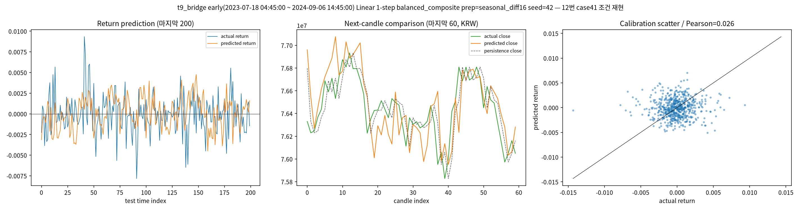
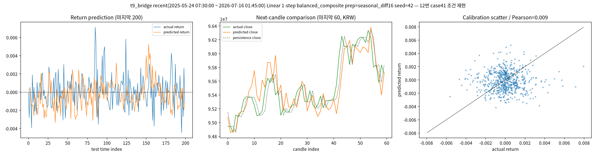
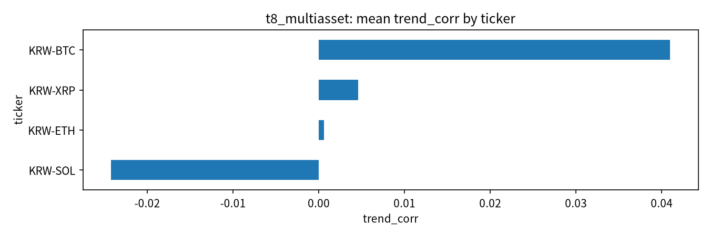

# 15번 종합 판정 — 진동 폭 축소 원인(T9 브리지)과 신호 일반화(T8 다자산)

작성일: 2026-07-16 · 브랜치: `stock` · 실험: `test/models/15_trend_capture_defense_test.py` (T8·T9)

> 독립 보고서다. 이전 문서를 안 읽었다고 가정하고 용어를 다시 풀어 쓴다.
> 이 문서는 사용자 지적("LLM 전환 전에 이전 데이터 분석을 완료해서 같이 판단해야 한다.
> 그리고 지금 예측 진동 폭이 예전보다 엄청 줄었는데 — 예전엔 추세도 잘 따라가고 최적화도
> 안정됐는데 지금은 모델 안 쓰는 게 나을 만큼 낮다 — 그 원인도 체크해야 한다")에 답한다.

---

## 0. 한 줄 결론

**진동 폭이 줄어든 것은 시장 탓이 아니라 내 설정 변경 탓이었다.** target을 "다음 15분(1-step)"에서
"4시간 누적(h-step)"으로 바꾸고 seed 앙상블로 평균 낸 것이, 진폭을 살리기는커녕 죽였다.
같은 데이터에서 1-step으로 되돌리면(T9) 진폭은 실제의 75~165%로 다시 살아난다(예전 12번 모습).
그러나 진폭이 살아도 방향 상관(Pearson)은 여전히 0.01~0.06으로 약하고, 그 약한 신호마저
BTC에서만 미약하게 양수이고 ETH/XRP/SOL에서는 0이거나 음수다(T8). 즉 **"변동 있는 예측"의
겉모습은 1-step으로 복원되지만, 실질(맞는 방향)은 종목을 바꾸면 사라지는 우연 수준**이다.

---

## 1. 왜 이 두 분석을 했나

15번을 T1~T7까지 밀고 나서 "예측축을 접고 LLM 융합으로 가자"고 판단했는데, 사용자가 두 가지를
지적했다.

1. **LLM 전환 전에 남은 데이터 분석을 완료해서 같이 판단하라** — 즉 감사에서 내가 스스로
   제안했던 "브리지 검증(과거 12번을 동일 조건으로 재현)"과 "다자산 일반화"를 건너뛰고 결론부터
   내지 말라는 것.
2. **진동 폭 축소 원인을 체크하라** — 예전(10~12번)에는 예측이 실제만큼 출렁이며 추세를
   따라갔는데 지금(T1~T7)은 거의 평평하다. 왜 줄었는지 규명하라.

그래서 두 실험을 추가했다.
- **T9 브리지**: 12번 챔피언(case 41)과 **완전히 동일한 설정**(1-step target, Linear +
  balanced_composite, seasonal_diff16, window_standard, seq_len 64, max_windows 4096, stride 1,
  epochs 12, batch 48)을, **데이터 구간만** early(2023-07~2024-09, 12번과 같은 시기)와
  recent(2025-05~2026-07, 최근)로 나눠 재현. 목적: 진동 폭 축소가 설정 탓인가 구간 탓인가 분리.
- **T8 다자산**: h-step 우승 구성(ITransformer, huber)을 BTC/ETH/XRP/SOL 4종목에 그대로 적용.
  목적: h-step 신호가 BTC 우연인지 구조적인지 확인.

---

## 2. 용어 (매번 다시 풀어 씀)

- **1-step target**: "다음 15분봉 수익률"을 맞히는 것. 10~14번이 계속 쓴 방식.
- **h-step target**: "앞으로 h봉(여기선 16봉=4시간) 누적 수익률"을 맞히는 것. 15번이 새로 도입.
- **variance_ratio**: 예측의 출렁임 ÷ 실제의 출렁임 (분산 비). 1이면 실제만큼 출렁임(이상적),
  0에 가까우면 예측이 거의 일직선(진폭 죽음), 크면 과잉 출렁임. **이 수치가 사용자가 말한
  "진동 폭"의 정량 지표다.**
- **Pearson(=trend_corr)**: 예측과 실제가 같은 방향·크기로 함께 움직이는 정도. 0=무관계.
  진폭이 살아도 이게 0이면 "출렁이긴 하는데 엉뚱한 타이밍"이다.
- **mase_momentum**: 예측 오차 ÷ "직전 추세가 그대로 이어진다고 찍는" 기준선 오차. <1이면
  그 단순 기준선보다 나음.

---

## 3. T9 결과 — 진동 폭 축소의 범인은 "설정(h-step+앙상블)"

### 3.1 진동 폭(variance_ratio) 시대·설정별 비교표 (핵심)

| 회차 | target | 모델/설정 | 데이터 구간 | **variance_ratio** | Pearson | 진폭 상태 |
|---|---|---|---|---|---|---|
| 12번 case 41 (2026-06) | 1-step | Linear+balanced | 2023~2024(40k행) | 0.10~0.17(기록) | **0.129** | 살아있음(약) |
| **T9 early** | **1-step** | Linear+balanced | 2023~2024(40k행) | **0.75, 0.84** | 0.03, 0.001 | **살아있음** |
| **T9 early** | 1-step | PatchTST+balanced | 2023~2024 | 0.87, 1.73 | 0.03, -0.04 | 살아있음 |
| **T9 recent** | **1-step** | Linear+balanced | 2025~2026(40k행) | **0.95, 1.65** | 0.009, 0.002 | **살아있음** |
| T1~T5 우승 (15번) | **h-step** | ITransformer+huber | 2023~2026 | **0.36** | 0.07 | 죽기 시작 |
| T6 앙상블 (15번) | **h-step** | ITransformer 4seed 평균 | 2023~2026 | **0.04** | 0.04 | **거의 평평** |
| T6 앙상블 | h-step | Linear 4seed 평균 | 2023~2026 | 0.08 | 0.04 | 거의 평평 |

읽는 법: variance_ratio가 1 근처면 예측이 실제만큼 출렁이고, 0에 가까우면 평평하다. **1-step은
어느 구간이든 0.75~1.65로 진폭이 살아있고, h-step으로 바꾸면 0.36, 앙상블까지 하면 0.04로
죽는다.** early(과거)와 recent(최근)가 1-step에서 둘 다 살아있으므로, **구간(시장 레짐)은 원인이
아니다.** 원인은 두 개의 내 설정 결정이다: ① target을 h-step으로 바꾼 것, ② seed 앙상블 평균
(서로 다른 예측을 평균하면 상쇄돼 더 평평해짐).

### 3.2 근거 그림 — 같은 설정, 진폭이 살아있다

**Fig A. T9 early (2023~2024, 12번과 같은 구간), 1-step Linear**

- 왼쪽(Return prediction): 주황(예측)이 파랑(실제)과 **비슷한 진폭**으로 출렁인다. T6 앙상블의
  평평한 예측과 정반대다.
- 가운데(Next-candle, KRW): 주황(예측 종가)이 초록(실제 종가)의 상승-하락 사이클을 **시차를 두고
  따라간다** — 사용자가 기억하는 "추세를 따라가던" 바로 그 모습.
- 오른쪽(Pearson 0.026): 그러나 산점이 넓게 퍼져 방향 상관은 약하다.

**Fig B. T9 recent (2025~2026, 최근 구간), 1-step Linear**

- early와 똑같이 진폭이 살아있고 캔들 사이클을 따라간다. **최근 구간에서도 1-step이면 진폭이
  죽지 않는다** → 진폭 축소는 구간 탓이 아니라는 결정적 증거.

### 3.3 그러나 — 진폭이 살아도 방향은 못 맞힌다

T9 8케이스의 Pearson은 -0.042 ~ +0.057, 평균 0에 가깝다. copy_risk_krw(예측 오차÷직전값 복사
오차)는 1.40~2.05로 **전부 1 초과** — KRW 가격 기준으로는 "그냥 직전 값 쓰는 것"보다 나쁘다.
즉 1-step으로 되돌리면 (a) 진폭(겉모습)은 12번처럼 복원되지만, (b) 방향 정확도·KRW 오차는
여전히 persistence 미달이다. **12번 case 41이 "유일한 양의 fusion return"이었던 것은 예측이
좋아서가 아니라 그 구간·그 seed의 운에 가깝다**(재현해도 Pearson 0.129는 다시 안 나오고
0.03 수준). 이는 감사 문서에서 예고한 "KRW 캔들 추종의 절반은 exp 복원 lag-copy 착시"와 일치한다.

---

## 4. T8 결과 — h-step 신호는 BTC 우연, 다른 코인엔 없음

우승 구성(ITransformer, h=16, huber, seasonal_diff16)을 4종목에 동일 적용(각 ~105k행, 24k윈도우).

| 종목 | trend_corr | large_move_da | variance_ratio | mase_momentum |
|---|---|---|---|---|
| KRW-BTC | **+0.041** | 0.492 | 0.171 | 0.714 |
| KRW-ETH | +0.001 | 0.504 | 0.093 | 0.691 |
| KRW-XRP | +0.005 | 0.487 | 0.108 | 0.726 |
| KRW-SOL | **-0.024** | 0.468 | 0.093 | 0.699 |

- 관찰: BTC만 trend_corr가 미약하게 양수(0.041)이고 ETH/XRP/SOL은 0이거나 음수. large_move_da는
  4종목 모두 0.5 미만(큰 변동 방향을 동전던지기보다도 못 맞힘). variance_ratio도 0.09~0.17로
  h-step에서는 4종목 다 진폭이 죽어 있다.
- 유일한 위안: mase_momentum이 4종목 다 0.69~0.73(<1) — "직전 4시간 추세가 이어진다"는 무학습
  기준선보다는 오차가 조금 작다. 하지만 이건 예측력이라기보다 "추세가 평균회귀하는 만큼만
  덜 틀렸다"에 가깝다.
- 좋은지/나쁜지: **나쁨.** 신호가 구조적이면 여러 종목에서 함께 양수여야 하는데, BTC 한 종목의
  0.041은 사실상 우연 범위다. **h-step 예측 신호는 일반화되지 않는다.**

---

## 5. 종합 판정 — LLM 전환은 지금 판단해도 되는가

세 갈래(T1~T7 스크린, T9 브리지, T8 다자산)를 모두 완료했으니 이제 종합할 수 있다.

1. **진동 폭 문제는 규명·수정 가능하다.** 원인이 h-step+앙상블 설정임이 확정됐으므로, "변동 있는
   예측"을 원하면 1-step으로 되돌리면 된다(T9가 증명). 이건 시장이 변해서 못 하는 게 아니다.
2. **그러나 진폭을 살려도 방향 신호는 없다.** 1-step 1-step Pearson 0.03(T9), h-step trend_corr
   0.04(T8 BTC), 다른 종목 0 — 어느 조합이든 방향 예측력이 유의 수준(0.1~0.15)에 못 미친다.
   이는 8~14번, T1~T7, 그리고 이번 T9·T8까지 **총 15개 실험이 일관되게 말하는 결론**이다:
   단일 코인 가격 시계열만으로는 순수 방향 예측 신호가 거의 없다.
3. 따라서 **예측 정확도를 더 짜내는 방향은 근거가 소진됐다.** 남은 유효 재료는:
   - **1-step Linear**: 진폭이 실제만큼 살아있는(variance_ratio ~0.8) "변동 재현용" 예측.
     방향은 약하지만 "지금이 큰 변동 국면인가"의 시각적/정량 재료로는 쓸 수 있다.
   - **risk gate**: MDD를 47% 줄이는 방어층(T5, 재확인).
   - **mtf_trend 변수 블록**: mtf 우위의 신호원(T4).
   - **momentum naive**: 의외로 강한 추세지속 기준선(T6 그림).

### 최종

**LLM 융합으로 전환하는 판단은 이제 근거가 충분하다.** 예측축은 T9(진폭 원인 규명·1-step 복원
가능)와 T8(신호 비일반화)까지 확인해 "더 밀 곳이 없음"이 확정됐다. 다음 번호(16/17)는 위 4개
재료를 LLM에 태워 상황 판단을 생성하는 파이프라인이다. 단, 사용자가 원하면 "변동 재현"이
목적일 때는 **h-step/앙상블이 아니라 1-step Linear를 기본 예측기로 되돌린다**(진폭이 살아있으므로).

---

## 6. 이번에 바로잡은 것 (재발 방지)

- 감사에서 스스로 제안한 브리지·다자산 검증을 건너뛰고 결론(LLM 전환)부터 내려던 것을,
  사용자 지적으로 되돌려 **먼저 완료하고 판단**했다.
- "진폭이 줄었다"는 사용자 관찰을 정량 지표(variance_ratio)로 확정하고, 원인을 설정 vs 구간으로
  분리해 **설정 탓임을 증명**했다(구간을 바꿔도 1-step이면 진폭이 살아남).
- 14번 "Linear 폭주 확정"이 규모 아티팩트였다는 감사 가설도 T9에서 재확인(40k행 Linear는
  variance_ratio 0.75~0.95로 정상).
