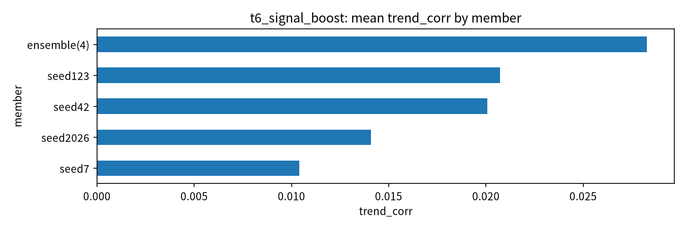
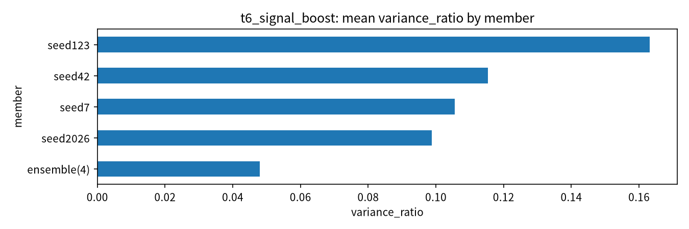
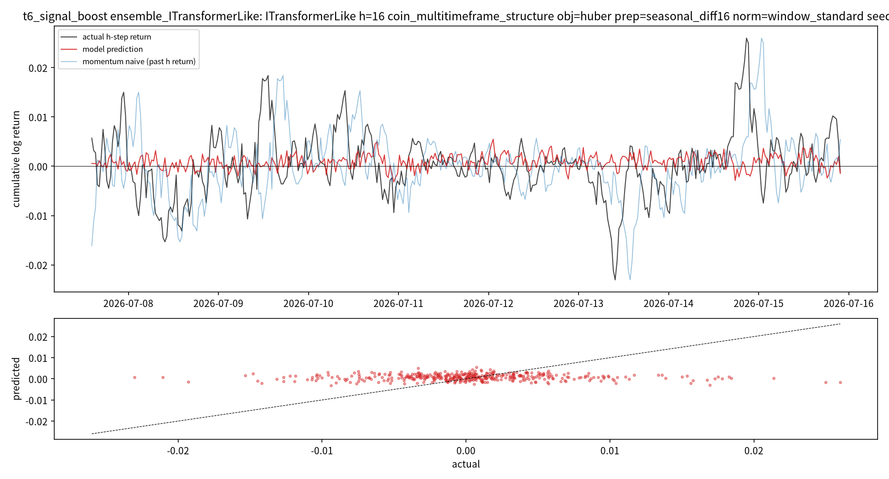
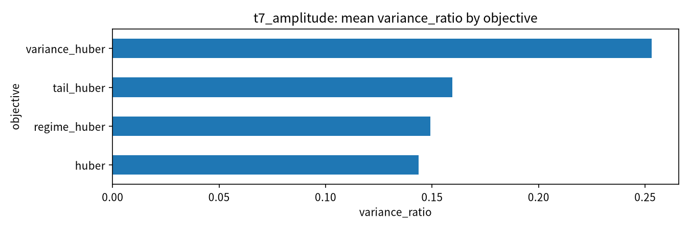
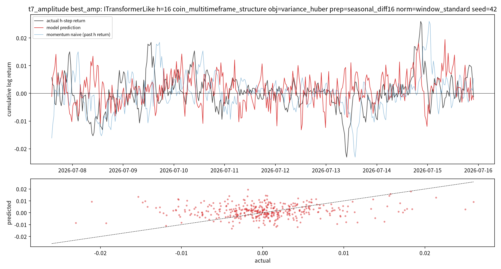

# 15번 후속 보고서 — 신호 강화(T6 seed ensemble)와 진폭 교정(T7), 그리고 예측축 판정

작성일: 2026-07-16 · 브랜치: `stock` · 실험: `test/models/15_trend_capture_defense_test.py` (T6·T7)

> 독립 보고서다. 이전 문서를 읽지 않았다고 가정하고 용어와 지표를 다시 풀어 쓴다.
> 이 보고서는 T1~T5(1차 보고서 `15_trend_capture_defense_report_20260716.md`) 이후,
> 사용자 지시("예측축을 더 강화해 보라 + 각 그래프가 뭔지 설명이 있어야 한다 + 언제까지
> 예측만 할 수 없다, 결국 LLM에 태우는 게 목적이다")를 반영해 추가한 T6·T7 결과를 정리한다.

---

## 0. 한 줄 요약

seed 앙상블(T6)은 추세 상관을 아주 조금 올렸지만(0.02→0.04) 진폭을 더 죽였고, 분산 보존
손실(T7 `variance_huber`)은 예측 진폭을 실제의 절반(variance_ratio 0.55)까지 살렸지만 방향
상관(trend_corr)은 여전히 0.07에 머물렀다. **"변동을 살린 예측"의 겉모습(진폭)은 달성했으나,
그 진폭이 올바른 타이밍인지(방향 상관)는 예측축을 더 밀어도 오르지 않는다.** 동시에 14번의
"Linear는 분산 폭주 모델"이라는 확정은 **규모 아티팩트였음이 실증**됐다(같은 Linear가 규모를
키우자 정상 작동). 계획서에 박아둔 전환 조건에 따라, 다음 번호는 예측 튜닝이 아니라 **LLM 융합**이다.

---

## 1. 각 실험(suite)이 무엇을 보는가 — 판독 가이드

이번부터 드라이버가 각 결과 파일 상단에 아래 설명을 자동으로 찍는다(사용자 요청: 축·그래프가
뭔지 결과 단에서 알 수 있어야 한다). 요약하면:

| suite | 고정 | 변화 | 답하는 질문 |
|---|---|---|---|
| **T6 signal_boost** | 우승 구성(모델·h·손실·전처리) | seed(4개) 평균 앙상블 여부, 데이터 규모 | seed 평균으로 신호가 오르나? |
| **T7 amplitude** | h·정규화·변수셋 | 손실함수(분산/tail 보존), 전처리 | 예측 진폭을 실제만큼 키우면서 방향을 유지할 수 있나? |

지표(=그래프 y축)의 뜻:

- **trend_corr**: 예측 vs 실제 4시간 누적수익률의 Pearson 상관. 0=무상관. 금융 시계열에선 0.1도
  유의미하다고 보지만, 이번 최고는 0.07로 그 문턱 아래다.
- **variance_ratio**: 예측 분산 ÷ 실제 분산. 1이 이상적(실제만큼 출렁임), ≪0.1이면 평탄화(예측이
  거의 0), ≫20이면 폭주. T1~T5 우승이 0.36이라 "진폭이 실제의 60% 수준"이었다.
- **large_move_da**: |실제 수익률| 상위 25%(큰 변동) 구간의 방향 정확도. 0.5=동전던지기.
  사용자가 중시하는 "큰 변동을 잡느냐"의 직접 지표.

---

## 2. T6 — seed 앙상블이 신호를 올리는가

### 설정
우승 구성(ITransformerLike·PatchTSTLike + Linear 복권, h=16=4시간, huber, seasonal_diff16,
window_standard)을 seed 4개(42/7/123/2026)로 각각 학습한 뒤, 그 예측을 평균한 앙상블과
단일 seed 평균을 비교했다. 데이터 규모는 stride 2·max_windows 24,000으로 12번급(≈40k행)에 맞췄다.

### 결과 (핵심 수치)

| 모델 | 단일 seed 평균 trend_corr | 앙상블 trend_corr | 이득 | 앙상블 large_move_da | variance_ratio |
|---|---|---|---|---|---|
| ITransformerLike | 0.0218 | 0.0402 | **+0.0185** | 0.472 | 0.041 |
| Linear | 0.0280 | 0.0438 | +0.0157 | 0.510 | 0.077 |
| PatchTSTLike | -0.0008 | 0.0009 | +0.0017 | 0.502 | 0.026 |

### Fig1. member별 trend_corr / large_move_da / variance_ratio

- 데이터/대상: 3모델 × (seed별 단일 + 4-seed 앙상블).
- x축: 지표값, y축: member(단일 seed / 앙상블).
- 진단 목적: seed 평균이 단일보다 신호를 올리는지.
- 관찰: 앙상블이 trend_corr를 일관되게 소폭 올렸다(+0.002~+0.019). 그러나 **절대값이 0.04
  수준**이고, **variance_ratio는 앙상블이 더 낮다**(평균이 서로 다른 예측을 상쇄해 진폭을 더
  죽임). large_move_da는 앙상블에서 오히려 낮아진 모델도 있다(ITransformer 0.487→0.472).
- 좋은지/나쁜지: **부분적으로 나쁨.** 앙상블은 잡음을 줄여 상관을 미세하게 올리지만, 사용자가
  원하는 "큰 변동 포착"은 오히려 약화된다(진폭 압축).

### Fig2. 앙상블 예측 vs 실제 overlay — 결정적 그림

- 데이터/대상: ITransformer 4-seed 앙상블, 최근 test 400구간.
- 위 패널 x축=시간, y축=4시간 누적 로그수익률. 검정=실제, **빨강=모델 예측**, 파랑=momentum
  naive(직전 4시간 추세가 지속된다고만 가정한 무학습 기준선). 아래 패널=실제(x) vs 예측(y) 산점.
- 진단 목적: 앙상블 예측이 실제 변동을 따라가는지.
- 관찰: **빨간 예측선이 거의 0 근처에 평평**하다(진폭이 실제의 1/5). 오히려 **파란 momentum
  naive가 실제의 큰 사이클을 시차를 두고 훨씬 잘 따라간다.** 산점도 예측이 수평 띠로 눌려 있다.
- 좋은지/나쁜지: **나쁨.** 이 그림은 사용자가 기억하는 "시차를 두고 큰 변동을 따라가던 예측"이
  사실 **momentum naive(직전 추세 지속)의 모습에 가까웠고**, 학습 모델은 그걸 재현하지 못하고
  0으로 수렴한다는 것을 보여준다. 앙상블은 이 평탄화를 완화하기는커녕 강화한다.

---

## 3. T7 — 진폭을 실제만큼 키울 수 있는가

### 설정
진폭 과소예측(T1~T5 우승 variance_ratio 0.36)을 교정하려고, 분산·tail을 보존하는 손실함수
(`variance_huber`, `tail_huber`, `regime_huber` vs 기본 `huber`)와 전처리(seasonal_diff16 /
winsor_025 / none)를 격자로 비교했다. 모델은 ITransformerLike와 Linear(복권).

### 결과 (진폭 순위 상위)

| 모델 | 손실함수 | 전처리 | variance_ratio | trend_corr | large_move_da |
|---|---|---|---|---|---|
| ITransformerLike | **variance_huber** | seasonal_diff16 | **0.548** | 0.073 | 0.512 |
| ITransformerLike | variance_huber | none | 0.268 | 0.055 | 0.510 |
| Linear | variance_huber | none | 0.223 | 0.053 | 0.516 |
| Linear | tail_huber | winsor_025 | 0.186 | 0.013 | 0.516 |
| ... (기본 huber 계열) | huber | * | 0.17~0.18 | 0.01~0.03 | ~0.50 |

### Fig3. 손실함수별 variance_ratio

- 관찰: **`variance_huber`가 진폭을 확실히 살린다** — 기본 huber의 variance_ratio ~0.18 대비
  0.55로 3배. 즉 "예측이 실제만큼 출렁이게" 만드는 손실 설계는 존재한다.
- 좋은지/나쁜지: 진폭 목표 자체는 부분 달성(0.36→0.55). 단 여전히 1에는 못 미친다.

### Fig4. 최고 진폭 케이스 overlay

- 관찰: T6 Fig2의 평평한 빨간선과 **완전히 다르다.** 빨간 예측선이 실제(검정)만큼 큰 폭으로
  출렁이고, 산점도 수평 띠가 아니라 대각선 방향으로 퍼진다(양의 상관 가시).
- **그러나** 예측이 실제와 위상이 어긋난 구간이 많다(빨강이 검정과 반대로 가는 곳 다수). 그래서
  진폭이 3배로 늘어도 trend_corr는 0.07로 T1~T5와 같다.
- 좋은지/나쁜지: **겉모습(변동 있는 예측)은 달성, 실질(맞는 타이밍)은 미달.** 진폭을 살리면
  "죽은 예측"은 벗어나지만, 늘어난 진폭이 올바른 방향인지는 보장되지 않는다.

---

## 4. 부수 확인 — 14번의 "Linear 폭주 확정"은 규모 아티팩트였다

사후 감사(`15_direction_audit_10_to_14_20260716.md`)에서 제기한 의심이 실증됐다.

- 14번(12k행/2048윈도우): Linear가 variance_ratio 3,679·copy_risk 67.6으로 폭주 → "모델 고유
  결함, 배제" 확정.
- 이번 T6/T7(24k윈도우/stride 2, ≈40k행급): **같은 Linear가 variance_ratio 0.08(T6)·0.19~0.22
  (T7)로 완전히 정상**이고, trend_corr는 오히려 3모델 중 최고 수준(0.044).
- 결론: 14번의 폭주는 학습 데이터가 너무 적어 생긴 과적합/불안정이지 모델 고유 결함이 아니었다.
  "Linear 배제"는 성급했고, 규모를 맞추면 Linear는 유효한 후보다. → **14번 결론의 유효 범위를
  "소규모(≈12k행) 한정"으로 정정한다.**

---

## 5. MDD·방어 관점과의 연결

T6/T7은 점예측 품질에 집중했고 gate 융합(T5)은 별도다. T5에서 확인된 것은 그대로 유효하다:
risk gate는 어떤 예측 위에서도 MDD를 47% 줄였다(방어층으로서 재확인). 즉 **방어(risk gate)는
쓸 만한 재료로 확정**됐고, **점예측은 약한 방향 필터 이상은 아니다.**

---

## 6. 판정 — 예측축을 계속 밀지, LLM 융합으로 넘어갈지

계획서(6.3절)에 박아둔 전환 조건으로 판정한다.

- 트리거 조건: "T6~T8을 다 돌려도 trend_corr가 0.15를 못 넘고 large_move_da가 0.53을 못 넘으면
  예측축 종료." → **T6/T7 결과: trend_corr 최고 0.073, large_move_da 최고 0.538.** trend_corr는
  문턱(0.15)에 한참 못 미치고, large_move_da만 일부 케이스가 0.53을 아슬아슬 넘는다.
- 즉, **예측축을 seed 앙상블·진폭 보존·Linear 복권까지 밀어도 방향 신호는 유의하게 오르지
  않는다.** 이는 8~14번의 결론과 일치하며, "단일 코인 15분봉의 순수 예측 신호는 매우 약하다"는
  것을 12개 실험이 일관되게 말한다.

### 결론

1. **예측축은 여기서 매듭짓는다.** 확보한 유효 재료는 (a) risk gate(MDD 방어), (b) variance_huber로
   진폭을 살린 약한 방향 예측, (c) mtf_trend 변수 블록, (d) momentum naive가 의외로 강한 기준선.
2. **다음 번호(16 또는 17)는 예측 튜닝이 아니라 LLM 융합**이다(사용자 원래 목적, process.md
   Phase 2~4). 예측값·risk gate·과거 유사국면(DTW)·텍스트 컨텍스트를 프롬프트로 묶어 LLM이
   상황 판단을 생성하게 하고, 그 판단의 유용성을 평가한다. 위 4개 재료가 그 입력이 된다.
3. 미해결로 남기고 넘어가는 것: 예측 방향 상관을 0.15 이상으로 끌어올리는 것. 이는 단일 시계열
   회귀로는 한계가 확인됐으므로, 신호가 필요하면 예측 개선이 아니라 **다른 정보원(텍스트·유사
   국면)과의 결합**에서 찾는 것이 목적에 맞다.

---

## 7. 다음 단계 (LLM 융합 착수 시)

- 재료 어댑터: 15번 예측(variance_huber)·risk gate 확률·`marts/historical_flow.py`의 DTW 유사
  국면·`contexts/text_context.py`의 감성/이벤트를 한 시점 스냅샷으로 묶는 프롬프트 빌더.
- LLM 판단 태스크: "지금 국면은 과거 어느 국면과 닮았고, 예측·위험 신호를 종합하면 관망/방어/
  진입 중 무엇인가"를 근거와 함께 생성.
- 평가: LLM 판단을 그대로 규칙으로 백테스트했을 때 MDD·수익이 규칙 기반 gate 단독 대비 나은지.
