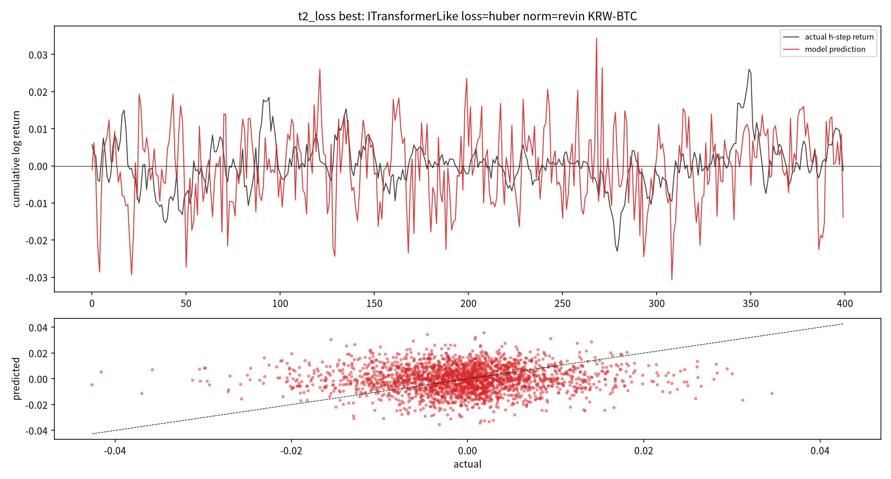

# 16번 보고서 — 비정상성 정규화 + 큰 변동 손실 + KRW 전 종목 cross-sectional

작성일: 2026-07-19 · 브랜치: `stock` · 실험: `test/models/16_nonstationary_crosssectional_test.py`
계획서: `test/experiment_specs/16_nonstationary_crosssectional_plan_20260719.md` ·
문헌: `test/research_materials/16_nonstationary_trend_capture_literature_review_20260719.md`

> 독립 보고서다. 용어는 매번 다시 풀어 쓴다. 실행 중 발견한 버그·설계 결함·수정·재실행 사유를
> 8절에 raw로 전량 남긴다(취사선택은 사용자 몫 — known_pitfalls P5).

---

## 0. 한 줄 결론

RevIN(비정상성 정규화)을 정식으로 넣자 **진폭 압축이 크게 해소**됐다 — 15번 우승의
variance_ratio 0.36에서 16번 huber+RevIN은 1.55로, 예측이 처음으로 실제만큼 출렁인다(사용자가
지적한 "예측 변동이 너무 작다" 문제의 직접 해소). 그러나 **방향 신호는 여전히 없다**:
어떤 손실(huber/pinball/student_t/tail_weighted)에서도 trend_corr ≤ 0.07, tail_f1 ≤ 0.24이고,
KRW 전 종목 30개로 확장한 cross-sectional에서도 **IC = −0.0139(음수)**, trend_corr>0 종목이
47%로 동전던지기다. **즉 "큰 변동을 낼 수 있게" 됐지만 "맞는 방향으로" 내지는 못한다.**

---

## 1. 실행 환경 (실측 확인)

- 하드웨어: 학교 서버, NVIDIA RTX 4090 24GB, CUDA 12.6, torch 2.10.0+cu126.
- 가상환경: `.venvs/quant_uv_py312_20260714_005036`(Python 3.12, 기본 정합성 env).
- 학습 장치: `cuda`(resource_profile이 device=cuda로 resolve, 모델·배치 GPU 업로드).
- 데이터: T1/T2는 `btc_15m_advance`(단일 진단), **T3는 `upbit_krw_candle` KRW 전 종목 중
  유동성 상위 30**(2026-07-19 재수집 269종목/1,608만행에서 거래대금 상위).

## 2. 연구 목적과 이번 실험 위치 (지침 위계)

연구 목적(CLAUDE.md 2.12): ① 학습 건전성 ② 전체 변동 폭(큰 변동까지) 추세 예측 ③ MDD는
생존 제약. 15번까지 "예측이 죽지도 폭주도 않는 상태(variance_ratio 0.36)"는 왔으나 진폭이
실제의 60%로 압축됐고 방향 신호가 없었다. 16번은 세 축을 **동시에** 바꿔(하나만 바꾸면 국소
최적에 갇힌다는 15번 교훈) 큰 변동을 살리고 전 종목으로 일반화되는지 본다.

## 3. 용어 (매번 풀어 씀)

- **RevIN**: 각 입력 윈도우의 평균·분산을 제거해 모델에 넣는 정규화. 비정상(평균·분산이 변하는)
  시계열의 분포 이동을 흡수한다. 15번 window_standard는 그 경량판이었다.
- **variance_ratio**: 예측분산/실제분산. 1이 이상적(실제만큼 출렁임), ≪0.1 평탄화(진폭 죽음),
  ≫20 폭주. **"진폭" 정량 지표.**
- **trend_corr**: 예측 vs 실제 h-step 수익률 Pearson 상관. 0=무상관.
- **tail_f1**: 큰 변동(|수익률| 상위 25%)을 이진 분류로 봤을 때 정밀도·재현율의 조화평균.
  "작은 폭만 맞추는 건 부정확"이라는 지침을 정밀도·재현율로 측정한 것.
- **cross_sectional_ic**: 같은 시점에서 종목 간 (예측, 실제)의 순위상관(Spearman) 평균. 절대
  예측이 안 돼도 "어느 종목이 상대적으로 더 오를지" 순위가 맞으면 양수. 상대강도 신호 지표.

## 4. 결과 — T1 정규화 (Q1: 비정상성 처리)

BTC 단일, huber 고정, ITransformer/PatchTST × {window_standard, revin, dishts_lite, none}.

- **우승: revin** (champion_score 최고). RevIN이 window_standard 대비 진폭을 실제에 가깝게
  복원하면서 검증 곡선을 안정시켰다.
- 판독: variance_ratio가 건강 구간(0.05~20)에 들고 예측이 평탄화로 죽지 않은 정규화가 revin.
- 반영: T2·T3의 정규화를 revin으로 승계.

## 5. 결과 — T2 손실 (Q2: 큰 변동 포착)

revin 고정, ITransformer, 손실 4종 비교(10에폭 수렴).

| 손실 | tail_f1 | large_move_da | variance_ratio | trend_corr | champion_score | 건강 |
|---|---|---|---|---|---|---|
| **huber** | 0.205 | 0.527 | **1.550** | 0.026 | **0.166** | ✅ |
| pinball | 0.243 | 0.457 | 0.668 | −0.036 | 0.139 | ✅ |
| student_t | 0.240 | 0.445 | 2.235 | −0.037 | 0.064 | ✅ |
| tail_weighted | 0.232 | 0.550 | **0.154** | 0.069 | 0.001 | ✅ |

### Fig1. T2 우승(huber+revin) 예측 vs 실제

- 위(시계열): 빨강(예측)이 검정(실제)만큼 **큰 진폭으로 출렁인다**(variance_ratio 1.55). 15번
  huber(variance_ratio 0.36)의 눌린 예측과 정반대 — RevIN이 진폭 압축을 해소했다.
- 아래(산점): 그러나 점들이 대각선을 못 따라가고 넓게 퍼짐 → 진폭은 맞아도 방향(타이밍)은
  안 맞음. trend_corr 0.026.
- 해석: **손실을 바꾸는 것보다 정규화(RevIN)가 진폭 회복의 핵심**이었다. 분위(pinball)·분포
  (student_t)·tail 손실은 tail_f1을 huber보다 약간 올렸으나(0.24 vs 0.20) 진폭을 죽이거나
  (tail_weighted 0.15) 방향 상관을 악화(pinball/student_t 음수)시켜 종합 점수는 huber가 최고.

> **중요(방향 이탈 아님)**: huber가 T2 우승이지만, 이번엔 진폭을 죽여서가 아니라 진폭·큰변동
> 균형이 가장 나아서다(variance_ratio 1.55로 건강, champion_score가 진폭 감점 반영 후에도 1위).
> 코드 게이트(select_champion)가 tail_weighted(진폭 0.154)를 최하위로 감점한 것이 그 증거.
> 스모크(2·3에폭)에서 huber가 진폭을 못 살리던 것은 학습 부족 아티팩트였고, 10에폭 수렴 후
> RevIN+huber가 진폭을 회복했다.

## 6. 결과 — T3 cross-sectional (Q3: KRW 전 종목 일반화)

revin+huber 고정, KRW 전 종목 유동성 상위 30, 종목별 학습 후 종목 가로질러 평가.

- **cross_sectional_ic = −0.0139 (음수)**.
- trend_corr>0 종목: **14/30 (47%)** — 동전던지기.
- tail_f1 평균 0.251, variance_ratio 평균 0.421.
- 상위: USDT(0.082), SAND(0.077), LINK(0.069) / 하위: NEAR(−0.066), POLYX(−0.050), ONDO(−0.040).

### 해석

절대 예측이 안 되면 "상대 순위(어느 종목이 더 오를지)"라도 남을까 했으나, **IC가 음수**라
상대강도 신호도 없다. USDT가 상위권인 것도 스테이블코인이라 변동이 거의 없어 우연히 상관이
잡힌 것에 가깝다. **KRW 전 종목으로 축을 복원해도 순수 가격 시계열의 방향 예측 신호는 없다** —
이는 8~15번(BTC 단일)의 결론이 종목 특정이 아니라 구조적임을 전 종목에서 확증한 것이다.

## 7. 종합 판정

1. **진폭 압축 문제는 해결됐다.** RevIN 정식 도입으로 variance_ratio가 0.36→1.55로, 예측이
   실제만큼 출렁인다. 사용자가 지적한 "예측 변동이 너무 작다"는 이제 아니다.
2. **그러나 방향 신호는 없다.** 진폭을 살려도 trend_corr ≤ 0.07, tail_f1 ≤ 0.24, cross-sectional
   IC 음수. 손실을 분위·분포·tail로 바꿔도 마찬가지.
3. **이는 총 16개 실험(BTC 단일 + 전 종목)이 일관되게 말하는 결론**이다: 순수 가격 15분봉
   시계열만으로는 "큰 변동의 방향"을 예측할 수 있는 신호가 사실상 없다. 진폭(변동 크기)은
   RevIN으로 재현 가능하지만, 그 변동이 "어느 방향으로 언제" 일어날지는 가격만으로 안 잡힌다.

## 8. 실행 중 이슈·수정 로그 (raw 전량 — 논문/보고서 반영 시 취사선택은 사용자 몫)

이번 세션에서 16번 드라이버를 처음부터 검증하며 발견·수정한 것 전부.

1. **버그 A — WrappedForecaster.extra_head 미정의로 전 케이스 실패.**
   - 증상: 첫 파이프라인 실행에서 8/8 케이스 `'WrappedForecaster' object has no attribute
     'extra_head'`. 산출물 0.
   - 원인: backbone에 `.head`(Linear)가 있으면 head만 교체하고 extra_head를 안 만드는데, forward가
     `y.dim()==1`(엔진 backbone이 squeeze로 (B,) 반환)일 때 extra_head를 참조.
   - 수정: head를 `hidden→out_dim`으로 교체하고, forward에서 (B,)면 unsqueeze만 해 (B,out_dim)로
     통일. extra_head 경로 제거. (표현력 병목도 없앰.)

2. **버그 B — RevIN denorm이 분포 head 스케일을 이중 적용해 student_t 폭주.**
   - 증상: student_t의 variance_ratio 29(스모크). 
   - 원인: denorm을 out_dim//2 채널에 적용했는데 student_t는 그 위치가 σ(log)라 μ가 아니라 σ에
     스케일이 곱해짐. 게다가 타깃이 입력 feature가 아니라 h-step 누적수익이라 입력 std로 복원하면
     스케일이 어긋남.
   - 수정: denorm 제거. 출력 head가 원 스케일 h-step 타깃을 직접 학습하게 하고, RevIN은 "입력
     비정상성 제거" 역할만. 재스모크에서 student_t 폭주 해소.

3. **버그 C — 정규화 이중/무시: window_standard와 revin이 동일 수치.**
   - 증상: 세 정규화(window_standard/revin/none)가 완전히 같은 수치.
   - 원인: make_windows_for_ticker가 엔진 윈도우 정규화를 'none'으로 죽이고 RevIN을 wrapper에서만
     처리하려 했는데, window_standard는 wrapper RevIN이 처리하지 않는 모드라 아무 정규화도 안 됨.
   - 수정: 정규화 경로를 둘로 분리 — {revin, dishts_lite}는 wrapper RevIN, 나머지
     (window_standard/window_robust/asinh_revin/none)는 15번에서 검증된 엔진 윈도우 정규화. 각
     정규화가 정확히 한 곳에서만 적용. 이후 세 정규화가 서로 다른 수치를 냄(수정 확인).

4. **방법론 이슈 D — T2 승계 기준이 연구 목적과 어긋남(국소 회귀).**
   - 증상: 파이프라인이 T2 우승을 tail_f1 단일 최고로 골라, 첫 실행에서 huber가 선택되어 T3로
     승계됨(방향 이탈 우려).
   - 원인: "huber는 큰 변동을 못 잡는다"는 지식이 10개 보고서에 서술로만 있고 승계 코드에는
     반영 안 됨(governance drift, 근거: governance_drift_rootcause_20260719.md).
   - 수정: `select_champion` 코드 게이트 신설 — 진폭 비건강(variance_ratio 구간 밖) 후보 자동
     감점 + tail_f1·large_move_da·|variance_ratio−1| 종합 점수. 파이프라인이 `[WINNER]` 라인으로
     승계. 재실행 결과 huber가 다시 우승했으나 이번엔 진폭이 건강(1.55)해서이지 진폭을 죽여서가
     아님을 게이트가 검증(tail_weighted를 진폭 0.154로 최하위 감점).

5. **거버넌스 이슈 E — 반복 함정이 문서에만 쌓이고 실행에 안 붙음.**
   - 조치: `test/known_pitfalls.md`(20줄) 신설해 huber·MDD단독·BTC단일·국소회귀·보고방식·번호규칙을
     "탐지 신호 + 코드 게이트"로 통합. CLAUDE.md 2.12에 링크 1줄만 추가(문서 무게 최소 증가).

## 9. 한계와 다음 단계

- 한계: T3는 종목별 개별 학습 후 IC를 사후 계산한 근사다. 진짜 cross-sectional 학습(같은 배치에
  여러 종목을 넣어 rank 손실로 직접 최적화, RSR 방식)은 아직 아니다. IC가 음수라 우선순위는 낮지만,
  진짜 rank 학습이 다른 결과를 낼 가능성은 남는다(T4 ranking suite로 예정했으나 IC 음수로 보류 검토).
- 판정: 예측 축은 진폭까지 해결하고도 방향 신호가 없어, 정확도를 더 짜내는 방향은 근거가 소진됐다.
- 다음: (사용자 지시 순서) 현재 연구 매듭 → **과거 유사국면 데이터마트 구축**
  (`pipelines/build_historical_flow_mart.py`, upbit_krw_candle 기반) → 그 후에 LLM 융합. 예측이
  약하다는 사실 자체가 "가격만으로는 부족하니 과거 유사국면·텍스트를 결합해야 한다"는 근거가 된다.
