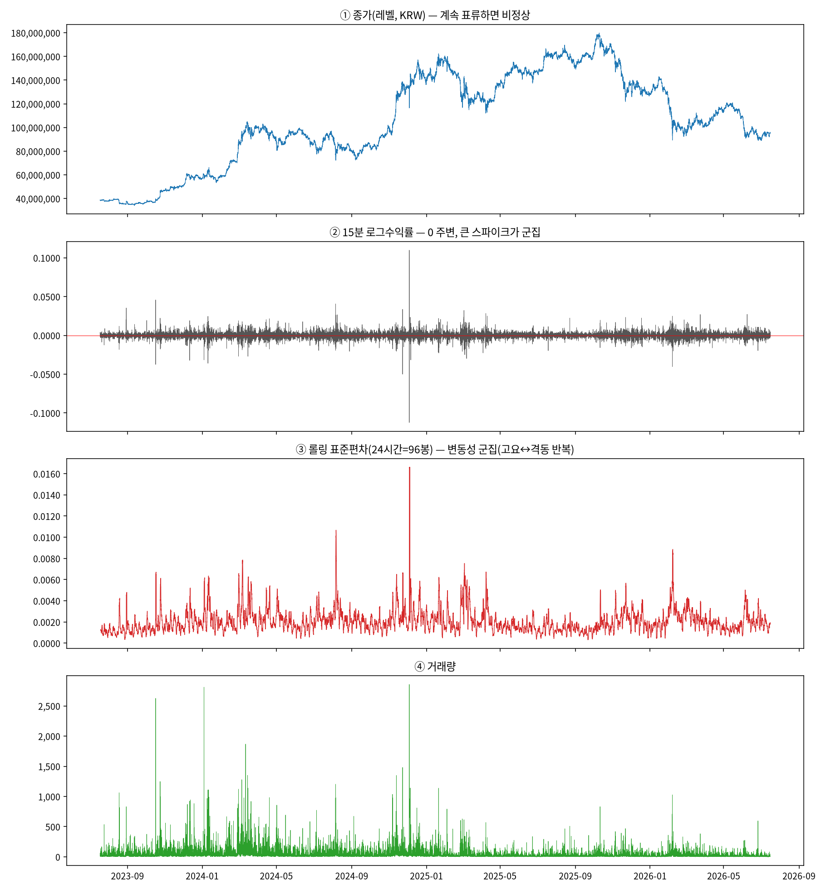
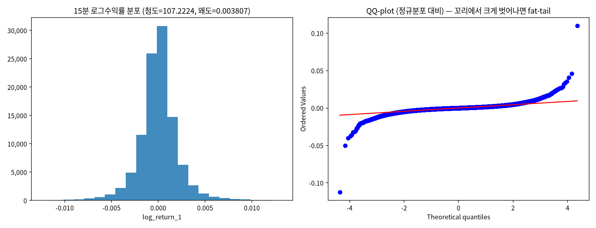
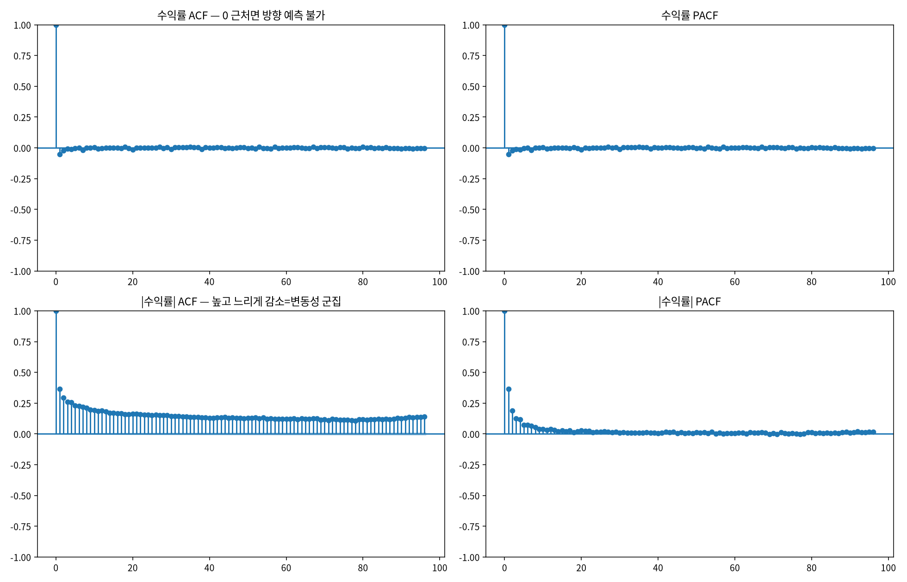
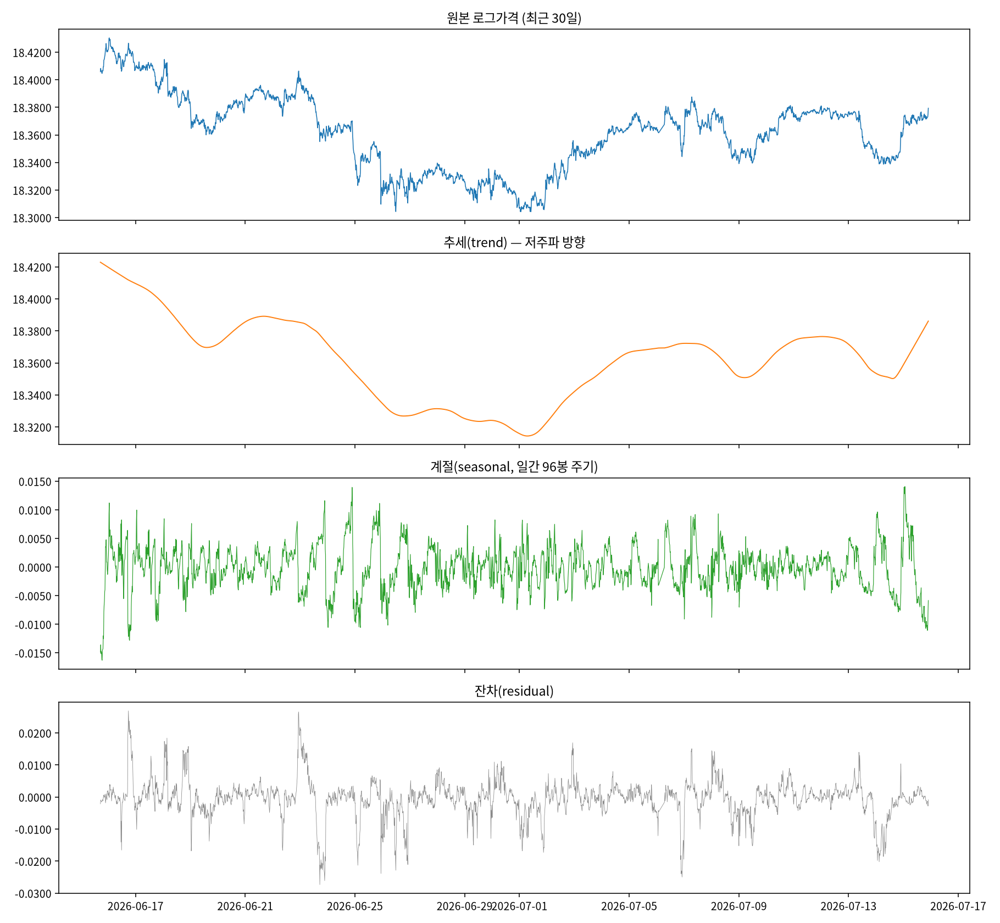
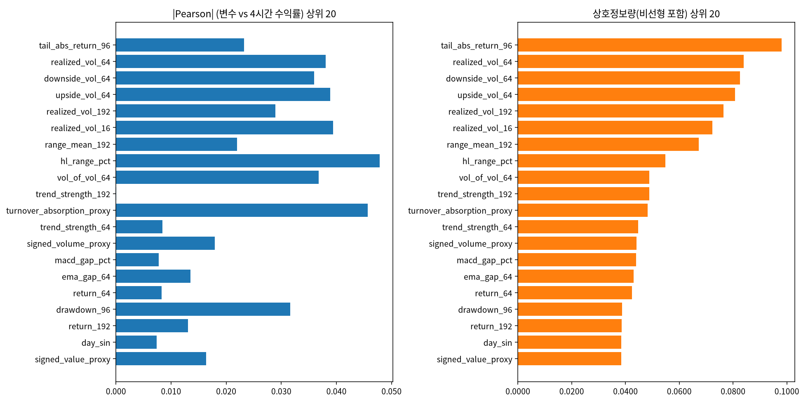

# 17번 EDA raw 결과 — KRW-BTC 15분봉

- 실행 시각: 2026-07-22 16:36:15 (서버, 헤드리스 .py)
- 드라이버: `test/models/17_eda_direction_signal_test.py`
- target: h=16봉(240분=4시간) 누적 로그수익률의 크기·방향

> 모든 수치는 과학적표기(1.2e-3) 없이 직관적 숫자로 표기. 그래프 축도 동일.

## S0. 개요 & 기초 통계 (describe)

- 종목: **KRW-BTC**, 15분봉
- 관측치: **104,734행**, 기간 **2023-07-18 04:45:00 ~ 2026-07-15 21:45:00**
- 결측 셀(전체): **0개**

### 원천 변수 describe (과학적표기 없이)

| 변수         |   count |         mean |          std |            min |         25% |          50% |          75% |           max |
|:-------------|--------:|-------------:|-------------:|---------------:|------------:|-------------:|-------------:|--------------:|
| close        |  104734 |  1.05978e+08 |  3.85283e+07 |     3.4171e+07 |  8.2775e+07 |  1.01655e+08 |  1.396e+08   |    1.7981e+08 |
| volume       |  104734 | 32.3919      | 54.9836      |     0.000195   |  9.2294     | 17.9269      | 35.4269      | 2856.91       |
| value        |  104734 |  3.17678e+09 |  5.43118e+09 | 24998.3        |  9.0752e+08 |  1.72005e+09 |  3.39766e+09 |    3.1702e+11 |
| log_return_1 |  104734 |  8.7e-06     |  0.002386    |    -0.112385   | -0.00098    |  0           |  0.000994    |    0.109872   |

**읽는 법**: `close`(종가, KRW)는 평균 105,977,583, 최소 34,171,000 ~ 최대 179,810,000로 3년간 크게 표류 → 레벨은 한 곳에 머물지 않는다(비정상 시사). `log_return_1`(15분 로그수익률)은 평균 0.00000870(거의 0), 표준편차 0.002386로 0 주변에 몰려 있다(정상 시사).

### 핵심 파생변수 요약

| 변수              |      mean |      std |       min |       50% |      max |
|:------------------|----------:|---------:|----------:|----------:|---------:|
| realized_vol_16   | 0.00195   | 0.0014   |  0.000139 | 0.001625  | 0.041511 |
| realized_vol_64   | 0.002055  | 0.001221 |  0.000295 | 0.00181   | 0.020369 |
| rsi_14_scaled     | 0.003406  | 0.149636 | -0.5      | 0.002262  | 0.4993   |
| trend_strength_64 | 0.000293  | 0.009717 | -0.125152 | 0.000178  | 0.102389 |
| macd_gap_pct      | 4.433e-05 | 0.002408 | -0.024336 | 4.148e-05 | 0.02209  |

## S1. 시계열 그림 — 레벨/수익률/변동성

- **①종가**: 3년간 크게 오르내리며 한 수준에 머물지 않음 → **비정상(추세·표류)**.
- **②수익률**: 0을 중심으로 진동, 큰 변동이 특정 시기에 몰림 → 평균은 안정, **꼬리·군집**.
- **③롤링 표준편차**: 잔잔한 구간과 격동 구간이 번갈아 → **변동성 군집(volatility clustering)**.
  변동의 '크기'에는 시간 구조가 있다는 직접 증거.
- **④거래량**: 변동성 급등 구간과 대체로 동행.

## S2. 수익률 분포·꼬리

- 첨도(정규=0 기준 초과) **107.2224** → 정규분포보다 훨씬 뾰족하고 꼬리가 두껍다(극단 변동 잦음).
- 왜도 **0.003807** → 좌우 (거의) 대칭.
- 이상치 비율(|z|>3) **0.016384** (정규분포면 약 0.003).
- **함의**: 평균만 줄이는 손실(MSE/Huber)은 이 두꺼운 꼬리에서 0 근처로 눌린다(진폭 압축의 구조적 원인).

## S3. 자기상관 — 방향 vs 크기 (핵심)

|   lag |   수익률 자기상관 |   |수익률| 자기상관 |
|------:|------------------:|--------------------:|
|     1 |         -0.051299 |            0.363992 |
|     2 |         -0.02096  |            0.295818 |
|     4 |         -0.012022 |            0.258267 |
|    16 |         -0.000572 |            0.164784 |
|    64 |          0.00094  |            0.124402 |
|    96 |         -0.002472 |            0.14045  |

- **수익률(방향) 자기상관 ≈ 0**: 과거 수익률로 미래 방향(부호)을 예측하기 사실상 불가.
- **|수익률|(크기) 자기상관은 크고 느리게 감소**: 변동 '크기'는 강하게 예측 가능(군집).
- **이게 우리 연구의 핵심 구조**: 방향은 신호가 없고 크기는 신호가 있다 — 예측 대상을 방향에 걸면 한계, 변동성(크기)·외생정보 쪽이 가망.

## S4. 정상성 검정 (레벨 vs 수익률)

※ 100k 전체에 ADF autolag는 segfault가 나서, 최근 20,000봉 + 고정 maxlag=30으로 검정.

| 대상             |   ADF통계량 |    ADF_p |   KPSS통계량 |   KPSS_p |   ARCH-LM_p |
|:-----------------|------------:|---------:|-------------:|---------:|------------:|
| 로그가격(레벨)   |     -1.2494 | 0.652007 |    27.3742   |     0.01 |           0 |
| 로그수익률(차분) |    -26.4863 | 0        |     0.106158 |     0.1  |           0 |

**해석 (검정별 귀무가설이 반대임에 주의)**
- ADF 귀무=비정상(단위근). p<0.05면 기각→**정상**.
- KPSS 귀무=정상. p<0.05면 기각→**비정상**.
- ARCH-LM 귀무=조건부 등분산(변동성 일정). p<0.05면 기각→**변동성 군집(조건부 이분산) 존재**.

- **로그가격**: ADF p=0.652007(비정상 못 벗어남) + KPSS p=0.010000(비정상) → 둘 다 **명백히 비정상**.
- **로그수익률**: ADF p=0(정상) + KPSS p=0.100000 + ARCH-LM p=0 → **평균은 정상, 분산은 비정상(조건부 이분산)**. 즉 '차분하면 완전 정상'이 아니라 **평균만 정상, 변동성은 여전히 시변** — GARCH류가 다루는 지점.

## S5. 시계열 분해(STL) — 로그가격의 추세/계절/잔차

최근 30일(2,880봉) 로그가격을 추세·계절(일간 96봉 주기)·잔차로 분해. 비정상 레벨을 차분하지 않고 직접 본 것.

- 추세 분산 비중 ≈ **87.4883%**, 계절 ≈ **2.0054%**, 잔차 ≈ **4.6229%**.
- **함의**: 레벨의 움직임은 대부분 저주파 '추세'가 차지하고 일간 계절성은 작다. 추세는 크지만 그 자체는 '이미 온 방향'이라 미래 방향 예측과는 다르다(레벨을 그대로 예측하면 직전값 복사=lag-copy 착시). 분해는 '무엇이 비정상을 만드는가(추세)'를 보여준다.

## S6. 방향/크기 신호: 파생변수 × 4시간 target

### 상위 15개 변수 (상호정보량 순)

| 변수                      |   Pearson(크기) |   Spearman |   상호정보량 |   Pearson(방향) |       R^2 |
|:--------------------------|----------------:|-----------:|-------------:|----------------:|----------:|
| tail_abs_return_96        |       0.023205  |   0.013769 |     0.097995 |        0.011372 | 0.000538  |
| realized_vol_64           |       0.038021  |   0.016822 |     0.08399  |        0.018166 | 0.001446  |
| downside_vol_64           |       0.035969  |   0.013082 |     0.082608 |        0.021303 | 0.001294  |
| upside_vol_64             |       0.038894  |   0.018937 |     0.080733 |        0.014726 | 0.001513  |
| realized_vol_192          |       0.028911  |   0.014991 |     0.076507 |        0.014422 | 0.000836  |
| realized_vol_16           |       0.0394    |   0.022293 |     0.072372 |        0.022865 | 0.001552  |
| range_mean_192            |       0.021957  |   0.017296 |     0.067306 |        0.014205 | 0.000482  |
| hl_range_pct              |       0.047819  |   0.017975 |     0.054792 |        0.016646 | 0.002287  |
| vol_of_vol_64             |       0.036745  |   0.020793 |     0.048908 |        0.014068 | 0.00135   |
| trend_strength_192        |       4.134e-05 |  -0.008251 |     0.048795 |       -0.024735 | 0         |
| turnover_absorption_proxy |       0.045688  |   0.01898  |     0.048277 |        0.017174 | 0.002087  |
| trend_strength_64         |      -0.008459  |  -0.034896 |     0.044746 |       -0.046346 | 7.155e-05 |
| signed_volume_proxy       |      -0.017899  |  -0.02965  |     0.044171 |       -0.035308 | 0.00032   |
| macd_gap_pct              |      -0.007769  |  -0.038228 |     0.043919 |       -0.0466   | 6.036e-05 |
| ema_gap_64                |      -0.013548  |  -0.038461 |     0.043025 |       -0.050519 | 0.000184  |

- 상호정보량 최고: **tail_abs_return_96** (MI=0.097995, Pearson=0.023205, R²=0.000538).
- |Pearson| 최고: **hl_range_pct** (Pearson=0.047819, R²=0.002287).
- **함의**: 가장 강한 변수도 R²가 매우 낮다(표본이 커서 통계적으론 유의해도 실질 설명력은 미미). 가격 파생변수만으로는 방향 신호가 사실상 없음을 전수로 재확인.
