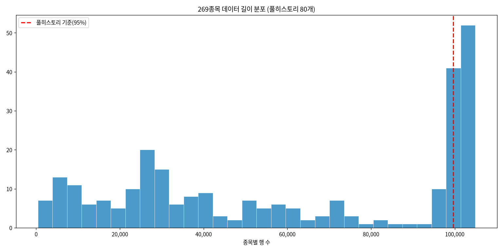
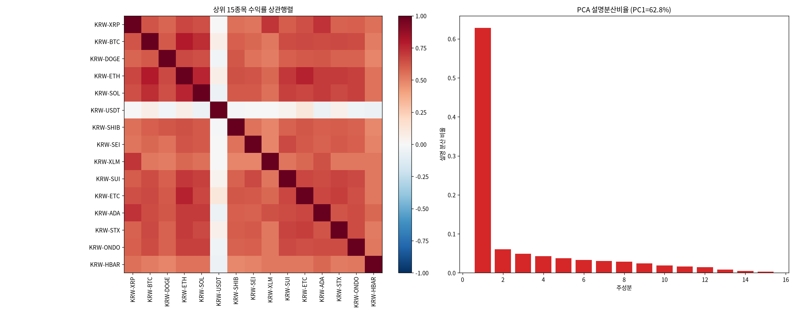
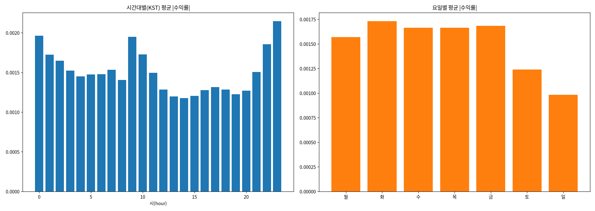
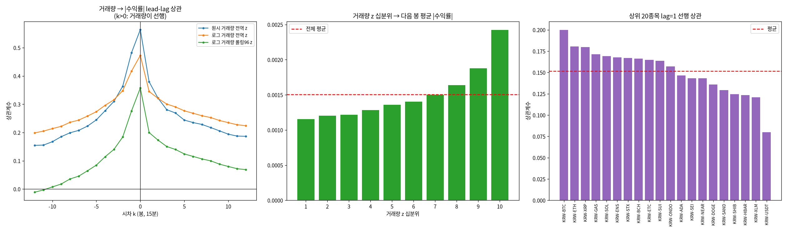

# 17번 준비작업 그림 보고서 — 데이터 감사·시장요인·계절성·거래량 선행성

작성일: 2026-08-10 · 브랜치: `stock` · 대상: `upbit_krw_candle` KRW 전 종목 269개 /
16,081,696행 (2023-07-18 ~ 2026-07-19), 단일종목 심층은 KRW-BTC 104,882봉
· 원시 수치: `test/results/17_eda_direction_signal_20260722/prep_figures_raw.md`
· 드라이버: `test/models/17_eda_prep_figures.py`
· 문헌 검증: arxiv MCP(`test/scripts/mcp_client.py arxiv ...`), 인용 9건 전부 초록 대조

> 이 문서는 `process.md` 2026-07-23 행의 미완 항목 두 개를 닫는다: **(1) s10~s12를 보고서로
> 정식 서술**(그동안 이미지만 커밋돼 있었다), **(2) 거래량 선행지표 시각화 생성**(미생성 상태였다).
>
> 서술에 앞서 s10~s12의 **생성 코드가 저장소에 없었다**는 문제를 먼저 해결했다. 2026-07-23에
> 임시 실행으로 그림만 만들고 코드를 남기지 않아, 그림 속 숫자를 보고서가 인용하면 검증 불가능한
> 인용이 된다 — `AGENTS.md`가 반복해서 경계하는 "서술만 쌓고 실행에 연결되지 않은" 상태다.
> 그래서 s10~s13을 하나의 재현 가능한 드라이버로 다시 만들고, 그 출력만 인용한다.

---

## 0. 한 줄 결론

**네 장의 그림은 모두 "전종목·방향" 쪽으로 확장하려는 유혹을 꺾고 "소수 유동종목·크기(변동성)"
쪽으로 설계를 좁히라고 말한다.** 전 종목은 사실상 하나의 시장요인이라 종목 수를 늘려도 독립
정보가 늘지 않고(S11, PC1 62.8%), 데이터 길이는 절반이 반토막이며(S10, 48.0%), 변동성에는
달력이 설명하는 결정적 주기가 섞여 있고(S12, 시간대 1.82배), 거래량은 방향에는 무의미하지만
크기에는 지속성을 통제한 뒤에도 유효한 증분 입력이다(S13, ΔR² 0.0182, HAC t=14.37).

**부수적으로 중요한 교정 1건**: `professor_brief_publication_case_20260722.md` 4.6절의
"거래량이 미래 변동을 **선행 예고**한다"는 표현은 과장이다. 같은 데이터에서 동시상관(0.357)과
역방향 상관(0.276)이 순방향(0.200)보다 크다 — 자세한 내용은 4.2절.

---

## 1. 무엇을 어떻게 봤나 (방법론)

| 그림 | 방법 | 무엇을 답하나 | 상태 |
|---|---|---|---|
| S10 | 종목별 행수 분포 + 풀히스토리 임계(최장의 95%) | 패널이 얼마나 불균형한가 | 재현 코드 복원 |
| S11 | 상위 15종목 수익률 상관행렬 + PCA 설명분산 | 종목마다 다른 정보가 있는가 | 재현 코드 복원 |
| S12 | 시간대(KST)·요일별 평균 \|수익률\| + eta² | 변동성 중 달력이 설명하는 몫 | 재현 코드 복원 |
| S13 | 거래량 z → 미래 \|수익률\| lead-lag·십분위·증분회귀 | 거래량을 모델 입력으로 쓸 수 있나 | **신규 생성** |

데이터 축은 `upbit_krw_candle`(2026-07-18 데이터 축 교정 이후의 정본)로 통일했다. 모든 수치는
과학적표기 없이 냈고, 그림과 별도로 원시 수치 파일에 남겨 이 보고서가 그것을 인용한다.

---

## 2. S10 — 데이터 길이 감사: 패널의 절반은 반토막이다



| 항목 | 값 |
|---|---|
| 종목 수 / 총 행수 | 269개 / 16,081,696행 |
| 최장 종목 행수 | 104,901행 (풀히스토리 기준 95% = 99,656행) |
| 풀히스토리 종목 | **80개 (29.7%)** |
| 풀히스토리 종목의 행 비중 | 51.1% |
| 행수 사분위 | 25% 26,100 / 중앙값 56,212 / 75% 100,535 |
| 최단 종목 | 413행 |
| 최장의 절반 미만인 종목 | **48.0%** |

분포는 뚜렷한 이봉(bimodal)이다. 처음부터 상장돼 있던 80개가 오른쪽 끝에 몰려 있고, 나머지
189개는 상장 시점이 흩어져 왼쪽에 길게 퍼져 있다. 절반(48.0%)은 최장 종목의 절반도 안 되는
길이다.

**설계에 미치는 영향 세 가지.**

1. **전종목 학습은 자동으로 "긴 종목 편중"이 된다.** 행 단위로 섞어 학습하면 풀히스토리 80개가
   전체 행의 51.1%를 차지해, 명목상 269종목이어도 실질은 상위 30% 종목의 모델이 된다. 종목
   단위 가중이나 최소 길이 컷을 명시적으로 정해야 한다.
2. **짧은 종목을 버리는 순간 편의가 들어온다.** 오래 살아남은 종목만 고르는 것은 정확히
   생존편의(survivorship bias)의 정의다. Ranse(2026)는 인도 소형주 지수에서 생존 종목만으로
   백테스트하면 연 수익률이 4.94%p(23.3%), 샤프가 0.097(9.1%) 과대평가된다는 것을 1,437종목
   9년치로 정량화했다 — 신흥·소형 자산군일수록 편의가 커진다는 결론은 암호화폐 KRW 마켓에
   그대로 적용될 소지가 크다.
3. **아직 확인하지 못한 것 — 상장폐지 종목의 부재.** 이 마트는 수집 시점에 업비트에 상장돼
   있던 269종목으로 만들어졌다. 그 사이 상장폐지된 종목이 애초에 수집 대상에서 빠졌다면,
   짧은 종목을 버리지 않더라도 **표본 자체가 이미 생존자만 담고 있다.** 이건 이번 감사로
   답할 수 없다(수집 파이프라인이 현재 마켓 목록을 조회하는 구조다). Ranse(2026)가 상장폐지
   종목을 포함한 원시 시세(bhavcopy)로 지수를 재구성해 편의를 측정한 것과 같은 접근이
   필요하다 — **후속 확인 항목으로 남긴다.**

---

## 3. S11 — 시장요인 PCA: 전 종목은 사실상 한 종목이다



| 항목 | 값 |
|---|---|
| 대상 / 공통 구간 | 누적 거래대금 상위 15종목 / 2024-06-14 ~ 2026-07-18 (72,154봉) |
| **PC1 설명분산** | **62.8%** (PC2 6.1%, PC3 4.9%, 상위 3개 누적 73.7%) |
| 평균 쌍별 상관 (15종목 전체) | 0.531 |
| 평균 쌍별 상관 (스테이블 KRW-USDT 제외) | **0.612** (최소 0.478 ~ 최대 0.793) |
| KRW-USDT 평균 상관 | 0.005 |

상관행렬에서 KRW-USDT만 흰 십자로 뚫려 있다(평균 상관 0.005). 원화 스테이블코인이므로 당연하고,
동시에 이 그림이 계산 오류가 아니라는 좋은 새니티 체크다. **그 한 줄을 빼면 15종목 중 어떤 쌍을
집어도 상관이 0.478 밑으로 내려가지 않는다.**

Burnie(2018)는 14개 암호화폐 상관 네트워크에서 "USD Tether를 제외하면 서로 다른 암호화폐
사이에 통계적으로 유의한 양의 연관이 있다"는 같은 구조를 보고했고, 토큰의 기능이나 발행
메커니즘이 가격 전개의 지배적 결정요인이라는 증거는 찾지 못했다. 우리 데이터도 동일하다 —
섹터·기능이 아니라 **하나의 공통 요인**이 분산의 62.8%를 설명한다.

**설계에 미치는 영향.**

- **"전종목으로 늘리면 표본이 269배"라는 가정은 틀렸다.** 횡단면 상관이 0.6대면 유효
  독립 표본 수는 종목 수보다 훨씬 작다. 종목을 늘려 얻는 것은 주로 **잡음 평균화**이지 새로운
  정보가 아니다. 16번(비정상·횡단면) 실험을 전 종목으로 확장할 때 "표본이 커졌으니 통계적
  검정력이 올라갔다"고 읽으면 안 된다 — 유효 표본은 그만큼 늘지 않는다.
- **historical_flow 마트의 `--liquid-only`(상위 50종목) 선택이 사후적으로 정당화된다.**
  2026-07-23에는 속도·메모리 때문에 219개 비유동 종목을 뺐는데, 정보 측면에서도 그 219개가
  독립적으로 기여할 몫이 크지 않았다는 뜻이다.
- **BTC 변동성 하나로 전종목 위험을 전이시킨다는 B 갈래 설계에 힘을 싣는다.** 공통 요인이
  지배적이라면 대표 종목의 변동성 예측을 전이하는 편이 종목별 개별 모델보다 효율적이다.

---

## 4. S12 — 계절성: 변동성의 2%는 모델이 아니라 달력이 안다



| 항목 | 값 |
|---|---|
| 전체 평균 \|수익률\| | 0.001505 |
| 시간대 최대 / 최소 | 23시 0.002148 / 14시 0.001178 → **1.824배** |
| 요일 최대 / 최소 | 화 0.001732 / 일 0.000982 → **1.764배** |
| 평일 vs 주말 | 0.001663 vs 0.001111 (주말이 33.2% 낮음) |
| \|수익률\| 분산 중 시간대 고정효과(eta²) | 2.06% |
| \|수익률\| 분산 중 요일 고정효과(eta²) | 2.01% |

시간대 프로파일은 단순한 U자가 아니라 **국소 봉우리 세 개**를 갖는다: 23~0시(최고),
9~10시, 그리고 완만한 22시. 골은 13~15시(KST)다.

시각을 UTC로 옮기면 해석이 붙는다.

| KST | UTC | 평균 \|수익률\| | 겹치는 사건 |
|---|---|---|---|
| 23시 | 14시 | 0.002148 (최고) | 미국 주식시장 개장 전후 |
| 0시 | 15시 | 0.001963 | 미국 장중 |
| 9시 | 0시 | 0.001949 | UTC 일 경계 + 무기한선물 펀딩 시각 |
| 1시 | 16시 | 0.001725 | 무기한선물 펀딩 시각 |
| 14시 | 5시 | 0.001178 (최저) | 아시아 오후·유럽 개장 전 |

Hansen 외(2021)는 Coinbase Pro·Binance·Uniswap V2 데이터로 BTC·ETH의 변동성과 거래량에
**요일·시간대·시간 내(within-hour)** 세 층위의 체계적 패턴이 있으며, 이 패턴이 해가 갈수록
**강해지고** 있고 알고리즘 트레이딩 및 **선물시장 펀딩 시각**과 관련된다고 보고했다. 우리
데이터의 9시(UTC 0시)·1시(UTC 16시) 봉우리는 펀딩 시각과 정합적이다. 다만 세 번째 펀딩
시각인 UTC 8시(KST 17시)에서는 뚜렷한 봉우리가 보이지 않는다 — **부분 정합으로만 적어둔다.**
Petukhina 외(2020)도 유럽 암호화폐 시장 고빈도 데이터에서 변동성 주기성을 보고했고,
Kim & Hansen(2026)은 더 미세한 시계(1분·5분·15분 경계)에서 알고리즘 참여로 인한 주기적
변동성·거래량 폭발을 보였다.

**설계에 미치는 영향 — B 갈래에 대한 구체적 처방.**

주기 성분은 각각 분산의 2%씩으로 크지 않다. 하지만 **작다는 것과 무시해도 된다는 것은 다르다.**
GARCH류는 조건부 분산의 시변을 확률적 성분으로 모델링하는데, 결정적 주기를 제거하지 않으면
모델이 달력이 설명하는 변동을 "변동성 충격"으로 잘못 읽고 지속성 파라미터가 위쪽으로 편향된다.
17번 EDA가 이미 지속성 α+β=0.98, 반감기 8.6시간을 얻었는데, 그 값 자체가 미제거 주기 성분을
일부 흡수했을 가능성이 있다.

Yan(2021)은 이 문제의 표준 해법인 **곱셈 성분 일중 변동성 모델**을 제시한다 — 일중 조건부
변동성을 `일중 주기 성분 × 일중 확률적 변동성 성분 × 일별 조건부 변동성 성분`의 곱으로
분해하는 방식이며, Engle(2012)과 Andersen & Bollerslev(1998)의 모델을 거래 간 duration까지
포함하도록 확장하고 주기성의 비모수 추정법을 함께 제공한다. B 갈래 실험은 **(a) 주기 성분을
먼저 제거한 뒤 GARCH를 적합하거나, (b) 곱셈 성분 모델을 그대로 채택**해야 하며, 어느 쪽이든
"주기 제거 전/후" 두 버전을 비교해 반감기 추정이 얼마나 바뀌는지 보고해야 한다.

> 주: Engle(2012), Andersen & Bollerslev(1998)는 arxiv에 없어 직접 대조하지 못했다.
> 여기서는 Yan(2021) 초록이 자신의 확장 대상으로 **명시한 범위**까지만 인용한다.

---

## 5. S13 — 거래량 선행성 (신규): 방향엔 0, 크기엔 유효



### 5.1 잃어버린 정의를 복원했다

`professor_brief_publication_case_20260722.md` 4.6절은 "거래량 z-score(과거)와 미래 |수익률|의
상관은 lag=1봉에서 +0.20, lag=4봉 +0.14"라고 인용하지만, 그 계산 코드는 저장소에 없었고
"z-score"가 어떤 정의인지도 적혀 있지 않았다. 세 가지 정의를 모두 계산해 대조했다.

| 거래량 정의 | lag=1 | lag=2 | lag=4 | lag=8 | 동시(k=0) | 역방향(k=−1) |
| :--- | ---: | ---: | ---: | ---: | ---: | ---: |
| 원시 거래량 전역 z | 0.379 | 0.322 | 0.269 | 0.217 | 0.564 | 0.482 |
| 로그 거래량 전역 z | 0.345 | 0.321 | 0.291 | 0.253 | 0.473 | 0.417 |
| **로그 거래량 롤링96 z** | **0.200** | 0.173 | **0.140** | 0.100 | 0.357 | 0.276 |

세 번째 정의(로그 거래량의 직전 1일=96봉 롤링 z-score)가 lag=1에서 0.200, lag=4에서 0.140으로
브리프의 "+0.20 / +0.14"와 정확히 일치한다. **인용 수치의 출처 정의가 확정됐고, 이제 재현
가능하다.** 이 정의는 통계적으로도 가장 방어 가능하다 — 거래량은 심하게 우편향이고 수준 자체가
비정상이라, 로그 변환과 롤링 표준화 없이는 상관계수가 소수의 거래량 폭발에 끌려간다(그래서
원시 전역 z의 0.379가 더 커 보이는 것이다).

### 5.2 교정: "선행 예고"는 과장이다

lead-lag 프로파일(왼쪽 패널)의 정점은 **k=0**이다. 그리고 역방향(k=−1, |수익률|이 거래량을
선행) 0.276이 순방향(k=+1, 거래량이 |수익률|을 선행) 0.200보다 **크다**. 세 정의 모두에서
동일한 비대칭이 나타난다.

즉 거래량과 변동성은 압도적으로 **동시에** 움직이며, 굳이 방향을 따지면 **|수익률| → 거래량**
쪽이 더 강하다. "거래량 급증이 다음 15분~1시간의 큰 변동을 선행 예고한다"는 브리프의 서술은
데이터가 지지하는 것보다 강하다. 정확한 서술은 **"거래량과 변동성은 같은 정보 도착에 함께
반응하며, 그 공통 성분이 한 봉 뒤까지 남아 0.200의 상관으로 관측된다"**이다.

이 구조 자체는 잘 알려진 것이다. Barjašić & Antulov-Fantulin(2020)은 분 단위 BTC 데이터에서
GARCH 계열 모델에 **혼합분포가설(Mixture of Distributions Hypothesis)** — 수익률의 동학이
시장에 도착하는 **정보 흐름**에 지배된다는 가설 — 을 결합해, 트윗 시계열과 거래량을 외부
정보로 넣었을 때 변동성 예측이 개선되는지 검정했다(가장 단순한 GARCH(1,1)이 외부 신호 추가에
가장 잘 반응). MDH 아래에서 거래량과 변동성이 동시에 움직이는 것은 인과가 아니라 **공통 원인**
때문이며, 우리가 관측한 비대칭은 정확히 그 예측과 부합한다.

### 5.3 그래도 모델 입력으로는 유효하다 — 증분 검정

lead-lag 상관만으로는 "동시성분에 속은 것"인지 알 수 없다. 실제 판정 기준은 **|수익률| 자신의
과거(자기상관 0.36)를 이미 넣은 뒤에도 거래량이 정보를 더하는가**다. HAC(Newey-West,
maxlags=96) 표준오차로 OLS를 적합했다(표본 104,786행).

| 모형 | R² |
|---|---|
| 지속성만 — \|r\|(t−1) + 직전 1일 평균 \|r\| | 0.1866 |
| 거래량만 — 거래량 z(t−1) | 0.0399 |
| **둘 다** | **0.2048** |
| **거래량의 증분 R²** | **0.0182 (지속성 대비 +9.8%)** |

거래량 계수 0.000256, **HAC t = 14.37, p < 0.0001**. 지속성을 통제한 뒤에도 거래량은 유의한
증분 설명력을 갖는다. **B 갈래 모델의 입력으로 쓰는 결정은 유지된다 — 다만 근거는 "선행성"이
아니라 "증분 설명력"이다.**

### 5.4 경제적 크기와 로버스트니스

거래량 z 십분위별 **다음 봉** 평균 |수익률|(가운데 패널)은 1분위 0.001155에서 10분위 0.002422로
**단조 증가**하며, 최상위 10%는 최하위 10%의 **2.10배**다. 단조성은 이 관계가 소수 이상치에서
나온 인공물이 아님을 보인다.

상위 20종목(오른쪽 패널)에서 lag=1 상관은 평균 0.152, 중앙값 0.160, 범위 0.080~0.200이며
**20종목 전부 양(+)**이다. 최저값 0.080은 KRW-USDT로, 스테이블코인이라 변동 자체가 거의 없는
종목이니 오히려 예상대로다. BTC 특정 현상이 아니다.

### 5.5 방향에는 여전히 아무것도 없다

| 거래량 정의 | 부호(방향)와의 lag=1 상관 |
|---|---|
| 원시 거래량 전역 z | 0.0121 |
| 로그 거래량 전역 z | 0.0084 |
| 로그 거래량 롤링96 z | **0.0002** |

크기에는 0.200, 방향에는 0.0002. 이것은 이 연구가 17번 EDA 이후 세 번째로 확인하는 구조이며,
문헌의 최근 결과와 정확히 같다. Singha(2025)는 SPY 3,850만 건 체결 데이터에서 주문흐름
엔트로피가 **다음 5분 절대수익률을 2.89배(t = 12.41)로 예측**하면서도 **방향 정확도는
45.0%로 우연 수준과 구별되지 않는다**는 것을 보였고, 그 원인을 "엔트로피는 부호 치환에
불변이므로 정보거래의 **존재**는 탐지하지만 그 **방향**은 드러내지 않는다"는 대칭성으로
설명한다. 거래량도 부호에 불변인 양(量)이라는 점에서 정확히 같은 구조다 — **우리 결과는
BTC 특유의 실패가 아니라 부호-불변 지표가 갖는 일반적 성질이다.**

한편 Chi 외(2024)는 온체인 순유입(net flow)처럼 **부호를 갖는** 흐름 변수는 자산별로
수익률의 방향까지 예측할 수 있음을 보고했다(단 ETH 순유입은 ETH 수익률·변동성을 **음(−)**으로
예측하는 등 부호가 자산마다 다르다). 방향 신호를 원한다면 거래량 같은 부호-불변 양이 아니라
**부호를 가진 외생 채널**로 가야 한다는 뜻이며, 이는 `exogenous_data_collection_plan_20260722.md`
의 외생변수 도입 계획에 직접적인 근거가 된다.

---

## 6. 종합 — 결정 대기 항목에 대한 데이터의 답

`process.md`에 사용자 결정 대기로 남아 있는 항목들에 대해, 이번 네 장이 실제로 좁혀준 것.

| 대기 중인 결정 | 이번 그림이 말하는 것 |
|---|---|
| 다음 축: 변동성 vs 외생변수 vs 전종목 EDA 확장 | **전종목 확장의 우선순위는 낮다**(S11: PC1 62.8%, 새 정보 아님). 변동성이 먼저이고, 외생변수는 "방향"을 원할 때만 의미가 있다(S13.5) |
| B(변동성) 실험 설계 | **주기 성분 제거를 실험 설계에 넣어야 한다**(S12). 거래량 z(롤링96)를 입력으로 확정하되 근거는 증분 R²(S13.3) |
| 외생변수 채널 우선순위 | 방향이 목표라면 **부호를 가진 채널**(순유입류)이 부호-불변 채널(거래량류)보다 우선(S13.5, Chi 2024) |
| historical_flow `--liquid-only` 유지 여부 | **유지가 정보 측면에서도 타당**(S11) |
| 전종목 학습 시 표본 처리 | 종목 단위 가중 또는 최소 길이 컷을 **명시적으로** 정해야 함(S10). 상장폐지 종목 누락 여부는 **미확인 — 후속 확인 필요** |

여전히 사용자·교수님 결정이 필요한 것(이 그림들이 답하지 못하는 것): A/B/C 갈래 최종 선택,
진폭보존 DTW vs z정규화, LB_Keogh 색인 교체, 구간정의 change-point/HMM 확장.

---

## 7. 참고문헌

전 항목 arxiv MCP(`search_papers` → `get_abstract`)로 초록까지 대조했다. BibTeX는
`export_citations`로 생성했다.

1. **Singha, M. (2025).** *Hidden Order in Trades Predicts the Size of Price Moves.*
   arXiv:2512.15720 [q-fin.TR] — 5.5절(크기는 예측, 방향은 우연 수준)
2. **Hansen, P. R., Kim, C., & Kimbrough, W. (2021).** *Periodicity in Cryptocurrency
   Volatility and Liquidity.* arXiv:2109.12142 [q-fin.TR] — 4절(요일·시간대 주기, 펀딩 시각)
3. **Kim, C., & Hansen, P. R. (2026).** *The Quarter-Hour Effect: Periodic Algorithmic Trading
   and Return Predictability in Cryptocurrency Futures.* arXiv:2607.09426 [q-fin.TR] — 4절
4. **Petukhina, A. A., Reule, R. C. G., & Härdle, W. K. (2020).** *Rise of the Machines?
   Intraday High-Frequency Trading Patterns of Cryptocurrencies.* arXiv:2009.04200 [q-fin.TR] — 4절
5. **Yan, X. (2021).** *Multiplicative Component GARCH Model of Intraday Volatility.*
   arXiv:2111.02376 [econ.EM] — 4절(주기 성분 분해, B 갈래 처방)
6. **Burnie, A. (2018).** *Exploring the Interconnectedness of Cryptocurrencies using
   Correlation Networks.* arXiv:1806.06632 [q-fin.CP] — 3절(공통 요인, USDT 예외)
7. **Ranse, H. S. (2026).** *Survivorship Bias in Emerging Market Small-Cap Indices: Evidence
   from India's NIFTY Smallcap 250.* arXiv:2603.19380 [q-fin.ST] — 2절(생존편의 정량)
8. **Barjašić, I., & Antulov-Fantulin, N. (2020).** *Time-varying volatility in Bitcoin market
   and information flow at minute-level frequency.* arXiv:2004.00550 [q-fin.ST] — 5.2절(MDH)
9. **Chi, Y., Chu, Q., & Hao, W. (2024).** *Return and Volatility Forecasting Using On-Chain
   Flows in Cryptocurrency Markets.* arXiv:2411.06327 [econ.EM] — 5.5절(부호 있는 채널)

**미검증 인용(직접 대조 못 함)**: Engle(2012), Andersen & Bollerslev(1998) — arxiv에 없어
Yan(2021) 초록이 명시한 범위 안에서만 언급했다.

---

## 8. 재현

```bash
# 그림 4장 + 원시 수치
uv run test/models/17_eda_prep_figures.py
uv run test/models/17_eda_prep_figures.py --skip s10 s11 s12   # s13만 재생성

# 문헌 검증에 쓴 MCP 호출 (Claude Code/Codex 세션 밖에서도 동작)
python test/scripts/mcp_client.py arxiv tools
python test/scripts/mcp_client.py arxiv search_papers '{"query": "...", "max_results": 6}'
python test/scripts/mcp_client.py arxiv get_abstract '{"paper_id": "2109.12142v2"}'
```

산출물:

- `test/images/17_eda_direction_signal_20260722/s10_data_length_audit.png` (재생성)
- `test/images/17_eda_direction_signal_20260722/s11_market_factor_pca.png` (재생성)
- `test/images/17_eda_direction_signal_20260722/s12_seasonality.png` (재생성)
- `test/images/17_eda_direction_signal_20260722/s13_volume_lead_volatility.png` (**신규**)
- `test/results/17_eda_direction_signal_20260722/prep_figures_raw.md` (원시 수치)

재생성된 s10~s12는 2026-07-23 원본과 동일한 결론을 준다(예: 풀히스토리 80개, PC1 62.8% vs
원본 62.7%, 시간대 최고 23시·최저 14시). 원본은 git 이력에 그대로 남아 있다.
