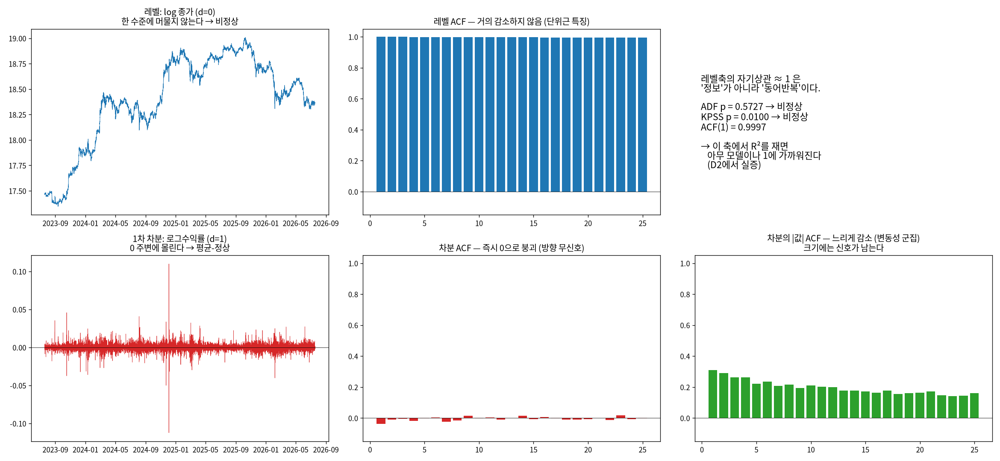
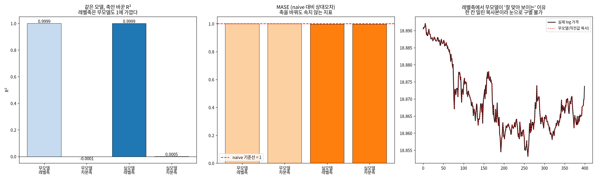
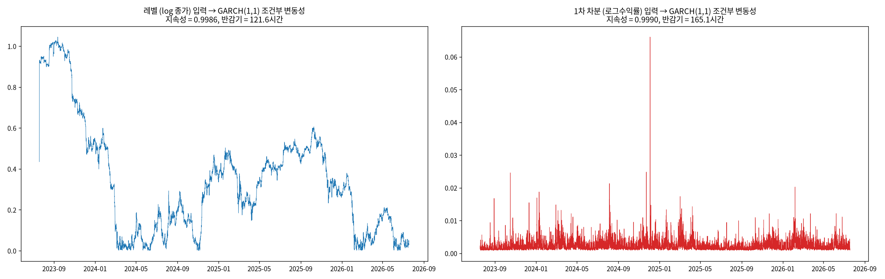
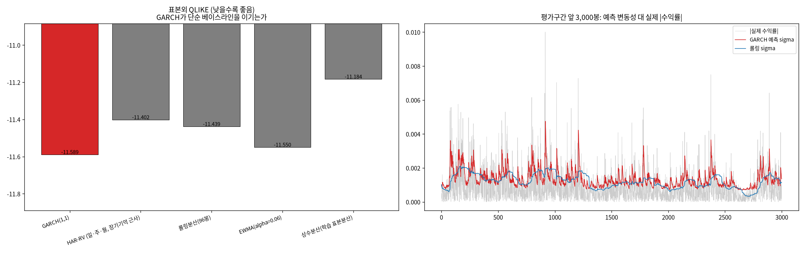
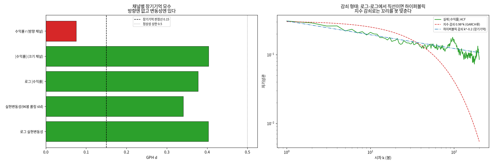
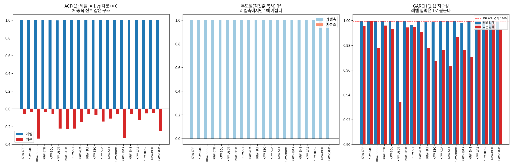

# 18번 보고서 — 차분(differencing)은 무엇을 바꾸는가, 그리고 GARCH를 쓸지 어떻게 판정하는가

작성일: 2026-08-14 · 브랜치: `stock` · 대상: `upbit_krw_candle` KRW-BTC 104,883행
(2023-07-19 ~ 2026-07-19) + 유동성 상위 20종목 확인
· 원시 수치: `test/results/18_differencing_decision_20260814/differencing_raw.md`
· 드라이버: `test/models/18_differencing_decision_test.py`
· 문헌 검증: arxiv MCP(`test/scripts/mcp_client.py`), 초록 대조 인용 4건

> **이 보고서가 나온 계기**(2026-08-13 사용자 지적): "원래 비정상성에 대한 모델링을 수행하는 줄
> 알았는데, 살펴보니 차분을 진행해서 분석과 모델링을 수행했다는 것을 파악했다. 이전 보고서에도
> 차분 여부나 갖가지 전처리에 대해선 전혀 나타나지 않아서 지금 제동이 걸렸다. 왜 차분 여부에
> 따라 방향이 바뀌고 그걸 어떻게 확인할 수 있을지 시각화·EDA해서 먼저 보여달라. 지금 중요한 건
> GARCH 모델 여부를 판단하는 기준이다."

---

## 0. 한 줄 결론 세 개

1. **차분은 취향이 아니라 평가의 정직성을 결정하는 선언이다.** 레벨축에서 성적을 내면 아무것도
   학습하지 않은 무모델이 R² 0.9999를 받고, **진짜 모델과 구별조차 되지 않는다**(차이 0.0000001).
2. **GARCH 채택 여부를 파라미터로 판정할 수 없다.** 지속성·반감기가 표본에 따라 9시간~511시간으로
   요동한다(55배). 교수님 브리프의 "반감기 8.6시간"은 **틀린 계산이 아니라 재현되지 않는 추정**이다.
3. **장기기억은 가격에 없고 변동성에 있다**(수익률 d=0.08 vs 실현변동성 d=0.34~0.40). 그래서
   C 갈래(분수차분)는 폐기가 아니라 **가격 축에서 변동성 축으로 이동**하며, B를 구현하는 방법이 된다.

---

## 1. 먼저: 그동안 문서에 없던 전처리 계보 (D0)

이것이 제동의 실제 원인이었다. 코드에서 실제로 일어나는 변환은 아래 3단계다.

| 단계 | 코드 위치 | 계열 | 평균 | 표준편차 | 최소 | 최대 |
| :--- | :--- | :--- | ---: | ---: | ---: | ---: |
| ① 원본 레벨 | `upbit_krw_candle.close` | 종가(KRW) | 106,042,913 | 38,419,597 | 34,171,000 | 179,810,000 |
| ② 로그 변환 | `data.py:120` `log_close` | log(종가) | 18.3968 | 0.4348 | 17.3469 | 19.0074 |
| ③ **1차 차분** | `data.py:121` `log_return_1` | 로그수익률 | 0.00000857 | 0.002386 | −0.112385 | 0.109872 |

**핵심 세 가지.**

- **②는 아직 레벨이다.** 로그 변환은 차분이 아니라 단위 변경(곱셈적 변동 → 덧셈적 변동)이다.
  로그 종가도 여전히 비정상이다(2절 ADF p=0.5727). 차분은 ③에서 처음 일어난다.
- **예측 대상 자체가 차분값이다.** `data.py:133`의 `target_return = log_return_1.shift(-1)`.
  17번 EDA도 `log_close.shift(-h) - log_close`로 같은 축이다.
- **차분은 실험별 선택이 아니라 엔진 최하층에 내장돼 있었다.** `engine/data.py:make_features`를
  모든 실험이 통과하므로, 2026-05 설계 시점부터 전 실험이 자동으로 차분축이었다.
  `data.py:138`에 레벨 타깃(`target_close`)이 정의돼 있으나 학습·평가에 쓰인 흔적은 없다.

> **왜 문서에 없었나.** 17번 S4가 레벨 vs 차분을 이미 비교했고 17번 보고서 3절이 이 질문에
> 답했다. 그러나 그것은 *데이터의 성질*("레벨은 비정상, 수익률은 평균-정상")에 대한 진단이고,
> *우리가 무엇을 했는지*("따라서 우리 타깃은 차분값이다")라는 선언이 아니었다. 그래서 1~16번
> 보고서와 교수님 브리프에 전파되지 않았다. 이 표가 그 공백을 메운다.

---

## 2. 진단이 뒤집힌다 (D1)



| 계열 | ADF 통계량 | ADF p | KPSS 통계량 | KPSS p | ADF 판정 | KPSS 판정 | ACF(1) |
| :--- | ---: | ---: | ---: | ---: | :--- | :--- | ---: |
| 레벨 (log 종가, d=0) | −1.420 | 0.5727 | 33.332 | 0.0100 | **비정상** | **비정상** | **0.9997** |
| 분수차분 d=0.3 | −3.492 | 0.0082 | 30.352 | 0.0100 | 정상 | **비정상** | 0.9887 |
| 분수차분 d=0.5 | −6.437 | 0.0000 | 27.978 | 0.0100 | 정상 | **비정상** | 0.8945 |
| 1차 차분 (d=1) | −29.560 | 0.0000 | 0.106 | 0.1000 | 정상 | 정상 | **−0.0381** |

- ADF 귀무가설은 "단위근(비정상)", KPSS 귀무가설은 "정상" — **방향이 반대**다. 둘이 일치할 때만
  결론이 견고하다. (statsmodels KPSS p는 [0.01, 0.10]으로 절단되므로 통계량을 함께 본다.)
- **뒤집힘의 근원은 이 한 쌍이다**: 레벨 ACF(1) **0.9997** vs 차분 **−0.0381**.

레벨의 자기상관 0.9997은 "예측할 것이 넘친다"는 뜻이 **아니다**. "어제와 오늘 가격이 비슷하다"는
**동어반복**이다. 차분은 그 동어반복을 제거해 "그걸 빼고도 남는 것이 있는가"를 묻는 축으로 옮긴다.
같은 데이터가 정반대로 읽히는 이유가 이것이다.

세 번째 패널이 중요하다: 차분해도 **|수익률|의 자기상관은 느리게 감소**한다. 방향은 사라지지만
크기는 남는다 — 5절에서 이것이 결정적 역할을 한다.

---

## 3. 성과가 뒤집힌다 — 모델을 고정하고 축만 바꾼다 (D2)



**실험 설계**: 무모델(naive: 다음 로그가격 = 현재 로그가격)과 실모델(수익률 AR(1))을 각각
레벨축·차분축에서 평가한다. 네 조합 모두 **완전히 동일한 시점 집합**(뒤쪽 30%, 31,465행)을 본다.

| 모델 | 평가축 | R² | RMSE | MAE | MASE |
| :--- | :--- | ---: | ---: | ---: | ---: |
| 무모델 (직전값 복사) | 레벨축 (log 가격) | **0.999871** | 0.002246 | 0.001469 | 1.0000 |
| 무모델 (직전값 복사) | 차분축 (로그수익률) | **−0.000055** | 0.002246 | 0.001469 | 1.0000 |
| 실모델 (수익률 AR(1)) | 레벨축 (log 가격) | **0.999871** | 0.002246 | 0.001466 | 0.9978 |
| 실모델 (수익률 AR(1)) | 차분축 (로그수익률) | **0.000461** | 0.002246 | 0.001466 | 0.9978 |

**세 가지를 읽어야 한다.**

1. **아무것도 학습하지 않은 무모델이 레벨축에서 R² 0.999871을 받는다.** 직전 값을 한 칸 밀어
   복사한 것이 "거의 완벽한 모델"로 보인다. 오른쪽 패널이 그 이유다 — 눈으로도 구별이 안 된다.
2. **레벨축은 실모델과 무모델을 구별하지 못한다.** 두 R²의 차이가 **0.00000007**이다.
   즉 레벨축 R²로는 모델이 나아졌는지 알 수 없다. 개선을 측정할 수 없는 지표다.
3. **차분축에서만 구별된다.** 실모델 R² 0.000461은 절대값이 작지만 무모델(−0.000055)과 부호가
   다르다. 이 축에서만 "동어반복을 빼고 남은 진짜 신호"를 측정할 수 있다.

MASE(naive 기준선=1.0)는 **축을 바꿔도 값이 같다**(1.0000/1.0000, 0.9978/0.9978). 척도-자유
지표가 필요한 이유가 이것이다 — 축 선택에 속지 않는다.

> **이것이 "차분 여부에 따라 방향이 바뀐다"의 실체다.** 진단(2절)·성과(3절)·모델입력(4절)이
> 따로 바뀌는 게 아니라, ACF(1)이 1이냐 0이냐 하나가 세 곳에서 다르게 드러난다.

---

## 4. GARCH 입력이 뒤집힌다 — "미사용"이 아니라 "입력 오류" (D3)



동일한 추정기(scipy 정규 MLE, 외부 패키지 미사용 — 패키지 차이 교란 배제)로 두 입력을 적합했다.

### 4.1 전제 위반의 직접 증거는 파라미터가 아니라 표준화 잔차다

| 입력 | 표준화 잔차 ACF(1) | Ljung-Box(20) p | 판정 |
| :--- | ---: | ---: | :--- |
| 레벨 (log 종가) | **0.9885** | 0.0000 | **자기상관 잔존 → 전제 위반** |
| 1차 차분 (로그수익률) | **−0.0225** | 0.1038 | 백색잡음 → 전제 충족 |

GARCH가 분산을 제대로 걷어냈다면 표준화 잔차 z/σ는 백색잡음이어야 한다. 레벨 입력은 **평균식이
없으므로** 평균의 자기상관이 0.9885로 거의 그대로 남는다. **이것이 "레벨을 넣으면 안 된다"의
직접 증거이며, 지속성 수치보다 신뢰할 수 있다.**

따라서 **"GARCH가 안 맞는다"는 판정을 레벨 입력으로 내려선 안 된다.** 그것은 모델의 실패가
아니라 전제 위반이다.

### 4.2 지속성·반감기는 이 데이터에서 식별되지 않는다 (중요)

| 표본 | α+β | 반감기(시간) |
| :--- | ---: | ---: |
| 전체 104,882 | 0.99895 | 165.1 |
| 최근 40,000 | 0.99823 | 97.6 |
| 최근 20,000 | 0.99966 | 511.2 |
| **최근 10,000** | **0.98168** | **9.4** |
| 앞 40,000 | 0.99959 | 423.2 |

**표본만 바꿔도 반감기가 9.4시간 ~ 511.2시간으로 55배 요동한다.** α+β가 1에 붙으면 우도가 그
방향으로 거의 평평해져 식별이 사실상 안 되기 때문이다.

**교수님 브리프 정정 필요 (1)**: 4.6절의 "변동성 반감기 8.6시간(α+β=0.98)"은 위 표의 "최근
10,000" 행(9.4시간)과 거의 같다. 즉 **틀린 계산이 아니라 특정 표본에서 나온 불안정한 추정**이며
재현되지 않는다. 점추정 대신 "식별 불안정"으로 서술해야 하고, target horizon 근거는 다른 방법으로
세워야 한다.

Kaur(2026)는 고베타 알트코인(XRP/SOL/ADA)에서 **α+β=1(무한 지속성)의 EWMA/IGARCH가 유일하게
견고한 조건부 변동성 추정**이었고, 정상성(평균회귀)을 부과하면 5% VaR 하방위험을 **절반으로
과소평가**한다고 보고했다. 즉 암호화폐에서 α+β→1은 고쳐야 할 추정 결함이 아니라 데이터의 성질일
수 있다 — 우리 결과와 정합적이다.

---

## 5. 그러면 GARCH를 쓸지 무엇으로 판정하나 — 표본외 성능 (D3b)



학습 73,417행에서 추정하고, 평가 31,465행은 **파라미터 고정 전진 필터링**(재적합 없음 = 누수
없음). 지표는 QLIKE = mean(log σ² + r²/σ²), **낮을수록 좋다**. 분산 예측의 표준 robust 손실로,
실현분산 대리변수가 잡음이 심해도 순위가 뒤집히지 않는다.

| 모델 | QLIKE | MSE(×10¹²) | corr(예측σ, \|r\|) |
| :--- | ---: | ---: | ---: |
| **GARCH(1,1)** | **−11.5895** | 345.550 | 0.4452 |
| EWMA(α=0.06) | −11.5502 | 346.089 | 0.4245 |
| 롤링분산(96봉) | −11.4386 | 362.399 | 0.3523 |
| HAR-RV (일·주·월) | −11.4023 | 362.509 | 0.3478 |
| 상수분산 | −11.1836 | 381.481 | n/a |

1스텝에서는 **GARCH(1,1)이 최우수**이며 롤링분산을 0.151 앞선다 → 단순 베이스라인 대비 채택
근거가 성립한다.

### 5.1 그런데 horizon을 바꾸면 결론이 뒤집힌다 (결정적)

| horizon | GARCH(1,1) | HAR-RV | 롤링분산 | EWMA | 최우수 | GARCH−HAR |
| :--- | ---: | ---: | ---: | ---: | :--- | ---: |
| h=1 (15분) | **−11.5809** | −11.3970 | −11.4298 | −11.5401 | GARCH | **+0.184** |
| h=16 (4시간) | **−11.4195** | −11.3418 | −11.3540 | −11.3438 | GARCH | **+0.078** |
| h=64 (16시간) | −11.2869 | **−11.3148** | −11.2187 | −11.1573 | **HAR-RV** | **−0.028** |

**GARCH의 우위가 horizon과 함께 단조 감소하다 16시간에서 역전된다.** 그리고 B(변동성) 갈래의
target horizon이 정확히 4~16시간이므로, **교차점이 target 구간 안에 있다.**

→ **1스텝 결과로 B 갈래의 모델을 정할 수 없다.** 실제 target horizon에서 다시 판정해야 하며,
그 구간에서 두 모델 클래스는 QLIKE 0.03~0.08 차이로 접근한다.

---

## 6. 왜 그런가 — 장기기억은 가격이 아니라 변동성에 있다 (D4, D4b)



### 6.1 분수차분이 무엇인가 (개념)

1차 차분은 `x(t) − x(t−1)`, 즉 **직전 값 하나만** 빼는 것이다. 분수차분은 그 "1번"을 실수 d로
일반화해 과거를 **가중치를 두고 조금씩** 뺀다. (1−B)^d 를 이항급수로 펼치면
`w₀=1, wₖ = −wₖ₋₁·(d−k+1)/k`.

- **d = 0** → 아무것도 안 뺌 = 레벨 (비정상, 기억 100% 보존)
- **d = 1** → 직전 값만 뺌 = 지금 쓰는 로그수익률 (정상, 기억 소실)
- **0 < d < 1** → 정상성을 얻을 만큼만 빼고 장기기억은 남긴다

### 6.2 로그가격에는 중간지대가 없다 (D4)

| d | ADF p | KPSS p | ACF(1) | 레벨과의 상관(기억) | 동시 정상 |
| ---: | ---: | ---: | ---: | ---: | :--- |
| 0.0 | 0.5727 | 0.0100 | 0.9997 | 1.0000 | 아니오 |
| 0.3 | 0.0082 | 0.0100 | 0.9887 | 0.9971 | 아니오 |
| 0.5 | 0.0000 | 0.0100 | 0.8945 | 0.9853 | 아니오 |
| 0.9 | 0.0000 | 0.0100 | 0.1010 | 0.5963 | 아니오 |
| **1.0** | 0.0000 | 0.1000 | −0.0381 | −0.0012 | **예** |

ADF만 보면 d=0.3부터 정상이지만 **KPSS는 d<1 전 구간에서 비정상**이라 한다. 두 검정이 동시에
통과하는 지점이 사실상 d=1이다 → **"정상성은 얻고 기억은 남기는" 중간지대가 로그가격에는 없다.**

### 6.3 그런데 변동성 채널에는 강하게 있다 (D4b)

| 계열 | GPH d | 허스트 H | 판정 |
| :--- | ---: | ---: | :--- |
| 수익률 r (방향 채널) | **0.0754** | 0.5519 | 무기억에 가까움 |
| \|수익률\| (크기 채널) | **0.4037** | 0.8727 | **장기기억 있음** |
| 로그 \|수익률\| | 0.3778 | 0.8784 | **장기기억 있음** |
| 실현변동성(96봉 롤링 std) | 0.3407 | 0.8333 | **장기기억 있음** |
| 로그 실현변동성 | 0.4028 | 0.8432 | **장기기억 있음** |

**교수님 브리프 정정 필요 (2)**: 4.6절의 "허스트 H=0.58로 분수차분 근거 확보"는 레벨에 R/S를
적용한 값으로 보인다. **레벨의 H는 정의 범위(0~1)를 벗어난 1.02**로 나오며(적분된 계열에 R/S를
적용하면 단위근을 재확인할 뿐이다), 수익률 기준은 H=0.55·GPH d=0.08로 무기억에 가깝다.
장기기억 판정은 반드시 증분(수익률 이상)에서 해야 한다.

**그러나 이것은 C 갈래를 폐기시키지 않고 이동시킨다.** d ≈ 0.34~0.40은 실현변동성 문헌의 통상
범위이며, Hassler & Pohle(2019)가 선험적으로 권한 d=0.5 근방이다(그들은 추정된 d를 쓰는 방법의
결함을 지적하고 **고정 d=0.5**가 인플레이션·실현변동성 예측에서 가장 좋았다고 보고).

→ **C(분수차분)는 B(변동성)와 경쟁하는 별개 갈래가 아니라 B를 구현하는 방법이다.**

### 6.4 이것이 5.1의 역전을 설명한다

위 그림 오른쪽 패널(로그-로그)을 보면, 실제 |수익률| ACF(초록)는 **하이퍼볼릭 감쇠 직선**을 따라
가고, GARCH류의 **지수 감쇠 0.98^k(빨강)는 시차 40 이후 급락**해 꼬리를 전혀 맞추지 못한다.

- 진짜 감쇠는 하이퍼볼릭(장기기억, d≈0.4)
- GARCH(1,1)은 지수 감쇠만 표현할 수 있다
- 지수함수로 하이퍼볼릭을 흉내내려면 **α+β를 1로 밀어붙일 수밖에 없다**
- 그래서 (a) 지속성이 1에 붙고 (b) 반감기가 표본에 따라 요동하고 (c) horizon이 길어질수록
  HAR-RV에 밀린다

**즉 4.2의 반감기 불안정은 추정 잡음이 아니라 모델 오지정(misspecification)의 증상이다.**
세 현상(파라미터 불안정 / 긴 horizon 역전 / 변동성 장기기억)이 하나의 원인으로 설명된다.

---

## 7. GARCH 채택/기각 판정 기준 (D5) — 사용자 질문에 대한 직접 답

초안에서 지속성·반감기를 관문으로 두었으나, **4.2에서 식별되지 않음이 확인되어 관문에서 내렸다.**

| # | 관문 | 왜 필요한가 | 기준 | 실측 | 판정 |
| ---: | :--- | :--- | :--- | ---: | :--- |
| 1 | 입력이 평균-정상인가 | GARCH의 전제 | ADF p < 0.05 | 0.0000 | 통과 |
| 2 | 표준화 잔차가 백색잡음인가 | 전제 위반을 직접 잡아낸다. 지속성보다 신뢰 | \|ACF(1)\| < 0.1 | −0.0225 | 통과 |
| 3 | 조건부 이분산이 있는가 | 없으면 모델링 대상 자체가 없다 | ARCH-LM p < 0.05 | 0.0000 | 통과 |
| 4 | 표본외에서 단순 베이스라인을 이기는가 | **실질 채택 근거** | QLIKE < 롤링분산 | −11.5895 vs −11.4386 | 통과 |
| 5 | **target horizon에서도 이기는가** | h=1 결론이 h=64에서 뒤집힌다(5.1) | QLIKE < HAR-RV @ 4~16h | h=16 통과, h=64 **탈락** | **부분** |
| — | ~~지속성이 1에서 떨어져 있는가~~ | ~~IGARCH 확인~~ | ~~α+β < 0.999~~ | 9.4~511시간 요동 | **제외** |
| — | ~~반감기가 horizon과 맞는가~~ | ~~예측력 소멸 확인~~ | ~~horizon과 같은 자릿수~~ | 55배 요동 | **제외** |

**적용 규칙 다섯 가지.**

1. **레벨축에서 GARCH를 판정하지 않는다.** 레벨 입력은 표준화 잔차 ACF(1)=0.9885로 전제부터
   위반이며, 그 결과로 나온 어떤 수치도 모델 성능이 아니다.
2. **파라미터로 판정하지 않는다.** α+β와 반감기는 식별되지 않는다. 보고 시 점추정 대신 표본별
   범위를 함께 제시한다.
3. **판정은 표본외 QLIKE로 한다.** 학습에서 추정하고 평가는 파라미터 고정 전진 필터링,
   베이스라인(롤링분산·EWMA·상수분산·HAR-RV)과 같은 표에 놓는다.
4. **판정은 target horizon에서 한다.** 1스텝 성적은 4~16시간 성적을 보장하지 않는다.
5. **주기 성분은 사전 제거한다.** 2026-08-10 보고서의 시간대/요일 주기(eta² 각 약 2%)를 남기면
   조건부 분산이 그것을 흡수한다.

**결론**: GARCH(1,1)은 관문 1~4를 통과하므로 **베이스라인으로 채택할 근거는 있다.** 그러나
관문 5가 부분 탈락이므로 **B 갈래의 기본 모델로 확정할 수는 없다** — target horizon에서
장기기억 계열(HAR-RV·FIGARCH·ARFIMA on log-RV)과 정면 비교한 뒤 정해야 한다.

---

## 8. BTC 특정 현상이 아니다 (D6)



유동성 상위 20종목 전수 확인 결과:

| 지표 | 결과 |
| :--- | :--- |
| ACF(1) 레벨 | 평균 0.9995 (최소 0.9983) — 20/20 종목 |
| ACF(1) 차분 | 평균 −0.1322 |
| 무모델 R² 레벨축 | 평균 0.999865 — **20/20 종목이 0.99 초과** |
| 무모델 R² 차분축 | 평균 −0.000004 |
| GARCH 지속성 | 레벨 입력 평균 0.9994 vs 차분 입력 평균 0.9838 |

**뒤집힘은 20종목 전부에서 같은 방향으로 재현된다.** 이로써 17번 보고서 5절이 한계로 남긴
후속 항목 (a)("전종목으로 S3/S4를 확장해 BTC 특정이 아님을 확인")를 닫는다.

---

## 9. A/B/C 갈래에 대한 갱신된 판정

| 갈래 | 이전 프레이밍 | 이번 결과가 바꾸는 것 |
| :--- | :--- | :--- |
| **A (방향)** | 초단기 무신호, 2일+ horizon에서 재등장 | 변경 없음. 방향 채널은 장기기억도 없다(d=0.08) — 부호-불변 지표로는 한계 |
| **B (변동성)** | GARCH-딥러닝 하이브리드, 반감기 8.6h 근거 | **반감기 근거 철회**(식별 불가). 기본 모델을 GARCH(1,1)로 가정하지 말고 target horizon에서 장기기억 계열과 비교해 정한다 |
| **C (분수차분)** | 레벨에 분수차분, H=0.58 근거 | **근거 철회 후 이동.** 로그가격에 중간지대 없음. 대신 변동성 채널에 d≈0.4 확인 → **C는 B를 구현하는 방법**이 된다 |

**권고**: A/B/C를 병렬 경쟁으로 두는 프레이밍을 접고, **B(변동성)를 주축으로 하되 그 안에서
단기 모델(GARCH/EWMA) vs 장기기억 모델(HAR/FIGARCH)을 target horizon에서 겨루는** 구조로 좁힌다.
C는 후자의 구현 수단이고, A는 별도 horizon(2일+)·외생 채널 실험으로 분리한다.

---

## 10. 참고문헌

arxiv MCP(`search_papers` → `get_abstract`)로 초록까지 대조한 것만 인용한다.

1. **Kaur, E. (2026).** *The Limits of Conditional Volatility: Assessing Cryptocurrency VaR under
   EWMA and IGARCH Models.* arXiv:2601.13757 [q-fin.ST] — 4.2절(암호화폐에서 α+β=1이 오히려
   견고, 정상성 부과 시 하방위험 50% 과소평가)
2. **Hassler, U., & Pohle, M.-O. (2019).** *Forecasting under Long Memory and Nonstationarity.*
   arXiv:1910.08202 [econ.EM] — 6.3절(장기기억 예측에서 고정 d=0.5가 추정 d보다 우수)
3. **Wang, W., An, R., & Zhu, Z. (2021).** *Volatility prediction comparison via robust volatility
   proxies: An empirical deviation perspective.* arXiv:2110.01189 — 5절(변동성 예측 비교는 대리변수
   편차에 좌우되므로 robust 손실 필요, 비트코인 적용)
4. **Singha, M. (2025).** *Hidden Order in Trades Predicts the Size of Price Moves.*
   arXiv:2512.15720 [q-fin.TR] — 9절(부호-불변 지표는 크기를 예측하고 방향은 예측하지 못함)

**미검증 인용(직접 대조 못 함)**: Corsi(2009) HAR-RV, López de Prado(2018) 고정폭 분수차분,
Geweke & Porter-Hudak(1983) 로그주기도 추정, Hosking(1981) 분수차분 — 방법론 구현의 출처로만
언급했고 수치 주장에는 쓰지 않았다.

---

## 11. 재현

```bash
uv run test/models/18_differencing_decision_test.py                       # 전체(약 20분)
uv run test/models/18_differencing_decision_test.py --skip d6             # BTC만(빠름)
uv run test/models/18_differencing_decision_test.py --max-rows 30000      # 축소 점검
```

산출물: 그림 7장(`test/images/18_differencing_decision_20260814/`),
원시 수치(`test/results/18_differencing_decision_20260814/differencing_raw.md`).

**부수 교정 2건**(이 작업 중 발견, 별도 커밋 내용):

- `engine/data.py:load_price_data`에 **다종목 테이블 가드** 신설. `--ticker` 없이
  `upbit_krw_candle`을 읽으면 269종목이 timestamp 순으로 섞여 `log_close.diff()`가 서로 다른
  코인 사이의 차분을 계산했다(예: KRW-ELF 366원 → KRW-HBAR 66원 = "−171% 수익률"). 에러 없이
  조용히 진행되므로 예외로 막았다. 8번의 자체 복사본에도 동일 가드 적용.
- 실험 드라이버 10개의 기본 테이블을 `btc_15m_advance` → `upbit_krw_candle` + `--ticker KRW-BTC`로
  교정. 4번부터 굳어진 편의 기본값이 2026-07-18 데이터 축 교정 이후에도 남아 있었다.
