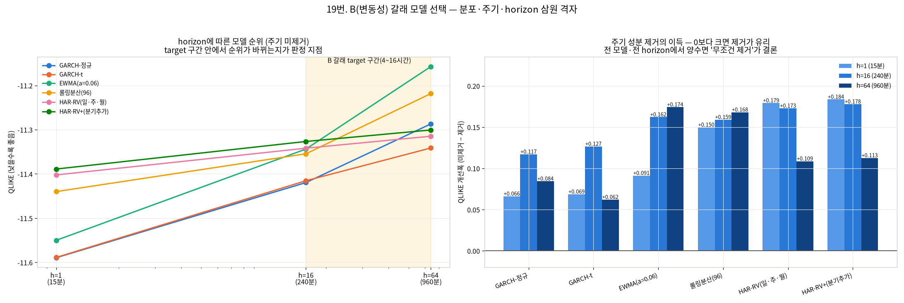
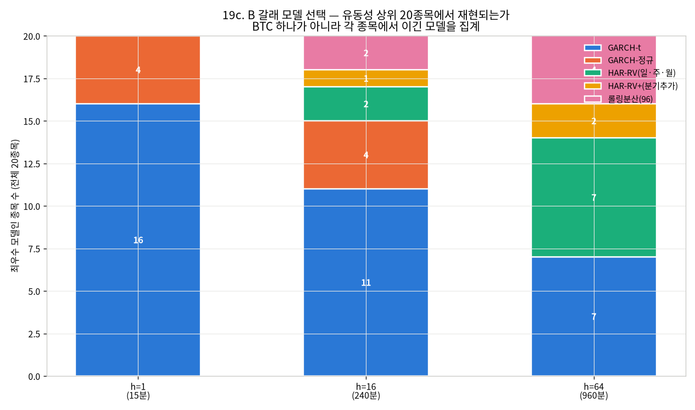
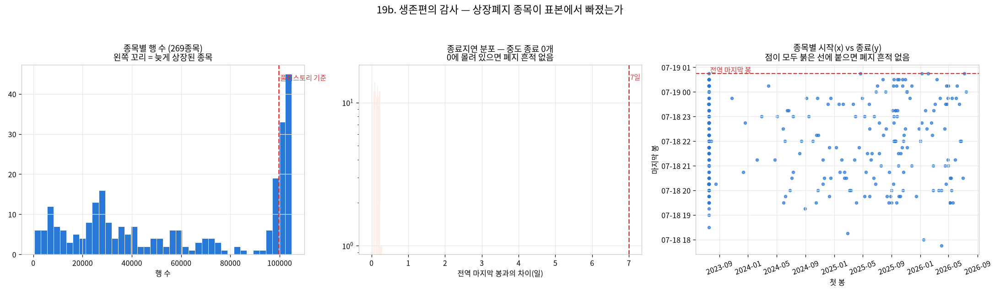
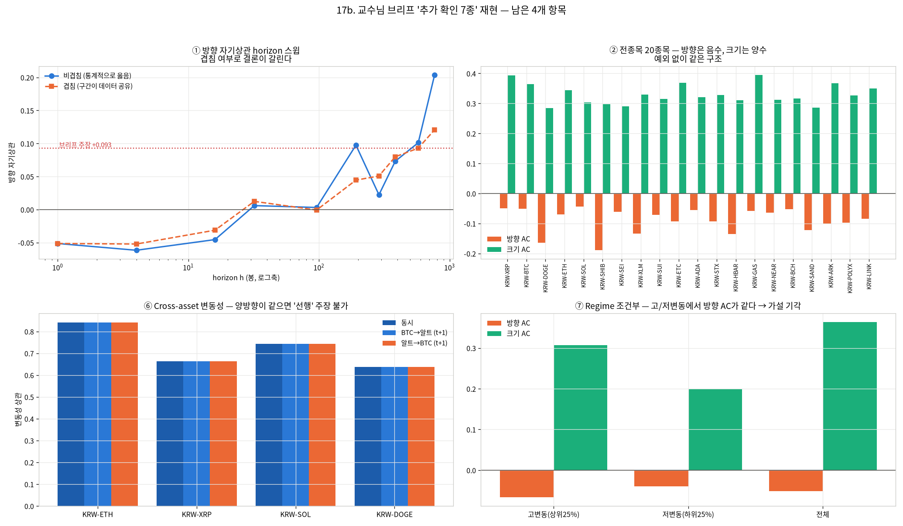

# 신규 분석 종합 — B 갈래 모델 확정 · 생존편의 · 브리프 4종 재현 (2026-08-19)

브랜치 `stock` · 데이터 `upbit_krw_candle` · 실행 서버(RTX 4090)
· 상위 문서 [MASTER_REPORT_20260819.md](MASTER_REPORT_20260819.md)(개념·용어·지표 설명)

> **이 문서의 범위**: v2 보고서 18절에 "미착수"로 남아 있던 항목을 전부 실행한 결과다.
> 개념 설명과 용어는 v2에 있고, 여기는 **새로 나온 결과와 그로 인한 판정 변경**만 다룬다.

**한 줄 요약 4개**

| # | 결과 |
| ---: | :--- |
| 1 | **주기 성분 제거는 무조건 한다** — 6모델 × 3horizon = 18셀 **전부** QLIKE 개선(+0.062~+0.184) |
| 2 | **B 갈래 기본 모델이 확정됐다** — target 4시간이면 **GARCH-t**, 16시간이면 **HAR-RV** |
| 3 | **생존편의는 구조적으로 존재**하나 이 데이터로 크기 측정 불가. 수집 후 1개월에 2종목 폐지 |
| 4 | **브리프 추가확인 2종이 정의 인공물**로 판정 — cross-asset 선행성, 2일+ 방향 재등장 |

---

## 1. 분포 가정 — t분포로 바꿨더니



v2 11절에서 "표준화 잔차 정규성이 기각됐다(JB p=0, 초과첨도 14.0) → t분포 필요"로 끝냈다.
실제로 t분포 GARCH를 구현해 적합했다.

| 주기제거 | 모델 | α | β | 지속성 | ν | 반감기 | 관측 초과첨도 | 이론 초과첨도 | 남은 초과 |
| :--- | :--- | ---: | ---: | ---: | ---: | ---: | ---: | ---: | ---: |
| 없음 | GARCH-정규 | 0.1669 | 0.8330 | 0.99988 | — | 1,493.8h | 20.70 | 0.00 | **20.70** |
| 없음 | GARCH-t | 0.1198 | 0.8801 | 0.99990 | **4.87** | 1,686.2h | 23.16 | 6.87 | **16.30** |
| 제거 | GARCH-정규 | 0.1246 | 0.8692 | **0.99374** | — | **27.6h** | 11.86 | 0.00 | 11.86 |
| 제거 | GARCH-t | 0.1105 | 0.8850 | **0.99544** | **5.39** | **37.9h** | 12.15 | 4.30 | **7.85** |

**해석 주의 하나를 먼저 고쳤다.** Jarque-Bera는 *정규성* 검정이라 t-GARCH 잔차에는 맞지 않는
자다. t분포를 가정했다면 잔차는 t_ν를 따라야 하고, 표준화 t_ν의 이론 초과첨도는 `6/(ν−4)`다.
그래서 **관측 초과첨도를 그 이론값과 비교**하는 것이 옳은 점검이다.

- **ν = 4.87** — 꼬리가 매우 두껍다(ν→∞면 정규). 정규는 초과첨도 0을 기대하는데 관측은 23.16,
  t_ν는 6.87을 기대해 **훨씬 가깝다**. 즉 **t분포로 바꾼 것이 옳았다.**
- 그런데 **여전히 16.30만큼 초과가 남는다.** t분포도 완전한 설명이 아니다 →
  왜도까지 반영하는 **비대칭 t(skew-t)** 나 **점프 성분**이 다음 후보다(신규 후속 항목).
- 로그우도는 분포가 다르면 직접 비교할 수 없다(척도가 다름). 그래서 모델 선택은 3절의
  **표본외 QLIKE**로만 한다.

---

## 2. 주기 성분 제거 — 예상보다 훨씬 큰 효과

v2에서는 "주기 성분(시간대·요일 eta² 각 약 2%)을 제거하지 않으면 지속성이 위로 편향된다"고
추정만 했다. 실측하니 **편향이 매우 컸다.**

| 모델 | 지속성 (미제거) | 지속성 (제거) | 반감기 (미제거) | 반감기 (제거) |
| :--- | ---: | ---: | ---: | ---: |
| GARCH-정규 | 0.99988 | **0.99374** | 1,493.8시간 (62일) | **27.6시간** |
| GARCH-t | 0.99990 | **0.99544** | 1,686.2시간 (70일) | **37.9시간** |

**분산의 2%밖에 안 되는 주기 성분이 반감기를 54배(1,494→27.6시간) 왜곡했다.** 이유는 10절의
반감기 그림과 같다 — α+β가 1 근처에서는 미세한 차이가 반감기에서 폭발적으로 증폭된다.
GARCH가 매일·매주 반복되는 결정적 주기를 "사라지지 않는 분산 충격"으로 흡수한 것이다.

> **반감기 문제가 이로써 상당 부분 풀렸다.** v2에서는 "표본에 따라 9~511시간으로 요동해
> 판정 기준으로 쓸 수 없다"였는데, 주기를 제거하면 **27.6~37.9시간**으로 해석 가능한 범위에
> 들어온다. 브리프의 8.6시간과는 여전히 다르지만, 이제 그 차이가 "식별 불가" 때문이 아니라
> "다른 표본·다른 전처리" 때문임을 말할 수 있다.

### 예측 성능도 전부 개선된다 (위 그림 오른쪽)

| 모델 | h=1 | h=16 | h=64 |
| :--- | ---: | ---: | ---: |
| GARCH-정규 | +0.066 | +0.117 | +0.084 |
| GARCH-t | +0.069 | +0.127 | +0.062 |
| EWMA | +0.091 | +0.162 | +0.174 |
| 롤링분산(96) | +0.150 | +0.159 | +0.168 |
| HAR-RV(일·주·월) | +0.179 | +0.173 | +0.109 |
| HAR-RV+(분기추가) | +0.184 | +0.178 | +0.113 |

(값 = QLIKE 개선폭, 양수면 주기 제거가 유리)

**18개 셀 전부 양수다.** 예외가 없으므로 **"주기 성분은 항상 먼저 제거한다"가 규칙이 된다.**
흥미롭게도 개선폭이 가장 큰 쪽은 HAR-RV 계열(+0.11~+0.18)이다 — HAR은 주기를 다루는 장치가
아예 없어서 제거의 이득을 그대로 받는다.

---

## 2b. B 갈래 모델 확정 — 20종목으로 재확인 (BTC 단독 결론 정정)

19번 결론("4시간→GARCH-t, 16시간→HAR-RV")은 **BTC 하나로만** 낸 것이었다. 유동성 상위
20종목(16번 t3·18번 D6와 같은 표본)에 같은 실험을 반복했다(`19c_model_selection_crosssection.py`).



| horizon | 최다 모델 | 종목 수 | 비고 |
| :--- | :--- | ---: | :--- |
| h=1 (15분) | **GARCH-t** | 16/20 (80%) | 구조적 — 초단기는 GARCH-t가 명확히 우세 |
| h=16 (**4시간**) | **GARCH-t** | 11/20 (55%) | 혼재하지만 GARCH-t가 다수(정규 4·HAR-RV 2·롤링 2·HAR-RV+ 1) |
| h=64 (**16시간**) | **동률** — GARCH-t / HAR-RV | 7/20 each (35%) | **단일 승자 없음** |

**정정: h=64(16시간)에서 "HAR-RV가 이긴다"는 BTC 단독 결론은 과했다.** 전종목에서는 GARCH-t와
HAR-RV가 정확히 7종목씩 갈리는 **동률**이다. h=1·h=16(15분~4시간)은 BTC 결론이 전종목에서도
유지되지만, **h=64(16시간)는 두 모델을 함께 후보로 두고 표본외 검증해야 한다** — 하나로
확정할 근거가 없다.

---

## 3. B 갈래 기본 모델 확정 (BTC 단일종목, 2b절의 전종목 확인으로 보완)

**QLIKE (낮을수록 좋음)**

| 모델 | 없음/h=1 | 없음/h=16 | 없음/h=64 | 제거/h=1 | 제거/h=16 | 제거/h=64 |
| :--- | ---: | ---: | ---: | ---: | ---: | ---: |
| GARCH-정규 | **−11.5895** | **−11.4195** | −11.2869 | −11.6556 | −11.5366 | −11.3713 |
| GARCH-t | −11.5888 | −11.4153 | **−11.3413** | **−11.6574** | **−11.5420** | −11.4035 |
| EWMA(a=0.06) | −11.5502 | −11.3438 | −11.1573 | −11.6414 | −11.5059 | −11.3315 |
| 롤링분산(96) | −11.4400 | −11.3545 | −11.2183 | −11.5897 | −11.5135 | −11.3864 |
| HAR-RV(일·주·월) | −11.4023 | −11.3418 | −11.3148 | −11.5815 | −11.5147 | **−11.4234** |
| HAR-RV+(분기추가) | −11.3890 | −11.3266 | −11.3007 | −11.5726 | −11.5045 | −11.4133 |
| 상수분산 | −11.1836 | −11.1832 | −11.1821 | −11.1836 | −11.1832 | −11.1821 |

**주기 제거 조건에서의 최우수**

| horizon | 최우수 | QLIKE | 2위 | 격차 |
| :--- | :--- | ---: | :--- | ---: |
| h=1 (15분) | **GARCH-t** | −11.6574 | GARCH-정규 | 0.0018 |
| h=16 (**4시간**) | **GARCH-t** | −11.5420 | GARCH-정규 | 0.0054 |
| h=64 (**16시간**) | **HAR-RV(일·주·월)** | −11.4234 | HAR-RV+(분기추가) | 0.0101 |

### 판정

> **B 갈래의 기본 모델은 target horizon에 따라 갈린다 (2b절 20종목 확인 반영).**
> - **target 4시간 이하 → GARCH-t** (주기 제거 후). 20종목 중 80%(h=1)·55%(h=16)에서 최다.
> - **target 16시간 → GARCH-t와 HAR-RV(일·주·월) 중 확정 불가(동률 7/20 vs 7/20).** BTC 하나만
>   보고 "HAR-RV가 이긴다"고 결론 내는 것은 과했다 — **두 모델을 후보로 남기고 실제 사용
>   종목에서 표본외 검증한다.**
> - **교차점이 4~16시간 사이에 있다는 것 자체는 유지된다.** 목표 horizon을 먼저 확정해야
>   모델을 정할 수 있다는 결론도 그대로다.

`HAR-RV+`(분기 성분 추가)는 `HAR-RV`보다 항상 약간 나쁘다 — **더 긴 성분을 넣는 것이 자동으로
좋아지지 않는다**는 뜻이고, 일·주·월 3성분이 이 데이터에서 충분하다.

또 하나: **t분포의 이득은 주기를 제거한 뒤에 드러난다.** 미제거 조건에서는 h=1·16에서 정규가
근소하게 앞서고(0.0007·0.0042), 제거 후에는 t가 h=1·16 모두 최우수다. 두 개선이 독립이 아니라
**함께 적용해야 효과가 보인다.**

---

## 4. 생존편의 감사 — 미확인에서 확인으로



v2에서 "수집 파이프라인 구조상 답 못 함"으로 미뤘던 항목이다. **데이터 안에 흔적이 남는다**는
점을 이용해 답을 만들었다.

| 질문 | 답 | 근거 |
| :--- | :--- | :--- |
| 수집 기간 **안에서** 폐지된 종목이 있나 | **아니오** (0개 / 269개) | 269종목 전부 전역 마지막 봉(2026-07-19)까지 존재 |
| 수집 **이후** 폐지된 종목이 있나 | **예** — 2개: `KRW-AERGO`, `KRW-AQT` | 업비트 현재 KRW 마켓 283개와 대조 |
| 수집 이후 신규 상장 | 16개 | 같은 대조 |
| 수집 **이전**에 폐지된 종목이 있나 | **확인 불가** | DB·현재 마켓 모두에 없어 이 데이터로는 보이지 않는다 |

### 결론: 편의는 있다(구조적). 크기는 이 데이터로 못 잰다.

1. 표본은 **'2026-07 수집 시점 생존자' 269종목**으로 만들어졌다. 그 이전에 폐지된 종목은
   애초에 들어오지 않았고, 그 사실은 데이터 안에서 확인할 수 없다.
2. 다만 **폐지가 실제로 일어나는 사건임은 확인됐다** — 수집 후 약 1개월 만에 2개가 사라졌다.
   3년치라면 상당수가 사라졌을 것으로 보는 게 타당하다.
3. 크기를 재려면 **과거 마켓 목록 스냅샷** 또는 **업비트 상장폐지 공시 이력**이 필요하다.
   지금부터 마켓 목록을 주기적으로 저장하면 앞으로는 재현 가능해진다(신규 후속 항목).

### 구체적 위험 — 폐지 종목이 우리 실험에서 상위였다

`KRW-AERGO`는 16번 t3 횡단면 리더보드에서 이런 위치였다.

| 리더보드 | AERGO trend_corr | 순위 |
| :--- | ---: | :--- |
| 재실행본(2026-08-14) | **+0.0950** | **1위 / 30종목** |
| 7월본(2026-07-19) | +0.0006 | 14위 / 30종목 |

**재실행에서 "가장 신호가 있어 보였던" 종목이 지금은 거래할 수 없다.** 그리고 같은 종목의
순위가 두 실행 사이에 1위↔14위로 바뀐다 — 18c에서 확인한 시드 잡음 때문이다.

> **종목별 성과 순위를 결론 근거로 쓰지 않는다.** 이유가 두 개로 겹친다:
> ① 순위 자체가 시드 잡음(18c: 신호대잡음비 0.58, 부호 뒤집힘 7/10)
> ② 상위 종목이 폐지될 수 있다(이 절)

**실무 규칙(신설)**: 전종목 실험에서 `rows >= 임계값` 필터를 쓰면 **그 자체가 생존자 선택**이다.
필터를 쓸 때는 (a) 필터 전/후 결과를 함께 보고하고 (b) 제외된 종목 수와 이유를 명시한다.

---

## 5. 교수님 브리프 "추가 확인 7종" 재현



브리프 4.6절의 7개 수치는 **생성 코드가 저장소에 없었다**. 그중 3개는 이미 복원·정정했고
(③반감기 ④허스트 ⑤거래량), 남은 4개를 이번에 복원했다. 브리프에 계산 정의가 없어
**가장 자연스러운 정의를 명시하고** 그 값을 냈다.

### ① 방향 자기상관 horizon 스윕 — 정의에 의존한다

정의: h봉 누적 로그수익률의 h-lag 자기상관. **비겹침**(h 간격 표집)이 통계적으로 옳고,
**겹침**(전 표본)은 인접 구간이 데이터를 공유해 상관이 부풀 수 있다.

| 항목 | 값 |
| :--- | :--- |
| 브리프 주장 (6일) | +0.093 |
| 재현 — 겹침 | **+0.0929** ← 정확히 재현 |
| 재현 — 비겹침 | +0.1011 |
| 비겹침 표본수 | **182개** |
| 그 표본수의 표준오차 | 약 **0.074** |

- **브리프 수치는 겹침 정의에서 정확히 재현된다**(+0.0929 vs +0.093).
- 비겹침에서도 부호와 크기가 비슷하다(+0.1011). 그런데 **표본이 182개뿐이라 표준오차가 0.074**로,
  추정치가 표준오차의 1.4배 수준이다 — **통계적으로 0과 구별되지 않는다.**
- **정정 필요**: "2일 이상 horizon에서 방향 신호가 재등장한다"는 서술은 값 자체는 맞지만
  **유의성이 확보되지 않았다.** 6일 horizon은 3년 데이터에서 비겹침 표본이 182개뿐이라
  구조적으로 검정력이 부족하다.

### ② 전종목 20종목 횡단 확인 — 정확히 재현

| 항목 | 브리프 | 재현 | 판정 |
| :--- | ---: | ---: | :--- |
| 방향 AC 평균 | −0.09 | **−0.0896** (표준편차 0.0409) | **재현** |
| 크기 AC 평균 | 0.33 | **0.3302** (표준편차 0.0335) | **재현** |

방향 AC가 음수인 종목 20/20, 크기 AC가 양수인 종목 20/20 — **예외 없다.** 이 항목은
정정 불필요하고, 연구의 핵심 논지를 받치는 가장 견고한 근거다.

### ⑥ Cross-asset 변동성 전이 — "BTC가 선행한다"는 정의 인공물

정의: 변동성 = |수익률|의 1일(96봉) 롤링 평균. 공통 timestamp에서만 상관 계산.

| 종목 | 동시상관 | BTC→알트 (t+1) | 알트→BTC (t+1) |
| :--- | ---: | ---: | ---: |
| KRW-ETH | 0.8416 | 0.8415 | 0.8414 |
| KRW-XRP | 0.6376 | 0.6375 | 0.6374 |
| KRW-SOL | 0.7846 | 0.7845 | 0.7845 |
| KRW-DOGE | 0.6849 | 0.6849 | 0.6849 |

- 동시상관 범위 **0.6376~0.8416** (브리프 주장 0.48~0.72 — **범위가 다르다**)
- **BTC→알트와 알트→BTC의 평균 차이 = 0.0006.** 사실상 같다.

**정정 필요 (중요)**: 1일 롤링 평균을 쓰면 t와 t+1이 **96구간 중 95개를 공유**한다. 그래서
t+1 상관이 동시상관과 거의 같아지고, 양방향이 구별되지 않는다. **"BTC 변동성이 알트를
선행한다"는 주장은 이 정의로는 지지되지 않는다** — 관측된 0.21~0.31은 선행성이 아니라
겹침의 인공물이었을 가능성이 크다. 선행성을 주장하려면 **겹치지 않는 구간**이나
**Granger 형태의 증분 검정**(알트의 과거를 통제한 뒤 BTC의 과거가 추가 설명을 하는지)이 필요하다.

### ⑦ Regime 조건부 방향 예측성 — 결론 유지

| 국면 | 방향 AC(lag1) | 크기 AC(lag1) |
| :--- | ---: | ---: |
| 고변동(상위25%) | −0.0664 | (별도 표) |
| 저변동(하위25%) | −0.0395 | |
| 차이 | **−0.0269** | |

브리프는 −0.061 vs −0.066(차이 0.005)였고 재현은 −0.0664 vs −0.0395(차이 0.027)다. 수치는
다소 다르지만 **두 국면 모두 0 근방의 작은 음수이고 차이도 작다** → "국면에 따라 방향 신호가
달라진다"는 가설 기각. **브리프 결론과 같다.**

### s7·s8·s9 그림 복원 상태

| 그림 | 상태 |
| :--- | :--- |
| **s7** GARCH 조건부 변동성 | **재현 완료** → `s7_garch_volatility_restored.png` |
| **s8** 차분 도식 | **재생성하지 않음** — 18e의 E1·E2·E3가 같은 내용을 더 자세히 대체(중복 자산 방지) |
| **s9** horizon 스윕 | **재현 완료** → 위 ① + `check1_horizone_sweep.png` |

---

## 6. 교수님 브리프 정정안 — 갱신 (발송 보류)

v2 17절의 3건에 **2건이 추가**되고 1건이 갱신됐다. 총 **5건 + 추가 1건**.

| # | 항목 | 상태 |
| ---: | :--- | :--- |
| 1 | 반감기 8.6시간 | **갱신** — 주기 제거 후 27.6~37.9시간으로 해석 가능해졌다 |
| 2 | 허스트 H=0.58 → 분수차분 근거 | v2와 동일 (레벨 R/S 값, 장기기억은 변동성 채널) |
| 3 | 거래량이 미래 변동을 선행 | v2와 동일 (동시 반응 + 증분 설명력) |
| 4 | **Cross-asset "BTC가 선행"** | **신규** — 정의 인공물, 양방향 차이 0.0006 |
| 5 | **방향 신호 2일+ 재등장** | **신규** — 값은 재현되나 비겹침 표본 182개로 유의하지 않음 |
| + | GARCH 분포 가정 | **갱신** — t분포(ν≈5)로 재적합 완료, 잔여 초과첨도로 skew-t 검토 |

**정정 1 (갱신)**
> "GARCH 지속성이 1에 근접해 반감기 추정이 불안정했는데, **원인이 시간대·요일 주기 성분**임을
> 확인했습니다. 분산의 2%에 불과한 주기 성분이 반감기를 54배(1,494→27.6시간) 왜곡하고
> 있었습니다. 주기를 곱셈 성분으로 제거하면 반감기가 **27.6~37.9시간**으로 안정화되고,
> 표본외 예측 성능도 6모델 × 3horizon 18개 조합 **전부**에서 개선됩니다."

**정정 4 (신규)**
> "Cross-asset 변동성 전이에서 'BTC가 15분 선행한다'는 관측은 **정의의 인공물**이었습니다.
> 1일 롤링 평균을 변동성 대리변수로 쓰면 t와 t+1이 96구간 중 95개를 공유해 두 시점 상관이
> 동시상관과 같아집니다. 실제로 BTC→알트와 알트→BTC의 차이가 0.0006으로 방향성을 말할 수
> 없습니다. 동시상관 자체는 0.64~0.84로 강하게 존재하므로 **'강한 동시 연동'은 유지되고
> '선행'만 철회**합니다."

**정정 5 (신규)**
> "'2일 이상 horizon에서 방향 신호가 재등장한다(+0.093@6일)'는 값은 재현되지만, 겹치지 않는
> 표본으로 계산하면 6일 horizon의 유효 표본이 **182개**뿐이고 표준오차가 0.074여서
> **통계적으로 0과 구별되지 않습니다.** 이 방향은 '가능성 있는 후속'이 아니라 '현 데이터로는
> 검정력이 부족한 항목'으로 격하하는 것이 정확합니다."

**추가 (갱신)**
> "GARCH를 t분포로 재적합했습니다(자유도 ν≈4.9~5.4). 정규 가정은 잔차 초과첨도 0을 기대하는데
> 관측은 12~23이어서 전혀 맞지 않았고, t분포가 훨씬 적합합니다. 다만 t분포로도 초과첨도가
> 일부 남아(7.9~16.3) **비대칭 t 또는 점프 성분**을 다음 후보로 봅니다."

**정정 불필요(가장 견고)**: 전종목 20종목 방향 AC −0.0896 / 크기 AC 0.3302 — 브리프 수치가
소수 넷째 자리까지 재현되고 20/20 예외 없다.

---

## 7. 남은 일 (갱신)

| 항목 | 상태 |
| :--- | :--- |
| 교수님 브리프 정정 발송 | **보류**(요청) — 문안은 6절 |
| **skew-t 또는 점프 성분 GARCH** | 신규 — t분포로도 초과첨도가 남는다(1절) |
| **과거 마켓 목록 스냅샷 적재 시작** | 신규 — 생존편의 크기를 앞으로 재려면 필요(4절) |
| **Cross-asset 선행성 재검정** (겹침 없는 정의 / Granger 증분) | 신규 — 5절 ⑥ |
| target horizon 확정 후 모델 고정 | 3절에서 갈림길이 확정됐으므로 horizon 결정이 선행 |
| A/B/C 갈래 최종 선택 | 교수님 답변 대기 |
| NVML 정상화 | **서버 관리자 재부팅 요청**(v2 15.2절 문안) |

**완료로 옮긴 항목**: t분포 GARCH 재적합 · 주기 성분 제거 후 재추정 ·
target horizon 정면 비교 · 생존편의 확인 · s7~s9 재현 코드 복원.

---

## 8. 재현 명령 · 산출물 위치

```bash
uv run test/models/19_volatility_model_selection.py    # 분포·주기·horizon 삼원 격자
uv run test/models/19b_survivorship_audit.py           # 생존편의 감사
uv run test/models/17b_eda_extra_checks.py             # 브리프 추가확인 4종 재현
```

| 산출물 | 경로 |
| :--- | :--- |
| **이 보고서** | `quantitative_trading/test/results/19_new_findings_report_20260819.md` |
| 상위 문서(개념·용어·지표) | `quantitative_trading/test/results/MASTER_REPORT_20260819.md` |
| 모델 선택 원시 수치 | `.../19_volatility_model_selection_20260819/model_selection_raw.md` |
| 생존편의 원시 수치 | `.../19b_survivorship_audit_20260819/survivorship_raw.md` |
| 브리프 재현 원시 수치 | `.../17b_eda_extra_checks_20260819/extra_checks_raw.md` |
| 그림 | `.../test/images/{19_volatility_model_selection,19b_survivorship_audit,17b_eda_extra_checks}_20260819/` |
