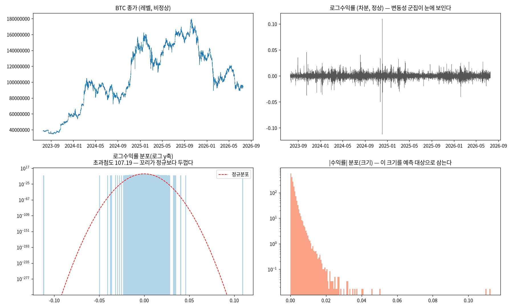
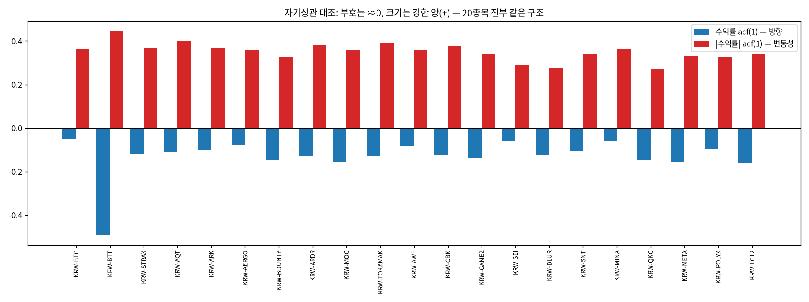
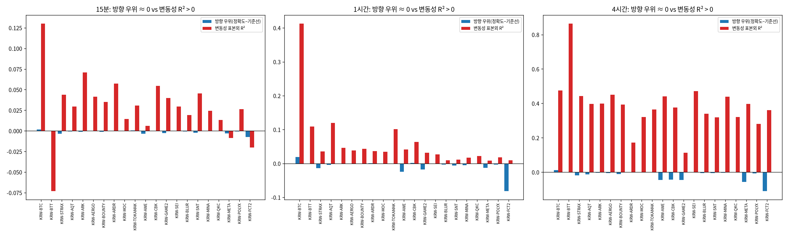

# 20번 보고서 — 방향(부호)이 아니라 변동성(크기)을 먼저 하는 이유

작성일 2026-09-03 · 브랜치 `stock`
· 원시 수치: [`20_.../predictability_raw.md`](20_direction_vs_volatility_predictability_20260903/predictability_raw.md)
· 지표 원본: [`predictability_metrics.csv`](20_direction_vs_volatility_predictability_20260903/predictability_metrics.csv)
· 재현: `uv run test/models/20_direction_vs_volatility_predictability_test.py`

---

## 0. 한 장 요약 — 이번에 정한 것

A/B/C 갈래에서 **B(변동성)를 먼저 주력으로 확정**한다. 다만 프레이밍은 "방향이 안 되니까
변동성으로 도망간다"가 아니다. 정확히는 이렇다.

> 방향은 결국 **수익률의 부호**다. 그런데 부호를 지금 같이 예측 대상에 넣으면 아래 3절의
> 문제가 생긴다. 반면 변동성(부호를 뺀 움직임의 크기)은 같은 데이터에서 실제로 예측된다.
> 그래서 **변동성을 먼저 확립하고, 방향은 그 위에서 이후 단계로 이어간다.**

이 판단을 BTC와 상위 20종목에서 같은 데이터·같은 방식으로 재확인했고, 결과는 예외 없이
한 방향이었다.

---

## 1. 방향이란 무엇인가 — 용어부터 맞춘다

- **방향(direction)** = 다음 시점 수익률의 **부호**. 오르면 +, 내리면 −. 즉 `sign(다음 수익률)`.
- **변동성(volatility)** = 그 부호를 떼어낸 **움직임의 크기**. 절댓값 수익률이나 실현변동성
  `√(Σ 수익률²)`으로 잰다.

두 대상은 예측 문제의 종류부터 다르다. 방향은 오름/내림 **분류(classification)** 문제이고,
변동성은 크기를 맞추는 **회귀(regression)** 문제다. 그래서 성적표의 지표도 다르다(방향은
정확도, 변동성은 R²·상관계수).

---

## 2. 데이터와 전처리 — 무엇을 어떻게 다뤘는가

### 2.1 분석 대상 종목 (E0)

`upbit_krw_candle`(15분봉, 269종목)에서 **이력 9만 행(약 2.5년) 이상**인 종목으로 좁힌 뒤,
**점수 = 로그수익률 표준편차 × log(총 거래대금)** 상위 20종목을 선정했다. 이력 하한선은
신규 상장 잡코인과 생존편의(지금 살아남은 종목만 뽑히는 편향)를 배제하기 위한 것이다.
BTC는 대형 저변동 종목이라 변동성 순위에는 들지 않지만, 기존 연구와의 연결을 위해 **대표
기준 종목으로 별도 추가**했다(총 21종목 분석). 선정 목록과 점수는 원시 수치 E0 표에 있다.

### 2.2 대표 종목(BTC) EDA (E1)

- 기간 약 2.7년, 104,883봉, 결측 없음. 종가는 비정상(추세·수준 이동), 로그수익률은 정상이며
  **변동성 군집**(큰 변동이 몰려 있는 구간)이 눈으로 보인다.
- 로그수익률 **초과첨도 13.98**(정규분포면 0). 급변이 정규 가정보다 훨씬 잦은 **두꺼운 꼬리**다.
- |수익률| 자기상관 lag1 = **0.36** vs 수익률 자기상관 lag1 = **−0.05**. 크기에는 구조가 있고
  부호에는 없다는 이후 결과의 전조다.
- `describe()`는 지수표기 없이 정수/실수로 원시 수치 E1 표에 실었다.

### 2.3 전처리 계보 (E2, AGENTS.md 2.9b)

예측 대상이 "차분값(로그수익률)에서 파생된 부호/크기"임을 먼저 밝힌다.

| 단계 | 처리 | 근거 |
| :--- | :--- | :--- |
| 원본 레벨 | 종가 close | 비정상(단위근) |
| 변환 | log(close) | 배율 효과 제거. 로그 레벨도 여전히 비정상 |
| 차분 d=1 | log_return = Δlog(close) | 여기서 정상성을 얻는다 |
| 타깃(방향) | sign(Σ 미래수익률) | 분류 라벨 |
| 타깃(변동성) | √(Σ 미래수익률²) | 회귀 타깃(로그 스케일) |
| 스케일링 | 학습구간 StandardScaler | 누설 방지(학습통계로만 fit) |

look-ahead(미래 정보 누설)를 막기 위해 feature는 시점 t까지만 쓰고, 학습/테스트는 시간순
70/30으로 나눴다.

---

## 3. 방향을 지금 같이 고려할 때의 문제점 (E3·E4)

### 3.1 부호에는 예측할 신호가 거의 없다

- 수익률 자기상관 lag1 평균 **−0.13**(0 근처), |수익률| 자기상관 lag1 평균 **0.35**로 완전히
  갈린다. 부호는 과거로 미래를 설명하지 못하고, 크기는 설명한다. 20종목 전부 같은 구조다.
- 이는 효율적 시장 가설(정보가 이미 가격에 반영되어 다음 부호를 알기 어렵다)과 일치한다.

### 3.2 분류기를 학습시켜도 기준선을 못 넘는다

단순 로지스틱 회귀로 방향을 분류한 결과, **정확도 자체는 0.51~0.72로 높아 보이지만 실제
예측력은 없다.** 높은 정확도는 대부분 **상승/하락 클래스 쏠림** 때문이다(예: 상승비율 0.28인
종목은 무조건 "하락"만 찍어도 0.72가 나온다). 그래서 다수 클래스만 찍는 기준선과 비교한
**우위(edge)**로 판단해야 한다.

| 예측 구간 | 방향 우위(정확도−기준선) 평균 | 큰 변동 구간 방향 정확도 |
| :--- | ---: | ---: |
| 15분 | −0.0012 | 0.509 |
| 1시간 | −0.0074 | 0.527 |
| 4시간 | −0.0174 | 0.544 |

- 우위는 20종목·3구간 어디서도 0 근처이거나 오히려 음수다. 큰 변동 구간만 따로 봐도 개선되지
  않는다(0.5 근처).
- **결론(방향)**: 지금 방향을 주력에 넣으면, 이렇게 신호가 없는 대상을 억지로 모델링하면서
  **잡음을 신호로 착각(과적합)**하거나, 라벨 정의(무변동 구간)·거래비용 때문에 결론이 흔들려
  프로젝트 전체의 신뢰도를 떨어뜨릴 위험이 크다.

---

## 4. 변동성은 같은 데이터에서 실제로 예측된다 (E5·E6)

같은 데이터·같은 방식으로 미래 실현변동성을 회귀로 예측한 결과다. 지표는 축·나이브와 함께
보고한다(AGENTS.md 2.9d).

**대표 종목 BTC**

| 예측 구간 | 표본외 R² | 예측·실제 상관 | MASE (나이브 대비) |
| :--- | ---: | ---: | ---: |
| 15분 | 0.130 | 0.226 | 0.728 |
| 1시간 | 0.413 | 0.440 | 0.814 |
| 4시간 | 0.476 | 0.624 | 0.855 |

- 표본외 R²가 양으로 크고, 예측·실제 상관이 0.62까지 오른다. MASE가 1보다 작으므로 학습
  모델이 나이브 지속성보다 낫다.
- 20종목 평균에서도 구간이 길어질수록 R²가 커진다(4시간 평균 **0.38**). 15분 한 봉짜리
  실현변동성은 잡음이 커서 R²가 작지만, 이는 "변동성이 안 된다"가 아니라 **단순 지속성 대신
  GARCH·HAR 같은 평활 모델이 필요한 이유**다.
- **결론(변동성)**: 예측이 되는 대상이므로 여기에 집중한다.

> 방향(우위 ≈ 0)과 변동성(R² 0.13~0.48)의 이 대비가, "방향이 아니라 변동성을 먼저 한다"는
> 순서 결정의 실증 근거다.

---

## 5. 기대 효과와 설계 근거 — 문헌 (관련 보고서 [`professor_direction_recommendation_20260821.md`](professor_direction_recommendation_20260821.md))

이번 실측은 금융계량경제학의 **정형화된 사실(stylized facts)**과 정확히 일치한다. 즉 우리
데이터·모델의 결함이 아니라 알려진 구조다.

- 방향 예측 불가: **Fama(1970)** 효율적 시장 가설, **Cont(2001)** "수익률에는 선형 상관이
  거의 없다", 암호화폐 실증 **Yi et al.(2023, *Sci. Rep.*)** "비트코인 시장은 약형 효율에 가깝다",
  **Singha(2025, arXiv:2512.15720)** "방향 정확도 45%, 우연과 구별 불가(p=0.12)".
- 변동성 예측 가능: **Mandelbrot(1963)** 변동성 군집 최초 관측, **Engle(1982)** ARCH(노벨상),
  **Barjašić·Antulov-Fantulin(2020)** "GARCH(1,1)이 분 단위 변동성 예측에 가장 잘 반응",
  **Hansen et al.(2021)** 암호화폐 변동성의 시간대·요일 주기, **Hassler·Pohle(2019)** 장기기억
  하에서 분수적분 기반 방법의 우수성.

**기대 효과**: "변동성 예측"으로 목표를 잡으면 두 활용처를 하나로 묶을 수 있다.
(a) 연구 목적으로는 "변동의 크기가 시간에 따라 변한다"는 비정상성의 구체적 형태를 다루는 것
자체가 연구가 되고, (b) 실용 목적으로는 변동성 예측이 그대로 리스크 관리 신호가 된다.

---

## 6. 다음 단계 — 순서

1. **변동성 모델 확립(먼저)**: 주기 성분 제거 후, 구간별 후보(4시간 GARCH-t / 16시간 GARCH-t·
   HAR-RV 동률)를 표본외 성능으로 확정한다(19번 결과 이어받기).
2. **방향은 이후 단계**: 변동성을 확립한 위에서, 변동성에 조건부인 방향이나 외생 정보 결합
   같은 후속 연구로 이어간다. 기대치는 낮게 잡고 부가 실험으로 둔다.

---

## 부록 — 한계와 유의점

- **BTT는 예외**: 초저가 코인이라 호가 튐(bid-ask bounce)으로 수익률 자기상관이 −0.49로 크게
  음수다. 미시구조 아티팩트이며 20종목 종합 결론에는 영향이 없다.
- **15분 변동성 R²가 작은 것**은 단일 봉 실현변동성의 잡음 때문이며, 평활·집계 모델의
  필요성을 가리킨다(변동성 자체의 예측 불가가 아니다).
- 모든 수치는 시간순 70/30 분할·표본외 기준이며, 과학적표기 없이 원시 수치 파일에 보존했다.
