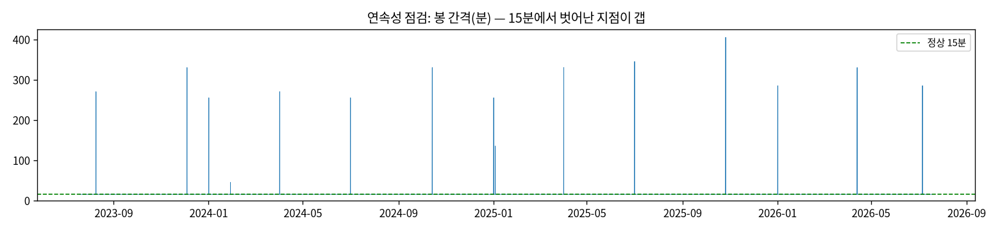
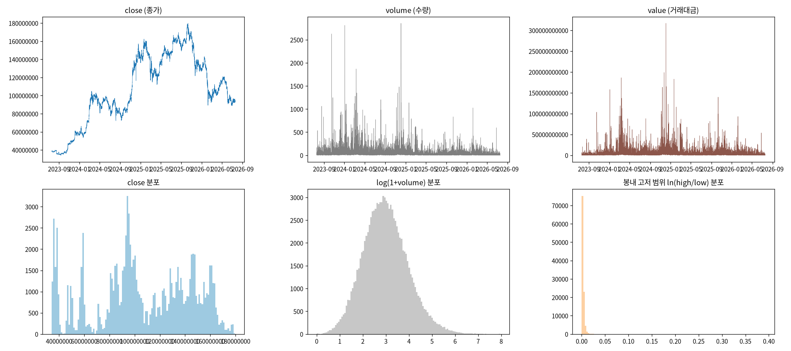
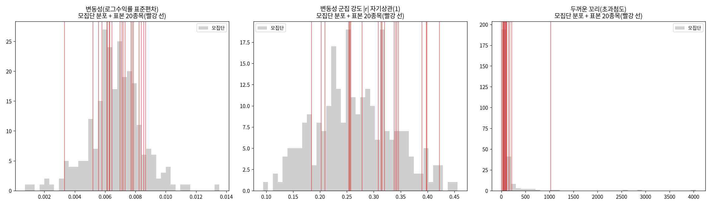

# 21번 변동성 EDA — 원시 수치 (full)

## B. 연구 배경

- **대상**: 업비트 KRW 마켓 암호화폐. 주식과 달리 **24시간·연중무휴 거래**라 장 시작/마감·
  주말 갭이 없고, 시계열이 **끊김 없이 연속**이다(개장 점프로 인한 인공 변동이 없다).
- **왜 시계열 분석에 적합한가**: 연속 표본이라 등간격(15분) 시계열 가정이 잘 맞고, 결측·갭이
  적어 자기상관·조건부 이분산 같은 시간구조를 왜곡 없이 추정할 수 있다.
- **연구 방향(변동성 예측)**: 다음 구간에 가격이 **오를지/내릴지(방향)**가 아니라 **얼마나
  움직일지(변동성=크기)**를 예측한다. 방향은 효율적 시장 가설상 예측이 어렵고(선행 연구·
  문헌에서 반복 확인), 변동성은 '큰 변동 뒤 큰 변동'이라는 **변동성 군집** 때문에 예측 가능하다.
- **이 EDA의 역할**: 위 전제(변동성 군집·조건부 이분산·두꺼운 꼬리)가 실제 데이터에 있는지
  확인하고, 이후 전처리·모델 선택의 가정을 세운다. 이 단계에서는 모델을 적합하지 않는다.

## Q. 데이터 품질 (대표 종목 BTC)

- 기간 2023-07-19 19:00:00 ~ 2026-07-19 00:30:00, 104,883봉(15분).
- 15분 아닌 간격 15개(그중 누락 갭 15개, 중복 0개). 전체 대비 0.0143% — 사실상 연속이나 소수 갭은 존재한다.
- 결측: {'open': 0, 'high': 0, 'low': 0, 'close': 0, 'volume': 0, 'value': 0}
- OHLC 정합성 위반: high<low 0건, high<max(open,close) 0건, low>min(open,close) 0건. 거래량 0 이하 0건.

## R. RAW 열별 기술통계 (변환 전, 지수표기 없이)

| 통계량 | open | high | low | close | volume | value |
| :--- | ---: | ---: | ---: | ---: | ---: | ---: |
| count | 104,883.00 | 104,883.00 | 104,883.00 | 104,883.00 | 104,883.0000 | 104,883.00 |
| mean | 106,042,792.44 | 106,188,988.20 | 105,890,238.66 | 106,042,912.87 | 32.3244 | 3,172,491,762.68 |
| std | 38,419,889.80 | 38,461,535.90 | 38,375,540.24 | 38,419,597.06 | 54.9572 | 5,428,471,142.82 |
| min | 34,144,000.00 | 34,257,000.00 | 34,100,000.00 | 34,171,000.00 | 0.0002 | 19,979.49 |
| 1% | 35,299,000.00 | 35,329,820.00 | 35,268,820.00 | 35,298,820.00 | 1.5330 | 151,075,640.46 |
| 25% | 82,931,500.00 | 83,092,500.00 | 82,799,500.00 | 82,938,500.00 | 9.1789 | 904,263,990.73 |
| 50% | 101,580,000.00 | 101,732,000.00 | 101,442,000.00 | 101,577,000.00 | 17.8670 | 1,717,315,381.02 |
| 75% | 139,545,000.00 | 139,800,000.00 | 139,309,000.00 | 139,544,500.00 | 35.3573 | 3,393,464,709.24 |
| 99% | 170,400,000.00 | 170,543,180.00 | 170,169,620.00 | 170,401,540.00 | 243.1054 | 24,272,158,750.31 |
| max | 179,810,000.00 | 179,869,000.00 | 179,300,000.00 | 179,810,000.00 | 2,856.9078 | 317,019,670,845.50 |

- open/high/low/close는 원(KRW) 가격, volume은 코인 수량, value는 원 거래대금이다.
- **이 6개 열은 아직 어느 것도 모델에서 배제하기로 결정하지 않았다**(EDA 단계에서 전부 본다).

## V. 변동성 지향 EDA — 로그수익률의 성질

### V1. 분포와 정규성
- 로그수익률 평균 0.00000857, 표준편차 0.002386, 왜도 0.0045, 초과첨도 107.1857 (정규분포=0).
- Jarque-Bera 정규성 검정 통계량 50,206,918.9, p=0.0000 → 정규성 기각(두꺼운 꼬리). 초과첨도가 크게 양(+)이면 급변이 정규 가정보다 잦다.

### V2. 정상성 (레벨 vs 로그수익률)
| 계열 | ADF 통계량 | ADF p (작을수록 정상) | KPSS 통계량 | KPSS p (클수록 정상) | 판정 |
| :--- | ---: | ---: | ---: | ---: | :--- |
| 로그가격(레벨) | -2.2417 | 0.1915 | 34.4644 | 0.0100 | 비정상(단위근) |
| 로그수익률(1차차분) | -42.1612 | 0.0000 | 0.6793 | 0.0154 | 정상 |
- **결론**: 레벨은 비정상이라 차분(로그수익률)이 정상성의 근거다. 로그는 정상성이 아니라
  스케일/분산 안정화를 위한 것이고, 정상성은 1차 차분에서 온다.

### V3. 자기상관 — 방향(r) vs 크기(|r|, r²)
| lag | r 자기상관(방향) | |r| 자기상관(크기) | r² 자기상관(크기) |
| ---: | ---: | ---: | ---: |
| 1 | -0.0514 | 0.3640 | 0.4789 |
| 2 | -0.0209 | 0.2957 | 0.0514 |
| 4 | -0.0121 | 0.2582 | 0.0312 |
| 8 | 0.0013 | 0.2111 | 0.0202 |
| 16 | -0.0004 | 0.1646 | 0.0105 |
| 32 | 0.0048 | 0.1420 | 0.0096 |
| 64 | 0.0012 | 0.1239 | 0.0076 |
| 96 | -0.0023 | 0.1403 | 0.0078 |
- r(부호)은 0 근처로 곧 사라지고(방향 예측 불가), |r|·r²(크기)은 강한 양의 상관이 느리게
  감소한다(장기기억=변동성 군집=예측 가능). **변동성 예측의 근거가 여기 있다.**

### V4. 시간구조 검정 (Ljung-Box, ARCH-LM)
- Ljung-Box(96) — r: p=0.0000 / r²: p=0.0000 (p<0.05면 자기상관 있음).
- ARCH-LM(16): 통계량 30,531.2, p=0.0000 → 조건부 이분산 존재(GARCH류 정당화).
- r²에 강한 자기상관 + ARCH 효과 = 변동성이 시간에 따라 예측 가능하게 변한다는 직접 증거.

### V5. 계절성 — 시간대/요일별 평균 |수익률|
- 시간대별 |수익률| 최대/최소 비율 1.82배, 요일별 1.76배 — 주기 성분이 있으면 이후 전처리에서 제거 검토.

### V6. 범위 기반 변동성 (high/low 활용) — 아직 미사용이던 열을 EDA
- Parkinson √추정치 vs |수익률| 상관 0.8155, Garman-Klass √추정치 vs |수익률| 상관 0.6619 — high/low가 변동성 정보를 추가로 담는지 확인(이후 feature 후보).

### V7. 거래량-변동성 관계
- 거래량 z-score와 |수익률| 동시상관 0.3965 — 거래량이 변동성과 함께 움직이는지(공통 정보).

## S. 표본 타당성 — 모집단 대비 상위 20종목

상위 20종목은 무작위 표본이 아니라 **의도적(유동성·변동성 상위) 표본**이다. 타당성은
'우리가 예측하려는 현상(변동성 군집·두꺼운 꼬리·조건부 이분산)이 특정 20종목만의 것이
아니라 **모집단 전반에 보편적으로 존재**함'을 보여 확보한다.

- 모집단 스캔: 이력 5,000봉 이상 258종목(종목별 최근 20,000봉).
- **정형화 사실의 보편성(모집단 258종목)**:
  - |수익률| 자기상관(1) > 0 : 258/258종목 (변동성 군집이 거의 모든 종목에 존재)
  - r² 자기상관(1) > 0 : 258/258종목
  - 초과첨도 > 0(두꺼운 꼬리) : 258/258종목
  - 모집단 |수익률| 자기상관(1) 중앙값 0.2595, 표본(20종목) 중앙값 0.3145
- **표본 위치**: 상위 20종목은 변동성(std) 분포에서 상위 구간에 위치하나, |수익률| 자기상관·
  두꺼운 꼬리 같은 **예측 대상 성질은 모집단과 같은 방향**이다 → 현상을 놓치지 않는다.

## D. 데이터 사전 v1

- `test/results/DATA_DICTIONARY.md` 생성/갱신(RAW 6열 + 파생 5종 + 타깃 후보 등록).
- 이후 모든 반복에서 파생변수가 생기면 이 문서에 누적한다.

