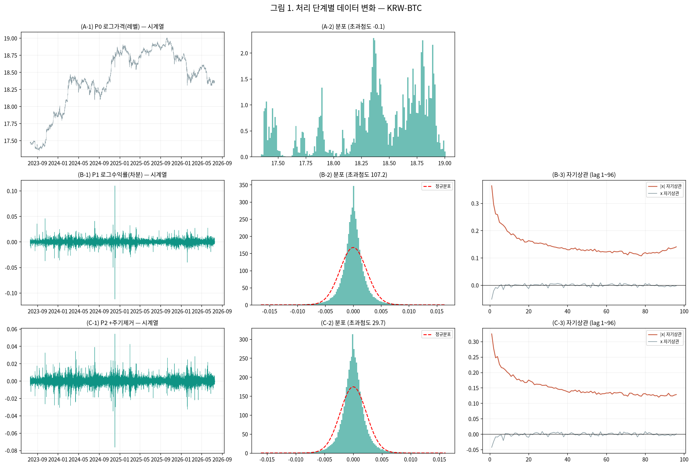

# 22번 — 변동성 예측 파이프라인: 처리마다 EDA

작성일 2026-09-08 · 브랜치 `stock` · 15분봉

> 그동안 통계 검정 수치만 뽑고 **눈으로 보는 EDA를 건너뛰었다**. 기초통계량 파악은 거시 plot에서 시작하며, **처리할 때마다 데이터가 어떻게 변하는지 매번 확인**한다.

---

### 0. 이번 회차 실제 분석 범위 ⚠

- **연구 대상(모집단)**: 상위 20종목 (아래 1절 목록)
- **이번 회차 실제 분석**: 대상 전체 20종목 ✅

## 분석 조건 (표준 헤더)

> 이 보고서만 읽어도 데이터 조건을 파악할 수 있도록, 매 회차 동일 항목을 싣는다(AGENTS.md 2.9g).

### 1. 데이터 출처·형식

- **DB / 테이블**: `data/upbit_data.db` (DuckDB) / `upbit_krw_candle`
- **봉 간격**: 15분봉 (하루 96봉)
- **원본 컬럼**: timestamp, open, high, low, close, volume, value
- **분석 종목 20개** — 이력 90,000봉(약 2.5년) 이상 종목 중 선정:
  거래대금 상위 10개 · 변동성 상위 10개

  선정 기준을 두 축으로 나눈 이유: 단일 결합 점수(변동성×거래대금)는 변동성이 지배해 신규·소형 종목만 뽑혀 시장 대표성이 약했다. **거래대금 축은 실제로 거래되는 주요 종목**을, **변동성 축은 연구 목적(변동성 예측)에 직접 부합하는 종목**을 담당한다. BTC는 저변동 대형 종목이라 두 축 모두에 들지 않지만 기준 자산으로 포함한다.

| # | 종목 | 선정 근거 | 봉 수 | 기간 | 표준편차 | 왜도 | 초과첨도 |
| ---: | :--- | :--- | ---: | :--- | ---: | ---: | ---: |
| 1 | KRW-XRP | 거래대금 상위 | 104,876 | 2023-07-19~2026-07-18 | 0.004155 | -0.3690 | 157.70 |
| 2 | KRW-BTC | 거래대금 상위 | 104,883 | 2023-07-19~2026-07-19 | 0.002386 | 0.0045 | 107.19 |
| 3 | KRW-DOGE | 거래대금 상위 | 104,863 | 2023-07-19~2026-07-18 | 0.005603 | -0.1511 | 50.63 |
| 4 | KRW-ETH | 거래대금 상위 | 104,869 | 2023-07-19~2026-07-18 | 0.003388 | -0.9237 | 482.65 |
| 5 | KRW-SOL | 거래대금 상위 | 104,879 | 2023-07-19~2026-07-19 | 0.004522 | 0.2330 | 27.32 |
| 6 | KRW-SHIB | 거래대금 상위 | 104,868 | 2023-07-19~2026-07-18 | 0.005935 | 0.2553 | 50.13 |
| 7 | KRW-SEI | 거래대금 상위 | 102,133 | 2023-08-16~2026-07-18 | 0.006708 | 1.6436 | 178.97 |
| 8 | KRW-XLM | 거래대금 상위 | 104,901 | 2023-07-18~2026-07-18 | 0.005228 | -0.0311 | 89.51 |
| 9 | KRW-SUI | 거래대금 상위 | 104,876 | 2023-07-19~2026-07-19 | 0.005934 | -0.9976 | 341.19 |
| 10 | KRW-ETC | 거래대금 상위 | 104,901 | 2023-07-18~2026-07-18 | 0.004365 | -2.3845 | 720.64 |
| 11 | KRW-BTT | 변동성 상위 | 104,207 | 2023-07-19~2026-07-19 | 0.041478 | 0.0021 | 13.29 |
| 12 | KRW-STRAX | 변동성 상위 | 102,279 | 2023-07-19~2026-07-19 | 0.007567 | 1.9133 | 92.65 |
| 13 | KRW-AQT | 변동성 상위 | 100,547 | 2023-07-18~2026-07-18 | 0.007531 | 0.6777 | 170.04 |
| 14 | KRW-BOUNTY | 변동성 상위 | 97,259 | 2023-07-19~2026-07-18 | 0.007438 | 2.1620 | 143.87 |
| 15 | KRW-ARDR | 변동성 상위 | 101,215 | 2023-07-19~2026-07-18 | 0.007407 | 1.9308 | 123.45 |
| 16 | KRW-MOC | 변동성 상위 | 97,027 | 2023-07-19~2026-07-19 | 0.007320 | 1.3894 | 261.28 |
| 17 | KRW-AERGO | 변동성 상위 | 102,358 | 2023-07-19~2026-07-18 | 0.007281 | 1.0060 | 80.34 |
| 18 | KRW-ARK | 변동성 상위 | 101,942 | 2023-07-18~2026-07-18 | 0.007251 | -0.5274 | 306.54 |
| 19 | KRW-TOKAMAK | 변동성 상위 | 99,844 | 2023-07-18~2026-07-18 | 0.007177 | 2.0427 | 225.76 |
| 20 | KRW-CBK | 변동성 상위 | 98,541 | 2023-07-18~2026-07-18 | 0.007097 | 1.7032 | 203.54 |

### 2. 수집 기간·규모·품질 (대표 종목 KRW-BTC)

- **기간**: 2023-07-19 19:00 ~ 2026-07-19 00:30
- **총 봉 수**: 104,883개 (약 2.99년)
- **연속성**: 15분이 아닌 간격 15개 (0.0143%) — 코인은 24시간 거래라 장 마감·주말 갭이 없다
- **결측**: 0개

### 3. 학습/검증 분할

- **방식**: 시간순 분할(셔플 없음) — 미래 정보 누설 방지
- **비율**: train 70% / validation 30%
- **train**: 2023-07-19 19:00 ~ 2025-08-24 09:30 (73,418봉, 약 765일)
- **validation**: 2025-08-24 09:45 ~ 2026-07-19 00:30 (31,465봉, 약 328일)
- 스케일러·모델 파라미터는 **train 구간에서만** 적합한다.

### 4. 기본 전처리 파이프라인과 가정

```
원본 close (KRW)
  → 로그 변환 log(close)        [스케일 안정화. 여전히 비정상: 단위근]
  → 1차 차분 r = Δlog(close)    [★ 여기서 정상성 확보 — 분석의 출발점]
  → (회차별 추가 처리)
  → 모델 적합
```

- **왜 차분하는가**: 로그가격은 단위근이 있어 비정상(ADF p=0.19)이고, 1차 차분하면 정상이 된다(ADF p=0.000). 정상성은 로그가 아니라 **차분**에서 온다.
- **예측 대상**: 수익률의 부호(방향)가 아니라 **크기(변동성)**. 방향은 자기상관이 0에 가까워 예측이 어렵고, 크기는 장기기억이 있어 예측 가능하다.

### 5. 기초통계량과 데이터 특성 (이전 EDA 확인 사항)

- **조건부 이분산**: ARCH-LM p=0.000 → 변동성이 시간에 따라 변한다(GARCH 계열 사용 근거)
- **장기기억**: |수익률| 자기상관이 하루(96봉) 뒤에도 0.12로 완만히 감소
- **두꺼운 꼬리**: 초과첨도 107 (정규분포는 0). 좌우 대칭(왜도 0.004)이나 양쪽 꼬리가 모두 두껍다. 4σ 초과가 정규 대비 약 100배, 6σ는 약 87만배 빈발
- **선형성 기각**: RESET·BDS 검정 p=0.000 → 선형 모델을 쓸 근거가 없다(비선형·커널 계열 필요)
- **방향 무예측성**: 수익률 자기상관 ≈ 0

### 6. 이번 회차에 적용한 변환

| 처리 | 적용 이유 |
| :--- | :--- |
| 로그 + 1차 차분 | 정상성 확보(레벨은 단위근) |
| 주기 제거(전/후 비교) | 시간대·요일 주기가 GARCH 지속성을 왜곡하고 모델이 '쉬운 부분'만 학습해 성능이 부풀 수 있어 두 조건을 비교 |

---

## E0. 원본 데이터 — 거시 흐름부터 본다

- 종목 20개 · 15분봉 · 2023-07-18 09:15:00 ~ 2026-07-19 00:45:00 · 105,020행

- 정규화 가격(각 종목 첫 관측=100) 중앙값: 고점 357.0 (2025-10-26 02:00:00) → 최종 23.0
- 종목별 최종값 범위 19.2 ~ 326.5 (중앙값 43.1) — 편차가 크다

## E1. 처리 단계별 기초통계량과 검정 — 무엇이 어떻게 바뀌는가

대표 종목 **KRW-BTC** 기준. 각 처리가 데이터를 어떻게 바꾸는지 매 단계 확인한다.

| 단계 | n | 표준편차 | 왜도 | 초과첨도 | ADF p | KPSS p | ARCH p | LB(&#124;x&#124;) p |
| :--- | ---: | ---: | ---: | ---: | ---: | ---: | ---: | ---: |
| P0 로그가격(레벨) | 104,883 | 0.434794 | -0.897 | **-0.1** | 0.8929 | 0.0100 | 0.0000 | 0.0000 |
| P1 로그수익률(차분) | 104,882 | 0.002386 | 0.004 | **107.2** | 0.0000 | 0.1000 | 0.0000 | 0.0000 |
| P2 +주기제거 | 104,882 | 0.002286 | -0.105 | **29.7** | 0.0000 | 0.1000 | 0.0000 | 0.0000 |

**읽는 법**
- ADF p<0.05 = 정상 / KPSS p>0.05 = 정상 → **P0에서 P1로 갈 때 정상성이 확보**되는지 본다.
- ARCH p<0.05 = 조건부 이분산 존재 → 변동성 모델을 쓸 근거.
- LB(|x|) p<0.05 = 변동성에 자기상관 존재(변동성 군집).

## E2. 주기 제거 효과 — 실제로 주기가 사라졌는가

| 구분 | 시간대 최대/최소 | 요일 최대/최소 |
| :--- | ---: | ---: |
| 제거 전 | **1.82배** | 1.76배 |
| 제거 후 | **1.00배** | 1.00배 |

주기 제거는 STL 같은 분해가 아니라 **시계만 보면 알 수 있는 부분을 덜어내는 것**이다. 9시는 원래 변동성이 높고 4시는 낮은데, 그대로 두면 모델이 그 '쉬운 것'만 학습해 성능이 부풀고 GARCH 지속성이 왜곡된다(19번에서 반감기 54배 왜곡 확인).




