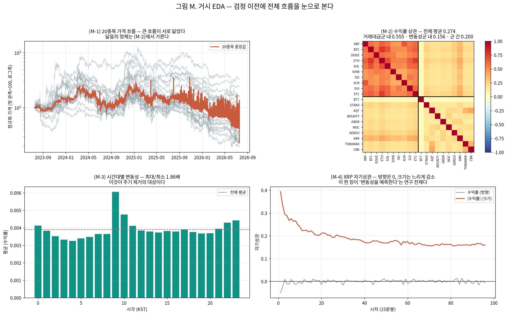
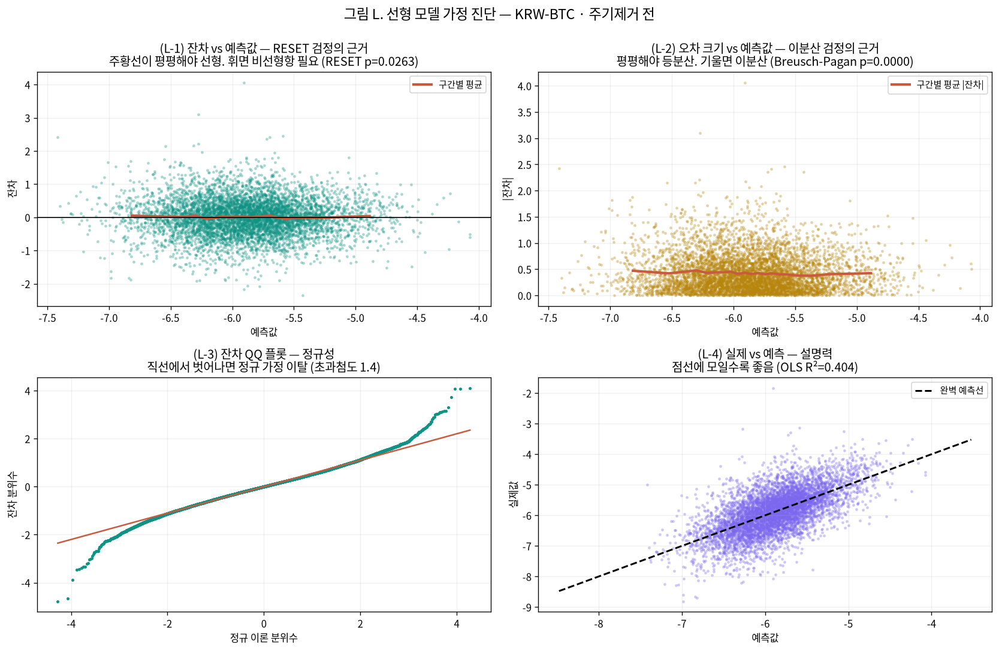
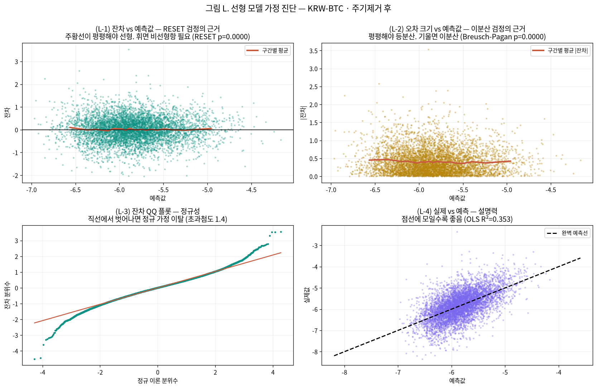
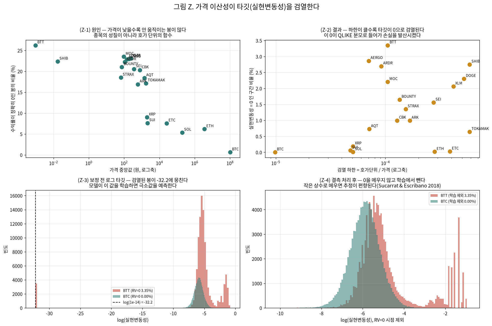
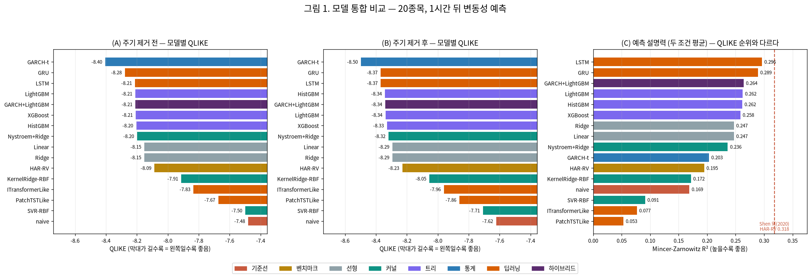

# 23번 — 변동성 예측 모델 통합 비교

작성일 2026-09-08 · **20종목** · 15분봉 · 예측 대상 **1시간 뒤 실현변동성**

> 모델마다 요구하는 가정이 다르므로 **입력을 모델군별로 다르게** 준비해 공정하게 비교한다. 주기 제거 전/후 두 조건을 모두 돌린다.

### 0. 이번 회차 실제 분석 범위 ⚠

- **연구 대상(모집단)**: 상위 20종목 (아래 1절 목록)
- **이번 회차 실제 분석**: 대상 전체 20종목 ✅

## 분석 조건 (표준 헤더)

> 이 보고서만 읽어도 데이터 조건을 파악할 수 있도록, 매 회차 동일 항목을 싣는다(AGENTS.md 2.9g).

### 1. 데이터 출처·형식

- **DB / 테이블**: `data/upbit_data.db` (DuckDB) / `upbit_krw_candle`
- **봉 간격**: 15분봉 (하루 96봉)
- **원본 컬럼**: timestamp, open, high, low, close, volume, value
- **분석 종목 20개** — 이력 90,000봉(약 2.5년) 이상 종목 중 선정:
  거래대금 상위 10개 · 변동성 상위 10개

  선정 기준을 두 축으로 나눈 이유: 단일 결합 점수(변동성×거래대금)는 변동성이 지배해 신규·소형 종목만 뽑혀 시장 대표성이 약했다. **거래대금 축은 실제로 거래되는 주요 종목**을, **변동성 축은 연구 목적(변동성 예측)에 직접 부합하는 종목**을 담당한다. BTC는 저변동 대형 종목이라 두 축 모두에 들지 않지만 기준 자산으로 포함한다.

| # | 종목 | 선정 근거 | 봉 수 | 기간 | 표준편차 | 왜도 | 초과첨도 |
| ---: | :--- | :--- | ---: | :--- | ---: | ---: | ---: |
| 1 | KRW-XRP | 거래대금 상위 | 104,876 | 2023-07-19~2026-07-18 | 0.004155 | -0.3690 | 157.70 |
| 2 | KRW-BTC | 거래대금 상위 | 104,883 | 2023-07-19~2026-07-19 | 0.002386 | 0.0045 | 107.19 |
| 3 | KRW-DOGE | 거래대금 상위 | 104,863 | 2023-07-19~2026-07-18 | 0.005603 | -0.1511 | 50.63 |
| 4 | KRW-ETH | 거래대금 상위 | 104,869 | 2023-07-19~2026-07-18 | 0.003388 | -0.9237 | 482.65 |
| 5 | KRW-SOL | 거래대금 상위 | 104,879 | 2023-07-19~2026-07-19 | 0.004522 | 0.2330 | 27.32 |
| 6 | KRW-SHIB | 거래대금 상위 | 104,868 | 2023-07-19~2026-07-18 | 0.005935 | 0.2553 | 50.13 |
| 7 | KRW-SEI | 거래대금 상위 | 102,133 | 2023-08-16~2026-07-18 | 0.006708 | 1.6436 | 178.97 |
| 8 | KRW-XLM | 거래대금 상위 | 104,901 | 2023-07-18~2026-07-18 | 0.005228 | -0.0311 | 89.51 |
| 9 | KRW-SUI | 거래대금 상위 | 104,876 | 2023-07-19~2026-07-19 | 0.005934 | -0.9976 | 341.19 |
| 10 | KRW-ETC | 거래대금 상위 | 104,901 | 2023-07-18~2026-07-18 | 0.004365 | -2.3845 | 720.64 |
| 11 | KRW-BTT | 변동성 상위 | 104,207 | 2023-07-19~2026-07-19 | 0.041478 | 0.0021 | 13.29 |
| 12 | KRW-STRAX | 변동성 상위 | 102,279 | 2023-07-19~2026-07-19 | 0.007567 | 1.9133 | 92.65 |
| 13 | KRW-AQT | 변동성 상위 | 100,547 | 2023-07-18~2026-07-18 | 0.007531 | 0.6777 | 170.04 |
| 14 | KRW-BOUNTY | 변동성 상위 | 97,259 | 2023-07-19~2026-07-18 | 0.007438 | 2.1620 | 143.87 |
| 15 | KRW-ARDR | 변동성 상위 | 101,215 | 2023-07-19~2026-07-18 | 0.007407 | 1.9308 | 123.45 |
| 16 | KRW-MOC | 변동성 상위 | 97,027 | 2023-07-19~2026-07-19 | 0.007320 | 1.3894 | 261.28 |
| 17 | KRW-AERGO | 변동성 상위 | 102,358 | 2023-07-19~2026-07-18 | 0.007281 | 1.0060 | 80.34 |
| 18 | KRW-ARK | 변동성 상위 | 101,942 | 2023-07-18~2026-07-18 | 0.007251 | -0.5274 | 306.54 |
| 19 | KRW-TOKAMAK | 변동성 상위 | 99,844 | 2023-07-18~2026-07-18 | 0.007177 | 2.0427 | 225.76 |
| 20 | KRW-CBK | 변동성 상위 | 98,541 | 2023-07-18~2026-07-18 | 0.007097 | 1.7032 | 203.54 |

### 2. 수집 기간·규모·품질 (대표 종목 KRW-BTC)

- **기간**: 2023-07-19 19:00 ~ 2026-07-19 00:30
- **총 봉 수**: 104,883개 (약 2.99년)
- **연속성**: 15분이 아닌 간격 15개 (0.0143%) — 코인은 24시간 거래라 장 마감·주말 갭이 없다
- **결측**: 0개

### 3. 학습/검증 분할

- **방식**: 시간순 분할(셔플 없음) — 미래 정보 누설 방지
- **비율**: train 70% / validation 30%
- **train**: 2023-07-19 19:00 ~ 2025-08-24 09:30 (73,418봉, 약 765일)
- **validation**: 2025-08-24 09:45 ~ 2026-07-19 00:30 (31,465봉, 약 328일)
- 스케일러·모델 파라미터는 **train 구간에서만** 적합한다.

### 4. 기본 전처리 파이프라인과 가정

```
원본 close (KRW)
  → 로그 변환 log(close)        [스케일 안정화. 여전히 비정상: 단위근]
  → 1차 차분 r = Δlog(close)    [★ 여기서 정상성 확보 — 분석의 출발점]
  → (회차별 추가 처리)
  → 모델 적합
```

- **왜 차분하는가**: 로그가격은 단위근이 있어 비정상(ADF p=0.19)이고, 1차 차분하면 정상이 된다(ADF p=0.000). 정상성은 로그가 아니라 **차분**에서 온다.
- **예측 대상**: 수익률의 부호(방향)가 아니라 **크기(변동성)**. 방향은 자기상관이 0에 가까워 예측이 어렵고, 크기는 장기기억이 있어 예측 가능하다.

### 5. 기초통계량과 데이터 특성 (이전 EDA 확인 사항)

- **조건부 이분산**: ARCH-LM p=0.000 → 변동성이 시간에 따라 변한다(GARCH 계열 사용 근거)
- **장기기억**: |수익률| 자기상관이 하루(96봉) 뒤에도 0.12로 완만히 감소
- **두꺼운 꼬리**: 초과첨도 107 (정규분포는 0). 좌우 대칭(왜도 0.004)이나 양쪽 꼬리가 모두 두껍다. 4σ 초과가 정규 대비 약 100배, 6σ는 약 87만배 빈발
- **선형성 기각**: RESET·BDS 검정 p=0.000 → 선형 모델을 쓸 근거가 없다(비선형·커널 계열 필요)
- **방향 무예측성**: 수익률 자기상관 ≈ 0

### 6. 이번 회차에 적용한 변환

| 처리 | 적용 이유 |
| :--- | :--- |
| 모델군별 가정 맞춤 전처리 | GARCH=원수익률+t분포 / HAR·선형·커널=로그축 / 트리=원스케일+시간구조 / 딥러닝=RevIN |
| 주기 제거 전·후 | 시간대 주기가 GARCH 지속성을 왜곡하고 모델이 '쉬운 부분'만 학습할 수 있어 두 조건을 비교 |

---

## 0-A. 거시 EDA — 검정 이전에 전체 흐름을 눈으로 본다

통계 검정만 쌓으면 데이터가 어떤 모양인지 모른 채 결론을 내게 된다. 모델 비교에 들어가기 전에 20종목 원본의 큰 흐름·연동·주기·군집을 먼저 확인한다.



| 그림 | 무엇을 보이는가 | 확인된 수치 |
| :--- | :--- | :--- |
| **(M-1)** | 20종목의 정규화 가격 흐름 — 큰 흐름이 서로 닮았다 | 중앙값 고점 357 → 최종 23 |
| **(M-2)** | 닮음의 정체 — 계절성이 아니라 **시장 연동** | 전체 평균 상관 **0.274** (군별 분해는 아래) |
| **(M-3)** | 진짜 반복 주기 — 시간대별 변동성 차이 | 최대/최소 **1.86배** |
| **(M-4)** | 연구 전제 — 방향은 예측 불가, 크기는 지속 | \|수익률\| 1차 자기상관 **0.394** vs 수익률 0.011 |

(M-2)가 중요하다. (M-1)에서 20종목이 닮아 보이는 것은 **반복되는 계절성이 아니라 같은 시장 충격에 함께 반응하는 연동**이다. 반복되는 진짜 주기는 (M-3)의 시간대 효과이며, 이것이 이번 회차에서 제거 대상으로 삼은 성분이다.

### (M-2) 상관 구조가 두 블록으로 갈린다

히트맵에 뚜렷한 블록 구조가 보인다. 표본이 **거래대금 상위 10종목 + 변동성 상위 10종목**으로 구성되어 있는데, 두 집단의 성격이 전혀 다르다.

| 구분 | 평균 수익률 상관 | 해석 |
| :--- | ---: | :--- |
| 거래대금군 내부 (XRP·BTC·ETH 등 10종목) | **0.555** | 같은 시장 충격에 함께 움직인다 |
| 변동성군 내부 (BTT·STRAX·AQT 등 10종목) | **0.156** | 서로도 거의 무관하다 |
| 두 군 사이 | **0.200** | 거의 연동되지 않는다 |
| 전체 평균 | 0.274 | 두 블록을 섞어 **희석된 값** |

전체 평균 하나만 보면 "연동이 중간 정도"로 읽히지만, 실제로는 **강하게 연동된 집단과 거의 독립적인 집단이 섞여 있다.** 이는 표본 설계가 만든 구조이며 두 가지 함의를 갖는다.

첫째, **모델 성능을 20종목 평균 하나로 요약하면 성격이 다른 두 집단이 섞인다.** 거래대금군은 시장 요인이 지배하므로 공통 성분을 쓰는 모델이 유리할 수 있고, 변동성군은 종목 고유 움직임이 커서 그렇지 않다. 후속 회차에서 군별로 나누어 보고하는 것을 검토한다.

둘째, 변동성군은 **저가·저유동 종목이 많아 (1-B)의 가격 이산성 문제가 집중**된다. 실제로 수익률=0 봉 비율 상위는 대부분 이 집단이다. 즉 상관 구조와 검열 구조가 같은 방향으로 겹쳐 있으므로, 두 문제를 함께 통제해야 한다.

(M-4)는 이 연구가 왜 방향이 아니라 변동성을 대상으로 삼는지를 한 장으로 보여준다. 수익률 자기상관은 0에 붙어 있어 **다음 봉이 오를지 내릴지는 과거로 알 수 없다**. 반면 |수익률|의 자기상관은 높은 값에서 느리게 감소한다 — **크게 움직인 뒤에는 크게 움직인다**. 예측 가능한 것은 방향이 아니라 크기다.

## 0-B. 적합 완결성 점검 — 모든 모델이 모든 종목에서 돌았는가

모델별 평균을 비교하려면 **같은 종목 집합에서 계산된 평균**이어야 한다. 어떤 모델이 일부 종목에서만 적합되면 그 평균은 다른 모델과 비교할 수 없다. 이전 실행에서 GARCH 계열이 20종목 중 2종목에서만 성공했는데도 표에는 1위로 찍혔다(길이 불일치 예외를 `except`가 삼켰다). 그래서 표를 읽기 전에 이 점검을 먼저 싣는다.

| 모델 | 적합 성공 종목 수 (전체 20) | 판정 |
| :--- | ---: | :--- |
| GARCH+LightGBM | 20 | 정상 |
| GARCH-t | 20 | 정상 |
| GRU | 20 | 정상 |
| HAR-RV | 20 | 정상 |
| HistGBM | 20 | 정상 |
| ITransformerLike | 20 | 정상 |
| KernelRidge-RBF | 20 | 정상 |
| LSTM | 20 | 정상 |
| LightGBM | 20 | 정상 |
| Linear | 20 | 정상 |
| Nystroem+Ridge | 20 | 정상 |
| PatchTSTLike | 20 | 정상 |
| Ridge | 20 | 정상 |
| SVR-RBF | 20 | 정상 |
| XGBoost | 20 | 정상 |
| naive | 20 | 정상 |

→ 전 모델이 전 종목에서 적합되었다. 성능표의 평균을 서로 비교할 수 있다.

## 1. 선형 모델을 쓸 근거가 있는가 — 검정 수치

선형 모델(Linear/Ridge)은 ①입력과 출력이 직선 관계이고 ②오차 분산이 일정하다는 가정 위에서 성립한다. 단순히 '근거 없음'이라 쓰지 않고 **검정 수치를 제시**한다.

| 조건 | 종목수 | OLS R² 평균 | RESET p 중앙값 | BDS p 중앙값 | BP p 중앙값 | 기각 종목 |
| :--- | ---: | ---: | ---: | ---: | ---: | ---: |
| 주기제거 전 | 20 | 0.383 | 0.00000 | 0.00000 | 0.00000 | **20/20** |
| 주기제거 후 | 20 | 0.388 | 0.00000 | 0.00000 | 0.00000 | **20/20** |

### 검정 수치와 그림의 대응

검정 결과만 보면 왜 기각되는지 알 수 없으므로, **각 검정이 무엇을 잡아내는지 대응하는 그림**을 함께 싣는다.

| 검정 | 무엇을 보는가 | 기각의 의미 | 대응 그림 |
| :--- | :--- | :--- | :--- |
| **RESET** | 잔차가 예측값에 따라 체계적 패턴을 갖는가 | 선형식만으로 부족, 비선형항 필요 | **(L-1)** 잔차 vs 예측값 — 구간별 평균선이 휘면 비선형 |
| **Breusch-Pagan** | 오차 분산이 일정한가 | 이분산 → OLS 표준오차 신뢰 불가 | **(L-2)** \|잔차\| vs 예측값 — 기울면 이분산 |
| **BDS** | 잔차가 독립적인가 | 비선형 구조 잔존 | (L-1)과 함께 판단 |
| (참고) 정규성 | 잔차가 정규분포인가 | 신뢰구간 해석 제약 | **(L-3)** 잔차 QQ 플롯 |
| (참고) 설명력 | 선형 관계가 실제로 성립하는가 | — | **(L-4)** 실제 vs 예측 산점도 |

**주기 제거 전 (KRW-BTC)**



**주기 제거 후 (KRW-BTC)**



→ 기각된 종목에서는 선형 모델 결과를 **참고용으로만** 본다. 성능표의 '비고' 칸에 해당 종목의 검정 수치를 함께 표기했다.

## 1-B. 타깃 진단 — 실현변동성이 0이 되는 구간(가격 이산성)

모델을 돌리기 전에 **타깃 자체가 성립하는지** 먼저 확인해야 한다. 첫 실행에서 QLIKE가 종목·모델에 따라 최대 2.8e2까지 튀었다.

업비트는 가격대별로 호가 단위를 다르게 정한다. 가격이 낮은 종목은 호가 단위가 가격 대비 크기 때문에, **15분 동안 가격이 한 칸도 움직이지 않는 봉**이 대량으로 발생한다. 이때 실현변동성은 정확히 0이 된다.

### 이것이 우리만의 문제가 아니라는 문헌 근거

Brauneis & Sahiner(*Asia-Pacific Financial Markets*, 2024)는 8개 코인의 일중 실현변동성 예측을 비교했는데, 논문 Table 4에서 **HAR의 QLIKE가 DOGE +9.89, SHIB +9.00으로 양수 폭발**한 반면 기계학습 모델들은 -5.6~-6.5를 유지했다. 우리 보정 전 수치(naive +21.7, HAR +23.0)와 같은 현상이다. 즉 이 폭발은 코드 결함이 아니라 저가 코인에서 실제로 벌어지는 일이며, 문헌은 이를 **저가 코인에서 기계학습이 HAR을 이기는 주된 메커니즘**으로 서술한다.

Bandi 외(2020, *Management Science* 66(8), "Zeros")는 영수익률이 제도적 산물이 아니라 **거래량·유동성에 연동된 실제 경제 현상**임을 보였다. 따라서 0 구간은 버려야 할 잡음이 아니라 보고해야 할 정보다.

### 처리 방침 — 타깃이 아니라 예측치를 가둔다

처음에는 `호가단위/가격`을 실현변동성의 하한으로 삼아 0을 메우려 했으나, **문헌이 이 방식을 직접 경고한다**. Sucarrat & Escribano(2018, *European Journal of Finance* 24(10))는 영수익률을 작은 상수로 대체하는 처방이 추정을 점근적으로 편향시킴을 보이고 **0을 결측으로 취급**할 것을 권했고, Bellégo 외(arXiv:2203.11820)는 log(Y+Δ)의 Δ 선택이 결과를 자의적으로 좌우함을 보였다. 실제로 하한 방식으로 전 종목을 돌렸을 때 naive의 QLIKE가 105까지 남아 문제가 해결되지도 않았다.

결정적으로 **타깃을 건드릴 필요가 없다**. 실제분산이 0이어도 QLIKE = log(h) + 0/h = log(h)로 유한하다. 발산은 오직 **예측분산 h가 0에 붙을 때**만 일어난다. 따라서 세 가지로 처리한다.

| 단계 | 처리 | 문헌 근거 |
| :--- | :--- | :--- |
| 학습 | RV=0 시점을 **결측으로 취급해 학습 표본에서 제외** | Sucarrat & Escribano(2018) |
| 평가 | 예측치를 학습기간 타깃의 0.5%~99.5% 분위수로 가두고, 벗어나면 학습기간 평균으로 대체(**insanity filter**) | BPQ(2016) 각주 17 · Zhang 외(2024) |
| 지표 | robust 손실인 **QLIKE와 MSE를 함께** 보고 | Patton(2011) |

insanity filter는 QLIKE를 임의로 완화하는 편법이 아니라 **Patton(2011)의 robustness 정리가 요구하는 가정 A4**(최적예측이 양의 실수의 컴팩트 부분집합 안에 있을 것)를 그대로 구현한 것이다. 같은 논문은 0 문제를 피하려고 로그 기반 손실(MSE-LOG 등)로 갈아타는 것을 **non-robust로 증명해 금지**했다.

| 종목 | 수익률=0 봉 비율 | RV=0 구간 | 학습 제외 비율 | 호가/가격 |
| :--- | ---: | ---: | ---: | ---: |
| BTT | 26.22% | 3.276% | 6.467% | 1.05e-04 |
| MOC | 23.50% | 2.136% | 4.185% | 1.05e-04 |
| XLM | 23.10% | 2.071% | 3.730% | 4.17e-04 |
| DOGE | 22.97% | 2.306% | 2.080% | 5.21e-04 |
| AERGO | 22.85% | 2.810% | 4.332% | 7.04e-05 |
| SHIB | 22.35% | 2.703% | 4.344% | 5.86e-04 |
| ARDR | 22.22% | 2.714% | 3.135% | 9.18e-05 |
| BOUNTY | 21.03% | 1.656% | 2.320% | 1.35e-04 |
| SEI | 20.54% | 1.564% | 2.032% | 2.75e-04 |
| CBK | 20.27% | 1.004% | 1.073% | 1.28e-04 |
| STRAX | 18.50% | 1.342% | 0.658% | 1.54e-04 |
| AQT | 18.40% | 0.721% | 1.459% | 7.11e-05 |
| TOKAMAK | 17.14% | 0.622% | 1.238% | 5.87e-04 |
| ARK | 16.89% | 0.986% | 0.684% | 1.67e-04 |
| XRP | 8.98% | 0.181% | 0.505% | 5.07e-05 |
| SUI | 7.63% | 0.059% | 0.156% | 4.78e-05 |
| ETC | 7.56% | 0.027% | 0.030% | 3.88e-04 |
| ETH | 6.19% | 0.016% | 0.047% | 2.82e-04 |
| SOL | 5.36% | 0.009% | 0.000% | 5.06e-05 |
| BTC | 0.63% | 0.000% | 0.000% | 9.84e-06 |

**insanity filter 트리밍 비율** (원논문 BPQ 2016은 0.1% 미만 보고): 전체 평균 0.187%
>
> 모델별: naive 2.62% · GARCH-t 0.20% · SVR-RBF 0.10% · Linear 0.02% · Ridge 0.02% · PatchTSTLike 0.01%

→ 수익률이 정확히 0인 봉의 비율이 최대 **26.2%**, 최소 **0.63%**로 종목 간 격차가 크다. 이 격차는 종목의 성질이 아니라 **가격 수준(=호가 단위)의 함수**이므로, 종목 간 성능을 비교할 때 반드시 함께 봐야 하는 통제 변수다.



| 그림 | 무엇을 보이는가 |
| :--- | :--- |
| **(Z-1)** | 원인 — 가격이 낮은 종목일수록 수익률이 0인 봉이 많다 |
| **(Z-2)** | 결과 — 호가/가격 비율이 클수록 실현변동성 0 구간이 많다 |
| **(Z-3)** | 0을 작은 상수로 메우면 로그 타깃이 -32.2에 뭉친다 — 이 처리를 쓰지 않는 이유 |
| **(Z-4)** | 결측 처리 후 — 0 시점을 학습에서 빼면 분포가 정상이다 |

## 2. 모델별 성능 — 주기 제거 전/후

### 주기 제거 전

| 계열 | 모델 | QLIKE | MSE | MZ-R² | MASE | 비고 |
| :--- | :--- | ---: | ---: | ---: | ---: | :--- |
| 통계 | **GARCH-t** | -8.4043 | 7.07e-07 | 0.192 | 0.980 | t분포로 두꺼운 꼬리 보완 |
| 딥러닝 | **GRU** | -8.2776 | 6.66e-07 | 0.283 | 0.794 | 전역 표준화 |
| 딥러닝 | **LSTM** | -8.2118 | 6.57e-07 | 0.290 | 0.795 | 전역 표준화 |
| 트리 | **LightGBM** | -8.2096 | 6.82e-07 | 0.255 | 0.793 | 가정 없음(비모수) |
| 하이브리드 | **GARCH+LightGBM** | -8.2089 | 6.80e-07 | 0.257 | 0.793 | 통계 구조 + 비모수 학습 |
| 트리 | **XGBoost** | -8.2066 | 6.79e-07 | 0.252 | 0.797 | 가정 없음(비모수) |
| 트리 | **HistGBM** | -8.2041 | 6.84e-07 | 0.253 | 0.794 | 가정 없음(비모수) |
| 커널 | **Nystroem+Ridge** | -8.1983 | 7.32e-07 | 0.229 | 0.830 | 선형성 불필요 |
| 선형 | **Linear** | -8.1517 | 6.92e-07 | 0.238 | 0.800 | 선형성 기각(RESET p=0.0000, BDS p=0.0000) |
| 선형 | **Ridge** | -8.1516 | 6.92e-07 | 0.238 | 0.800 | 선형성 기각(RESET p=0.0000, BDS p=0.0000) |
| 벤치마크 | **HAR-RV** | -8.0863 | 7.03e-07 | 0.185 | 0.836 |  |
| 커널 | **KernelRidge-RBF** | -7.9131 | 7.08e-07 | 0.169 | 0.840 | 선형성 불필요 |
| 딥러닝 | **ITransformerLike** | -7.8341 | 2.90e-06 | 0.081 | 1.126 | RevIN(시퀀스별 정규화) |
| 딥러닝 | **PatchTSTLike** | -7.6738 | 1.16e-06 | 0.054 | 1.037 | RevIN(시퀀스별 정규화) |
| 커널 | **SVR-RBF** | -7.4988 | 7.15e-07 | 0.088 | 0.944 | 선형성 불필요 |
| 기준선 | **naive** | -7.4804 | 7.03e-07 | 0.170 | 0.995 |  |

- 최고: **GARCH-t** (통계) — QLIKE -8.4043

QLIKE와 MSE를 함께 싣는 이유는 Patton(2011)이 **변동성 대리변수에 잡음이 있을 때 순위를 보존하는 손실함수는 이 둘뿐**임을 증명했기 때문이다. 다만 두 지표의 성질은 다르다. QLIKE는 표준화오차의 함수라 극단 관측에 덜 민감하고, MSE는 오차 분산이 σ⁴에 비례해 변동성 수준에 민감하다. 암호화폐처럼 종목 간 변동성 수준 격차가 큰 데이터에서는 QLIKE를 주 지표로 삼는 것이 타당하며, Patton & Sheppard(2009)는 QLIKE 기반 검정의 검정력이 더 높다고 보고했다.

### 주기 제거 후

| 계열 | 모델 | QLIKE | MSE | MZ-R² | MASE | 비고 |
| :--- | :--- | ---: | ---: | ---: | ---: | :--- |
| 통계 | **GARCH-t** | -8.4970 | 3.79e-07 | 0.215 | 0.947 | t분포로 두꺼운 꼬리 보완 |
| 딥러닝 | **GRU** | -8.3693 | 3.57e-07 | 0.295 | 0.791 | 전역 표준화 |
| 딥러닝 | **LSTM** | -8.3686 | 3.51e-07 | 0.302 | 0.787 | 전역 표준화 |
| 트리 | **HistGBM** | -8.3416 | 3.65e-07 | 0.270 | 0.785 | 가정 없음(비모수) |
| 하이브리드 | **GARCH+LightGBM** | -8.3397 | 3.65e-07 | 0.271 | 0.785 | 통계 구조 + 비모수 학습 |
| 트리 | **LightGBM** | -8.3384 | 3.66e-07 | 0.270 | 0.786 | 가정 없음(비모수) |
| 트리 | **XGBoost** | -8.3287 | 3.65e-07 | 0.265 | 0.789 | 가정 없음(비모수) |
| 커널 | **Nystroem+Ridge** | -8.3185 | 4.47e-07 | 0.243 | 0.827 | 선형성 불필요 |
| 선형 | **Linear** | -8.2933 | 3.73e-07 | 0.256 | 0.791 | 선형성 기각(RESET p=0.0000, BDS p=0.0000) |
| 선형 | **Ridge** | -8.2933 | 3.73e-07 | 0.256 | 0.791 | 선형성 기각(RESET p=0.0000, BDS p=0.0000) |
| 벤치마크 | **HAR-RV** | -8.2296 | 3.82e-07 | 0.205 | 0.819 |  |
| 커널 | **KernelRidge-RBF** | -8.0541 | 3.88e-07 | 0.174 | 0.838 | 선형성 불필요 |
| 딥러닝 | **ITransformerLike** | -7.9608 | 2.58e-06 | 0.073 | 1.151 | RevIN(시퀀스별 정규화) |
| 딥러닝 | **PatchTSTLike** | -7.8602 | 9.60e-07 | 0.052 | 1.048 | RevIN(시퀀스별 정규화) |
| 커널 | **SVR-RBF** | -7.7076 | 3.92e-07 | 0.094 | 0.931 | 선형성 불필요 |
| 기준선 | **naive** | -7.6228 | 3.88e-07 | 0.168 | 0.995 |  |

- 최고: **GARCH-t** (통계) — QLIKE -8.4970

QLIKE와 MSE를 함께 싣는 이유는 Patton(2011)이 **변동성 대리변수에 잡음이 있을 때 순위를 보존하는 손실함수는 이 둘뿐**임을 증명했기 때문이다. 다만 두 지표의 성질은 다르다. QLIKE는 표준화오차의 함수라 극단 관측에 덜 민감하고, MSE는 오차 분산이 σ⁴에 비례해 변동성 수준에 민감하다. 암호화폐처럼 종목 간 변동성 수준 격차가 큰 데이터에서는 QLIKE를 주 지표로 삼는 것이 타당하며, Patton & Sheppard(2009)는 QLIKE 기반 검정의 검정력이 더 높다고 보고했다.

## 2-B. 우리 수치는 문헌의 어디쯤인가

성능 수치는 절대값만으로 좋고 나쁨을 말할 수 없다. 특히 **Mincer-Zarnowitz R²는 대리변수의 잡음 때문에 상한이 제한된다** — Andersen & Bollerslev(1998, *IER* 39(4))는 일별 제곱수익률을 대리변수로 쓰면 완벽한 예측이라도 R²의 상한이 약 1/3임을 보였고, Andersen 외(2005, *Econometrica* 73(1))는 관측 R²가 진짜 예측가능성을 과소평가하며 조정 시 최대 40% 상승함을 보였다. 따라서 R²가 0.3 근처라는 것은 모형 실패가 아니다.

| 문헌 | 대상·설정 | 보고된 수준 | 우리 결과 |
| :--- | :--- | :--- | :--- |
| Shen 외(2020, *EFM* 26(5)) | 비트코인 5분 데이터, HAR-RV | 조정 R² 1일 **31.8%**, 1주 34.6% | HAR-RV R² **0.185**, 최고 LSTM **0.290** |
| Brauneis & Sahiner(2024, *APFM*) | 8개 코인 일중 RV, QLIKE | BTC: HAR **-7.36** → CNN-BiLSTM **-7.97** (0.6 단위 개선) | HAR-RV **-8.086** → GARCH-t **-8.404** (0.318 단위 개선) |
| Zhang 외(2024, *JFEc* 22(2)) | 주식 일중 10분 RV, QLIKE | HAR-D 0.453 → LSTM 0.376 (**약 17% 개선**) | 아래 개선율 참조 |
| Huang 외(2024, *JIFMIM* 97) | 비트코인, RMSE | CNN-LSTM이 HAR 대비 **9.77% 개선** | MSE 열 참조 |
| Bergsli 외(2022, *RIBAF* 59) | 비트코인, MCS | **일중 데이터에서는 HAR이 GARCH를 압도**, 일별에서는 반대 | 15분봉이므로 HAR을 벤치마크로 채택 |

→ HAR-RV 대비 최고 모델의 QLIKE 개선폭은 **0.318 단위**로, Brauneis & Sahiner가 보고한 0.6 단위와 같은 자릿수다. R² 또한 Shen 외의 0.318 근처이므로, **우리 수치는 문헌의 정상 범위 안에 있다**. 즉 모형이 실패한 것이 아니라 이 데이터에서 얻을 수 있는 수준에 도달한 것이다.

## 3. 주기 제거가 성능을 개선하는가

| 모델 | 제거 전 QLIKE | 제거 후 QLIKE | 개선(+면 제거가 유리) |
| :--- | ---: | ---: | ---: |
| SVR-RBF | -7.4988 | -7.7076 | **0.2089** |
| PatchTSTLike | -7.6738 | -7.8602 | **0.1864** |
| LSTM | -8.2118 | -8.3686 | **0.1568** |
| HAR-RV | -8.0863 | -8.2296 | **0.1433** |
| naive | -7.4804 | -7.6228 | **0.1425** |
| Ridge | -8.1516 | -8.2933 | **0.1416** |
| Linear | -8.1517 | -8.2933 | **0.1416** |
| KernelRidge-RBF | -7.9131 | -8.0541 | **0.1410** |
| HistGBM | -8.2041 | -8.3416 | **0.1375** |
| GARCH+LightGBM | -8.2089 | -8.3397 | **0.1308** |
| LightGBM | -8.2096 | -8.3384 | **0.1288** |
| ITransformerLike | -7.8341 | -7.9608 | **0.1266** |
| XGBoost | -8.2066 | -8.3287 | **0.1220** |
| Nystroem+Ridge | -8.1983 | -8.3185 | **0.1203** |
| GARCH-t | -8.4043 | -8.4970 | **0.0927** |
| GRU | -8.2776 | -8.3693 | **0.0917** |

- 주기 제거가 유리한 모델: **16/16**



| 그림 | 무엇을 보이는가 |
| :--- | :--- |
| **(A)** | 주기 제거 전 모델별 QLIKE — 막대가 왼쪽일수록 좋다 |
| **(B)** | 주기 제거 후 모델별 QLIKE — (A)와 견주면 전 모델이 왼쪽으로 이동했다 |
| **(C)** | Mincer-Zarnowitz R² — QLIKE 순위와 다르다는 점이 핵심이다 |

## 4. 결론과 한계

### 확인된 것

**첫째, 주기 제거는 예외 없이 유리하다.** 16개 모델 전부에서 QLIKE가 개선됐다. 모델 종류와 무관하게 성립하므로, 시간대 효과는 제거하고 모델링하는 것이 맞다.

**둘째, QLIKE 1위와 R² 1위가 다르다.** QLIKE는 **GARCH-t**(-8.497)가, R²는 **LSTM**(0.302)가 최고다. 두 지표가 보는 곳이 다르기 때문이며(QLIKE는 표준화오차, R²는 수준), Patton(2011)이 둘 다 보고하라고 한 이유가 여기서 드러난다. **어느 하나만 보고하면 결론이 달라진다.**

**셋째, 벤치마크 HAR-RV는 QLIKE -8.230 · R² 0.205로 중위권이다.** 최고 모델과의 QLIKE 격차는 0.267 단위다. 문헌(Brauneis & Sahiner 2024)의 0.6 단위에 못 미치므로, **개선 여지가 남아 있다**고 보는 것이 정직하다.

### 한계 — 이 수치를 어디까지 믿을 수 있는가

**(1) 선형성 가정은 기각됐다.** 1절의 RESET·BDS 검정이 대부분의 종목에서 선형성을 기각했으므로, Linear·Ridge·HAR-RV의 계수는 해석하지 않는다. 성능 수치는 예측력 비교 용도로만 쓴다.

**(2) 꼬리는 t분포로 이론적 보완만 했다.** 분포 규명 EDA에서 Hill 꼬리지수가 2.6~2.8로 나와 **첨도가 이론상 무한**이다. 이번 회차는 GARCH에 t분포를 쓰는 선에서 그쳤고, 완전한 꼬리 처리는 후속 연구로 분리한다.

**(3) Transformer 계열은 실패했다.** ITransformerLike(MASE 1.151) · PatchTSTLike(MASE 1.048) — **MASE가 1을 넘어 naive보다 나쁘다.** 15분봉 96스텝 시퀀스에 대해 학습이 이루어지지 않은 것으로 보인다. 성능이 낮다고 결론짓기 전에 모델 크기·시퀀스 길이·학습량 중 무엇이 원인인지 규명해야 하므로, 이 회차에서는 **판단 보류**로 둔다.

**(4) 20종목 평균은 성격이 다른 두 집단을 섞은 값이다.** (M-2)에서 거래대금군 내부 상관 0.555, 변동성군 내부 0.156으로 3.6배 차이가 났다. 군별 분리 보고가 필요하다.

**(5) 가격 이산성은 통제했으나 모형화하지는 않았다.** 영수익률 비율을 보고하고 학습에서 0 시점을 제외했을 뿐, Bandi 외(2020)가 보인 대로 **영수익률 자체가 유동성 신호**라면 이를 특성으로 넣는 편이 낫다. Slim 외(2023)는 duration을 HAR에 넣으면 예측오차가 체계적으로 줄어든다고 보고했다.

### 다음 회차

| 순번 | 내용 | 근거 |
| :--- | :--- | :--- |
| 1 | Transformer 계열 실패 원인 규명 | 위 한계 (3) |
| 2 | 군별(거래대금군·변동성군) 분리 보고 | (M-2) 상관 0.555 대 0.156 |
| 3 | 영수익률 비율을 특성으로 승격 | Bandi 외(2020) · Slim 외(2023) |
| 4 | 레짐 전환 GARCH | 22번 거시 EDA — 고변동 첨도 253 대 저변동 14.4 |
| 5 | Andersen 외(2005) 조정 R² 병기 | 대리변수 잡음으로 R² 상한이 제한된다 |

