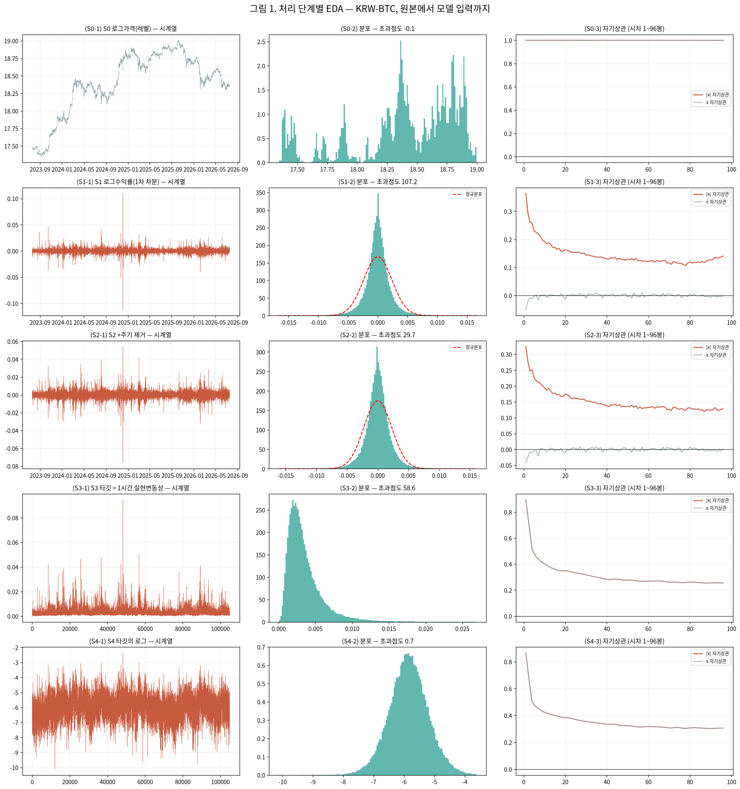
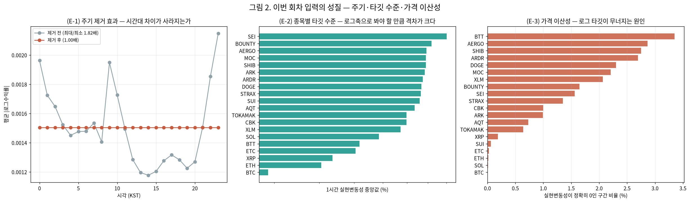
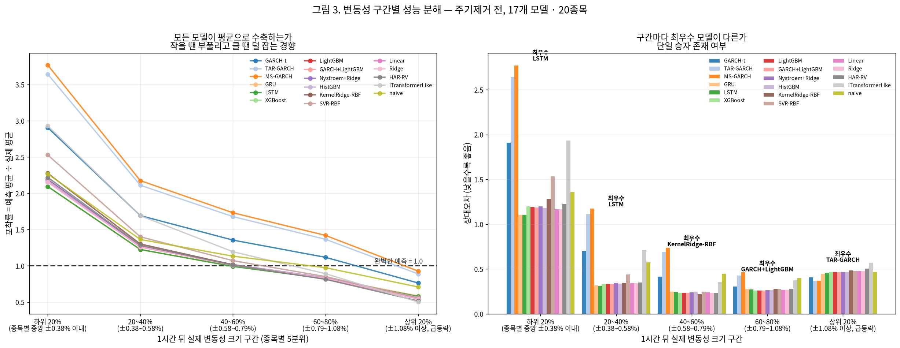
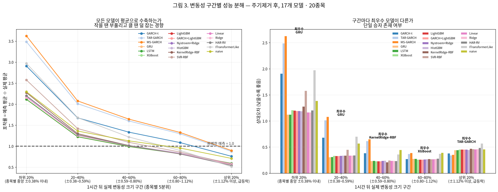
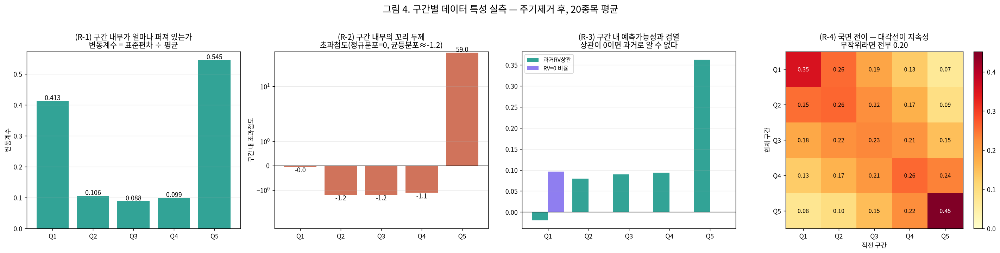

# 24번 — 변동성 예측 모델 최대 규모 재적합 (17개 모델)

작성일 2026-09-28 · **20종목** · 15분봉 · 예측 대상 **1시간 뒤 실현변동성** · 총 실행 0분

> 23번의 축소 설정(트리 300그루·딥러닝 8에폭·은닉 48)을 최대 규모로 키우고, 예비검증에 머물러 있던 레짐 전환 GARCH 2종을 본편과 같은 분할·같은 지표로 끌어올려 **17개 모델**을 한 표에서 비교한다. 규모를 키우는 만큼 조기종료와 정규화 격자탐색을 함께 넣어 과적합과 과잉 계산을 같이 막는다.

### 이번 회차에서 제외한 모델

- **PatchTSTLike** — 학습률 격자탐색+위치임베딩 후에도 검증손실 미개선(구조적 일반화 실패, 후속 과제)
- **ITransformerLike** — 20종목 전체 결과 16/17위(naive보다 열세) 확정, 학습곡선상 PatchTSTLike와 동일한 일반화 실패 패턴(정도만 덜함) 재확인 — 계산 낭비 방지 위해 제외

조용히 빼지 않고 여기 남긴다(AGENTS.md 2.9j). 원인 규명 절차: 학습률 3단 격자탐색(2e-3/5e-4/1e-4)과 패치 위치 임베딩 추가(`engine/models.py`)를 순서대로 시도했다. 진단 결과 학습손실은 15에폭에 걸쳐 0.985→0.839로 꾸준히 감소하는데 검증손실은 0.88~1.03 사이에서 개선 추세 없이 요동만 쳤다 — 그래디언트 소실이나 학습률 부족이 아니라 일반화 실패다. 같은 은닉폭(128)의 GRU·LSTM은 정상적으로 여러 에폭에 걸쳐 검증손실이 개선되므로 "모델이 커서"로는 설명되지 않는다. 위치 임베딩은 원 PatchTST 논문과 맞추는 정당한 개선이라 코드에는 남겨 두었다.

### 0. 이번 회차 실제 분석 범위 ⚠

- **연구 대상(모집단)**: 상위 20종목 (아래 1절 목록)
- **이번 회차 실제 분석**: 대상 전체 20종목 ✅

## 분석 조건 (표준 헤더)

> 이 보고서만 읽어도 데이터 조건을 파악할 수 있도록, 매 회차 동일 항목을 싣는다(AGENTS.md 2.9g).

### 1. 데이터 출처·형식

- **DB / 테이블**: `data/upbit_data.db` (DuckDB) / `upbit_krw_candle`
- **봉 간격**: 15분봉 (하루 96봉)
- **원본 컬럼**: timestamp, open, high, low, close, volume, value
- **분석 종목 20개** — 이력 90,000봉(약 2.5년) 이상 종목 중 선정:
  거래대금 상위 10개 · 변동성 상위 10개

  선정 기준을 두 축으로 나눈 이유: 단일 결합 점수(변동성×거래대금)는 변동성이 지배해 신규·소형 종목만 뽑혀 시장 대표성이 약했다. **거래대금 축은 실제로 거래되는 주요 종목**을, **변동성 축은 연구 목적(변동성 예측)에 직접 부합하는 종목**을 담당한다. BTC는 저변동 대형 종목이라 두 축 모두에 들지 않지만 기준 자산으로 포함한다.

| # | 종목 | 선정 근거 | 봉 수 | 기간 | 표준편차 | 왜도 | 초과첨도 |
| ---: | :--- | :--- | ---: | :--- | ---: | ---: | ---: |
| 1 | KRW-AERGO | 변동성 상위 | 102,358 | 2023-07-19~2026-07-18 | 0.007281 | 1.0060 | 80.34 |
| 2 | KRW-AQT | 변동성 상위 | 100,547 | 2023-07-18~2026-07-18 | 0.007531 | 0.6777 | 170.04 |
| 3 | KRW-ARDR | 변동성 상위 | 101,215 | 2023-07-19~2026-07-18 | 0.007407 | 1.9308 | 123.45 |
| 4 | KRW-ARK | 변동성 상위 | 101,942 | 2023-07-18~2026-07-18 | 0.007251 | -0.5274 | 306.54 |
| 5 | KRW-BOUNTY | 변동성 상위 | 97,259 | 2023-07-19~2026-07-18 | 0.007438 | 2.1620 | 143.87 |
| 6 | KRW-BTC | 거래대금 상위 | 104,883 | 2023-07-19~2026-07-19 | 0.002386 | 0.0045 | 107.19 |
| 7 | KRW-BTT | 변동성 상위 | 104,207 | 2023-07-19~2026-07-19 | 0.041478 | 0.0021 | 13.29 |
| 8 | KRW-CBK | 변동성 상위 | 98,541 | 2023-07-18~2026-07-18 | 0.007097 | 1.7032 | 203.54 |
| 9 | KRW-DOGE | 거래대금 상위 | 104,863 | 2023-07-19~2026-07-18 | 0.005603 | -0.1511 | 50.63 |
| 10 | KRW-ETC | 거래대금 상위 | 104,901 | 2023-07-18~2026-07-18 | 0.004365 | -2.3845 | 720.64 |
| 11 | KRW-ETH | 거래대금 상위 | 104,869 | 2023-07-19~2026-07-18 | 0.003388 | -0.9237 | 482.65 |
| 12 | KRW-MOC | 변동성 상위 | 97,027 | 2023-07-19~2026-07-19 | 0.007320 | 1.3894 | 261.28 |
| 13 | KRW-SEI | 거래대금 상위 | 102,133 | 2023-08-16~2026-07-18 | 0.006708 | 1.6436 | 178.97 |
| 14 | KRW-SHIB | 거래대금 상위 | 104,868 | 2023-07-19~2026-07-18 | 0.005935 | 0.2553 | 50.13 |
| 15 | KRW-SOL | 거래대금 상위 | 104,879 | 2023-07-19~2026-07-19 | 0.004522 | 0.2330 | 27.32 |
| 16 | KRW-STRAX | 변동성 상위 | 102,279 | 2023-07-19~2026-07-19 | 0.007567 | 1.9133 | 92.65 |
| 17 | KRW-SUI | 거래대금 상위 | 104,876 | 2023-07-19~2026-07-19 | 0.005934 | -0.9976 | 341.19 |
| 18 | KRW-TOKAMAK | 변동성 상위 | 99,844 | 2023-07-18~2026-07-18 | 0.007177 | 2.0427 | 225.76 |
| 19 | KRW-XLM | 거래대금 상위 | 104,901 | 2023-07-18~2026-07-18 | 0.005228 | -0.0311 | 89.51 |
| 20 | KRW-XRP | 거래대금 상위 | 104,876 | 2023-07-19~2026-07-18 | 0.004155 | -0.3690 | 157.70 |

### 2. 수집 기간·규모·품질 (대표 종목 KRW-BTC)

- **기간**: 2023-07-19 19:00 ~ 2026-07-19 00:30
- **총 봉 수**: 104,883개 (약 2.99년)
- **연속성**: 15분이 아닌 간격 15개 (0.0143%) — 코인은 24시간 거래라 장 마감·주말 갭이 없다
- **결측**: 0개

### 3. 학습/검증 분할

- **방식**: 시간순 분할(셔플 없음) — 미래 정보 누설 방지
- **비율**: train 70% / validation 30%
- **train**: 2023-07-19 19:00 ~ 2025-08-24 09:30 (73,418봉, 약 765일)
- **validation**: 2025-08-24 09:45 ~ 2026-07-19 00:30 (31,465봉, 약 328일)
- 스케일러·모델 파라미터는 **train 구간에서만** 적합한다.

### 4. 기본 전처리 파이프라인과 가정

```
원본 close (KRW)
  → 로그 변환 log(close)        [스케일 안정화. 여전히 비정상: 단위근]
  → 1차 차분 r = Δlog(close)    [★ 여기서 정상성 확보 — 분석의 출발점]
  → (회차별 추가 처리)
  → 모델 적합
```

- **왜 차분하는가**: 로그가격은 단위근이 있어 비정상(ADF p=0.19)이고, 1차 차분하면 정상이 된다(ADF p=0.000). 정상성은 로그가 아니라 **차분**에서 온다.
- **예측 대상**: 수익률의 부호(방향)가 아니라 **크기(변동성)**. 방향은 자기상관이 0에 가까워 예측이 어렵고, 크기는 장기기억이 있어 예측 가능하다.

### 5. 기초통계량과 데이터 특성 (이전 EDA 확인 사항)

- **조건부 이분산**: ARCH-LM p=0.000 → 변동성이 시간에 따라 변한다(GARCH 계열 사용 근거)
- **장기기억**: |수익률| 자기상관이 하루(96봉) 뒤에도 0.12로 완만히 감소
- **두꺼운 꼬리**: 초과첨도 107 (정규분포는 0). 좌우 대칭(왜도 0.004)이나 양쪽 꼬리가 모두 두껍다. 4σ 초과가 정규 대비 약 100배, 6σ는 약 87만배 빈발
- **선형성 기각**: RESET·BDS 검정 p=0.000 → 선형 모델을 쓸 근거가 없다(비선형·커널 계열 필요)
- **방향 무예측성**: 수익률 자기상관 ≈ 0

### 6. 이번 회차에 적용한 변환

| 처리 | 적용 이유 |
| :--- | :--- |
| 모델군별 가정 맞춤 전처리 | GARCH 계열=원 수익률+t분포 / HAR·선형·커널=로그축 / 트리=원 스케일+시간구조 / 딥러닝=시퀀스(RevIN 또는 전역 표준화) |
| 학습 구간 재분할 | 학습 구간을 내부학습 85% / 내부검증 15%로 시간순 분할해 조기종료와 정규화 상수 선택에 쓴다(GARCH 계열은 조정 대상이 없어 학습 구간 전체 사용) |
| 주기 제거 전·후 | 시간대 주기가 GARCH 지속성을 왜곡하고 모델이 쉬운 성분만 학습할 수 있어 두 조건을 모두 돌린다 |

---

## 1. 처리 단계별 EDA — 이 회차가 실제로 밟는 순서 그대로

대표 종목 **KRW-BTC** 기준이다. 성능표에 앞서, 모델이 보게 될 데이터가 각 처리에서 어떻게 바뀌는지를 먼저 수치로 고정한다.

| 단계 | n | 표준편차 | 왜도 | 초과첨도 | ADF p | KPSS p | ARCH p | LB(&#124;x&#124;) p |
| :--- | ---: | ---: | ---: | ---: | ---: | ---: | ---: | ---: |
| S0 로그가격(레벨) | 104,883 | 0.434794 | -0.897 | **-0.1** | 0.8929 | 0.0100 | 0.0000 | 0.0000 |
| S1 로그수익률(1차 차분) | 104,882 | 0.002386 | 0.004 | **107.2** | 0.0000 | 0.1000 | 0.0000 | 0.0000 |
| S2 +주기 제거 | 104,882 | 0.002286 | -0.105 | **29.7** | 0.0000 | 0.1000 | 0.0000 | 0.0000 |
| S3 타깃 = 1시간 실현변동성 | 104,878 | 0.002835 | 4.487 | **58.6** | 0.0000 | 0.0100 | 0.0000 | 0.0000 |
| S4 타깃의 로그 | 104,878 | 0.653954 | -0.031 | **0.7** | 0.0000 | 0.0100 | 0.0000 | 0.0000 |

**읽는 법** — ADF p<0.05면 정상, KPSS p>0.05면 정상이다. 두 검정은 귀무가설이 서로 반대라서 함께 봐야 한다. ARCH p<0.05는 조건부 이분산이 있다는 뜻이고, 이것이 변동성 모델을 쓸 근거다. LB(|x|) p<0.05는 변동성 자기상관(군집)이 있다는 뜻이며, 이것이 우리가 예측하려는 대상 그 자체다.

S3에서 S4로 로그를 취하는 이유는 실현변동성이 강하게 우편향이기 때문이다. 다만 **GARCH 계열은 이 로그 타깃을 쓰지 않고 원 수익률을 직접 쓴다** — 23번에서 저가 코인의 실현변동성 0 구간이 로그 타깃에서 -32.2가 되어 로그축 모델만 선택적으로 무너졌던 사고가 여기서 갈린다.



### 주기 제거와 타깃의 성질



- **(E-1)** KRW-BTC의 시간대별 평균 |수익률| 최대/최소 비가 제거 전 **1.82배**에서 제거 후 **1.00배**로 줄었다. 시계만 보고도 알 수 있는 부분을 덜어낸 것이며, 이것을 남겨 두면 모델이 그 쉬운 성분만 학습해 성능이 부풀고 GARCH 지속성이 왜곡된다.
- **(E-2)** 종목별 타깃 중앙값이 0.00288에서 0.00901까지 **3.1배** 차이 난다. 종목을 뭉쳐 하나의 절대 오차로 비교하면 변동성이 큰 종목이 표를 지배하므로, 척도에 자유로운 QLIKE와 MASE를 주 지표로 쓴다.
- **(E-3)** 실현변동성이 정확히 0인 구간이 최대 **3.4%**(BTT)에 이른다. 이 구간은 관측 실패가 아니라 호가 단위 때문에 실제로 가격이 한 칸도 안 움직인 것이며, 학습에서는 결측으로 빼고 검증에서는 그대로 둔다.

## 2. 적합 완결성 점검 — 모든 모델이 모든 종목에서 돌았는가

모델별 평균을 비교하려면 **같은 종목 집합에서 계산된 평균**이어야 한다. 23번 이전 실행에서 `except: pass`가 예외를 삼켜 20종목 중 2종목에서만 적합된 GARCH가 1위로 찍힌 적이 있다. 그래서 성능표를 읽기 전에 이 점검을 먼저 싣는다.

| 모델 | 적합 성공 종목 수 (전체 20) | 결과 행 수 (기대 40) | 판정 |
| :--- | ---: | ---: | :--- |
| GARCH+LightGBM | 20 | 40 | 정상 |
| GARCH-t | 20 | 40 | 정상 |
| GRU | 20 | 40 | 정상 |
| HAR-RV | 20 | 40 | 정상 |
| HistGBM | 20 | 40 | 정상 |
| ITransformerLike | 20 | 40 | 정상 |
| KernelRidge-RBF | 20 | 40 | 정상 |
| LSTM | 20 | 40 | 정상 |
| LightGBM | 20 | 40 | 정상 |
| Linear | 20 | 40 | 정상 |
| MS-GARCH | 20 | 40 | 정상 |
| Nystroem+Ridge | 20 | 40 | 정상 |
| Ridge | 20 | 40 | 정상 |
| SVR-RBF | 20 | 40 | 정상 |
| TAR-GARCH | 20 | 40 | 정상 |
| XGBoost | 20 | 40 | 정상 |
| naive | 20 | 40 | 정상 |

- 결과 행 수 **680** (기대 종목 20 × 조건 2 × 모델 17 = 680)
- 적합 실패 **0건**. 전 모델이 전 종목·전 조건에서 적합되었다.

## 3. 실제로 쓰인 규모 — 상한과 조기종료 지점

"최대 규모"는 상한을 걸어 둔 것이지 그 값을 다 쓴다는 뜻이 아니다. 조기종료가 어디서 걸렸는지를 함께 보아야 **규모가 부족했는지 충분했는지** 판단할 수 있다.

| 항목 | 상한 | 실제 사용(중앙값) | 상한에 닿은 셀 |
| :--- | ---: | ---: | ---: |
| LightGBM 그루 수 | 4,000 | 146 | 0/40 |
| XGBoost 그루 수 | 4,000 | 140 | 0/40 |
| HistGBM 반복 수 | 4,000 | 200 | 0/40 |
| GRU 에폭 | 60 | 23 | 0/40 |
| LSTM 에폭 | 60 | 25 | 0/40 |
| ITransformerLike 에폭 | 60 | 5 | 0/40 |

- 딥러닝 은닉 폭 **128**(AGENTS.md 4.3 "Shallow but Wide" 권장 64~128의 상단), 시퀀스 길이 RNN **96봉** · Transformer **192봉**, 배치 **2048**(OOM 시 절반으로 자동 축소), AdamW + 코사인 스케줄 + bf16 혼합정밀도, 학습률은 {0.002, 0.0005, 0.0001} 중 내부검증 손실로 선택.

| 딥러닝 모델 | 선택된 학습률(최빈값) | 조기종료 에폭(중앙값) |
| :--- | ---: | ---: |
| GRU | 0.002 | 23 |
| ITransformerLike | 0.0005 | 5 |
| LSTM | 0.002 | 25 |
- 커널 릿지 학습 표본 상한 **14,188개** — 가용 메모리 예산 1.5GB에서 n×n 행렬 크기로 역산한 값이다. SVR은 libsvm의 계산 복잡도 때문에 **8,000개**로 따로 낮췄다.
- MS-GARCH 재시작 3회 × 반복 1,400 · TAR-GARCH 재시작 2회 × 반복 600 × 문턱값 후보 4개.

정규화 상수는 내부검증 QLIKE로 셀마다 따로 골랐다. 선택된 값의 분포는 `chosen_hyperparams.csv`에 있다.

## 4. 전체 성능 — 17개 모델

QLIKE가 주 지표다. Patton(2011)이 변동성 대리변수에 잡음이 있을 때 순위를 보존하는 손실함수가 QLIKE와 MSE뿐임을 증명했고, 그중 QLIKE가 종목 간 변동성 수준 격차에 덜 민감하다. MASE는 1보다 작아야 naive(직전 h구간 실현변동성)보다 낫다는 뜻이다.

### 주기 제거 전 (20종목 평균)

| 순위 | 계열 | 모델 | QLIKE | MSE | MZ-R² | MASE | 트리밍 |
| ---: | :--- | :--- | ---: | ---: | ---: | ---: | ---: |
| 1 | 통계 | **GARCH-t** | -8.4043 | 0.0000007071 | 0.1918 | 0.980 | 0.0021 |
| 2 | 통계 | **TAR-GARCH** | -8.3854 | 0.0000007087 | 0.1874 | 1.258 | 0.0023 |
| 3 | 통계 | **MS-GARCH** | -8.3782 | 0.0000007113 | 0.1972 | 1.320 | 0.0024 |
| 4 | 딥러닝 | **GRU** | -8.2756 | 0.0000006585 | 0.3071 | 0.773 | 0.0001 |
| 5 | 딥러닝 | **LSTM** | -8.2583 | 0.0000006573 | 0.3072 | 0.775 | 0.0001 |
| 6 | 트리 | **XGBoost** | -8.2208 | 0.0000006847 | 0.2582 | 0.792 | 0.0000 |
| 7 | 하이브리드 | **GARCH+LightGBM** | -8.2204 | 0.0000006842 | 0.2604 | 0.790 | 0.0000 |
| 8 | 트리 | **LightGBM** | -8.2189 | 0.0000006859 | 0.2592 | 0.791 | 0.0000 |
| 9 | 커널 | **Nystroem+Ridge** | -8.2079 | 0.0000006999 | 0.2414 | 0.798 | 0.0000 |
| 10 | 트리 | **HistGBM** | -8.2001 | 0.0000006849 | 0.2534 | 0.794 | 0.0000 |
| 11 | 커널 | **KernelRidge-RBF** | -8.1882 | 0.0000006918 | 0.2323 | 0.819 | 0.0000 |
| 12 | 커널 | **SVR-RBF** | -8.1788 | 0.0000006913 | 0.1733 | 0.875 | 0.0002 |
| 13 | 선형 | **Linear** | -8.1605 | 0.0000006931 | 0.2368 | 0.801 | 0.0002 |
| 14 | 선형 | **Ridge** | -8.1599 | 0.0000006936 | 0.2365 | 0.801 | 0.0002 |
| 15 | 벤치마크 | **HAR-RV** | -8.0954 | 0.0000007020 | 0.1848 | 0.837 | 0.0000 |
| 16 | 딥러닝 | **ITransformerLike** | -7.8363 | 0.0000027359 | 0.0995 | 1.162 | 0.0000 |
| 17 | 기준선 | **naive** | -7.4804 | 0.0000007034 | 0.1701 | 0.995 | 0.0260 |

### 주기 제거 후 (20종목 평균)

| 순위 | 계열 | 모델 | QLIKE | MSE | MZ-R² | MASE | 트리밍 |
| ---: | :--- | :--- | ---: | ---: | ---: | ---: | ---: |
| 1 | 통계 | **GARCH-t** | -8.4970 | 0.0000003790 | 0.2147 | 0.947 | 0.0019 |
| 2 | 통계 | **TAR-GARCH** | -8.4547 | 0.0000003841 | 0.2086 | 1.175 | 0.0023 |
| 3 | 통계 | **MS-GARCH** | -8.4168 | 0.0000003876 | 0.2071 | 1.237 | 0.0521 |
| 4 | 딥러닝 | **GRU** | -8.3816 | 0.0000003530 | 0.3152 | 0.769 | 0.0002 |
| 5 | 딥러닝 | **LSTM** | -8.3759 | 0.0000003554 | 0.3137 | 0.771 | 0.0002 |
| 6 | 트리 | **XGBoost** | -8.3478 | 0.0000003686 | 0.2734 | 0.784 | 0.0000 |
| 7 | 트리 | **LightGBM** | -8.3454 | 0.0000003686 | 0.2764 | 0.783 | 0.0000 |
| 8 | 하이브리드 | **GARCH+LightGBM** | -8.3422 | 0.0000003685 | 0.2759 | 0.783 | 0.0000 |
| 9 | 트리 | **HistGBM** | -8.3343 | 0.0000003662 | 0.2700 | 0.787 | 0.0000 |
| 10 | 커널 | **Nystroem+Ridge** | -8.3294 | 0.0000003789 | 0.2590 | 0.789 | 0.0000 |
| 11 | 커널 | **KernelRidge-RBF** | -8.3256 | 0.0000003732 | 0.2529 | 0.808 | 0.0001 |
| 12 | 커널 | **SVR-RBF** | -8.3161 | 0.0000003714 | 0.1804 | 0.876 | 0.0002 |
| 13 | 선형 | **Linear** | -8.2997 | 0.0000003728 | 0.2563 | 0.792 | 0.0001 |
| 14 | 선형 | **Ridge** | -8.2993 | 0.0000003729 | 0.2563 | 0.792 | 0.0001 |
| 15 | 벤치마크 | **HAR-RV** | -8.2343 | 0.0000003820 | 0.2043 | 0.819 | 0.0000 |
| 16 | 딥러닝 | **ITransformerLike** | -7.9853 | 0.0000032664 | 0.0961 | 1.173 | 0.0001 |
| 17 | 기준선 | **naive** | -7.6228 | 0.0000003880 | 0.1676 | 0.995 | 0.0264 |

## 5. 구간별 성능 분해 — 단일 승자가 있는가

전체 평균 한 줄로는 "어떤 상황에서 잘 맞는가"를 알 수 없다. 검증 표본을 실제 변동성 크기로 5등분해 구간마다 따로 본다.

### 구간 경계를 어떻게 잡았는가 — 기존 기록의 정정

`process.md`에는 본편(포스터 그림 2)이 **고정 절대구간 풀링**을 썼고 레짐 전환 예비검증은 **종목별 5분위**를 써서 두 결과를 나란히 놓을 수 없다고 적혀 있었다. 이번에 두 방식을 모두 계산해 본편 산출물(`23_model_comparison_20260908/poster/regime.csv`)과 직접 대조한 결과 **그 기술이 사실과 다르다**. 본편도 종목별 5분위였다.

| naive 모델 · KRW-BTC · 주기제거 후 | Q1 | Q2 | Q3 | Q4 | Q5 |
| :--- | ---: | ---: | ---: | ---: | ---: |
| 본편 산출물(`poster/regime.csv`) | 1.877 | 1.335 | 1.155 | 0.952 | 0.710 |
| **종목별 5분위로 재계산** | **1.88** | **1.34** | **1.15** | **0.95** | **0.71** |
| 풀링 절대경계로 재계산 | 1.57 | 1.12 | 0.88 | 0.74 | 0.54 |

따라서 예비검증의 레짐 전환 결과는 애초부터 본편과 같은 방식으로 계산되고 있었고, "계산 방식이 달라 비교 불가"라는 제약은 존재하지 않았다. 다만 이번 회차는 두 모델을 **같은 실행·같은 분할·같은 하이퍼파라미터 규모**로 다시 돌렸으므로 그 점에서 정식 통합의 의미는 그대로다.

방법 자체로도 종목별 5분위가 맞다. 절대 경계를 모든 종목에 공유하면 가장 낮은 구간에 **실현변동성이 정확히 0인 검열 관측**이 몰려 실제 평균이 0에 붙고 포착률이 발산한다(실측: DOGE 주기제거 후 Q1에서 1,892배). 종목 간 변동성 수준이 수십 배 차이 나는 표본에서는 저변동 종목의 Q5와 고변동 종목의 Q1이 거의 비어 종목 간 평균 자체가 성립하지 않는다.

### 주기 제거 전

구간은 종목마다 그 종목의 검증 표본 5분위로 가른다. 아래 경계는 종목별 경계의 중앙값이다(1시간 실현변동성): Q1 | 0.378% | Q2 | 0.584% | Q3 | 0.785% | Q4 | 1.084% | Q5



| 모델 | Q1 | Q2 | Q3 | Q4 | Q5 |
| :--- | ---: | ---: | ---: | ---: | ---: |
| GARCH-t | -9.916 | -9.460 | -8.974 | -8.348 | -5.327 |
| TAR-GARCH | -9.534 | -9.177 | -8.794 | -8.322 | -6.102 |
| MS-GARCH | -9.470 | -9.134 | -8.764 | -8.301 | -6.225 |
| GRU | -10.402 | -9.697 | -8.985 | -8.100 | -4.198 |
| LSTM | -10.399 | -9.702 | -8.992 | -8.095 | -4.108 |
| XGBoost | -10.335 | -9.694 | -9.020 | -8.163 | -3.895 |
| LightGBM | -10.340 | -9.695 | -9.018 | -8.160 | -3.885 |
| GARCH+LightGBM | -10.343 | -9.693 | -9.014 | -8.158 | -3.898 |
| Nystroem+Ridge | -10.336 | -9.683 | -9.007 | -8.147 | -3.870 |
| HistGBM | -10.348 | -9.687 | -8.999 | -8.137 | -3.834 |
| KernelRidge-RBF | -10.276 | -9.693 | -9.052 | -8.165 | -3.759 |
| SVR-RBF | -10.127 | -9.632 | -9.041 | -8.190 | -3.908 |
| Linear | -10.358 | -9.678 | -8.993 | -8.116 | -3.662 |
| Ridge | -10.358 | -9.678 | -8.993 | -8.116 | -3.659 |
| HAR-RV | -10.317 | -9.684 | -9.021 | -8.132 | -3.328 |
| ITransformerLike | -10.005 | -9.564 | -9.037 | -8.113 | -2.468 |
| naive | -10.243 | -9.254 | -8.363 | -7.363 | -2.184 |

→ 구간별 QLIKE 최우수: **Q1=GRU**, **Q2=LSTM**, **Q3=KernelRidge-RBF**, **Q4=GARCH-t**, **Q5=MS-GARCH** — 서로 다른 모델 **5종**이 구간을 나눠 가진다. 전체 평균 1위 하나로 모델을 고르면 다른 구간에서 더 나은 모델을 버리게 된다. **왜 이렇게 갈리는지는 §6에서 구간별 데이터 특성 실측으로 설명한다.**

### 주기 제거 후

구간은 종목마다 그 종목의 검증 표본 5분위로 가른다. 아래 경계는 종목별 경계의 중앙값이다(1시간 실현변동성): Q1 | 0.383% | Q2 | 0.594% | Q3 | 0.800% | Q4 | 1.120% | Q5



| 모델 | Q1 | Q2 | Q3 | Q4 | Q5 |
| :--- | ---: | ---: | ---: | ---: | ---: |
| GARCH-t | -9.834 | -9.431 | -8.971 | -8.360 | -5.889 |
| TAR-GARCH | -9.536 | -9.200 | -8.820 | -8.338 | -6.380 |
| MS-GARCH | -9.456 | -9.154 | -8.798 | -8.330 | -6.346 |
| GRU | -10.317 | -9.670 | -8.981 | -8.088 | -4.853 |
| LSTM | -10.316 | -9.667 | -8.979 | -8.087 | -4.831 |
| XGBoost | -10.259 | -9.657 | -9.005 | -8.149 | -4.669 |
| LightGBM | -10.263 | -9.659 | -9.006 | -8.148 | -4.652 |
| GARCH+LightGBM | -10.268 | -9.657 | -9.001 | -8.142 | -4.644 |
| Nystroem+Ridge | -10.271 | -9.651 | -8.988 | -8.124 | -4.614 |
| HistGBM | -10.273 | -9.649 | -8.983 | -8.118 | -4.649 |
| KernelRidge-RBF | -10.204 | -9.658 | -9.040 | -8.162 | -4.565 |
| SVR-RBF | -10.029 | -9.584 | -9.028 | -8.208 | -4.732 |
| Linear | -10.287 | -9.646 | -8.981 | -8.103 | -4.483 |
| Ridge | -10.288 | -9.646 | -8.981 | -8.102 | -4.480 |
| HAR-RV | -10.261 | -9.650 | -9.001 | -8.117 | -4.144 |
| ITransformerLike | -9.928 | -9.531 | -9.025 | -8.133 | -3.310 |
| naive | -10.163 | -9.238 | -8.357 | -7.309 | -3.048 |

→ 구간별 QLIKE 최우수: **Q1=GRU**, **Q2=GRU**, **Q3=KernelRidge-RBF**, **Q4=GARCH-t**, **Q5=TAR-GARCH** — 서로 다른 모델 **4종**이 구간을 나눠 가진다. 전체 평균 1위 하나로 모델을 고르면 다른 구간에서 더 나은 모델을 버리게 된다. **왜 이렇게 갈리는지는 §6에서 구간별 데이터 특성 실측으로 설명한다.**

### (보조) 절대 변동성 수준으로 가른 경우

"같은 절대 변동성 수준에서 어느 모델이 나은가"는 위와 다른 질문이다. 20종목 검증 표본을 전부 모아 5분위 절대 경계를 잡고 모든 종목에 같은 경계를 적용한 결과를 QLIKE만 싣는다 — 포착률·상대오차는 최저 구간에 검열된 0이 몰려 정의되지 않는다. 이 표에서는 종목마다 구간별 표본 수가 크게 달라지므로(저변동 종목은 상위 구간이 거의 비고 고변동 종목은 하위 구간이 거의 빈다) 종목 간 평균을 **모델 순위 참고용으로만** 본다.

**주기 제거 전** — 절대 경계 0.331% | 0.512% | 0.727% | 1.070%

| 모델 | Q1 | Q2 | Q3 | Q4 | Q5 |
| :--- | ---: | ---: | ---: | ---: | ---: |
| GARCH-t | -9.886 | -9.449 | -8.896 | -8.118 | -4.766 |
| TAR-GARCH | -9.500 | -9.171 | -8.732 | -8.145 | -5.646 |
| MS-GARCH | -9.432 | -9.124 | -8.709 | -8.145 | -5.849 |
| GRU | -10.388 | -9.712 | -8.901 | -7.773 | -3.224 |
| LSTM | -10.384 | -9.710 | -8.904 | -7.770 | -3.117 |
| XGBoost | -10.321 | -9.696 | -8.923 | -7.819 | -2.854 |
| LightGBM | -10.325 | -9.698 | -8.920 | -7.817 | -2.850 |
| GARCH+LightGBM | -10.330 | -9.698 | -8.920 | -7.814 | -2.856 |
| Nystroem+Ridge | -10.321 | -9.682 | -8.897 | -7.774 | -2.776 |
| HistGBM | -10.334 | -9.693 | -8.902 | -7.791 | -2.785 |
| KernelRidge-RBF | -10.272 | -9.685 | -8.962 | -7.864 | -2.786 |
| SVR-RBF | -10.113 | -9.608 | -8.943 | -7.886 | -2.982 |
| Linear | -10.345 | -9.676 | -8.881 | -7.756 | -2.530 |
| Ridge | -10.346 | -9.676 | -8.881 | -7.756 | -2.528 |
| HAR-RV | -10.310 | -9.673 | -8.882 | -7.720 | -1.958 |
| ITransformerLike | -10.016 | -9.545 | -8.912 | -7.765 | -1.341 |
| naive | -10.225 | -9.272 | -8.217 | -6.832 | -1.146 |
| (구간별 관측 수) | 30,565 | 30,565 | 30,565 | 30,565 | 30,566 |

**주기 제거 후** — 절대 경계 0.338% | 0.517% | 0.734% | 1.085%

| 모델 | Q1 | Q2 | Q3 | Q4 | Q5 |
| :--- | ---: | ---: | ---: | ---: | ---: |
| GARCH-t | -9.823 | -9.444 | -8.913 | -8.162 | -5.323 |
| TAR-GARCH | -9.512 | -9.206 | -8.765 | -8.162 | -5.906 |
| MS-GARCH | -9.432 | -9.157 | -8.745 | -8.172 | -5.970 |
| GRU | -10.314 | -9.687 | -8.884 | -7.792 | -3.904 |
| LSTM | -10.313 | -9.687 | -8.886 | -7.794 | -3.879 |
| XGBoost | -10.254 | -9.670 | -8.905 | -7.849 | -3.628 |
| LightGBM | -10.258 | -9.672 | -8.905 | -7.847 | -3.599 |
| GARCH+LightGBM | -10.262 | -9.672 | -8.901 | -7.839 | -3.594 |
| Nystroem+Ridge | -10.265 | -9.664 | -8.882 | -7.812 | -3.532 |
| HistGBM | -10.266 | -9.667 | -8.884 | -7.819 | -3.622 |
| KernelRidge-RBF | -10.211 | -9.666 | -8.955 | -7.912 | -3.650 |
| SVR-RBF | -10.026 | -9.574 | -8.931 | -7.946 | -3.807 |
| Linear | -10.282 | -9.654 | -8.869 | -7.796 | -3.369 |
| Ridge | -10.283 | -9.654 | -8.869 | -7.794 | -3.366 |
| HAR-RV | -10.259 | -9.651 | -8.872 | -7.767 | -2.850 |
| ITransformerLike | -9.948 | -9.518 | -8.903 | -7.751 | -2.115 |
| naive | -10.159 | -9.255 | -8.191 | -6.858 | -1.845 |
| (구간별 관측 수) | 30,565 | 30,565 | 30,565 | 30,565 | 30,566 |

## 6. 왜 구간마다 최우수 모델이 다른가 — 우리 데이터 실측에 근거한 설명

§5는 "구간마다 승자가 다르다"는 **사실**을 보였다. 이 절은 그 **이유**를 댄다. 설명의 출발점은 남의 논문이 아니라 우리 데이터다 — 구간마다 데이터 자체가 어떻게 다른지를 먼저 실측하고, 그 특성이 각 알고리즘의 어느 성질과 맞아떨어지는지를 연결한 다음, 마지막에 그 해석을 뒷받침하는 문헌을 붙인다.

아래 수치는 모두 **주기제거 후** 조건 · 20종목 검증 구간에서 직접 계산한 값이다(조건별 전량은 `regime_data_eda.csv`·`regime_transition.csv`).

### 6-A. 먼저 구간마다 데이터가 어떻게 다른가 (실측)

| 구간 | 실제 평균 RV | 변동계수 | 구간내 초과첨도 | RV=0 비율 | 과거RV 상관 | naive 상대오차 |
| :--- | ---: | ---: | ---: | ---: | ---: | ---: |
| Q1 | 0.249% | 0.413 | -0.04 | 9.65% | -0.020 | 1.276 |
| Q2 | 0.464% | 0.106 | -1.19 | 0.00% | 0.079 | 0.552 |
| Q3 | 0.645% | 0.088 | -1.19 | 0.00% | 0.089 | 0.451 |
| Q4 | 0.886% | 0.099 | -1.11 | 0.00% | 0.093 | 0.406 |
| Q5 | 1.655% | 0.545 | 59.04 | 0.00% | 0.362 | 0.469 |

**국면 전이 — 이 구간 관측은 직전에 어디 있었나** (행 합 = 1, 무작위라면 전부 0.20)

| 현재 \ 직전 | Q1 | Q2 | Q3 | Q4 | Q5 |
| :--- | ---: | ---: | ---: | ---: | ---: |
| **Q1** | 0.355 | 0.256 | 0.188 | 0.134 | 0.068 |
| **Q2** | 0.253 | 0.261 | 0.221 | 0.170 | 0.094 |
| **Q3** | 0.185 | 0.220 | 0.230 | 0.215 | 0.151 |
| **Q4** | 0.131 | 0.166 | 0.209 | 0.258 | 0.235 |
| **Q5** | 0.076 | 0.097 | 0.152 | 0.224 | 0.451 |



이 표에서 **세 가지 사실**이 읽힌다. 아래 설명은 전부 이 세 가지로 환원된다.

1. **Q1은 정보가 없는 구간이다.** 실현변동성이 정확히 0인 검열 관측이 **9.65%** 몰려 있는데 다른 구간은 0%다. 그리고 과거 RV와 현재 RV의 상관이 **-0.020** — 사실상 0이다. naive 상대오차가 **1.276**로 5개 구간 중 유일하게 1을 넘는다(과거를 베끼는 전략이 이 구간에서만 실패한다).
2. **Q2~Q4는 좁고 평탄한 구간이다.** 변동계수가 0.088~0.106로 Q1(0.413)·Q5(0.545)보다 4~6배 작고, 구간내 초과첨도가 -1.19~-1.11로 **음수**다(정규분포 0, 균등분포 약 −1.2) — 구간 내부가 거의 고르게 꽉 차 있다는 뜻이다.
3. **Q5는 다른 세계다.** 구간내 초과첨도가 **59.0**로 Q2~Q4의 음수와 질적으로 다르고, 변동계수도 0.545로 Q3(0.088)의 6.2배다. 동시에 과거RV 상관이 **0.362**로 5개 구간 중 가장 높다 — **같은 구간 안에서도 극단값이 섞여 있지만, 그 구간 자체는 과거로부터 예측 가능하다.**
   전이 행렬이 이를 확정한다: 대각 성분이 Q1 0.355 → Q3 0.230 → Q5 0.451로 **U자형**이다. 저변동·고변동 양 끝만 끈적하고 중간은 지나가는 구간이다 — 즉 이 데이터는 **두 개의 머무는 상태와 그 사이 전이**라는 구조를 실제로 갖고 있다.

### 6-B. 그래서 구간마다 누가 이기는가

아래 각 항목은 `실측 → 알고리즘 성질 → 결과` 순서로 읽는다. 괄호 안 수치는 전부 주기제거 후 조건의 실측값이다.

#### Q1·Q2 (가장 잔잔) — GRU·LSTM

- **실측**: 위 사실 1. 과거RV 상관 -0.020, 검열 9.65%. 그리고 이 구간에서 **모든 모델이 과대예측한다** — 포착률(예측평균÷실제평균)이 GARCH-t 2.91배, MS-GARCH 3.62배, TAR-GARCH 3.49배인데 GRU는 2.11배로 **과대예측이 가장 작다**.
- **알고리즘 성질**: GARCH 계열의 조건부분산 재귀식은 예측이 길어지면 무조건부 분산(전체 표본의 평균 변동성 수준)으로 회귀한다. 실제가 가장 작은 이 구간에서는 그 회귀가 곧 과대예측이 된다. 주 지표 QLIKE = log(h) + σ²/h는 **과대예측을 log(h) 항으로 직접 벌점**하므로 이 구간에서 GARCH 계열이 크게 불리하다. 반면 GRU·LSTM은 로그 실현변동성의 제곱오차를 직접 최소화하도록 학습되어 낮은 수준대에서 눈금이 맞는다.
- **결과**: Q1 상대오차 GRU 1.119 < Linear 1.165 < LightGBM 1.198 ≪ GARCH-t 1.907. 다만 **GRU가 이 구간을 잘 맞힌다는 뜻은 아니다** — 상대오차가 1을 넘어 어떤 모델도 실질적 예측력이 없고, 순위는 "누가 덜 과대예측하는가"로 결정된다. 이 구간의 1위는 성능이 아니라 **눈금 보정(calibration)의 승리**다.

#### Q3 (보통) — KernelRidge-RBF

- **실측**: 위 사실 2. Q3의 변동계수가 0.088로 5개 구간 중 가장 작고, 구간내 초과첨도 -1.2로 균등분포에 가깝다. 즉 구간 내부 값들이 좁은 띠 안에 고르게 모여 있다.
- **알고리즘 성질**: RBF 커널 릿지는 본질적으로 "입력이 가까운 학습 사례들의 가중 평균"이다. 값이 좁고 조밀하게 모여 있으면 이 국소 평균이 최적예측에 가까워진다. 실제로 내부검증이 고른 대역폭이 gamma 중앙값 0.0227로 넓은 쪽이다 — 데이터가 강한 스무딩을 요구했다는 뜻이다.
- **결과**: Q3 상대오차 KernelRidge-RBF 0.207 < LightGBM 0.227 < HAR-RV 0.231. 트리 계열이 근소한 2위인 것도 같은 이유다 — 트리도 구간을 잘라 그 안의 평균을 내는 국소 평균 기계다.

#### Q4 (크지만 극단은 아님) — GARCH-t

- **실측**: Q4는 구간내 첨도가 여전히 음수(-1.1)로 평탄하면서, 과거RV 상관이 0.093로 중간 구간들보다 올라오기 시작한다. 전이 행렬에서도 Q4의 자기지속성이 0.258로 Q3(0.230)보다 높아진다 — 변동성 군집이 본격적으로 작동하는 영역이다.
- **알고리즘 성질**: GARCH의 재귀식 σ²ₜ = ω + α·rₜ₋₁² + β·σ²ₜ₋₁은 "직전 충격과 직전 변동성 수준을 지수가중으로 누적"하는 구조다. 이것이 정확히 변동성 군집의 형태이고, 우리 EDA가 ARCH-LM p=0.000으로 그 존재를 이미 확인했다. 파라미터가 3~4개뿐이라 이 구간의 표본으로도 안정적으로 추정된다.
- **결과**: Q4 QLIKE에서 GARCH-t -8.360가 1위다. 다만 상대오차 기준으로는 XGBoost 0.257가 GARCH-t 0.271보다 낫다 — **두 지표가 다른 승자를 지목하는 구간**이다. QLIKE는 분산 축에서 비대칭 벌점을 주고 상대오차는 표준편차 축에서 대칭 벌점을 주므로, 이 구간에서는 어느 축으로 재느냐가 순위를 바꾼다는 사실 자체를 결과로 보고한다(주 지표는 QLIKE로 고정하되 이 불일치를 숨기지 않는다).

#### Q5 (급등락) — TAR-GARCH·MS-GARCH

이 구간의 설명이 이번 회차에서 가장 근거가 두텁다. 우리 실측 네 가지가 모두 같은 방향을 가리킨다.

- **실측 ①** 구간내 초과첨도 **59.0** — Q2~Q4의 음수와 질적으로 다르다. 같은 Q5 안에서도 평범한 급변과 극단적 급변이 섞여 있다.
- **실측 ②** 과거RV 상관 **0.362**로 5개 구간 중 최고 — 이 구간만 과거로부터 예측 가능한 지속 구조를 갖는다.
- **실측 ③** 전이 행렬의 U자형(Q1 0.355 · Q3 0.230 · Q5 0.451, 무작위 0.20) — 데이터가 **두 개의 머무는 상태**를 실제로 갖는다.
- **실측 ④** MS-GARCH의 최대우도 추정이 실측 ③을 **독립적으로** 확인한다. 추정된 잔류확률이 p₁₁=0.9986, p₂₂=0.9978로, 기대 체류기간이 저변동 국면 706봉(7.4일) · 고변동 국면 445봉(4.6일)이다. 전이 행렬을 보지 않고 우도만으로 추정했는데도 "두 국면 모두 매우 끈적하다"는 같은 결론에 도달했다.
- **실측 ⑤** 별도 회차(22번 거시 EDA)에서 고변동 국면 초과첨도 253 대 저변동 국면 14.4 — 두 국면의 통계적 성질이 17배 차이 난다.

- **알고리즘 성질**: 단일국면 GARCH-t는 하나의 (ω, α, β, ν) 세트로 이 두 이질적 상태를 **모두** 설명해야 하므로, 추정치가 두 국면의 타협점에 놓인다. 고변동 국면에서는 그 타협이 과소예측으로 나타난다. 레짐 전환 모델은 국면별 파라미터를 따로 두므로 고변동 국면에 그 국면 전용 동학을 쓸 수 있다.
- **결과**: Q5 포착률이 GARCH-t 0.760(실제 변동의 76%만 잡음)인데 TAR-GARCH 0.876 · MS-GARCH 0.897로 1.0에 훨씬 가깝다. 상대오차도 TAR-GARCH 0.338 · MS-GARCH 0.350 < GARCH-t 0.379다. 반대급부로 Q1에서는 같은 이유로 레짐 모델이 더 크게 과대예측한다(포착률 3.62·3.49배 대 GARCH-t 2.91배) — **전체평균 1위가 GARCH-t인 것과 Q5 1위가 레짐 모델인 것은 모순이 아니라 같은 구조의 양면**이다.

### 6-C. 전 구간에서 하위권인 모델들 — 나쁜 것도 이유가 있다

- **HAR-RV·Linear·Ridge (13~15위)**: 우리 EDA의 RESET·BDS 검정이 선형성을 p=0.000으로 기각했다(§분석조건 5항). 이 셋은 전부 선형 결합 구조이므로 기각된 가정 위에 서 있다. 검정이 예고한 결과가 순위로 확인된 것이며, 실제로 Q5 포착률이 HAR-RV 0.541로 주요 모델 중 가장 낮다 — 선형 구조가 극단 구간의 크기를 가장 못 따라간다.
- **ITransformerLike (16위, naive보다 열세)**: 입력이 원 시퀀스 (r, |r|) 2채널뿐인데 셀프어텐션은 "어느 시점을 볼지"를 데이터로부터 배워야 한다. 우리 EDA가 확인한 예측 가능한 구조는 **|수익률|의 느린 자기상관**(하루 96봉 뒤에도 0.12)인데, 이건 다중 시간대 집계로 드러나는 구조다 — GARCH는 재귀식으로, 트리·커널은 사람이 만든 다중 lag 특성으로 이것을 **직접** 받는다. GRU·LSTM은 같은 2채널만 받지만 순환 구조의 상태 누적이 지수가중이동평균과 수학적으로 닮아 있어 이 구조에 맞는 귀납편향을 갖는다. 어텐션에는 그 편향이 없고, 학습 6.2만 표본은 그 자유도를 지지하지 못했다(학습손실은 0.985→0.812로 내려가는데 검증손실은 0.88~1.07에서 요동 — §제외 모델 절 참조).
- **naive (17위)**: 기준선이다. 다만 위 실측에서 보인 대로 **Q1에서는 naive의 포착률 2.296이 GARCH 계열보다 오히려 1에 가깝다** — 기준선이 모든 구간에서 최하위인 것은 아니라는 점을 함께 적는다.

### 6-D. 위 해석을 뒷받침하는 문헌

아래 문헌은 **우리 관찰을 설명하는 보조 근거**다. 주장의 1차 근거는 위 6-A/6-B의 실측값이며, 문헌은 "이 메커니즘이 우리 데이터에서만 보이는 우연이 아니다"를 보이는 역할만 한다. arxiv 수록 논문은 초록을 대조했고, 고전 문헌은 arxiv에 없어 **초록 대조 불가**로 표시한다(`AGENTS.md` 5절).

| 우리 관찰(§6-A·6-B) | 뒷받침 문헌 (arXiv ID) | 지지 강도 · 주의점 |
| :--- | :--- | :--- |
| **구간마다 최우수 모델이 다르다** — Q1·Q2=GRU, Q3=KernelRidge, Q4=GARCH-t, Q5=레짐전환 | Zhong(2026) `2604.10402` | **직접지지.** 초록이 "the strongest forecaster is **regime-dependent** rather than stable across all states"로 우리 관찰과 문장 단위로 일치한다. 단 ETF 6종·일간·2구간(calm/stressed)이라 표본과 구간 해상도가 우리보다 거칠다. |
| **전체평균 순위만으로 모델을 고르면 안 된다**(§5에서 구간별 병기한 이유) | Chagas 외(2026) `2608.01599` | **직접지지.** "aggregate accuracy metrics … can **hide conditional failures**", "models with competitive aggregate accuracy can still exhibit substantial **regime-specific bias and severe tail underprediction**". **암호화폐를 포함**한 연구라 자산이 가깝다. 단 국면을 잠재 클러스터링으로 정의(우리는 관측 RV 5분위). |
| **Q5에서 레짐 전환 모델이 단일국면 GARCH를 이긴다** | Chaudhary(2026) `2606.06190` · Blake 외(2025) `2510.03236` | **직접지지.** 전자는 "single-regime models **inadequate**"와 "statistically distinct Calm, Turbulent, **Crisis** regimes" + 예측 개선을 명시. 후자는 "especially during periods of **heightened uncertainty and structural change**". 단 전자는 EUR/USD 단일 통화쌍이고 **국면별 분해 수치는 초록에 없어** 전체평균 개선만 주장한다. 후자는 MS-GARCH가 아니라 soft-clustering+XGBoost 조합이라 "레짐 인지 모델링"의 근거로만 쓴다. |
| (같은 항목의 **반증**) | Koch 외(2024) `2401.03393` · Balcerek 외(2026) `2609.25965` | **미지지 — 숨기지 않고 함께 싣는다.** 전자는 **비트코인**에서 "in certain situations, persistent simple GARCH models **may even outperform** Markov-Switching GARCH"로 **자산이 우리와 가장 가까운데 결론이 반대**다(단 일간·조건부분산 대상, 우리는 15분봉·실현변동성). 후자는 MSGARCH의 1-step 정확도가 **동등**이고 가치는 해석가능성에 있다고 본다. |
| **GARCH 계열은 잔잔한 구간에서 과대예측, 학습형 모델은 급변 구간에서 과소예측** (포착률 실측: Q1에서 GARCH계열 2.9~3.6배 · Q5에서 GRU 0.59) | Chung(2024) `2405.19849` | **직접지지 — 이번 조사에서 가장 유용한 해석 근거.** "**Machine learning models tend to underpredict, while GARCH models tend to overpredict**"가 우리 포착률 방향과 그대로 일치한다. QLIKE가 과소예측을 비대칭적으로 크게 벌하는 성질과 겹쳐 구간별 순위가 갈리는 메커니즘을 설명한다. 단 에너지 원자재·일간이라 자산이 다르다. |
| **두꺼운 꼬리 때문에 정규분포가 아닌 조건부 분포가 필요하다**(우리 EDA: 초과첨도 107, Hill 꼬리지수 2.6~2.8) | Cerqueti 외(2020) `2004.11674` · Gyamerah(2019) `1909.04903` | **직접지지.** 전자는 암호화폐에서 "**relaxing the normality assumption**"이 예측을 개선함을 실증. 후자는 "time series of most cryptocurrency are **leptokurtic**". **주의**: 전자가 최우수로 꼽은 것은 **왜도까지 허용한** Skewed GED이고 우리는 **대칭 Student-t**만 썼다 — 비대칭 분포는 아직 시도하지 않은 후속 후보다. |
| **암호화폐에서 GARCH 계열이 강하다**(우리: GARCH-t 1위) | Chi & Hao(2020) `2010.07402` | **부분지지.** "GARCH and EGARCH models perform **much better** than other models". 단 비교군에 기계학습이 아예 없다(HIST/EMA/ARCH 계열만). |
| **선형 모델이 하위권**(HAR-RV 15위, Linear·Ridge 13·14위) — RESET·BDS가 p=0.000으로 선형성 기각 | Zeng 외(2022) `2205.13504` | **주의 필요 — 부분적으로만 인용 가능.** 이 논문은 "단순 선형이 Transformer를 이긴다"는 쪽이라 **우리 결과와 방향이 반대**다. 따라서 아래 Transformer 항목에서 "어텐션이 실패할 수 있다"까지만 인용하고 "따라서 선형이 낫다"로 확장하지 않는다. |
| **Transformer 계열이 naive보다 못하다**(ITransformerLike 16위, PatchTSTLike 제외) | Zeng 외(2022) `2205.13504` · Andreoletti(2026) `2604.00064` · Ekambaram 외(2023) `2306.09364` · Bilokon & Qiu(2023) `2309.11400` | **직접지지(복수).** `2205.13504`는 "permutation-invariant self-attention … **temporal information loss**". `2604.00064`는 우리가 실측한 현상(학습손실은 내려가는데 검증손실은 요동)의 **메커니즘 설명**을 준다 — "increased model expressivity does not improve predictive accuracy but instead introduces **spurious trajectory fluctuations** … from the **reuse of noise** … increased prediction variance without any reduction in bias". `2309.11400`은 금융 시계열에서 "**LSTM is still a dominant architecture**". **중요한 한계**: `2604.00064`의 메커니즘은 "조건부 구조가 약한" 시계열 + 제곱손실을 전제하는데, 우리 표적은 |수익률| 자기상관이 96봉 뒤에도 0.12인 **조건부 구조가 강한** 실현변동성이다 — 전제가 달라 1:1로 이전되지 않는다. |
| (같은 항목의 **반증**) | Nie 외(2022) `2211.14730` | **미지지 — 함께 싣는다.** PatchTST 원논문은 "can improve the long-term forecasting accuracy **significantly**"다. 그 성능은 **패칭 + 채널 독립** 두 설계에 귀속되므로, 우리 구현 실패를 "Transformer 일반의 실패"로 일반화하지 않는다. 특히 ITransformerLike는 **채널 혼합** 계열이라 이 논문의 설계 전제와 반대다. |
| **GRU·LSTM은 같은 2채널 입력으로도 학습된다** — 순환 구조의 귀납편향이 변동성 군집(느린 저주파 신호)과 맞는다 | Ishii 외(2023) `2305.09178` · Chen & Chen(2025) `2509.20789` | **부분지지 — 이 연결은 문헌의 결론이 아니라 본 보고서의 해석이다.** 전자는 "LSTM and GRU have an inductive bias towards **lower-frequency patterns**"(단 시퀀스 **분류** 과제, 합성 데이터, 어텐션과 비교 안 함). 후자는 "귀납편향이 과제 구조와 어긋나면 표본 효율이 나빠진다"는 일반 원리(단 State Space Model 대상). **"RNN의 재귀 편향이 어텐션보다 유리하다"를 정면으로 검증한 문헌은 arxiv에서 찾지 못했다.** 반대 사례도 있다(Hollis 외 2018 `1812.07699`: LSTM+attention이 순수 LSTM보다 우수). |
| **Q3에서 RBF 커널이 1위, 극단 구간에서는 열위**(Q3 상대오차 0.207 1위 / Q5 0.466 하위) — 구간 내부가 좁고 조밀(변동계수 0.088)할수록 국소 평균이 유리 | Ge & Braun(2024) `2406.10308` · Yoshida(2019) `1903.03242` | **직접지지.** 전자는 "local polynomial regression … performs **poorly in regions of sparse data** … especially at the **boundaries**". 후자는 "investigation of the tail quantile is difficult because of **data sparsity**"이며 **중간 영역은 통상 추정량, 극단은 별도 외삽**으로 나눈다 — 우리 Q3 우위/Q5 열위 구조와 대응한다. **주의**: 둘 다 국소다항·분위 회귀이고 KernelRidge는 RKHS 정칙화 회귀라 엄밀히 다른 추정량이다 — "커널 평활 계열의 공통 성질" 수준으로만 쓴다. |

#### 문헌과 어긋나는 지점 — 숨기지 않고 자기점검 항목으로 남긴다

초록 대조 과정에서 **우리 결과와 충돌하는 문헌**이 나왔다. 유리한 것만 고르면 인용이 아니라 장식이 되므로, 충돌 지점과 그에 대한 우리 쪽 확인 결과를 함께 적는다.

1. **HAR-RV가 15위인 것은 문헌과 충돌한다.** Wang & Lu(2024) `2409.08356`은 일간 실현변동성에서 **HAR이 QLIKE 최우수**라고 보고한다. 다만 같은 논문이 "when the data is replaced with **hourly high-frequency** realized volatility, the **deep learning models outperform** the GARCH model"이라고도 한다 — 즉 **빈도가 조건 변수**이고, 15분봉인 우리 설정은 후자에 가깝다. 우리 HAR-RV 구현은 과거 1봉/1일(96봉)/1주(672봉) 로그 실현변동성이라는 Corsi(2009) 표준 정의를 그대로 따랐음을 코드에서 확인했다(`feats_har`).
2. **Linear·Ridge가 13·14위인 것도 문헌과 충돌한다.** Dudek 외(2025) `2508.15922`는 암호화폐 실현분산에서 "**log-transformed** realized volatility 위의 **선형** 기저모형이 정교한 대안보다 낫다"고 본다. 우리도 타깃을 로그변환해 쓰고 있음을 확인했다(`y = log(fut + 1e-14)`) — 따라서 "로그변환을 안 해서"로는 설명되지 않는다. 그 논문이 **분위(확률)예측** 프레임이고 **BTC 단일 종목**이라는 점이 차이로 남는다.
3. **Transformer 실패를 아키텍처 탓으로만 돌리기 전에 룩백 탐색이 필요하다.** Huang 외(2026) `2606.27282`는 "**optimal lookback is strongly series-specific** and often non-monotonic"이라며 전처리·룩백 튜닝이 아키텍처 확장보다 중요하다고 본다. 이번 회차는 20종목 전부에 **동일 룩백(192봉)·동일 은닉폭(128)**을 적용했으므로, 이 한계를 명시한다. (학습률은 3단 격자로 탐색했으나 룩백은 고정했다.)
4. **TAR-GARCH의 우위를 "레버리지 효과"로 설명하지 않는다.** Chi & Hao(2020) `2010.07402`는 비트코인에서 "the EGARCH model's asymmetric term is positive and **insignificant** … Bitcoin prices **lack the asymmetric volatility response** to past returns"라 하고, Kakinaka & Umeno(2021) `2102.02865`는 종목에 따라 비대칭의 **부호가 뒤집힌다**고 보고한다. 우리 TAR-GARCH의 임계변수는 수익률 부호가 아니라 **직전 실현변동성 수준**임을 코드에서 확인했으므로(`switch_lagged = pas`를 1칸 민 값), 레버리지가 아니라 **변동성 수준 분할**로 해석하는 것이 맞고 위 두 문헌과도 충돌하지 않는다.
5. **실현변동성 프록시 정의가 순위를 흔들 수 있다.** Wang 외(2021) `2110.01189`는 "the empirical loss comparison between two volatility predictors **hinges on the deviation of the volatility proxy from the true volatility**"를 **비트코인 데이터에서** 보인다. 우리는 1시간 구간 제곱수익률 합의 제곱근을 프록시로 쓰며, 이 선택이 순위에 주는 영향은 측정하지 않았다 — 후속 과제로 남긴다.
6. **QLIKE 직접 최적화의 불안정성은 이번 회차에 해당하지 않는다.** Reisenhofer 외(2022) `2205.07719`는 QLIKE를 손실로 쓸 때 최적화가 불안정해진다고 보고하는데, 우리 딥러닝 모델은 **로그 타깃의 평균제곱오차**로 학습하고 QLIKE는 평가에만 썼음을 확인했다(`nn.MSELoss`). 따라서 Transformer의 검증손실 요동을 이 요인으로 설명할 수는 없다.

#### arxiv 미수록 고전 — 초록 대조 불가

아래는 이 분야의 표준 문헌이지만 arxiv에 없어 **초록을 대조하지 못했다.** 개념적 출처로만 적고, 수치를 인용하지 않는다(AGENTS.md 5절).

- **Patton(2011)**, *J. Econometrics* — QLIKE·MSE가 불완전 프록시 아래 순위를 보존하는 유일한 손실이라는 증명. 우리가 QLIKE를 주 지표로 쓰는 근거 그 자체다. (arxiv 대체 근거: `2110.01189`, `2109.02432` — 둘 다 초록 대조 완료, 암호화폐 적용 포함)
- **Corsi(2009)**, *J. Financial Econometrics* — HAR-RV 원논문. (arxiv 확장: `2205.07719`)
- **Bollerslev(1986)** — GARCH 원논문.
- **Hamilton & Susmel(1994)** · **Gray(1996)** · **Klaassen(2002)** — 레짐 전환 ARCH/GARCH 계보. 우리 `engine/regime_garch.py`의 collapsing 근사가 Gray·Klaassen을 따른다.
- **Ardia, Bluteau & Rüede(2019)**, *Finance Research Letters*, "Regime changes in Bitcoin GARCH volatility dynamics" — 암호화폐 MS-GARCH의 표준 인용인데 arxiv 미수록.
- **Zakoian(1994)** · **Glosten, Jagannathan & Runkle(1993)** · **Tong(1990)** — 임계값 전환 GARCH·SETAR 계보.
- **Fan & Gijbels(1996)** — 커널 평활의 경계 편향 표준 레퍼런스.

## 7. 레짐 전환 GARCH 2종 — 예비검증에서 본편으로

MS-GARCH(마르코프 전환)와 TAR-GARCH(임계값 전환)는 국면을 다루는 방식이 서로 다르다. 하나는 국면이 숨겨져 있다고 보고 확률로 추정하고, 다른 하나는 관측 가능한 임계변수로 국면을 즉시 가른다. 두 방식이 같은 결론에 도달한다면 특정 구현의 우연일 가능성이 낮아진다.

**주기 제거 전 — GARCH-t 대비 구간별 QLIKE 차이(음수면 레짐 전환 모델이 우세)**

| 모델 | Q1 | Q2 | Q3 | Q4 | Q5 | 전체 평균 |
| :--- | ---: | ---: | ---: | ---: | ---: | ---: |
| MS-GARCH | 0.4462 | 0.3266 | 0.2103 | 0.0470 | -0.8987 | 0.0261 |
| TAR-GARCH | 0.3818 | 0.2830 | 0.1797 | 0.0262 | -0.7753 | 0.0189 |

**주기 제거 후 — GARCH-t 대비 구간별 QLIKE 차이(음수면 레짐 전환 모델이 우세)**

| 모델 | Q1 | Q2 | Q3 | Q4 | Q5 | 전체 평균 |
| :--- | ---: | ---: | ---: | ---: | ---: | ---: |
| MS-GARCH | 0.3776 | 0.2777 | 0.1730 | 0.0301 | -0.4571 | 0.0802 |
| TAR-GARCH | 0.2985 | 0.2314 | 0.1513 | 0.0221 | -0.4915 | 0.0423 |

## 8. 소요시간과 자원 — 과잉 계산이 없었는가

"오래 걸린다"가 버그인지 아닌지는 작업별 소요시간이 고르게 분포하는지로 판별한다. 특정 셀만 몇 배로 튀면 수렴 실패나 무한 반복을 의심해야 한다.

| 모델 | 셀당 중앙값(초) | 최댓값(초) | 최대/중앙 |
| :--- | ---: | ---: | ---: |
| GARCH+LightGBM | 0.8 | 1.2 | 1.4배 |
| GARCH-t | 0.2 | 0.5 | 2.8배 |
| GRU | 14.7 | 21.5 | 1.5배 |
| HAR-RV | 0.0 | 0.0 | 2.9배 |
| HistGBM | 2.9 | 4.2 | 1.5배 |
| ITransformerLike | 5.6 | 11.5 | 2.0배 |
| KernelRidge-RBF | 138.3 | 158.4 | 1.1배 |
| LSTM | 11.7 | 19.1 | 1.6배 |
| LightGBM | 0.9 | 1.5 | 1.6배 |
| Linear | 0.0 | 0.0 | 2.0배 |
| MS-GARCH | 187.2 | 216.3 | 1.2배 |
| Nystroem+Ridge | 56.5 | 75.7 | 1.3배 |
| Ridge | 0.0 | 0.1 | 2.9배 |
| SVR-RBF | 22.3 | 31.4 | 1.4배 |
| TAR-GARCH | 237.8 | 247.5 | 1.0배 |
| XGBoost | 1.0 | 1.8 | 1.7배 |

- 전체 실행 **0분**(마감 상한 8.0시간), CPU 워커 6개와 GPU 패스를 겹쳐 돌렸다.

## 9. 이 회차 결과를 어디까지 믿을 수 있는가

**(1) 가정은 여전히 충족되지 않았다.** 756조합 전수진단(2026-09-07)에서 GARCH 계열이 요구하는 4개 가정을 동시에 만족하는 조합은 0개였고, Hill 꼬리지수 2.6~2.8로 첨도가 이론상 무한이다. 규모를 키운다고 이 문제가 풀리지 않는다. 따라서 아래 수치는 **예측력 비교** 용도이며, 모수 추정치의 해석(지속성·반감기 등)에는 쓰지 않는다.

**(2) 23번 수치와 직접 빼서 비교하지 않는다.** 이 회차는 학습 구간을 내부학습/내부검증으로 다시 나눴으므로 학습에 쓰인 행 수 자체가 다르다. 두 회차의 비교는 "같은 프로토콜 안에서의 모델 간 순위" 수준에서만 유효하다.

**(3) 표본은 성격이 다른 두 집단이 섞여 있다.** 거래대금 상위 10종목과 변동성 상위 10종목의 내부 상관이 0.555 대 0.156으로 3.6배 차이 난다(23번 (M-2)). 20종목 평균 하나로 요약하면 이 구조가 가려진다 — 군별 분리 보고는 후속 과제로 남는다.

**(4) HistGBM의 조기종료는 다른 트리와 방식이 다르다.** sklearn 내장 조기종료는 검증 분할을 무작위로 뽑아 시계열에서 낙관적으로 멈추므로, 반복 수를 단계적으로 늘리며 내부검증 손실이 개선되지 않을 때 멈추는 방식으로 대체했다. 탐색 격자가 거칠어 LightGBM·XGBoost보다 조기종료 지점이 정밀하지 않다.

