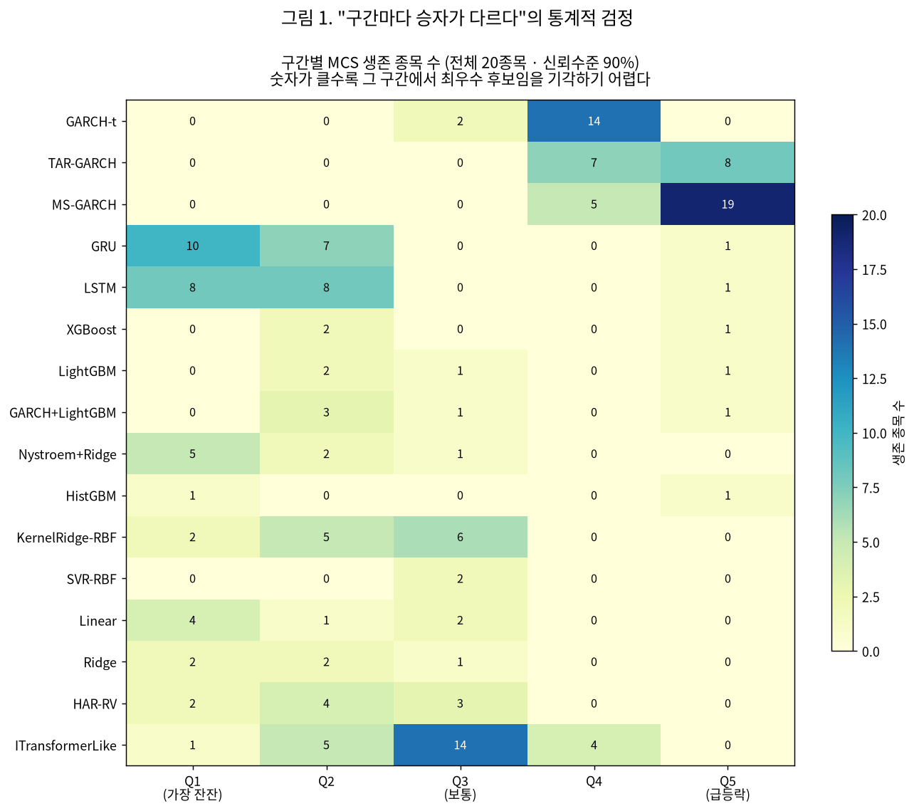
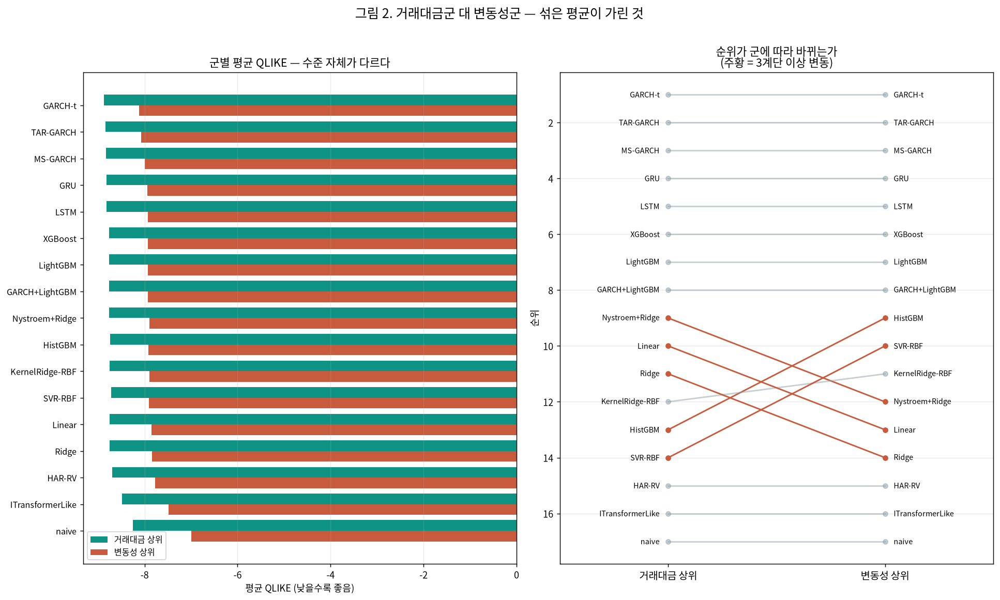

# 25번 — 모델 순위의 통계적 유의성 검정과 군별 분리 보고

작성일 2026-10-04 · **20종목** · 15분봉 · 1시간 뒤 실현변동성 · 모델 17개

> 24번은 17개 모델의 순위를 냈지만 **그 차이가 통계적으로 유의한지 검정하지 않았다.** 이 회차는 24번이 저장한 검증 예측값을 **재적합 없이** 다시 읽어 Diebold-Mariano 검정과 Model Confidence Set으로 순위의 강도를 측정하고, 24번이 한계로 남긴 군별(거래대금군·변동성군) 분리 보고를 수행한다.

**입력**: `test/results/24_maxscale_refit_20260928/24_maxscale_refit_validation_predictions.npz` (20종목×2조건×17모델 검증 예측값). 데이터 조건·전처리·분할은 24번과 **동일**하며 이 회차는 새로 적합하지 않는다 — 조건 상세는 24번 보고서의 표준 헤더를 참조한다.

---

## 0. 입력 정합성 — 재계산한 손실이 24번 수치와 맞는가

이 회차는 24번의 예측값에서 QLIKE를 **다시 계산**한다. 그 값이 24번이 보고한 평균 QLIKE와 어긋나면 이후 모든 검정이 무의미하므로 먼저 대조한다.

- 모델 17개 전부 대조 — **최대 절대 차이 4.35e-09**
- → 수치 불일치 없음. 이후 검정의 입력으로 쓸 수 있다.

## 1. 블록 길이를 왜 40으로 잡았는가

MCS는 블록 부트스트랩으로 분포를 만든다. 블록이 손실 시계열의 자기상관보다 짧으면 종속성을 깨뜨려 유의성이 과대평가된다. 임의로 고르지 않고 **실측해서** 정한다.

| 모델 | lag1 | lag5 | lag10 | lag20 | lag40 | lag80 |
| :--- | ---: | ---: | ---: | ---: | ---: | ---: |
| GARCH-t | 0.243 | 0.108 | 0.069 | 0.064 | 0.055 | 0.041 |
| TAR-GARCH | 0.316 | 0.152 | 0.097 | 0.087 | 0.075 | 0.057 |
| MS-GARCH | 0.330 | 0.140 | 0.110 | 0.096 | 0.080 | 0.060 |
| GRU | 0.104 | 0.057 | 0.037 | 0.036 | 0.031 | 0.025 |
| LSTM | 0.104 | 0.058 | 0.037 | 0.039 | 0.032 | 0.026 |
| XGBoost | 0.116 | 0.052 | 0.032 | 0.030 | 0.025 | 0.022 |
| LightGBM | 0.111 | 0.051 | 0.031 | 0.030 | 0.025 | 0.022 |
| GARCH+LightGBM | 0.109 | 0.050 | 0.031 | 0.031 | 0.026 | 0.022 |
| Nystroem+Ridge | 0.115 | 0.049 | 0.032 | 0.029 | 0.024 | 0.021 |
| HistGBM | 0.113 | 0.047 | 0.029 | 0.027 | 0.023 | 0.020 |
| KernelRidge-RBF | 0.128 | 0.056 | 0.036 | 0.033 | 0.029 | 0.025 |
| SVR-RBF | 0.131 | 0.064 | 0.041 | 0.037 | 0.032 | 0.024 |
| Linear | 0.137 | 0.046 | 0.028 | 0.025 | 0.022 | 0.021 |
| Ridge | 0.138 | 0.046 | 0.028 | 0.026 | 0.022 | 0.021 |
| HAR-RV | 0.175 | 0.049 | 0.025 | 0.023 | 0.021 | 0.019 |
| ITransformerLike | 0.139 | 0.117 | 0.084 | 0.080 | 0.078 | 0.047 |
| naive | 0.055 | 0.025 | 0.023 | 0.022 | 0.015 | 0.008 |

- 시차 40에서도 자기상관이 최대 **0.080**(모델 MS-GARCH)로 남는다 → 블록 길이 **40** 채택.
- 결론이 이 선택에 흔들리는지 보려고 (20, 40, 80) 세 값으로 민감도도 확인한다(§2 말미).

## 2. 전체 구간 — 어느 모델이 '최우수 후보'로 남는가

종목·조건마다 MCS를 따로 돌려 신뢰수준 90%에서 생존하는 모델을 센다. **생존 종목 수가 많을수록 그 모델이 최우수일 가능성을 기각하기 어렵다는 뜻**이다. 반대로 생존 0이면 그 모델은 어디서도 최우수 후보가 아니다.

| 순위(24번 평균 QLIKE) | 모델 | 생존 종목수 · 주기제거 전 | 생존 종목수 · 주기제거 후 |
| ---: | :--- | ---: | ---: |
| 1 | **GARCH-t** | 20/20 | 20/20 |
| 2 | **TAR-GARCH** | 10/20 | 7/20 |
| 3 | **MS-GARCH** | 7/20 | 4/20 |
| 4 | **GRU** | 7/20 | 5/20 |
| 5 | **LSTM** | 6/20 | 5/20 |
| 6 | **XGBoost** | 5/20 | 1/20 |
| 7 | **LightGBM** | 5/20 | 1/20 |
| 8 | **GARCH+LightGBM** | 5/20 | 1/20 |
| 9 | **Nystroem+Ridge** | 2/20 | 1/20 |
| 10 | **HistGBM** | 5/20 | 2/20 |
| 11 | **KernelRidge-RBF** | 3/20 | 1/20 |
| 12 | **SVR-RBF** | 3/20 | 2/20 |
| 13 | **Linear** | 2/20 | 1/20 |
| 14 | **Ridge** | 2/20 | 1/20 |
| 15 | **HAR-RV** | 1/20 | 0/20 |
| 16 | **ITransformerLike** | 1/20 | 0/20 |
| 17 | **naive** | 1/20 | 1/20 |

- 종목 하나당 생존 모델 수의 중앙값은 **2개**다(전체 17개 중). 이 값이 작을수록 모델 간 차이가 뚜렷하다는 뜻이다.
- 24번 전체평균 1위였던 **GARCH-t**은 주기제거 후 **20/20종목**에서 생존한다.
- 결측으로 MCS 비교에서 빠진 모델은 없다 — 전 종목·조건에서 17개 모델 전부가 비교 대상에 포함됐다.

### 블록 길이에 결론이 흔들리는가

대표 5종목(주기제거 후)에서 블록 길이만 바꿔 생존 횟수를 셌다. 생존이 한 번이라도 있는 모델만 싣는다.

| 블록 길이 | GARCH-t | TAR-GARCH | MS-GARCH | GRU | LSTM | XGBoost | LightGBM | GARCH+LightGBM | Nystroem+Ridge | HistGBM | KernelRidge-RBF | SVR-RBF | Linear | Ridge | naive |
| ---: | ---: | ---: | ---: | ---: | ---: | ---: | ---: | ---: | ---: | ---: | ---: | ---: | ---: | ---: | ---: |
| 20 | 5 | 3 | 1 | 2 | 3 | 1 | 1 | 1 | 1 | 2 | 1 | 1 | 1 | 1 | 1 |
| 40 | 5 | 3 | 1 | 2 | 3 | 1 | 1 | 1 | 1 | 2 | 1 | 1 | 1 | 1 | 1 |
| 80 | 5 | 3 | 2 | 2 | 3 | 1 | 1 | 1 | 1 | 2 | 1 | 1 | 1 | 1 | 1 |

## 3. 구간별 — "구간마다 승자가 다르다"는 통계적으로 뒷받침되는가

이것이 이 회차의 핵심이다. 포스터와 24번은 **"단일 최적 모델은 없다"**를 구간별 QLIKE 최솟값으로 주장했는데, 그 최솟값 차이가 유의한지는 보지 않았다. 구간마다 MCS를 따로 돌려 **각 구간의 최우수 후보 집합**을 구한다.

> **이 검정의 한계를 먼저 밝힌다.** 구간은 실제 변동성 5분위로 나누므로 그 부분표본은 시계열에서 **연속되지 않는다**. 블록 부트스트랩은 인접 관측의 종속성을 보존하는 기법인데, 흩어진 부분표본에서는 '인접'이 원 시계열의 인접이 아니다. 변동성 군집 때문에 같은 구간 관측이 뭉쳐 있는 경향은 있지만(24번 전이행렬 대각 0.45), 전체 구간 검정보다 신뢰도가 낮다. 그래서 블록을 10으로 줄여 쓴다.

**구간별 생존 종목수**(주기제거 후, 전체 20종목 중 · 신뢰수준 90%)

| 모델 | Q1 | Q2 | Q3 | Q4 | Q5 |
| :--- | ---: | ---: | ---: | ---: | ---: |
| GARCH-t | 0 | 0 | 2 | 14 | 0 |
| TAR-GARCH | 0 | 0 | 0 | 7 | 8 |
| MS-GARCH | 0 | 0 | 0 | 5 | 19 |
| GRU | 10 | 7 | 0 | 0 | 1 |
| LSTM | 8 | 8 | 0 | 0 | 1 |
| XGBoost | 0 | 2 | 0 | 0 | 1 |
| LightGBM | 0 | 2 | 1 | 0 | 1 |
| GARCH+LightGBM | 0 | 3 | 1 | 0 | 1 |
| Nystroem+Ridge | 5 | 2 | 1 | 0 | 0 |
| HistGBM | 1 | 0 | 0 | 0 | 1 |
| KernelRidge-RBF | 2 | 5 | 6 | 0 | 0 |
| SVR-RBF | 0 | 0 | 2 | 0 | 0 |
| Linear | 4 | 1 | 2 | 0 | 0 |
| Ridge | 2 | 2 | 1 | 0 | 0 |
| HAR-RV | 2 | 4 | 3 | 0 | 0 |
| ITransformerLike | 1 | 5 | 14 | 4 | 0 |

> 어느 구간·어느 종목에서도 생존하지 못한 모델 1개: naive

**구간별 최다 생존 모델**: Q1=GRU(10종목), Q2=LSTM(8종목), Q3=ITransformerLike(14종목), Q4=GARCH-t(14종목), Q5=MS-GARCH(19종목)

→ 서로 다른 모델 **5종**이 구간을 나눠 가진다. 24번이 단순 QLIKE 최솟값으로 관찰한 것과 **같은 방향**이며, 이번에는 다중비교를 통제한 검정으로도 유지된다.

### 3-B. 생존 수를 "성능"으로 읽으면 안 된다 — 실제 사례

위 표에서 **ITransformerLike가 Q3에서 14종목 생존으로 최다**다. 그런데 이 모델은 24번 전체 순위 16위로 naive보다 못했고, 학습곡선 진단에서 **일반화 실패**로 판정돼 다음 회차부터 제외하기로 한 모델이다. 모순처럼 보이므로 원인을 직접 측정했다.

**예측의 건강성 진단**(주기제거 후·전 구간·20종목 평균)

| 모델 | variance_ratio | 실제와의 상관 | Q3 MCS 생존 |
| :--- | ---: | ---: | ---: |
| KernelRidge-RBF | 0.182 ⚠ | 0.499 | 6 |
| ITransformerLike | 4.573 ⚠ | 0.290 | 14 |
| GARCH-t | 0.444 | 0.459 | 2 |
| GRU | 0.263 | 0.559 | 0 |
| naive | 0.793 | 0.404 | 0 |

ITransformerLike는 **예측 분산이 실제의 4.6배**(진폭 폭주)이면서 실제와의 상관은 **0.290로 가장 낮다**. `known_pitfalls` P1이 경계하는 진폭 압축(variance_ratio ≪ 1)의 **반대 방향 고장**이다 — 크게, 그러나 틀리게 예측한다.

그런데도 Q3에서 살아남는 이유는 **MCS가 측정하는 것이 "좋음"이 아니라 "최우수가 아님을 기각할 수 있는가"이기 때문**이다. Q3에서 KernelRidge-RBF 대비 손실 차이를 보면 다음과 같다(20종목 평균).

| KernelRidge-RBF 대비 | 평균 손실차 | 손실차 표준편차 | 평균 t통계량 |
| :--- | ---: | ---: | ---: |
| ITransformerLike | 0.0150 | **0.321** | -1.8 |
| GARCH-t | 0.0685 | **0.282** | 12.1 |
| GRU | 0.0591 | **0.234** | 9.8 |
| HAR-RV | 0.0391 | **0.226** | 6.8 |
| LightGBM | 0.0340 | **0.188** | 7.4 |

다른 모델들은 KernelRidge보다 **일관되게** 나쁘다(손실차가 안정적이라 t통계량이 6~12). 반면 ITransformerLike는 평균 손실차 자체는 작지만 **손실차 표준편차가 가장 크다** — 예측이 다른 모델과 전혀 다르게 움직여 손실 차이가 들쭉날쭉하다. 그래서 "유의하게 열세"임을 입증할 검정력이 나오지 않고, 결과적으로 제거되지 않는다.

> **따라서 §3 표는 "생존 수가 많다 = 좋다"로 읽으면 안 된다.** 생존은 두 가지 경로로 일어난다 — ① 실제로 우수해서, ② 불안정해서 열세를 입증할 수 없어서. 둘을 가르려면 평균 손실 순위와 진폭 건강성을 **함께** 봐야 한다. 아래 §6 결론은 이 구분을 적용한 것이다.

## 4. Diebold-Mariano 검정 — 핵심 주장 네 가지

MCS가 "집합"을 말한다면 DM은 "이 둘 중 누가 나은가"를 말한다. 24번의 핵심 주장을 쌍별로 직접 검정한다. 음수 통계량은 앞 모델이 낫다는 뜻이고, p<0.05면 그 차이가 표본 우연으로 설명되지 않는다는 뜻이다.

**GARCH-t 대비 · 주기제거 후 · 종목별 DM 검정 결과 집계**(유의수준 5%)

| 비교 | 구간 | 유의 우세 | 무차별 | 유의 열세 | 평균 DM 통계량 |
| :--- | :--- | ---: | ---: | ---: | ---: |
| TAR-GARCH vs GARCH-t | 전체 | **0**/20 | 6 | 14 | 4.53 |
| TAR-GARCH vs GARCH-t | Q1 | **0**/20 | 0 | 20 | 65.39 |
| TAR-GARCH vs GARCH-t | Q2 | **0**/20 | 0 | 20 | 53.29 |
| TAR-GARCH vs GARCH-t | Q3 | **0**/20 | 0 | 20 | 29.36 |
| TAR-GARCH vs GARCH-t | Q4 | **4**/20 | 4 | 12 | 3.67 |
| TAR-GARCH vs GARCH-t | Q5 | **20**/20 | 0 | 0 | -9.01 |
| MS-GARCH vs GARCH-t | 전체 | **0**/20 | 4 | 16 | 5.31 |
| MS-GARCH vs GARCH-t | Q1 | **0**/20 | 0 | 20 | 52.62 |
| MS-GARCH vs GARCH-t | Q2 | **0**/20 | 0 | 20 | 44.77 |
| MS-GARCH vs GARCH-t | Q3 | **1**/20 | 0 | 19 | 22.23 |
| MS-GARCH vs GARCH-t | Q4 | **2**/20 | 5 | 13 | 2.85 |
| MS-GARCH vs GARCH-t | Q5 | **19**/20 | 0 | 1 | -8.10 |
| GRU vs GARCH-t | 전체 | **0**/20 | 6 | 14 | 3.84 |
| GRU vs GARCH-t | Q1 | **20**/20 | 0 | 0 | -58.35 |
| GRU vs GARCH-t | Q2 | **20**/20 | 0 | 0 | -24.73 |
| GRU vs GARCH-t | Q3 | **8**/20 | 5 | 7 | -1.48 |
| GRU vs GARCH-t | Q4 | **0**/20 | 0 | 20 | 9.08 |
| GRU vs GARCH-t | Q5 | **0**/20 | 3 | 17 | 6.77 |
| LSTM vs GARCH-t | 전체 | **0**/20 | 6 | 14 | 3.97 |
| LSTM vs GARCH-t | Q1 | **20**/20 | 0 | 0 | -57.80 |
| LSTM vs GARCH-t | Q2 | **20**/20 | 0 | 0 | -24.42 |
| LSTM vs GARCH-t | Q3 | **8**/20 | 5 | 7 | -1.23 |
| LSTM vs GARCH-t | Q4 | **0**/20 | 0 | 20 | 9.34 |
| LSTM vs GARCH-t | Q5 | **0**/20 | 3 | 17 | 6.87 |

→ **Q5(급등락 구간)에서 레짐 전환 2종이 GARCH-t보다 유의하게 나은 사례는 39건**(2모델 × 20종목 = 40건 중)이다. 24번이 포착률·평균 QLIKE로 관찰한 Q5 우위가 검정으로도 확인되는지 이 수치로 판단한다.

## 5. 군별 분리 — 두 집단을 섞은 평균이 구조를 가렸는가

우리 표본은 **거래대금 상위 10종목**과 **변동성 상위 10종목**으로 구성된다. 23번 (M-2)에서 두 집단의 내부 상관이 0.555 대 0.156으로 3.6배 차이 났다 — 전자는 시장 요인이 지배하고 후자는 종목 고유 움직임이 크다. 24번은 이 둘을 20종목 평균 하나로 요약했고, 그것을 한계로 적었다. 여기서 갈라 본다.

| 모델 | 거래대금군 순위 | 거래대금군 QLIKE | 변동성군 순위 | 변동성군 QLIKE | 순위 차 |
| :--- | ---: | ---: | ---: | ---: | ---: |
| GARCH-t | 1 | -8.880 | 1 | -8.114 | +0 |
| TAR-GARCH | 2 | -8.840 | 2 | -8.069 | +0 |
| MS-GARCH | 3 | -8.833 | 3 | -8.000 | +0 |
| GRU | 4 | -8.823 | 4 | -7.940 | +0 |
| LSTM | 5 | -8.821 | 5 | -7.931 | +0 |
| XGBoost | 6 | -8.765 | 6 | -7.930 | +0 |
| LightGBM | 7 | -8.763 | 7 | -7.928 | +0 |
| GARCH+LightGBM | 8 | -8.760 | 8 | -7.924 | +0 |
| Nystroem+Ridge | 9 | -8.760 | 12 | -7.899 | **+3** |
| HistGBM | 13 | -8.746 | 9 | -7.923 | **-4** |
| KernelRidge-RBF | 12 | -8.751 | 11 | -7.900 | -1 |
| SVR-RBF | 14 | -8.722 | 10 | -7.910 | **-4** |
| Linear | 10 | -8.753 | 13 | -7.847 | **+3** |
| Ridge | 11 | -8.753 | 14 | -7.846 | **+3** |
| HAR-RV | 15 | -8.693 | 15 | -7.776 | +0 |
| ITransformerLike | 16 | -8.487 | 16 | -7.483 | +0 |
| naive | 17 | -8.249 | 17 | -6.997 | +0 |

→ **순위가 3계단 이상 바뀌는 모델**: HistGBM(-4), SVR-RBF(-4), Nystroem+Ridge(+3), Linear(+3), Ridge(+3). 20종목 평균 하나로는 이 차이가 보이지 않는다 — 24번이 한계로 적은 "두 집단을 섞은 평균" 문제가 실제로 존재함을 확인한다.

## 6. 24번 결론을 어디까지 유지할 수 있는가

### 6-A. 구간별 승자 — 세 기준을 함께 놓고 판정한다

§3-B에서 보았듯 MCS 생존 수 하나만으로는 판정할 수 없다. **평균 QLIKE 순위**(누가 실제로 손실이 작은가), **DM 검정**(그 차이가 우연이 아닌가), **MCS 생존**(최우수 후보에서 배제되지 않는가) 세 가지를 함께 본다.

| 구간 | 평균 QLIKE 1위 | GARCH-t 대비 DM(유의 우세/20종목) | MCS 최다 생존 | 종합 판정 |
| :--- | :--- | :--- | :--- | :--- |
| Q1 | GRU | **GRU 20/20**, **LSTM 20/20** | GRU(10) | GRU · LSTM **확정** |
| Q2 | GRU | **GRU 20/20**, **LSTM 20/20** | LSTM(8) | GRU · LSTM **확정** |
| Q3 | KernelRidge-RBF | MS-GARCH 1/20, GRU 8/20, LSTM 8/20 | ITransformerLike(14) ⚠(vr=4.6) | **결정 불가(혼전)** |
| Q4 | GARCH-t | TAR-GARCH 4/20, MS-GARCH 2/20 | GARCH-t(14) | **결정 불가(혼전)** |
| Q5 | TAR-GARCH | **TAR-GARCH 20/20**, **MS-GARCH 19/20** | MS-GARCH(19) | MS-GARCH · TAR-GARCH **확정** |

→ 5개 구간 중 **3개 구간에서 승자가 확정**되고, 그 승자는 서로 다른 **2종**이다(GRU · LSTM, MS-GARCH · TAR-GARCH). **"단일 최적 모델은 없다"는 다중비교를 통제한 검정으로도 유지된다.**

다만 **Q3, Q4는 결정 불가**다. 이 구간에서는 모델 간 차이가 표본 우연과 구별되지 않으므로, "이 구간의 최적 모델"을 말할 수 없다 — 24번이 단순 최솟값으로 승자를 지목했던 것을 여기서 **철회**한다.

### 6-B. 24번 주장별 판정

| 24번의 주장 | 이번 검정 결과 | 판정 |
| :--- | :--- | :--- |
| 전체평균 1위는 GARCH-t | 주기제거 후 20/20종목에서 MCS 생존 | **유지** |
| 구간마다 최우수 모델이 다르다 | 확정 구간 3개에서 승자 2종 | **유지** |
| Q5에서 레짐 전환 모델 우세 | DM 유의 우세 39건 / 40건 | **유지** |
| 20종목 평균이 두 집단을 가린다(24번 한계 (3)) | 3계단 이상 순위 변동 5개 모델 | **확인됨** |
| (24번 §6-B) Q3 최우수는 KernelRidge-RBF | 평균 1위는 맞으나 DM에서 GARCH-t 대비 혼전 | **철회 — 통계적으로 구별 안 됨** |

### 이 회차가 하지 않은 것

- **구간을 미리 예측하지 않았다.** 여기서도 구간은 실제 변동성으로 나눈 사후 분해다. "어느 구간인지 모르는 상태에서 모델을 고르는" 문제는 다음 회차의 과제다.
- **새로 적합하지 않았다.** 24번 예측값을 그대로 썼으므로 하이퍼파라미터·룩백 등 24번의 설계 한계(동일 룩백 192봉 등)를 그대로 물려받는다.
- **MCS 신뢰수준은 90% 하나만 썼다.** 수준을 바꾸면 생존 집합 크기가 달라진다.

