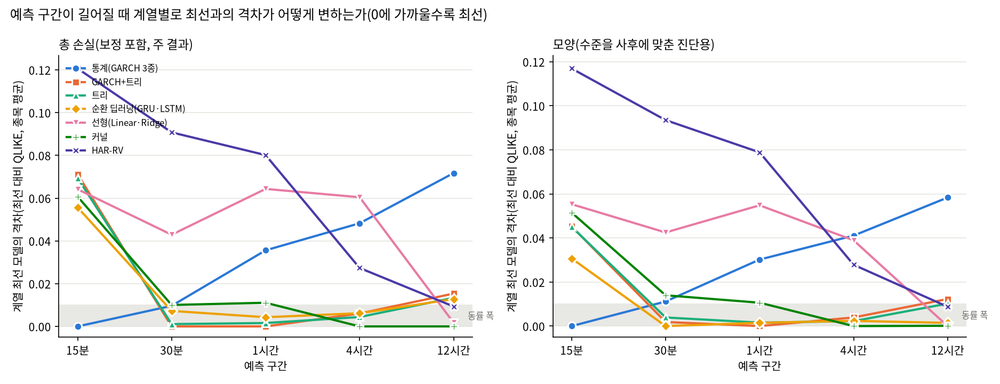

# 26번: 시간 기준 평가 재정립과 24번 재평가

### 0. 이번 회차 실제 분석 범위 ⚠

- **연구 대상(모집단)**: 상위 20종목 (아래 1절 목록)
- **이번 회차 실제 분석**: 대상 전체 20종목 ✅

## 분석 조건 (표준 헤더)

> 이 보고서만 읽어도 데이터 조건을 파악할 수 있도록, 매 회차 동일 항목을 싣는다(AGENTS.md 2.9g).

### 1. 데이터 출처·형식

- **DB / 테이블**: `data/upbit_data.db` (DuckDB) / `upbit_krw_candle`
- **봉 간격**: 15분봉 (하루 96봉)
- **원본 컬럼**: timestamp, open, high, low, close, volume, value
- **분석 종목 20개** — 이력 90,000봉(약 2.5년) 이상 종목 중 선정:

| # | 종목 | 선정 근거 | 봉 수 | 기간 | 표준편차 | 왜도 | 초과첨도 |
| ---: | :--- | :--- | ---: | :--- | ---: | ---: | ---: |
| 1 | KRW-AERGO | - | 102,358 | 2023-07-19~2026-07-18 | 0.007281 | 1.0060 | 80.34 |
| 2 | KRW-AQT | - | 100,547 | 2023-07-18~2026-07-18 | 0.007531 | 0.6777 | 170.04 |
| 3 | KRW-ARDR | - | 101,215 | 2023-07-19~2026-07-18 | 0.007407 | 1.9308 | 123.45 |
| 4 | KRW-ARK | - | 101,942 | 2023-07-18~2026-07-18 | 0.007251 | -0.5274 | 306.54 |
| 5 | KRW-BOUNTY | - | 97,259 | 2023-07-19~2026-07-18 | 0.007438 | 2.1620 | 143.87 |
| 6 | KRW-BTC | - | 104,883 | 2023-07-19~2026-07-19 | 0.002386 | 0.0045 | 107.19 |
| 7 | KRW-BTT | - | 104,207 | 2023-07-19~2026-07-19 | 0.041478 | 0.0021 | 13.29 |
| 8 | KRW-CBK | - | 98,541 | 2023-07-18~2026-07-18 | 0.007097 | 1.7032 | 203.54 |
| 9 | KRW-DOGE | - | 104,863 | 2023-07-19~2026-07-18 | 0.005603 | -0.1511 | 50.63 |
| 10 | KRW-ETC | - | 104,901 | 2023-07-18~2026-07-18 | 0.004365 | -2.3845 | 720.64 |
| 11 | KRW-ETH | - | 104,869 | 2023-07-19~2026-07-18 | 0.003388 | -0.9237 | 482.65 |
| 12 | KRW-MOC | - | 97,027 | 2023-07-19~2026-07-19 | 0.007320 | 1.3894 | 261.28 |
| 13 | KRW-SEI | - | 102,133 | 2023-08-16~2026-07-18 | 0.006708 | 1.6436 | 178.97 |
| 14 | KRW-SHIB | - | 104,868 | 2023-07-19~2026-07-18 | 0.005935 | 0.2553 | 50.13 |
| 15 | KRW-SOL | - | 104,879 | 2023-07-19~2026-07-19 | 0.004522 | 0.2330 | 27.32 |
| 16 | KRW-STRAX | - | 102,279 | 2023-07-19~2026-07-19 | 0.007567 | 1.9133 | 92.65 |
| 17 | KRW-SUI | - | 104,876 | 2023-07-19~2026-07-19 | 0.005934 | -0.9976 | 341.19 |
| 18 | KRW-TOKAMAK | - | 99,844 | 2023-07-18~2026-07-18 | 0.007177 | 2.0427 | 225.76 |
| 19 | KRW-XLM | - | 104,901 | 2023-07-18~2026-07-18 | 0.005228 | -0.0311 | 89.51 |
| 20 | KRW-XRP | - | 104,876 | 2023-07-19~2026-07-18 | 0.004155 | -0.3690 | 157.70 |

### 2. 수집 기간·규모·품질 (대표 종목 KRW-BTC)

- **기간**: 2023-07-19 19:00 ~ 2026-07-19 00:30
- **총 봉 수**: 104,883개 (약 2.99년)
- **연속성**: 15분이 아닌 간격 15개 (0.0143%) — 코인은 24시간 거래라 장 마감·주말 갭이 없다
- **결측**: 0개

### 3. 학습/검증 분할

- **방식**: 시간순 분할(셔플 없음) — 미래 정보 누설 방지
- **비율**: train 70% / validation 30%
- **train**: 2023-07-19 19:00 ~ 2025-08-25 23:45 (73,571봉, 약 766일)
- **validation**: 2025-08-26 00:00 ~ 2026-07-19 00:30 (31,312봉, 약 326일)
- 스케일러·모델 파라미터는 **train 구간에서만** 적합한다.

### 4. 기본 전처리 파이프라인과 가정

```
원본 close (KRW)
  → 로그 변환 log(close)        [스케일 안정화. 여전히 비정상: 단위근]
  → 1차 차분 r = Δlog(close)    [★ 여기서 정상성 확보 — 분석의 출발점]
  → (회차별 추가 처리)
  → 모델 적합
```

- **왜 차분하는가**: 로그가격은 단위근이 있어 비정상(ADF p=0.19)이고, 1차 차분하면 정상이 된다(ADF p=0.000). 정상성은 로그가 아니라 **차분**에서 온다.
- **예측 대상**: 수익률의 부호(방향)가 아니라 **크기(변동성)**. 방향은 자기상관이 0에 가까워 예측이 어렵고, 크기는 장기기억이 있어 예측 가능하다.

### 5. 기초통계량과 데이터 특성 (이전 EDA 확인 사항)

- **조건부 이분산**: ARCH-LM p=0.000 → 변동성이 시간에 따라 변한다(GARCH 계열 사용 근거)
- **장기기억**: |수익률| 자기상관이 하루(96봉) 뒤에도 0.12로 완만히 감소
- **두꺼운 꼬리**: 초과첨도 107 (정규분포는 0). 좌우 대칭(왜도 0.004)이나 양쪽 꼬리가 모두 두껍다. 4σ 초과가 정규 대비 약 100배, 6σ는 약 87만배 빈발
- **선형성 기각**: RESET·BDS 검정 p=0.000 → 선형 모델을 쓸 근거가 없다(비선형·커널 계열 필요)
- **방향 무예측성**: 수익률 자기상관 ≈ 0

### 6. 이번 회차에 적용한 변환

| 처리 | 적용 이유 |
| :--- | :--- |
| 15분 시간 격자 복원 | 업비트는 무체결 구간에 캔들을 만들지 않는다. 행 기준 창은 시간이 아니다 |
| 점검 구간 제외 | BTC·ETH·XRP가 동시에 빈 시각 = 거래소 전체 중단. 보간하지 않는다 |
| 로그수익률 | 종가 기반 |
| 주기 제거(입력 전용) | (요일,시) 슬롯 평균 |r|, 학습 구간만으로 추정. 타깃은 원 스케일 |


## 0. 이 회차가 고친 것

24·25번 점검에서 확인된 평가 틀의 결함을 고친 재평가다. 결함과 처리는 드라이버 상단 표에 있다. 분할 시각은 전 종목 공통 **2025-08-26 00:00:00**(KST)이고, 예측 시점은 정시, 예측 구간은 15분·30분·1시간·4시간·12시간이다. 24번 수치와 직접 빼서 비교하지 않는다(평가 단위·표본·타깃이 모두 다르다).

소요 2.04시간.

## 1. 데이터: 시간 격자 위에서 본 결측과 평가 표본

| 종목 | 무체결 봉(전체) | 무체결 봉(평가 구간) | 점검 봉 | 영수익률 비율 |
| :--- | ---: | ---: | ---: | ---: |
| AERGO | 2.45% | 4.03% | 259 | 24.7% |
| AQT | 4.20% | 8.77% | 259 | 21.8% |
| ARDR | 3.52% | 6.53% | 259 | 25.0% |
| ARK | 2.91% | 8.97% | 259 | 19.3% |
| BOUNTY | 7.25% | 16.56% | 259 | 26.8% |
| BTC | 0.00% | 0.00% | 259 | 0.6% |
| BTT | 0.69% | 1.22% | 259 | 26.7% |
| CBK | 6.11% | 13.56% | 259 | 25.1% |
| DOGE | 0.00% | 0.01% | 259 | 23.0% |
| ETC | 0.07% | 0.21% | 259 | 7.6% |
| ETH | 0.00% | 0.00% | 259 | 6.2% |
| MOC | 7.46% | 18.75% | 259 | 29.2% |
| SEI | 0.10% | 0.28% | 242 | 20.6% |
| SHIB | 0.07% | 0.02% | 259 | 22.4% |
| SOL | 0.00% | 0.01% | 259 | 5.4% |
| STRAX | 2.49% | 6.87% | 259 | 20.5% |
| SUI | 0.01% | 0.01% | 259 | 7.6% |
| TOKAMAK | 4.90% | 11.62% | 259 | 21.2% |
| XLM | 0.06% | 0.03% | 259 | 23.1% |
| XRP | 0.00% | 0.00% | 259 | 9.0% |

예측 구간별 평가 표본과 실현변동성 크기(종목 중앙값):

| H | 평가 표본(종목 중앙) | 학습 RV 중앙값 | 평가 RV 중앙값 | 평가 RV 95% | 평가 RV=0 비율 | 학습 제외(RV=0) |
| ---: | ---: | ---: | ---: | ---: | ---: | ---: |
| 15분 | 7,824 | 0.233% | 0.216% | 0.972% | 32.15% | 16.90% |
| 30분 | 7,819 | 0.434% | 0.391% | 1.322% | 12.64% | 5.39% |
| 1시간 | 7,818 | 0.688% | 0.617% | 1.814% | 3.38% | 1.10% |
| 4시간 | 1,948 | 1.576% | 1.439% | 3.341% | 0.00% | 0.00% |
| 12시간 | 645 | 3.001% | 2.685% | 5.601% | 0.00% | 0.00% |

## 2. 적합 완결성

기대 20종목 × 5구간 × 16모델 = 1600행, 실제 1600행.
적합 실패 0건.

## 3. 전체 순위(예측 구간별)

종목마다 QLIKE 순위를 매겨 평균했다(작을수록 좋음). ΔQLIKE는 naive 대비 차이의 종목 평균으로, 스케일에 불변이라 종목을 가로질러 평균할 수 있다(음수일수록 naive보다 좋음).

**주 결과는 전원 보정이다.** 모든 모델(naive 제외)이 같은 절차로 분산 배율 c를 받는다. 로그 타깃 모델은 내부학습 모델의 내부검증 정시 예측으로, GARCH 3종은 내부학습 구간까지로 다시 적합한 모형의 같은 시점 예측으로 c를 추정한다. 이 보정은 로그 역변환 편향을 고치는 동시에 최근 수준에 맞춘 조정 효과도 내므로, 한 계열에만 적용하면 순위가 통째로 바뀐다(초기 실행에서 확인). 그래서 **전원 미보정 순위**를 민감도 분석으로 함께 싣는다. 두 순위가 어긋나는 모델은 수준 맞춤의 영향을 크게 받는 모델이다.

### 15분

| 순위 | 모델 | 처리 방식 | 종목 수 | 평균 순위 | 평균 순위(전원 미보정) | ΔQLIKE(naive 대비) | MASE 중앙 | 보정계수 중앙 |
| ---: | :--- | :--- | ---: | ---: | ---: | ---: | ---: | ---: |
| 1 | GARCH-t | 순차·재귀(통계) | 20 | 5.6 | 1.9 | -34.1668 | 1.028 | 1.04 |
| 2 | MS-GARCH | 순차·재귀(통계) | 20 | 5.7 | 2.5 | -33.5861 | 1.015 | 1.07 |
| 3 | TAR-GARCH | 순차·재귀(통계) | 20 | 5.8 | 2.6 | -34.1632 | 1.026 | 1.15 |
| 4 | GRU | 순차·재귀 | 20 | 6.5 | 8.9 | -34.1112 | 1.098 | 3.62 |
| 5 | LightGBM | 특성 기반 트리(비신경) | 20 | 7.2 | 7.0 | -34.0974 | 1.117 | 3.60 |
| 6 | LSTM | 순차·재귀 | 20 | 7.5 | 10.1 | -34.1013 | 1.075 | 3.60 |
| 7 | GARCH+LightGBM | 순차·재귀 통계 + 트리 결합 | 20 | 7.7 | 7.2 | -34.0957 | 1.110 | 3.63 |
| 8 | XGBoost | 특성 기반 트리(비신경) | 20 | 7.7 | 7.8 | -34.0956 | 1.107 | 3.60 |
| 9 | Nystroem+Ridge | 특성 기반 회귀(비신경) | 20 | 8.0 | 9.8 | -34.1061 | 1.074 | 3.44 |
| 10 | HistGBM | 특성 기반 트리(비신경) | 20 | 8.1 | 8.8 | -34.0918 | 1.116 | 3.64 |
| 11 | Ridge | 특성 기반 회귀(비신경) | 20 | 8.4 | 10.8 | -34.1027 | 1.050 | 3.38 |
| 12 | KernelRidge-RBF | 특성 기반 회귀(비신경) | 20 | 8.6 | 12.1 | -34.0751 | 1.027 | 3.63 |
| 13 | Linear | 특성 기반 회귀(비신경) | 20 | 9.2 | 11.1 | -34.0996 | 1.051 | 3.38 |
| 14 | HAR-RV | 지연 특성 회귀(비신경) | 20 | 11.9 | 14.4 | -34.0462 | 1.088 | 3.61 |
| 15 | SVR-RBF | 특성 기반 회귀(비신경) | 20 | 12.6 | 8.5 | -33.9939 | 1.077 | 2.78 |
| 16 | naive | 직전값 | 20 | 15.6 | 12.7 | +0.0000 | 1.000 | 1.00 |

### 30분

| 순위 | 모델 | 처리 방식 | 종목 수 | 평균 순위 | 평균 순위(전원 미보정) | ΔQLIKE(naive 대비) | MASE 중앙 | 보정계수 중앙 |
| ---: | :--- | :--- | ---: | ---: | ---: | ---: | ---: | ---: |
| 1 | GARCH+LightGBM | 순차·재귀 통계 + 트리 결합 | 20 | 4.8 | 6.5 | -2.8977 | 1.043 | 2.40 |
| 2 | LightGBM | 특성 기반 트리(비신경) | 20 | 5.4 | 6.7 | -2.8965 | 1.044 | 2.41 |
| 3 | XGBoost | 특성 기반 트리(비신경) | 20 | 5.5 | 6.8 | -2.8967 | 1.034 | 2.39 |
| 4 | GRU | 순차·재귀 | 20 | 6.0 | 9.8 | -2.8905 | 0.985 | 2.44 |
| 5 | HistGBM | 특성 기반 트리(비신경) | 20 | 6.8 | 7.8 | -2.8931 | 1.035 | 2.40 |
| 6 | LSTM | 순차·재귀 | 20 | 6.9 | 9.1 | -2.8893 | 0.987 | 2.40 |
| 7 | GARCH-t | 순차·재귀(통계) | 20 | 7.2 | 1.8 | -2.8881 | 0.999 | 1.00 |
| 8 | TAR-GARCH | 순차·재귀(통계) | 20 | 7.4 | 2.6 | -2.8859 | 1.001 | 1.11 |
| 9 | MS-GARCH | 순차·재귀(통계) | 20 | 7.5 | 2.8 | -2.1881 | 0.975 | 1.04 |
| 10 | Nystroem+Ridge | 특성 기반 회귀(비신경) | 20 | 7.7 | 9.2 | -2.8877 | 1.053 | 2.36 |
| 11 | KernelRidge-RBF | 특성 기반 회귀(비신경) | 20 | 9.1 | 11.7 | -2.8460 | 0.969 | 2.31 |
| 12 | Ridge | 특성 기반 회귀(비신경) | 20 | 9.6 | 11.8 | -2.8548 | 1.015 | 2.38 |
| 13 | Linear | 특성 기반 회귀(비신경) | 20 | 9.9 | 11.7 | -2.8540 | 1.017 | 2.38 |
| 14 | HAR-RV | 지연 특성 회귀(비신경) | 20 | 13.2 | 13.9 | -2.8070 | 1.064 | 2.60 |
| 15 | SVR-RBF | 특성 기반 회귀(비신경) | 20 | 13.3 | 9.0 | -2.7885 | 1.022 | 2.00 |
| 16 | naive | 직전값 | 20 | 15.8 | 14.8 | +0.0000 | 1.000 | 1.00 |

### 1시간

| 순위 | 모델 | 처리 방식 | 종목 수 | 평균 순위 | 평균 순위(전원 미보정) | ΔQLIKE(naive 대비) | MASE 중앙 | 보정계수 중앙 |
| ---: | :--- | :--- | ---: | ---: | ---: | ---: | ---: | ---: |
| 1 | GARCH+LightGBM | 순차·재귀 통계 + 트리 결합 | 20 | 2.4 | 6.2 | -1.0766 | 0.965 | 1.76 |
| 2 | LightGBM | 특성 기반 트리(비신경) | 20 | 3.4 | 6.2 | -1.0750 | 0.967 | 1.76 |
| 3 | XGBoost | 특성 기반 트리(비신경) | 20 | 4.0 | 6.5 | -1.0735 | 0.967 | 1.75 |
| 4 | GRU | 순차·재귀 | 20 | 4.7 | 8.3 | -1.0723 | 0.974 | 1.69 |
| 5 | LSTM | 순차·재귀 | 20 | 5.8 | 8.1 | -1.0614 | 1.006 | 1.76 |
| 6 | Nystroem+Ridge | 특성 기반 회귀(비신경) | 20 | 5.8 | 8.8 | -1.0655 | 0.974 | 1.73 |
| 7 | HistGBM | 특성 기반 트리(비신경) | 20 | 6.2 | 8.1 | -1.0697 | 0.977 | 1.76 |
| 8 | MS-GARCH | 순차·재귀(통계) | 20 | 9.6 | 2.9 | -0.2573 | 0.966 | 0.99 |
| 9 | GARCH-t | 순차·재귀(통계) | 20 | 9.9 | 1.9 | -1.0410 | 0.996 | 0.96 |
| 10 | TAR-GARCH | 순차·재귀(통계) | 20 | 10.2 | 2.5 | -1.0405 | 0.988 | 1.07 |
| 11 | Ridge | 특성 기반 회귀(비신경) | 20 | 10.2 | 12.0 | -1.0122 | 0.972 | 1.79 |
| 12 | Linear | 특성 기반 회귀(비신경) | 20 | 10.3 | 11.7 | -1.0119 | 0.973 | 1.79 |
| 13 | KernelRidge-RBF | 특성 기반 회귀(비신경) | 20 | 10.4 | 10.9 | -1.0113 | 0.937 | 1.67 |
| 14 | HAR-RV | 지연 특성 회귀(비신경) | 20 | 13.3 | 13.8 | -0.9964 | 1.050 | 1.92 |
| 15 | SVR-RBF | 특성 기반 회귀(비신경) | 20 | 13.8 | 12.3 | -0.9390 | 0.976 | 1.58 |
| 16 | naive | 직전값 | 20 | 15.9 | 15.7 | +0.0000 | 1.000 | 1.00 |

### 4시간

| 순위 | 모델 | 처리 방식 | 종목 수 | 평균 순위 | 평균 순위(전원 미보정) | ΔQLIKE(naive 대비) | MASE 중앙 | 보정계수 중앙 |
| ---: | :--- | :--- | ---: | ---: | ---: | ---: | ---: | ---: |
| 1 | Nystroem+Ridge | 특성 기반 회귀(비신경) | 20 | 4.7 | 6.5 | -0.6393 | 0.965 | 1.30 |
| 2 | LSTM | 순차·재귀 | 20 | 5.3 | 8.7 | -0.6331 | 0.985 | 1.32 |
| 3 | GARCH+LightGBM | 순차·재귀 통계 + 트리 결합 | 20 | 5.4 | 6.5 | -0.6332 | 0.965 | 1.31 |
| 4 | LightGBM | 특성 기반 트리(비신경) | 20 | 5.5 | 5.9 | -0.6345 | 0.964 | 1.30 |
| 5 | Ridge | 특성 기반 회귀(비신경) | 20 | 6.0 | 9.0 | -0.5789 | 0.972 | 1.31 |
| 6 | XGBoost | 특성 기반 트리(비신경) | 20 | 6.0 | 5.7 | -0.6349 | 0.965 | 1.31 |
| 7 | Linear | 특성 기반 회귀(비신경) | 20 | 6.2 | 8.9 | -0.5780 | 0.972 | 1.31 |
| 8 | GRU | 순차·재귀 | 20 | 6.2 | 7.5 | -0.6309 | 0.977 | 1.30 |
| 9 | HistGBM | 특성 기반 트리(비신경) | 20 | 7.0 | 7.5 | -0.6317 | 0.989 | 1.31 |
| 10 | KernelRidge-RBF | 특성 기반 회귀(비신경) | 20 | 9.2 | 10.2 | -0.5917 | 0.927 | 1.26 |
| 11 | HAR-RV | 지연 특성 회귀(비신경) | 20 | 10.1 | 11.6 | -0.6120 | 1.045 | 1.39 |
| 12 | MS-GARCH | 순차·재귀(통계) | 20 | 10.9 | 4.5 | +0.2889 | 1.016 | 0.96 |
| 13 | GARCH-t | 순차·재귀(통계) | 20 | 11.9 | 6.0 | -0.5910 | 1.066 | 0.90 |
| 14 | TAR-GARCH | 순차·재귀(통계) | 20 | 12.5 | 7.9 | -0.5811 | 1.057 | 1.08 |
| 15 | SVR-RBF | 특성 기반 회귀(비신경) | 20 | 13.4 | 14.3 | -0.5247 | 1.035 | 1.37 |
| 16 | naive | 직전값 | 20 | 15.8 | 15.4 | +0.0000 | 1.000 | 1.00 |

### 12시간

| 순위 | 모델 | 처리 방식 | 종목 수 | 평균 순위 | 평균 순위(전원 미보정) | ΔQLIKE(naive 대비) | MASE 중앙 | 보정계수 중앙 |
| ---: | :--- | :--- | ---: | ---: | ---: | ---: | ---: | ---: |
| 1 | Nystroem+Ridge | 특성 기반 회귀(비신경) | 20 | 4.5 | 5.8 | -0.1635 | 1.027 | 1.17 |
| 2 | Linear | 특성 기반 회귀(비신경) | 20 | 4.7 | 5.8 | -0.1617 | 1.011 | 1.18 |
| 3 | Ridge | 특성 기반 회귀(비신경) | 20 | 4.8 | 6.0 | -0.1617 | 1.012 | 1.18 |
| 4 | HAR-RV | 지연 특성 회귀(비신경) | 20 | 6.5 | 6.3 | -0.1541 | 1.096 | 1.23 |
| 5 | LSTM | 순차·재귀 | 20 | 6.6 | 6.8 | -0.1498 | 1.051 | 1.19 |
| 6 | GRU | 순차·재귀 | 20 | 6.8 | 6.8 | -0.1507 | 1.026 | 1.15 |
| 7 | LightGBM | 특성 기반 트리(비신경) | 20 | 7.0 | 7.0 | -0.1501 | 1.018 | 1.17 |
| 8 | GARCH+LightGBM | 순차·재귀 통계 + 트리 결합 | 20 | 7.0 | 7.7 | -0.1481 | 1.017 | 1.18 |
| 9 | XGBoost | 특성 기반 트리(비신경) | 20 | 7.6 | 7.3 | -0.1469 | 1.024 | 1.17 |
| 10 | KernelRidge-RBF | 특성 기반 회귀(비신경) | 20 | 7.8 | 9.1 | -0.1107 | 0.966 | 1.13 |
| 11 | HistGBM | 특성 기반 트리(비신경) | 20 | 9.3 | 9.0 | -0.1447 | 1.084 | 1.18 |
| 12 | MS-GARCH | 순차·재귀(통계) | 20 | 10.1 | 7.2 | +0.7202 | 1.086 | 0.95 |
| 13 | GARCH-t | 순차·재귀(통계) | 20 | 12.1 | 11.8 | -0.0917 | 1.187 | 0.76 |
| 14 | TAR-GARCH | 순차·재귀(통계) | 20 | 13.4 | 12.1 | -0.0638 | 1.255 | 1.06 |
| 15 | SVR-RBF | 특성 기반 회귀(비신경) | 20 | 13.7 | 14.5 | -0.0074 | 1.106 | 1.28 |
| 16 | naive | 직전값 | 20 | 14.0 | 13.1 | +0.0000 | 1.000 | 1.00 |

### 역변환 보정의 효과

로그 타깃 모델은 exp 역변환이 조건부 평균이 아닌 기하평균을 내서 체계적으로 낮게 예측한다. 보정계수(분산 배율)가 1보다 크면 과소예측이었다는 뜻이다. GARCH 계열의 보정계수는 역변환 편향이 아니라 수준 맞춤만 반영한다. 보정 전 QLIKE와 함께 보인다.

| H | 모델 | 보정계수 중앙 | QLIKE 보정 전(종목 평균) | 보정 후 |
| ---: | :--- | ---: | ---: | ---: |
| 15분 | GARCH+LightGBM | 3.63 | -9.0774 | -9.9084 |
| 15분 | GARCH-t | 1.04 | -9.9812 | -9.9795 |
| 15분 | GRU | 3.62 | -8.8920 | -9.9239 |
| 15분 | HAR-RV | 3.61 | -8.4823 | -9.8589 |
| 15분 | HistGBM | 3.64 | -9.0357 | -9.9045 |
| 15분 | KernelRidge-RBF | 3.63 | -8.4054 | -9.8878 |
| 15분 | LSTM | 3.60 | -8.8306 | -9.9140 |
| 15분 | LightGBM | 3.60 | -9.0774 | -9.9101 |
| 15분 | Linear | 3.38 | -8.7706 | -9.9123 |
| 15분 | MS-GARCH | 1.07 | -9.8241 | -9.3988 |
| 15분 | Nystroem+Ridge | 3.44 | -8.9027 | -9.9188 |
| 15분 | Ridge | 3.38 | -8.7691 | -9.9154 |
| 15분 | SVR-RBF | 2.78 | -8.9052 | -9.8066 |
| 15분 | TAR-GARCH | 1.15 | -9.9630 | -9.9759 |
| 15분 | XGBoost | 3.60 | -9.0627 | -9.9083 |
| 30분 | GARCH+LightGBM | 2.40 | -8.8618 | -9.3228 |
| 30분 | GARCH-t | 1.00 | -9.3164 | -9.3132 |
| 30분 | GRU | 2.44 | -8.7511 | -9.3155 |
| 30분 | HAR-RV | 2.60 | -8.5258 | -9.2320 |
| 30분 | HistGBM | 2.40 | -8.8455 | -9.3182 |
| 30분 | KernelRidge-RBF | 2.31 | -8.5838 | -9.2711 |
| 30분 | LSTM | 2.40 | -8.7345 | -9.3144 |
| 30분 | LightGBM | 2.41 | -8.8613 | -9.3216 |
| 30분 | Linear | 2.38 | -8.6701 | -9.2790 |
| 30분 | MS-GARCH | 1.04 | -9.1446 | -8.6132 |
| 30분 | Nystroem+Ridge | 2.36 | -8.8251 | -9.3128 |
| 30분 | Ridge | 2.38 | -8.6690 | -9.2799 |
| 30분 | SVR-RBF | 2.00 | -8.7836 | -9.2135 |
| 30분 | TAR-GARCH | 1.11 | -9.3024 | -9.3110 |
| 30분 | XGBoost | 2.39 | -8.8577 | -9.3217 |
| 1시간 | GARCH+LightGBM | 1.76 | -8.4298 | -8.6581 |
| 1시간 | GARCH-t | 0.96 | -8.6280 | -8.6225 |
| 1시간 | GRU | 1.69 | -8.3771 | -8.6538 |
| 1시간 | HAR-RV | 1.92 | -8.2487 | -8.5779 |
| 1시간 | HistGBM | 1.76 | -8.4190 | -8.6512 |
| 1시간 | KernelRidge-RBF | 1.67 | -8.2932 | -8.5928 |
| 1시간 | LSTM | 1.76 | -8.4028 | -8.6429 |
| 1시간 | LightGBM | 1.76 | -8.4283 | -8.6565 |
| 1시간 | Linear | 1.79 | -8.2796 | -8.5934 |
| 1시간 | MS-GARCH | 0.99 | -8.4439 | -7.8388 |
| 1시간 | Nystroem+Ridge | 1.73 | -8.4064 | -8.6470 |
| 1시간 | Ridge | 1.79 | -8.2792 | -8.5937 |
| 1시간 | SVR-RBF | 1.58 | -8.2716 | -8.5205 |
| 1시간 | TAR-GARCH | 1.07 | -8.6158 | -8.6220 |
| 1시간 | XGBoost | 1.75 | -8.4273 | -8.6550 |
| 4시간 | GARCH+LightGBM | 1.31 | -7.0958 | -7.1549 |
| 4시간 | GARCH-t | 0.90 | -7.1158 | -7.1127 |
| 4시간 | GRU | 1.30 | -7.0674 | -7.1525 |
| 4시간 | HAR-RV | 1.39 | -7.0519 | -7.1336 |
| 4시간 | HistGBM | 1.31 | -7.0925 | -7.1533 |
| 4시간 | KernelRidge-RBF | 1.26 | -7.0456 | -7.1133 |
| 4시간 | LSTM | 1.32 | -7.0742 | -7.1547 |
| 4시간 | LightGBM | 1.30 | -7.0989 | -7.1562 |
| 4시간 | Linear | 1.31 | -7.0028 | -7.0996 |
| 4시간 | MS-GARCH | 0.96 | -6.9337 | -6.2327 |
| 4시간 | Nystroem+Ridge | 1.30 | -7.0948 | -7.1609 |
| 4시간 | Ridge | 1.31 | -7.0038 | -7.1005 |
| 4시간 | SVR-RBF | 1.37 | -6.9406 | -7.0463 |
| 4시간 | TAR-GARCH | 1.08 | -7.0968 | -7.1027 |
| 4시간 | XGBoost | 1.31 | -7.1009 | -7.1565 |
| 12시간 | GARCH+LightGBM | 1.18 | -5.9187 | -5.9367 |
| 12시간 | GARCH-t | 0.76 | -5.8482 | -5.8803 |
| 12시간 | GRU | 1.15 | -5.9157 | -5.9393 |
| 12시간 | HAR-RV | 1.23 | -5.9219 | -5.9427 |
| 12시간 | HistGBM | 1.18 | -5.9113 | -5.9333 |
| 12시간 | KernelRidge-RBF | 1.13 | -5.8810 | -5.8993 |
| 12시간 | LSTM | 1.19 | -5.9065 | -5.9384 |
| 12시간 | LightGBM | 1.17 | -5.9225 | -5.9387 |
| 12시간 | Linear | 1.18 | -5.9230 | -5.9503 |
| 12시간 | MS-GARCH | 0.95 | -5.7220 | -5.0684 |
| 12시간 | Nystroem+Ridge | 1.17 | -5.9269 | -5.9521 |
| 12시간 | Ridge | 1.18 | -5.9228 | -5.9503 |
| 12시간 | SVR-RBF | 1.28 | -5.7212 | -5.7960 |
| 12시간 | TAR-GARCH | 1.06 | -5.8509 | -5.8524 |
| 12시간 | XGBoost | 1.17 | -5.9187 | -5.9355 |

## 4. 사전 구간별 순위(직전 H시간 RV 5분위, 학습 구간 분위수)

구간 경계는 학습 구간의 직전 RV 분위수로 정해서 예측 시점에 이미 알 수 있다. 24·25번의 사후(실현 RV) 구간과 다르다.

### 15분

| 모델 | Q1 | Q2 | Q3 | Q4 | Q5 |
| :--- | ---: | ---: | ---: | ---: | ---: |
| *구간 실현RV(종목 중앙값 대비)* | *0.79배* | *0.83배* | *1.01배* | *1.20배* | *1.79배* |
| MS-GARCH | **4.9** | 7.9 | **5.5** | 6.9 | 7.0 |
| TAR-GARCH | 5.6 | 6.8 | 6.6 | 6.8 | 6.9 |
| GARCH-t | 5.8 | 7.1 | 6.6 | 7.8 | 6.1 |
| Nystroem+Ridge | 10.8 | **6.2** | 6.0 | **3.9** | 7.5 |
| GRU | 5.9 | 7.8 | 8.0 | 7.8 | **5.7** |
| Ridge | 7.8 | 6.8 | 6.7 | 6.3 | 9.6 |
| LSTM | 6.1 | 9.0 | 7.6 | 8.8 | 6.8 |
| LightGBM | 9.1 | 6.8 | 8.3 | 8.7 | 6.2 |
| GARCH+LightGBM | 10.2 | 6.7 | 7.7 | 9.8 | 6.8 |
| Linear | 8.4 | 7.7 | 7.8 | 7.3 | 9.9 |
| XGBoost | 9.3 | 6.8 | 8.3 | 9.7 | 7.6 |
| KernelRidge-RBF | 7.3 | 9.2 | 9.1 | 7.3 | 9.0 |
| HistGBM | 9.9 | 7.1 | 8.8 | 9.2 | 7.5 |
| HAR-RV | 9.3 | 11.1 | 11.0 | 8.7 | 14.1 |
| SVR-RBF | 12.2 | 13.0 | 12.1 | 12.7 | 13.4 |
| naive | 13.4 | 15.9 | 15.9 | 14.3 | 11.9 |

굵은 글씨는 그 구간(열)의 1위다. 구간별 1위: Q1=MS-GARCH, Q2=Nystroem+Ridge, Q3=MS-GARCH, Q4=Nystroem+Ridge, Q5=GRU

### 30분

| 모델 | Q1 | Q2 | Q3 | Q4 | Q5 |
| :--- | ---: | ---: | ---: | ---: | ---: |
| *구간 실현RV(종목 중앙값 대비)* | *0.73배* | *0.83배* | *1.02배* | *1.24배* | *1.78배* |
| GARCH+LightGBM | 6.2 | 5.2 | **5.5** | 6.8 | 5.4 |
| XGBoost | **5.8** | 6.2 | 5.8 | 6.5 | 5.9 |
| LightGBM | 6.0 | 5.8 | 6.0 | 7.7 | **5.3** |
| GRU | 7.3 | **5.1** | 6.8 | 7.8 | 5.4 |
| LSTM | 9.1 | 5.1 | 6.7 | 7.5 | 5.8 |
| Nystroem+Ridge | 9.8 | 6.3 | 6.1 | **5.3** | 7.8 |
| HistGBM | 6.4 | 7.8 | 7.5 | 8.8 | 6.9 |
| KernelRidge-RBF | 6.9 | 7.3 | 7.0 | 6.8 | 10.3 |
| MS-GARCH | 8.3 | 8.6 | 7.4 | 8.0 | 7.5 |
| GARCH-t | 6.8 | 9.7 | 8.8 | 8.1 | 7.2 |
| TAR-GARCH | 6.8 | 10.2 | 9.5 | 8.6 | 7.7 |
| Ridge | 9.2 | 7.8 | 8.7 | 7.1 | 10.4 |
| Linear | 10.0 | 8.6 | 9.4 | 7.5 | 10.2 |
| HAR-RV | 9.4 | 12.8 | 12.2 | 11.6 | 14.7 |
| SVR-RBF | 12.5 | 13.4 | 12.8 | 13.1 | 13.5 |
| naive | 15.6 | 15.9 | 15.8 | 15.1 | 12.0 |

굵은 글씨는 그 구간(열)의 1위다. 구간별 1위: Q1=XGBoost, Q2=GRU, Q3=GARCH+LightGBM, Q4=Nystroem+Ridge, Q5=LightGBM

### 1시간

| 모델 | Q1 | Q2 | Q3 | Q4 | Q5 |
| :--- | ---: | ---: | ---: | ---: | ---: |
| *구간 실현RV(종목 중앙값 대비)* | *0.68배* | *0.87배* | *1.03배* | *1.24배* | *1.74배* |
| GARCH+LightGBM | **3.5** | **3.6** | 4.0 | **4.5** | 5.3 |
| LightGBM | 3.8 | 4.2 | 4.6 | 4.8 | 4.8 |
| XGBoost | 4.9 | 4.8 | 4.8 | 5.2 | 5.4 |
| GRU | 5.6 | 5.7 | 6.8 | 5.4 | **3.5** |
| Nystroem+Ridge | 7.7 | 5.2 | **4.0** | 5.6 | 7.5 |
| HistGBM | 6.3 | 5.8 | 6.2 | 7.5 | 6.8 |
| LSTM | 7.5 | 8.2 | 7.5 | 6.9 | 3.9 |
| Ridge | 8.8 | 8.0 | 7.7 | 7.8 | 11.2 |
| KernelRidge-RBF | 9.5 | 8.3 | 7.8 | 6.5 | 11.9 |
| Linear | 9.4 | 8.3 | 7.7 | 8.0 | 10.8 |
| MS-GARCH | 10.3 | 9.8 | 10.3 | 9.3 | 8.1 |
| GARCH-t | 9.8 | 11.9 | 11.8 | 10.8 | 8.1 |
| TAR-GARCH | 9.8 | 12.2 | 12.2 | 11.7 | 8.1 |
| HAR-RV | 10.2 | 10.6 | 10.9 | 13.1 | 14.9 |
| SVR-RBF | 13.1 | 13.6 | 13.8 | 14.1 | 14.7 |
| naive | 15.9 | 15.8 | 15.8 | 15.2 | 11.1 |

굵은 글씨는 그 구간(열)의 1위다. 구간별 1위: Q1=GARCH+LightGBM, Q2=GARCH+LightGBM, Q3=Nystroem+Ridge, Q4=GARCH+LightGBM, Q5=GRU

### 4시간

| 모델 | Q1 | Q2 | Q3 | Q4 | Q5 |
| :--- | ---: | ---: | ---: | ---: | ---: |
| *구간 실현RV(종목 중앙값 대비)* | *0.73배* | *0.88배* | *1.05배* | *1.25배* | *1.63배* |
| Nystroem+Ridge | 6.1 | **4.2** | **4.8** | **5.5** | 5.1 |
| GARCH+LightGBM | **4.2** | 4.8 | 7.3 | 7.0 | 6.1 |
| LightGBM | 4.9 | 5.4 | 6.0 | 7.7 | 6.2 |
| XGBoost | 4.7 | 5.2 | 7.3 | 7.7 | 6.6 |
| GRU | 7.3 | 6.7 | 6.8 | 6.2 | 4.8 |
| Ridge | 7.2 | 5.8 | 5.7 | 6.2 | 7.6 |
| Linear | 7.3 | 5.9 | 5.8 | 6.1 | 7.6 |
| LSTM | 7.2 | 8.7 | 7.0 | 7.3 | **4.2** |
| HistGBM | 5.4 | 7.8 | 8.3 | 9.1 | 6.2 |
| KernelRidge-RBF | 8.7 | 7.3 | 5.8 | 7.9 | 12.0 |
| HAR-RV | 7.8 | 9.2 | 8.5 | 10.1 | 13.0 |
| MS-GARCH | 11.5 | 9.7 | 11.0 | 9.2 | 10.4 |
| GARCH-t | 12.0 | 13.0 | 12.4 | 11.9 | 10.7 |
| TAR-GARCH | 12.4 | 14.1 | 13.9 | 12.1 | 9.3 |
| SVR-RBF | 13.4 | 12.4 | 11.6 | 12.3 | 14.3 |
| naive | 15.9 | 15.8 | 13.8 | 10.0 | 11.8 |

굵은 글씨는 그 구간(열)의 1위다. 구간별 1위: Q1=GARCH+LightGBM, Q2=Nystroem+Ridge, Q3=Nystroem+Ridge, Q4=Nystroem+Ridge, Q5=LSTM

### 12시간

| 모델 | Q1 | Q2 | Q3 | Q4 | Q5 |
| :--- | ---: | ---: | ---: | ---: | ---: |
| *구간 실현RV(종목 중앙값 대비)* | *0.71배* | *0.87배* | *1.06배* | *1.28배* | *1.61배* |
| Nystroem+Ridge | **5.2** | **5.5** | **5.8** | **5.0** | 4.5 |
| Linear | 5.4 | 5.7 | 6.3 | 5.6 | 5.7 |
| Ridge | 5.3 | 5.8 | 6.6 | 5.8 | 6.1 |
| GRU | 8.3 | 8.3 | 8.4 | 5.9 | 4.4 |
| LSTM | 7.2 | 8.3 | 8.8 | 7.7 | **4.3** |
| LightGBM | 7.4 | 6.8 | 7.0 | 7.1 | 8.2 |
| XGBoost | 8.6 | 7.0 | 6.3 | 7.2 | 7.8 |
| GARCH+LightGBM | 7.7 | 7.3 | 7.3 | 7.4 | 7.7 |
| KernelRidge-RBF | 7.8 | 5.7 | 7.0 | 8.6 | 9.4 |
| HAR-RV | 5.8 | 8.2 | 7.2 | 10.1 | 9.4 |
| HistGBM | 7.9 | 8.9 | 8.7 | 9.3 | 8.9 |
| MS-GARCH | 10.1 | 10.1 | 11.2 | 9.5 | 11.3 |
| GARCH-t | 12.1 | 9.5 | 10.2 | 11.3 | 12.5 |
| naive | 14.4 | 13.3 | 9.2 | 9.1 | 10.4 |
| TAR-GARCH | 10.9 | 14.0 | 13.8 | 12.3 | 11.1 |
| SVR-RBF | 11.8 | 11.3 | 11.9 | 14.2 | 14.3 |

굵은 글씨는 그 구간(열)의 1위다. 구간별 1위: Q1=Nystroem+Ridge, Q2=Nystroem+Ridge, Q3=Nystroem+Ridge, Q4=Nystroem+Ridge, Q5=LSTM

## 5. 달력 분기별 순위(평가 구간)

### 15분 (상위 8개 모델)

| 모델 | 2025Q3 | 2025Q4 | 2026Q1 | 2026Q2 | 2026Q3 |
| :--- | ---: | ---: | ---: | ---: | ---: |
| GARCH-t | 4.2 | 5.1 | 5.7 | 7.0 | 5.8 |
| TAR-GARCH | 5.7 | 5.7 | 6.8 | 6.1 | 6.1 |
| MS-GARCH | 6.3 | 6.1 | 6.1 | 6.3 | 6.3 |
| GRU | 8.2 | 6.4 | 5.6 | 6.2 | 5.8 |
| LSTM | 8.2 | 6.5 | 6.0 | 7.2 | 7.0 |
| LightGBM | 7.2 | 7.5 | 7.5 | 8.1 | 9.4 |
| Nystroem+Ridge | 7.2 | 7.0 | 8.4 | 8.5 | 9.1 |
| KernelRidge-RBF | 8.8 | 8.2 | 7.3 | 8.6 | 7.4 |

### 30분 (상위 8개 모델)

| 모델 | 2025Q3 | 2025Q4 | 2026Q1 | 2026Q2 | 2026Q3 |
| :--- | ---: | ---: | ---: | ---: | ---: |
| LightGBM | 6.2 | 6.3 | 5.3 | 5.4 | 6.8 |
| GARCH+LightGBM | 6.8 | 5.8 | 5.3 | 5.5 | 6.8 |
| XGBoost | 6.8 | 6.1 | 4.9 | 6.0 | 6.5 |
| GRU | 6.5 | 5.3 | 6.5 | 5.3 | 7.1 |
| LSTM | 7.3 | 6.5 | 7.4 | 5.2 | 6.8 |
| HistGBM | 7.0 | 7.5 | 6.7 | 6.8 | 8.0 |
| Nystroem+Ridge | 6.7 | 7.3 | 7.5 | 7.1 | 8.3 |
| MS-GARCH | 8.9 | 6.8 | 7.5 | 8.8 | 7.2 |

### 1시간 (상위 8개 모델)

| 모델 | 2025Q3 | 2025Q4 | 2026Q1 | 2026Q2 | 2026Q3 |
| :--- | ---: | ---: | ---: | ---: | ---: |
| GARCH+LightGBM | 5.6 | 3.3 | 2.9 | 4.2 | 4.3 |
| LightGBM | 5.2 | 4.8 | 3.9 | 3.4 | 4.8 |
| XGBoost | 5.1 | 4.8 | 4.8 | 3.9 | 5.0 |
| GRU | 7.0 | 3.1 | 5.3 | 6.0 | 7.1 |
| HistGBM | 7.2 | 7.1 | 5.8 | 5.1 | 6.0 |
| Nystroem+Ridge | 6.3 | 6.5 | 6.0 | 5.8 | 7.4 |
| LSTM | 7.7 | 4.5 | 6.5 | 6.7 | 8.2 |
| KernelRidge-RBF | 7.2 | 10.3 | 9.1 | 10.2 | 8.2 |

### 4시간 (상위 8개 모델)

| 모델 | 2025Q3 | 2025Q4 | 2026Q1 | 2026Q2 | 2026Q3 |
| :--- | ---: | ---: | ---: | ---: | ---: |
| Nystroem+Ridge | 4.8 | 4.3 | 5.0 | 5.5 | 7.0 |
| GARCH+LightGBM | 6.0 | 6.5 | 5.1 | 5.6 | 5.4 |
| LightGBM | 5.9 | 6.5 | 5.0 | 6.0 | 5.8 |
| XGBoost | 6.8 | 5.5 | 6.1 | 6.5 | 5.6 |
| Ridge | 6.6 | 7.0 | 6.8 | 5.8 | 6.8 |
| Linear | 6.8 | 7.0 | 6.7 | 6.0 | 7.0 |
| HistGBM | 6.7 | 7.8 | 6.9 | 6.4 | 6.7 |
| LSTM | 9.2 | 7.2 | 4.9 | 5.0 | 8.2 |

### 12시간 (상위 8개 모델)

| 모델 | 2025Q3 | 2025Q4 | 2026Q1 | 2026Q2 | 2026Q3 |
| :--- | ---: | ---: | ---: | ---: | ---: |
| Linear | 4.8 | 8.6 | 5.5 | 3.4 | 5.2 |
| Ridge | 5.0 | 8.4 | 5.9 | 3.5 | 5.1 |
| Nystroem+Ridge | 5.9 | 6.0 | 4.0 | 5.8 | 6.5 |
| GRU | 7.3 | 7.7 | 7.1 | 6.0 | 6.5 |
| KernelRidge-RBF | 6.0 | 6.2 | 7.8 | 9.3 | 7.1 |
| HAR-RV | 6.8 | 9.0 | 8.9 | 4.8 | 7.8 |
| GARCH+LightGBM | 8.5 | 6.9 | 6.8 | 7.9 | 7.9 |
| LightGBM | 8.3 | 6.7 | 6.9 | 8.2 | 8.2 |

## 6. 통합 판정: 구간별로 어느 모델들이 사실상 같이 최선인가

순위는 작은 차이도 한 계단씩 벌려 놓는다. 그래서 칸마다 **최선 모델 대비 QLIKE 격차가 0.01 이하인 모델을 A등급(사실상 동률)**으로 묶는다. 0.01는 GRU를 시드 5개로 다시 학습했을 때의 QLIKE 표준편차(0.005~0.013)에 맞춘 값으로, 이보다 작은 차이는 모델 차이라고 볼 수 없다. 괄호는 그 모델이 종목별 최선과 0.01 이내였던 종목 수다. 세 기준을 나란히 둔다.

- **보정후**(주 결과): 전 모델에 같은 절차의 수준 보정
- **보정전**(민감도): 아무 보정 없음. 로그 타깃 모델은 옌센 편향을 그대로 안는다
- **모양**(진단용, 사후): 칸마다 평가 구간에서 수준을 최적으로 맞춘 뒤의 손실. 수준 정확도를 빼고 오르내림 추적 실력만 본다. 평가 구간 정보를 쓰므로 실전 성능이 아니다

### 15분

| 구간 | 보정후 A등급(최선 대비 ≤0.01) | 보정전 A등급(최선 대비 ≤0.01) | 모양 A등급(최선 대비 ≤0.01) |
| :--- | :--- | :--- | :--- |
| 전체 | GARCH-t(8/20), TAR-GARCH(8/20) | GARCH-t(12/20) | GARCH-t(8/20), TAR-GARCH(8/20) |
| Q1 | TAR-GARCH(5/16), GARCH-t(5/16) | MS-GARCH(12/16), GARCH-t(10/16), TAR-GARCH(9/16) | MS-GARCH(6/16), GARCH-t(5/16), TAR-GARCH(4/16) |
| Q2 | GARCH-t(7/17), TAR-GARCH(4/17) | TAR-GARCH(12/17), GARCH-t(8/17) | GARCH-t(5/17), TAR-GARCH(7/17), Ridge(3/17), Linear(3/17) |
| Q3 | GARCH-t(4/20), TAR-GARCH(3/20), Nys(6/20), Ridge(3/20), Linear(3/20) | GARCH-t(9/20), TAR-GARCH(5/20) | GARCH-t(5/20), TAR-GARCH(3/20), Ridge(5/20), LSTM(8/20), GRU(9/20), Linear(5/20), MS-GARCH(8/20) |
| Q4 | Nys(9/20) | GARCH-t(12/20), TAR-GARCH(5/20) | Nys(8/20) |
| Q5 | LGBM(3/20), G+LGBM(2/20), GARCH-t(5/20), GRU(5/20) | GARCH-t(9/20) | GARCH-t(6/20), TAR-GARCH(6/20) |

### 30분

| 구간 | 보정후 A등급(최선 대비 ≤0.01) | 보정전 A등급(최선 대비 ≤0.01) | 모양 A등급(최선 대비 ≤0.01) |
| :--- | :--- | :--- | :--- |
| 전체 | G+LGBM(8/20), XGB(11/20), LGBM(7/20), HGB(8/20), GRU(9/20), LSTM(7/20), GARCH-t(5/20) | GARCH-t(13/20) | LSTM(11/20), G+LGBM(8/20), LGBM(8/20), XGB(8/20), GRU(10/20), HGB(7/20) |
| Q1 | TAR-GARCH(6/20), GARCH-t(6/20), LGBM(8/20), XGB(9/20), HGB(5/20), G+LGBM(9/20) | GARCH-t(11/20), TAR-GARCH(9/20) | LGBM(6/20), G+LGBM(7/20), HGB(5/20), XGB(6/20), KRR(7/20), GARCH-t(3/20), TAR-GARCH(3/20), HAR(6/20) |
| Q2 | LSTM(13/20), G+LGBM(11/20), LGBM(10/20), XGB(9/20), Nys(9/20), HGB(8/20), GRU(12/20) | GARCH-t(9/20), TAR-GARCH(8/20) | LSTM(12/20), G+LGBM(11/20), GRU(14/20), LGBM(9/20) |
| Q3 | G+LGBM(6/20), XGB(8/20), Nys(6/20), LGBM(7/20), HGB(7/20), GRU(6/20) | GARCH-t(8/20), TAR-GARCH(5/20) | G+LGBM(8/20), XGB(10/20), Nys(6/20), LGBM(8/20), HGB(8/20), GRU(9/20), LSTM(5/20), KRR(7/20) |
| Q4 | Nys(9/20) | GARCH-t(10/20) | Nys(9/20) |
| Q5 | GRU(9/20), G+LGBM(4/20), LSTM(5/20), LGBM(5/20) | GARCH-t(11/20) | LSTM(6/20), GRU(8/20), G+LGBM(4/20), LGBM(4/20) |

### 1시간

| 구간 | 보정후 A등급(최선 대비 ≤0.01) | 보정전 A등급(최선 대비 ≤0.01) | 모양 A등급(최선 대비 ≤0.01) |
| :--- | :--- | :--- | :--- |
| 전체 | G+LGBM(17/20), LGBM(16/20), XGB(15/20), GRU(12/20), HGB(11/20) | GARCH-t(12/20) | G+LGBM(17/20), GRU(15/20), LGBM(17/20), XGB(14/20), LSTM(12/20), HGB(12/20) |
| Q1 | G+LGBM(14/20), LGBM(14/20), XGB(12/20), HGB(9/20) | GARCH-t(13/20), TAR-GARCH(12/20) | G+LGBM(14/20), LGBM(12/20), XGB(12/20), GRU(10/20), HGB(9/20) |
| Q2 | G+LGBM(13/20), LGBM(15/20), XGB(15/20), Nys(13/20), HGB(11/20), GRU(9/20) | GARCH-t(8/20) | G+LGBM(14/20), Nys(13/20), LGBM(16/20), XGB(15/20), GRU(11/20), HGB(11/20) |
| Q3 | G+LGBM(12/20), Nys(15/20), XGB(11/20), HGB(7/20), LGBM(11/20) | GARCH-t(11/20) | G+LGBM(14/20), Nys(15/20), XGB(13/20), LGBM(12/20), HGB(7/20), LSTM(7/20), GRU(10/20) |
| Q4 | G+LGBM(12/20), LGBM(15/20), XGB(14/20), Nys(11/20), HGB(9/20), GRU(11/20) | GARCH-t(9/20) | G+LGBM(11/20), XGB(13/20), LGBM(13/20), Nys(11/20), GRU(13/20), LSTM(14/20), HGB(9/20), KRR(10/20) |
| Q5 | GRU(11/19), LSTM(10/19) | GARCH-t(9/19) | GRU(16/19), LSTM(10/19) |

### 4시간

| 구간 | 보정후 A등급(최선 대비 ≤0.01) | 보정전 A등급(최선 대비 ≤0.01) | 모양 A등급(최선 대비 ≤0.01) |
| :--- | :--- | :--- | :--- |
| 전체 | Nys(9/20), XGB(5/20), LGBM(7/20), G+LGBM(7/20), LSTM(8/20), HGB(7/20), GRU(6/20) | GARCH-t(6/20) | Nys(10/20), XGB(8/20), GRU(8/20), LGBM(7/20), G+LGBM(7/20), LSTM(9/20), HGB(6/20) |
| Q1 | G+LGBM(9/19), HAR(2/19), XGB(9/19), LGBM(8/19), Nys(6/19), HGB(7/19) | HAR(8/19), XGB(8/19), G+LGBM(6/19), LGBM(8/19) | HAR(9/19), G+LGBM(13/19), LGBM(9/19), XGB(10/19), Nys(9/19), HGB(8/19), GRU(6/19) |
| Q2 | XGB(11/20), G+LGBM(8/20), Nys(13/20), LGBM(8/20), HGB(6/20), GRU(8/20), Ridge(8/20), Linear(8/20), KRR(8/20) | XGB(7/20), G+LGBM(8/20), LGBM(8/20) | G+LGBM(11/20), XGB(15/20), LGBM(16/20), Nys(12/20), GRU(8/20), HGB(7/20), KRR(11/20), LSTM(4/20), Linear(11/20), Ridge(11/20) |
| Q3 | Nys(8/20), Ridge(6/20), Linear(6/20), LGBM(6/20) | GARCH-t(4/20) | Nys(9/20), KRR(6/20), LGBM(6/20), Ridge(7/20), Linear(7/20), G+LGBM(7/20), XGB(5/20) |
| Q4 | Nys(8/20), Ridge(8/20), Linear(8/20) | GARCH-t(2/20) | Nys(9/20), KRR(8/20), MS-GARCH(3/20), XGB(7/20), LSTM(4/20) |
| Q5 | LSTM(10/19) | GARCH-t(6/19) | LSTM(8/19), GRU(7/19), XGB(5/19), LGBM(6/19), G+LGBM(7/19), HGB(4/19), Nys(9/19) |

### 12시간

| 구간 | 보정후 A등급(최선 대비 ≤0.01) | 보정전 A등급(최선 대비 ≤0.01) | 모양 A등급(최선 대비 ≤0.01) |
| :--- | :--- | :--- | :--- |
| 전체 | Nys(13/20), Linear(11/20), Ridge(11/20), HAR(5/20) | Nys(8/20), Linear(7/20), Ridge(7/20), LGBM(6/20), HAR(7/20), XGB(3/20), G+LGBM(3/20) | Linear(11/20), Ridge(11/20), Nys(10/20), GRU(7/20), LSTM(8/20), HAR(5/20) |
| Q1 | HAR(6/18) | HAR(6/18), LGBM(5/18), G+LGBM(4/18), KRR(5/18), XGB(5/18), Nys(5/18) | HAR(6/18), Nys(7/18), Linear(3/18), Ridge(3/18) |
| Q2 | Nys(6/20), HAR(0/20), Ridge(5/20), Linear(5/20), LGBM(3/20), G+LGBM(4/20), XGB(5/20), KRR(7/20) | LGBM(6/20), XGB(5/20), G+LGBM(4/20), KRR(6/20) | KRR(5/20), Nys(8/20) |
| Q3 | Nys(7/20), XGB(2/20), Ridge(6/20), Linear(6/20), LGBM(3/20) | Nys(9/20), XGB(3/20), HAR(7/20), LGBM(2/20), HGB(4/20), Linear(4/20), G+LGBM(1/20), Ridge(4/20) | Nys(8/20), XGB(2/20), LGBM(2/20), KRR(3/20), Linear(4/20), Ridge(4/20), HAR(5/20), naive(10/20), G+LGBM(1/20), HGB(3/20), GRU(5/20), LSTM(2/20) |
| Q4 | Linear(4/20), Ridge(4/20), Nys(6/20), LSTM(4/20), GRU(5/20) | GARCH-t(3/20), Linear(6/20), Ridge(6/20) | LSTM(7/20), Nys(9/20), GRU(6/20), Linear(7/20), Ridge(7/20), LGBM(5/20), KRR(5/20), G+LGBM(5/20) |
| Q5 | GRU(7/19) | GRU(9/19) | GRU(8/19), LSTM(9/19) |


### 알고리즘별 프로필: 예측 구간이 길어지면 어떻게 되는가

셀은 `전체 등급/Q5 등급 (전체 격차)`이다. 등급 A는 최선 대비 ≤0.01, B는 ≤0.03, C는 그 밖이다. 보정후 기준이며, 괄호 안 격차는 그 구간 최선 모델 대비 QLIKE 차이의 종목 평균이다. 마지막 칸은 모양 기준 전체 등급이다.

| 계열 | 모델 | 15분 | 30분 | 1시간 | 4시간 | 12시간 | 모양 등급(15분·30분·1시간·4시간·12시간) |
| :--- | :--- | :--- | :--- | :--- | :--- | :--- | :--- |
| 통계(GARCH 3종) | GARCH-t | A/A (0.000) | A/C (0.010) | C/C (0.036) | C/C (0.048) | C/C (0.072) | A·B·C·C·C |
| 통계(GARCH 3종) | MS-GARCH | C/C (0.581) | C/C (0.710) | C/C (0.819) | C/C (0.928) | C/C (0.884) | C·C·C·C·C |
| 통계(GARCH 3종) | TAR-GARCH | A/B (0.004) | B/C (0.012) | C/C (0.036) | C/C (0.058) | C/C (0.100) | A·B·C·C·C |
| GARCH+트리 | GARCH+LightGBM | C/A (0.071) | A/A (0.000) | A/C (0.000) | A/C (0.006) | B/C (0.015) | C·A·A·A·B |
| 트리 | LightGBM | C/A (0.069) | A/A (0.001) | A/C (0.002) | A/C (0.005) | B/C (0.013) | C·A·A·A·B |
| 트리 | XGBoost | C/B (0.071) | A/B (0.001) | A/C (0.003) | A/C (0.004) | B/C (0.017) | C·A·A·A·B |
| 트리 | HistGBM | C/B (0.075) | A/B (0.005) | A/C (0.007) | A/B (0.008) | B/C (0.019) | C·A·A·A·B |
| 순환 딥러닝(GRU·LSTM) | GRU | C/A (0.056) | A/A (0.007) | A/A (0.004) | A/B (0.008) | B/A (0.013) | C·A·A·A·A |
| 순환 딥러닝(GRU·LSTM) | LSTM | C/B (0.066) | A/A (0.008) | B/A (0.015) | A/A (0.006) | B/B (0.014) | C·A·A·A·A |
| 선형(Linear·Ridge) | Linear | C/C (0.067) | C/C (0.044) | C/C (0.065) | C/C (0.061) | A/B (0.002) | C·C·C·C·A |
| 선형(Linear·Ridge) | Ridge | C/C (0.064) | C/C (0.043) | C/C (0.064) | C/C (0.060) | A/B (0.002) | C·C·C·C·A |
| 커널 | KernelRidge-RBF | C/C (0.092) | C/C (0.052) | C/C (0.065) | C/C (0.048) | C/C (0.053) | C·C·C·B·B |
| 커널 | SVR-RBF | C/C (0.173) | C/C (0.109) | C/C (0.138) | C/C (0.115) | C/C (0.156) | C·C·C·C·C |
| 커널 | Nystroem+Ridge | C/C (0.061) | B/C (0.010) | B/C (0.011) | A/B (0.000) | A/B (0.000) | C·B·B·A·A |
| HAR-RV | HAR-RV | C/C (0.121) | C/C (0.091) | C/C (0.080) | B/C (0.027) | A/C (0.009) | C·C·C·B·A |



그림 읽는 법: 각 선은 그 계열에서 가장 좋은 모델의 격차다. 회색 띠(0~0.01) 안에 있으면 그 예측 구간의 최선과 사실상 동률이다. 수치는 위 표와 `tier_table.csv`에 있다.

### 짧은 예측 구간과 가격 정지(RV=0): 결과가 데이터 특성에서 오는가

평가 시점을 **가격이 움직인 시점(RV>0)**과 **가격이 한 칸도 안 움직인 시점(RV=0)**으로 나눠, 각 모델의 손실을 GARCH-t와 비교한다(음수면 그 모델이 GARCH-t보다 낫다). RV=0에서는 QLIKE가 log(예측 분산)이 되어 작게 예측할수록 유리하다. 로그 타깃 모델은 log(0)을 정의할 수 없어 RV=0 표본을 빼고 학습하므로 이런 시점을 배운 적이 없다. 반면 GARCH 계열은 수익률 0을 그대로 받아 분산을 추정한다.

| 예측 구간 | 평가 RV=0 비율(종목 중앙) | 종목별 RV=0 비율과 (LightGBM−GARCH-t) 격차의 상관 |
| :--- | ---: | ---: |
| 15분 | 32.2% | +0.59 |
| 30분 | 12.6% | +0.36 |
| 1시간 | 3.4% | -0.07 |
| 4시간 | 0.0% | -0.34 |
| 12시간 | 0.0% | +nan |

셀은 `움직인 시점 차 / 정지 시점 차`(GARCH-t 대비, 종목 평균)이다.

| 모델 | 15분 | 30분 | 1시간 | 4시간 | 12시간 |
| :--- | :--- | :--- | :--- | :--- | :--- |
| naive | +35.088 / -0.395 | +3.094 / -0.352 | +1.092 / -0.271 | +0.592 / -0.288 | +0.092 / - |
| MS-GARCH | +0.739 / +0.122 | +0.757 / +0.130 | +0.797 / +0.187 | +0.880 / +0.906 | +0.812 / - |
| TAR-GARCH | -0.001 / +0.018 | -0.000 / +0.014 | -0.000 / +0.043 | +0.010 / +0.101 | +0.028 / - |
| HAR-RV | +0.096 / +0.196 | +0.077 / +0.104 | +0.043 / +0.071 | -0.021 / +0.099 | -0.062 / - |
| Linear | +0.020 / +0.171 | +0.028 / +0.050 | +0.030 / -0.011 | +0.013 / -0.247 | -0.070 / - |
| Ridge | +0.020 / +0.162 | +0.028 / +0.044 | +0.030 / -0.015 | +0.012 / -0.247 | -0.070 / - |
| KernelRidge-RBF | +0.084 / +0.142 | +0.051 / +0.018 | +0.036 / -0.009 | -0.001 / +0.019 | -0.019 / - |
| SVR-RBF | +0.163 / +0.170 | +0.107 / +0.059 | +0.109 / +0.075 | +0.066 / +0.062 | +0.084 / - |
| Nystroem+Ridge | -0.029 / +0.240 | -0.030 / +0.150 | -0.030 / +0.099 | -0.048 / +0.262 | -0.072 / - |
| LightGBM | -0.089 / +0.364 | -0.042 / +0.156 | -0.038 / +0.068 | -0.044 / +0.134 | -0.058 / - |
| XGBoost | -0.083 / +0.359 | -0.041 / +0.147 | -0.037 / +0.074 | -0.044 / +0.137 | -0.055 / - |
| HistGBM | -0.076 / +0.354 | -0.037 / +0.146 | -0.033 / +0.073 | -0.041 / +0.148 | -0.053 / - |
| GARCH+LightGBM | -0.088 / +0.367 | -0.044 / +0.157 | -0.040 / +0.073 | -0.042 / +0.145 | -0.056 / - |
| GRU | -0.055 / +0.294 | -0.030 / +0.106 | -0.033 / -0.020 | -0.040 / -0.052 | -0.059 / - |
| LSTM | -0.037 / +0.270 | -0.021 / +0.063 | -0.023 / +0.044 | -0.042 / -0.034 | -0.058 / - |

## 7. 24번과 결과가 다른 이유(같은 1시간 예측)

QLIKE는 **모양**(수준을 완벽히 맞췄을 때의 손실)과 **수준 벌점**(c*−log c*−1, c*=평가 구간의 최적 배율)으로 정확히 나뉜다. 24번 원래 예측(포스터 근거)과 26번 보정 전 예측에 같은 분해를 적용했다.

| 모델 | 24번 총 순위 | 24번 모양 순위 | 24번 수준 벌점 | 26번 총 순위(보정 전) | 26번 모양 순위 | 26번 수준 벌점 |
| :--- | ---: | ---: | ---: | ---: | ---: | ---: |
| GARCH-t | 1.3 | 11.8 | 0.016 | 1.9 | 10.4 | 0.003 |
| TAR-GARCH | 3.0 | 13.0 | 0.029 | 2.5 | 10.9 | 0.013 |
| MS-GARCH | 4.3 | 12.6 | 0.055 | 2.9 | 9.3 | 0.154 |
| GRU | 5.7 | 1.2 | 0.235 | 8.3 | 3.9 | 0.283 |
| LSTM | 6.1 | 1.9 | 0.238 | 8.1 | 5.0 | 0.254 |
| XGBoost | 7.9 | 5.5 | 0.226 | 6.5 | 4.0 | 0.231 |
| LightGBM | 8.3 | 4.8 | 0.229 | 6.2 | 3.2 | 0.232 |
| GARCH+LightGBM | 8.6 | 4.8 | 0.231 | 6.2 | 2.5 | 0.232 |
| KernelRidge-RBF | 8.7 | 9.4 | 0.231 | 10.9 | 9.7 | 0.328 |
| SVR-RBF | 9.3 | 13.3 | 0.181 | 12.3 | 13.8 | 0.297 |
| Nystroem+Ridge | 9.6 | 7.2 | 0.240 | 8.8 | 6.0 | 0.245 |
| HistGBM | 9.8 | 7.1 | 0.234 | 8.1 | 6.3 | 0.236 |
| Ridge | 11.8 | 7.7 | 0.263 | 12.0 | 10.4 | 0.328 |
| Linear | 11.8 | 8.1 | 0.262 | 11.7 | 10.8 | 0.327 |
| HAR-RV | 14.0 | 11.7 | 0.293 | 13.8 | 13.7 | 0.334 |
| naive | 15.9 | 15.8 | 0.616 | 15.7 | 15.8 | 0.686 |

읽는 법: 24번에서도 GRU·LSTM은 모양 1·2위였고, 로그 타깃 모델 공통의 수준 벌점(옌센 편향)에 가려 총 순위가 5~6위였다. GARCH는 모양 하위권이지만 수준이 정확해서 1위였다. 26번에서는 두 수정이 반대로 작용했다. 정보 시점 통일(24번은 GRU·LSTM만 한 봉 더 최신 정보를 봤다)로 GRU의 모양 우위가 줄고 트리가 올라왔으며, 보정은 로그 모델 전체의 수준 벌점을 지웠다. GRU가 새로 튀어오른 것이 아니라, GARCH와 트리의 자리가 바뀐 것이다.

## 8. 모형 불안정 사례

GARCH 계열의 보정 상수는 내부학습 구간까지로 다시 적합한 모형에서 추정한다. 이 상수가 극단적이면 추정 구간에 따라 모수가 크게 달라진다는 뜻이다(평가 예측은 학습 구간 전체 모형에서 나온다).

| 종목 | H | 모델 | 보정계수 | QLIKE 보정 전 | 보정 후 |
| :--- | ---: | :--- | ---: | ---: | ---: |
| KRW-SEI | 15 | MS-GARCH | 0.083 | -9.637 | -1.398 |
| KRW-SEI | 30 | MS-GARCH | 0.067 | -8.953 | 1.527 |
| KRW-SEI | 60 | MS-GARCH | 0.057 | -8.293 | 3.683 |
| KRW-SEI | 240 | MS-GARCH | 0.049 | -6.826 | 7.013 |
| KRW-SEI | 720 | MS-GARCH | 0.047 | -5.665 | 7.100 |

## 9. 남은 일

- 유의성 검정(DM·MCS)을 이 예측값으로 다시 한다: 종목×구간×모델쌍 다중비교 보정, 종목 간 상관 반영, 구간 효과는 조건부 예측 능력 검정.
- 연구 종목 선정(`study_universe`)의 변동성 기준이 행 기준 수익률로 계산돼 있어, 무체결 봉이 많은 종목의 변동성이 부풀었을 수 있다. 종목군은 비교를 위해 그대로 두었다.
- TAR-GARCH 다단계 예측의 국면 결정은 대입 근사다.