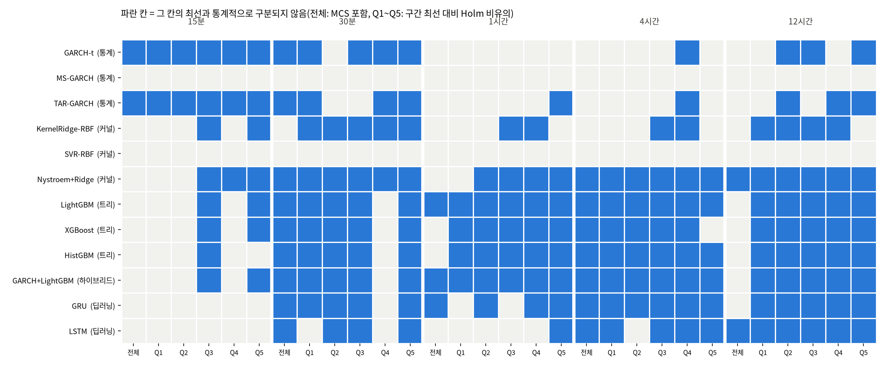

# 26b번: 26번 결과의 견고성·구분 불가 진단·유의성 검정

입력: `test/results/26_timebased_reeval_20261005`(26번, 20종목 × 5구간 × 13모델, 1300행). 재적합 없이 저장된 평가 예측만 쓴다. 데이터 정의와 결측 처리는 `test/research_materials/data_definition.md`, 모델 정의는 `test/research_materials/model_catalog.md`를 본다.

## 1. 시드 견고성(전 모델)

읽은 시드: [0, 1, 2, 3, 4]. 시드 0은 26번 본 실행이다.

**결정적 알고리즘 확인**: 시드를 바꿔 다시 돌린 예측과 시드 0 예측의 최대 절대차(종목·구간 전체).

| 모델 | 최대 절대차 | 판정 |
| :--- | ---: | :--- |
| GARCH-t | 1.41e-08 | 동일(결정적) |

MS-GARCH·TAR-GARCH(고정 시작점의 Nelder-Mead)·KernelRidge·SVR(고정 부분표본)은 난수를 쓰지 않아 시드 실행에서 뺐다. 이 넷의 시드 표준편차는 정의상 0이다.

**무작위 모델의 시드 변동**: 종목·구간마다 시드 간 QLIKE 표준편차를 구해 중앙값을 보인다.

| 모델 | 15분 | 30분 | 1시간 | 4시간 | 12시간 |
| :--- | ---: | ---: | ---: | ---: | ---: |
| GARCH+LightGBM | 0.0037 | 0.0022 | 0.0010 | 0.0012 | 0.0025 |
| GRU | 0.0232 | 0.0125 | 0.0080 | 0.0115 | 0.0158 |
| HistGBM | 0.0000 | 0.0000 | 0.0000 | 0.0000 | 0.0000 |
| LSTM | 0.0198 | 0.0101 | 0.0100 | 0.0131 | 0.0185 |
| LightGBM | 0.0030 | 0.0020 | 0.0013 | 0.0018 | 0.0026 |
| Nystroem+Ridge | 0.0007 | 0.0009 | 0.0005 | 0.0006 | 0.0003 |
| XGBoost | 0.0034 | 0.0036 | 0.0015 | 0.0022 | 0.0020 |

동률 폭 0.01와 비교한다. 시드 표준편차가 이보다 작으면 시드는 결론을 바꾸지 않는다. HistGBM은 표본·특성 추출을 쓰지 않는 설정이라(조기종료도 직접 감시) 시드가 결과에 영향을 주지 않는다.

## 2. 왜 긴 예측 구간에서 모델이 구분되지 않는가: 적합 실패인가, 데이터 특성인가

| 예측 구간 | 평가 시각 수 | LightGBM 반복(중앙) | XGB 반복 | GRU 에폭 | LSTM 에폭 | 로그 모델 보정계수 | 상위 6개 쌍 격차 | 격차/표준오차 | 상위 6개 예측 상관 | 최선 로그 상관 | 최선 MZ R² |
| :--- | ---: | ---: | ---: | ---: | ---: | ---: | ---: | ---: | ---: | ---: | ---: |
| 15분 | 7,827 | 207 | 209 | 18 | 19 | 3.52 | 0.0520 | 5.54 | 0.893 | 0.384 | 0.130 |
| 30분 | 7,822 | 190 | 180 | 22 | 24 | 2.34 | 0.0038 | 1.67 | 0.958 | 0.494 | 0.188 |
| 1시간 | 7,822 | 168 | 171 | 18 | 24 | 1.71 | 0.0042 | 2.22 | 0.970 | 0.555 | 0.262 |
| 4시간 | 1,949 | 132 | 128 | 18 | 22 | 1.30 | 0.0018 | 0.84 | 0.968 | 0.640 | 0.277 |
| 12시간 | 646 | 96 | 100 | 12 | 16 | 1.18 | 0.0029 | 0.96 | 0.944 | 0.656 | 0.318 |

읽는 법: 적합 실패라면 반복 수·에폭이 1 근처에서 멈추거나(학습이 시작되지 않음) 보정계수가 비정상적으로 튄다. 데이터 특성이라면 적합 진단은 정상인데, 평가 시각이 적어 표준오차가 커지고(격차/표준오차가 2보다 작음), 상위 모델의 예측이 서로 거의 같다(예측 상관이 1에 가까움).

## 3. 유의성 검정

시각마다 20종목의 QLIKE 손실차를 평균한 시계열에 DM 검정(Newey-West HAC)을 한다. 종목 간 상관은 이 평균 시계열의 분산에 그대로 들어가므로 종목을 독립 반복으로 세는 문제가 없다. 다중비교는 예측 구간마다 전 모델 쌍에 Holm 보정(유의수준 0.05)을 한다. MCS는 종목 평균 손실 시계열에 블록 부트스트랩으로 돌린다(시각이 연속이라 블록 가정이 성립한다).

### 3-1. 예측 구간별 MCS(모델 신뢰 집합)와 최선 대비 DM

MCS 포함은 "최선이 아니라는 것을 기각할 수 없는 모델"이다. 최선 대비 열세 p는 Holm 보정 후 값이다.

#### 15분 (평가 시각 7,827, 블록 20)

| 모델 | 처리 방식 | 종목 평균 손실 − 최선 | MCS 포함 | 최선 대비 열세 p(Holm) |
| :--- | :--- | ---: | :--- | ---: |
| GARCH-t | 순차·재귀(통계) | +0.0000 | 예 | - |
| TAR-GARCH | 순차·재귀(통계) | +0.0036 | 예 | 1 |
| GRU | 순차·재귀 | +0.0556 | 아니오 | 1.16e-12 |
| Nystroem+Ridge | 특성 기반 회귀(비신경) | +0.0607 | 아니오 | 7.45e-14 |
| LSTM | 순차·재귀 | +0.0655 | 아니오 | 2.96e-16 |
| LightGBM | 특성 기반 트리(비신경) | +0.0694 | 아니오 | 3.98e-18 |
| GARCH+LightGBM | 순차·재귀 통계 + 트리 결합 | +0.0711 | 아니오 | 4.69e-18 |
| XGBoost | 특성 기반 트리(비신경) | +0.0712 | 아니오 | 8.05e-19 |
| HistGBM | 특성 기반 트리(비신경) | +0.0750 | 아니오 | 1.77e-22 |
| KernelRidge-RBF | 특성 기반 회귀(비신경) | +0.0917 | 아니오 | 1.29e-09 |
| SVR-RBF | 특성 기반 회귀(비신경) | +0.1729 | 아니오 | 2.4e-28 |
| MS-GARCH | 순차·재귀(통계) | +0.5806 | 아니오 | 0 |
| naive | 직전값 | +34.1660 | 아니오 | 0.000137 |

#### 30분 (평가 시각 7,822, 블록 20)

| 모델 | 처리 방식 | 종목 평균 손실 − 최선 | MCS 포함 | 최선 대비 열세 p(Holm) |
| :--- | :--- | ---: | :--- | ---: |
| GARCH+LightGBM | 순차·재귀 통계 + 트리 결합 | +0.0000 | 예 | - |
| XGBoost | 특성 기반 트리(비신경) | +0.0011 | 예 | 1 |
| LightGBM | 특성 기반 트리(비신경) | +0.0012 | 예 | 1 |
| HistGBM | 특성 기반 트리(비신경) | +0.0046 | 예 | 0.188 |
| GRU | 순차·재귀 | +0.0073 | 예 | 0.709 |
| LSTM | 순차·재귀 | +0.0085 | 예 | 0.422 |
| GARCH-t | 순차·재귀(통계) | +0.0096 | 예 | 0.564 |
| Nystroem+Ridge | 특성 기반 회귀(비신경) | +0.0100 | 예 | 0.318 |
| TAR-GARCH | 순차·재귀(통계) | +0.0118 | 예 | 0.336 |
| KernelRidge-RBF | 특성 기반 회귀(비신경) | +0.0517 | 아니오 | 0.000975 |
| SVR-RBF | 특성 기반 회귀(비신경) | +0.1092 | 아니오 | 4.53e-20 |
| MS-GARCH | 순차·재귀(통계) | +0.7094 | 아니오 | 0 |
| naive | 직전값 | +2.8972 | 아니오 | 2.55e-72 |

#### 1시간 (평가 시각 7,822, 블록 20)

| 모델 | 처리 방식 | 종목 평균 손실 − 최선 | MCS 포함 | 최선 대비 열세 p(Holm) |
| :--- | :--- | ---: | :--- | ---: |
| GARCH+LightGBM | 순차·재귀 통계 + 트리 결합 | +0.0000 | 예 | - |
| LightGBM | 특성 기반 트리(비신경) | +0.0016 | 예 | 0.997 |
| XGBoost | 특성 기반 트리(비신경) | +0.0030 | 아니오 | 0.0715 |
| GRU | 순차·재귀 | +0.0044 | 예 | 1 |
| HistGBM | 특성 기반 트리(비신경) | +0.0069 | 아니오 | 0.000112 |
| Nystroem+Ridge | 특성 기반 회귀(비신경) | +0.0111 | 아니오 | 0.000112 |
| LSTM | 순차·재귀 | +0.0152 | 아니오 | 5.22e-06 |
| GARCH-t | 순차·재귀(통계) | +0.0356 | 아니오 | 5.01e-17 |
| TAR-GARCH | 순차·재귀(통계) | +0.0361 | 아니오 | 4.9e-22 |
| KernelRidge-RBF | 특성 기반 회귀(비신경) | +0.0652 | 아니오 | 2.22e-10 |
| SVR-RBF | 특성 기반 회귀(비신경) | +0.1376 | 아니오 | 3.65e-31 |
| MS-GARCH | 순차·재귀(통계) | +0.8189 | 아니오 | 0 |
| naive | 직전값 | +1.0763 | 아니오 | 1.01e-104 |

#### 4시간 (평가 시각 1,949, 블록 12)

| 모델 | 처리 방식 | 종목 평균 손실 − 최선 | MCS 포함 | 최선 대비 열세 p(Holm) |
| :--- | :--- | ---: | :--- | ---: |
| Nystroem+Ridge | 특성 기반 회귀(비신경) | +0.0000 | 예 | - |
| XGBoost | 특성 기반 트리(비신경) | +0.0044 | 예 | 1 |
| LightGBM | 특성 기반 트리(비신경) | +0.0047 | 예 | 1 |
| GARCH+LightGBM | 순차·재귀 통계 + 트리 결합 | +0.0060 | 예 | 1 |
| LSTM | 순차·재귀 | +0.0062 | 예 | 1 |
| HistGBM | 특성 기반 트리(비신경) | +0.0076 | 예 | 1 |
| GRU | 순차·재귀 | +0.0084 | 예 | 1 |
| KernelRidge-RBF | 특성 기반 회귀(비신경) | +0.0476 | 아니오 | 0.000315 |
| GARCH-t | 순차·재귀(통계) | +0.0482 | 아니오 | 1.69e-06 |
| TAR-GARCH | 순차·재귀(통계) | +0.0582 | 아니오 | 1.14e-07 |
| SVR-RBF | 특성 기반 회귀(비신경) | +0.1146 | 아니오 | 1.84e-12 |
| naive | 직전값 | +0.6392 | 아니오 | 6.79e-13 |
| MS-GARCH | 순차·재귀(통계) | +0.9279 | 아니오 | 4.72e-91 |

#### 12시간 (평가 시각 646, 블록 9)

| 모델 | 처리 방식 | 종목 평균 손실 − 최선 | MCS 포함 | 최선 대비 열세 p(Holm) |
| :--- | :--- | ---: | :--- | ---: |
| Nystroem+Ridge | 특성 기반 회귀(비신경) | +0.0000 | 예 | - |
| GRU | 순차·재귀 | +0.0126 | 아니오 | 0.17 |
| LightGBM | 특성 기반 트리(비신경) | +0.0132 | 아니오 | 0.101 |
| LSTM | 순차·재귀 | +0.0135 | 예 | 1 |
| GARCH+LightGBM | 순차·재귀 통계 + 트리 결합 | +0.0152 | 아니오 | 0.0119 |
| XGBoost | 특성 기반 트리(비신경) | +0.0164 | 아니오 | 0.00392 |
| HistGBM | 특성 기반 트리(비신경) | +0.0186 | 아니오 | 0.0035 |
| KernelRidge-RBF | 특성 기반 회귀(비신경) | +0.0525 | 아니오 | 0.0366 |
| GARCH-t | 순차·재귀(통계) | +0.0715 | 아니오 | 2.24e-05 |
| TAR-GARCH | 순차·재귀(통계) | +0.0992 | 아니오 | 1.37e-16 |
| SVR-RBF | 특성 기반 회귀(비신경) | +0.1554 | 아니오 | 2.58e-08 |
| naive | 직전값 | +0.1642 | 아니오 | 1.13e-05 |
| MS-GARCH | 순차·재귀(통계) | +0.8819 | 아니오 | 1.25e-67 |

### 3-2. 사전 구간별 통계적 동률 집합

종목마다 사전 구간(직전 RV, 학습 구간 분위수)이 다르므로, 시각마다 그 구간에 든 종목들만으로 손실차를 평균한 시계열을 만들어 HAC 검정을 한다(해당 종목이 없는 시각은 빠진다). 구간 최선 모델 대비 열세가 Holm 보정 후 유의하지 않은 모델을 통계적 동률로 본다.

| 예측 구간 | 구간 | 최선 | 통계적 동률(최선 대비 열세가 유의하지 않음) |
| :--- | :--- | :--- | :--- |
| 15분 | Q1 | TAR-GARCH | GARCH-t |
| 15분 | Q2 | GARCH-t | TAR-GARCH |
| 15분 | Q3 | GARCH-t | TAR-GARCH, Nys, LGBM, G+LGBM, XGB, HGB, KRR |
| 15분 | Q4 | Nystroem+Ridge | TAR-GARCH, GARCH-t |
| 15분 | Q5 | GARCH-t | TAR-GARCH, Nys, LGBM, G+LGBM, XGB, naive, KRR |
| 30분 | Q1 | TAR-GARCH | GARCH-t, HGB, LGBM, XGB, G+LGBM, GRU, KRR, Nys |
| 30분 | Q2 | GARCH+LightGBM | GRU, LSTM, XGB, LGBM, HGB, Nys, KRR |
| 30분 | Q3 | GARCH+LightGBM | HGB, XGB, LGBM, Nys, LSTM, GRU, KRR, GARCH-t |
| 30분 | Q4 | Nystroem+Ridge | TAR-GARCH, KRR, GARCH-t |
| 30분 | Q5 | GRU | Nys, LGBM, G+LGBM, XGB, GARCH-t, LSTM, HGB, TAR-GARCH, naive, KRR |
| 1시간 | Q1 | GARCH+LightGBM | LGBM, XGB, HGB |
| 1시간 | Q2 | GARCH+LightGBM | LGBM, XGB, Nys, HGB, GRU |
| 1시간 | Q3 | GARCH+LightGBM | LGBM, XGB, Nys, HGB, KRR |
| 1시간 | Q4 | GARCH+LightGBM | Nys, LGBM, XGB, HGB, GRU, KRR |
| 1시간 | Q5 | GRU | LSTM, G+LGBM, LGBM, XGB, Nys, HGB, naive, TAR-GARCH |
| 4시간 | Q1 | GARCH+LightGBM | XGB, Nys, LGBM, HGB, GRU, LSTM |
| 4시간 | Q2 | Nystroem+Ridge | XGB, LGBM, G+LGBM, GRU, HGB |
| 4시간 | Q3 | Nystroem+Ridge | LGBM, G+LGBM, XGB, HGB, LSTM, KRR, GRU |
| 4시간 | Q4 | Nystroem+Ridge | XGB, LSTM, GRU, LGBM, G+LGBM, HGB, KRR, GARCH-t, TAR-GARCH, naive |
| 4시간 | Q5 | LSTM | GRU, HGB, Nys, LGBM, G+LGBM |
| 12시간 | Q1 | Nystroem+Ridge | LGBM, KRR, G+LGBM, XGB, LSTM, HGB, GRU |
| 12시간 | Q2 | Nystroem+Ridge | G+LGBM, LGBM, XGB, KRR, GRU, GARCH-t, HGB, LSTM, TAR-GARCH |
| 12시간 | Q3 | Nystroem+Ridge | XGB, LGBM, G+LGBM, GRU, KRR, HGB, LSTM, GARCH-t, naive |
| 12시간 | Q4 | Nystroem+Ridge | GRU, LSTM, naive, LGBM, G+LGBM, XGB, HGB, KRR, TAR-GARCH |
| 12시간 | Q5 | GRU | naive, Nys, LSTM, XGB, G+LGBM, LGBM, HGB, TAR-GARCH, GARCH-t |

### 3-3. 시드를 바꿔도 MCS 판정이 유지되는가

무작위 모델(트리·Nystroem·GRU·LSTM)의 예측만 시드 1~4의 것으로 바꾸고, 나머지 모델은 그대로 둔 채 같은 MCS를 다시 돌렸다. 셀은 시드 5개 중 MCS에 포함된 횟수다.

| 모델 | 15분(/5) | 30분(/5) | 1시간(/5) | 4시간(/5) | 12시간(/5) |
| :--- | ---: | ---: | ---: | ---: | ---: |
| naive | 0 | 0 | 0 | 0 | 0 |
| GARCH-t | 5 | 4 | 0 | 0 | 0 |
| MS-GARCH | 0 | 0 | 0 | 0 | 0 |
| TAR-GARCH | 5 | 4 | 0 | 0 | 0 |
| KernelRidge-RBF | 0 | 0 | 0 | 0 | 0 |
| SVR-RBF | 0 | 0 | 0 | 0 | 0 |
| Nystroem+Ridge | 0 | 3 | 0 | 5 | 5 |
| LightGBM | 0 | 5 | 3 | 5 | 0 |
| XGBoost | 0 | 5 | 2 | 5 | 0 |
| HistGBM | 0 | 1 | 0 | 5 | 0 |
| GARCH+LightGBM | 0 | 5 | 5 | 5 | 1 |
| GRU | 0 | 4 | 3 | 4 | 3 |
| LSTM | 0 | 2 | 0 | 3 | 5 |

## 4. 실무 동률(A등급, 0.01)과 통계 판정의 일치

| 예측 구간 | A등급(0.01 이내) | MCS 포함 | 둘 다 | A등급만 | MCS만 |
| :--- | :--- | :--- | :--- | :--- | :--- |
| 15분 | GARCH-t, TAR-GARCH | GARCH-t, TAR-GARCH | GARCH-t, TAR-GARCH | - | - |
| 30분 | G+LGBM, GARCH-t, GRU, HGB, LSTM, LGBM, XGB | G+LGBM, GARCH-t, GRU, HGB, LSTM, LGBM, Nys, TAR-GARCH, XGB | G+LGBM, GARCH-t, GRU, HGB, LSTM, LGBM, XGB | - | Nys, TAR-GARCH |
| 1시간 | G+LGBM, GRU, HGB, LGBM, XGB | G+LGBM, GRU, LGBM | G+LGBM, GRU, LGBM | HGB, XGB | - |
| 4시간 | G+LGBM, GRU, HGB, LSTM, LGBM, Nys, XGB | G+LGBM, GRU, HGB, LSTM, LGBM, Nys, XGB | G+LGBM, GRU, HGB, LSTM, LGBM, Nys, XGB | - | - |
| 12시간 | Nys | LSTM, Nys | Nys | - | LSTM |

## 5. 예측 구간별 선형성 재검정(선형 모델 제외 결정의 근거 확인)

2026-09-07 가정 진단에서 선형성 검정(RESET·BDS)이 기각되어 Linear·Ridge는 비선형·커널 계열로 대체하기로 결정했다(이 분석의 순위·검정에서 제외). 그 판정은 1시간 타깃 기준이었으므로, 예측 구간마다 같은 판정이 유지되는지 다시 본다(HAR-RV도 같은 이유로 제외). 표본이 수만 개면 아주 작은 비선형도 기각되므로, 종목마다 학습 표본을 최근 5,000개(긴 구간은 H시간 간격으로 겹침을 줄여 뽑은 수)로 맞추고 **비선형 항이 늘리는 설명력의 크기**를 함께 본다.

| 예측 구간 | 표본(중앙) | 선형 R²(중앙) | 비선형 항 증분 R²(중앙) | RESET 기각 종목 | BDS 기각 종목 | 트리 최선 격차 |
| :--- | ---: | ---: | ---: | ---: | ---: | ---: |
| 15분 | 5,000 | 0.122 | 0.0034 | 14/20 | 11/20 | 0.069 |
| 30분 | 5,000 | 0.218 | 0.0022 | 13/20 | 6/20 | 0.000 |
| 1시간 | 5,000 | 0.302 | 0.0027 | 17/20 | 10/20 | 0.000 |
| 4시간 | 4,534 | 0.475 | 0.0015 | 16/20 | 12/20 | 0.004 |
| 12시간 | 1,497 | 0.508 | 0.0011 | 6/20 | 13/20 | 0.013 |

읽는 법: 격차는 그 구간 최선 모델 대비 QLIKE 차(26번 보정후, 종목 평균)다. 선형 R²가 예측 구간과 함께 커지면 긴 구간에서 선형 근사로 충분해진다는 뜻이다(변동성을 길게 합산할수록 잡음이 평균으로 줄어든다). 비선형 항 증분이 작아도 짧은 구간에서 트리가 선형보다 크게 앞서면, 그 비선형은 RESET이 보는 거듭제곱 형태가 아니라 문턱·상호작용 형태라는 뜻이다. BDS는 잔차의 독립성 위반 전반(이분산 포함)을 잡으므로 선형성만의 검정이 아니다.

