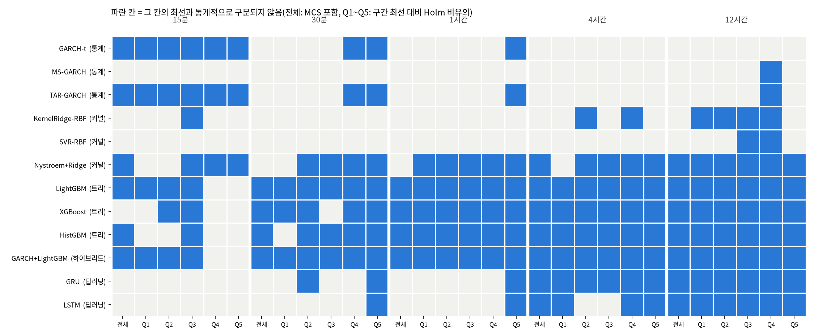

# 26b번: 26c번 결과의 견고성·구분 불가 진단·유의성 검정

입력: `test/results/26c_recent_twopart_20261005`(26c번, 20종목 × 5구간 × 13모델, 1300행). 재적합 없이 저장된 평가 예측만 쓴다. 데이터 정의와 결측 처리는 `test/research_materials/data_definition.md`, 모델 정의는 `test/research_materials/model_catalog.md`를 본다.

## 0. 검정 설계와 읽는 법

모든 검정의 관측 단위는 **평가 시각 t**(정시)이다. 모델 m의 시각 t, 종목 k 손실을 `L[m][k,t] = QLIKE(실제 RV, 예측)`라고 쓴다. 두 모델은 같은 시각·같은 종목에서 비교하므로 독립 두 표본이 아니라 **대응(paired) 표본**이며, 비교 집단은 "A의 손실들"과 "B의 손실들"이 아니라 그 시각별 차이 한 줄이다. 시각마다 20종목을 평균하므로 종목 간 상관은 그 평균 시계열의 분산에 그대로 들어간다(종목을 독립 반복으로 세지 않는다). 모든 p값은 양측이고 유의수준은 0.05이다. **p값이 작아 H0가 기각된다는 것은 "차이가 있다는 증거가 있다"는 뜻이고, 기각하지 못한다는 것은 "같다고 증명했다"가 아니라 "차이가 있다는 증거가 부족하다"는 뜻이다.** 평가 시각이 적은 긴 예측 구간에서는 증거가 부족해서 기각하지 못하는 경우가 많다.

| 번호 | 검정 | 비교 집단(코드) | 귀무가설 H0 | 대립가설 H1 | 통계량·보정 | H0 기각의 의미 |
| :--- | :--- | :--- | :--- | :--- | :--- | :--- |
| 3-1a | Diebold-Mariano(대응 t, HAC) | `d_t = (L[A]-L[B]).mean(axis=1)`, 한 예측 구간의 모델 쌍마다 | E[d_t]=0, 두 모델의 기대 QLIKE가 같다 | E[d_t]≠0 | t=평균/SE, SE는 Newey-West(lag=⌊4(n/100)^(2/9)⌋, Bartlett). 구간마다 전 쌍에 Holm | 한쪽이 평균적으로 더 낫다(방향은 평균차의 부호) |
| 3-1b | MCS(Hansen·Lunde·Nason 2011) | 한 구간의 시각×모델 평균 손실 행렬 전체 | 현재 집합의 모델들이 모두 동등한 예측 능력 | 집합에 기대 손실이 더 큰 모델이 있다 | 블록 부트스트랩(블록=n^(1/3), 2,000회), 기각되면 가장 나쁜 모델을 빼고 반복 | 기각되어 빠진 모델은 최선과 구분되는 열세, 남은 집합은 "최선이 아니라고 기각할 수 없는" 모델 |
| 3-2 | 사전 구간별 DM | `(L[m]-L[best]).where(Q==q).mean(axis=1)`, 직전 H시간 RV 5분위(학습 구간 분위수) 칸마다 | 그 칸에서 m과 최선의 기대 손실이 같다 | 다르다 | HAC t, 칸마다 Holm. 기각하지 못한 모델을 통계적 동률로 부른다 | 그 칸에서 m이 최선보다 열세 |
| 3-3 | 시드별 MCS 반복 | 무작위 모델의 예측만 시드 s의 것으로 바꿔 MCS를 5번 | (검정이 아니라 안정성 점검) | | 시드 5개 중 포함 횟수 | 5/5는 시드와 무관한 판정, 1~4는 시드에 따라 달라짐, 0/5는 항상 제외 |
| 1 | 시드 변동 | 시드 5개의 모델×종목×구간 평균 QLIKE 표준편차 | (기술통계) | | 중앙값을 동률 폭 0.01과 비교 | 0.01보다 크면 그 모델끼리의 순위 차이는 시드 잡음일 수 있음 |
| 2 | 구분 불가 진단 | 상위 6개 모델 쌍의 |평균차|/SE, 예측 상관, 적합 지표 | (진단) | | 격차/SE<2이고 상관≈1이면 데이터·표본 한계 | 적합 지표가 정상인데 격차/SE가 작으면 "적합 실패가 아니다" |
| 5 | RESET 선형성 | 학습 표본 5,000개로 OLS(y=log RV_d, X=로그 특성), 적합값²·³ 항 추가 | 선형 모형의 함수형이 옳다(두 항 계수=0) | 비선형 구조가 있다 | F 검정, 종목마다 | 기각이면 선형 모델에 부적합(제외 결정의 근거) |
| 5 | BDS 독립성 | 위 OLS 잔차 마지막 3,000개 | 잔차가 i.i.d.다 | 비선형·이분산 의존이 남아 있다 | BDS 통계량(차원 2) | 기각이면 선형 모형이 구조를 놓침(이분산 포함이라 선형성만의 검정은 아님) |
| 6 | 두 부분 대 단일 DM | `(L[두 부분]-L[단일]).mean(axis=1)`, 같은 모델의 같은 예측에 결합만 다름 | 두 결합의 기대 손실이 같다 | 다르다 | HAC t, 구간×모델 전체에 Holm | 정지 확률을 따로 곱하는 것이 손실을 바꾼다(부호가 음수면 개선) |

**통계 검정이 아닌 실무 기준**: A등급(최선과 QLIKE 격차 ≤0.01)은 GRU 시드 표준편차에서 가져온 값으로, 가설검정이 아니라 "이보다 작은 차이는 모델 차이로 보지 않는다"는 약속이다. 통계 판정(MCS)과 일치하는지는 4절에서 비교한다.

## 1. 시드 견고성(전 모델)

읽은 시드: [0, 1, 2, 3, 4]. 시드 0은 26c번 본 실행이다.

**결정적 알고리즘 확인**: 시드를 바꿔 다시 돌린 예측과 시드 0 예측의 최대 절대차(종목·구간 전체).

| 모델 | 최대 절대차 | 판정 |
| :--- | ---: | :--- |
| GARCH-t | 0.00e+00 | 동일(결정적) |

MS-GARCH·TAR-GARCH(고정 시작점의 Nelder-Mead)·KernelRidge·SVR(고정 부분표본)은 난수를 쓰지 않아 시드 실행에서 뺐다. 이 넷의 시드 표준편차는 정의상 0이다.

**무작위 모델의 시드 변동**: 종목·구간마다 시드 간 QLIKE 표준편차를 구해 중앙값을 보인다.

| 모델 | 15분 | 30분 | 1시간 | 4시간 | 12시간 |
| :--- | ---: | ---: | ---: | ---: | ---: |
| GARCH+LightGBM | 0.0051 | 0.0020 | 0.0012 | 0.0016 | 0.0029 |
| GRU | 0.0379 | 0.0271 | 0.0121 | 0.0135 | 0.0109 |
| HistGBM | 0.0015 | 0.0005 | 0.0001 | 0.0000 | 0.0000 |
| LSTM | 0.0567 | 0.0277 | 0.0150 | 0.0115 | 0.0140 |
| LightGBM | 0.0032 | 0.0017 | 0.0012 | 0.0019 | 0.0025 |
| Nystroem+Ridge | 0.0026 | 0.0016 | 0.0011 | 0.0007 | 0.0008 |
| XGBoost | 0.0056 | 0.0019 | 0.0011 | 0.0020 | 0.0031 |

동률 폭 0.01와 비교한다. 시드 표준편차가 이보다 작으면 시드는 결론을 바꾸지 않는다. HistGBM은 표본·특성 추출을 쓰지 않는 설정이라(조기종료도 직접 감시) 시드가 결과에 영향을 주지 않는다.

**해석(모델마다)**:
- GARCH+LightGBM: 모든 구간에서 시드 표준편차가 0.01 이하(최대 0.0051). 시드는 이 모델의 순위를 바꾸지 않는다.
- GRU: 15분, 30분, 1시간, 4시간, 12시간에서 표준편차가 0.01를 넘는다(최대 0.0379). 이 구간들에서 이 모델과 다른 모델의 순위·동률 판정은 시드 한 개로 확정할 수 없고, 시드 평균과 시드별 MCS 빈도(3-3절)로 봐야 한다.
- HistGBM: 모든 구간에서 시드 표준편차가 0.01 이하(최대 0.0015). 시드는 이 모델의 순위를 바꾸지 않는다.
- LSTM: 15분, 30분, 1시간, 4시간, 12시간에서 표준편차가 0.01를 넘는다(최대 0.0567). 이 구간들에서 이 모델과 다른 모델의 순위·동률 판정은 시드 한 개로 확정할 수 없고, 시드 평균과 시드별 MCS 빈도(3-3절)로 봐야 한다.
- LightGBM: 모든 구간에서 시드 표준편차가 0.01 이하(최대 0.0032). 시드는 이 모델의 순위를 바꾸지 않는다.
- Nystroem+Ridge: 모든 구간에서 시드 표준편차가 0.01 이하(최대 0.0026). 시드는 이 모델의 순위를 바꾸지 않는다.
- XGBoost: 모든 구간에서 시드 표준편차가 0.01 이하(최대 0.0056). 시드는 이 모델의 순위를 바꾸지 않는다.

## 2. 왜 긴 예측 구간에서 모델이 구분되지 않는가: 적합 실패인가, 데이터 특성인가

| 예측 구간 | 평가 시각 수 | LightGBM 반복(중앙) | XGB 반복 | GRU 에폭 | LSTM 에폭 | 로그 모델 보정계수 | 상위 6개 쌍 격차 | 격차/표준오차 | 상위 6개 예측 상관 | 최선 로그 상관 | 최선 MZ R² |
| :--- | ---: | ---: | ---: | ---: | ---: | ---: | ---: | ---: | ---: | ---: | ---: |
| 15분 | 7,878 | 121 | 118 | 18 | 14 | 3.66 | 0.0133 | 1.43 | 0.912 | 0.395 | 0.156 |
| 30분 | 7,874 | 128 | 139 | 20 | 16 | 2.31 | 0.0096 | 2.55 | 0.949 | 0.481 | 0.238 |
| 1시간 | 7,873 | 150 | 148 | 22 | 23 | 1.68 | 0.0072 | 2.70 | 0.969 | 0.554 | 0.292 |
| 4시간 | 1,964 | 154 | 162 | 20 | 20 | 1.30 | 0.0013 | 0.32 | 0.963 | 0.640 | 0.316 |
| 12시간 | 651 | 134 | 138 | 11 | 18 | 1.18 | 0.0048 | 0.59 | 0.935 | 0.668 | 0.359 |

읽는 법: 적합 실패라면 반복 수·에폭이 1 근처에서 멈추거나(학습이 시작되지 않음) 보정계수가 비정상적으로 튄다. 데이터 특성이라면 적합 진단은 정상인데, 평가 시각이 적어 표준오차가 커지고(격차/표준오차가 2보다 작음), 상위 모델의 예측이 서로 거의 같다(예측 상관이 1에 가까움).

**해석(예측 구간마다)**:
- 15분: 적합 지표는 정상(반복·에폭이 1 근처가 아니고 보정계수 3.66). 상위 6개 모델 쌍의 격차는 표준오차의 1.43배로 2배 미만이라 쌍 검정으로 구분할 수 없다, 예측 상관 0.912, 최선 모델의 로그 상관 0.395(MZ R² 0.156). **결론: 적합 실패가 아니라 표본 수와 모델 예측의 유사성 때문이다.**
- 30분: 적합 지표는 정상(반복·에폭이 1 근처가 아니고 보정계수 2.31). 상위 6개 모델 쌍의 격차는 표준오차의 2.55배로 2배 이상이라 쌍 검정으로 구분 가능한 쌍이 있다, 예측 상관 0.949, 최선 모델의 로그 상관 0.481(MZ R² 0.238). **결론: 이 구간은 모델 구분이 가능하다.**
- 1시간: 적합 지표는 정상(반복·에폭이 1 근처가 아니고 보정계수 1.68). 상위 6개 모델 쌍의 격차는 표준오차의 2.70배로 2배 이상이라 쌍 검정으로 구분 가능한 쌍이 있다, 예측 상관 0.969, 최선 모델의 로그 상관 0.554(MZ R² 0.292). **결론: 이 구간은 모델 구분이 가능하다.**
- 4시간: 적합 지표는 정상(반복·에폭이 1 근처가 아니고 보정계수 1.30). 상위 6개 모델 쌍의 격차는 표준오차의 0.32배로 2배 미만이라 쌍 검정으로 구분할 수 없다, 예측 상관 0.963, 최선 모델의 로그 상관 0.640(MZ R² 0.316). **결론: 적합 실패가 아니라 표본 수와 모델 예측의 유사성 때문이다.**
- 12시간: 적합 지표는 정상(반복·에폭이 1 근처가 아니고 보정계수 1.18). 상위 6개 모델 쌍의 격차는 표준오차의 0.59배로 2배 미만이라 쌍 검정으로 구분할 수 없다, 예측 상관 0.935, 최선 모델의 로그 상관 0.668(MZ R² 0.359). **결론: 적합 실패가 아니라 표본 수와 모델 예측의 유사성 때문이다.**

## 3. 유의성 검정

시각마다 20종목의 QLIKE 손실차를 평균한 시계열에 DM 검정(Newey-West HAC)을 한다. 종목 간 상관은 이 평균 시계열의 분산에 그대로 들어가므로 종목을 독립 반복으로 세는 문제가 없다. 다중비교는 예측 구간마다 전 모델 쌍에 Holm 보정(유의수준 0.05)을 한다. MCS는 종목 평균 손실 시계열에 블록 부트스트랩으로 돌린다(시각이 연속이라 블록 가정이 성립한다).

### 3-1. 예측 구간별 MCS(모델 신뢰 집합)와 최선 대비 DM

MCS 포함은 "최선이 아니라는 것을 기각할 수 없는 모델"이다. 최선 대비 열세 p는 Holm 보정 후 값이다.

#### 15분 (평가 시각 7,878, 블록 20)

| 모델 | 처리 방식 | 종목 평균 손실 − 최선 | MCS 포함 | 최선 대비 열세 p(Holm) |
| :--- | :--- | ---: | :--- | ---: |
| GARCH-t | 순차·재귀(통계) | +0.0000 | 예 | - |
| TAR-GARCH | 순차·재귀(통계) | +0.0027 | 예 | 1 |
| Nystroem+Ridge | 특성 기반 회귀(비신경) | +0.0045 | 예 | 1 |
| HistGBM | 특성 기반 트리(비신경) | +0.0162 | 예 | 1 |
| GARCH+LightGBM | 순차·재귀 통계 + 트리 결합 | +0.0177 | 예 | 0.286 |
| LightGBM | 특성 기반 트리(비신경) | +0.0214 | 예 | 0.12 |
| XGBoost | 특성 기반 트리(비신경) | +0.0345 | 아니오 | 0.00294 |
| KernelRidge-RBF | 특성 기반 회귀(비신경) | +0.0890 | 아니오 | 3.88e-07 |
| SVR-RBF | 특성 기반 회귀(비신경) | +0.1022 | 아니오 | 5.32e-13 |
| LSTM | 순차·재귀 | +0.1370 | 아니오 | 6.64e-45 |
| GRU | 순차·재귀 | +0.1686 | 아니오 | 1.33e-34 |
| MS-GARCH | 순차·재귀(통계) | +1.5314 | 아니오 | 2.16e-186 |
| naive | 직전값 | +32.4376 | 아니오 | 0.000238 |

**해석(15분, 모델마다 H0: 최선 `GARCH-t`와 기대 손실이 같다)**:
- GARCH-t: 평균 손실이 가장 작아 비교 기준이 된다(MCS 포함 여부와 무관하게 "유일한 최선"이라는 뜻은 아니다).
- TAR-GARCH: 최선보다 평균 +0.0027 크지만 Holm 보정 p=1로 **H0를 기각하지 못했다**(MCS 포함). 곧 최선과 다르다는 증거가 부족해 통계적으로 구분되지 않는다(같다는 증명은 아니다).
- Nystroem+Ridge: 최선보다 평균 +0.0045 크지만 Holm 보정 p=1로 **H0를 기각하지 못했다**(MCS 포함). 곧 최선과 다르다는 증거가 부족해 통계적으로 구분되지 않는다(같다는 증명은 아니다).
- HistGBM: 최선보다 평균 +0.0162 크지만 Holm 보정 p=1로 **H0를 기각하지 못했다**(MCS 포함). 곧 최선과 다르다는 증거가 부족해 통계적으로 구분되지 않는다(같다는 증명은 아니다).
- GARCH+LightGBM: 최선보다 평균 +0.0177 크지만 Holm 보정 p=0.286로 **H0를 기각하지 못했다**(MCS 포함). 곧 최선과 다르다는 증거가 부족해 통계적으로 구분되지 않는다(같다는 증명은 아니다).
- LightGBM: 최선보다 평균 +0.0214 크지만 Holm 보정 p=0.12로 **H0를 기각하지 못했다**(MCS 포함). 곧 최선과 다르다는 증거가 부족해 통계적으로 구분되지 않는다(같다는 증명은 아니다).
- XGBoost: 최선보다 평균 +0.0345 크고 Holm 보정 p=0.00294로 **H0를 기각**했다(MCS 제외). 곧 이 모델의 기대 손실이 최선보다 유의하게 크다, 즉 열세다.
- KernelRidge-RBF: 최선보다 평균 +0.0890 크고 Holm 보정 p=3.88e-07로 **H0를 기각**했다(MCS 제외). 곧 이 모델의 기대 손실이 최선보다 유의하게 크다, 즉 열세다.
- SVR-RBF: 최선보다 평균 +0.1022 크고 Holm 보정 p=5.32e-13로 **H0를 기각**했다(MCS 제외). 곧 이 모델의 기대 손실이 최선보다 유의하게 크다, 즉 열세다.
- LSTM: 최선보다 평균 +0.1370 크고 Holm 보정 p=6.64e-45로 **H0를 기각**했다(MCS 제외). 곧 이 모델의 기대 손실이 최선보다 유의하게 크다, 즉 열세다.
- GRU: 최선보다 평균 +0.1686 크고 Holm 보정 p=1.33e-34로 **H0를 기각**했다(MCS 제외). 곧 이 모델의 기대 손실이 최선보다 유의하게 크다, 즉 열세다.
- MS-GARCH: 최선보다 평균 +1.5314 크고 Holm 보정 p=2.16e-186로 **H0를 기각**했다(MCS 제외). 곧 이 모델의 기대 손실이 최선보다 유의하게 크다, 즉 열세다.
- naive: 최선보다 평균 +32.4376 크고 Holm 보정 p=0.000238로 **H0를 기각**했다(MCS 제외). 곧 이 모델의 기대 손실이 최선보다 유의하게 크다, 즉 열세다.

#### 30분 (평가 시각 7,874, 블록 20)

| 모델 | 처리 방식 | 종목 평균 손실 − 최선 | MCS 포함 | 최선 대비 열세 p(Holm) |
| :--- | :--- | ---: | :--- | ---: |
| HistGBM | 특성 기반 트리(비신경) | +0.0000 | 예 | - |
| LightGBM | 특성 기반 트리(비신경) | +0.0028 | 예 | 1 |
| GARCH+LightGBM | 순차·재귀 통계 + 트리 결합 | +0.0031 | 예 | 1 |
| XGBoost | 특성 기반 트리(비신경) | +0.0054 | 예 | 0.648 |
| Nystroem+Ridge | 특성 기반 회귀(비신경) | +0.0127 | 아니오 | 1.81e-06 |
| GARCH-t | 순차·재귀(통계) | +0.0307 | 아니오 | 5.22e-05 |
| TAR-GARCH | 순차·재귀(통계) | +0.0319 | 아니오 | 1.37e-05 |
| GRU | 순차·재귀 | +0.0464 | 아니오 | 2.54e-26 |
| LSTM | 순차·재귀 | +0.0681 | 아니오 | 6.24e-40 |
| KernelRidge-RBF | 특성 기반 회귀(비신경) | +0.0914 | 아니오 | 6.22e-11 |
| SVR-RBF | 특성 기반 회귀(비신경) | +0.1284 | 아니오 | 6.79e-45 |
| MS-GARCH | 순차·재귀(통계) | +1.8093 | 아니오 | 2.52e-308 |
| naive | 직전값 | +2.6399 | 아니오 | 1.08e-63 |

**해석(30분, 모델마다 H0: 최선 `HistGBM`와 기대 손실이 같다)**:
- HistGBM: 평균 손실이 가장 작아 비교 기준이 된다(MCS 포함 여부와 무관하게 "유일한 최선"이라는 뜻은 아니다).
- LightGBM: 최선보다 평균 +0.0028 크지만 Holm 보정 p=1로 **H0를 기각하지 못했다**(MCS 포함). 곧 최선과 다르다는 증거가 부족해 통계적으로 구분되지 않는다(같다는 증명은 아니다).
- GARCH+LightGBM: 최선보다 평균 +0.0031 크지만 Holm 보정 p=1로 **H0를 기각하지 못했다**(MCS 포함). 곧 최선과 다르다는 증거가 부족해 통계적으로 구분되지 않는다(같다는 증명은 아니다).
- XGBoost: 최선보다 평균 +0.0054 크지만 Holm 보정 p=0.648로 **H0를 기각하지 못했다**(MCS 포함). 곧 최선과 다르다는 증거가 부족해 통계적으로 구분되지 않는다(같다는 증명은 아니다).
- Nystroem+Ridge: 최선보다 평균 +0.0127 크고 Holm 보정 p=1.81e-06로 **H0를 기각**했다(MCS 제외). 곧 이 모델의 기대 손실이 최선보다 유의하게 크다, 즉 열세다.
- GARCH-t: 최선보다 평균 +0.0307 크고 Holm 보정 p=5.22e-05로 **H0를 기각**했다(MCS 제외). 곧 이 모델의 기대 손실이 최선보다 유의하게 크다, 즉 열세다.
- TAR-GARCH: 최선보다 평균 +0.0319 크고 Holm 보정 p=1.37e-05로 **H0를 기각**했다(MCS 제외). 곧 이 모델의 기대 손실이 최선보다 유의하게 크다, 즉 열세다.
- GRU: 최선보다 평균 +0.0464 크고 Holm 보정 p=2.54e-26로 **H0를 기각**했다(MCS 제외). 곧 이 모델의 기대 손실이 최선보다 유의하게 크다, 즉 열세다.
- LSTM: 최선보다 평균 +0.0681 크고 Holm 보정 p=6.24e-40로 **H0를 기각**했다(MCS 제외). 곧 이 모델의 기대 손실이 최선보다 유의하게 크다, 즉 열세다.
- KernelRidge-RBF: 최선보다 평균 +0.0914 크고 Holm 보정 p=6.22e-11로 **H0를 기각**했다(MCS 제외). 곧 이 모델의 기대 손실이 최선보다 유의하게 크다, 즉 열세다.
- SVR-RBF: 최선보다 평균 +0.1284 크고 Holm 보정 p=6.79e-45로 **H0를 기각**했다(MCS 제외). 곧 이 모델의 기대 손실이 최선보다 유의하게 크다, 즉 열세다.
- MS-GARCH: 최선보다 평균 +1.8093 크고 Holm 보정 p=2.52e-308로 **H0를 기각**했다(MCS 제외). 곧 이 모델의 기대 손실이 최선보다 유의하게 크다, 즉 열세다.
- naive: 최선보다 평균 +2.6399 크고 Holm 보정 p=1.08e-63로 **H0를 기각**했다(MCS 제외). 곧 이 모델의 기대 손실이 최선보다 유의하게 크다, 즉 열세다.

#### 1시간 (평가 시각 7,873, 블록 20)

| 모델 | 처리 방식 | 종목 평균 손실 − 최선 | MCS 포함 | 최선 대비 열세 p(Holm) |
| :--- | :--- | ---: | :--- | ---: |
| GARCH+LightGBM | 순차·재귀 통계 + 트리 결합 | +0.0000 | 예 | - |
| LightGBM | 특성 기반 트리(비신경) | +0.0006 | 예 | 1 |
| XGBoost | 특성 기반 트리(비신경) | +0.0015 | 예 | 1 |
| HistGBM | 특성 기반 트리(비신경) | +0.0018 | 예 | 1 |
| Nystroem+Ridge | 특성 기반 회귀(비신경) | +0.0087 | 아니오 | 0.00308 |
| LSTM | 순차·재귀 | +0.0207 | 아니오 | 8.49e-10 |
| GRU | 순차·재귀 | +0.0241 | 아니오 | 1.52e-11 |
| GARCH-t | 순차·재귀(통계) | +0.0509 | 아니오 | 1.37e-28 |
| TAR-GARCH | 순차·재귀(통계) | +0.0510 | 아니오 | 1.36e-35 |
| KernelRidge-RBF | 특성 기반 회귀(비신경) | +0.0808 | 아니오 | 1.65e-11 |
| SVR-RBF | 특성 기반 회귀(비신경) | +0.1452 | 아니오 | 7.04e-45 |
| naive | 직전값 | +0.9995 | 아니오 | 5.34e-143 |
| MS-GARCH | 순차·재귀(통계) | +2.3250 | 아니오 | 1.62e-258 |

**해석(1시간, 모델마다 H0: 최선 `GARCH+LightGBM`와 기대 손실이 같다)**:
- GARCH+LightGBM: 평균 손실이 가장 작아 비교 기준이 된다(MCS 포함 여부와 무관하게 "유일한 최선"이라는 뜻은 아니다).
- LightGBM: 최선보다 평균 +0.0006 크지만 Holm 보정 p=1로 **H0를 기각하지 못했다**(MCS 포함). 곧 최선과 다르다는 증거가 부족해 통계적으로 구분되지 않는다(같다는 증명은 아니다).
- XGBoost: 최선보다 평균 +0.0015 크지만 Holm 보정 p=1로 **H0를 기각하지 못했다**(MCS 포함). 곧 최선과 다르다는 증거가 부족해 통계적으로 구분되지 않는다(같다는 증명은 아니다).
- HistGBM: 최선보다 평균 +0.0018 크지만 Holm 보정 p=1로 **H0를 기각하지 못했다**(MCS 포함). 곧 최선과 다르다는 증거가 부족해 통계적으로 구분되지 않는다(같다는 증명은 아니다).
- Nystroem+Ridge: 최선보다 평균 +0.0087 크고 Holm 보정 p=0.00308로 **H0를 기각**했다(MCS 제외). 곧 이 모델의 기대 손실이 최선보다 유의하게 크다, 즉 열세다.
- LSTM: 최선보다 평균 +0.0207 크고 Holm 보정 p=8.49e-10로 **H0를 기각**했다(MCS 제외). 곧 이 모델의 기대 손실이 최선보다 유의하게 크다, 즉 열세다.
- GRU: 최선보다 평균 +0.0241 크고 Holm 보정 p=1.52e-11로 **H0를 기각**했다(MCS 제외). 곧 이 모델의 기대 손실이 최선보다 유의하게 크다, 즉 열세다.
- GARCH-t: 최선보다 평균 +0.0509 크고 Holm 보정 p=1.37e-28로 **H0를 기각**했다(MCS 제외). 곧 이 모델의 기대 손실이 최선보다 유의하게 크다, 즉 열세다.
- TAR-GARCH: 최선보다 평균 +0.0510 크고 Holm 보정 p=1.36e-35로 **H0를 기각**했다(MCS 제외). 곧 이 모델의 기대 손실이 최선보다 유의하게 크다, 즉 열세다.
- KernelRidge-RBF: 최선보다 평균 +0.0808 크고 Holm 보정 p=1.65e-11로 **H0를 기각**했다(MCS 제외). 곧 이 모델의 기대 손실이 최선보다 유의하게 크다, 즉 열세다.
- SVR-RBF: 최선보다 평균 +0.1452 크고 Holm 보정 p=7.04e-45로 **H0를 기각**했다(MCS 제외). 곧 이 모델의 기대 손실이 최선보다 유의하게 크다, 즉 열세다.
- naive: 최선보다 평균 +0.9995 크고 Holm 보정 p=5.34e-143로 **H0를 기각**했다(MCS 제외). 곧 이 모델의 기대 손실이 최선보다 유의하게 크다, 즉 열세다.
- MS-GARCH: 최선보다 평균 +2.3250 크고 Holm 보정 p=1.62e-258로 **H0를 기각**했다(MCS 제외). 곧 이 모델의 기대 손실이 최선보다 유의하게 크다, 즉 열세다.

#### 4시간 (평가 시각 1,964, 블록 13)

| 모델 | 처리 방식 | 종목 평균 손실 − 최선 | MCS 포함 | 최선 대비 열세 p(Holm) |
| :--- | :--- | ---: | :--- | ---: |
| LightGBM | 특성 기반 트리(비신경) | +0.0000 | 예 | - |
| GRU | 순차·재귀 | +0.0010 | 예 | 1 |
| XGBoost | 특성 기반 트리(비신경) | +0.0015 | 예 | 1 |
| GARCH+LightGBM | 순차·재귀 통계 + 트리 결합 | +0.0022 | 예 | 0.969 |
| Nystroem+Ridge | 특성 기반 회귀(비신경) | +0.0022 | 예 | 1 |
| HistGBM | 특성 기반 트리(비신경) | +0.0035 | 예 | 1 |
| LSTM | 순차·재귀 | +0.0038 | 예 | 1 |
| KernelRidge-RBF | 특성 기반 회귀(비신경) | +0.0680 | 아니오 | 0.000124 |
| GARCH-t | 순차·재귀(통계) | +0.0790 | 아니오 | 4.07e-18 |
| TAR-GARCH | 순차·재귀(통계) | +0.0931 | 아니오 | 2.68e-13 |
| SVR-RBF | 특성 기반 회귀(비신경) | +0.1384 | 아니오 | 1.91e-17 |
| naive | 직전값 | +0.6292 | 아니오 | 1.36e-14 |
| MS-GARCH | 순차·재귀(통계) | +2.8275 | 아니오 | 3.84e-90 |

**해석(4시간, 모델마다 H0: 최선 `LightGBM`와 기대 손실이 같다)**:
- LightGBM: 평균 손실이 가장 작아 비교 기준이 된다(MCS 포함 여부와 무관하게 "유일한 최선"이라는 뜻은 아니다).
- GRU: 최선보다 평균 +0.0010 크지만 Holm 보정 p=1로 **H0를 기각하지 못했다**(MCS 포함). 곧 최선과 다르다는 증거가 부족해 통계적으로 구분되지 않는다(같다는 증명은 아니다).
- XGBoost: 최선보다 평균 +0.0015 크지만 Holm 보정 p=1로 **H0를 기각하지 못했다**(MCS 포함). 곧 최선과 다르다는 증거가 부족해 통계적으로 구분되지 않는다(같다는 증명은 아니다).
- GARCH+LightGBM: 최선보다 평균 +0.0022 크지만 Holm 보정 p=0.969로 **H0를 기각하지 못했다**(MCS 포함). 곧 최선과 다르다는 증거가 부족해 통계적으로 구분되지 않는다(같다는 증명은 아니다).
- Nystroem+Ridge: 최선보다 평균 +0.0022 크지만 Holm 보정 p=1로 **H0를 기각하지 못했다**(MCS 포함). 곧 최선과 다르다는 증거가 부족해 통계적으로 구분되지 않는다(같다는 증명은 아니다).
- HistGBM: 최선보다 평균 +0.0035 크지만 Holm 보정 p=1로 **H0를 기각하지 못했다**(MCS 포함). 곧 최선과 다르다는 증거가 부족해 통계적으로 구분되지 않는다(같다는 증명은 아니다).
- LSTM: 최선보다 평균 +0.0038 크지만 Holm 보정 p=1로 **H0를 기각하지 못했다**(MCS 포함). 곧 최선과 다르다는 증거가 부족해 통계적으로 구분되지 않는다(같다는 증명은 아니다).
- KernelRidge-RBF: 최선보다 평균 +0.0680 크고 Holm 보정 p=0.000124로 **H0를 기각**했다(MCS 제외). 곧 이 모델의 기대 손실이 최선보다 유의하게 크다, 즉 열세다.
- GARCH-t: 최선보다 평균 +0.0790 크고 Holm 보정 p=4.07e-18로 **H0를 기각**했다(MCS 제외). 곧 이 모델의 기대 손실이 최선보다 유의하게 크다, 즉 열세다.
- TAR-GARCH: 최선보다 평균 +0.0931 크고 Holm 보정 p=2.68e-13로 **H0를 기각**했다(MCS 제외). 곧 이 모델의 기대 손실이 최선보다 유의하게 크다, 즉 열세다.
- SVR-RBF: 최선보다 평균 +0.1384 크고 Holm 보정 p=1.91e-17로 **H0를 기각**했다(MCS 제외). 곧 이 모델의 기대 손실이 최선보다 유의하게 크다, 즉 열세다.
- naive: 최선보다 평균 +0.6292 크고 Holm 보정 p=1.36e-14로 **H0를 기각**했다(MCS 제외). 곧 이 모델의 기대 손실이 최선보다 유의하게 크다, 즉 열세다.
- MS-GARCH: 최선보다 평균 +2.8275 크고 Holm 보정 p=3.84e-90로 **H0를 기각**했다(MCS 제외). 곧 이 모델의 기대 손실이 최선보다 유의하게 크다, 즉 열세다.

#### 12시간 (평가 시각 651, 블록 9)

| 모델 | 처리 방식 | 종목 평균 손실 − 최선 | MCS 포함 | 최선 대비 열세 p(Holm) |
| :--- | :--- | ---: | :--- | ---: |
| GRU | 순차·재귀 | +0.0000 | 예 | - |
| Nystroem+Ridge | 특성 기반 회귀(비신경) | +0.0030 | 예 | 1 |
| LSTM | 순차·재귀 | +0.0058 | 예 | 1 |
| HistGBM | 특성 기반 트리(비신경) | +0.0090 | 예 | 1 |
| XGBoost | 특성 기반 트리(비신경) | +0.0100 | 예 | 1 |
| LightGBM | 특성 기반 트리(비신경) | +0.0106 | 예 | 1 |
| GARCH+LightGBM | 순차·재귀 통계 + 트리 결합 | +0.0129 | 예 | 1 |
| KernelRidge-RBF | 특성 기반 회귀(비신경) | +0.0808 | 아니오 | 0.0094 |
| naive | 직전값 | +0.1448 | 아니오 | 4.12e-07 |
| GARCH-t | 순차·재귀(통계) | +0.1470 | 아니오 | 3.27e-12 |
| TAR-GARCH | 순차·재귀(통계) | +0.1642 | 아니오 | 3.23e-14 |
| SVR-RBF | 특성 기반 회귀(비신경) | +0.1709 | 아니오 | 1.67e-07 |
| MS-GARCH | 순차·재귀(통계) | +3.0155 | 아니오 | 1.56e-27 |

**해석(12시간, 모델마다 H0: 최선 `GRU`와 기대 손실이 같다)**:
- GRU: 평균 손실이 가장 작아 비교 기준이 된다(MCS 포함 여부와 무관하게 "유일한 최선"이라는 뜻은 아니다).
- Nystroem+Ridge: 최선보다 평균 +0.0030 크지만 Holm 보정 p=1로 **H0를 기각하지 못했다**(MCS 포함). 곧 최선과 다르다는 증거가 부족해 통계적으로 구분되지 않는다(같다는 증명은 아니다).
- LSTM: 최선보다 평균 +0.0058 크지만 Holm 보정 p=1로 **H0를 기각하지 못했다**(MCS 포함). 곧 최선과 다르다는 증거가 부족해 통계적으로 구분되지 않는다(같다는 증명은 아니다).
- HistGBM: 최선보다 평균 +0.0090 크지만 Holm 보정 p=1로 **H0를 기각하지 못했다**(MCS 포함). 곧 최선과 다르다는 증거가 부족해 통계적으로 구분되지 않는다(같다는 증명은 아니다).
- XGBoost: 최선보다 평균 +0.0100 크지만 Holm 보정 p=1로 **H0를 기각하지 못했다**(MCS 포함). 곧 최선과 다르다는 증거가 부족해 통계적으로 구분되지 않는다(같다는 증명은 아니다).
- LightGBM: 최선보다 평균 +0.0106 크지만 Holm 보정 p=1로 **H0를 기각하지 못했다**(MCS 포함). 곧 최선과 다르다는 증거가 부족해 통계적으로 구분되지 않는다(같다는 증명은 아니다).
- GARCH+LightGBM: 최선보다 평균 +0.0129 크지만 Holm 보정 p=1로 **H0를 기각하지 못했다**(MCS 포함). 곧 최선과 다르다는 증거가 부족해 통계적으로 구분되지 않는다(같다는 증명은 아니다).
- KernelRidge-RBF: 최선보다 평균 +0.0808 크고 Holm 보정 p=0.0094로 **H0를 기각**했다(MCS 제외). 곧 이 모델의 기대 손실이 최선보다 유의하게 크다, 즉 열세다.
- naive: 최선보다 평균 +0.1448 크고 Holm 보정 p=4.12e-07로 **H0를 기각**했다(MCS 제외). 곧 이 모델의 기대 손실이 최선보다 유의하게 크다, 즉 열세다.
- GARCH-t: 최선보다 평균 +0.1470 크고 Holm 보정 p=3.27e-12로 **H0를 기각**했다(MCS 제외). 곧 이 모델의 기대 손실이 최선보다 유의하게 크다, 즉 열세다.
- TAR-GARCH: 최선보다 평균 +0.1642 크고 Holm 보정 p=3.23e-14로 **H0를 기각**했다(MCS 제외). 곧 이 모델의 기대 손실이 최선보다 유의하게 크다, 즉 열세다.
- SVR-RBF: 최선보다 평균 +0.1709 크고 Holm 보정 p=1.67e-07로 **H0를 기각**했다(MCS 제외). 곧 이 모델의 기대 손실이 최선보다 유의하게 크다, 즉 열세다.
- MS-GARCH: 최선보다 평균 +3.0155 크고 Holm 보정 p=1.56e-27로 **H0를 기각**했다(MCS 제외). 곧 이 모델의 기대 손실이 최선보다 유의하게 크다, 즉 열세다.

### 3-2. 사전 구간별 통계적 동률 집합

종목마다 사전 구간(직전 RV, 학습 구간 분위수)이 다르므로, 시각마다 그 구간에 든 종목들만으로 손실차를 평균한 시계열을 만들어 HAC 검정을 한다(해당 종목이 없는 시각은 빠진다). 구간 최선 모델 대비 열세가 Holm 보정 후 유의하지 않은 모델을 통계적 동률로 본다.

| 예측 구간 | 구간 | 최선 | 통계적 동률(최선 대비 열세가 유의하지 않음) |
| :--- | :--- | :--- | :--- |
| 15분 | Q1 | LightGBM | G+LGBM, GARCH-t, TAR-GARCH |
| 15분 | Q2 | GARCH+LightGBM | LGBM, XGB, GARCH-t, TAR-GARCH |
| 15분 | Q3 | TAR-GARCH | GARCH-t, Nys, G+LGBM, HGB, XGB, LGBM, KRR |
| 15분 | Q4 | Nystroem+Ridge | TAR-GARCH, GARCH-t |
| 15분 | Q5 | Nystroem+Ridge | GARCH-t, TAR-GARCH |
| 30분 | Q1 | LightGBM | G+LGBM, XGB |
| 30분 | Q2 | LightGBM | HGB, G+LGBM, XGB, Nys, GRU |
| 30분 | Q3 | GARCH+LightGBM | LGBM, Nys, HGB |
| 30분 | Q4 | XGBoost | G+LGBM, Nys, LGBM, HGB, TAR-GARCH, GARCH-t |
| 30분 | Q5 | HistGBM | Nys, GRU, LSTM, XGB, LGBM, G+LGBM, GARCH-t, TAR-GARCH |
| 1시간 | Q1 | LightGBM | G+LGBM, HGB, XGB, Nys |
| 1시간 | Q2 | GARCH+LightGBM | LGBM, Nys, XGB, HGB |
| 1시간 | Q3 | XGBoost | LGBM, G+LGBM, HGB, Nys |
| 1시간 | Q4 | Nystroem+Ridge | XGB, G+LGBM, LGBM, HGB |
| 1시간 | Q5 | LSTM | GRU, G+LGBM, LGBM, HGB, XGB, Nys, TAR-GARCH, GARCH-t |
| 4시간 | Q1 | GARCH+LightGBM | LGBM, XGB, HGB, LSTM, GRU |
| 4시간 | Q2 | LightGBM | HGB, G+LGBM, XGB, Nys, GRU, KRR |
| 4시간 | Q3 | Nystroem+Ridge | LGBM, G+LGBM, GRU, XGB, HGB |
| 4시간 | Q4 | XGBoost | LSTM, GRU, Nys, LGBM, HGB, G+LGBM, KRR |
| 4시간 | Q5 | GRU | LSTM, HGB, Nys, LGBM, G+LGBM, XGB |
| 12시간 | Q1 | GRU | KRR, HGB, LGBM, XGB, G+LGBM, Nys, LSTM |
| 12시간 | Q2 | Nystroem+Ridge | XGB, GRU, LGBM, G+LGBM, HGB, LSTM, KRR |
| 12시간 | Q3 | Nystroem+Ridge | LGBM, XGB, G+LGBM, HGB, SVR, LSTM, KRR, GRU, naive |
| 12시간 | Q4 | GRU | LSTM, naive, Nys, XGB, HGB, LGBM, G+LGBM, TAR-GARCH, KRR, SVR, MS-GARCH |
| 12시간 | Q5 | LSTM | GRU, Nys, HGB, naive, XGB, LGBM, G+LGBM |

**해석(예측 구간 × 직전 RV 구간마다)**: 구간 최선과 H0(기대 손실이 같다)를 Holm 보정으로 검정했다. 동률 = H0 기각 못함, 열세 = H0 기각.

- 15분 Q1: 최선 LGBM. 동률(H0 기각 못함) G+LGBM, GARCH-t, TAR-GARCH. 열세(H0 기각) XGB, HGB, Nys, KRR, SVR, GRU, LSTM, MS-GARCH, naive. 
- 15분 Q2: 최선 G+LGBM. 동률(H0 기각 못함) LGBM, XGB, GARCH-t, TAR-GARCH. 열세(H0 기각) HGB, Nys, KRR, SVR, LSTM, GRU, MS-GARCH, naive. 
- 15분 Q3: 최선 TAR-GARCH. 동률(H0 기각 못함) GARCH-t, Nys, G+LGBM, HGB, XGB, LGBM, KRR. 열세(H0 기각) LSTM, GRU, SVR, MS-GARCH, naive. 직전 변동성이 이 구간일 때 동률 묶음이 넓어 모델 선택의 영향이 작다.
- 15분 Q4: 최선 Nys. 동률(H0 기각 못함) TAR-GARCH, GARCH-t. 열세(H0 기각) G+LGBM, LGBM, XGB, HGB, KRR, LSTM, SVR, GRU, naive, MS-GARCH. 
- 15분 Q5: 최선 Nys. 동률(H0 기각 못함) GARCH-t, TAR-GARCH. 열세(H0 기각) HGB, LSTM, naive, SVR, GRU, G+LGBM, LGBM, KRR, XGB, MS-GARCH. 
- 30분 Q1: 최선 LGBM. 동률(H0 기각 못함) G+LGBM, XGB. 열세(H0 기각) HGB, Nys, GARCH-t, KRR, TAR-GARCH, GRU, LSTM, SVR, MS-GARCH, naive. 
- 30분 Q2: 최선 LGBM. 동률(H0 기각 못함) HGB, G+LGBM, XGB, Nys, GRU. 열세(H0 기각) GARCH-t, TAR-GARCH, KRR, LSTM, SVR, MS-GARCH, naive. 직전 변동성이 이 구간일 때 동률 묶음이 넓어 모델 선택의 영향이 작다.
- 30분 Q3: 최선 G+LGBM. 동률(H0 기각 못함) LGBM, Nys, HGB. 열세(H0 기각) XGB, TAR-GARCH, GARCH-t, KRR, GRU, LSTM, SVR, naive, MS-GARCH. 
- 30분 Q4: 최선 XGB. 동률(H0 기각 못함) G+LGBM, Nys, LGBM, HGB, TAR-GARCH, GARCH-t. 열세(H0 기각) KRR, GRU, SVR, LSTM, naive, MS-GARCH. 직전 변동성이 이 구간일 때 동률 묶음이 넓어 모델 선택의 영향이 작다.
- 30분 Q5: 최선 HGB. 동률(H0 기각 못함) Nys, GRU, LSTM, XGB, LGBM, G+LGBM, GARCH-t, TAR-GARCH. 열세(H0 기각) naive, SVR, KRR, MS-GARCH. 직전 변동성이 이 구간일 때 동률 묶음이 넓어 모델 선택의 영향이 작다.
- 1시간 Q1: 최선 LGBM. 동률(H0 기각 못함) G+LGBM, HGB, XGB, Nys. 열세(H0 기각) KRR, LSTM, GRU, GARCH-t, TAR-GARCH, SVR, MS-GARCH, naive. 
- 1시간 Q2: 최선 G+LGBM. 동률(H0 기각 못함) LGBM, Nys, XGB, HGB. 열세(H0 기각) GRU, LSTM, KRR, GARCH-t, TAR-GARCH, SVR, naive, MS-GARCH. 
- 1시간 Q3: 최선 XGB. 동률(H0 기각 못함) LGBM, G+LGBM, HGB, Nys. 열세(H0 기각) KRR, LSTM, GRU, TAR-GARCH, GARCH-t, SVR, naive, MS-GARCH. 
- 1시간 Q4: 최선 Nys. 동률(H0 기각 못함) XGB, G+LGBM, LGBM, HGB. 열세(H0 기각) LSTM, KRR, GRU, TAR-GARCH, GARCH-t, SVR, naive, MS-GARCH. 
- 1시간 Q5: 최선 LSTM. 동률(H0 기각 못함) GRU, G+LGBM, LGBM, HGB, XGB, Nys, TAR-GARCH, GARCH-t. 열세(H0 기각) naive, KRR, SVR, MS-GARCH. 직전 변동성이 이 구간일 때 동률 묶음이 넓어 모델 선택의 영향이 작다.
- 4시간 Q1: 최선 G+LGBM. 동률(H0 기각 못함) LGBM, XGB, HGB, LSTM, GRU. 열세(H0 기각) KRR, Nys, GARCH-t, TAR-GARCH, SVR, naive, MS-GARCH. 직전 변동성이 이 구간일 때 동률 묶음이 넓어 모델 선택의 영향이 작다.
- 4시간 Q2: 최선 LGBM. 동률(H0 기각 못함) HGB, G+LGBM, XGB, Nys, GRU, KRR. 열세(H0 기각) LSTM, SVR, GARCH-t, TAR-GARCH, naive, MS-GARCH. 직전 변동성이 이 구간일 때 동률 묶음이 넓어 모델 선택의 영향이 작다.
- 4시간 Q3: 최선 Nys. 동률(H0 기각 못함) LGBM, G+LGBM, GRU, XGB, HGB. 열세(H0 기각) LSTM, KRR, SVR, GARCH-t, TAR-GARCH, naive, MS-GARCH. 직전 변동성이 이 구간일 때 동률 묶음이 넓어 모델 선택의 영향이 작다.
- 4시간 Q4: 최선 XGB. 동률(H0 기각 못함) LSTM, GRU, Nys, LGBM, HGB, G+LGBM, KRR. 열세(H0 기각) TAR-GARCH, GARCH-t, SVR, naive, MS-GARCH. 직전 변동성이 이 구간일 때 동률 묶음이 넓어 모델 선택의 영향이 작다.
- 4시간 Q5: 최선 GRU. 동률(H0 기각 못함) LSTM, HGB, Nys, LGBM, G+LGBM, XGB. 열세(H0 기각) TAR-GARCH, GARCH-t, naive, KRR, SVR, MS-GARCH. 직전 변동성이 이 구간일 때 동률 묶음이 넓어 모델 선택의 영향이 작다.
- 12시간 Q1: 최선 GRU. 동률(H0 기각 못함) KRR, HGB, LGBM, XGB, G+LGBM, Nys, LSTM. 열세(H0 기각) GARCH-t, TAR-GARCH, SVR, naive, MS-GARCH. 직전 변동성이 이 구간일 때 동률 묶음이 넓어 모델 선택의 영향이 작다.
- 12시간 Q2: 최선 Nys. 동률(H0 기각 못함) XGB, GRU, LGBM, G+LGBM, HGB, LSTM, KRR. 열세(H0 기각) SVR, GARCH-t, TAR-GARCH, naive, MS-GARCH. 직전 변동성이 이 구간일 때 동률 묶음이 넓어 모델 선택의 영향이 작다.
- 12시간 Q3: 최선 Nys. 동률(H0 기각 못함) LGBM, XGB, G+LGBM, HGB, SVR, LSTM, KRR, GRU, naive. 열세(H0 기각) GARCH-t, TAR-GARCH, MS-GARCH. 직전 변동성이 이 구간일 때 동률 묶음이 넓어 모델 선택의 영향이 작다.
- 12시간 Q4: 최선 GRU. 동률(H0 기각 못함) LSTM, naive, Nys, XGB, HGB, LGBM, G+LGBM, TAR-GARCH, KRR, SVR, MS-GARCH. 열세(H0 기각) GARCH-t. 직전 변동성이 이 구간일 때 동률 묶음이 넓어 모델 선택의 영향이 작다.
- 12시간 Q5: 최선 LSTM. 동률(H0 기각 못함) GRU, Nys, HGB, naive, XGB, LGBM, G+LGBM. 열세(H0 기각) TAR-GARCH, KRR, GARCH-t, SVR, MS-GARCH. 직전 변동성이 이 구간일 때 동률 묶음이 넓어 모델 선택의 영향이 작다.

### 3-3. 시드를 바꿔도 MCS 판정이 유지되는가

무작위 모델(트리·Nystroem·GRU·LSTM)의 예측만 시드 1~4의 것으로 바꾸고, 나머지 모델은 그대로 둔 채 같은 MCS를 다시 돌렸다. 셀은 시드 5개 중 MCS에 포함된 횟수다.

| 모델 | 15분(/5) | 30분(/5) | 1시간(/5) | 4시간(/5) | 12시간(/5) |
| :--- | ---: | ---: | ---: | ---: | ---: |
| naive | 0 | 0 | 0 | 0 | 0 |
| GARCH-t | 5 | 0 | 0 | 0 | 0 |
| MS-GARCH | 0 | 0 | 0 | 0 | 0 |
| TAR-GARCH | 5 | 0 | 0 | 0 | 0 |
| KernelRidge-RBF | 0 | 0 | 0 | 0 | 0 |
| SVR-RBF | 0 | 0 | 0 | 0 | 0 |
| Nystroem+Ridge | 5 | 0 | 0 | 5 | 5 |
| LightGBM | 2 | 5 | 4 | 5 | 5 |
| XGBoost | 0 | 5 | 5 | 5 | 5 |
| HistGBM | 5 | 5 | 3 | 5 | 5 |
| GARCH+LightGBM | 5 | 5 | 5 | 5 | 5 |
| GRU | 0 | 0 | 0 | 5 | 4 |
| LSTM | 0 | 0 | 0 | 4 | 5 |

**해석(예측 구간마다)**: 5/5는 시드와 무관하게 최선과 구분되지 않는 모델, 1~4는 시드에 따라 판정이 달라지는 모델, 0은 항상 제외되는 모델이다.

- 15분: 항상 포함 GARCH-t, TAR-GARCH, Nystroem+Ridge, HistGBM, GARCH+LightGBM. 시드 의존 LightGBM(2/5). 항상 제외 naive, MS-GARCH, KernelRidge-RBF, SVR-RBF, XGBoost, GRU, LSTM.
- 30분: 항상 포함 LightGBM, XGBoost, HistGBM, GARCH+LightGBM. 시드 의존 없음. 항상 제외 naive, GARCH-t, MS-GARCH, TAR-GARCH, KernelRidge-RBF, SVR-RBF, Nystroem+Ridge, GRU, LSTM.
- 1시간: 항상 포함 XGBoost, GARCH+LightGBM. 시드 의존 LightGBM(4/5), HistGBM(3/5). 항상 제외 naive, GARCH-t, MS-GARCH, TAR-GARCH, KernelRidge-RBF, SVR-RBF, Nystroem+Ridge, GRU, LSTM.
- 4시간: 항상 포함 Nystroem+Ridge, LightGBM, XGBoost, HistGBM, GARCH+LightGBM, GRU. 시드 의존 LSTM(4/5). 항상 제외 naive, GARCH-t, MS-GARCH, TAR-GARCH, KernelRidge-RBF, SVR-RBF.
- 12시간: 항상 포함 Nystroem+Ridge, LightGBM, XGBoost, HistGBM, GARCH+LightGBM, LSTM. 시드 의존 GRU(4/5). 항상 제외 naive, GARCH-t, MS-GARCH, TAR-GARCH, KernelRidge-RBF, SVR-RBF.

## 4. 실무 동률(A등급, 0.01)과 통계 판정의 일치

| 예측 구간 | A등급(0.01 이내) | MCS 포함 | 둘 다 | A등급만 | MCS만 |
| :--- | :--- | :--- | :--- | :--- | :--- |
| 15분 | GARCH-t, Nys, TAR-GARCH | G+LGBM, GARCH-t, HGB, LGBM, Nys, TAR-GARCH | GARCH-t, Nys, TAR-GARCH | - | G+LGBM, HGB, LGBM |
| 30분 | G+LGBM, HGB, LGBM, XGB | G+LGBM, HGB, LGBM, XGB | G+LGBM, HGB, LGBM, XGB | - | - |
| 1시간 | G+LGBM, HGB, LGBM, Nys, XGB | G+LGBM, HGB, LGBM, XGB | G+LGBM, HGB, LGBM, XGB | Nys | - |
| 4시간 | G+LGBM, GRU, HGB, LSTM, LGBM, Nys, XGB | G+LGBM, GRU, HGB, LSTM, LGBM, Nys, XGB | G+LGBM, GRU, HGB, LSTM, LGBM, Nys, XGB | - | - |
| 12시간 | GRU, HGB, LSTM, Nys, XGB | G+LGBM, GRU, HGB, LSTM, LGBM, Nys, XGB | GRU, HGB, LSTM, Nys, XGB | - | G+LGBM, LGBM |

**해석**: A등급(실무 약속)과 MCS(통계 판정)가 같은 모델을 가리키면 0.01 기준이 통계적으로도 정당하다. 'A등급만'은 격차는 작지만 통계적으로는 최선과 구분되는 모델이고, 'MCS만'은 격차가 0.01보다 크지만 표본이 적어 구분할 증거가 부족한 모델이다.

- 15분: A등급만 없음, MCS만 G+LGBM, HGB, LGBM. MCS만 있는 모델은 격차가 0.01을 넘지만 평가 시각이 적어 구분할 증거가 부족하다. 
- 30분: 두 기준이 같은 모델 집합을 가리킨다. 0.01 기준이 통계 판정과 일치한다.
- 1시간: A등급만 Nys, MCS만 없음. A등급만 있는 모델은 격차가 0.01 이하지만 통계적으로는 최선과 구분된다(표본이 커서 작은 차이도 잡힌다). 
- 4시간: 두 기준이 같은 모델 집합을 가리킨다. 0.01 기준이 통계 판정과 일치한다.
- 12시간: A등급만 없음, MCS만 G+LGBM, LGBM. MCS만 있는 모델은 격차가 0.01을 넘지만 평가 시각이 적어 구분할 증거가 부족하다. 

## 5. 예측 구간별 선형성 재검정(선형 모델 제외 결정의 근거 확인)

2026-09-07 가정 진단에서 선형성 검정(RESET·BDS)이 기각되어 Linear·Ridge는 비선형·커널 계열로 대체하기로 결정했다(이 분석의 순위·검정에서 제외). 그 판정은 1시간 타깃 기준이었으므로, 예측 구간마다 같은 판정이 유지되는지 다시 본다(HAR-RV도 같은 이유로 제외). 표본이 수만 개면 아주 작은 비선형도 기각되므로, 종목마다 학습 표본을 최근 5,000개(긴 구간은 H시간 간격으로 겹침을 줄여 뽑은 수)로 맞추고 **비선형 항이 늘리는 설명력의 크기**를 함께 본다.

| 예측 구간 | 표본(중앙) | 선형 R²(중앙) | 비선형 항 증분 R²(중앙) | RESET 기각 종목 | BDS 기각 종목 | 트리 최선 격차 |
| :--- | ---: | ---: | ---: | ---: | ---: | ---: |
| 15분 | 5,000 | 0.108 | 0.0035 | 18/20 | 15/20 | 0.018 |
| 30분 | 5,000 | 0.198 | 0.0035 | 17/20 | 8/20 | 0.000 |
| 1시간 | 5,000 | 0.272 | 0.0023 | 17/20 | 14/20 | 0.000 |
| 4시간 | 4,526 | 0.465 | 0.0021 | 16/20 | 18/20 | 0.000 |
| 12시간 | 1,494 | 0.495 | 0.0012 | 5/20 | 11/20 | 0.008 |

**해석(예측 구간마다)**: RESET H0 = 선형 회귀의 함수형이 옳다, H1 = 비선형 구조가 있다. BDS H0 = 선형 회귀 잔차가 i.i.d.다, H1 = 잔차에 의존 구조가 남아 있다.

- 15분: RESET은 18/20종목에서 H0를 기각(다수 종목에서 선형성 기각), BDS는 15/20종목에서 기각. 비선형 항이 늘리는 설명력은 중앙 0.0035로 작아서 기각되더라도 효과 크기는 미미하다. 선형 R²는 0.108.
- 30분: RESET은 17/20종목에서 H0를 기각(다수 종목에서 선형성 기각), BDS는 8/20종목에서 기각. 비선형 항이 늘리는 설명력은 중앙 0.0035로 작아서 기각되더라도 효과 크기는 미미하다. 선형 R²는 0.198.
- 1시간: RESET은 17/20종목에서 H0를 기각(다수 종목에서 선형성 기각), BDS는 14/20종목에서 기각. 비선형 항이 늘리는 설명력은 중앙 0.0023로 작아서 기각되더라도 효과 크기는 미미하다. 선형 R²는 0.272.
- 4시간: RESET은 16/20종목에서 H0를 기각(다수 종목에서 선형성 기각), BDS는 18/20종목에서 기각. 비선형 항이 늘리는 설명력은 중앙 0.0021로 작아서 기각되더라도 효과 크기는 미미하다. 선형 R²는 0.465.
- 12시간: RESET은 5/20종목에서 H0를 기각(과반 종목은 기각하지 못함), BDS는 11/20종목에서 기각. 비선형 항이 늘리는 설명력은 중앙 0.0012로 작아서 기각되더라도 효과 크기는 미미하다. 선형 R²는 0.495.

읽는 법: 격차는 그 구간 최선 모델 대비 QLIKE 차(26c번 보정후, 종목 평균)다. 선형 R²가 예측 구간과 함께 커지면 긴 구간에서 선형 근사로 충분해진다는 뜻이다(변동성을 길게 합산할수록 잡음이 평균으로 줄어든다). 비선형 항 증분이 작아도 짧은 구간에서 트리가 선형보다 크게 앞서면, 그 비선형은 RESET이 보는 거듭제곱 형태가 아니라 문턱·상호작용 형태라는 뜻이다. BDS는 잔차의 독립성 위반 전반(이분산 포함)을 잡으므로 선형성만의 검정이 아니다.

## 6. 두 부분 모형 대 단일 처리(같은 모델, 마지막 결합만 다름)

시각마다 종목 평균 (두 부분 − 단일) QLIKE 차를 만들고 HAC 검정을 한다(음수면 두 부분 모형이 낫다). Holm 보정은 구간×모델 전체에 한 번 적용한다. 정지가 거의 없는 4·12시간은 두 처리가 같아 검정에서 뺀다.

셀은 `평균차 (Holm 보정 p)`이다. 굵은 글씨는 보정 p < 0.05다.

| 모델 | 15분 | 30분 | 1시간 | 4시간 |
| :--- | :--- | :--- | :--- | :--- |
| KernelRidge-RBF | **-0.0173 (0.00495)** | -0.0011 (1) | +0.0008 (1) | -0.0001 (0.72) |
| SVR-RBF | **-0.0141 (0.00184)** | **+0.0069 (0.00668)** | **+0.0027 (0.0128)** | +0.0000 (1) |
| Nystroem+Ridge | **-0.0414 (1.95e-15)** | **-0.0171 (8.34e-12)** | **-0.0037 (0.00055)** | **-0.0001 (0.0128)** |
| LightGBM | **-0.0621 (1.7e-20)** | **-0.0168 (1.95e-09)** | **-0.0032 (0.0034)** | -0.0001 (0.0584) |
| XGBoost | **-0.0634 (3.32e-17)** | **-0.0170 (6.99e-11)** | **-0.0031 (0.00196)** | -0.0001 (0.0645) |
| HistGBM | **-0.0660 (2.43e-26)** | **-0.0191 (1.59e-12)** | **-0.0033 (0.00178)** | **-0.0001 (0.0156)** |
| GARCH+LightGBM | **-0.0615 (5.85e-21)** | **-0.0173 (1.51e-09)** | **-0.0033 (0.0034)** | -0.0001 (0.0524) |
| GRU | **-0.0445 (0.000113)** | **-0.0140 (0.00195)** | **-0.0055 (1.36e-05)** | -0.0001 (0.0607) |
| LSTM | -0.0014 (1) | **-0.0166 (0.000293)** | **-0.0042 (0.00108)** | **-0.0001 (0.0111)** |

**해석(모델마다, H0: 두 부분 모형과 단일 처리의 기대 손실이 같다)**:
- KernelRidge-RBF: 15분 -0.0173(p=0.005) H0 기각, 두 부분 모형이 손실을 유의하게 줄임; 30분 -0.0011(p=1) 기각 못함, 차이의 증거 부족; 1시간 +0.0008(p=1) 기각 못함, 차이의 증거 부족; 4시간 -0.0001(p=0.72) 기각 못함, 차이의 증거 부족.
- SVR-RBF: 15분 -0.0141(p=0.0018) H0 기각, 두 부분 모형이 손실을 유의하게 줄임; 30분 +0.0069(p=0.0067) H0 기각, 두 부분 모형이 오히려 유의하게 나쁨; 1시간 +0.0027(p=0.013) H0 기각, 두 부분 모형이 오히려 유의하게 나쁨; 4시간 +0.0000(p=1) 기각 못함, 차이의 증거 부족.
- Nystroem+Ridge: 15분 -0.0414(p=2e-15) H0 기각, 두 부분 모형이 손실을 유의하게 줄임; 30분 -0.0171(p=8.3e-12) H0 기각, 두 부분 모형이 손실을 유의하게 줄임; 1시간 -0.0037(p=0.00055) H0 기각, 두 부분 모형이 손실을 유의하게 줄임; 4시간 -0.0001(p=0.013) H0 기각, 두 부분 모형이 손실을 유의하게 줄임.
- LightGBM: 15분 -0.0621(p=1.7e-20) H0 기각, 두 부분 모형이 손실을 유의하게 줄임; 30분 -0.0168(p=2e-09) H0 기각, 두 부분 모형이 손실을 유의하게 줄임; 1시간 -0.0032(p=0.0034) H0 기각, 두 부분 모형이 손실을 유의하게 줄임; 4시간 -0.0001(p=0.058) 기각 못함, 차이의 증거 부족.
- XGBoost: 15분 -0.0634(p=3.3e-17) H0 기각, 두 부분 모형이 손실을 유의하게 줄임; 30분 -0.0170(p=7e-11) H0 기각, 두 부분 모형이 손실을 유의하게 줄임; 1시간 -0.0031(p=0.002) H0 기각, 두 부분 모형이 손실을 유의하게 줄임; 4시간 -0.0001(p=0.065) 기각 못함, 차이의 증거 부족.
- HistGBM: 15분 -0.0660(p=2.4e-26) H0 기각, 두 부분 모형이 손실을 유의하게 줄임; 30분 -0.0191(p=1.6e-12) H0 기각, 두 부분 모형이 손실을 유의하게 줄임; 1시간 -0.0033(p=0.0018) H0 기각, 두 부분 모형이 손실을 유의하게 줄임; 4시간 -0.0001(p=0.016) H0 기각, 두 부분 모형이 손실을 유의하게 줄임.
- GARCH+LightGBM: 15분 -0.0615(p=5.9e-21) H0 기각, 두 부분 모형이 손실을 유의하게 줄임; 30분 -0.0173(p=1.5e-09) H0 기각, 두 부분 모형이 손실을 유의하게 줄임; 1시간 -0.0033(p=0.0034) H0 기각, 두 부분 모형이 손실을 유의하게 줄임; 4시간 -0.0001(p=0.052) 기각 못함, 차이의 증거 부족.
- GRU: 15분 -0.0445(p=0.00011) H0 기각, 두 부분 모형이 손실을 유의하게 줄임; 30분 -0.0140(p=0.0019) H0 기각, 두 부분 모형이 손실을 유의하게 줄임; 1시간 -0.0055(p=1.4e-05) H0 기각, 두 부분 모형이 손실을 유의하게 줄임; 4시간 -0.0001(p=0.061) 기각 못함, 차이의 증거 부족.
- LSTM: 15분 -0.0014(p=1) 기각 못함, 차이의 증거 부족; 30분 -0.0166(p=0.00029) H0 기각, 두 부분 모형이 손실을 유의하게 줄임; 1시간 -0.0042(p=0.0011) H0 기각, 두 부분 모형이 손실을 유의하게 줄임; 4시간 -0.0001(p=0.011) H0 기각, 두 부분 모형이 손실을 유의하게 줄임.

