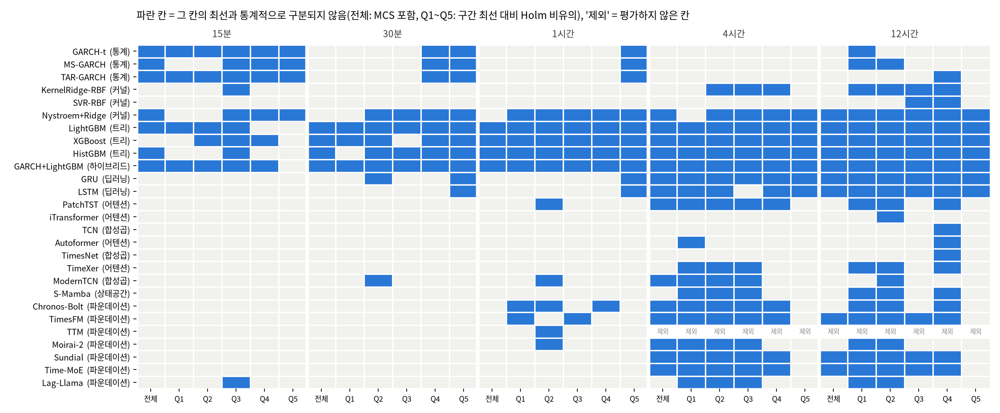

# 26b번: 27번 결과의 견고성·구분 불가 진단·유의성 검정

입력: `test/results/27_model_expansion_20261006`(27번, 20종목 × 5구간 × 28모델, 2760행). 재적합 없이 저장된 평가 예측만 쓴다. 데이터 정의와 결측 처리는 `test/research_materials/data_definition.md`, 모델 정의는 `test/research_materials/model_catalog.md`를 본다.

## 0. 검정 설계와 읽는 법

모든 검정의 관측 단위는 **평가 시각 t**(정시)이다. 모델 m의 시각 t, 종목 k 손실을 `L[m][k,t] = QLIKE(실제 RV, 예측)`라고 쓴다. 두 모델은 같은 시각·같은 종목에서 비교하므로 독립 두 표본이 아니라 **대응(paired) 표본**이며, 비교 집단은 "A의 손실들"과 "B의 손실들"이 아니라 그 시각별 차이 한 줄이다. 시각마다 20종목을 평균하므로 종목 간 상관은 그 평균 시계열의 분산에 그대로 들어간다(종목을 독립 반복으로 세지 않는다). 모든 p값은 양측이고 유의수준은 0.05이다. **p값이 작아 H0가 기각된다는 것은 "차이가 있다는 증거가 있다"는 뜻이고, 기각하지 못한다는 것은 "같다고 증명했다"가 아니라 "차이가 있다는 증거가 부족하다"는 뜻이다.** 평가 시각이 적은 긴 예측 구간에서는 증거가 부족해서 기각하지 못하는 경우가 많다.

| 번호 | 검정 | 비교 집단(코드) | 귀무가설 H0 | 대립가설 H1 | 통계량·보정 | H0 기각의 의미 |
| :--- | :--- | :--- | :--- | :--- | :--- | :--- |
| 3-1a | Diebold-Mariano(대응 t, HAC) | `d_t = (L[A]-L[B]).mean(axis=1)`, 한 예측 구간의 모델 쌍마다 | E[d_t]=0, 두 모델의 기대 QLIKE가 같다 | E[d_t]≠0 | t=평균/SE, SE는 Newey-West(lag=⌊4(n/100)^(2/9)⌋, Bartlett). 구간마다 전 쌍에 Holm | 한쪽이 평균적으로 더 낫다(방향은 평균차의 부호) |
| 3-1b | MCS(Hansen·Lunde·Nason 2011) | 한 구간의 시각×모델 평균 손실 행렬 전체 | 현재 집합의 모델들이 모두 동등한 예측 능력 | 집합에 기대 손실이 더 큰 모델이 있다 | 블록 부트스트랩(블록=n^(1/3), 2,000회), 기각되면 가장 나쁜 모델을 빼고 반복 | 기각되어 빠진 모델은 최선과 구분되는 열세, 남은 집합은 "최선이 아니라고 기각할 수 없는" 모델 |
| 3-2 | 사전 구간별 DM | `(L[m]-L[best]).where(Q==q).mean(axis=1)`, 직전 H시간 RV 5분위(학습 구간 분위수) 칸마다 | 그 칸에서 m과 최선의 기대 손실이 같다 | 다르다 | HAC t, 칸마다 Holm. 기각하지 못한 모델을 통계적 동률로 부른다 | 그 칸에서 m이 최선보다 열세 |
| 3-3 | 시드별 MCS 반복 | 무작위 모델의 예측만 시드 s의 것으로 바꿔 MCS를 5번 | (검정이 아니라 안정성 점검) | | 시드 5개 중 포함 횟수 | 5/5는 시드와 무관한 판정, 1~4은 시드에 따라 달라짐, 0/5은 항상 제외 |
| 1 | 시드 변동 | 시드 5개의 모델×종목×구간 평균 QLIKE 표준편차 | (기술통계) | | 중앙값을 동률 폭 0.01과 비교 | 0.01보다 크면 그 모델끼리의 순위 차이는 시드 잡음일 수 있음 |
| 2 | 구분 불가 진단 | 상위 6개 모델 쌍의 |평균차|/SE, 예측 상관, 적합 지표 | (진단) | | 격차/SE<2이고 상관≈1이면 데이터·표본 한계 | 적합 지표가 정상인데 격차/SE가 작으면 "적합 실패가 아니다" |
| 5 | RESET 선형성 | 학습 표본 5,000개로 OLS(y=log RV_d, X=로그 특성), 적합값²·³ 항 추가 | 선형 모형의 함수형이 옳다(두 항 계수=0) | 비선형 구조가 있다 | F 검정, 종목마다 | 기각이면 선형 모델에 부적합(제외 결정의 근거) |
| 5 | BDS 독립성 | 위 OLS 잔차 마지막 3,000개 | 잔차가 i.i.d.다 | 비선형·이분산 의존이 남아 있다 | BDS 통계량(차원 2) | 기각이면 선형 모형이 구조를 놓침(이분산 포함이라 선형성만의 검정은 아님) |
| 6 | 두 부분 대 단일 DM | `(L[두 부분]-L[단일]).mean(axis=1)`, 같은 모델의 같은 예측에 결합만 다름 | 두 결합의 기대 손실이 같다 | 다르다 | HAC t, 구간×모델 전체에 Holm | 정지 확률을 따로 곱하는 것이 손실을 바꾼다(부호가 음수면 개선) |

**통계 검정이 아닌 실무 기준**: A등급(최선과 QLIKE 격차 ≤0.01)은 GRU 시드 표준편차에서 가져온 값으로, 가설검정이 아니라 "이보다 작은 차이는 모델 차이로 보지 않는다"는 약속이다. 통계 판정(MCS)과 일치하는지는 4절에서 비교한다.

## 1. 시드 견고성(전 모델)

읽은 시드: [0, 1, 2, 3, 4]. 시드 0은 27번 본 실행이다.

**결정적 알고리즘 확인**: 시드를 바꿔 다시 돌린 예측과 시드 0 예측의 최대 절대차(종목·구간 전체).

| 모델 | 최대 절대차 | 판정 |
| :--- | ---: | :--- |
| GARCH-t | 0.00e+00 | 동일(결정적) |

MS-GARCH·TAR-GARCH(고정 시작점의 Nelder-Mead)·KernelRidge·SVR(고정 부분표본)은 난수를 쓰지 않아 시드 실행에서 뺐다. 이 넷의 시드 표준편차는 정의상 0이다.

**무작위 모델의 시드 변동**: 종목·구간마다 시드 간 QLIKE 표준편차를 구해 중앙값을 보인다.

| 모델 | 15분 | 30분 | 1시간 | 4시간 | 12시간 |
| :--- | ---: | ---: | ---: | ---: | ---: |
| Autoformer | 0.0163 | 0.0121 | 0.0150 | 0.0204 | 0.0206 |
| GARCH+LightGBM | 0.0051 | 0.0020 | 0.0012 | 0.0016 | 0.0029 |
| GRU | 0.0379 | 0.0271 | 0.0121 | 0.0135 | 0.0109 |
| HistGBM | 0.0015 | 0.0005 | 0.0001 | 0.0000 | 0.0000 |
| LSTM | 0.0567 | 0.0277 | 0.0150 | 0.0115 | 0.0140 |
| LightGBM | 0.0032 | 0.0017 | 0.0012 | 0.0019 | 0.0025 |
| ModernTCN | 0.0051 | 0.0032 | 0.0016 | 0.0064 | 0.0549 |
| Nystroem+Ridge | 0.0026 | 0.0016 | 0.0011 | 0.0007 | 0.0008 |
| PatchTST | 0.0123 | 0.0078 | 0.0060 | 0.0035 | 0.0074 |
| S-Mamba | 0.0087 | 0.0049 | 0.0026 | 0.0053 | 0.0066 |
| TCN | 0.0272 | 0.0193 | 0.0200 | 0.0379 | 0.0889 |
| TimeXer | 0.0700 | 0.0369 | 0.0193 | 0.0101 | 0.0171 |
| TimesNet | 0.0230 | 0.0153 | 0.0219 | 0.0235 | 0.0309 |
| XGBoost | 0.0056 | 0.0019 | 0.0011 | 0.0020 | 0.0031 |
| iTransformer | 0.0380 | 0.0377 | 0.0387 | 0.0166 | 0.0186 |

동률 폭 0.01와 비교한다. 시드 표준편차가 이보다 작으면 시드는 결론을 바꾸지 않는다. HistGBM은 표본·특성 추출을 쓰지 않는 설정이라(조기종료도 직접 감시) 시드가 결과에 영향을 주지 않는다.

**해석(모델마다)**:
- Autoformer: 15분, 30분, 1시간, 4시간, 12시간에서 표준편차가 0.01를 넘는다(최대 0.0206). 이 구간들에서 이 모델과 다른 모델의 순위·동률 판정은 시드 한 개로 확정할 수 없고, 시드 평균과 시드별 MCS 빈도(3-3절)로 봐야 한다.
- GARCH+LightGBM: 모든 구간에서 시드 표준편차가 0.01 이하(최대 0.0051). 시드는 이 모델의 순위를 바꾸지 않는다.
- GRU: 15분, 30분, 1시간, 4시간, 12시간에서 표준편차가 0.01를 넘는다(최대 0.0379). 이 구간들에서 이 모델과 다른 모델의 순위·동률 판정은 시드 한 개로 확정할 수 없고, 시드 평균과 시드별 MCS 빈도(3-3절)로 봐야 한다.
- HistGBM: 모든 구간에서 시드 표준편차가 0.01 이하(최대 0.0015). 시드는 이 모델의 순위를 바꾸지 않는다.
- LSTM: 15분, 30분, 1시간, 4시간, 12시간에서 표준편차가 0.01를 넘는다(최대 0.0567). 이 구간들에서 이 모델과 다른 모델의 순위·동률 판정은 시드 한 개로 확정할 수 없고, 시드 평균과 시드별 MCS 빈도(3-3절)로 봐야 한다.
- LightGBM: 모든 구간에서 시드 표준편차가 0.01 이하(최대 0.0032). 시드는 이 모델의 순위를 바꾸지 않는다.
- ModernTCN: 12시간에서 표준편차가 0.01를 넘는다(최대 0.0549). 이 구간들에서 이 모델과 다른 모델의 순위·동률 판정은 시드 한 개로 확정할 수 없고, 시드 평균과 시드별 MCS 빈도(3-3절)로 봐야 한다.
- Nystroem+Ridge: 모든 구간에서 시드 표준편차가 0.01 이하(최대 0.0026). 시드는 이 모델의 순위를 바꾸지 않는다.
- PatchTST: 15분에서 표준편차가 0.01를 넘는다(최대 0.0123). 이 구간들에서 이 모델과 다른 모델의 순위·동률 판정은 시드 한 개로 확정할 수 없고, 시드 평균과 시드별 MCS 빈도(3-3절)로 봐야 한다.
- S-Mamba: 모든 구간에서 시드 표준편차가 0.01 이하(최대 0.0087). 시드는 이 모델의 순위를 바꾸지 않는다.
- TCN: 15분, 30분, 1시간, 4시간, 12시간에서 표준편차가 0.01를 넘는다(최대 0.0889). 이 구간들에서 이 모델과 다른 모델의 순위·동률 판정은 시드 한 개로 확정할 수 없고, 시드 평균과 시드별 MCS 빈도(3-3절)로 봐야 한다.
- TimeXer: 15분, 30분, 1시간, 4시간, 12시간에서 표준편차가 0.01를 넘는다(최대 0.0700). 이 구간들에서 이 모델과 다른 모델의 순위·동률 판정은 시드 한 개로 확정할 수 없고, 시드 평균과 시드별 MCS 빈도(3-3절)로 봐야 한다.
- TimesNet: 15분, 30분, 1시간, 4시간, 12시간에서 표준편차가 0.01를 넘는다(최대 0.0309). 이 구간들에서 이 모델과 다른 모델의 순위·동률 판정은 시드 한 개로 확정할 수 없고, 시드 평균과 시드별 MCS 빈도(3-3절)로 봐야 한다.
- XGBoost: 모든 구간에서 시드 표준편차가 0.01 이하(최대 0.0056). 시드는 이 모델의 순위를 바꾸지 않는다.
- iTransformer: 15분, 30분, 1시간, 4시간, 12시간에서 표준편차가 0.01를 넘는다(최대 0.0387). 이 구간들에서 이 모델과 다른 모델의 순위·동률 판정은 시드 한 개로 확정할 수 없고, 시드 평균과 시드별 MCS 빈도(3-3절)로 봐야 한다.

## 2. 왜 긴 예측 구간에서 모델이 구분되지 않는가: 적합 실패인가, 데이터 특성인가

| 예측 구간 | 평가 시각 수 | LightGBM 반복(중앙) | XGB 반복 | GRU 에폭 | LSTM 에폭 | 로그 모델 보정계수 | 상위 6개 쌍 격차 | 격차/표준오차 | 상위 6개 예측 상관 | 최선 로그 상관 | 최선 MZ R² |
| :--- | ---: | ---: | ---: | ---: | ---: | ---: | ---: | ---: | ---: | ---: | ---: |
| 15분 | 7,878 | 121 | 118 | 18 | 14 | 3.55 | 0.0117 | 1.21 | 0.918 | 0.399 | 0.173 |
| 30분 | 7,874 | 128 | 139 | 20 | 16 | 2.33 | 0.0096 | 2.55 | 0.949 | 0.481 | 0.238 |
| 1시간 | 7,873 | 150 | 148 | 22 | 23 | 1.75 | 0.0072 | 2.70 | 0.969 | 0.554 | 0.292 |
| 4시간 | 1,964 | 154 | 162 | 20 | 20 | 1.38 | 0.0010 | 0.19 | 0.947 | 0.640 | 0.316 |
| 12시간 | 651 | 134 | 138 | 11 | 18 | 1.27 | 0.0048 | 0.59 | 0.935 | 0.668 | 0.359 |

읽는 법: 적합 실패라면 반복 수·에폭이 1 근처에서 멈추거나(학습이 시작되지 않음) 보정계수가 비정상적으로 튄다. 데이터 특성이라면 적합 진단은 정상인데, 평가 시각이 적어 표준오차가 커지고(격차/표준오차가 2보다 작음), 상위 모델의 예측이 서로 거의 같다(예측 상관이 1에 가까움).

**해석(예측 구간마다)**:
- 15분: 적합 지표는 정상(반복·에폭이 1 근처가 아니고 보정계수 3.55). 상위 6개 모델 쌍의 격차는 표준오차의 1.21배로 2배 미만이라 쌍 검정으로 구분할 수 없다, 예측 상관 0.918, 최선 모델의 로그 상관 0.399(MZ R² 0.173). **결론: 적합 실패가 아니라 표본 수와 모델 예측의 유사성 때문이다.**
- 30분: 적합 지표는 정상(반복·에폭이 1 근처가 아니고 보정계수 2.33). 상위 6개 모델 쌍의 격차는 표준오차의 2.55배로 2배 이상이라 쌍 검정으로 구분 가능한 쌍이 있다, 예측 상관 0.949, 최선 모델의 로그 상관 0.481(MZ R² 0.238). **결론: 이 구간은 모델 구분이 가능하다.**
- 1시간: 적합 지표는 정상(반복·에폭이 1 근처가 아니고 보정계수 1.75). 상위 6개 모델 쌍의 격차는 표준오차의 2.70배로 2배 이상이라 쌍 검정으로 구분 가능한 쌍이 있다, 예측 상관 0.969, 최선 모델의 로그 상관 0.554(MZ R² 0.292). **결론: 이 구간은 모델 구분이 가능하다.**
- 4시간: 적합 지표는 정상(반복·에폭이 1 근처가 아니고 보정계수 1.38). 상위 6개 모델 쌍의 격차는 표준오차의 0.19배로 2배 미만이라 쌍 검정으로 구분할 수 없다, 예측 상관 0.947, 최선 모델의 로그 상관 0.640(MZ R² 0.316). **결론: 적합 실패가 아니라 표본 수와 모델 예측의 유사성 때문이다.**
- 12시간: 적합 지표는 정상(반복·에폭이 1 근처가 아니고 보정계수 1.27). 상위 6개 모델 쌍의 격차는 표준오차의 0.59배로 2배 미만이라 쌍 검정으로 구분할 수 없다, 예측 상관 0.935, 최선 모델의 로그 상관 0.668(MZ R² 0.359). **결론: 적합 실패가 아니라 표본 수와 모델 예측의 유사성 때문이다.**

## 3. 유의성 검정

시각마다 20종목의 QLIKE 손실차를 평균한 시계열에 DM 검정(Newey-West HAC)을 한다. 종목 간 상관은 이 평균 시계열의 분산에 그대로 들어가므로 종목을 독립 반복으로 세는 문제가 없다. 다중비교는 예측 구간마다 전 모델 쌍에 Holm 보정(유의수준 0.05)을 한다. MCS는 종목 평균 손실 시계열에 블록 부트스트랩으로 돌린다(시각이 연속이라 블록 가정이 성립한다).

### 3-1. 예측 구간별 MCS(모델 신뢰 집합)와 최선 대비 DM

MCS 포함은 "최선이 아니라는 것을 기각할 수 없는 모델"이다. 최선 대비 열세 p는 Holm 보정 후 값이다. 이 절의 손실은 시드 0 예측 기준이다(시드를 바꿔도 판정이 유지되는지는 3-3절).

#### 15분 (평가 시각 7,878, 블록 20)

| 모델 | 처리 방식 | 종목 평균 손실 − 최선 | MCS 포함 | 최선 대비 열세 p(Holm) |
| :--- | :--- | ---: | :--- | ---: |
| MS-GARCH | 순차·재귀(통계) | +0.0000 | 예 | - |
| GARCH-t | 순차·재귀(통계) | +0.0008 | 예 | 1 |
| TAR-GARCH | 순차·재귀(통계) | +0.0035 | 예 | 1 |
| Nystroem+Ridge | 특성 기반 회귀(비신경) | +0.0053 | 예 | 1 |
| HistGBM | 특성 기반 트리(비신경) | +0.0171 | 예 | 1 |
| GARCH+LightGBM | 순차·재귀 통계 + 트리 결합 | +0.0186 | 예 | 0.854 |
| LightGBM | 특성 기반 트리(비신경) | +0.0222 | 예 | 0.474 |
| XGBoost | 특성 기반 트리(비신경) | +0.0353 | 아니오 | 0.0134 |
| PatchTST | 병렬 어텐션(패치) | +0.0806 | 아니오 | 5.29e-18 |
| KernelRidge-RBF | 특성 기반 회귀(비신경) | +0.0898 | 아니오 | 8.02e-09 |
| TimesNet | 병렬 합성곱(2D 주기) | +0.0985 | 아니오 | 2.09e-34 |
| ModernTCN | 병렬 합성곱(순수) | +0.1027 | 아니오 | 1.13e-25 |
| SVR-RBF | 특성 기반 회귀(비신경) | +0.1031 | 아니오 | 4.35e-25 |
| TCN | 병렬 합성곱(인과 팽창) | +0.1075 | 아니오 | 3.11e-22 |
| LSTM | 순차·재귀 | +0.1379 | 아니오 | 4.05e-64 |
| Time-MoE | 사전학습 zero-shot(전문가 혼합) | +0.1449 | 아니오 | 3.5e-39 |
| Chronos-Bolt | 사전학습 zero-shot(인코더-디코더) | +0.1471 | 아니오 | 3.05e-46 |
| TimesFM | 사전학습 zero-shot(디코더) | +0.1486 | 아니오 | 3.94e-40 |
| Autoformer | 병렬 어텐션(자기상관) | +0.1503 | 아니오 | 1.96e-33 |
| S-Mamba | 선택적 상태공간(학습 병렬·추론 재귀) | +0.1526 | 아니오 | 3.43e-30 |
| Sundial | 사전학습 zero-shot(플로우 매칭) | +0.1548 | 아니오 | 2.08e-44 |
| GRU | 순차·재귀 | +0.1695 | 아니오 | 3.47e-48 |
| Moirai-2 | 사전학습 zero-shot(디코더) | +0.1762 | 아니오 | 1.83e-33 |
| iTransformer | 병렬 어텐션(변수 토큰) | +0.1894 | 아니오 | 3.93e-49 |
| TimeXer | 병렬 어텐션(패치+변수 토큰) | +0.1907 | 아니오 | 2.66e-94 |
| TTM | 사전학습 zero-shot(MLP-Mixer) | +0.2011 | 아니오 | 9.14e-63 |
| Lag-Llama | 사전학습 zero-shot(lag 디코더) | +0.2122 | 아니오 | 1.41e-35 |
| naive | 직전값 | +32.4385 | 아니오 | 0.000945 |

**해석(15분, 모델마다 H0: 최선 `MS-GARCH`와 기대 손실이 같다)**:
- MS-GARCH: 평균 손실이 가장 작아 비교 기준이 된다(MCS 포함 여부와 무관하게 "유일한 최선"이라는 뜻은 아니다).
- GARCH-t: 최선보다 평균 +0.0008 크지만 Holm 보정 p=1로 **H0를 기각하지 못했다**(MCS 포함). 곧 최선과 다르다는 증거가 부족해 통계적으로 구분되지 않는다(같다는 증명은 아니다).
- TAR-GARCH: 최선보다 평균 +0.0035 크지만 Holm 보정 p=1로 **H0를 기각하지 못했다**(MCS 포함). 곧 최선과 다르다는 증거가 부족해 통계적으로 구분되지 않는다(같다는 증명은 아니다).
- Nystroem+Ridge: 최선보다 평균 +0.0053 크지만 Holm 보정 p=1로 **H0를 기각하지 못했다**(MCS 포함). 곧 최선과 다르다는 증거가 부족해 통계적으로 구분되지 않는다(같다는 증명은 아니다).
- HistGBM: 최선보다 평균 +0.0171 크지만 Holm 보정 p=1로 **H0를 기각하지 못했다**(MCS 포함). 곧 최선과 다르다는 증거가 부족해 통계적으로 구분되지 않는다(같다는 증명은 아니다).
- GARCH+LightGBM: 최선보다 평균 +0.0186 크지만 Holm 보정 p=0.854로 **H0를 기각하지 못했다**(MCS 포함). 곧 최선과 다르다는 증거가 부족해 통계적으로 구분되지 않는다(같다는 증명은 아니다).
- LightGBM: 최선보다 평균 +0.0222 크지만 Holm 보정 p=0.474로 **H0를 기각하지 못했다**(MCS 포함). 곧 최선과 다르다는 증거가 부족해 통계적으로 구분되지 않는다(같다는 증명은 아니다).
- XGBoost: 최선보다 평균 +0.0353 크고 Holm 보정 p=0.0134로 **H0를 기각**했다(MCS 제외). 곧 이 모델의 기대 손실이 최선보다 유의하게 크다, 즉 열세다.
- PatchTST: 최선보다 평균 +0.0806 크고 Holm 보정 p=5.29e-18로 **H0를 기각**했다(MCS 제외). 곧 이 모델의 기대 손실이 최선보다 유의하게 크다, 즉 열세다.
- KernelRidge-RBF: 최선보다 평균 +0.0898 크고 Holm 보정 p=8.02e-09로 **H0를 기각**했다(MCS 제외). 곧 이 모델의 기대 손실이 최선보다 유의하게 크다, 즉 열세다.
- TimesNet: 최선보다 평균 +0.0985 크고 Holm 보정 p=2.09e-34로 **H0를 기각**했다(MCS 제외). 곧 이 모델의 기대 손실이 최선보다 유의하게 크다, 즉 열세다.
- ModernTCN: 최선보다 평균 +0.1027 크고 Holm 보정 p=1.13e-25로 **H0를 기각**했다(MCS 제외). 곧 이 모델의 기대 손실이 최선보다 유의하게 크다, 즉 열세다.
- SVR-RBF: 최선보다 평균 +0.1031 크고 Holm 보정 p=4.35e-25로 **H0를 기각**했다(MCS 제외). 곧 이 모델의 기대 손실이 최선보다 유의하게 크다, 즉 열세다.
- TCN: 최선보다 평균 +0.1075 크고 Holm 보정 p=3.11e-22로 **H0를 기각**했다(MCS 제외). 곧 이 모델의 기대 손실이 최선보다 유의하게 크다, 즉 열세다.
- LSTM: 최선보다 평균 +0.1379 크고 Holm 보정 p=4.05e-64로 **H0를 기각**했다(MCS 제외). 곧 이 모델의 기대 손실이 최선보다 유의하게 크다, 즉 열세다.
- Time-MoE: 최선보다 평균 +0.1449 크고 Holm 보정 p=3.5e-39로 **H0를 기각**했다(MCS 제외). 곧 이 모델의 기대 손실이 최선보다 유의하게 크다, 즉 열세다.
- Chronos-Bolt: 최선보다 평균 +0.1471 크고 Holm 보정 p=3.05e-46로 **H0를 기각**했다(MCS 제외). 곧 이 모델의 기대 손실이 최선보다 유의하게 크다, 즉 열세다.
- TimesFM: 최선보다 평균 +0.1486 크고 Holm 보정 p=3.94e-40로 **H0를 기각**했다(MCS 제외). 곧 이 모델의 기대 손실이 최선보다 유의하게 크다, 즉 열세다.
- Autoformer: 최선보다 평균 +0.1503 크고 Holm 보정 p=1.96e-33로 **H0를 기각**했다(MCS 제외). 곧 이 모델의 기대 손실이 최선보다 유의하게 크다, 즉 열세다.
- S-Mamba: 최선보다 평균 +0.1526 크고 Holm 보정 p=3.43e-30로 **H0를 기각**했다(MCS 제외). 곧 이 모델의 기대 손실이 최선보다 유의하게 크다, 즉 열세다.
- Sundial: 최선보다 평균 +0.1548 크고 Holm 보정 p=2.08e-44로 **H0를 기각**했다(MCS 제외). 곧 이 모델의 기대 손실이 최선보다 유의하게 크다, 즉 열세다.
- GRU: 최선보다 평균 +0.1695 크고 Holm 보정 p=3.47e-48로 **H0를 기각**했다(MCS 제외). 곧 이 모델의 기대 손실이 최선보다 유의하게 크다, 즉 열세다.
- Moirai-2: 최선보다 평균 +0.1762 크고 Holm 보정 p=1.83e-33로 **H0를 기각**했다(MCS 제외). 곧 이 모델의 기대 손실이 최선보다 유의하게 크다, 즉 열세다.
- iTransformer: 최선보다 평균 +0.1894 크고 Holm 보정 p=3.93e-49로 **H0를 기각**했다(MCS 제외). 곧 이 모델의 기대 손실이 최선보다 유의하게 크다, 즉 열세다.
- TimeXer: 최선보다 평균 +0.1907 크고 Holm 보정 p=2.66e-94로 **H0를 기각**했다(MCS 제외). 곧 이 모델의 기대 손실이 최선보다 유의하게 크다, 즉 열세다.
- TTM: 최선보다 평균 +0.2011 크고 Holm 보정 p=9.14e-63로 **H0를 기각**했다(MCS 제외). 곧 이 모델의 기대 손실이 최선보다 유의하게 크다, 즉 열세다.
- Lag-Llama: 최선보다 평균 +0.2122 크고 Holm 보정 p=1.41e-35로 **H0를 기각**했다(MCS 제외). 곧 이 모델의 기대 손실이 최선보다 유의하게 크다, 즉 열세다.
- naive: 최선보다 평균 +32.4385 크고 Holm 보정 p=0.000945로 **H0를 기각**했다(MCS 제외). 곧 이 모델의 기대 손실이 최선보다 유의하게 크다, 즉 열세다.

#### 30분 (평가 시각 7,874, 블록 20)

| 모델 | 처리 방식 | 종목 평균 손실 − 최선 | MCS 포함 | 최선 대비 열세 p(Holm) |
| :--- | :--- | ---: | :--- | ---: |
| HistGBM | 특성 기반 트리(비신경) | +0.0000 | 예 | - |
| LightGBM | 특성 기반 트리(비신경) | +0.0028 | 예 | 1 |
| GARCH+LightGBM | 순차·재귀 통계 + 트리 결합 | +0.0031 | 예 | 1 |
| XGBoost | 특성 기반 트리(비신경) | +0.0054 | 예 | 1 |
| Nystroem+Ridge | 특성 기반 회귀(비신경) | +0.0127 | 아니오 | 1.1e-05 |
| GARCH-t | 순차·재귀(통계) | +0.0307 | 아니오 | 0.000342 |
| TAR-GARCH | 순차·재귀(통계) | +0.0319 | 아니오 | 8.21e-05 |
| MS-GARCH | 순차·재귀(통계) | +0.0357 | 아니오 | 3.19e-10 |
| GRU | 순차·재귀 | +0.0464 | 아니오 | 1.56e-25 |
| PatchTST | 병렬 어텐션(패치) | +0.0499 | 아니오 | 3.15e-36 |
| LSTM | 순차·재귀 | +0.0681 | 아니오 | 3.91e-39 |
| ModernTCN | 병렬 합성곱(순수) | +0.0706 | 아니오 | 2.45e-29 |
| Chronos-Bolt | 사전학습 zero-shot(인코더-디코더) | +0.0739 | 아니오 | 1.31e-32 |
| TimesNet | 병렬 합성곱(2D 주기) | +0.0791 | 아니오 | 2.61e-35 |
| Time-MoE | 사전학습 zero-shot(전문가 혼합) | +0.0847 | 아니오 | 3.03e-49 |
| TimesFM | 사전학습 zero-shot(디코더) | +0.0861 | 아니오 | 3.72e-16 |
| Moirai-2 | 사전학습 zero-shot(디코더) | +0.0872 | 아니오 | 2.68e-18 |
| KernelRidge-RBF | 특성 기반 회귀(비신경) | +0.0914 | 아니오 | 3.45e-10 |
| Sundial | 사전학습 zero-shot(플로우 매칭) | +0.0935 | 아니오 | 1.19e-37 |
| TCN | 병렬 합성곱(인과 팽창) | +0.0937 | 아니오 | 9.99e-48 |
| TimeXer | 병렬 어텐션(패치+변수 토큰) | +0.1015 | 아니오 | 2.06e-63 |
| Lag-Llama | 사전학습 zero-shot(lag 디코더) | +0.1121 | 아니오 | 2.63e-66 |
| TTM | 사전학습 zero-shot(MLP-Mixer) | +0.1197 | 아니오 | 1.95e-74 |
| SVR-RBF | 특성 기반 회귀(비신경) | +0.1284 | 아니오 | 4.15e-44 |
| Autoformer | 병렬 어텐션(자기상관) | +0.1313 | 아니오 | 5.87e-48 |
| S-Mamba | 선택적 상태공간(학습 병렬·추론 재귀) | +0.1530 | 아니오 | 4.11e-25 |
| iTransformer | 병렬 어텐션(변수 토큰) | +0.2103 | 아니오 | 2.12e-39 |
| naive | 직전값 | +2.6399 | 아니오 | 6.17e-63 |

**해석(30분, 모델마다 H0: 최선 `HistGBM`와 기대 손실이 같다)**:
- HistGBM: 평균 손실이 가장 작아 비교 기준이 된다(MCS 포함 여부와 무관하게 "유일한 최선"이라는 뜻은 아니다).
- LightGBM: 최선보다 평균 +0.0028 크지만 Holm 보정 p=1로 **H0를 기각하지 못했다**(MCS 포함). 곧 최선과 다르다는 증거가 부족해 통계적으로 구분되지 않는다(같다는 증명은 아니다).
- GARCH+LightGBM: 최선보다 평균 +0.0031 크지만 Holm 보정 p=1로 **H0를 기각하지 못했다**(MCS 포함). 곧 최선과 다르다는 증거가 부족해 통계적으로 구분되지 않는다(같다는 증명은 아니다).
- XGBoost: 최선보다 평균 +0.0054 크지만 Holm 보정 p=1로 **H0를 기각하지 못했다**(MCS 포함). 곧 최선과 다르다는 증거가 부족해 통계적으로 구분되지 않는다(같다는 증명은 아니다).
- Nystroem+Ridge: 최선보다 평균 +0.0127 크고 Holm 보정 p=1.1e-05로 **H0를 기각**했다(MCS 제외). 곧 이 모델의 기대 손실이 최선보다 유의하게 크다, 즉 열세다.
- GARCH-t: 최선보다 평균 +0.0307 크고 Holm 보정 p=0.000342로 **H0를 기각**했다(MCS 제외). 곧 이 모델의 기대 손실이 최선보다 유의하게 크다, 즉 열세다.
- TAR-GARCH: 최선보다 평균 +0.0319 크고 Holm 보정 p=8.21e-05로 **H0를 기각**했다(MCS 제외). 곧 이 모델의 기대 손실이 최선보다 유의하게 크다, 즉 열세다.
- MS-GARCH: 최선보다 평균 +0.0357 크고 Holm 보정 p=3.19e-10로 **H0를 기각**했다(MCS 제외). 곧 이 모델의 기대 손실이 최선보다 유의하게 크다, 즉 열세다.
- GRU: 최선보다 평균 +0.0464 크고 Holm 보정 p=1.56e-25로 **H0를 기각**했다(MCS 제외). 곧 이 모델의 기대 손실이 최선보다 유의하게 크다, 즉 열세다.
- PatchTST: 최선보다 평균 +0.0499 크고 Holm 보정 p=3.15e-36로 **H0를 기각**했다(MCS 제외). 곧 이 모델의 기대 손실이 최선보다 유의하게 크다, 즉 열세다.
- LSTM: 최선보다 평균 +0.0681 크고 Holm 보정 p=3.91e-39로 **H0를 기각**했다(MCS 제외). 곧 이 모델의 기대 손실이 최선보다 유의하게 크다, 즉 열세다.
- ModernTCN: 최선보다 평균 +0.0706 크고 Holm 보정 p=2.45e-29로 **H0를 기각**했다(MCS 제외). 곧 이 모델의 기대 손실이 최선보다 유의하게 크다, 즉 열세다.
- Chronos-Bolt: 최선보다 평균 +0.0739 크고 Holm 보정 p=1.31e-32로 **H0를 기각**했다(MCS 제외). 곧 이 모델의 기대 손실이 최선보다 유의하게 크다, 즉 열세다.
- TimesNet: 최선보다 평균 +0.0791 크고 Holm 보정 p=2.61e-35로 **H0를 기각**했다(MCS 제외). 곧 이 모델의 기대 손실이 최선보다 유의하게 크다, 즉 열세다.
- Time-MoE: 최선보다 평균 +0.0847 크고 Holm 보정 p=3.03e-49로 **H0를 기각**했다(MCS 제외). 곧 이 모델의 기대 손실이 최선보다 유의하게 크다, 즉 열세다.
- TimesFM: 최선보다 평균 +0.0861 크고 Holm 보정 p=3.72e-16로 **H0를 기각**했다(MCS 제외). 곧 이 모델의 기대 손실이 최선보다 유의하게 크다, 즉 열세다.
- Moirai-2: 최선보다 평균 +0.0872 크고 Holm 보정 p=2.68e-18로 **H0를 기각**했다(MCS 제외). 곧 이 모델의 기대 손실이 최선보다 유의하게 크다, 즉 열세다.
- KernelRidge-RBF: 최선보다 평균 +0.0914 크고 Holm 보정 p=3.45e-10로 **H0를 기각**했다(MCS 제외). 곧 이 모델의 기대 손실이 최선보다 유의하게 크다, 즉 열세다.
- Sundial: 최선보다 평균 +0.0935 크고 Holm 보정 p=1.19e-37로 **H0를 기각**했다(MCS 제외). 곧 이 모델의 기대 손실이 최선보다 유의하게 크다, 즉 열세다.
- TCN: 최선보다 평균 +0.0937 크고 Holm 보정 p=9.99e-48로 **H0를 기각**했다(MCS 제외). 곧 이 모델의 기대 손실이 최선보다 유의하게 크다, 즉 열세다.
- TimeXer: 최선보다 평균 +0.1015 크고 Holm 보정 p=2.06e-63로 **H0를 기각**했다(MCS 제외). 곧 이 모델의 기대 손실이 최선보다 유의하게 크다, 즉 열세다.
- Lag-Llama: 최선보다 평균 +0.1121 크고 Holm 보정 p=2.63e-66로 **H0를 기각**했다(MCS 제외). 곧 이 모델의 기대 손실이 최선보다 유의하게 크다, 즉 열세다.
- TTM: 최선보다 평균 +0.1197 크고 Holm 보정 p=1.95e-74로 **H0를 기각**했다(MCS 제외). 곧 이 모델의 기대 손실이 최선보다 유의하게 크다, 즉 열세다.
- SVR-RBF: 최선보다 평균 +0.1284 크고 Holm 보정 p=4.15e-44로 **H0를 기각**했다(MCS 제외). 곧 이 모델의 기대 손실이 최선보다 유의하게 크다, 즉 열세다.
- Autoformer: 최선보다 평균 +0.1313 크고 Holm 보정 p=5.87e-48로 **H0를 기각**했다(MCS 제외). 곧 이 모델의 기대 손실이 최선보다 유의하게 크다, 즉 열세다.
- S-Mamba: 최선보다 평균 +0.1530 크고 Holm 보정 p=4.11e-25로 **H0를 기각**했다(MCS 제외). 곧 이 모델의 기대 손실이 최선보다 유의하게 크다, 즉 열세다.
- iTransformer: 최선보다 평균 +0.2103 크고 Holm 보정 p=2.12e-39로 **H0를 기각**했다(MCS 제외). 곧 이 모델의 기대 손실이 최선보다 유의하게 크다, 즉 열세다.
- naive: 최선보다 평균 +2.6399 크고 Holm 보정 p=6.17e-63로 **H0를 기각**했다(MCS 제외). 곧 이 모델의 기대 손실이 최선보다 유의하게 크다, 즉 열세다.

#### 1시간 (평가 시각 7,873, 블록 20)

| 모델 | 처리 방식 | 종목 평균 손실 − 최선 | MCS 포함 | 최선 대비 열세 p(Holm) |
| :--- | :--- | ---: | :--- | ---: |
| GARCH+LightGBM | 순차·재귀 통계 + 트리 결합 | +0.0000 | 예 | - |
| LightGBM | 특성 기반 트리(비신경) | +0.0006 | 예 | 1 |
| XGBoost | 특성 기반 트리(비신경) | +0.0015 | 예 | 1 |
| HistGBM | 특성 기반 트리(비신경) | +0.0018 | 예 | 1 |
| Nystroem+Ridge | 특성 기반 회귀(비신경) | +0.0087 | 아니오 | 0.0224 |
| LSTM | 순차·재귀 | +0.0207 | 아니오 | 5.5e-09 |
| GRU | 순차·재귀 | +0.0241 | 아니오 | 9.32e-11 |
| PatchTST | 병렬 어텐션(패치) | +0.0308 | 아니오 | 7.11e-14 |
| ModernTCN | 병렬 합성곱(순수) | +0.0371 | 아니오 | 5.26e-15 |
| TimesFM | 사전학습 zero-shot(디코더) | +0.0382 | 아니오 | 4.83e-10 |
| Chronos-Bolt | 사전학습 zero-shot(인코더-디코더) | +0.0405 | 아니오 | 1.91e-09 |
| Time-MoE | 사전학습 zero-shot(전문가 혼합) | +0.0412 | 아니오 | 2.76e-13 |
| Moirai-2 | 사전학습 zero-shot(디코더) | +0.0455 | 아니오 | 3.53e-10 |
| GARCH-t | 순차·재귀(통계) | +0.0509 | 아니오 | 9.52e-28 |
| TAR-GARCH | 순차·재귀(통계) | +0.0510 | 아니오 | 9e-35 |
| TimeXer | 병렬 어텐션(패치+변수 토큰) | +0.0537 | 아니오 | 3.04e-34 |
| Sundial | 사전학습 zero-shot(플로우 매칭) | +0.0545 | 아니오 | 2.23e-13 |
| TTM | 사전학습 zero-shot(MLP-Mixer) | +0.0574 | 아니오 | 6.32e-21 |
| TimesNet | 병렬 합성곱(2D 주기) | +0.0615 | 아니오 | 6.72e-38 |
| MS-GARCH | 순차·재귀(통계) | +0.0641 | 아니오 | 2.28e-37 |
| Lag-Llama | 사전학습 zero-shot(lag 디코더) | +0.0675 | 아니오 | 7.04e-25 |
| KernelRidge-RBF | 특성 기반 회귀(비신경) | +0.0808 | 아니오 | 1.03e-10 |
| TCN | 병렬 합성곱(인과 팽창) | +0.0840 | 아니오 | 2.17e-46 |
| S-Mamba | 선택적 상태공간(학습 병렬·추론 재귀) | +0.1036 | 아니오 | 9.51e-19 |
| Autoformer | 병렬 어텐션(자기상관) | +0.1311 | 아니오 | 3.4e-30 |
| SVR-RBF | 특성 기반 회귀(비신경) | +0.1452 | 아니오 | 4.58e-44 |
| iTransformer | 병렬 어텐션(변수 토큰) | +0.2058 | 아니오 | 2.79e-39 |
| naive | 직전값 | +0.9995 | 아니오 | 3e-142 |

**해석(1시간, 모델마다 H0: 최선 `GARCH+LightGBM`와 기대 손실이 같다)**:
- GARCH+LightGBM: 평균 손실이 가장 작아 비교 기준이 된다(MCS 포함 여부와 무관하게 "유일한 최선"이라는 뜻은 아니다).
- LightGBM: 최선보다 평균 +0.0006 크지만 Holm 보정 p=1로 **H0를 기각하지 못했다**(MCS 포함). 곧 최선과 다르다는 증거가 부족해 통계적으로 구분되지 않는다(같다는 증명은 아니다).
- XGBoost: 최선보다 평균 +0.0015 크지만 Holm 보정 p=1로 **H0를 기각하지 못했다**(MCS 포함). 곧 최선과 다르다는 증거가 부족해 통계적으로 구분되지 않는다(같다는 증명은 아니다).
- HistGBM: 최선보다 평균 +0.0018 크지만 Holm 보정 p=1로 **H0를 기각하지 못했다**(MCS 포함). 곧 최선과 다르다는 증거가 부족해 통계적으로 구분되지 않는다(같다는 증명은 아니다).
- Nystroem+Ridge: 최선보다 평균 +0.0087 크고 Holm 보정 p=0.0224로 **H0를 기각**했다(MCS 제외). 곧 이 모델의 기대 손실이 최선보다 유의하게 크다, 즉 열세다.
- LSTM: 최선보다 평균 +0.0207 크고 Holm 보정 p=5.5e-09로 **H0를 기각**했다(MCS 제외). 곧 이 모델의 기대 손실이 최선보다 유의하게 크다, 즉 열세다.
- GRU: 최선보다 평균 +0.0241 크고 Holm 보정 p=9.32e-11로 **H0를 기각**했다(MCS 제외). 곧 이 모델의 기대 손실이 최선보다 유의하게 크다, 즉 열세다.
- PatchTST: 최선보다 평균 +0.0308 크고 Holm 보정 p=7.11e-14로 **H0를 기각**했다(MCS 제외). 곧 이 모델의 기대 손실이 최선보다 유의하게 크다, 즉 열세다.
- ModernTCN: 최선보다 평균 +0.0371 크고 Holm 보정 p=5.26e-15로 **H0를 기각**했다(MCS 제외). 곧 이 모델의 기대 손실이 최선보다 유의하게 크다, 즉 열세다.
- TimesFM: 최선보다 평균 +0.0382 크고 Holm 보정 p=4.83e-10로 **H0를 기각**했다(MCS 제외). 곧 이 모델의 기대 손실이 최선보다 유의하게 크다, 즉 열세다.
- Chronos-Bolt: 최선보다 평균 +0.0405 크고 Holm 보정 p=1.91e-09로 **H0를 기각**했다(MCS 제외). 곧 이 모델의 기대 손실이 최선보다 유의하게 크다, 즉 열세다.
- Time-MoE: 최선보다 평균 +0.0412 크고 Holm 보정 p=2.76e-13로 **H0를 기각**했다(MCS 제외). 곧 이 모델의 기대 손실이 최선보다 유의하게 크다, 즉 열세다.
- Moirai-2: 최선보다 평균 +0.0455 크고 Holm 보정 p=3.53e-10로 **H0를 기각**했다(MCS 제외). 곧 이 모델의 기대 손실이 최선보다 유의하게 크다, 즉 열세다.
- GARCH-t: 최선보다 평균 +0.0509 크고 Holm 보정 p=9.52e-28로 **H0를 기각**했다(MCS 제외). 곧 이 모델의 기대 손실이 최선보다 유의하게 크다, 즉 열세다.
- TAR-GARCH: 최선보다 평균 +0.0510 크고 Holm 보정 p=9e-35로 **H0를 기각**했다(MCS 제외). 곧 이 모델의 기대 손실이 최선보다 유의하게 크다, 즉 열세다.
- TimeXer: 최선보다 평균 +0.0537 크고 Holm 보정 p=3.04e-34로 **H0를 기각**했다(MCS 제외). 곧 이 모델의 기대 손실이 최선보다 유의하게 크다, 즉 열세다.
- Sundial: 최선보다 평균 +0.0545 크고 Holm 보정 p=2.23e-13로 **H0를 기각**했다(MCS 제외). 곧 이 모델의 기대 손실이 최선보다 유의하게 크다, 즉 열세다.
- TTM: 최선보다 평균 +0.0574 크고 Holm 보정 p=6.32e-21로 **H0를 기각**했다(MCS 제외). 곧 이 모델의 기대 손실이 최선보다 유의하게 크다, 즉 열세다.
- TimesNet: 최선보다 평균 +0.0615 크고 Holm 보정 p=6.72e-38로 **H0를 기각**했다(MCS 제외). 곧 이 모델의 기대 손실이 최선보다 유의하게 크다, 즉 열세다.
- MS-GARCH: 최선보다 평균 +0.0641 크고 Holm 보정 p=2.28e-37로 **H0를 기각**했다(MCS 제외). 곧 이 모델의 기대 손실이 최선보다 유의하게 크다, 즉 열세다.
- Lag-Llama: 최선보다 평균 +0.0675 크고 Holm 보정 p=7.04e-25로 **H0를 기각**했다(MCS 제외). 곧 이 모델의 기대 손실이 최선보다 유의하게 크다, 즉 열세다.
- KernelRidge-RBF: 최선보다 평균 +0.0808 크고 Holm 보정 p=1.03e-10로 **H0를 기각**했다(MCS 제외). 곧 이 모델의 기대 손실이 최선보다 유의하게 크다, 즉 열세다.
- TCN: 최선보다 평균 +0.0840 크고 Holm 보정 p=2.17e-46로 **H0를 기각**했다(MCS 제외). 곧 이 모델의 기대 손실이 최선보다 유의하게 크다, 즉 열세다.
- S-Mamba: 최선보다 평균 +0.1036 크고 Holm 보정 p=9.51e-19로 **H0를 기각**했다(MCS 제외). 곧 이 모델의 기대 손실이 최선보다 유의하게 크다, 즉 열세다.
- Autoformer: 최선보다 평균 +0.1311 크고 Holm 보정 p=3.4e-30로 **H0를 기각**했다(MCS 제외). 곧 이 모델의 기대 손실이 최선보다 유의하게 크다, 즉 열세다.
- SVR-RBF: 최선보다 평균 +0.1452 크고 Holm 보정 p=4.58e-44로 **H0를 기각**했다(MCS 제외). 곧 이 모델의 기대 손실이 최선보다 유의하게 크다, 즉 열세다.
- iTransformer: 최선보다 평균 +0.2058 크고 Holm 보정 p=2.79e-39로 **H0를 기각**했다(MCS 제외). 곧 이 모델의 기대 손실이 최선보다 유의하게 크다, 즉 열세다.
- naive: 최선보다 평균 +0.9995 크고 Holm 보정 p=3e-142로 **H0를 기각**했다(MCS 제외). 곧 이 모델의 기대 손실이 최선보다 유의하게 크다, 즉 열세다.

#### 4시간 (평가 시각 1,964, 블록 13)

| 모델 | 처리 방식 | 종목 평균 손실 − 최선 | MCS 포함 | 최선 대비 열세 p(Holm) |
| :--- | :--- | ---: | :--- | ---: |
| LightGBM | 특성 기반 트리(비신경) | +0.0000 | 예 | - |
| GRU | 순차·재귀 | +0.0010 | 예 | 1 |
| XGBoost | 특성 기반 트리(비신경) | +0.0015 | 예 | 1 |
| GARCH+LightGBM | 순차·재귀 통계 + 트리 결합 | +0.0022 | 예 | 1 |
| Nystroem+Ridge | 특성 기반 회귀(비신경) | +0.0022 | 예 | 1 |
| ModernTCN | 병렬 합성곱(순수) | +0.0025 | 예 | 1 |
| HistGBM | 특성 기반 트리(비신경) | +0.0035 | 예 | 1 |
| LSTM | 순차·재귀 | +0.0038 | 예 | 1 |
| PatchTST | 병렬 어텐션(패치) | +0.0042 | 예 | 1 |
| TimesFM | 사전학습 zero-shot(디코더) | +0.0045 | 예 | 1 |
| Chronos-Bolt | 사전학습 zero-shot(인코더-디코더) | +0.0107 | 예 | 1 |
| Time-MoE | 사전학습 zero-shot(전문가 혼합) | +0.0120 | 예 | 1 |
| Moirai-2 | 사전학습 zero-shot(디코더) | +0.0124 | 예 | 1 |
| Sundial | 사전학습 zero-shot(플로우 매칭) | +0.0174 | 예 | 0.878 |
| TimeXer | 병렬 어텐션(패치+변수 토큰) | +0.0185 | 아니오 | 1 |
| Lag-Llama | 사전학습 zero-shot(lag 디코더) | +0.0364 | 아니오 | 1.04e-05 |
| S-Mamba | 선택적 상태공간(학습 병렬·추론 재귀) | +0.0426 | 아니오 | 0.0174 |
| KernelRidge-RBF | 특성 기반 회귀(비신경) | +0.0680 | 아니오 | 0.00076 |
| Autoformer | 병렬 어텐션(자기상관) | +0.0720 | 아니오 | 0.000362 |
| MS-GARCH | 순차·재귀(통계) | +0.0769 | 아니오 | 1.17e-09 |
| GARCH-t | 순차·재귀(통계) | +0.0790 | 아니오 | 2.03e-17 |
| TAR-GARCH | 순차·재귀(통계) | +0.0931 | 아니오 | 1.74e-12 |
| iTransformer | 병렬 어텐션(변수 토큰) | +0.0972 | 아니오 | 3.58e-16 |
| TimesNet | 병렬 합성곱(2D 주기) | +0.1128 | 아니오 | 1.76e-26 |
| SVR-RBF | 특성 기반 회귀(비신경) | +0.1384 | 아니오 | 9.87e-17 |
| TCN | 병렬 합성곱(인과 팽창) | +0.1513 | 아니오 | 4.93e-41 |
| naive | 직전값 | +0.6292 | 아니오 | 7.95e-14 |

**해석(4시간, 모델마다 H0: 최선 `LightGBM`와 기대 손실이 같다)**:
- LightGBM: 평균 손실이 가장 작아 비교 기준이 된다(MCS 포함 여부와 무관하게 "유일한 최선"이라는 뜻은 아니다).
- GRU: 최선보다 평균 +0.0010 크지만 Holm 보정 p=1로 **H0를 기각하지 못했다**(MCS 포함). 곧 최선과 다르다는 증거가 부족해 통계적으로 구분되지 않는다(같다는 증명은 아니다).
- XGBoost: 최선보다 평균 +0.0015 크지만 Holm 보정 p=1로 **H0를 기각하지 못했다**(MCS 포함). 곧 최선과 다르다는 증거가 부족해 통계적으로 구분되지 않는다(같다는 증명은 아니다).
- GARCH+LightGBM: 최선보다 평균 +0.0022 크지만 Holm 보정 p=1로 **H0를 기각하지 못했다**(MCS 포함). 곧 최선과 다르다는 증거가 부족해 통계적으로 구분되지 않는다(같다는 증명은 아니다).
- Nystroem+Ridge: 최선보다 평균 +0.0022 크지만 Holm 보정 p=1로 **H0를 기각하지 못했다**(MCS 포함). 곧 최선과 다르다는 증거가 부족해 통계적으로 구분되지 않는다(같다는 증명은 아니다).
- ModernTCN: 최선보다 평균 +0.0025 크지만 Holm 보정 p=1로 **H0를 기각하지 못했다**(MCS 포함). 곧 최선과 다르다는 증거가 부족해 통계적으로 구분되지 않는다(같다는 증명은 아니다).
- HistGBM: 최선보다 평균 +0.0035 크지만 Holm 보정 p=1로 **H0를 기각하지 못했다**(MCS 포함). 곧 최선과 다르다는 증거가 부족해 통계적으로 구분되지 않는다(같다는 증명은 아니다).
- LSTM: 최선보다 평균 +0.0038 크지만 Holm 보정 p=1로 **H0를 기각하지 못했다**(MCS 포함). 곧 최선과 다르다는 증거가 부족해 통계적으로 구분되지 않는다(같다는 증명은 아니다).
- PatchTST: 최선보다 평균 +0.0042 크지만 Holm 보정 p=1로 **H0를 기각하지 못했다**(MCS 포함). 곧 최선과 다르다는 증거가 부족해 통계적으로 구분되지 않는다(같다는 증명은 아니다).
- TimesFM: 최선보다 평균 +0.0045 크지만 Holm 보정 p=1로 **H0를 기각하지 못했다**(MCS 포함). 곧 최선과 다르다는 증거가 부족해 통계적으로 구분되지 않는다(같다는 증명은 아니다).
- Chronos-Bolt: 최선보다 평균 +0.0107 크지만 Holm 보정 p=1로 **H0를 기각하지 못했다**(MCS 포함). 곧 최선과 다르다는 증거가 부족해 통계적으로 구분되지 않는다(같다는 증명은 아니다).
- Time-MoE: 최선보다 평균 +0.0120 크지만 Holm 보정 p=1로 **H0를 기각하지 못했다**(MCS 포함). 곧 최선과 다르다는 증거가 부족해 통계적으로 구분되지 않는다(같다는 증명은 아니다).
- Moirai-2: 최선보다 평균 +0.0124 크지만 Holm 보정 p=1로 **H0를 기각하지 못했다**(MCS 포함). 곧 최선과 다르다는 증거가 부족해 통계적으로 구분되지 않는다(같다는 증명은 아니다).
- Sundial: 최선보다 평균 +0.0174 크지만 Holm 보정 p=0.878로 **H0를 기각하지 못했다**(MCS 포함). 곧 최선과 다르다는 증거가 부족해 통계적으로 구분되지 않는다(같다는 증명은 아니다).
- TimeXer: 최선보다 평균 +0.0185 크고 Holm 보정 p=1로 **H0를 기각**했다(MCS 제외). 곧 이 모델의 기대 손실이 최선보다 유의하게 크다, 즉 열세다.
- Lag-Llama: 최선보다 평균 +0.0364 크고 Holm 보정 p=1.04e-05로 **H0를 기각**했다(MCS 제외). 곧 이 모델의 기대 손실이 최선보다 유의하게 크다, 즉 열세다.
- S-Mamba: 최선보다 평균 +0.0426 크고 Holm 보정 p=0.0174로 **H0를 기각**했다(MCS 제외). 곧 이 모델의 기대 손실이 최선보다 유의하게 크다, 즉 열세다.
- KernelRidge-RBF: 최선보다 평균 +0.0680 크고 Holm 보정 p=0.00076로 **H0를 기각**했다(MCS 제외). 곧 이 모델의 기대 손실이 최선보다 유의하게 크다, 즉 열세다.
- Autoformer: 최선보다 평균 +0.0720 크고 Holm 보정 p=0.000362로 **H0를 기각**했다(MCS 제외). 곧 이 모델의 기대 손실이 최선보다 유의하게 크다, 즉 열세다.
- MS-GARCH: 최선보다 평균 +0.0769 크고 Holm 보정 p=1.17e-09로 **H0를 기각**했다(MCS 제외). 곧 이 모델의 기대 손실이 최선보다 유의하게 크다, 즉 열세다.
- GARCH-t: 최선보다 평균 +0.0790 크고 Holm 보정 p=2.03e-17로 **H0를 기각**했다(MCS 제외). 곧 이 모델의 기대 손실이 최선보다 유의하게 크다, 즉 열세다.
- TAR-GARCH: 최선보다 평균 +0.0931 크고 Holm 보정 p=1.74e-12로 **H0를 기각**했다(MCS 제외). 곧 이 모델의 기대 손실이 최선보다 유의하게 크다, 즉 열세다.
- iTransformer: 최선보다 평균 +0.0972 크고 Holm 보정 p=3.58e-16로 **H0를 기각**했다(MCS 제외). 곧 이 모델의 기대 손실이 최선보다 유의하게 크다, 즉 열세다.
- TimesNet: 최선보다 평균 +0.1128 크고 Holm 보정 p=1.76e-26로 **H0를 기각**했다(MCS 제외). 곧 이 모델의 기대 손실이 최선보다 유의하게 크다, 즉 열세다.
- SVR-RBF: 최선보다 평균 +0.1384 크고 Holm 보정 p=9.87e-17로 **H0를 기각**했다(MCS 제외). 곧 이 모델의 기대 손실이 최선보다 유의하게 크다, 즉 열세다.
- TCN: 최선보다 평균 +0.1513 크고 Holm 보정 p=4.93e-41로 **H0를 기각**했다(MCS 제외). 곧 이 모델의 기대 손실이 최선보다 유의하게 크다, 즉 열세다.
- naive: 최선보다 평균 +0.6292 크고 Holm 보정 p=7.95e-14로 **H0를 기각**했다(MCS 제외). 곧 이 모델의 기대 손실이 최선보다 유의하게 크다, 즉 열세다.

#### 12시간 (평가 시각 651, 블록 9)

| 모델 | 처리 방식 | 종목 평균 손실 − 최선 | MCS 포함 | 최선 대비 열세 p(Holm) |
| :--- | :--- | ---: | :--- | ---: |
| GRU | 순차·재귀 | +0.0000 | 예 | - |
| Nystroem+Ridge | 특성 기반 회귀(비신경) | +0.0030 | 예 | 1 |
| LSTM | 순차·재귀 | +0.0058 | 예 | 1 |
| HistGBM | 특성 기반 트리(비신경) | +0.0090 | 예 | 1 |
| XGBoost | 특성 기반 트리(비신경) | +0.0100 | 예 | 1 |
| LightGBM | 특성 기반 트리(비신경) | +0.0106 | 예 | 1 |
| GARCH+LightGBM | 순차·재귀 통계 + 트리 결합 | +0.0129 | 예 | 1 |
| TimesFM | 사전학습 zero-shot(디코더) | +0.0151 | 예 | 1 |
| Time-MoE | 사전학습 zero-shot(전문가 혼합) | +0.0162 | 예 | 1 |
| Sundial | 사전학습 zero-shot(플로우 매칭) | +0.0235 | 예 | 1 |
| Moirai-2 | 사전학습 zero-shot(디코더) | +0.0290 | 아니오 | 0.688 |
| PatchTST | 병렬 어텐션(패치) | +0.0294 | 아니오 | 0.138 |
| Chronos-Bolt | 사전학습 zero-shot(인코더-디코더) | +0.0331 | 아니오 | 0.561 |
| Lag-Llama | 사전학습 zero-shot(lag 디코더) | +0.0341 | 아니오 | 0.247 |
| TimeXer | 병렬 어텐션(패치+변수 토큰) | +0.0528 | 아니오 | 0.0376 |
| S-Mamba | 선택적 상태공간(학습 병렬·추론 재귀) | +0.0613 | 아니오 | 0.375 |
| Autoformer | 병렬 어텐션(자기상관) | +0.0699 | 아니오 | 0.00858 |
| KernelRidge-RBF | 특성 기반 회귀(비신경) | +0.0808 | 아니오 | 0.0481 |
| MS-GARCH | 순차·재귀(통계) | +0.0846 | 아니오 | 4.09e-06 |
| iTransformer | 병렬 어텐션(변수 토큰) | +0.0987 | 아니오 | 4.52e-06 |
| naive | 직전값 | +0.1448 | 아니오 | 2.53e-06 |
| GARCH-t | 순차·재귀(통계) | +0.1470 | 아니오 | 1.8e-11 |
| TAR-GARCH | 순차·재귀(통계) | +0.1642 | 아니오 | 1.66e-13 |
| SVR-RBF | 특성 기반 회귀(비신경) | +0.1709 | 아니오 | 1e-06 |
| TimesNet | 병렬 합성곱(2D 주기) | +0.1828 | 아니오 | 2.67e-08 |
| ModernTCN | 병렬 합성곱(순수) | +0.2949 | 아니오 | 0.00116 |
| TCN | 병렬 합성곱(인과 팽창) | +0.3190 | 아니오 | 1.61e-23 |

**해석(12시간, 모델마다 H0: 최선 `GRU`와 기대 손실이 같다)**:
- GRU: 평균 손실이 가장 작아 비교 기준이 된다(MCS 포함 여부와 무관하게 "유일한 최선"이라는 뜻은 아니다).
- Nystroem+Ridge: 최선보다 평균 +0.0030 크지만 Holm 보정 p=1로 **H0를 기각하지 못했다**(MCS 포함). 곧 최선과 다르다는 증거가 부족해 통계적으로 구분되지 않는다(같다는 증명은 아니다).
- LSTM: 최선보다 평균 +0.0058 크지만 Holm 보정 p=1로 **H0를 기각하지 못했다**(MCS 포함). 곧 최선과 다르다는 증거가 부족해 통계적으로 구분되지 않는다(같다는 증명은 아니다).
- HistGBM: 최선보다 평균 +0.0090 크지만 Holm 보정 p=1로 **H0를 기각하지 못했다**(MCS 포함). 곧 최선과 다르다는 증거가 부족해 통계적으로 구분되지 않는다(같다는 증명은 아니다).
- XGBoost: 최선보다 평균 +0.0100 크지만 Holm 보정 p=1로 **H0를 기각하지 못했다**(MCS 포함). 곧 최선과 다르다는 증거가 부족해 통계적으로 구분되지 않는다(같다는 증명은 아니다).
- LightGBM: 최선보다 평균 +0.0106 크지만 Holm 보정 p=1로 **H0를 기각하지 못했다**(MCS 포함). 곧 최선과 다르다는 증거가 부족해 통계적으로 구분되지 않는다(같다는 증명은 아니다).
- GARCH+LightGBM: 최선보다 평균 +0.0129 크지만 Holm 보정 p=1로 **H0를 기각하지 못했다**(MCS 포함). 곧 최선과 다르다는 증거가 부족해 통계적으로 구분되지 않는다(같다는 증명은 아니다).
- TimesFM: 최선보다 평균 +0.0151 크지만 Holm 보정 p=1로 **H0를 기각하지 못했다**(MCS 포함). 곧 최선과 다르다는 증거가 부족해 통계적으로 구분되지 않는다(같다는 증명은 아니다).
- Time-MoE: 최선보다 평균 +0.0162 크지만 Holm 보정 p=1로 **H0를 기각하지 못했다**(MCS 포함). 곧 최선과 다르다는 증거가 부족해 통계적으로 구분되지 않는다(같다는 증명은 아니다).
- Sundial: 최선보다 평균 +0.0235 크지만 Holm 보정 p=1로 **H0를 기각하지 못했다**(MCS 포함). 곧 최선과 다르다는 증거가 부족해 통계적으로 구분되지 않는다(같다는 증명은 아니다).
- Moirai-2: 최선보다 평균 +0.0290 크고 Holm 보정 p=0.688로 **H0를 기각**했다(MCS 제외). 곧 이 모델의 기대 손실이 최선보다 유의하게 크다, 즉 열세다.
- PatchTST: 최선보다 평균 +0.0294 크고 Holm 보정 p=0.138로 **H0를 기각**했다(MCS 제외). 곧 이 모델의 기대 손실이 최선보다 유의하게 크다, 즉 열세다.
- Chronos-Bolt: 최선보다 평균 +0.0331 크고 Holm 보정 p=0.561로 **H0를 기각**했다(MCS 제외). 곧 이 모델의 기대 손실이 최선보다 유의하게 크다, 즉 열세다.
- Lag-Llama: 최선보다 평균 +0.0341 크고 Holm 보정 p=0.247로 **H0를 기각**했다(MCS 제외). 곧 이 모델의 기대 손실이 최선보다 유의하게 크다, 즉 열세다.
- TimeXer: 최선보다 평균 +0.0528 크고 Holm 보정 p=0.0376로 **H0를 기각**했다(MCS 제외). 곧 이 모델의 기대 손실이 최선보다 유의하게 크다, 즉 열세다.
- S-Mamba: 최선보다 평균 +0.0613 크고 Holm 보정 p=0.375로 **H0를 기각**했다(MCS 제외). 곧 이 모델의 기대 손실이 최선보다 유의하게 크다, 즉 열세다.
- Autoformer: 최선보다 평균 +0.0699 크고 Holm 보정 p=0.00858로 **H0를 기각**했다(MCS 제외). 곧 이 모델의 기대 손실이 최선보다 유의하게 크다, 즉 열세다.
- KernelRidge-RBF: 최선보다 평균 +0.0808 크고 Holm 보정 p=0.0481로 **H0를 기각**했다(MCS 제외). 곧 이 모델의 기대 손실이 최선보다 유의하게 크다, 즉 열세다.
- MS-GARCH: 최선보다 평균 +0.0846 크고 Holm 보정 p=4.09e-06로 **H0를 기각**했다(MCS 제외). 곧 이 모델의 기대 손실이 최선보다 유의하게 크다, 즉 열세다.
- iTransformer: 최선보다 평균 +0.0987 크고 Holm 보정 p=4.52e-06로 **H0를 기각**했다(MCS 제외). 곧 이 모델의 기대 손실이 최선보다 유의하게 크다, 즉 열세다.
- naive: 최선보다 평균 +0.1448 크고 Holm 보정 p=2.53e-06로 **H0를 기각**했다(MCS 제외). 곧 이 모델의 기대 손실이 최선보다 유의하게 크다, 즉 열세다.
- GARCH-t: 최선보다 평균 +0.1470 크고 Holm 보정 p=1.8e-11로 **H0를 기각**했다(MCS 제외). 곧 이 모델의 기대 손실이 최선보다 유의하게 크다, 즉 열세다.
- TAR-GARCH: 최선보다 평균 +0.1642 크고 Holm 보정 p=1.66e-13로 **H0를 기각**했다(MCS 제외). 곧 이 모델의 기대 손실이 최선보다 유의하게 크다, 즉 열세다.
- SVR-RBF: 최선보다 평균 +0.1709 크고 Holm 보정 p=1e-06로 **H0를 기각**했다(MCS 제외). 곧 이 모델의 기대 손실이 최선보다 유의하게 크다, 즉 열세다.
- TimesNet: 최선보다 평균 +0.1828 크고 Holm 보정 p=2.67e-08로 **H0를 기각**했다(MCS 제외). 곧 이 모델의 기대 손실이 최선보다 유의하게 크다, 즉 열세다.
- ModernTCN: 최선보다 평균 +0.2949 크고 Holm 보정 p=0.00116로 **H0를 기각**했다(MCS 제외). 곧 이 모델의 기대 손실이 최선보다 유의하게 크다, 즉 열세다.
- TCN: 최선보다 평균 +0.3190 크고 Holm 보정 p=1.61e-23로 **H0를 기각**했다(MCS 제외). 곧 이 모델의 기대 손실이 최선보다 유의하게 크다, 즉 열세다.

### 3-2. 사전 구간별 통계적 동률 집합

종목마다 사전 구간(직전 RV, 학습 구간 분위수)이 다르므로, 시각마다 그 구간에 든 종목들만으로 손실차를 평균한 시계열을 만들어 HAC 검정을 한다(해당 종목이 없는 시각은 빠진다). 구간 최선 모델 대비 열세가 Holm 보정 후 유의하지 않은 모델을 통계적 동률로 본다.

| 예측 구간 | 구간 | 최선 | 통계적 동률(최선 대비 열세가 유의하지 않음) |
| :--- | :--- | :--- | :--- |
| 15분 | Q1 | LightGBM | G+LGBM, GARCH-t, TAR-GARCH |
| 15분 | Q2 | GARCH+LightGBM | LGBM, XGB, GARCH-t, TAR-GARCH |
| 15분 | Q3 | TAR-GARCH | MS-GARCH, GARCH-t, Nys, G+LGBM, HGB, XGB, LGBM, KRR, LagL |
| 15분 | Q4 | Nystroem+Ridge | MS-GARCH, TAR-GARCH, GARCH-t, G+LGBM, XGB |
| 15분 | Q5 | Nystroem+Ridge | MS-GARCH, GARCH-t, TAR-GARCH |
| 30분 | Q1 | LightGBM | G+LGBM, XGB |
| 30분 | Q2 | LightGBM | HGB, G+LGBM, XGB, Nys, MTCN, GRU |
| 30분 | Q3 | GARCH+LightGBM | LGBM, Nys, HGB |
| 30분 | Q4 | XGBoost | G+LGBM, Nys, LGBM, MS-GARCH, HGB, TAR-GARCH, GARCH-t |
| 30분 | Q5 | HistGBM | Nys, GRU, MS-GARCH, LSTM, XGB, LGBM, G+LGBM, GARCH-t, TAR-GARCH |
| 1시간 | Q1 | LightGBM | G+LGBM, HGB, XGB, Nys, TFM, Chr |
| 1시간 | Q2 | GARCH+LightGBM | LGBM, Nys, XGB, HGB, MTCN, PTST, Chr, Moi, TTM |
| 1시간 | Q3 | XGBoost | LGBM, G+LGBM, HGB, Nys, TFM |
| 1시간 | Q4 | Nystroem+Ridge | XGB, G+LGBM, LGBM, HGB, Chr |
| 1시간 | Q5 | LSTM | GRU, G+LGBM, LGBM, HGB, XGB, Nys, MS-GARCH, TAR-GARCH, GARCH-t |
| 4시간 | Q1 | TimesFM | Chr, Moi, MTCN, TMoE, Sun, PTST, TimeXer, G+LGBM, LGBM, LagL, SMmb, XGB, HGB, LSTM, GRU, Autof |
| 4시간 | Q2 | LightGBM | HGB, MTCN, PTST, G+LGBM, XGB, Nys, Chr, TFM, Moi, SMmb, GRU, Sun, TMoE, KRR, LSTM, TimeXer, LagL |
| 4시간 | Q3 | Nystroem+Ridge | LGBM, MTCN, G+LGBM, GRU, XGB, PTST, TFM, TMoE, HGB, Chr, TimeXer, Moi, Sun, SMmb, KRR, LagL |
| 4시간 | Q4 | XGBoost | LSTM, GRU, Nys, LGBM, HGB, G+LGBM, KRR, PTST, TFM, TMoE, Chr, Sun |
| 4시간 | Q5 | GRU | LSTM, HGB, Nys, LGBM, G+LGBM, XGB |
| 12시간 | Q1 | PatchTST | TMoE, TimeXer, GRU, Sun, KRR, HGB, TFM, LGBM, Moi, XGB, SMmb, LagL, G+LGBM, Chr, Nys, LSTM, MS-GARCH, GARCH-t |
| 12시간 | Q2 | Nystroem+Ridge | XGB, TFM, GRU, LGBM, G+LGBM, HGB, TMoE, Sun, Moi, Chr, LSTM, LagL, SMmb, KRR, PTST, iTrans, MS-GARCH, TimeXer, MTCN |
| 12시간 | Q3 | Nystroem+Ridge | LGBM, XGB, G+LGBM, HGB, TMoE, TFM, SVR, Sun, LSTM, KRR, GRU, naive |
| 12시간 | Q4 | GRU | LSTM, naive, PTST, TFM, Chr, Nys, TMoE, Sun, SMmb, XGB, TimeXer, HGB, LGBM, G+LGBM, Autof, TAR-GARCH, KRR, TNet, TCN, SVR |
| 12시간 | Q5 | LSTM | GRU, Nys, HGB, naive, XGB, LGBM, G+LGBM |

**해석(예측 구간 × 직전 RV 구간마다)**: 구간 최선과 H0(기대 손실이 같다)를 Holm 보정으로 검정했다. 동률 = H0 기각 못함, 열세 = H0 기각.

- 15분 Q1: 최선 LGBM. 동률(H0 기각 못함) G+LGBM, GARCH-t, TAR-GARCH. 열세(H0 기각) XGB, MS-GARCH, HGB, Nys, KRR, SVR, PTST, MTCN, TCN, TNet, SMmb, iTrans, Autof, Chr, TMoE, TFM, Sun, Moi, TimeXer, LagL, GRU, TTM, LSTM, naive. 
- 15분 Q2: 최선 G+LGBM. 동률(H0 기각 못함) LGBM, XGB, GARCH-t, TAR-GARCH. 열세(H0 기각) HGB, MS-GARCH, Nys, TNet, PTST, MTCN, Autof, KRR, TCN, SMmb, SVR, TimeXer, iTrans, LSTM, Chr, TMoE, Sun, TFM, TTM, LagL, Moi, GRU, naive. 
- 15분 Q3: 최선 TAR-GARCH. 동률(H0 기각 못함) MS-GARCH, GARCH-t, Nys, G+LGBM, HGB, XGB, LGBM, KRR, LagL. 열세(H0 기각) PTST, MTCN, TNet, LSTM, TCN, Sun, TFM, TMoE, Chr, GRU, SMmb, Autof, Moi, SVR, TTM, TimeXer, iTrans, naive. 직전 변동성이 이 구간일 때 동률 묶음이 넓어 모델 선택의 영향이 작다.
- 15분 Q4: 최선 Nys. 동률(H0 기각 못함) MS-GARCH, TAR-GARCH, GARCH-t, G+LGBM, XGB. 열세(H0 기각) LGBM, HGB, KRR, LSTM, SVR, GRU, PTST, MTCN, Chr, TNet, TFM, Moi, TMoE, TCN, Sun, SMmb, Autof, iTrans, TTM, LagL, TimeXer, naive. 직전 변동성이 이 구간일 때 동률 묶음이 넓어 모델 선택의 영향이 작다.
- 15분 Q5: 최선 Nys. 동률(H0 기각 못함) MS-GARCH, GARCH-t, TAR-GARCH. 열세(H0 기각) HGB, LSTM, PTST, TCN, TNet, MTCN, TMoE, naive, SVR, TFM, Sun, TTM, GRU, G+LGBM, LGBM, Moi, Chr, TimeXer, KRR, LagL, XGB, SMmb, Autof, iTrans. 
- 30분 Q1: 최선 LGBM. 동률(H0 기각 못함) G+LGBM, XGB. 열세(H0 기각) HGB, Nys, GARCH-t, KRR, TAR-GARCH, PTST, MTCN, SMmb, TCN, MS-GARCH, TNet, Autof, TimeXer, Chr, TFM, Moi, GRU, TMoE, Sun, iTrans, LSTM, SVR, LagL, TTM, naive. 
- 30분 Q2: 최선 LGBM. 동률(H0 기각 못함) HGB, G+LGBM, XGB, Nys, MTCN, GRU. 열세(H0 기각) PTST, GARCH-t, TAR-GARCH, Chr, MS-GARCH, TFM, TMoE, Moi, Sun, TCN, TNet, KRR, TimeXer, Autof, LSTM, LagL, TTM, SMmb, iTrans, SVR, naive. 직전 변동성이 이 구간일 때 동률 묶음이 넓어 모델 선택의 영향이 작다.
- 30분 Q3: 최선 G+LGBM. 동률(H0 기각 못함) LGBM, Nys, HGB. 열세(H0 기각) XGB, MS-GARCH, TAR-GARCH, GARCH-t, KRR, GRU, TFM, Chr, Moi, PTST, MTCN, LSTM, TNet, TMoE, Sun, SVR, TTM, TCN, LagL, TimeXer, Autof, SMmb, iTrans, naive. 
- 30분 Q4: 최선 XGB. 동률(H0 기각 못함) G+LGBM, Nys, LGBM, MS-GARCH, HGB, TAR-GARCH, GARCH-t. 열세(H0 기각) KRR, GRU, SVR, LSTM, PTST, Chr, MTCN, TFM, Moi, TMoE, Sun, SMmb, TCN, TimeXer, TNet, TTM, LagL, Autof, iTrans, naive. 직전 변동성이 이 구간일 때 동률 묶음이 넓어 모델 선택의 영향이 작다.
- 30분 Q5: 최선 HGB. 동률(H0 기각 못함) Nys, GRU, MS-GARCH, LSTM, XGB, LGBM, G+LGBM, GARCH-t, TAR-GARCH. 열세(H0 기각) PTST, TNet, MTCN, TimeXer, TMoE, Chr, TTM, TCN, Sun, LagL, naive, Moi, TFM, SVR, Autof, KRR, SMmb, iTrans. 직전 변동성이 이 구간일 때 동률 묶음이 넓어 모델 선택의 영향이 작다.
- 1시간 Q1: 최선 LGBM. 동률(H0 기각 못함) G+LGBM, HGB, XGB, Nys, TFM, Chr. 열세(H0 기각) SMmb, MTCN, PTST, TMoE, Sun, TimeXer, Moi, KRR, LSTM, TNet, TCN, GRU, Autof, LagL, GARCH-t, TAR-GARCH, TTM, iTrans, SVR, MS-GARCH, naive. 직전 변동성이 이 구간일 때 동률 묶음이 넓어 모델 선택의 영향이 작다.
- 1시간 Q2: 최선 G+LGBM. 동률(H0 기각 못함) LGBM, Nys, XGB, HGB, MTCN, PTST, Chr, Moi, TTM. 열세(H0 기각) TFM, GRU, TMoE, LSTM, KRR, Sun, TimeXer, TNet, SMmb, LagL, TCN, Autof, GARCH-t, TAR-GARCH, MS-GARCH, SVR, iTrans, naive. 직전 변동성이 이 구간일 때 동률 묶음이 넓어 모델 선택의 영향이 작다.
- 1시간 Q3: 최선 XGB. 동률(H0 기각 못함) LGBM, G+LGBM, HGB, Nys, TFM. 열세(H0 기각) KRR, Chr, MTCN, Moi, LSTM, PTST, TMoE, GRU, TTM, MS-GARCH, TAR-GARCH, Sun, TimeXer, SMmb, GARCH-t, TNet, LagL, SVR, TCN, Autof, iTrans, naive. 직전 변동성이 이 구간일 때 동률 묶음이 넓어 모델 선택의 영향이 작다.
- 1시간 Q4: 최선 Nys. 동률(H0 기각 못함) XGB, G+LGBM, LGBM, HGB, Chr. 열세(H0 기각) LSTM, TFM, MTCN, KRR, Moi, TMoE, PTST, GRU, Sun, TTM, TimeXer, MS-GARCH, TAR-GARCH, GARCH-t, SMmb, LagL, SVR, TNet, TCN, Autof, iTrans, naive. 직전 변동성이 이 구간일 때 동률 묶음이 넓어 모델 선택의 영향이 작다.
- 1시간 Q5: 최선 LSTM. 동률(H0 기각 못함) GRU, G+LGBM, LGBM, HGB, XGB, Nys, MS-GARCH, TAR-GARCH, GARCH-t. 열세(H0 기각) PTST, naive, TNet, TTM, MTCN, TimeXer, TMoE, TFM, LagL, Chr, Moi, Sun, TCN, KRR, SVR, Autof, SMmb, iTrans. 직전 변동성이 이 구간일 때 동률 묶음이 넓어 모델 선택의 영향이 작다.
- 4시간 Q1: 최선 TFM. 동률(H0 기각 못함) Chr, Moi, MTCN, TMoE, Sun, PTST, TimeXer, G+LGBM, LGBM, LagL, SMmb, XGB, HGB, LSTM, GRU, Autof. 열세(H0 기각) KRR, Nys, iTrans, TNet, GARCH-t, TAR-GARCH, MS-GARCH, SVR, TCN, naive. 직전 변동성이 이 구간일 때 동률 묶음이 넓어 모델 선택의 영향이 작다.
- 4시간 Q2: 최선 LGBM. 동률(H0 기각 못함) HGB, MTCN, PTST, G+LGBM, XGB, Nys, Chr, TFM, Moi, SMmb, GRU, Sun, TMoE, KRR, LSTM, TimeXer, LagL. 열세(H0 기각) Autof, MS-GARCH, SVR, GARCH-t, iTrans, TAR-GARCH, TNet, TCN, naive. 직전 변동성이 이 구간일 때 동률 묶음이 넓어 모델 선택의 영향이 작다.
- 4시간 Q3: 최선 Nys. 동률(H0 기각 못함) LGBM, MTCN, G+LGBM, GRU, XGB, PTST, TFM, TMoE, HGB, Chr, TimeXer, Moi, Sun, SMmb, KRR, LagL. 열세(H0 기각) LSTM, SVR, Autof, MS-GARCH, iTrans, GARCH-t, TAR-GARCH, TNet, TCN, naive. 직전 변동성이 이 구간일 때 동률 묶음이 넓어 모델 선택의 영향이 작다.
- 4시간 Q4: 최선 XGB. 동률(H0 기각 못함) LSTM, GRU, Nys, LGBM, HGB, G+LGBM, KRR, PTST, TFM, TMoE, Chr, Sun. 열세(H0 기각) MS-GARCH, MTCN, TimeXer, Moi, LagL, TAR-GARCH, SMmb, GARCH-t, SVR, Autof, iTrans, naive, TCN, TNet. 직전 변동성이 이 구간일 때 동률 묶음이 넓어 모델 선택의 영향이 작다.
- 4시간 Q5: 최선 GRU. 동률(H0 기각 못함) LSTM, HGB, Nys, LGBM, G+LGBM, XGB. 열세(H0 기각) PTST, TFM, TMoE, MTCN, Chr, Sun, TAR-GARCH, GARCH-t, Moi, TimeXer, MS-GARCH, LagL, naive, Autof, SMmb, TNet, TCN, KRR, iTrans, SVR. 직전 변동성이 이 구간일 때 동률 묶음이 넓어 모델 선택의 영향이 작다.
- 12시간 Q1: 최선 PTST. 동률(H0 기각 못함) TMoE, TimeXer, GRU, Sun, KRR, HGB, TFM, LGBM, Moi, XGB, SMmb, LagL, G+LGBM, Chr, Nys, LSTM, MS-GARCH, GARCH-t. 열세(H0 기각) iTrans, Autof, TNet, TAR-GARCH, SVR, MTCN, TCN, naive. 직전 변동성이 이 구간일 때 동률 묶음이 넓어 모델 선택의 영향이 작다.
- 12시간 Q2: 최선 Nys. 동률(H0 기각 못함) XGB, TFM, GRU, LGBM, G+LGBM, HGB, TMoE, Sun, Moi, Chr, LSTM, LagL, SMmb, KRR, PTST, iTrans, MS-GARCH, TimeXer, MTCN. 열세(H0 기각) Autof, SVR, GARCH-t, TNet, TAR-GARCH, naive, TCN. 직전 변동성이 이 구간일 때 동률 묶음이 넓어 모델 선택의 영향이 작다.
- 12시간 Q3: 최선 Nys. 동률(H0 기각 못함) LGBM, XGB, G+LGBM, HGB, TMoE, TFM, SVR, Sun, LSTM, KRR, GRU, naive. 열세(H0 기각) LagL, Moi, Chr, PTST, MS-GARCH, SMmb, Autof, TimeXer, iTrans, GARCH-t, TAR-GARCH, MTCN, TNet, TCN. 직전 변동성이 이 구간일 때 동률 묶음이 넓어 모델 선택의 영향이 작다.
- 12시간 Q4: 최선 GRU. 동률(H0 기각 못함) LSTM, naive, PTST, TFM, Chr, Nys, TMoE, Sun, SMmb, XGB, TimeXer, HGB, LGBM, G+LGBM, Autof, TAR-GARCH, KRR, TNet, TCN, SVR. 열세(H0 기각) Moi, LagL, MS-GARCH, iTrans, MTCN, GARCH-t. 직전 변동성이 이 구간일 때 동률 묶음이 넓어 모델 선택의 영향이 작다.
- 12시간 Q5: 최선 LSTM. 동률(H0 기각 못함) GRU, Nys, HGB, naive, XGB, LGBM, G+LGBM. 열세(H0 기각) TFM, TMoE, Sun, PTST, LagL, Moi, Chr, Autof, TimeXer, SMmb, MS-GARCH, TAR-GARCH, iTrans, KRR, GARCH-t, TNet, SVR, TCN, MTCN. 직전 변동성이 이 구간일 때 동률 묶음이 넓어 모델 선택의 영향이 작다.

### 3-3. 시드를 바꿔도 MCS 판정이 유지되는가

무작위 모델(LightGBM·XGBoost·HistGBM·GARCH+LightGBM·Nystroem+Ridge·GRU·LSTM·PatchTST·iTransformer·TCN·Autoformer·TimesNet·TimeXer·ModernTCN·S-Mamba)의 예측만 시드 1, 2, 3, 4의 것으로 바꾸고, 나머지 모델은 그대로 둔 채 같은 MCS를 다시 돌렸다. 셀은 시드 5개(0 포함) 중 MCS에 포함된 횟수다. 실제로 읽은 시드 수는 표 머리의 분모다.

| 모델 | 15분(/5) | 30분(/5) | 1시간(/5) | 4시간(/5) | 12시간(/5) |
| :--- | ---: | ---: | ---: | ---: | ---: |
| naive | 0 | 0 | 0 | 0 | 0 |
| GARCH-t | 5 | 0 | 0 | 0 | 0 |
| MS-GARCH | 5 | 0 | 0 | 0 | 0 |
| TAR-GARCH | 5 | 0 | 0 | 0 | 0 |
| KernelRidge-RBF | 0 | 0 | 0 | 0 | 0 |
| SVR-RBF | 0 | 0 | 0 | 0 | 0 |
| Nystroem+Ridge | 5 | 0 | 0 | 5 | 5 |
| LightGBM | 2 | 5 | 4 | 5 | 5 |
| XGBoost | 0 | 5 | 5 | 5 | 5 |
| HistGBM | 5 | 5 | 3 | 5 | 5 |
| GARCH+LightGBM | 5 | 5 | 5 | 5 | 5 |
| GRU | 0 | 0 | 0 | 5 | 5 |
| LSTM | 0 | 0 | 0 | 4 | 5 |
| PatchTST | 0 | 0 | 0 | 5 | 4 |
| iTransformer | 0 | 0 | 0 | 0 | 0 |
| TCN | 0 | 0 | 0 | 0 | 0 |
| Autoformer | 0 | 0 | 0 | 0 | 0 |
| TimesNet | 0 | 0 | 0 | 0 | 0 |
| TimeXer | 0 | 0 | 0 | 2 | 0 |
| ModernTCN | 0 | 0 | 0 | 4 | 0 |
| S-Mamba | 0 | 0 | 0 | 0 | 2 |
| Chronos-Bolt | 0 | 0 | 0 | 5 | 0 |
| TimesFM | 0 | 0 | 0 | 5 | 5 |
| TTM | 0 | 0 | 0 | 해당 없음(이 구간 평가 제외) | 해당 없음(이 구간 평가 제외) |
| Moirai-2 | 0 | 0 | 0 | 5 | 0 |
| Sundial | 0 | 0 | 0 | 5 | 5 |
| Time-MoE | 0 | 0 | 0 | 5 | 5 |
| Lag-Llama | 0 | 0 | 0 | 0 | 0 |

**해석(예측 구간마다)**: 분모와 같은 횟수(n/n)는 시드와 무관하게 최선과 구분되지 않는 모델, 1~(n−1)은 시드에 따라 판정이 달라지는 모델, 0은 항상 제외되는 모델이다.

- 15분: 항상 포함 GARCH-t, MS-GARCH, TAR-GARCH, Nystroem+Ridge, HistGBM, GARCH+LightGBM. 시드 의존 LightGBM(2/5). 항상 제외 naive, KernelRidge-RBF, SVR-RBF, XGBoost, GRU, LSTM, PatchTST, iTransformer, TCN, Autoformer, TimesNet, TimeXer, ModernTCN, S-Mamba, Chronos-Bolt, TimesFM, TTM, Moirai-2, Sundial, Time-MoE, Lag-Llama.
- 30분: 항상 포함 LightGBM, XGBoost, HistGBM, GARCH+LightGBM. 시드 의존 없음. 항상 제외 naive, GARCH-t, MS-GARCH, TAR-GARCH, KernelRidge-RBF, SVR-RBF, Nystroem+Ridge, GRU, LSTM, PatchTST, iTransformer, TCN, Autoformer, TimesNet, TimeXer, ModernTCN, S-Mamba, Chronos-Bolt, TimesFM, TTM, Moirai-2, Sundial, Time-MoE, Lag-Llama.
- 1시간: 항상 포함 XGBoost, GARCH+LightGBM. 시드 의존 LightGBM(4/5), HistGBM(3/5). 항상 제외 naive, GARCH-t, MS-GARCH, TAR-GARCH, KernelRidge-RBF, SVR-RBF, Nystroem+Ridge, GRU, LSTM, PatchTST, iTransformer, TCN, Autoformer, TimesNet, TimeXer, ModernTCN, S-Mamba, Chronos-Bolt, TimesFM, TTM, Moirai-2, Sundial, Time-MoE, Lag-Llama.
- 4시간: 항상 포함 Nystroem+Ridge, LightGBM, XGBoost, HistGBM, GARCH+LightGBM, GRU, PatchTST, Chronos-Bolt, TimesFM, Moirai-2, Sundial, Time-MoE. 시드 의존 LSTM(4/5), TimeXer(2/5), ModernTCN(4/5). 항상 제외 naive, GARCH-t, MS-GARCH, TAR-GARCH, KernelRidge-RBF, SVR-RBF, iTransformer, TCN, Autoformer, TimesNet, S-Mamba, Lag-Llama.
- 12시간: 항상 포함 Nystroem+Ridge, LightGBM, XGBoost, HistGBM, GARCH+LightGBM, GRU, LSTM, TimesFM, Sundial, Time-MoE. 시드 의존 PatchTST(4/5), S-Mamba(2/5). 항상 제외 naive, GARCH-t, MS-GARCH, TAR-GARCH, KernelRidge-RBF, SVR-RBF, iTransformer, TCN, Autoformer, TimesNet, TimeXer, ModernTCN, Chronos-Bolt, Moirai-2, Lag-Llama.

## 4. 실무 동률(A등급, 0.01)과 통계 판정의 일치

| 예측 구간 | A등급(0.01 이내) | MCS 포함 | 둘 다 | A등급만 | MCS만 |
| :--- | :--- | :--- | :--- | :--- | :--- |
| 15분 | GARCH-t, MS-GARCH, Nys, TAR-GARCH | G+LGBM, GARCH-t, HGB, LGBM, MS-GARCH, Nys, TAR-GARCH | GARCH-t, MS-GARCH, Nys, TAR-GARCH | - | G+LGBM, HGB, LGBM |
| 30분 | G+LGBM, HGB, LGBM, XGB | G+LGBM, HGB, LGBM, XGB | G+LGBM, HGB, LGBM, XGB | - | - |
| 1시간 | G+LGBM, HGB, LGBM, Nys, XGB | G+LGBM, HGB, LGBM, XGB | G+LGBM, HGB, LGBM, XGB | Nys | - |
| 4시간 | G+LGBM, GRU, HGB, LSTM, LGBM, MTCN, Nys, PTST, TFM, XGB | Chr, G+LGBM, GRU, HGB, LSTM, LGBM, MTCN, Moi, Nys, PTST, Sun, TMoE, TFM, XGB | G+LGBM, GRU, HGB, LSTM, LGBM, MTCN, Nys, PTST, TFM, XGB | - | Chr, Moi, Sun, TMoE |
| 12시간 | GRU, HGB, LSTM, Nys, XGB | G+LGBM, GRU, HGB, LSTM, LGBM, Nys, Sun, TMoE, TFM, XGB | GRU, HGB, LSTM, Nys, XGB | - | G+LGBM, LGBM, Sun, TMoE, TFM |

A등급은 합치기 단계의 `tier_table.csv`(시드 0 기준)에서, MCS는 3-1절(시드 0 기준)에서 가져와 같은 시드끼리 비교했다. 결과 보고서의 구간별 표는 시드 평균 손실로 등급을 매기므로 경계(격차 0.01 근처) 모델은 등급이 다를 수 있다.

**해석**: A등급(실무 약속)과 MCS(통계 판정)가 같은 모델을 가리키면 0.01 기준이 통계적으로도 정당하다. 'A등급만'은 격차는 작지만 통계적으로는 최선과 구분되는 모델이고, 'MCS만'은 격차가 0.01보다 크지만 표본이 적어 구분할 증거가 부족한 모델이다.

- 15분: A등급만 없음, MCS만 G+LGBM, HGB, LGBM. MCS만 있는 모델은 격차가 0.01을 넘지만 평가 시각이 적어 구분할 증거가 부족하다. 
- 30분: 두 기준이 같은 모델 집합을 가리킨다. 0.01 기준이 통계 판정과 일치한다.
- 1시간: A등급만 Nys, MCS만 없음. A등급만 있는 모델은 격차가 0.01 이하지만 통계적으로는 최선과 구분된다(표본이 커서 작은 차이도 잡힌다). 
- 4시간: A등급만 없음, MCS만 Chr, Moi, Sun, TMoE. MCS만 있는 모델은 격차가 0.01을 넘지만 평가 시각이 적어 구분할 증거가 부족하다. 
- 12시간: A등급만 없음, MCS만 G+LGBM, LGBM, Sun, TMoE, TFM. MCS만 있는 모델은 격차가 0.01을 넘지만 평가 시각이 적어 구분할 증거가 부족하다. 

## 5. 예측 구간별 선형성 재검정(선형 모델 제외 결정의 근거 확인)

2026-09-07 가정 진단에서 선형성 검정(RESET·BDS)이 기각되어 Linear·Ridge는 비선형·커널 계열로 대체하기로 결정했다(이 분석의 순위·검정에서 제외). 그 판정은 1시간 타깃 기준이었으므로, 예측 구간마다 같은 판정이 유지되는지 다시 본다(HAR-RV도 같은 이유로 제외). 표본이 수만 개면 아주 작은 비선형도 기각되므로, 종목마다 학습 표본을 최근 5,000개(긴 구간은 H시간 간격으로 겹침을 줄여 뽑은 수)로 맞추고 **비선형 항이 늘리는 설명력의 크기**를 함께 본다.

| 예측 구간 | 표본(중앙) | 선형 R²(중앙) | 비선형 항 증분 R²(중앙) | RESET 기각 종목 | BDS 기각 종목 | 트리 최선 격차 |
| :--- | ---: | ---: | ---: | ---: | ---: | ---: |
| 15분 | 5,000 | 0.108 | 0.0035 | 18/20 | 15/20 | 0.018 |
| 30분 | 5,000 | 0.198 | 0.0035 | 17/20 | 8/20 | 0.000 |
| 1시간 | 5,000 | 0.272 | 0.0023 | 17/20 | 14/20 | 0.000 |
| 4시간 | 4,526 | 0.465 | 0.0021 | 16/20 | 18/20 | 0.000 |
| 12시간 | 1,494 | 0.495 | 0.0012 | 5/20 | 11/20 | 0.008 |

**해석(예측 구간마다)**: RESET H0 = 선형 회귀의 함수형이 옳다, H1 = 비선형 구조가 있다. BDS H0 = 선형 회귀 잔차가 i.i.d.다, H1 = 잔차에 의존 구조가 남아 있다.

- 15분: RESET은 18/20종목에서 H0를 기각(다수 종목에서 선형성 기각), BDS는 15/20종목에서 기각. 비선형 항이 늘리는 설명력은 중앙 0.0035로 작아서 기각되더라도 효과 크기는 미미하다. 선형 R²는 0.108.
- 30분: RESET은 17/20종목에서 H0를 기각(다수 종목에서 선형성 기각), BDS는 8/20종목에서 기각. 비선형 항이 늘리는 설명력은 중앙 0.0035로 작아서 기각되더라도 효과 크기는 미미하다. 선형 R²는 0.198.
- 1시간: RESET은 17/20종목에서 H0를 기각(다수 종목에서 선형성 기각), BDS는 14/20종목에서 기각. 비선형 항이 늘리는 설명력은 중앙 0.0023로 작아서 기각되더라도 효과 크기는 미미하다. 선형 R²는 0.272.
- 4시간: RESET은 16/20종목에서 H0를 기각(다수 종목에서 선형성 기각), BDS는 18/20종목에서 기각. 비선형 항이 늘리는 설명력은 중앙 0.0021로 작아서 기각되더라도 효과 크기는 미미하다. 선형 R²는 0.465.
- 12시간: RESET은 5/20종목에서 H0를 기각(과반 종목은 기각하지 못함), BDS는 11/20종목에서 기각. 비선형 항이 늘리는 설명력은 중앙 0.0012로 작아서 기각되더라도 효과 크기는 미미하다. 선형 R²는 0.495.

읽는 법: 격차는 그 구간 최선 모델 대비 QLIKE 차(27번 보정후, 종목 평균)다. 선형 R²가 예측 구간과 함께 커지면 긴 구간에서 선형 근사로 충분해진다는 뜻이다(변동성을 길게 합산할수록 잡음이 평균으로 줄어든다). 비선형 항 증분이 작아도 짧은 구간에서 트리가 선형보다 크게 앞서면, 그 비선형은 RESET이 보는 거듭제곱 형태가 아니라 문턱·상호작용 형태라는 뜻이다. BDS는 잔차의 독립성 위반 전반(이분산 포함)을 잡으므로 선형성만의 검정이 아니다.

## 6. 두 부분 모형 대 단일 처리(같은 모델, 마지막 결합만 다름)

시각마다 종목 평균 (두 부분 − 단일) QLIKE 차를 만들고 HAC 검정을 한다(음수면 두 부분 모형이 낫다). Holm 보정은 구간×모델 전체에 한 번 적용한다. 정지가 거의 없는 4·12시간은 두 처리가 같아 검정에서 뺀다.

셀은 `평균차 (Holm 보정 p)`이다. 굵은 글씨는 보정 p < 0.05다.

| 모델 | 15분 | 30분 | 1시간 | 4시간 |
| :--- | :--- | :--- | :--- | :--- |
| KernelRidge-RBF | **-0.0173 (0.00891)** | -0.0011 (1) | +0.0008 (1) | -0.0001 (1) |
| SVR-RBF | **-0.0141 (0.00313)** | **+0.0069 (0.0119)** | **+0.0027 (0.0214)** | +0.0000 (1) |
| Nystroem+Ridge | **-0.0414 (3.17e-15)** | **-0.0171 (1.25e-11)** | **-0.0037 (0.000885)** | **-0.0001 (0.0214)** |
| LightGBM | **-0.0621 (2.96e-20)** | **-0.0168 (2.96e-09)** | **-0.0032 (0.00619)** | -0.0001 (0.0948) |
| XGBoost | **-0.0634 (5.54e-17)** | **-0.0170 (1.06e-10)** | **-0.0031 (0.00348)** | -0.0001 (0.0968) |
| HistGBM | **-0.0660 (4.52e-26)** | **-0.0191 (2.36e-12)** | **-0.0033 (0.00297)** | **-0.0001 (0.0266)** |
| GARCH+LightGBM | **-0.0615 (1.04e-20)** | **-0.0173 (2.26e-09)** | **-0.0033 (0.00633)** | -0.0001 (0.0815) |
| GRU | **-0.0445 (0.000176)** | **-0.0140 (0.00338)** | **-0.0055 (2.09e-05)** | -0.0001 (0.0955) |
| LSTM | -0.0014 (1) | **-0.0166 (0.000464)** | **-0.0042 (0.00176)** | **-0.0001 (0.0187)** |
| PatchTST | **-0.1101 (3.72e-63)** | **-0.0415 (7.54e-52)** | **-0.0093 (2.01e-20)** | **-0.0001 (0.0373)** |
| iTransformer | **-0.1179 (5.5e-27)** | **-0.0513 (2.48e-29)** | **-0.0127 (7.39e-14)** | **-0.0002 (0.0106)** |
| TCN | **-0.1168 (4.18e-54)** | **-0.0602 (9.72e-45)** | **-0.0096 (1.34e-22)** | -0.0001 (0.179) |
| Autoformer | **-0.1163 (7.22e-25)** | **-0.0459 (1.43e-32)** | **-0.0094 (1.67e-10)** | -0.0001 (1) |
| TimesNet | **-0.1073 (3.39e-62)** | **-0.0447 (1.01e-27)** | **-0.0105 (8.01e-29)** | +0.0000 (1) |
| TimeXer | **-0.1045 (5.05e-50)** | **-0.0462 (2.16e-60)** | **-0.0124 (5.78e-27)** | **-0.0001 (0.0152)** |
| ModernTCN | **-0.1168 (5.17e-40)** | **-0.0468 (2.07e-41)** | **-0.0085 (1.89e-17)** | **-0.0001 (0.0464)** |
| S-Mamba | **-0.1284 (5.23e-28)** | **-0.0540 (3.18e-22)** | **-0.0102 (8.65e-17)** | -0.0001 (0.0955) |
| Chronos-Bolt | **-0.1121 (2.12e-75)** | **-0.0435 (1.81e-47)** | **-0.0084 (1.28e-16)** | **-0.0001 (0.0143)** |
| TimesFM | **-0.1151 (1.46e-81)** | **-0.0464 (1.54e-23)** | **-0.0087 (1.86e-14)** | **-0.0001 (0.00693)** |
| TTM | **-0.1077 (3.85e-80)** | **-0.0486 (3.49e-62)** | **-0.0092 (1.3e-18)** | - |
| Moirai-2 | **-0.1172 (2.83e-62)** | **-0.0431 (1.08e-20)** | **-0.0086 (6.3e-13)** | **-0.0001 (0.00703)** |
| Sundial | **-0.1118 (8.81e-83)** | **-0.0470 (2.71e-43)** | **-0.0091 (1.02e-12)** | **-0.0001 (0.0187)** |
| Time-MoE | **-0.1085 (4.24e-79)** | **-0.0467 (1.29e-44)** | **-0.0090 (1.23e-17)** | **-0.0001 (0.0214)** |
| Lag-Llama | **-0.1178 (9.23e-67)** | **-0.0453 (3.38e-43)** | **-0.0080 (5.18e-15)** | -0.0001 (0.0954) |

**해석(모델마다, H0: 두 부분 모형과 단일 처리의 기대 손실이 같다)**:
- KernelRidge-RBF: 15분 -0.0173(p=0.0089) H0 기각, 두 부분 모형이 손실을 유의하게 줄임; 30분 -0.0011(p=1) 기각 못함, 차이의 증거 부족; 1시간 +0.0008(p=1) 기각 못함, 차이의 증거 부족; 4시간 -0.0001(p=1) 기각 못함, 차이의 증거 부족.
- SVR-RBF: 15분 -0.0141(p=0.0031) H0 기각, 두 부분 모형이 손실을 유의하게 줄임; 30분 +0.0069(p=0.012) H0 기각, 두 부분 모형이 오히려 유의하게 나쁨; 1시간 +0.0027(p=0.021) H0 기각, 두 부분 모형이 오히려 유의하게 나쁨; 4시간 +0.0000(p=1) 기각 못함, 차이의 증거 부족.
- Nystroem+Ridge: 15분 -0.0414(p=3.2e-15) H0 기각, 두 부분 모형이 손실을 유의하게 줄임; 30분 -0.0171(p=1.3e-11) H0 기각, 두 부분 모형이 손실을 유의하게 줄임; 1시간 -0.0037(p=0.00089) H0 기각, 두 부분 모형이 손실을 유의하게 줄임; 4시간 -0.0001(p=0.021) H0 기각, 두 부분 모형이 손실을 유의하게 줄임.
- LightGBM: 15분 -0.0621(p=3e-20) H0 기각, 두 부분 모형이 손실을 유의하게 줄임; 30분 -0.0168(p=3e-09) H0 기각, 두 부분 모형이 손실을 유의하게 줄임; 1시간 -0.0032(p=0.0062) H0 기각, 두 부분 모형이 손실을 유의하게 줄임; 4시간 -0.0001(p=0.095) 기각 못함, 차이의 증거 부족.
- XGBoost: 15분 -0.0634(p=5.5e-17) H0 기각, 두 부분 모형이 손실을 유의하게 줄임; 30분 -0.0170(p=1.1e-10) H0 기각, 두 부분 모형이 손실을 유의하게 줄임; 1시간 -0.0031(p=0.0035) H0 기각, 두 부분 모형이 손실을 유의하게 줄임; 4시간 -0.0001(p=0.097) 기각 못함, 차이의 증거 부족.
- HistGBM: 15분 -0.0660(p=4.5e-26) H0 기각, 두 부분 모형이 손실을 유의하게 줄임; 30분 -0.0191(p=2.4e-12) H0 기각, 두 부분 모형이 손실을 유의하게 줄임; 1시간 -0.0033(p=0.003) H0 기각, 두 부분 모형이 손실을 유의하게 줄임; 4시간 -0.0001(p=0.027) H0 기각, 두 부분 모형이 손실을 유의하게 줄임.
- GARCH+LightGBM: 15분 -0.0615(p=1e-20) H0 기각, 두 부분 모형이 손실을 유의하게 줄임; 30분 -0.0173(p=2.3e-09) H0 기각, 두 부분 모형이 손실을 유의하게 줄임; 1시간 -0.0033(p=0.0063) H0 기각, 두 부분 모형이 손실을 유의하게 줄임; 4시간 -0.0001(p=0.082) 기각 못함, 차이의 증거 부족.
- GRU: 15분 -0.0445(p=0.00018) H0 기각, 두 부분 모형이 손실을 유의하게 줄임; 30분 -0.0140(p=0.0034) H0 기각, 두 부분 모형이 손실을 유의하게 줄임; 1시간 -0.0055(p=2.1e-05) H0 기각, 두 부분 모형이 손실을 유의하게 줄임; 4시간 -0.0001(p=0.095) 기각 못함, 차이의 증거 부족.
- LSTM: 15분 -0.0014(p=1) 기각 못함, 차이의 증거 부족; 30분 -0.0166(p=0.00046) H0 기각, 두 부분 모형이 손실을 유의하게 줄임; 1시간 -0.0042(p=0.0018) H0 기각, 두 부분 모형이 손실을 유의하게 줄임; 4시간 -0.0001(p=0.019) H0 기각, 두 부분 모형이 손실을 유의하게 줄임.
- PatchTST: 15분 -0.1101(p=3.7e-63) H0 기각, 두 부분 모형이 손실을 유의하게 줄임; 30분 -0.0415(p=7.5e-52) H0 기각, 두 부분 모형이 손실을 유의하게 줄임; 1시간 -0.0093(p=2e-20) H0 기각, 두 부분 모형이 손실을 유의하게 줄임; 4시간 -0.0001(p=0.037) H0 기각, 두 부분 모형이 손실을 유의하게 줄임.
- iTransformer: 15분 -0.1179(p=5.5e-27) H0 기각, 두 부분 모형이 손실을 유의하게 줄임; 30분 -0.0513(p=2.5e-29) H0 기각, 두 부분 모형이 손실을 유의하게 줄임; 1시간 -0.0127(p=7.4e-14) H0 기각, 두 부분 모형이 손실을 유의하게 줄임; 4시간 -0.0002(p=0.011) H0 기각, 두 부분 모형이 손실을 유의하게 줄임.
- TCN: 15분 -0.1168(p=4.2e-54) H0 기각, 두 부분 모형이 손실을 유의하게 줄임; 30분 -0.0602(p=9.7e-45) H0 기각, 두 부분 모형이 손실을 유의하게 줄임; 1시간 -0.0096(p=1.3e-22) H0 기각, 두 부분 모형이 손실을 유의하게 줄임; 4시간 -0.0001(p=0.18) 기각 못함, 차이의 증거 부족.
- Autoformer: 15분 -0.1163(p=7.2e-25) H0 기각, 두 부분 모형이 손실을 유의하게 줄임; 30분 -0.0459(p=1.4e-32) H0 기각, 두 부분 모형이 손실을 유의하게 줄임; 1시간 -0.0094(p=1.7e-10) H0 기각, 두 부분 모형이 손실을 유의하게 줄임; 4시간 -0.0001(p=1) 기각 못함, 차이의 증거 부족.
- TimesNet: 15분 -0.1073(p=3.4e-62) H0 기각, 두 부분 모형이 손실을 유의하게 줄임; 30분 -0.0447(p=1e-27) H0 기각, 두 부분 모형이 손실을 유의하게 줄임; 1시간 -0.0105(p=8e-29) H0 기각, 두 부분 모형이 손실을 유의하게 줄임; 4시간 +0.0000(p=1) 기각 못함, 차이의 증거 부족.
- TimeXer: 15분 -0.1045(p=5.1e-50) H0 기각, 두 부분 모형이 손실을 유의하게 줄임; 30분 -0.0462(p=2.2e-60) H0 기각, 두 부분 모형이 손실을 유의하게 줄임; 1시간 -0.0124(p=5.8e-27) H0 기각, 두 부분 모형이 손실을 유의하게 줄임; 4시간 -0.0001(p=0.015) H0 기각, 두 부분 모형이 손실을 유의하게 줄임.
- ModernTCN: 15분 -0.1168(p=5.2e-40) H0 기각, 두 부분 모형이 손실을 유의하게 줄임; 30분 -0.0468(p=2.1e-41) H0 기각, 두 부분 모형이 손실을 유의하게 줄임; 1시간 -0.0085(p=1.9e-17) H0 기각, 두 부분 모형이 손실을 유의하게 줄임; 4시간 -0.0001(p=0.046) H0 기각, 두 부분 모형이 손실을 유의하게 줄임.
- S-Mamba: 15분 -0.1284(p=5.2e-28) H0 기각, 두 부분 모형이 손실을 유의하게 줄임; 30분 -0.0540(p=3.2e-22) H0 기각, 두 부분 모형이 손실을 유의하게 줄임; 1시간 -0.0102(p=8.7e-17) H0 기각, 두 부분 모형이 손실을 유의하게 줄임; 4시간 -0.0001(p=0.095) 기각 못함, 차이의 증거 부족.
- Chronos-Bolt: 15분 -0.1121(p=2.1e-75) H0 기각, 두 부분 모형이 손실을 유의하게 줄임; 30분 -0.0435(p=1.8e-47) H0 기각, 두 부분 모형이 손실을 유의하게 줄임; 1시간 -0.0084(p=1.3e-16) H0 기각, 두 부분 모형이 손실을 유의하게 줄임; 4시간 -0.0001(p=0.014) H0 기각, 두 부분 모형이 손실을 유의하게 줄임.
- TimesFM: 15분 -0.1151(p=1.5e-81) H0 기각, 두 부분 모형이 손실을 유의하게 줄임; 30분 -0.0464(p=1.5e-23) H0 기각, 두 부분 모형이 손실을 유의하게 줄임; 1시간 -0.0087(p=1.9e-14) H0 기각, 두 부분 모형이 손실을 유의하게 줄임; 4시간 -0.0001(p=0.0069) H0 기각, 두 부분 모형이 손실을 유의하게 줄임.
- TTM: 15분 -0.1077(p=3.9e-80) H0 기각, 두 부분 모형이 손실을 유의하게 줄임; 30분 -0.0486(p=3.5e-62) H0 기각, 두 부분 모형이 손실을 유의하게 줄임; 1시간 -0.0092(p=1.3e-18) H0 기각, 두 부분 모형이 손실을 유의하게 줄임.
- Moirai-2: 15분 -0.1172(p=2.8e-62) H0 기각, 두 부분 모형이 손실을 유의하게 줄임; 30분 -0.0431(p=1.1e-20) H0 기각, 두 부분 모형이 손실을 유의하게 줄임; 1시간 -0.0086(p=6.3e-13) H0 기각, 두 부분 모형이 손실을 유의하게 줄임; 4시간 -0.0001(p=0.007) H0 기각, 두 부분 모형이 손실을 유의하게 줄임.
- Sundial: 15분 -0.1118(p=8.8e-83) H0 기각, 두 부분 모형이 손실을 유의하게 줄임; 30분 -0.0470(p=2.7e-43) H0 기각, 두 부분 모형이 손실을 유의하게 줄임; 1시간 -0.0091(p=1e-12) H0 기각, 두 부분 모형이 손실을 유의하게 줄임; 4시간 -0.0001(p=0.019) H0 기각, 두 부분 모형이 손실을 유의하게 줄임.
- Time-MoE: 15분 -0.1085(p=4.2e-79) H0 기각, 두 부분 모형이 손실을 유의하게 줄임; 30분 -0.0467(p=1.3e-44) H0 기각, 두 부분 모형이 손실을 유의하게 줄임; 1시간 -0.0090(p=1.2e-17) H0 기각, 두 부분 모형이 손실을 유의하게 줄임; 4시간 -0.0001(p=0.021) H0 기각, 두 부분 모형이 손실을 유의하게 줄임.
- Lag-Llama: 15분 -0.1178(p=9.2e-67) H0 기각, 두 부분 모형이 손실을 유의하게 줄임; 30분 -0.0453(p=3.4e-43) H0 기각, 두 부분 모형이 손실을 유의하게 줄임; 1시간 -0.0080(p=5.2e-15) H0 기각, 두 부분 모형이 손실을 유의하게 줄임; 4시간 -0.0001(p=0.095) 기각 못함, 차이의 증거 부족.

