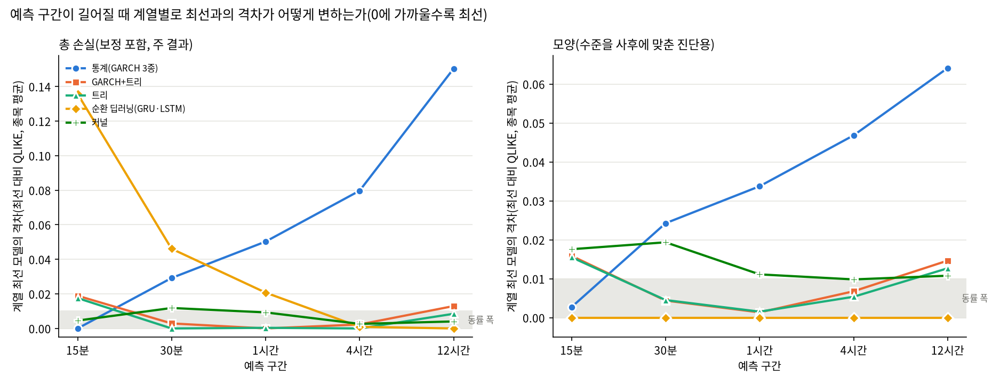

# 26c번: 최신 3년 창과 가격 정지 두 부분 모형

### 0. 이번 회차 실제 분석 범위 ⚠

- **연구 대상(모집단)**: 상위 20종목 (아래 1절 목록)
- **이번 회차 실제 분석**: 대상 전체 20종목 ✅

## 분석 조건 (표준 헤더)

> 이 보고서만 읽어도 데이터 조건을 파악할 수 있도록, 매 회차 동일 항목을 싣는다(AGENTS.md 2.9g).

### 1. 데이터 출처·형식

- **DB / 테이블**: `data/upbit_data_20261005.db` (DuckDB) / `upbit_krw_candle` · 기간 창 2023-10-06 00:00:00 ~ 2026-10-05 20:45:00(끝 미포함)
- **봉 간격**: 15분봉 (하루 96봉)
- **원본 컬럼**: timestamp, open, high, low, close, volume, value
- **분석 종목 20개** — 이력 90,000봉(약 2.5년) 이상 종목 중 선정:

| # | 종목 | 선정 근거 | 봉 수 | 기간 | 표준편차 | 왜도 | 초과첨도 |
| ---: | :--- | :--- | ---: | :--- | ---: | ---: | ---: |
| 1 | KRW-AERGO | - | 95,289 | 2023-10-06~2026-07-18 | 0.007397 | 1.0272 | 80.88 |
| 2 | KRW-AQT | - | 93,269 | 2023-10-06~2026-07-18 | 0.007682 | 0.6870 | 168.97 |
| 3 | KRW-ARDR | - | 100,692 | 2023-10-06~2026-10-05 | 0.007661 | 1.6591 | 115.44 |
| 4 | KRW-ARK | - | 100,337 | 2023-10-06~2026-10-05 | 0.007291 | -0.6344 | 301.82 |
| 5 | KRW-BOUNTY | - | 94,720 | 2023-10-06~2026-10-05 | 0.007563 | 2.0739 | 137.71 |
| 6 | KRW-BTC | - | 104,960 | 2023-10-06~2026-10-05 | 0.002395 | -0.0149 | 105.04 |
| 7 | KRW-BTT | - | 104,118 | 2023-10-06~2026-10-05 | 0.027805 | 0.0090 | 29.22 |
| 8 | KRW-CBK | - | 96,803 | 2023-10-06~2026-10-05 | 0.007121 | 1.2697 | 205.42 |
| 9 | KRW-DOGE | - | 104,957 | 2023-10-06~2026-10-05 | 0.005761 | -0.1569 | 45.38 |
| 10 | KRW-ETC | - | 104,843 | 2023-10-06~2026-10-05 | 0.004447 | -2.2874 | 669.91 |
| 11 | KRW-ETH | - | 104,960 | 2023-10-06~2026-10-05 | 0.003418 | -0.8769 | 466.00 |
| 12 | KRW-MOC | - | 95,087 | 2023-10-06~2026-10-05 | 0.007382 | 1.3674 | 258.59 |
| 13 | KRW-SEI | - | 104,728 | 2023-10-06~2026-10-05 | 0.006328 | -0.2460 | 63.22 |
| 14 | KRW-SHIB | - | 104,943 | 2023-10-06~2026-10-05 | 0.005728 | 0.2729 | 58.16 |
| 15 | KRW-SOL | - | 104,958 | 2023-10-06~2026-10-05 | 0.004497 | 0.1954 | 27.80 |
| 16 | KRW-STRAX | - | 101,302 | 2023-10-06~2026-10-05 | 0.007742 | 1.8372 | 85.75 |
| 17 | KRW-SUI | - | 104,943 | 2023-10-06~2026-10-05 | 0.005967 | -1.0017 | 334.16 |
| 18 | KRW-TOKAMAK | - | 98,367 | 2023-10-06~2026-10-05 | 0.007254 | 1.8933 | 219.24 |
| 19 | KRW-XLM | - | 104,903 | 2023-10-06~2026-10-05 | 0.005160 | -0.1593 | 94.39 |
| 20 | KRW-XRP | - | 104,959 | 2023-10-06~2026-10-05 | 0.004173 | -0.4065 | 155.32 |

### 2. 수집 기간·규모·품질 (대표 종목 KRW-BTC)

- **기간**: 2023-10-06 00:00 ~ 2026-10-05 20:30
- **총 봉 수**: 104,960개 (약 3.00년)
- **연속성**: 15분이 아닌 간격 14개 (0.0133%) — 코인은 24시간 거래라 장 마감·주말 갭이 없다
- **결측**: 0개

### 3. 학습/검증 분할

- **방식**: 시간순 분할(셔플 없음) — 미래 정보 누설 방지
- **비율**: train 70% / validation 30%
- **train**: 2023-10-06 00:00 ~ 2025-11-10 23:45 (73,446봉, 약 765일)
- **validation**: 2025-11-11 00:00 ~ 2026-10-05 20:30 (31,514봉, 약 328일)
- 스케일러·모델 파라미터는 **train 구간에서만** 적합한다.

### 4. 기본 전처리 파이프라인과 가정

```
원본 close (KRW)
  → 로그 변환 log(close)        [스케일 안정화. 여전히 비정상: 단위근]
  → 1차 차분 r = Δlog(close)    [★ 여기서 정상성 확보 — 분석의 출발점]
  → (회차별 추가 처리)
  → 모델 적합
```

- **왜 차분하는가**: 로그가격은 단위근이 있어 비정상(ADF p=0.19)이고, 1차 차분하면 정상이 된다(ADF p=0.000). 정상성은 로그가 아니라 **차분**에서 온다.
- **예측 대상**: 수익률의 부호(방향)가 아니라 **크기(변동성)**. 방향은 자기상관이 0에 가까워 예측이 어렵고, 크기는 장기기억이 있어 예측 가능하다.

### 5. 기초통계량과 데이터 특성 (이전 EDA 확인 사항)

- **조건부 이분산**: ARCH-LM p=0.000 → 변동성이 시간에 따라 변한다(GARCH 계열 사용 근거)
- **장기기억**: |수익률| 자기상관이 하루(96봉) 뒤에도 0.12로 완만히 감소
- **두꺼운 꼬리**: 초과첨도 107 (정규분포는 0). 좌우 대칭(왜도 0.004)이나 양쪽 꼬리가 모두 두껍다. 4σ 초과가 정규 대비 약 100배, 6σ는 약 87만배 빈발
- **선형성 기각**: RESET·BDS 검정 p=0.000 → 선형 모델을 쓸 근거가 없다(비선형·커널 계열 필요)
- **방향 무예측성**: 수익률 자기상관 ≈ 0

### 6. 이번 회차에 적용한 변환

| 처리 | 적용 이유 |
| :--- | :--- |
| 15분 시간 격자 복원 | 업비트는 무체결 구간에 캔들을 만들지 않는다. 행 기준 창은 시간이 아니다 |
| 점검 구간 제외 | BTC·ETH·XRP가 동시에 빈 시각 = 거래소 전체 중단. 보간하지 않는다 |
| 로그수익률 | 종가 기반 |
| 주기 제거(입력 전용) | (요일,시) 슬롯 RMS, 학습 구간만으로 추정. 타깃은 원 스케일 |
| 가격 정지 두 부분 모형(로그 타깃 모델) | 정지 확률 π(공유 분류기) × RV>0에서 보정한 크기 예측 |


## 0. 이 회차가 바꾼 것

26번 평가 틀을 그대로 두고 데이터 창과 가격 정지 처리를 바꿨다. 데이터는 2026-10-05에 이어 받은 DB(`data/upbit_data_20261005.db`, `pipelines/extend_price_mart.py`)의 3년 창 **2023-10-06 00:00:00 ~ 2026-10-05 20:45:00**(KST, 라벨 기준 미포함 끝)이고, 분할은 26번과 같은 규칙(창의 앞 70%를 자정으로 내림)으로 **2025-11-11 00:00:00**이다. 이어 받을 때 기존 데이터와 겹친 1주일의 종가는 종목마다 기존 마지막 봉 하나(7월 수집 때 진행 중이던 봉)를 빼고 모두 같았다.

- **두 부분 모형(주 결과)**: 로그 타깃 모델의 최종 분산 = (1−π)·c₊·(크기 예측)². π는 종목×구간마다 하나인 정지 분류기(LightGBM)가 내고 모든 로그 타깃 모델이 같이 쓴다. c₊는 내부검증 정시 시점 중 RV>0에서 추정한 역변환 배율이다. QLIKE의 최적 점예측이 조건부 기댓값이고(Patton 2011) 정지 때 실제값이 0이므로 E[RV²]=(1−π)·E[RV²|RV>0]이다(두 부분 모형, Duan 외 1983).
- **단일 처리(비교용)**: 26번 방식. 같은 적합 모델의 같은 예측에 RV=0을 포함한 배율 c 하나만 곱한다. `onepart_comparison.csv`에 있다.
- GARCH 계열과 naive는 두 갈래에서 같은 값이다(분산을 직접 예측하므로 정지 처리를 적용하지 않는다). GARCH 보정은 본 실행 안에서 내부학습 재적합으로 한다.
- **상장폐지 종목**: AQT·AERGO는 7월 이후 업비트 KRW 마켓에서 빠져 새 데이터를 받을 수 없다. 생존 편향을 피하려고 빼지 않고, 2026-07-18까지의 데이터로만 평가했다(평가 기간이 다른 종목보다 약 2.5개월 짧다).
- 비교 대상은 24번 모델에서 선형 예측기(Linear·Ridge·HAR-RV)를 뺀 12종과 naive다. 제외 이유는 `test/research_materials/model_catalog.md`에 있다.

소요 2.03시간.

## 1. 데이터: 시간 격자 위에서 본 결측과 평가 표본

| 종목 | 무체결 봉(전체) | 무체결 봉(평가 구간) | 점검 봉 | 영수익률 비율 |
| :--- | ---: | ---: | ---: | ---: |
| AERGO | 2.14% | 4.19% | 242 | 22.1% |
| AQT | 4.21% | 9.96% | 242 | 20.3% |
| ARDR | 4.06% | 7.91% | 242 | 25.6% |
| ARK | 4.40% | 13.42% | 242 | 21.1% |
| BOUNTY | 9.73% | 21.72% | 242 | 29.9% |
| BTC | 0.00% | 0.00% | 242 | 0.6% |
| BTT | 0.80% | 2.13% | 242 | 25.7% |
| CBK | 7.75% | 18.13% | 242 | 27.5% |
| DOGE | 0.00% | 0.01% | 242 | 23.8% |
| ETC | 0.11% | 0.35% | 242 | 7.7% |
| ETH | 0.00% | 0.00% | 242 | 5.6% |
| MOC | 9.39% | 23.48% | 242 | 30.4% |
| SEI | 0.22% | 0.69% | 242 | 19.9% |
| SHIB | 0.02% | 0.02% | 242 | 20.1% |
| SOL | 0.00% | 0.00% | 242 | 6.2% |
| STRAX | 3.48% | 9.89% | 242 | 22.5% |
| SUI | 0.02% | 0.03% | 242 | 7.1% |
| TOKAMAK | 6.27% | 15.58% | 242 | 21.6% |
| XLM | 0.06% | 0.03% | 242 | 22.7% |
| XRP | 0.00% | 0.00% | 242 | 7.9% |

예측 구간별 평가 표본과 실현변동성 크기(종목 중앙값):

| H | 평가 표본(종목 중앙) | 학습 RV 중앙값 | 평가 RV 중앙값 | 평가 RV 95% | 평가 RV=0 비율 | 학습 제외(RV=0) |
| ---: | ---: | ---: | ---: | ---: | ---: | ---: |
| 15분 | 7,878 | 0.233% | 0.210% | 0.998% | 28.43% | 15.59% |
| 30분 | 7,874 | 0.435% | 0.383% | 1.384% | 12.29% | 4.63% |
| 1시간 | 7,873 | 0.692% | 0.626% | 1.891% | 3.23% | 0.74% |
| 4시간 | 1,964 | 1.582% | 1.453% | 3.488% | 0.00% | 0.00% |
| 12시간 | 651 | 2.962% | 2.739% | 5.671% | 0.00% | 0.00% |

## 2. 적합 완결성

기대 20종목 × 5구간 × 13모델 = 1300행, 실제 1300행.
적합 실패 0건.

## 3. 전체 순위(예측 구간별)

종목마다 QLIKE 순위를 매겨 평균했다(작을수록 좋음). ΔQLIKE는 naive 대비 차이의 종목 평균으로, 스케일에 불변이라 종목을 가로질러 평균할 수 있다(음수일수록 naive보다 좋음).

평균 순위는 주 결과(두 부분 모형), 단일 처리는 26번 방식으로 바꿨을 때의 순위다(다른 모델은 그대로). 보정계수는 로그 타깃 모델이면 크기 배율 c₊, GARCH 계열이면 c다.

**주 결과는 전원 보정이다.** 모든 모델(naive 제외)이 같은 절차로 분산 배율 c를 받는다. 로그 타깃 모델은 내부학습 모델의 내부검증 정시 예측으로, GARCH 3종은 내부학습 구간까지로 다시 적합한 모형의 같은 시점 예측으로 c를 추정한다. 이 보정은 로그 역변환 편향을 고치는 동시에 최근 수준에 맞춘 조정 효과도 내므로, 한 계열에만 적용하면 순위가 통째로 바뀐다(초기 실행에서 확인). 그래서 **전원 미보정 순위**를 민감도 분석으로 함께 싣는다. 두 순위가 어긋나는 모델은 수준 맞춤의 영향을 크게 받는 모델이다.

### 15분

| 순위 | 모델 | 처리 방식 | 종목 수 | 평균 순위 | 평균 순위(단일 처리) | 평균 순위(전원 미보정) | ΔQLIKE(naive 대비) | MASE 중앙 | 보정계수 중앙 |
| ---: | :--- | :--- | ---: | ---: | ---: | ---: | ---: | ---: | ---: |
| 1 | GARCH-t | 순차·재귀(통계) | 20 | 4.5 | 4.5 | 1.4 | -32.0724 | 0.981 | 1.00 |
| 2 | GARCH+LightGBM | 순차·재귀 통계 + 트리 결합 | 20 | 4.8 | 5.8 | 7.5 | -32.0535 | 0.973 | 3.66 |
| 3 | LightGBM | 특성 기반 트리(비신경) | 20 | 5.0 | 6.0 | 7.8 | -32.0497 | 0.974 | 3.61 |
| 4 | Nystroem+Ridge | 특성 기반 회귀(비신경) | 20 | 5.2 | 5.6 | 7.5 | -32.0678 | 1.028 | 3.85 |
| 5 | TAR-GARCH | 순차·재귀(통계) | 20 | 5.5 | 5.2 | 2.6 | -32.0687 | 0.977 | 1.07 |
| 6 | HistGBM | 특성 기반 트리(비신경) | 20 | 5.7 | 6.2 | 7.2 | -32.0548 | 1.021 | 3.79 |
| 7 | MS-GARCH | 순차·재귀(통계) | 20 | 6.1 | 5.7 | 2.3 | -30.5825 | 0.974 | 1.06 |
| 8 | XGBoost | 특성 기반 트리(비신경) | 20 | 6.5 | 7.5 | 8.8 | -32.0360 | 0.973 | 3.68 |
| 9 | LSTM | 순차·재귀 | 20 | 7.5 | 6.0 | 9.7 | -31.9367 | 0.957 | 3.46 |
| 10 | GRU | 순차·재귀 | 20 | 8.2 | 7.2 | 10.6 | -31.9035 | 0.932 | 3.42 |
| 11 | KernelRidge-RBF | 특성 기반 회귀(비신경) | 20 | 9.5 | 9.2 | 9.6 | -31.9818 | 0.993 | 4.81 |
| 12 | SVR-RBF | 특성 기반 회귀(비신경) | 20 | 9.8 | 9.6 | 5.8 | -31.9667 | 1.106 | 3.63 |
| 13 | naive | 직전값 | 20 | 12.7 | 12.6 | 10.3 | +0.0000 | 1.000 | 1.00 |

### 30분

| 순위 | 모델 | 처리 방식 | 종목 수 | 평균 순위 | 평균 순위(단일 처리) | 평균 순위(전원 미보정) | ΔQLIKE(naive 대비) | MASE 중앙 | 보정계수 중앙 |
| ---: | :--- | :--- | ---: | ---: | ---: | ---: | ---: | ---: | ---: |
| 1 | LightGBM | 특성 기반 트리(비신경) | 20 | 3.8 | 4.2 | 7.0 | -2.6384 | 0.940 | 2.30 |
| 2 | GARCH+LightGBM | 순차·재귀 통계 + 트리 결합 | 20 | 3.9 | 4.1 | 7.5 | -2.6380 | 0.939 | 2.30 |
| 3 | HistGBM | 특성 기반 트리(비신경) | 20 | 4.4 | 4.8 | 7.1 | -2.6409 | 0.989 | 2.30 |
| 4 | XGBoost | 특성 기반 트리(비신경) | 20 | 4.9 | 5.3 | 7.8 | -2.6361 | 0.941 | 2.30 |
| 5 | Nystroem+Ridge | 특성 기반 회귀(비신경) | 20 | 5.3 | 6.2 | 7.6 | -2.6291 | 0.997 | 2.35 |
| 6 | GRU | 순차·재귀 | 20 | 5.8 | 5.0 | 8.9 | -2.5948 | 0.927 | 2.24 |
| 7 | GARCH-t | 순차·재귀(통계) | 20 | 7.2 | 7.0 | 1.6 | -2.6117 | 0.964 | 0.98 |
| 8 | TAR-GARCH | 순차·재귀(통계) | 20 | 7.4 | 7.2 | 2.5 | -2.6101 | 0.960 | 1.03 |
| 9 | LSTM | 순차·재귀 | 20 | 7.5 | 6.7 | 8.8 | -2.5739 | 0.922 | 2.24 |
| 10 | MS-GARCH | 순차·재귀(통계) | 20 | 7.8 | 7.8 | 2.4 | -0.8803 | 0.956 | 1.03 |
| 11 | KernelRidge-RBF | 특성 기반 회귀(비신경) | 20 | 9.2 | 9.1 | 10.7 | -2.5439 | 0.931 | 2.55 |
| 12 | SVR-RBF | 특성 기반 회귀(비신경) | 20 | 11.1 | 10.9 | 7.4 | -2.5087 | 0.998 | 2.27 |
| 13 | naive | 직전값 | 20 | 12.8 | 12.8 | 11.7 | +0.0000 | 1.000 | 1.00 |

### 1시간

| 순위 | 모델 | 처리 방식 | 종목 수 | 평균 순위 | 평균 순위(단일 처리) | 평균 순위(전원 미보정) | ΔQLIKE(naive 대비) | MASE 중앙 | 보정계수 중앙 |
| ---: | :--- | :--- | ---: | ---: | ---: | ---: | ---: | ---: | ---: |
| 1 | GARCH+LightGBM | 순차·재귀 통계 + 트리 결합 | 20 | 2.8 | 3.0 | 6.4 | -1.0260 | 0.935 | 1.69 |
| 2 | LightGBM | 특성 기반 트리(비신경) | 20 | 3.5 | 3.6 | 6.2 | -1.0257 | 0.935 | 1.69 |
| 3 | XGBoost | 특성 기반 트리(비신경) | 20 | 4.4 | 4.5 | 6.5 | -1.0249 | 0.939 | 1.69 |
| 4 | HistGBM | 특성 기반 트리(비신경) | 20 | 4.5 | 4.8 | 6.8 | -1.0247 | 0.958 | 1.71 |
| 5 | GRU | 순차·재귀 | 20 | 4.7 | 4.7 | 8.2 | -1.0016 | 0.934 | 1.66 |
| 6 | Nystroem+Ridge | 특성 기반 회귀(비신경) | 20 | 4.8 | 4.9 | 7.7 | -1.0168 | 0.953 | 1.70 |
| 7 | LSTM | 순차·재귀 | 20 | 5.1 | 5.3 | 8.4 | -1.0053 | 0.919 | 1.64 |
| 8 | GARCH-t | 순차·재귀(통계) | 20 | 8.9 | 8.6 | 1.6 | -0.9758 | 0.965 | 0.91 |
| 9 | TAR-GARCH | 순차·재귀(통계) | 20 | 9.1 | 8.6 | 2.5 | -0.9747 | 0.944 | 0.99 |
| 10 | KernelRidge-RBF | 특성 기반 회귀(비신경) | 20 | 9.2 | 9.2 | 10.7 | -0.9407 | 0.914 | 1.73 |
| 11 | MS-GARCH | 순차·재귀(통계) | 20 | 9.6 | 9.4 | 2.7 | +1.2360 | 0.948 | 0.99 |
| 12 | SVR-RBF | 특성 기반 회귀(비신경) | 20 | 11.5 | 11.6 | 10.7 | -0.8758 | 0.982 | 1.69 |
| 13 | naive | 직전값 | 20 | 12.8 | 12.8 | 12.6 | +0.0000 | 1.000 | 1.00 |

### 4시간

| 순위 | 모델 | 처리 방식 | 종목 수 | 평균 순위 | 평균 순위(단일 처리) | 평균 순위(전원 미보정) | ΔQLIKE(naive 대비) | MASE 중앙 | 보정계수 중앙 |
| ---: | :--- | :--- | ---: | ---: | ---: | ---: | ---: | ---: | ---: |
| 1 | LightGBM | 특성 기반 트리(비신경) | 20 | 3.7 | 3.7 | 4.3 | -0.6414 | 0.925 | 1.29 |
| 2 | GRU | 순차·재귀 | 20 | 3.9 | 3.9 | 6.3 | -0.6405 | 0.916 | 1.33 |
| 3 | Nystroem+Ridge | 특성 기반 회귀(비신경) | 20 | 4.3 | 4.3 | 5.8 | -0.6388 | 0.971 | 1.29 |
| 4 | LSTM | 순차·재귀 | 20 | 4.5 | 4.5 | 6.8 | -0.6379 | 0.915 | 1.31 |
| 5 | GARCH+LightGBM | 순차·재귀 통계 + 트리 결합 | 20 | 4.5 | 4.5 | 5.2 | -0.6391 | 0.922 | 1.30 |
| 6 | HistGBM | 특성 기반 트리(비신경) | 20 | 4.7 | 4.7 | 5.7 | -0.6383 | 0.953 | 1.29 |
| 7 | XGBoost | 특성 기반 트리(비신경) | 20 | 5.0 | 5.0 | 5.6 | -0.6409 | 0.931 | 1.29 |
| 8 | KernelRidge-RBF | 특성 기반 회귀(비신경) | 20 | 7.3 | 7.3 | 9.5 | -0.5694 | 0.907 | 1.30 |
| 9 | MS-GARCH | 순차·재귀(통계) | 20 | 9.5 | 9.5 | 4.8 | +2.1158 | 0.949 | 0.97 |
| 10 | GARCH-t | 순차·재귀(통계) | 20 | 9.7 | 9.7 | 5.3 | -0.5617 | 0.993 | 0.85 |
| 11 | TAR-GARCH | 순차·재귀(통계) | 20 | 10.3 | 10.3 | 7.2 | -0.5460 | 0.957 | 0.94 |
| 12 | SVR-RBF | 특성 기반 회귀(비신경) | 20 | 11.1 | 11.1 | 11.9 | -0.4980 | 1.042 | 1.40 |
| 13 | naive | 직전값 | 20 | 12.7 | 12.7 | 12.7 | +0.0000 | 1.000 | 1.00 |

### 12시간

| 순위 | 모델 | 처리 방식 | 종목 수 | 평균 순위 | 평균 순위(단일 처리) | 평균 순위(전원 미보정) | ΔQLIKE(naive 대비) | MASE 중앙 | 보정계수 중앙 |
| ---: | :--- | :--- | ---: | ---: | ---: | ---: | ---: | ---: | ---: |
| 1 | GRU | 순차·재귀 | 20 | 3.5 | 3.5 | 4.5 | -0.1534 | 0.984 | 1.21 |
| 2 | Nystroem+Ridge | 특성 기반 회귀(비신경) | 20 | 3.8 | 3.8 | 4.2 | -0.1494 | 1.012 | 1.17 |
| 3 | LSTM | 순차·재귀 | 20 | 4.0 | 4.0 | 5.8 | -0.1457 | 0.983 | 1.21 |
| 4 | LightGBM | 특성 기반 트리(비신경) | 20 | 5.2 | 5.2 | 5.0 | -0.1432 | 1.017 | 1.18 |
| 5 | GARCH+LightGBM | 순차·재귀 통계 + 트리 결합 | 20 | 5.2 | 5.2 | 5.2 | -0.1405 | 1.008 | 1.17 |
| 6 | XGBoost | 특성 기반 트리(비신경) | 20 | 5.5 | 5.5 | 5.2 | -0.1439 | 1.026 | 1.18 |
| 7 | HistGBM | 특성 기반 트리(비신경) | 20 | 5.5 | 5.5 | 5.4 | -0.1450 | 1.053 | 1.19 |
| 8 | KernelRidge-RBF | 특성 기반 회귀(비신경) | 20 | 7.0 | 7.0 | 8.6 | -0.0703 | 0.954 | 1.16 |
| 9 | MS-GARCH | 순차·재귀(통계) | 20 | 9.1 | 9.1 | 6.6 | +2.7966 | 1.028 | 0.95 |
| 10 | GARCH-t | 순차·재귀(통계) | 20 | 10.3 | 10.3 | 9.3 | -0.0031 | 1.107 | 0.70 |
| 11 | SVR-RBF | 특성 기반 회귀(비신경) | 20 | 10.4 | 10.4 | 11.6 | +0.0264 | 1.105 | 1.32 |
| 12 | TAR-GARCH | 순차·재귀(통계) | 20 | 10.7 | 10.7 | 9.2 | +0.0243 | 1.064 | 0.93 |
| 13 | naive | 직전값 | 20 | 10.8 | 10.8 | 10.4 | +0.0000 | 1.000 | 1.00 |

### 역변환 보정의 효과

로그 타깃 모델은 exp 역변환이 조건부 평균이 아닌 기하평균을 내서 체계적으로 낮게 예측한다. 보정계수(분산 배율)가 1보다 크면 과소예측이었다는 뜻이다. GARCH 계열의 보정계수는 역변환 편향이 아니라 수준 맞춤만 반영한다. 보정 전 QLIKE와 함께 보인다.

| H | 모델 | 보정계수 중앙 | QLIKE 보정 전(종목 평균) | 보정 후 |
| ---: | :--- | ---: | ---: | ---: |
| 15분 | GARCH+LightGBM | 3.66 | -8.7575 | -9.8959 |
| 15분 | GARCH-t | 1.00 | -9.9268 | -9.9148 |
| 15분 | GRU | 3.42 | -8.4575 | -9.7459 |
| 15분 | HistGBM | 3.79 | -8.9653 | -9.8972 |
| 15분 | KernelRidge-RBF | 4.81 | -8.4953 | -9.8242 |
| 15분 | LSTM | 3.46 | -8.5486 | -9.7791 |
| 15분 | LightGBM | 3.61 | -8.7444 | -9.8921 |
| 15분 | MS-GARCH | 1.06 | -9.8435 | -8.4249 |
| 15분 | Nystroem+Ridge | 3.85 | -8.9035 | -9.9102 |
| 15분 | SVR-RBF | 3.63 | -9.0865 | -9.8091 |
| 15분 | TAR-GARCH | 1.07 | -9.9057 | -9.9111 |
| 15분 | XGBoost | 3.68 | -8.6842 | -9.8784 |
| 30분 | GARCH+LightGBM | 2.30 | -8.7812 | -9.2958 |
| 30분 | GARCH-t | 0.98 | -9.2836 | -9.2695 |
| 30분 | GRU | 2.24 | -8.6939 | -9.2526 |
| 30분 | HistGBM | 2.30 | -8.8286 | -9.2987 |
| 30분 | KernelRidge-RBF | 2.55 | -8.4731 | -9.2017 |
| 30분 | LSTM | 2.24 | -8.6878 | -9.2317 |
| 30분 | LightGBM | 2.30 | -8.7855 | -9.2962 |
| 30분 | MS-GARCH | 1.03 | -9.1878 | -7.5381 |
| 30분 | Nystroem+Ridge | 2.35 | -8.8128 | -9.2869 |
| 30분 | SVR-RBF | 2.27 | -8.7808 | -9.1665 |
| 30분 | TAR-GARCH | 1.03 | -9.2672 | -9.2679 |
| 30분 | XGBoost | 2.30 | -8.7802 | -9.2939 |
| 1시간 | GARCH+LightGBM | 1.69 | -8.3771 | -8.6167 |
| 1시간 | GARCH-t | 0.91 | -8.5873 | -8.5664 |
| 1시간 | GRU | 1.66 | -8.2914 | -8.5922 |
| 1시간 | HistGBM | 1.71 | -8.3808 | -8.6154 |
| 1시간 | KernelRidge-RBF | 1.73 | -8.1621 | -8.5314 |
| 1시간 | LSTM | 1.64 | -8.2901 | -8.5960 |
| 1시간 | LightGBM | 1.69 | -8.3772 | -8.6163 |
| 1시간 | MS-GARCH | 0.99 | -8.4814 | -6.3546 |
| 1시간 | Nystroem+Ridge | 1.70 | -8.3644 | -8.6074 |
| 1시간 | SVR-RBF | 1.69 | -8.2087 | -8.4665 |
| 1시간 | TAR-GARCH | 0.99 | -8.5711 | -8.5653 |
| 1시간 | XGBoost | 1.69 | -8.3782 | -8.6156 |
| 4시간 | GARCH+LightGBM | 1.30 | -7.0611 | -7.1221 |
| 4시간 | GARCH-t | 0.85 | -7.0850 | -7.0447 |
| 4시간 | GRU | 1.33 | -7.0292 | -7.1234 |
| 4시간 | HistGBM | 1.29 | -7.0625 | -7.1213 |
| 4시간 | KernelRidge-RBF | 1.30 | -6.9513 | -7.0524 |
| 4시간 | LSTM | 1.31 | -7.0231 | -7.1208 |
| 4시간 | LightGBM | 1.29 | -7.0649 | -7.1244 |
| 4시간 | MS-GARCH | 0.97 | -6.9859 | -4.3672 |
| 4시간 | Nystroem+Ridge | 1.29 | -7.0597 | -7.1217 |
| 4시간 | SVR-RBF | 1.40 | -6.8628 | -6.9810 |
| 4시간 | TAR-GARCH | 0.94 | -7.0541 | -7.0289 |
| 4시간 | XGBoost | 1.29 | -7.0655 | -7.1239 |
| 12시간 | GARCH+LightGBM | 1.17 | -5.8839 | -5.9034 |
| 12시간 | GARCH-t | 0.70 | -5.8195 | -5.7660 |
| 12시간 | GRU | 1.21 | -5.8757 | -5.9164 |
| 12시간 | HistGBM | 1.19 | -5.8872 | -5.9079 |
| 12시간 | KernelRidge-RBF | 1.16 | -5.7948 | -5.8332 |
| 12시간 | LSTM | 1.21 | -5.8661 | -5.9086 |
| 12시간 | LightGBM | 1.18 | -5.8864 | -5.9062 |
| 12시간 | MS-GARCH | 0.95 | -5.7798 | -2.9663 |
| 12시간 | Nystroem+Ridge | 1.17 | -5.8875 | -5.9123 |
| 12시간 | SVR-RBF | 1.32 | -5.6664 | -5.7365 |
| 12시간 | TAR-GARCH | 0.93 | -5.8217 | -5.7387 |
| 12시간 | XGBoost | 1.18 | -5.8880 | -5.9068 |

## 4. 사전 구간별 순위(직전 H시간 RV 5분위, 학습 구간 분위수)

구간 경계는 학습 구간의 직전 RV 분위수로 정해서 예측 시점에 이미 알 수 있다. 24·25번의 사후(실현 RV) 구간과 다르다.

### 15분

| 모델 | Q1 | Q2 | Q3 | Q4 | Q5 |
| :--- | ---: | ---: | ---: | ---: | ---: |
| *구간 실현RV(종목 중앙값 대비)* | *0.75배* | *0.82배* | *1.00배* | *1.22배* | *1.78배* |
| Nystroem+Ridge | 8.0 | 5.8 | 6.0 | **3.0** | **4.2** |
| GARCH+LightGBM | 4.7 | **4.2** | 5.6 | 6.0 | 6.9 |
| LightGBM | **4.1** | 5.0 | 6.1 | 5.1 | 7.3 |
| GARCH-t | 6.4 | 5.6 | 4.7 | 6.2 | 5.5 |
| TAR-GARCH | 6.5 | 6.9 | **4.4** | 5.8 | 6.7 |
| HistGBM | 6.6 | 6.0 | 6.7 | 6.9 | 5.3 |
| MS-GARCH | 5.7 | 7.9 | 5.5 | 6.3 | 6.2 |
| XGBoost | 4.7 | 5.8 | 6.8 | 6.3 | 8.4 |
| LSTM | 8.5 | 7.0 | 6.8 | 7.3 | 5.0 |
| GRU | 6.3 | 6.9 | 7.8 | 8.0 | 6.7 |
| KernelRidge-RBF | 7.3 | 7.6 | 7.9 | 7.5 | 9.2 |
| SVR-RBF | 10.2 | 9.6 | 10.7 | 10.0 | 9.9 |
| naive | 11.8 | 12.7 | 12.2 | 12.4 | 9.7 |

굵은 글씨는 그 구간(열)의 1위다. 구간별 1위: Q1=LightGBM, Q2=GARCH+LightGBM, Q3=TAR-GARCH, Q4=Nystroem+Ridge, Q5=Nystroem+Ridge

### 30분

| 모델 | Q1 | Q2 | Q3 | Q4 | Q5 |
| :--- | ---: | ---: | ---: | ---: | ---: |
| *구간 실현RV(종목 중앙값 대비)* | *0.75배* | *0.84배* | *1.01배* | *1.22배* | *1.77배* |
| GARCH+LightGBM | 4.0 | **4.5** | **3.6** | **4.2** | 5.5 |
| LightGBM | **3.0** | 4.5 | 3.6 | 5.2 | 6.0 |
| XGBoost | 4.0 | 5.1 | 4.9 | 4.9 | 6.7 |
| HistGBM | 5.4 | 5.5 | 4.6 | 5.8 | 4.5 |
| Nystroem+Ridge | 7.4 | 5.5 | 4.7 | 5.0 | 4.8 |
| GRU | 6.8 | 4.8 | 6.7 | 5.5 | **4.1** |
| LSTM | 8.0 | 6.7 | 8.2 | 6.8 | 5.2 |
| GARCH-t | 6.9 | 7.8 | 8.6 | 8.2 | 6.8 |
| KernelRidge-RBF | 6.2 | 7.5 | 6.6 | 7.2 | 10.8 |
| TAR-GARCH | 7.7 | 7.8 | 8.7 | 7.8 | 7.5 |
| MS-GARCH | 9.0 | 8.4 | 7.5 | 8.2 | 7.5 |
| SVR-RBF | 10.2 | 10.4 | 10.6 | 9.8 | 11.1 |
| naive | 12.3 | 12.7 | 12.7 | 12.3 | 10.3 |

굵은 글씨는 그 구간(열)의 1위다. 구간별 1위: Q1=LightGBM, Q2=GARCH+LightGBM, Q3=GARCH+LightGBM, Q4=GARCH+LightGBM, Q5=GRU

### 1시간

| 모델 | Q1 | Q2 | Q3 | Q4 | Q5 |
| :--- | ---: | ---: | ---: | ---: | ---: |
| *구간 실현RV(종목 중앙값 대비)* | *0.71배* | *0.86배* | *1.02배* | *1.21배* | *1.76배* |
| GARCH+LightGBM | 3.6 | **3.5** | **3.7** | 4.3 | 4.4 |
| LightGBM | **3.3** | 3.5 | 4.3 | 4.5 | 4.7 |
| XGBoost | 4.7 | 4.5 | 4.6 | 3.6 | 5.3 |
| Nystroem+Ridge | 6.0 | 3.8 | 4.4 | **3.5** | 5.9 |
| HistGBM | 4.2 | 4.2 | 5.2 | 5.7 | 4.7 |
| GRU | 5.3 | 5.8 | 5.8 | 5.8 | **3.5** |
| LSTM | 6.5 | 6.8 | 6.2 | 4.7 | 4.0 |
| KernelRidge-RBF | 6.5 | 7.5 | 6.5 | 7.4 | 11.4 |
| GARCH-t | 8.4 | 9.4 | 9.5 | 9.6 | 8.2 |
| TAR-GARCH | 9.0 | 10.2 | 9.7 | 9.1 | 8.2 |
| MS-GARCH | 10.6 | 9.1 | 8.7 | 9.1 | 8.8 |
| SVR-RBF | 10.1 | 10.0 | 9.6 | 11.1 | 12.0 |
| naive | 12.9 | 12.8 | 12.8 | 12.7 | 9.9 |

굵은 글씨는 그 구간(열)의 1위다. 구간별 1위: Q1=LightGBM, Q2=GARCH+LightGBM, Q3=GARCH+LightGBM, Q4=Nystroem+Ridge, Q5=GRU

### 4시간

| 모델 | Q1 | Q2 | Q3 | Q4 | Q5 |
| :--- | ---: | ---: | ---: | ---: | ---: |
| *구간 실현RV(종목 중앙값 대비)* | *0.73배* | *0.87배* | *1.03배* | *1.21배* | *1.69배* |
| Nystroem+Ridge | 6.2 | 4.2 | **3.2** | 4.5 | 4.4 |
| LightGBM | 4.5 | 4.6 | 4.3 | 5.1 | 4.7 |
| GRU | **4.2** | 5.3 | 5.5 | 4.8 | 4.0 |
| GARCH+LightGBM | 4.3 | **4.0** | 4.7 | 5.8 | 5.4 |
| LSTM | 4.5 | 6.4 | 6.5 | **3.8** | **3.8** |
| XGBoost | 6.0 | 4.9 | 4.5 | 4.7 | 6.3 |
| HistGBM | 5.2 | 5.2 | 5.9 | 7.0 | 5.0 |
| KernelRidge-RBF | 6.1 | 5.3 | 5.7 | 6.2 | 9.8 |
| MS-GARCH | 9.3 | 8.0 | 9.1 | 8.4 | 9.1 |
| SVR-RBF | 9.5 | 9.2 | 8.0 | 9.6 | 12.0 |
| GARCH-t | 8.9 | 10.1 | 10.6 | 10.0 | 8.8 |
| TAR-GARCH | 9.6 | 11.0 | 11.3 | 10.7 | 8.9 |
| naive | 12.8 | 12.7 | 11.8 | 10.4 | 9.1 |

굵은 글씨는 그 구간(열)의 1위다. 구간별 1위: Q1=GRU, Q2=GARCH+LightGBM, Q3=Nystroem+Ridge, Q4=LSTM, Q5=LSTM

### 12시간

| 모델 | Q1 | Q2 | Q3 | Q4 | Q5 |
| :--- | ---: | ---: | ---: | ---: | ---: |
| *구간 실현RV(종목 중앙값 대비)* | *0.74배* | *0.90배* | *1.04배* | *1.22배* | *1.59배* |
| Nystroem+Ridge | 5.4 | **3.8** | **4.3** | **4.2** | 4.1 |
| GRU | **3.9** | 5.8 | 5.7 | 4.5 | **2.8** |
| LSTM | 5.1 | 6.2 | 6.8 | 5.0 | 3.4 |
| XGBoost | 6.2 | 5.1 | 5.3 | 6.0 | 5.7 |
| LightGBM | 6.5 | 5.5 | 5.3 | 5.2 | 6.2 |
| GARCH+LightGBM | 6.4 | 5.9 | 5.5 | 5.3 | 5.8 |
| HistGBM | 6.3 | 6.5 | 6.2 | 6.5 | 5.8 |
| KernelRidge-RBF | 4.8 | 5.3 | 5.8 | 7.2 | 8.7 |
| SVR-RBF | 7.4 | 6.7 | 8.1 | 9.9 | 11.7 |
| MS-GARCH | 8.8 | 8.6 | 9.2 | 7.5 | 9.6 |
| naive | 11.9 | 11.1 | 7.3 | 7.5 | 6.4 |
| GARCH-t | 9.2 | 9.6 | 9.8 | 10.8 | 10.6 |
| TAR-GARCH | 9.1 | 10.8 | 11.6 | 11.5 | 10.2 |

굵은 글씨는 그 구간(열)의 1위다. 구간별 1위: Q1=GRU, Q2=Nystroem+Ridge, Q3=Nystroem+Ridge, Q4=Nystroem+Ridge, Q5=GRU

## 5. 달력 분기별 순위(평가 구간)

### 15분 (상위 8개 모델)

| 모델 | 2025Q4 | 2026Q1 | 2026Q2 | 2026Q3 | 2026Q4 |
| :--- | ---: | ---: | ---: | ---: | ---: |
| GARCH-t | 5.8 | 5.0 | 5.7 | 5.0 | 5.7 |
| GARCH+LightGBM | 6.2 | 5.4 | 5.4 | 5.0 | 5.2 |
| LightGBM | 5.8 | 6.1 | 4.7 | 5.5 | 5.3 |
| TAR-GARCH | 5.3 | 5.7 | 6.2 | 5.8 | 5.3 |
| Nystroem+Ridge | 5.3 | 5.3 | 5.5 | 6.3 | 7.0 |
| HistGBM | 7.0 | 5.8 | 6.0 | 5.3 | 6.6 |
| MS-GARCH | 6.2 | 6.0 | 5.8 | 6.8 | 7.1 |
| XGBoost | 5.9 | 7.1 | 6.3 | 6.8 | 6.0 |

### 30분 (상위 8개 모델)

| 모델 | 2025Q4 | 2026Q1 | 2026Q2 | 2026Q3 | 2026Q4 |
| :--- | ---: | ---: | ---: | ---: | ---: |
| LightGBM | 4.8 | 3.9 | 3.6 | 4.2 | 3.9 |
| GARCH+LightGBM | 4.3 | 4.2 | 4.4 | 3.8 | 4.3 |
| XGBoost | 5.0 | 5.4 | 4.5 | 4.8 | 4.1 |
| HistGBM | 6.2 | 4.4 | 4.7 | 3.9 | 4.9 |
| Nystroem+Ridge | 5.5 | 4.5 | 4.9 | 6.7 | 6.9 |
| GRU | 4.9 | 6.5 | 5.7 | 6.2 | 6.6 |
| LSTM | 6.7 | 6.7 | 7.5 | 7.5 | 6.9 |
| GARCH-t | 7.6 | 7.5 | 7.8 | 7.3 | 8.7 |

### 1시간 (상위 8개 모델)

| 모델 | 2025Q4 | 2026Q1 | 2026Q2 | 2026Q3 | 2026Q4 |
| :--- | ---: | ---: | ---: | ---: | ---: |
| LightGBM | 4.5 | 3.6 | 3.4 | 3.8 | 3.9 |
| GARCH+LightGBM | 3.6 | 3.5 | 3.7 | 4.0 | 4.8 |
| XGBoost | 5.1 | 4.4 | 3.9 | 4.2 | 5.1 |
| Nystroem+Ridge | 4.1 | 3.8 | 4.7 | 5.2 | 5.5 |
| HistGBM | 5.6 | 5.0 | 4.3 | 4.2 | 5.3 |
| GRU | 5.0 | 4.9 | 5.1 | 4.8 | 5.6 |
| LSTM | 5.0 | 5.3 | 5.9 | 5.7 | 6.1 |
| KernelRidge-RBF | 7.4 | 8.6 | 8.2 | 8.9 | 6.8 |

### 4시간 (상위 8개 모델)

| 모델 | 2025Q4 | 2026Q1 | 2026Q2 | 2026Q3 | 2026Q4 |
| :--- | ---: | ---: | ---: | ---: | ---: |
| LightGBM | 3.9 | 3.9 | 4.4 | 4.2 | 5.7 |
| Nystroem+Ridge | 4.5 | 2.9 | 4.2 | 5.4 | 5.9 |
| GRU | 5.8 | 4.3 | 4.2 | 4.4 | 4.1 |
| GARCH+LightGBM | 3.9 | 4.7 | 4.9 | 4.7 | 5.2 |
| LSTM | 6.0 | 4.7 | 5.0 | 4.4 | 4.9 |
| HistGBM | 5.8 | 4.7 | 5.0 | 4.8 | 5.7 |
| XGBoost | 5.1 | 5.2 | 5.1 | 5.3 | 6.1 |
| KernelRidge-RBF | 5.1 | 8.1 | 5.8 | 6.8 | 6.0 |

### 12시간 (상위 8개 모델)

| 모델 | 2025Q4 | 2026Q1 | 2026Q2 | 2026Q3 |
| :--- | ---: | ---: | ---: | ---: |
| Nystroem+Ridge | 3.5 | 3.0 | 4.3 | 4.8 |
| GRU | 5.8 | 3.6 | 4.2 | 3.8 |
| LSTM | 5.7 | 4.0 | 4.6 | 4.8 |
| LightGBM | 4.5 | 5.2 | 6.0 | 5.9 |
| XGBoost | 4.5 | 5.2 | 6.2 | 6.3 |
| GARCH+LightGBM | 5.0 | 5.4 | 6.0 | 5.8 |
| HistGBM | 6.2 | 5.9 | 5.5 | 5.8 |
| KernelRidge-RBF | 4.8 | 7.5 | 6.7 | 6.1 |

## 6. 통합 판정: 구간별로 어느 모델들이 사실상 같이 최선인가

순위는 작은 차이도 한 계단씩 벌려 놓는다. 그래서 칸마다 **최선 모델 대비 QLIKE 격차가 0.01 이하인 모델을 A등급(사실상 동률)**으로 묶는다. 0.01는 GRU를 시드 5개로 다시 학습했을 때의 QLIKE 표준편차(0.005~0.013)에 맞춘 값으로, 이보다 작은 차이는 모델 차이라고 볼 수 없다. 괄호는 그 모델이 종목별 최선과 0.01 이내였던 종목 수다. 세 기준을 나란히 둔다.

- **보정후**(주 결과): 전 모델에 같은 절차의 수준 보정
- **보정전**(민감도): 아무 보정 없음. 로그 타깃 모델은 옌센 편향을 그대로 안는다
- **모양**(진단용, 사후): 칸마다 평가 구간에서 수준을 최적으로 맞춘 뒤의 손실. 수준 정확도를 빼고 오르내림 추적 실력만 본다. 평가 구간 정보를 쓰므로 실전 성능이 아니다

### 15분

| 구간 | 보정후 A등급(최선 대비 ≤0.01) | 보정전 A등급(최선 대비 ≤0.01) | 모양 A등급(최선 대비 ≤0.01) |
| :--- | :--- | :--- | :--- |
| 전체 | GARCH-t(11/20), TAR-GARCH(9/20), Nys(6/20) | GARCH-t(16/20) | GRU(9/20), GARCH-t(9/20), TAR-GARCH(7/20) |
| Q1 | LGBM(6/15), G+LGBM(4/15), XGB(3/15), TAR-GARCH(4/15) | GARCH-t(9/15), TAR-GARCH(7/15) | LGBM(3/15), MS-GARCH(6/15), G+LGBM(3/15), XGB(2/15), GARCH-t(5/15), HGB(3/15), TAR-GARCH(3/15) |
| Q2 | GARCH-t(6/16), TAR-GARCH(5/16) | GARCH-t(11/16) | GRU(7/16), G+LGBM(5/16), LGBM(6/16) |
| Q3 | TAR-GARCH(10/20), GARCH-t(7/20) | GARCH-t(13/20), TAR-GARCH(9/20) | TAR-GARCH(10/20), GARCH-t(5/20), G+LGBM(5/20), MS-GARCH(11/20) |
| Q4 | Nys(14/20) | GARCH-t(12/20), TAR-GARCH(6/20) | Nys(11/20) |
| Q5 | Nys(2/20) | GARCH-t(16/20) | LSTM(8/20) |

### 30분

| 구간 | 보정후 A등급(최선 대비 ≤0.01) | 보정전 A등급(최선 대비 ≤0.01) | 모양 A등급(최선 대비 ≤0.01) |
| :--- | :--- | :--- | :--- |
| 전체 | HGB(11/20), LGBM(11/20), G+LGBM(11/20), XGB(8/20) | GARCH-t(15/20) | GRU(14/20), G+LGBM(11/20), LGBM(12/20), HGB(9/20), XGB(10/20), LSTM(8/20) |
| Q1 | LGBM(12/20), G+LGBM(10/20), XGB(8/20) | GARCH-t(14/20) | GRU(13/20), LGBM(13/20), G+LGBM(10/20), XGB(11/20), LSTM(8/20), KRR(7/20) |
| Q2 | Nys(6/20), HGB(7/20), LGBM(8/20) | GARCH-t(12/20), TAR-GARCH(7/20) | GRU(14/20) |
| Q3 | G+LGBM(10/20), LGBM(11/20), Nys(8/20), HGB(8/20), XGB(7/20) | GARCH-t(8/20) | G+LGBM(11/20), Nys(9/20), LGBM(10/20), HGB(7/20), XGB(7/20), GRU(8/20), KRR(8/20), LSTM(4/20) |
| Q4 | Nys(10/20), XGB(7/20), TAR-GARCH(2/20), LGBM(7/20), G+LGBM(10/20) | GARCH-t(14/20), TAR-GARCH(9/20) | GRU(11/20), XGB(7/20), G+LGBM(8/20), LGBM(7/20), LSTM(9/20), Nys(12/20) |
| Q5 | HGB(5/20), Nys(5/20) | GARCH-t(15/20) | GRU(10/20), LSTM(13/20), HGB(3/20) |

### 1시간

| 구간 | 보정후 A등급(최선 대비 ≤0.01) | 보정전 A등급(최선 대비 ≤0.01) | 모양 A등급(최선 대비 ≤0.01) |
| :--- | :--- | :--- | :--- |
| 전체 | G+LGBM(14/20), LGBM(13/20), XGB(14/20), HGB(15/20), Nys(11/20) | GARCH-t(14/20) | GRU(14/20), G+LGBM(14/20), LGBM(14/20), LSTM(15/20), XGB(14/20), HGB(11/20) |
| Q1 | LGBM(12/20), G+LGBM(12/20), HGB(10/20), XGB(9/20) | GARCH-t(13/20) | GRU(13/20), LSTM(8/20), LGBM(9/20), G+LGBM(8/20), HGB(4/20), XGB(7/20) |
| Q2 | G+LGBM(14/20), LGBM(13/20), XGB(13/20), HGB(11/20), Nys(12/20) | GARCH-t(11/20) | G+LGBM(12/20), Nys(12/20), GRU(12/20), LGBM(12/20), XGB(12/20), HGB(10/20), KRR(8/20), LSTM(8/20) |
| Q3 | XGB(11/20), HGB(5/20), G+LGBM(13/20), LGBM(10/20) | GARCH-t(13/20) | XGB(9/20), G+LGBM(13/20), LGBM(8/20), LSTM(9/20), HGB(4/20), GRU(10/20), Nys(11/20) |
| Q4 | Nys(15/20), G+LGBM(11/20), XGB(12/20), LGBM(11/20), HGB(7/20) | GARCH-t(10/20), TAR-GARCH(8/20) | Nys(15/20), XGB(11/20), G+LGBM(11/20), LGBM(10/20), LSTM(11/20), GRU(10/20), HGB(6/20), KRR(8/20) |
| Q5 | GRU(12/20), HGB(2/20), LSTM(10/20), G+LGBM(3/20), LGBM(3/20) | GARCH-t(10/20) | GRU(16/20), LSTM(11/20) |

### 4시간

| 구간 | 보정후 A등급(최선 대비 ≤0.01) | 보정전 A등급(최선 대비 ≤0.01) | 모양 A등급(최선 대비 ≤0.01) |
| :--- | :--- | :--- | :--- |
| 전체 | LGBM(5/20), XGB(5/20), GRU(9/20), G+LGBM(5/20), Nys(9/20), HGB(5/20), LSTM(7/20) | GARCH-t(6/20) | GRU(11/20), LSTM(13/20), LGBM(6/20), XGB(6/20), G+LGBM(7/20), HGB(6/20), Nys(9/20) |
| Q1 | GRU(11/20), LSTM(8/20) | GARCH-t(6/20) | GRU(12/20), LSTM(11/20) |
| Q2 | G+LGBM(9/20), LGBM(8/20), Nys(12/20), HGB(8/20), XGB(8/20) | G+LGBM(6/20), LGBM(8/20), XGB(8/20), HGB(6/20), Nys(3/20) | G+LGBM(9/20), LGBM(10/20), KRR(14/20), Nys(10/20), XGB(7/20), HGB(6/20), GRU(9/20), LSTM(5/20) |
| Q3 | Nys(14/20), LGBM(8/20) | Nys(7/20), LGBM(6/20) | Nys(16/20), KRR(9/20), LGBM(9/20) |
| Q4 | XGB(5/20) | GARCH-t(2/20) | LSTM(13/20), XGB(5/20), GRU(8/20) |
| Q5 | GRU(8/20), LSTM(7/20) | GARCH-t(7/20) | LSTM(8/20), LGBM(6/20), GRU(7/20), G+LGBM(6/20) |

### 12시간

| 구간 | 보정후 A등급(최선 대비 ≤0.01) | 보정전 A등급(최선 대비 ≤0.01) | 모양 A등급(최선 대비 ≤0.01) |
| :--- | :--- | :--- | :--- |
| 전체 | GRU(12/20), Nys(8/20), LSTM(7/20), HGB(3/20), XGB(2/20) | XGB(7/20), Nys(8/20), HGB(6/20), LGBM(6/20), G+LGBM(6/20) | GRU(12/20), LSTM(12/20) |
| Q1 | GRU(7/17), KRR(4/17) | KRR(5/17), LGBM(4/17), XGB(6/17), G+LGBM(3/17), GRU(7/17), HGB(5/17) | GRU(6/17), KRR(8/17), LGBM(4/17), LSTM(8/17), G+LGBM(4/17), XGB(6/17) |
| Q2 | Nys(9/19) | XGB(9/19), Nys(8/19), G+LGBM(7/19), LGBM(7/19) | KRR(5/19), Nys(8/19) |
| Q3 | HGB(6/20), XGB(6/20), Nys(6/20), LGBM(5/20) | XGB(3/20), HGB(4/20), LGBM(3/20) | XGB(5/20), naive(11/20), HGB(5/20), Nys(6/20), LGBM(4/20), G+LGBM(3/20), GRU(3/20) |
| Q4 | GRU(9/20), Nys(6/20) | GARCH-t(4/20) | GRU(8/20), LSTM(6/20), Nys(8/20), KRR(4/20) |
| Q5 | LSTM(3/19), GRU(8/19) | naive(4/19), LSTM(6/19) | LSTM(11/19) |


### 알고리즘별 프로필: 예측 구간이 길어지면 어떻게 되는가

셀은 `전체 등급/Q5 등급 (전체 격차)`이다. 등급 A는 최선 대비 ≤0.01, B는 ≤0.03, C는 그 밖이다. 보정후 기준이며, 괄호 안 격차는 그 구간 최선 모델 대비 QLIKE 차이의 종목 평균이다. 마지막 칸은 모양 기준 전체 등급이다.

| 계열 | 모델 | 15분 | 30분 | 1시간 | 4시간 | 12시간 | 모양 등급(15분·30분·1시간·4시간·12시간) |
| :--- | :--- | :--- | :--- | :--- | :--- | :--- | :--- |
| 통계(GARCH 3종) | GARCH-t | A/C (0.000) | B/C (0.029) | C/C (0.050) | C/C (0.080) | C/C (0.150) | A·B·C·C·C |
| 통계(GARCH 3종) | MS-GARCH | C/C (1.490) | C/C (1.761) | C/C (2.262) | C/C (2.757) | C/C (2.950) | B·C·C·C·C |
| 통계(GARCH 3종) | TAR-GARCH | A/C (0.004) | C/C (0.031) | C/C (0.051) | C/C (0.095) | C/C (0.178) | A·B·C·C·C |
| GARCH+트리 | GARCH+LightGBM | B/C (0.019) | A/C (0.003) | A/A (0.000) | A/B (0.002) | B/C (0.013) | B·A·A·A·B |
| 트리 | LightGBM | B/C (0.023) | A/C (0.003) | A/A (0.000) | A/B (0.000) | B/C (0.010) | B·A·A·A·B |
| 트리 | XGBoost | C/C (0.036) | A/C (0.005) | A/B (0.001) | A/C (0.001) | A/C (0.010) | B·A·A·A·B |
| 트리 | HistGBM | B/C (0.018) | A/A (0.000) | A/A (0.001) | A/B (0.003) | A/C (0.008) | B·A·A·A·B |
| 순환 딥러닝(GRU·LSTM) | GRU | C/C (0.169) | C/B (0.046) | B/A (0.024) | A/A (0.001) | A/A (0.000) | A·A·A·A·A |
| 순환 딥러닝(GRU·LSTM) | LSTM | C/C (0.136) | C/C (0.067) | B/A (0.021) | A/A (0.004) | A/A (0.008) | B·A·A·A·A |
| 커널 | KernelRidge-RBF | C/C (0.091) | C/C (0.097) | C/C (0.085) | C/C (0.072) | C/C (0.083) | C·C·C·C·C |
| 커널 | SVR-RBF | C/C (0.106) | C/C (0.132) | C/C (0.150) | C/C (0.143) | C/C (0.180) | C·C·C·C·C |
| 커널 | Nystroem+Ridge | A/A (0.005) | B/A (0.012) | A/B (0.009) | A/B (0.003) | A/C (0.004) | B·B·B·A·B |



그림 읽는 법: 각 선은 그 계열에서 가장 좋은 모델의 격차다. 회색 띠(0~0.01) 안에 있으면 그 예측 구간의 최선과 사실상 동률이다. 수치는 위 표와 `tier_table.csv`에 있다.

### 짧은 예측 구간과 가격 정지(RV=0): 결과가 데이터 특성에서 오는가

평가 시점을 **가격이 움직인 시점(RV>0)**과 **가격이 한 칸도 안 움직인 시점(RV=0)**으로 나눠, 각 모델의 손실을 GARCH-t와 비교한다(음수면 그 모델이 GARCH-t보다 낫다). RV=0에서는 QLIKE가 log(예측 분산)이 되어 작게 예측할수록 유리하다. 로그 타깃 모델의 크기 부분은 log(0)을 정의할 수 없어 RV=0 표본을 빼고 학습하고, 이 회차에서는 정지 확률 π가 그 자리를 맡는다. GARCH 계열은 수익률 0을 그대로 받아 분산을 추정한다. 아래는 주 결과(두 부분 모형) 기준이다. 단일 처리 기준은 7절에 있다.

| 예측 구간 | 평가 RV=0 비율(종목 중앙) | 종목별 RV=0 비율과 (LightGBM−GARCH-t) 격차의 상관 |
| :--- | ---: | ---: |
| 15분 | 28.4% | +0.38 |
| 30분 | 12.3% | -0.06 |
| 1시간 | 3.2% | -0.44 |
| 4시간 | 0.0% | -0.48 |
| 12시간 | 0.0% | +nan |

셀은 `움직인 시점 차 / 정지 시점 차`(GARCH-t 대비, 종목 평균)이다.

| 모델 | 15분 | 30분 | 1시간 | 4시간 | 12시간 |
| :--- | :--- | :--- | :--- | :--- | :--- |
| naive | +32.933 / -0.310 | +2.783 / -0.329 | +1.018 / -0.294 | +0.563 / -0.102 | +0.003 / - |
| MS-GARCH | +2.664 / -0.144 | +2.310 / -0.149 | +2.472 / -0.144 | +2.693 / +0.088 | +2.800 / - |
| TAR-GARCH | +0.005 / -0.010 | +0.001 / -0.022 | +0.001 / -0.036 | +0.016 / +0.030 | +0.027 / - |
| KernelRidge-RBF | -0.024 / +0.232 | +0.056 / +0.056 | +0.037 / -0.045 | -0.008 / -0.068 | -0.067 / - |
| SVR-RBF | -0.014 / +0.259 | +0.088 / +0.157 | +0.098 / +0.089 | +0.063 / +0.181 | +0.029 / - |
| Nystroem+Ridge | -0.128 / +0.178 | -0.058 / +0.080 | -0.054 / +0.014 | -0.078 / +0.208 | -0.146 / - |
| LightGBM | +0.020 / +0.001 | -0.035 / -0.056 | -0.056 / -0.073 | -0.080 / +0.086 | -0.140 / - |
| XGBoost | +0.047 / -0.004 | -0.032 / -0.055 | -0.056 / -0.070 | -0.080 / +0.088 | -0.141 / - |
| HistGBM | -0.113 / +0.155 | -0.060 / +0.001 | -0.057 / -0.062 | -0.077 / +0.086 | -0.142 / - |
| GARCH+LightGBM | +0.010 / +0.007 | -0.034 / -0.058 | -0.057 / -0.072 | -0.078 / +0.065 | -0.137 / - |
| GRU | +0.474 / -0.313 | +0.071 / -0.262 | -0.021 / -0.207 | -0.079 / -0.151 | -0.150 / - |
| LSTM | +0.382 / -0.238 | +0.096 / -0.233 | -0.026 / -0.180 | -0.076 / -0.126 | -0.143 / - |

## 7. 두 부분 모형의 효과

### 정지 분류기 진단(종목 중앙값)

정지 비율은 그 구간 예측 시점 중 RV=0인 비율이다. AUC는 평가 구간에서 정지와 비정지를 가르는 능력(0.5 = 무작위), Brier 개선은 학습 구간 평균 정지율을 상수로 쓸 때보다 Brier 점수가 얼마나 줄었는지다(양수면 개선).

| 예측 구간 | 분류기 적합 종목 | 정지 비율(학습) | 정지 비율(내부검증) | 정지 비율(평가) | π 평균(평가) | AUC(평가) | Brier 개선 | 반복 수 |
| :--- | ---: | ---: | ---: | ---: | ---: | ---: | ---: | ---: |
| 15분 | 20/20 | 15.6% | 21.6% | 28.4% | 25.6% | 0.658 | +0.0285 | 102 |
| 30분 | 17/20 | 4.6% | 6.1% | 12.3% | 9.9% | 0.732 | +0.0127 | 91 |
| 1시간 | 12/20 | 0.7% | 0.9% | 3.2% | 2.4% | 0.772 | +0.0020 | 52 |
| 4시간 | 0/20 | 0.0% | 0.0% | 0.0% | nan% | nan | +nan | nan |
| 12시간 | 0/20 | 0.0% | 0.0% | 0.0% | nan% | nan | +nan | nan |

**해석(예측 구간마다)**: 분류기는 "다음 구간에 가격이 한 칸도 안 움직이는가"를 맞히는 이진 분류다. AUC는 정지·비정지 쌍을 올바른 순서로 매기는 확률이라 0.5면 무작위, 1이면 완벽하다. Brier 개선이 양수면 최근 상태를 쓰는 분류기가 학습 평균 정지율을 상수로 쓰는 것보다 낫다는 뜻이다.

- 15분: 20/20종목에서 분류기를 적합했다(나머지는 정지 표본이 200개 미만). 정지 비율이 학습 15.6% → 평가 28.4%(약 2.0배)로 늘었는데 π 평균은 25.6%로 이 증가를 대부분 따라간다(고정 학습 평균을 쓰면 놓친다). AUC 0.658는 무작위(0.5)보다 분명히 높아 최근 정지 이력으로 다음 정지를 어느 정도 가려낸다는 뜻이지만 완벽한 예측은 아니다(0.75 안팎이면 보통 수준).
- 30분: 17/20종목에서 분류기를 적합했다(나머지는 정지 표본이 200개 미만). 정지 비율이 학습 4.6% → 평가 12.3%(약 2.8배)로 늘었는데 π 평균은 9.9%로 이 증가를 대부분 따라간다(고정 학습 평균을 쓰면 놓친다). AUC 0.732는 무작위(0.5)보다 분명히 높아 최근 정지 이력으로 다음 정지를 어느 정도 가려낸다는 뜻이지만 완벽한 예측은 아니다(0.75 안팎이면 보통 수준).
- 1시간: 12/20종목에서 분류기를 적합했다(나머지는 정지 표본이 200개 미만). 정지 비율이 학습 0.7% → 평가 3.2%(약 4.5배)로 늘었는데 π 평균은 2.4%로 이 증가를 대부분 따라간다(고정 학습 평균을 쓰면 놓친다). AUC 0.772는 무작위(0.5)보다 분명히 높아 최근 정지 이력으로 다음 정지를 어느 정도 가려낸다는 뜻이지만 완벽한 예측은 아니다(0.75 안팎이면 보통 수준).
- 4시간: 정지가 거의 없어(평가 정지 비율 중앙 0.00%) 분류기를 적합한 종목이 없다. π=0이라 두 부분 모형과 단일 처리가 같고, 이 구간의 결론은 정지 처리와 무관하다.
- 12시간: 정지가 거의 없어(평가 정지 비율 중앙 0.00%) 분류기를 적합한 종목이 없다. π=0이라 두 부분 모형과 단일 처리가 같고, 이 구간의 결론은 정지 처리와 무관하다.

### 두 부분 − 단일 처리의 QLIKE 차(음수면 두 부분 모형이 낫다)

셀은 `총 차 (정지 시점 기여 / 움직인 시점 기여) · 개선 종목 수`다. 두 기여의 합이 총 차다. 정지 시점에서는 예측이 작아질수록 이득이고, 움직인 시점에서는 π만큼 예측이 줄어든 손해와 크기 배율이 c에서 c₊로 커진 효과가 섞인다.

| 모델 | 15분 | 30분 | 1시간 | 4시간 | 12시간 |
| :--- | :--- | :--- | :--- | :--- | :--- |
| KernelRidge-RBF | -0.0158 (-0.0370 / +0.0212) · 14/20 | -0.0010 (-0.0136 / +0.0126) · 13/20 | +0.0007 (-0.0021 / +0.0028) · 8/20 | -0.0001 (+0.0000 / -0.0001) · 3/20 | +0.0000 (+0.0000 / +0.0000) · 0/20 |
| SVR-RBF | -0.0121 (-0.0370 / +0.0249) · 14/20 | +0.0077 (-0.0136 / +0.0213) · 12/20 | +0.0029 (-0.0021 / +0.0050) · 8/20 | +0.0000 (+0.0000 / +0.0000) · 2/20 | +0.0000 (+0.0000 / +0.0000) · 0/20 |
| Nystroem+Ridge | -0.0420 (-0.0370 / -0.0050) · 18/20 | -0.0178 (-0.0136 / -0.0042) · 15/20 | -0.0040 (-0.0021 / -0.0018) · 13/20 | -0.0001 (+0.0000 / -0.0001) · 3/20 | +0.0000 (+0.0000 / +0.0000) · 0/20 |
| LightGBM | -0.0680 (-0.0370 / -0.0311) · 20/20 | -0.0186 (-0.0136 / -0.0050) · 14/20 | -0.0037 (-0.0021 / -0.0015) · 9/20 | -0.0001 (+0.0000 / -0.0001) · 3/20 | +0.0000 (+0.0000 / +0.0000) · 0/20 |
| XGBoost | -0.0699 (-0.0370 / -0.0330) · 20/20 | -0.0188 (-0.0136 / -0.0052) · 15/20 | -0.0035 (-0.0021 / -0.0014) · 9/20 | -0.0001 (+0.0000 / -0.0001) · 3/20 | +0.0000 (+0.0000 / +0.0000) · 0/20 |
| HistGBM | -0.0715 (-0.0370 / -0.0345) · 19/20 | -0.0207 (-0.0136 / -0.0071) · 15/20 | -0.0037 (-0.0021 / -0.0016) · 10/20 | -0.0001 (+0.0000 / -0.0001) · 3/20 | +0.0000 (+0.0000 / +0.0000) · 0/20 |
| GARCH+LightGBM | -0.0673 (-0.0370 / -0.0304) · 20/20 | -0.0192 (-0.0136 / -0.0055) · 13/20 | -0.0037 (-0.0021 / -0.0016) · 9/20 | -0.0001 (+0.0000 / -0.0001) · 3/20 | +0.0000 (+0.0000 / +0.0000) · 0/20 |
| GRU | -0.0567 (-0.0370 / -0.0198) · 7/20 | -0.0180 (-0.0136 / -0.0044) · 9/20 | -0.0063 (-0.0021 / -0.0041) · 11/20 | -0.0001 (+0.0000 / -0.0001) · 3/20 | +0.0000 (+0.0000 / +0.0000) · 0/20 |
| LSTM | -0.0007 (-0.0370 / +0.0362) · 8/20 | -0.0201 (-0.0136 / -0.0065) · 9/20 | -0.0050 (-0.0021 / -0.0029) · 10/20 | -0.0001 (+0.0000 / -0.0001) · 3/20 | +0.0000 (+0.0000 / +0.0000) · 0/20 |

**해석(모델마다)**: 음수는 두 부분 모형이 단일 처리보다 손실이 작다는 뜻이고, 괄호는 정지 시점(RV=0)과 움직인 시점(RV>0)에서 나온 몫이다. 정지 시점 몫은 모든 모델에서 같은 음수(π가 같고 예측이 작아지므로)이고, 모델 간 차이는 움직인 시점에서 크기 배율이 c에서 c₊로 바뀌는 효과가 얼마나 손해로 돌아오느냐에서 나온다. 개선 종목 수가 20 중 절반 이하면 평균 개선이 일부 종목에 몰려 있다는 뜻이다. 통계적 유의성(H0: 두 결합의 기대 손실이 같다)은 26b 보고서 6절에 있다.

- KernelRidge-RBF: 15분 -0.0158(개선 14/20종목), 30분 -0.0010(개선 13/20종목), 1시간 +0.0007(개선 8/20종목). 4시간·12시간은 정지가 없어 차이가 0에 가깝다.
- SVR-RBF: 15분 -0.0121(개선 14/20종목), 30분 +0.0077(개선 12/20종목), 1시간 +0.0029(개선 8/20종목). 4시간·12시간은 정지가 없어 차이가 0에 가깝다.
- Nystroem+Ridge: 15분 -0.0420(개선 18/20종목), 30분 -0.0178(개선 15/20종목), 1시간 -0.0040(개선 13/20종목). 4시간·12시간은 정지가 없어 차이가 0에 가깝다.
- LightGBM: 15분 -0.0680(개선 20/20종목), 30분 -0.0186(개선 14/20종목), 1시간 -0.0037(개선 9/20종목). 4시간·12시간은 정지가 없어 차이가 0에 가깝다.
- XGBoost: 15분 -0.0699(개선 20/20종목), 30분 -0.0188(개선 15/20종목), 1시간 -0.0035(개선 9/20종목). 4시간·12시간은 정지가 없어 차이가 0에 가깝다.
- HistGBM: 15분 -0.0715(개선 19/20종목), 30분 -0.0207(개선 15/20종목), 1시간 -0.0037(개선 10/20종목). 4시간·12시간은 정지가 없어 차이가 0에 가깝다.
- GARCH+LightGBM: 15분 -0.0673(개선 20/20종목), 30분 -0.0192(개선 13/20종목), 1시간 -0.0037(개선 9/20종목). 4시간·12시간은 정지가 없어 차이가 0에 가깝다.
- GRU: 15분 -0.0567(개선 7/20종목), 30분 -0.0180(개선 9/20종목), 1시간 -0.0063(개선 11/20종목). 4시간·12시간은 정지가 없어 차이가 0에 가깝다.
- LSTM: 15분 -0.0007(개선 8/20종목), 30분 -0.0201(개선 9/20종목), 1시간 -0.0050(개선 10/20종목). 4시간·12시간은 정지가 없어 차이가 0에 가깝다.

### 두 처리의 통계적 동률 묶음(보정후, 전체 구간, 최선 대비 ≤0.01)

| 예측 구간 | 두 부분 모형(주 결과) | 단일 처리(26번 방식) | GARCH-t 격차(두 부분 / 단일) |
| :--- | :--- | :--- | ---: |
| 15분 | GARCH-t, TAR-GARCH, Nys | GARCH-t, TAR-GARCH | 0.000 / 0.000 |
| 30분 | HGB, LGBM, G+LGBM, XGB | HGB, LGBM, G+LGBM, XGB, GARCH-t, Nys | 0.029 / 0.008 |
| 1시간 | G+LGBM, LGBM, XGB, HGB, Nys | G+LGBM, LGBM, XGB, HGB, Nys | 0.050 / 0.047 |
| 4시간 | LGBM, XGB, GRU, G+LGBM, Nys, HGB, LSTM | LGBM, XGB, GRU, G+LGBM, Nys, HGB, LSTM | 0.080 / 0.080 |
| 12시간 | GRU, Nys, LSTM, HGB, XGB | GRU, Nys, LSTM, HGB, XGB | 0.150 / 0.150 |

**해석**: 두 부분 모형에서 15분은 GARCH-t·TAR-GARCH와 Nystroem이, 30분은 트리 4종이 최선과 0.01 이내다. 단일 처리에서 30분에 GARCH-t가 동률이던 것이 두 부분 모형에서는 격차 0.008에서 0.029로 벌어졌다. 곧 30분의 GARCH 우위 일부는 로그 타깃 모델이 정지를 못 배운 탓이었고, 정지를 따로 다루면 트리가 앞선다는 뜻이다. 15분은 GARCH-t가 여전히 최선이며 이 구간의 GARCH 우위는 정지 처리만으로는 사라지지 않았다.

결합 뒤 내부검증 배율(1이면 두 부분 결합이 내부검증의 평균 수준을 그대로 맞춘다, 로그 타깃 모델 중앙값): 15분 0.981, 30분 0.997, 1시간 0.999, 4시간 1.000, 12시간 1.000.

## 7-1. 26번(이전 창)과 비교

26번과 이 회차를 **같은 처리(단일 처리, 26번 방식)**로 맞춰 비교한다. 차이는 데이터 창(평가 기간 2025-08-26~2026-07-19 → 2025-11-11~2026-10-05)에서 온다. 두 부분 모형의 효과는 7절에서 따로 본다.

| 예측 구간 | 평균 순위 스피어만(26 vs 26c) | 26번 동률 묶음 | 26c 동률 묶음(단일) |
| :--- | ---: | :--- | :--- |
| 15분 | 0.80 | GARCH-t, TAR-GARCH | GARCH-t, TAR-GARCH |
| 30분 | 0.90 | G+LGBM, XGB, LGBM, HGB, GRU, LSTM, GARCH-t | HGB, LGBM, G+LGBM, XGB, GARCH-t, Nys |
| 1시간 | 0.94 | G+LGBM, LGBM, XGB, GRU, HGB | G+LGBM, LGBM, XGB, HGB, Nys |
| 4시간 | 0.92 | Nys, XGB, LGBM, G+LGBM, LSTM, HGB, GRU | LGBM, XGB, GRU, G+LGBM, Nys, HGB, LSTM |
| 12시간 | 0.93 | Nys | GRU, Nys, LSTM, HGB, XGB |

## 8. 모형 불안정 사례

GARCH 계열의 보정 상수는 내부학습 구간까지로 다시 적합한 모형에서 추정한다. 이 상수가 극단적이면 추정 구간에 따라 모수가 크게 달라진다는 뜻이다(평가 예측은 학습 구간 전체 모형에서 나온다).

| 종목 | H | 모델 | 보정계수 | QLIKE 보정 전 | 보정 후 |
| :--- | ---: | :--- | ---: | ---: | ---: |
| KRW-BOUNTY | 15 | MS-GARCH | 0.064 | -9.328 | 6.191 |
| KRW-BOUNTY | 30 | MS-GARCH | 0.058 | -8.663 | 8.503 |
| KRW-BOUNTY | 60 | MS-GARCH | 0.050 | -7.926 | 12.990 |
| KRW-BOUNTY | 240 | MS-GARCH | 0.043 | -6.358 | 19.957 |
| KRW-BOUNTY | 720 | MS-GARCH | 0.038 | -4.982 | 28.969 |
| KRW-TOKAMAK | 15 | MS-GARCH | 0.078 | -9.673 | 3.145 |
| KRW-TOKAMAK | 30 | MS-GARCH | 0.064 | -8.986 | 6.804 |
| KRW-TOKAMAK | 60 | MS-GARCH | 0.052 | -8.187 | 13.365 |
| KRW-TOKAMAK | 240 | MS-GARCH | 0.043 | -6.671 | 19.320 |
| KRW-TOKAMAK | 720 | MS-GARCH | 0.045 | -5.451 | 16.767 |

**해석**: 두 종목(BOUNTY, TOKAMAK)에서 MS-GARCH의 내부학습 재적합이 불안정해 보정계수가 0.04~0.08로 나왔고, 이 값을 평가 예측에 곱하자 손실이 보정 전 약 -9에서 +3~+29로 악화했다. 평가 예측은 학습 전체 적합 모형에서 나오므로 보정 상수만 내부학습 모형의 불안정성 때문에 틀린 것이다. 그래서 MS-GARCH의 평균 손실이 큰 것은 이 모형 자체의 성능이 아니라 보정 절차의 실패가 섞인 결과다. 두 종목을 빼면 MS-GARCH의 평균 QLIKE는 -5.930에서 -8.100로 바뀐다. **이 결함은 아직 처리하지 않았고, MS-GARCH의 순위·검정(최하위권)은 이 사실을 단서로 읽어야 한다.**

## 9. 남은 일

- 유의성 검정(DM·MCS)과 시드 견고성은 26b 드라이버를 이 회차 결과에 다시 적용한다(`RUN26B_SRC=26c`).
- 연구 종목 선정(`study_universe`)의 변동성 기준이 행 기준 수익률로 계산돼 있어, 무체결 봉이 많은 종목의 변동성이 부풀었을 수 있다. 종목군은 비교를 위해 그대로 두었다.
- TAR-GARCH 다단계 예측의 국면 결정은 대입 근사다.