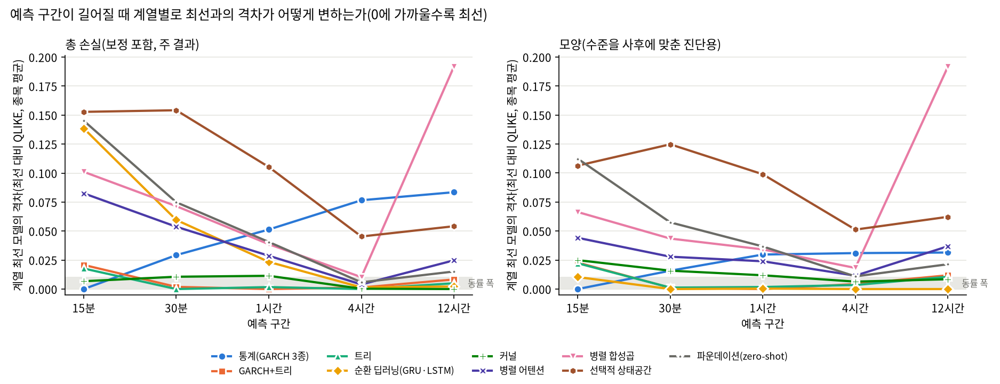

# 27번: 신규 알고리즘 확대(병렬 어텐션·합성곱·파운데이션)

## 0. 이 회차가 한 것

26c번의 평가 틀(데이터 창 2023-10-06 ~ 2026-10-05, 분할 2025-11-11, 정시 예측 시점, 5개 예측 구간, 내부검증 보정, 정지 두 부분 모형)을 그대로 두고, 26c의 12종 + naive에 **신규 15종**을 같은 조건으로 더해 비교했다. 20종목 × 5구간 × 28모델 = 2800행이 기대값이고 실제 2760행이다. 차이 40행 중 40행은 TTM 4시간·12시간 제외분(아래 설명)이고, 그 밖에 빠진 칸은 없다.

- **26c 결과는 다시 계산하지 않고 그대로 가져왔다.** 평가 시각과 실제값이 모든 모델에서 같은지 합치는 단계에서 대조했다.
- 신규 모델 중 이번 결과에 들어온 것: PatchTST, iTransformer, TCN, Autoformer, TimesNet, TimeXer, ModernTCN, S-Mamba, Chronos-Bolt, TimesFM, TTM, Moirai-2, Sundial, Time-MoE, Lag-Llama. 들어오지 못한 것: 없음(전부 포함).
- **S-Mamba**: 공식 구현이 `mamba_ssm`(구버전 `torch==2.0.1` 필요)에 의존하고 서버에 `nvcc`가 없어 처음에는 설치에 실패했다. 저자 요구 버전에 맞춰 미리 컴파일된 wheel로 **격리 venv**(`.venvs/smamba_py310_20261006`)를 구성해 해결했다(시스템 변경 없음). 메인 환경의 torch 버전은 그대로다.
- **TTM의 4시간·12시간 결과는 제외했다**: TTM r2 모델카드가 분·시간 해상도(10분·15분·1시간)만 지원한다고 명시한다. 이 두 구간은 공식 지원 범위 밖이라 순위·동률·검정에서 뺐고, 계산값은 `excluded_ttm_unsupported_resolution.csv`에 기록으로만 남겼다.
- 제외 모델(Linear·Ridge·HAR-RV·DLinear·NLinear 등)의 제외 이유는 `test/research_materials/model_catalog.md`에 있다.
- 소요 시간 기록: 해당 없음(여러 실행으로 나뉘어 합산하지 않았다).

## 1. 비교 대상 구성

| 계열 | 모델 | 구현 | 입력 | 학습·추론 방식 | 시드 반복 |
| :--- | :--- | :--- | :--- | :--- | :--- |
| 통계 | GARCH-t·MS-GARCH·TAR-GARCH | arch 패키지 / 자체 엔진(`engine/regime_garch.py`) | 15분 수익률 | 최대우도, 다단계 재귀 예측 | 해당 없음(결정적) |
| 커널 | KernelRidge-RBF·SVR-RBF·Nystroem+Ridge | scikit-learn | 로그 특성 12개 | 내부검증으로 설정 선택 후 전체 재적합 | Nystroem만(근사 난수) |
| 트리 | LightGBM·XGBoost·HistGBM | 공식 패키지 | 원 스케일 특성 17개 | 조기종료 후 전체 재적합 | 예(HistGBM은 결과에 영향 없음) |
| 하이브리드 | GARCH+LightGBM | 위 두 구현의 결합 | 트리 특성 + GARCH 예측 | 조기종료 후 전체 재적합 | 예 |
| 순환 딥러닝 | GRU·LSTM | PyTorch(`engine/models.py`) | 15분봉 96개 (d,|d|) | 내부검증 조기종료, 학습률 3개 비교, 전체 재적합 | 예 |
| 어텐션 | PatchTST·iTransformer·Autoformer·TimeXer | neuralforecast 공식 패키지 | H분 블록 로그 RV 이력(iTransformer는 +블록 수익률) | 라이브러리 기본값, 조기종료, 전체 재적합 | 예 |
| 합성곱 | TCN·TimesNet | neuralforecast 공식 패키지 | H분 블록 로그 RV 이력 | 라이브러리 기본값, 조기종료, 전체 재적합 | 예 |
| 상태공간 | S-Mamba | 저자 공식 GitHub 코드(`third_party/S-D-Mamba`), 격리 venv | H분 블록 로그 RV 이력 + 블록 수익률(2변수) | 저자 ETTh1 설정, 조기종료, 전체 재적합 | 예 |
| 합성곱 | ModernTCN | 저자 공식 GitHub 코드(`third_party/ModernTCN`) | H분 블록 로그 RV 이력 | 저자 ETTh1 설정, 조기종료, 전체 재적합 | 예 |
| 파운데이션 | Chronos-Bolt·TimesFM·TTM | 공식 패키지(메인 venv) | 직전 512블록 로그 RV | zero-shot(재학습 없음), 중앙값 점예측 | 해당 없음(결정적) |
| 파운데이션 | Moirai-2·Sundial·Time-MoE | 공식 패키지(격리 venv) | 직전 512블록 로그 RV | zero-shot, Moirai-2 중앙 분위수 / Sundial 표본 50개 중앙값 / Time-MoE 점예측 | Sundial은 표본 추출(시드 고정, 반복 안 함) |
| 파운데이션 | Lag-Llama | 공식 GitHub 코드(`third_party/lag-llama`) | 직전 1,124블록 로그 RV | zero-shot, 표본 100개 중앙값 | 표본 추출(시드 고정, 반복 안 함) |

신규 모델은 "한 시계열의 과거에서 다음 값"을 예측하는 라이브러리라, 예측 구간 H분 길이의 **블록 시계열**(블록 값 = 그 블록의 로그 RV_d, 26c의 타깃과 같음)로 입력을 만들었다. 입력이 15분봉 96개를 그대로 읽는 GRU·LSTM과 다르므로 순환 대 병렬 어텐션의 차이에는 입력 표현의 차이가 섞여 있다. 이 한계는 해석에서 다시 언급한다.

## 2. 파운데이션 모델 사전학습 시점과 평가 구간의 겹침 확인

zero-shot 모델의 가중치가 평가 구간(2025-11-11~) 데이터로 학습됐다면 결과가 부풀 수 있다. Hugging Face 저장소에서 가중치 파일이 마지막으로 바뀐 날짜를 조회했다(2026-10-06).

| 모델 | 저장소 | 가중치 마지막 변경일 | 평가 시작 전 여유(일) |
| :--- | :--- | :--- | ---: |
| Chronos-Bolt | amazon/chronos-bolt-small | 2024-11-13 | 363 |
| TimesFM 2.5 | google/timesfm-2.5-200m-pytorch | 2025-10-01 | 41 |
| TTM r2 | ibm-granite/granite-timeseries-ttm-r2 | 2024-10-09 | 398 |
| Moirai-2.0 | Salesforce/moirai-2.0-R-small | 2025-08-06 | 97 |
| Sundial | thuml/sundial-base-128m | 2025-05-14 | 181 |
| Time-MoE | Maple728/TimeMoE-50M | 2024-09-21 | 416 |
| Lag-Llama | time-series-foundation-models/Lag-Llama | 2024-02-07 | 643 |

**해석**: 가중치가 평가 시작일보다 늦게 바뀐 모델은 0개이고, 가장 가까운 TimesFM 2.5도 41일 앞선다. 곧 평가 구간 데이터가 가중치에 들어갈 수 없다. 단, 사전학습 데이터의 구체적 구성(업비트 데이터 포함 여부)은 공개되지 않아 확인하지 못했다. 암호화폐 일반 시계열은 포함됐을 수 있으나 평가 기간과는 겹치지 않는다.

## 3. 구간별 결과(전 모델)

**이 절의 모든 손실은 시드 평균이다.** 무작위성이 있는 모델(트리, Nystroem, GRU·LSTM, 신규 신경망)은 시드마다 그 시드의 예측과 보정계수로 손실을 구한 뒤 평균했고(예측을 평균한 앙상블이 아니다), 시드와 무관한 모델(GARCH 3종, 커널 2종, 파운데이션 7종)은 같은 값이 평균된다. 한 시드만 쓰면 신경망의 순위가 시드에 따라 바뀌기 때문이다(26c에서 GRU 15분 종목 평균 손실이 시드에 따라 -9.74~-9.81).

| 모델 | GARCH-t | MS-GARCH | TAR-GARCH | KernelRidge-RBF | SVR-RBF | Nystroem+Ridge | LightGBM | XGBoost | HistGBM | GARCH+LightGBM | GRU | LSTM | PatchTST | iTransformer | TCN | Autoformer | TimesNet | TimeXer | ModernTCN | S-Mamba | Chronos-Bolt | TimesFM | TTM | Moirai-2 | Sundial | Time-MoE | Lag-Llama |
| :--- | ---: | ---: | ---: | ---: | ---: | ---: | ---: | ---: | ---: | ---: | ---: | ---: | ---: | ---: | ---: | ---: | ---: | ---: | ---: | ---: | ---: | ---: | ---: | ---: | ---: | ---: | ---: |
| 사용한 시드 수 | 1 | 1 | 1 | 1 | 1 | 5 | 5 | 5 | 5 | 5 | 5 | 5 | 5 | 5 | 5 | 5 | 5 | 5 | 5 | 5 | 1 | 1 | 1 | 1 | 1 | 1 | 1 |

시드 수가 1인 모델은 시드로 결과가 바뀌지 않는 모델(해당 없음)이거나 해당 시드 산출물이 아직 없는 모델이다. 후자라면 이 표의 값은 시드 1개 결과이므로 해석에 주의해야 한다.

종목마다 시드 평균 QLIKE로 순위를 매겨 평균했다(작을수록 좋음). 격차는 그 구간 최선 모델 대비 시드 평균 QLIKE 차의 종목 평균이다. **A등급은 격차가 0.01 이하**로, GRU 시드 표준편차에서 가져온 실무 기준이며 통계 검정이 아니다. 통계 검정(DM·MCS)은 26b 보고서에 있다.

### 15분

| 순위 | 모델 | 계열 | 평균 순위(시드 평균 손실) | 격차(최선 대비) | 등급 | 종목 수 |
| ---: | :--- | :--- | ---: | ---: | :--- | ---: |
| 1 | MS-GARCH | 통계 | 5.6 | 0.0000 | A | 20 |
| 2 | GARCH-t | 통계 | 6.3 | 0.0008 | A | 20 |
| 3 | TAR-GARCH | 통계 | 6.8 | 0.0045 | A | 20 |
| 4 | Nystroem+Ridge | 커널 | 6.7 | 0.0068 | A | 20 |
| 5 | HistGBM | 트리 | 6.5 | 0.0177 | B | 20 |
| 6 | GARCH+LightGBM | 하이브리드 | 5.5 | 0.0208 | B | 20 |
| 7 | LightGBM | 트리 | 6.0 | 0.0268 | B | 20 |
| 8 | XGBoost | 트리 | 7.4 | 0.0311 | C | 20 |
| 9 | PatchTST | 어텐션 | 10.7 | 0.0825 | C | 20 |
| 10 | KernelRidge-RBF | 커널 | 14.8 | 0.0914 | C | 20 |
| 11 | ModernTCN | 합성곱 | 13.1 | 0.1011 | C | 20 |
| 12 | TimesNet | 합성곱 | 14.2 | 0.1029 | C | 20 |
| 13 | SVR-RBF | 커널 | 16.4 | 0.1065 | C | 20 |
| 14 | TCN | 합성곱 | 14.2 | 0.1071 | C | 20 |
| 15 | LSTM | 딥러닝 | 13.5 | 0.1386 | C | 20 |
| 16 | Time-MoE | 파운데이션 | 18.5 | 0.1452 | C | 20 |
| 17 | GRU | 딥러닝 | 12.5 | 0.1460 | C | 20 |
| 18 | Autoformer | 어텐션 | 18.6 | 0.1479 | C | 20 |
| 19 | TimeXer | 어텐션 | 17.2 | 0.1480 | C | 20 |
| 20 | Chronos-Bolt | 파운데이션 | 18.6 | 0.1488 | C | 20 |
| 21 | TimesFM | 파운데이션 | 18.0 | 0.1501 | C | 20 |
| 22 | S-Mamba | 상태공간 | 18.4 | 0.1528 | C | 20 |
| 23 | Sundial | 파운데이션 | 19.8 | 0.1553 | C | 20 |
| 24 | Moirai-2 | 파운데이션 | 20.7 | 0.1797 | C | 20 |
| 25 | iTransformer | 어텐션 | 22.2 | 0.1970 | C | 20 |
| 26 | TTM | 파운데이션 | 21.6 | 0.2005 | C | 20 |
| 27 | Lag-Llama | 파운데이션 | 24.3 | 0.2119 | C | 20 |
| 28 | naive | 기준선 | 27.7 | 32.0732 | C | 20 |

### 30분

| 순위 | 모델 | 계열 | 평균 순위(시드 평균 손실) | 격차(최선 대비) | 등급 | 종목 수 |
| ---: | :--- | :--- | ---: | ---: | :--- | ---: |
| 1 | HistGBM | 트리 | 5.0 | 0.0000 | A | 20 |
| 2 | LightGBM | 트리 | 3.7 | 0.0018 | A | 20 |
| 3 | GARCH+LightGBM | 하이브리드 | 3.5 | 0.0019 | A | 20 |
| 4 | XGBoost | 트리 | 4.6 | 0.0039 | A | 20 |
| 5 | Nystroem+Ridge | 커널 | 6.1 | 0.0106 | B | 20 |
| 6 | GARCH-t | 통계 | 9.1 | 0.0293 | B | 20 |
| 7 | TAR-GARCH | 통계 | 9.2 | 0.0309 | C | 20 |
| 8 | MS-GARCH | 통계 | 8.8 | 0.0342 | C | 20 |
| 9 | PatchTST | 어텐션 | 10.5 | 0.0538 | C | 20 |
| 10 | GRU | 딥러닝 | 11.1 | 0.0596 | C | 20 |
| 11 | LSTM | 딥러닝 | 13.0 | 0.0623 | C | 20 |
| 12 | ModernTCN | 합성곱 | 12.9 | 0.0715 | C | 20 |
| 13 | Chronos-Bolt | 파운데이션 | 13.9 | 0.0749 | C | 20 |
| 14 | TCN | 합성곱 | 14.7 | 0.0781 | C | 20 |
| 15 | Time-MoE | 파운데이션 | 16.6 | 0.0857 | C | 20 |
| 16 | TimesNet | 합성곱 | 17.0 | 0.0869 | C | 20 |
| 17 | TimesFM | 파운데이션 | 15.2 | 0.0888 | C | 20 |
| 18 | Moirai-2 | 파운데이션 | 16.2 | 0.0897 | C | 20 |
| 19 | Sundial | 파운데이션 | 18.5 | 0.0943 | C | 20 |
| 20 | KernelRidge-RBF | 커널 | 14.2 | 0.0971 | C | 20 |
| 21 | TimeXer | 어텐션 | 19.3 | 0.1026 | C | 20 |
| 22 | Lag-Llama | 파운데이션 | 21.1 | 0.1124 | C | 20 |
| 23 | TTM | 파운데이션 | 22.1 | 0.1204 | C | 20 |
| 24 | SVR-RBF | 커널 | 20.7 | 0.1323 | C | 20 |
| 25 | Autoformer | 어텐션 | 23.9 | 0.1374 | C | 20 |
| 26 | S-Mamba | 상태공간 | 20.9 | 0.1542 | C | 20 |
| 27 | iTransformer | 어텐션 | 26.4 | 0.2109 | C | 20 |
| 28 | naive | 기준선 | 28.0 | 2.6410 | C | 20 |

### 1시간

| 순위 | 모델 | 계열 | 평균 순위(시드 평균 손실) | 격차(최선 대비) | 등급 | 종목 수 |
| ---: | :--- | :--- | ---: | ---: | :--- | ---: |
| 1 | GARCH+LightGBM | 하이브리드 | 2.5 | 0.0000 | A | 20 |
| 2 | XGBoost | 트리 | 4.2 | 0.0017 | A | 20 |
| 3 | LightGBM | 트리 | 3.4 | 0.0019 | A | 20 |
| 4 | HistGBM | 트리 | 4.3 | 0.0024 | A | 20 |
| 5 | Nystroem+Ridge | 커널 | 5.7 | 0.0114 | B | 20 |
| 6 | GRU | 딥러닝 | 6.5 | 0.0234 | B | 20 |
| 7 | LSTM | 딥러닝 | 8.3 | 0.0276 | B | 20 |
| 8 | PatchTST | 어텐션 | 10.0 | 0.0287 | B | 20 |
| 9 | ModernTCN | 합성곱 | 11.8 | 0.0387 | C | 20 |
| 10 | TimesFM | 파운데이션 | 11.0 | 0.0406 | C | 20 |
| 11 | Chronos-Bolt | 파운데이션 | 11.3 | 0.0424 | C | 20 |
| 12 | Time-MoE | 파운데이션 | 12.3 | 0.0426 | C | 20 |
| 13 | Moirai-2 | 파운데이션 | 13.8 | 0.0482 | C | 20 |
| 14 | GARCH-t | 통계 | 15.9 | 0.0513 | C | 20 |
| 15 | TAR-GARCH | 통계 | 15.4 | 0.0525 | C | 20 |
| 16 | Sundial | 파운데이션 | 16.4 | 0.0570 | C | 20 |
| 17 | TTM | 파운데이션 | 18.5 | 0.0593 | C | 20 |
| 18 | TimeXer | 어텐션 | 17.0 | 0.0606 | C | 20 |
| 19 | MS-GARCH | 통계 | 15.5 | 0.0652 | C | 20 |
| 20 | Lag-Llama | 파운데이션 | 19.8 | 0.0695 | C | 20 |
| 21 | TCN | 합성곱 | 21.0 | 0.0802 | C | 20 |
| 22 | TimesNet | 합성곱 | 21.1 | 0.0809 | C | 20 |
| 23 | KernelRidge-RBF | 커널 | 16.2 | 0.0864 | C | 20 |
| 24 | S-Mamba | 상태공간 | 20.6 | 0.1053 | C | 20 |
| 25 | Autoformer | 어텐션 | 25.0 | 0.1305 | C | 20 |
| 26 | SVR-RBF | 커널 | 24.2 | 0.1513 | C | 20 |
| 27 | iTransformer | 어텐션 | 26.4 | 0.2140 | C | 20 |
| 28 | naive | 기준선 | 28.0 | 1.0271 | C | 20 |

### 4시간

| 순위 | 모델 | 계열 | 평균 순위(시드 평균 손실) | 격차(최선 대비) | 등급 | 종목 수 |
| ---: | :--- | :--- | ---: | ---: | :--- | ---: |
| 1 | LightGBM | 트리 | 7.5 | 0.0000 | A | 20 |
| 2 | XGBoost | 트리 | 8.7 | 0.0000 | A | 20 |
| 3 | Nystroem+Ridge | 커널 | 7.0 | 0.0003 | A | 20 |
| 4 | GARCH+LightGBM | 하이브리드 | 7.7 | 0.0014 | A | 20 |
| 5 | GRU | 딥러닝 | 6.5 | 0.0014 | A | 20 |
| 6 | HistGBM | 트리 | 8.4 | 0.0023 | A | 20 |
| 7 | LSTM | 딥러닝 | 6.8 | 0.0032 | A | 20 |
| 8 | PatchTST | 어텐션 | 6.8 | 0.0040 | A | 20 |
| 9 | TimesFM | 파운데이션 | 6.9 | 0.0058 | A | 20 |
| 10 | ModernTCN | 합성곱 | 10.6 | 0.0103 | B | 20 |
| 11 | Chronos-Bolt | 파운데이션 | 10.6 | 0.0120 | B | 20 |
| 12 | Time-MoE | 파운데이션 | 9.4 | 0.0129 | B | 20 |
| 13 | Moirai-2 | 파운데이션 | 11.3 | 0.0132 | B | 20 |
| 14 | Sundial | 파운데이션 | 12.4 | 0.0178 | B | 20 |
| 15 | TimeXer | 어텐션 | 13.4 | 0.0190 | B | 20 |
| 16 | Lag-Llama | 파운데이션 | 15.1 | 0.0370 | C | 20 |
| 17 | S-Mamba | 상태공간 | 17.1 | 0.0453 | C | 20 |
| 18 | KernelRidge-RBF | 커널 | 14.3 | 0.0711 | C | 20 |
| 19 | Autoformer | 어텐션 | 20.6 | 0.0748 | C | 20 |
| 20 | MS-GARCH | 통계 | 16.9 | 0.0766 | C | 20 |
| 21 | GARCH-t | 통계 | 19.4 | 0.0788 | C | 20 |
| 22 | TAR-GARCH | 통계 | 20.7 | 0.0946 | C | 20 |
| 23 | TimesNet | 합성곱 | 23.0 | 0.1083 | C | 20 |
| 24 | iTransformer | 어텐션 | 22.6 | 0.1187 | C | 20 |
| 25 | SVR-RBF | 커널 | 22.6 | 0.1426 | C | 20 |
| 26 | TCN | 합성곱 | 25.1 | 0.1764 | C | 20 |
| 27 | naive | 기준선 | 26.6 | 0.6406 | C | 20 |

### 12시간

| 순위 | 모델 | 계열 | 평균 순위(시드 평균 손실) | 격차(최선 대비) | 등급 | 종목 수 |
| ---: | :--- | :--- | ---: | ---: | :--- | ---: |
| 1 | Nystroem+Ridge | 커널 | 5.7 | 0.0000 | A | 20 |
| 2 | LSTM | 딥러닝 | 6.3 | 0.0022 | A | 20 |
| 3 | GRU | 딥러닝 | 5.5 | 0.0034 | A | 20 |
| 4 | HistGBM | 트리 | 9.1 | 0.0050 | A | 20 |
| 5 | LightGBM | 트리 | 8.5 | 0.0062 | A | 20 |
| 6 | XGBoost | 트리 | 8.9 | 0.0067 | A | 20 |
| 7 | GARCH+LightGBM | 하이브리드 | 8.8 | 0.0083 | A | 20 |
| 8 | TimesFM | 파운데이션 | 6.8 | 0.0151 | B | 20 |
| 9 | Time-MoE | 파운데이션 | 7.3 | 0.0157 | B | 20 |
| 10 | Sundial | 파운데이션 | 9.8 | 0.0235 | B | 20 |
| 11 | PatchTST | 어텐션 | 10.8 | 0.0248 | B | 20 |
| 12 | Moirai-2 | 파운데이션 | 11.2 | 0.0291 | B | 20 |
| 13 | Lag-Llama | 파운데이션 | 12.6 | 0.0321 | C | 20 |
| 14 | Chronos-Bolt | 파운데이션 | 12.8 | 0.0328 | C | 20 |
| 15 | S-Mamba | 상태공간 | 16.3 | 0.0542 | C | 20 |
| 16 | TimeXer | 어텐션 | 16.6 | 0.0572 | C | 20 |
| 17 | Autoformer | 어텐션 | 17.5 | 0.0596 | C | 20 |
| 18 | KernelRidge-RBF | 커널 | 12.8 | 0.0797 | C | 20 |
| 19 | MS-GARCH | 통계 | 14.2 | 0.0835 | C | 20 |
| 20 | iTransformer | 어텐션 | 20.6 | 0.1000 | C | 20 |
| 21 | GARCH-t | 통계 | 19.9 | 0.1469 | C | 20 |
| 22 | naive | 기준선 | 21.4 | 0.1499 | C | 20 |
| 23 | TAR-GARCH | 통계 | 21.1 | 0.1742 | C | 20 |
| 24 | SVR-RBF | 커널 | 19.8 | 0.1764 | C | 20 |
| 25 | ModernTCN | 합성곱 | 23.7 | 0.1917 | C | 20 |
| 26 | TimesNet | 합성곱 | 24.1 | 0.1954 | C | 20 |
| 27 | TCN | 합성곱 | 26.2 | 0.2911 | C | 20 |

## 4. 계열별 최선과 격차

각 계열에서 그 구간 최선과의 격차가 가장 작은 모델을 대표로 삼았다. 값이 0.01 이하면 그 구간의 최선과 사실상 동률이다. 계열에 해당 모델이 없으면 "-"로 표시했다.

| 계열 | 모델 수 | 15분 | 30분 | 1시간 | 4시간 | 12시간 |
| :--- | ---: | ---: | ---: | ---: | ---: | ---: |
| 통계(GARCH 3종) | 3 | 0.0000 (MS-GARCH) | 0.0293 (GARCH-t) | 0.0513 (GARCH-t) | 0.0766 (MS-GARCH) | 0.0835 (MS-GARCH) |
| GARCH+트리 | 1 | 0.0208 (GARCH+LightGBM) | 0.0019 (GARCH+LightGBM) | 0.0000 (GARCH+LightGBM) | 0.0014 (GARCH+LightGBM) | 0.0083 (GARCH+LightGBM) |
| 트리 | 3 | 0.0177 (HistGBM) | 0.0000 (HistGBM) | 0.0017 (XGBoost) | 0.0000 (LightGBM) | 0.0050 (HistGBM) |
| 순환 딥러닝(GRU·LSTM) | 2 | 0.1386 (LSTM) | 0.0596 (GRU) | 0.0234 (GRU) | 0.0014 (GRU) | 0.0022 (LSTM) |
| 커널 | 3 | 0.0068 (Nystroem+Ridge) | 0.0106 (Nystroem+Ridge) | 0.0114 (Nystroem+Ridge) | 0.0003 (Nystroem+Ridge) | 0.0000 (Nystroem+Ridge) |
| 병렬 어텐션 | 4 | 0.0825 (PatchTST) | 0.0538 (PatchTST) | 0.0287 (PatchTST) | 0.0040 (PatchTST) | 0.0248 (PatchTST) |
| 병렬 합성곱 | 3 | 0.1011 (ModernTCN) | 0.0715 (ModernTCN) | 0.0387 (ModernTCN) | 0.0103 (ModernTCN) | 0.1917 (ModernTCN) |
| 선택적 상태공간 | 1 | 0.1528 (S-Mamba) | 0.1542 (S-Mamba) | 0.1053 (S-Mamba) | 0.0453 (S-Mamba) | 0.0542 (S-Mamba) |
| 파운데이션(zero-shot) | 7 | 0.1452 (Time-MoE) | 0.0749 (Chronos-Bolt) | 0.0406 (TimesFM) | 0.0058 (TimesFM) | 0.0151 (TimesFM) |

셀은 `전체 등급/Q5 등급 (전체 격차)`이다. 등급 A는 최선 대비 ≤0.01, B는 ≤0.03, C는 그 밖이다. 보정후 기준이며, 괄호 안 격차는 그 구간 최선 모델 대비 QLIKE 차이의 종목 평균이다. 마지막 칸은 모양 기준 전체 등급이다.

| 계열 | 모델 | 15분 | 30분 | 1시간 | 4시간 | 12시간 | 모양 등급(15분·30분·1시간·4시간·12시간) |
| :--- | :--- | :--- | :--- | :--- | :--- | :--- | :--- |
| 통계(GARCH 3종) | GARCH-t | A/C (0.001) | B/C (0.029) | C/C (0.051) | C/C (0.079) | C/C (0.147) | B·B·C·C·C |
| 통계(GARCH 3종) | MS-GARCH | A/B (0.000) | C/C (0.034) | C/C (0.065) | C/C (0.077) | C/C (0.084) | A·B·B·C·C |
| 통계(GARCH 3종) | TAR-GARCH | A/C (0.005) | C/C (0.031) | C/C (0.052) | C/C (0.095) | C/C (0.174) | B·B·C·C·C |
| GARCH+트리 | GARCH+LightGBM | B/C (0.021) | A/C (0.002) | A/A (0.000) | A/B (0.001) | A/C (0.008) | B·A·A·A·B |
| 트리 | LightGBM | B/C (0.027) | A/C (0.002) | A/A (0.002) | A/B (0.000) | A/C (0.006) | B·A·A·A·B |
| 트리 | XGBoost | C/C (0.031) | A/C (0.004) | A/A (0.002) | A/B (0.000) | A/C (0.007) | B·A·A·A·B |
| 트리 | HistGBM | B/C (0.018) | A/A (0.000) | A/A (0.002) | A/B (0.002) | A/C (0.005) | B·A·A·A·B |
| 순환 딥러닝(GRU·LSTM) | GRU | C/C (0.146) | C/C (0.060) | B/A (0.023) | A/A (0.001) | A/A (0.003) | B·A·A·A·A |
| 순환 딥러닝(GRU·LSTM) | LSTM | C/C (0.139) | C/C (0.062) | B/A (0.028) | A/A (0.003) | A/A (0.002) | B·A·A·A·A |
| 커널 | KernelRidge-RBF | C/C (0.091) | C/C (0.097) | C/C (0.086) | C/C (0.071) | C/C (0.080) | C·C·C·C·C |
| 커널 | SVR-RBF | C/C (0.106) | C/C (0.132) | C/C (0.151) | C/C (0.143) | C/C (0.176) | C·C·C·C·C |
| 커널 | Nystroem+Ridge | A/A (0.007) | B/A (0.011) | B/B (0.011) | A/B (0.000) | A/C (0.000) | B·B·B·A·A |
| 병렬 어텐션 | PatchTST | C/C (0.083) | C/C (0.054) | B/C (0.029) | A/C (0.004) | B/C (0.025) | C·B·B·B·C |
| 병렬 어텐션 | iTransformer | C/C (0.197) | C/C (0.211) | C/C (0.214) | C/C (0.119) | C/C (0.100) | C·C·C·C·C |
| 병렬 어텐션 | Autoformer | C/C (0.148) | C/C (0.137) | C/C (0.130) | C/C (0.075) | C/C (0.060) | C·C·C·C·C |
| 병렬 어텐션 | TimeXer | C/C (0.148) | C/C (0.103) | C/C (0.061) | B/C (0.019) | C/C (0.057) | C·C·C·B·C |
| 병렬 합성곱 | TCN | C/C (0.107) | C/C (0.078) | C/C (0.080) | C/C (0.176) | C/C (0.291) | C·C·C·C·C |
| 병렬 합성곱 | TimesNet | C/C (0.103) | C/C (0.087) | C/C (0.081) | C/C (0.108) | C/C (0.195) | C·C·C·C·C |
| 병렬 합성곱 | ModernTCN | C/C (0.101) | C/C (0.072) | C/C (0.039) | B/C (0.010) | C/C (0.192) | C·C·C·B·C |
| 선택적 상태공간 | S-Mamba | C/C (0.153) | C/C (0.154) | C/C (0.105) | C/C (0.045) | C/C (0.054) | C·C·C·C·C |
| 파운데이션(zero-shot) | Chronos-Bolt | C/C (0.149) | C/C (0.075) | C/C (0.042) | B/C (0.012) | C/C (0.033) | C·C·C·B·C |
| 파운데이션(zero-shot) | TimesFM | C/C (0.150) | C/C (0.089) | C/C (0.041) | A/C (0.006) | B/C (0.015) | C·C·C·B·B |
| 파운데이션(zero-shot) | TTM | C/C (0.200) | C/C (0.120) | C/C (0.059) | - | - | C·C·C·-·- |
| 파운데이션(zero-shot) | Moirai-2 | C/C (0.180) | C/C (0.090) | C/C (0.048) | B/C (0.013) | B/C (0.029) | C·C·C·B·C |
| 파운데이션(zero-shot) | Sundial | C/C (0.155) | C/C (0.094) | C/C (0.057) | B/C (0.018) | B/C (0.024) | C·C·C·B·B |
| 파운데이션(zero-shot) | Time-MoE | C/C (0.145) | C/C (0.086) | C/C (0.043) | B/C (0.013) | B/C (0.016) | C·C·C·B·B |
| 파운데이션(zero-shot) | Lag-Llama | C/C (0.212) | C/C (0.112) | C/C (0.069) | C/C (0.037) | C/C (0.032) | C·C·C·C·C |

그림 읽는 법: 각 선은 그 계열에서 가장 좋은 모델의 격차다. 회색 띠(0~0.01) 안에 있으면 그 예측 구간의 최선과 사실상 동률이다. 수치는 위 표와 `tier_table.csv`에 있다.

## 5. 신규 모델의 위치(보정후, 전체 구간)

신규 모델이 26c의 최선 계열과 얼마나 떨어져 있는지 구간별로 적는다. 격차가 양수면 최선보다 손실이 큰 것이다.

| 모델 | 계열 | 15분 | 30분 | 1시간 | 4시간 | 12시간 |
| :--- | :--- | ---: | ---: | ---: | ---: | ---: |
| PatchTST | 어텐션 | 0.0825 (C) | 0.0538 (C) | 0.0287 (B) | 0.0040 (A) | 0.0248 (B) |
| iTransformer | 어텐션 | 0.1970 (C) | 0.2109 (C) | 0.2140 (C) | 0.1187 (C) | 0.1000 (C) |
| TCN | 합성곱 | 0.1071 (C) | 0.0781 (C) | 0.0802 (C) | 0.1764 (C) | 0.2911 (C) |
| Autoformer | 어텐션 | 0.1479 (C) | 0.1374 (C) | 0.1305 (C) | 0.0748 (C) | 0.0596 (C) |
| TimesNet | 합성곱 | 0.1029 (C) | 0.0869 (C) | 0.0809 (C) | 0.1083 (C) | 0.1954 (C) |
| TimeXer | 어텐션 | 0.1480 (C) | 0.1026 (C) | 0.0606 (C) | 0.0190 (B) | 0.0572 (C) |
| ModernTCN | 합성곱 | 0.1011 (C) | 0.0715 (C) | 0.0387 (C) | 0.0103 (B) | 0.1917 (C) |
| S-Mamba | 상태공간 | 0.1528 (C) | 0.1542 (C) | 0.1053 (C) | 0.0453 (C) | 0.0542 (C) |
| Chronos-Bolt | 파운데이션 | 0.1488 (C) | 0.0749 (C) | 0.0424 (C) | 0.0120 (B) | 0.0328 (C) |
| TimesFM | 파운데이션 | 0.1501 (C) | 0.0888 (C) | 0.0406 (C) | 0.0058 (A) | 0.0151 (B) |
| TTM | 파운데이션 | 0.2005 (C) | 0.1204 (C) | 0.0593 (C) | 제외(공식 지원 해상도 밖) | 제외(공식 지원 해상도 밖) |
| Moirai-2 | 파운데이션 | 0.1797 (C) | 0.0897 (C) | 0.0482 (C) | 0.0132 (B) | 0.0291 (B) |
| Sundial | 파운데이션 | 0.1553 (C) | 0.0943 (C) | 0.0570 (C) | 0.0178 (B) | 0.0235 (B) |
| Time-MoE | 파운데이션 | 0.1452 (C) | 0.0857 (C) | 0.0426 (C) | 0.0129 (B) | 0.0157 (B) |
| Lag-Llama | 파운데이션 | 0.2119 (C) | 0.1124 (C) | 0.0695 (C) | 0.0370 (C) | 0.0321 (C) |

## 6. 사전 구간별·분기별 순위와 정지(RV=0) 분해

사전 구간(직전 H시간 RV 5분위)별 순위와 달력 분기별 순위는 CSV로 저장했다(`exante_regime_ranks.csv`, `quarter_ranks.csv`). 구간별 통계적 동률은 26b 보고서 3-2절에 있다.

평가 시점을 **가격이 움직인 시점(RV>0)**과 **가격이 한 칸도 안 움직인 시점(RV=0)**으로 나눠, 각 모델의 손실을 GARCH-t와 비교한다(음수면 그 모델이 GARCH-t보다 낫다). RV=0에서는 QLIKE가 log(예측 분산)이 되어 작게 예측할수록 유리하다. 로그 타깃 모델의 크기 부분은 log(0)을 정의할 수 없어 RV=0 표본을 빼고 학습하고, 이 회차에서는 정지 확률 π가 그 자리를 맡는다. GARCH 계열은 수익률 0을 그대로 받아 분산을 추정한다. 아래는 주 결과(두 부분 모형) 기준이다. 단일 처리 기준은 26b 보고서 6절(두 부분 모형 대 단일 처리)에 있다.

| 예측 구간 | 평가 RV=0 비율(종목 중앙) | 종목별 RV=0 비율과 (LightGBM−GARCH-t) 격차의 상관 |
| :--- | ---: | ---: |
| 15분 | 28.4% | +0.38 |
| 30분 | 12.3% | -0.06 |
| 1시간 | 3.2% | -0.44 |
| 4시간 | 0.0% | -0.48 |
| 12시간 | 0.0% | 해당 없음(전 종목 RV=0 비율이 같아 상관 정의 불가) |

셀은 `움직인 시점 차 / 정지 시점 차`(GARCH-t 대비, 종목 평균)이다.

| 모델 | 15분 | 30분 | 1시간 | 4시간 | 12시간 |
| :--- | :--- | :--- | :--- | :--- | :--- |
| naive | +32.933 / -0.310 | +2.783 / -0.329 | +1.018 / -0.294 | +0.563 / -0.102 | +0.003 / 해당 없음(RV=0 시점 없음) |
| MS-GARCH | +0.040 / -0.070 | +0.026 / -0.087 | +0.024 / -0.096 | -0.002 / -0.231 | -0.063 / 해당 없음(RV=0 시점 없음) |
| TAR-GARCH | +0.005 / -0.010 | +0.001 / -0.022 | +0.001 / -0.036 | +0.016 / +0.030 | +0.027 / 해당 없음(RV=0 시점 없음) |
| KernelRidge-RBF | -0.024 / +0.232 | +0.056 / +0.056 | +0.037 / -0.045 | -0.008 / -0.068 | -0.067 / 해당 없음(RV=0 시점 없음) |
| SVR-RBF | -0.014 / +0.259 | +0.088 / +0.157 | +0.098 / +0.089 | +0.063 / +0.181 | +0.029 / 해당 없음(RV=0 시점 없음) |
| Nystroem+Ridge | -0.128 / +0.178 | -0.058 / +0.080 | -0.054 / +0.014 | -0.078 / +0.208 | -0.146 / 해당 없음(RV=0 시점 없음) |
| LightGBM | +0.020 / +0.001 | -0.035 / -0.056 | -0.056 / -0.073 | -0.080 / +0.086 | -0.140 / 해당 없음(RV=0 시점 없음) |
| XGBoost | +0.047 / -0.004 | -0.032 / -0.055 | -0.056 / -0.070 | -0.080 / +0.088 | -0.141 / 해당 없음(RV=0 시점 없음) |
| HistGBM | -0.113 / +0.155 | -0.060 / +0.001 | -0.057 / -0.062 | -0.077 / +0.086 | -0.142 / 해당 없음(RV=0 시점 없음) |
| GARCH+LightGBM | +0.010 / +0.007 | -0.034 / -0.058 | -0.057 / -0.072 | -0.078 / +0.065 | -0.137 / 해당 없음(RV=0 시점 없음) |
| GRU | +0.474 / -0.313 | +0.071 / -0.262 | -0.021 / -0.207 | -0.079 / -0.151 | -0.150 / 해당 없음(RV=0 시점 없음) |
| LSTM | +0.382 / -0.238 | +0.096 / -0.233 | -0.026 / -0.180 | -0.076 / -0.126 | -0.143 / 해당 없음(RV=0 시점 없음) |
| PatchTST | -0.158 / +0.395 | -0.058 / +0.186 | -0.039 / +0.067 | -0.074 / +0.154 | -0.119 / 해당 없음(RV=0 시점 없음) |
| iTransformer | -0.043 / +0.520 | +0.110 / +0.319 | +0.141 / +0.338 | +0.019 / +0.357 | -0.049 / 해당 없음(RV=0 시점 없음) |
| TCN | -0.110 / +0.386 | -0.008 / +0.194 | +0.014 / +0.089 | +0.070 / +0.458 | +0.173 / 해당 없음(RV=0 시점 없음) |
| Autoformer | -0.081 / +0.460 | +0.029 / +0.280 | +0.061 / +0.210 | -0.009 / +0.324 | -0.079 / 해당 없음(RV=0 시점 없음) |
| TimesNet | -0.139 / +0.407 | -0.027 / +0.178 | -0.010 / +0.103 | +0.036 / +0.368 | +0.034 / 해당 없음(RV=0 시점 없음) |
| TimeXer | -0.087 / +0.506 | -0.016 / +0.262 | -0.019 / +0.094 | -0.060 / +0.219 | -0.096 / 해당 없음(RV=0 시점 없음) |
| ModernTCN | -0.129 / +0.414 | -0.035 / +0.211 | -0.034 / +0.076 | -0.077 / +0.189 | +0.146 / 해당 없음(RV=0 시점 없음) |
| S-Mamba | -0.085 / +0.473 | +0.052 / +0.286 | +0.033 / +0.175 | -0.037 / +0.258 | -0.088 / 해당 없음(RV=0 시점 없음) |
| Chronos-Bolt | -0.057 / +0.364 | -0.025 / +0.186 | -0.029 / +0.096 | -0.068 / +0.235 | -0.114 / 해당 없음(RV=0 시점 없음) |
| TimesFM | -0.056 / +0.367 | -0.007 / +0.183 | -0.031 / +0.085 | -0.074 / +0.268 | -0.132 / 해당 없음(RV=0 시점 없음) |
| TTM | -0.056 / +0.532 | +0.006 / +0.311 | -0.017 / +0.160 | 해당 없음(이 구간 평가 제외) | 해당 없음(이 구간 평가 제외) |
| Moirai-2 | -0.016 / +0.370 | -0.003 / +0.181 | -0.023 / +0.108 | -0.066 / +0.235 | -0.118 / 해당 없음(RV=0 시점 없음) |
| Sundial | -0.084 / +0.446 | -0.012 / +0.236 | -0.016 / +0.161 | -0.062 / +0.266 | -0.123 / 해당 없음(RV=0 시점 없음) |
| Time-MoE | -0.099 / +0.460 | -0.022 / +0.252 | -0.031 / +0.157 | -0.067 / +0.213 | -0.131 / 해당 없음(RV=0 시점 없음) |
| Lag-Llama | -0.019 / +0.493 | +0.002 / +0.319 | -0.006 / +0.230 | -0.042 / +0.220 | -0.115 / 해당 없음(RV=0 시점 없음) |
