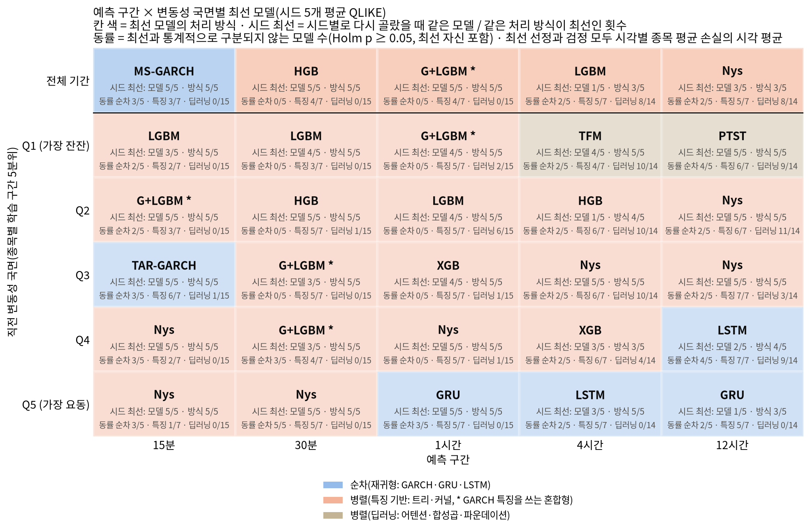
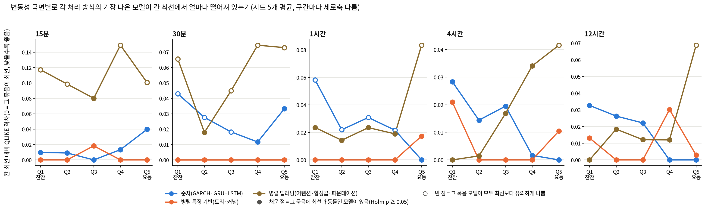
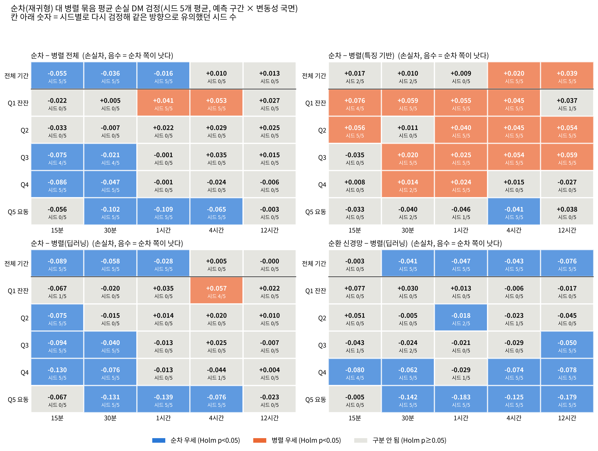
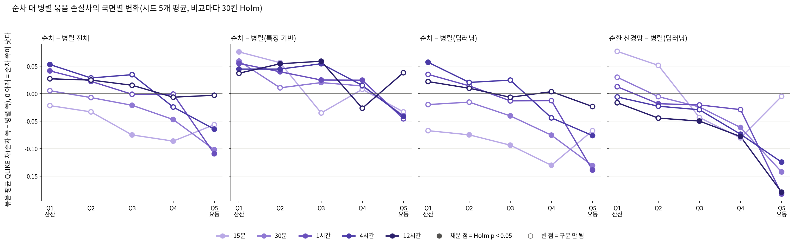
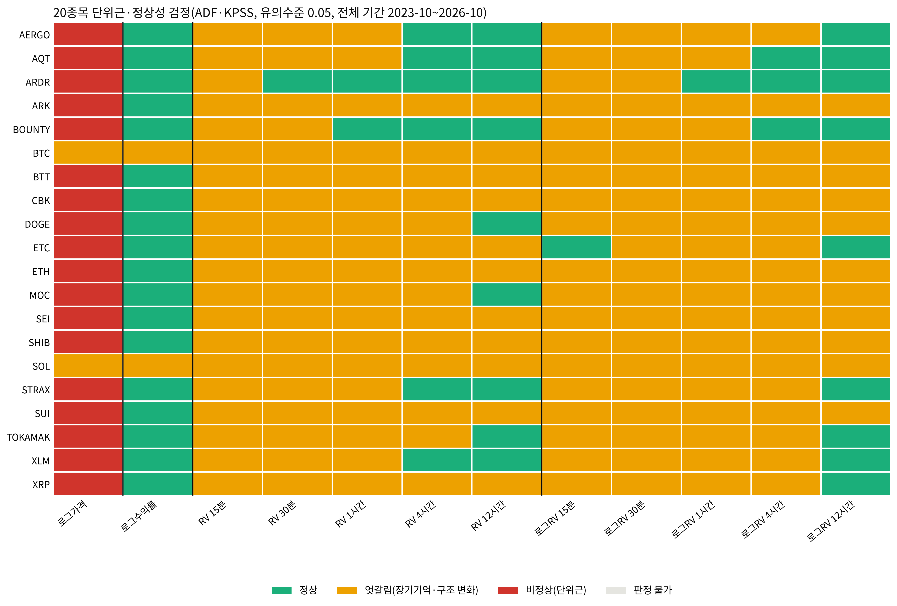
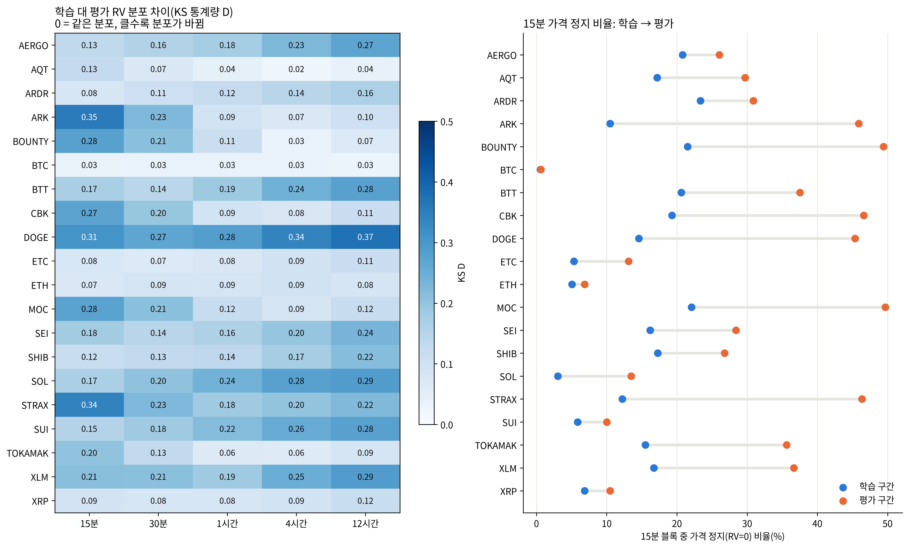

# 27번 마무리 요약(시드 0~4 최종 결과, 2026-10-08)

**한 줄 결론**: 최신 시계열 모델 15종(병렬 어텐션·합성곱·상태공간·파운데이션)을 26c와 같은 조건으로 더했지만, **어느 예측 구간에서도 기존 최선 모델을 이기지 못했다.** 15분은 GARCH 계열, 30분·1시간은 트리와 GARCH+LightGBM, 4시간은 트리·순환 딥러닝·커널, 12시간은 커널·순환 딥러닝·트리가 최선권이다. 신규 모델은 **4시간·12시간에서만 최선권에 들어온다**(PatchTST·TimesFM이 4시간 A등급, 파운데이션 5종이 4시간 MCS 포함).

**변동성 국면·처리 방식 결론(27d·27e, 시드 5개)**: 승자는 예측 구간뿐 아니라 **직전 변동성 국면**에 따라서도 바뀐다. 잔잔하거나 보통인 국면(Q1~Q4)은 대부분 특징 기반 병렬 모델(트리·커널)이 최선이다. **가장 요동치는 국면(Q5)의 1시간·4시간·12시간은 15분봉을 차례로 읽는 순환 신경망(GRU·LSTM)이 손실이 가장 작고**(1시간 GRU 시드 5/5, 4시간 LSTM 3/5·순환망 5/5, 12시간 GRU 1/5·순환망 3/5), 같은 칸의 트리·커널과는 통계적으로 구분되지 않는다. **요동 국면에서 병렬 딥러닝은 다섯 구간 모두 최선보다 유의하게 나빴다.** 묶음으로 보면 순환 신경망이 병렬 딥러닝보다 30칸 중 14칸에서 유의하게 낫고 반대는 0칸이며, 순환망에 병렬 딥러닝과 같은 블록 입력을 줘도 30칸 중 29칸에서 낫다(27e). 단 요동 국면의 '최선' 자리는 15분봉 구성에만 해당한다. EDA로 보면 요동 국면(Q5)에서는 직전 창 안의 경로(변동성이 창 뒤쪽에 몰렸는지)가 다음 변동성 변화와 약하지만 일관되게 양(+)으로 연결되고(30분·1시간·4시간에서 Q5 > Q1 유의), 이 정보는 15분봉을 받는 모델만 볼 수 있다. 다만 같은 정보를 받는 GARCH는 요동 국면 4·12시간에서 졌고, 경로를 못 보는 블록 입력 순환망도 요동 국면에서 트리·커널과 구분되지 않아 경로 정보는 결과를 설명하는 한 요인일 뿐이다. 병렬 딥러닝이 최선인 칸은 잔잔한 국면의 4시간(TimesFM)·12시간(PatchTST)뿐이다. 데이터는 비정상이다: 로그가격은 20종목 중 18종목이 단위근, 수익률은 분산이 시간에 따라 변하고(ARCH-LM 20/20), 변동성은 단위근은 아니지만 15분 기준 19/20종목이 정상성도 기각되는 강한 지속성(장기기억 또는 수준 이동)을 보이며, 15분 블록의 가격 정지 비율이 학습 15.8% → 평가 30.3%로 20종목 모두 늘었다.

**시드 3개 → 5개로 바뀐 점**: 결론은 그대로다. 바뀐 것은 세 가지다. (1) ModernTCN 4시간이 A등급(0.0091)에서 B등급(0.0103)으로 내려갔다. 경계값 0.01 근처의 차이라 결론에는 영향이 없다. (2) 12시간 최선 모델이 GRU에서 Nystroem+Ridge로 바뀌었다. GRU의 격차는 0.0034로 둘은 A등급 안의 동률이고, 시드별 최선도 GRU·Nystroem+Ridge·LSTM이 번갈아 나온다. (3) 15분 어텐션 대 파운데이션이 "구분 안 됨"(Holm p=0.061)에서 "어텐션이 유의하게 나음"(p=0.028)으로 바뀌었다.

- 상세 보고서: `27_model_expansion_report.md`(구간별 순위·등급), `../26b_robust_signif_27_20261005/26b_robust_signif_27_report.md`(DM·MCS·시드 견고성), `../27b_eda_verification_20261007/27b_eda_verification_report.md`(EDA·결과 점검·계열 단위 검정), `../27c_rnn_block_input_20261008/27c_rnn_block_input_report.md`(순환망에 블록 입력을 넣은 순차 대 병렬 통제 비교), `../27d_regime_seqpar_20261008/27d_regime_seqpar_report.md`(변동성 국면별 최선·순차 대 병렬 묶음 검정·20종목 비정상성 검정, 시드 5개), `../27e_regime_input_control_20261009/27e_regime_input_control_report.md`(국면별 결과의 입력 통제 점검·국면별 EDA 근거).
- 이 요약의 순위·등급은 **시드 평균 손실** 기준이다. 모델 단위 MCS와 DM은 **시드 0 예측** 기준이고, 시드를 바꿔도 판정이 유지되는지는 26b 3-3절(시드 5개 중 포함 횟수)로 확인했다. 변동성 국면별 검정은 26b 3-2절(시드 0)을 27d에서 **시드 5개 평균 손실**로 다시 했고, 최선 선정을 검정과 같은 가중(시각별 종목 평균의 시각 평균)으로 맞췄다. 시드 5개는 학습 시드로 흔들리는 15종에 적용되고, 나머지(GARCH 3종·KernelRidge·SVR·파운데이션 7종)는 결정론이거나 고정 시드 1회 추론이다.

---

## 1. 마무리 판정표

| 점검 항목 | 판정 | 근거 |
| :--- | :--- | :--- |
| **결과 산출**: 기대한 칸이 모두 나왔는가 | 통과 | 시드 0: 2,760행 = 20종목 × 5구간 × 28모델(2,800) − TTM 4·12시간 제외 40행. 시드 1~4: 시드별 1,700행(무작위 모델 15종 + 결정론 확인용 GARCH-t·naive = 17종 × 100칸), 그중 신규 8종 × 100칸 = 800행씩. 다섯 시드 모두 신규 모델 QLIKE 결측 0, (종목, 구간, 모델) 중복 0. |
| **결과 산출**: 신규 모델 적합 실패 | 통과 | 신경망 6종 × 시드 5개 로그(30개)가 모두 "실패 모델 0"(100/100칸). 파운데이션 7종 채점 700행, 실패 0. |
| **결과 산출**: 26c 공유 모델 값 보존 | 통과 | 27b C2: 26c의 13개 모델 1,300칸을 결합 결과와 대조했고 QLIKE 최대 차이는 0이다. |
| **버그 점검**: 보정계수 극단값 | 통과(주의 1건) | 다섯 시드 전 모델의 보정계수 범위는 0.36~9.65다. 최솟값 0.36은 26c에서 그대로 가져온 GARCH-t의 BOUNTY 12시간 칸(GARCH가 분산을 과대예측)이고, 신규 모델만 보면 1.02~9.65다(최솟값은 TimeXer SHIB 12시간 시드 4). 최댓값 9.65는 TTM의 BTC 15분 1칸이다. 26c 모델도 15분에서 8.56(KernelRidge, ARDR)까지 나오므로 같은 분포 안이다. 15분은 정지(RV=0) 때문에 모든 모델의 보정계수가 크다(중앙 3.39~3.49, 시드별). |
| **버그 점검**: 예측 품질 이상치 | 통과 | 27b C1: 예측-실제 로그 상관이 0.1보다 낮은 칸 0개. 최저 칸은 SVR 12시간 최솟값 0.046, S-Mamba 30분 최솟값 0.084로 26c 모델과 신규 모델에 고르게 있다. |
| **버그 점검**: TTM 제외 누락 | 통과 | TTM 4·12시간은 순위표·등급표·MCS·동률 지도에서 모두 "제외"로 표시된다. 계산값은 `excluded_ttm_unsupported_resolution.csv`에만 남겼다. |
| **버그 점검**: 이번 회차에 고친 결함 | 6건 수정 | 아래 4절 표. 결과 숫자가 바뀐 결함은 0건이고, 6건 모두 합치기 실패나 보고서 표기 오류였다. |
| **통계 검정**: 모델 단위 DM·MCS | 완료 | 26b 3-1절(구간별 MCS, 최선 대비 DM, Holm), 3-2절(사전 구간별 동률), 3-3절(시드 5개 MCS 반복). |
| **통계 검정**: 계열 단위 DM | 완료 | 27b D2·D2b: 계열 구성원 손실의 단순 평균(선택 편향 없음)으로 계열 쌍 DM(HAC, Holm). |
| **통계 검정**: 두 부분 모형의 효과 | 완료 | 26b 6절: 신규 신경망·파운데이션 전 모델에서 15분·30분·1시간의 두 부분 모형이 단일 처리보다 손실을 유의하게 줄였다(Holm p < 0.05). |
| **통계 검정**: 변동성 국면별 최선(시드 5개) | 완료 | 27d 2절: 직전 RV 학습 구간 5분위 × 예측 구간 25칸 + 전체 기간 5칸. 시드 0을 26b의 선정 가중으로 돌리면 26b 3-2절을 그대로 재현함을 게이트로 확인(p 최대차 1e-15). 최선 선정을 검정과 같은 시각 동일 가중으로 통일(Codex 리뷰 2026-10-09), 26b 대비 바뀐 최선은 국면 25칸 중 10칸이고 순차/병렬 구분이 바뀐 칸은 없다. |
| **통계 검정**: 국면별 입력 통제(27e) | 완료 | 27c 블록 입력 GRU·LSTM(시드 5개)을 같은 국면으로 검정. 블록 입력 순환망 > 병렬 딥러닝 29/30칸. 요동 국면 최선은 15분봉 구성에만 해당. |
| **EDA 근거**: 국면별 평균 회귀·창 안 경로(27e 3절) | 완료 | 요동 국면에서 직전 창 안 경로와 다음 변동성 변화의 순위 상관이 약하지만 일관되게 양(+)(Q5 중앙값 +0.075~+0.195), 30분·1시간·4시간에서 Q5 > Q1(윌콕슨 Holm p ≤ 0.049). 경로 정의는 가격 정지 창을 포함하는 '뒤쪽 절반 몫'이고, 양쪽 절반 모두 거래한 창만 쓴 민감도도 같은 방향이다. |
| **버그 점검**: 원고 숫자 대조·독립 재계산(2026-10-09) | 통과(문구 수정) | 27d의 최선·동률·묶음 판정을 별도 코드로 npz에서 다시 계산해 모두 일치(평균차 최대차 1e-16). 원고 대조에서 숫자·칸 목록 불일치 7건, 오해 소지 12건을 찾아 이 요약과 포스터 원고를 고쳤다. 결과 숫자가 바뀐 결함은 최선 선정 가중 통일 1건(위 행). 이어서 독립 리뷰 16건(선 그래프 점 판정 오류, 제목·EDA 연결의 과장, GARCH 설명 오류, EDA 표본 선택 등)과 Codex 리뷰 2건(프로젝트 루트 탐색, 27d·27e 보고서 표준 헤더)을 반영했다. |
| **통계 검정**: 순차 대 병렬 묶음 DM(시드 5개) | 완료 | 27d 3절: 순차(GARCH 3종·GRU·LSTM) 대 병렬 전체·특징 기반·딥러닝, 순환 신경망 대 병렬 딥러닝. 비교마다 30칸 Holm, 시드별 재검정 일치 수. |
| **EDA 근거**: 비정상성(20종목) | 완료 | 27d 1절: 로그가격·로그수익률·RV·로그 RV(5구간)에 ADF·KPSS, 수익률 ARCH-LM, 학습 대 평가 RV 분포 차이(KS D, 0 포함)와 정지 비율. 이전에는 BTC 한 종목(24번)뿐이었다. |
| **버그 점검**: 27번 보고서 시드 게이트 | 통과 | Codex 리뷰(2026-10-08) 지적: 주 보고서의 시드 평균이 누락 시 시드 0 예측으로 채울 수 있었다. 게이트를 넣고 다시 생성했으며 산출물은 바이트 단위로 같다(현재 결과에 영향 없음). |
| **EDA 근거** | 완료 | 27b A절(가격·수익률·일별 RV·정지 비율·ACF), B절(시간 격자 복원·정지 확률 신뢰도·MS-GARCH 제약 모수화). |
| **시드 보강** | 완료 | 신경망 시드 3·4를 추가로 돌려(2026-10-07~08) 시드 5개(final5)로 다시 집계했다. 시드 3개(final3) 대비 결론 변화 없음, 세부 변화 3건은 맨 위 참조. |

### 검정 설계(공통)

| 검정 | 비교 집단 | H0 | H1 | H0 기각의 의미 |
| :--- | :--- | :--- | :--- | :--- |
| 모델 단위 DM | 한 구간에서 각 모델 대 그 구간 최선 모델, 시각별 종목 평균 QLIKE 차 | 두 모델의 기대 QLIKE가 같다 | 다르다 | 그 모델은 최선보다 유의하게 나쁘다(Holm 보정) |
| MCS | 한 구간의 전 모델 | 남은 집합의 모델들이 모두 같은 예측 능력을 가진다 | 집합 안에 기대 손실이 더 큰 모델이 있다 | 빠진 모델은 최선과 구분되는 열세이고, 남은 모델은 "최선이 아니라고 기각할 수 없는" 모델이다 |
| 계열 쌍 DM | 두 계열의 구성원 평균 손실(시드 평균), 같은 시각의 대응 표본 | 두 계열의 전형적인 모델의 기대 손실이 같다 | 다르다 | 한 계열의 전형적인 모델이 다른 계열보다 평균적으로 낫다(계열 최선 모델끼리의 비교가 아니다) |

H0를 기각하지 못한 것은 "같다고 증명했다"가 아니라 "차이가 있다는 증거가 부족하다"는 뜻이다. 4·12시간은 평가 시각이 1,964개·651개로 적어 증거가 부족한 경우가 많다.

---

## 2. 구간별 결론

### 15분: GARCH 계열이 최선이고, 신규 모델은 전부 C등급이다

- **결과**: 최선은 MS-GARCH이고, GARCH-t(격차 0.0008)·TAR-GARCH(0.0045)·Nystroem+Ridge(0.0068)가 A등급이다. MCS에는 이 넷과 HistGBM·LightGBM·GARCH+LightGBM이 남는다. 신규 15종은 모두 C등급(격차 0.08~0.21)이고 MCS에서 모두 빠진다(시드 5개 모두 0/5). LightGBM은 시드 2/5로만 남는다. 신규 모델 중에서는 PatchTST(0.083)가 가장 낫다.
- **계열 경향**: 계열 평균 손실로 보면 통계 계열이 최선이고, 하이브리드만 통계 계열과 구분되지 않는다(Holm p=0.052). 나머지 7개 계열은 유의하게 나쁘다. D2b 세 쌍 중 순환 딥러닝 대 어텐션(p=1)과 순환 딥러닝 대 파운데이션(p=0.71)은 구분되지 않고, 어텐션은 파운데이션보다 유의하게 낫다(평균차 −0.027, p=0.028). 시드 3개에서는 이 쌍도 구분되지 않았다(p=0.061).
- **EDA 근거**: 평가 예측 시점의 28.4%(종목 중앙, 결과 보고서 6절)는 가격이 한 칸도 움직이지 않은 정지(RV=0) 시점이다. 15분 블록 전체로 보면 정지 비율은 학습 15.8% → 평가 30.3%로 20종목 모두 늘었다(27d 1절). QLIKE는 RV=0에서 log(예측 분산)이 되므로 분산을 작게 예측할수록 유리하다. 결과 보고서 6절의 분해를 보면, 신규 모델은 가격이 움직인 시점에서는 GARCH-t보다 낫지만(PatchTST −0.158, TimesNet −0.139), 정지 시점에서 크게 잃는다(+0.36~+0.53). 두 부분 모형의 정지 확률 π는 평균적으로 정지를 낮게 예측한다(π 0.234 대 실제 0.286, 27b B2). 그래서 정지 손실이 남는다. 직전 블록 자기상관도 0.33으로 가장 낮아 모델끼리 차이를 낼 신호가 적다(27b A4).
- **문헌**: 수익률 0은 GARCH 우도에서 그대로 처리되지만 로그 타깃에서는 정의되지 않는다는 문제는 Sucarrat & Escribano(2018)의 영수익률 처리 논의와 같다. 이 구간의 순위는 모델 구조보다 정지 처리 방식이 가른다.

### 30분: 트리와 GARCH+LightGBM이 최선이고, 신규 모델은 격차 0.05 이상이다

- **결과**: 최선은 HistGBM이고, LightGBM(0.0018)·GARCH+LightGBM(0.0019)·XGBoost(0.0039)가 A등급이며 이 넷만 MCS에 남는다(시드 5/5). GARCH-t는 B등급(0.029)이지만 MCS에서 빠진다. 신규 모델은 모두 C등급이고 PatchTST(0.054)가 가장 낫다.
- **계열 경향**: 하이브리드·트리가 최선이고 서로 구분되지 않는다(p=1). 순환 딥러닝은 어텐션(평균차 −0.063)과 파운데이션(−0.032)보다 유의하게 낫고, 파운데이션은 어텐션보다 유의하게 낫다(+0.031, p=1.6e-13).
- **EDA 근거**: 정지 비율이 12.3%로 줄어 정지 처리의 영향이 15분보다 작다. 26b 2절의 진단에서 상위 6개 모델 쌍의 격차가 표준오차의 2.55배라 이 구간은 모델 구분이 가능하다. 트리는 원 스케일 특성 17개를 직접 쓰므로, H분 블록 로그 RV 이력만 보는 신규 모델보다 정보가 많다.
- **문헌**: Zeng 외(2023)는 시계열 특화 Transformer가 단순한 모델을 꾸준히 이기지 못한다고 보고했다. 이 구간에서 어텐션 계열이 트리·순환망보다 나쁜 것은 같은 방향이다.

### 1시간: GARCH+LightGBM이 최선이고, 신규 모델 중 PatchTST만 B등급이다

- **결과**: 최선은 GARCH+LightGBM이고, XGBoost·LightGBM·HistGBM이 A등급이다. MCS에는 GARCH+LightGBM·XGBoost가 시드 5/5, LightGBM이 4/5, HistGBM이 3/5로 남는다. LightGBM·HistGBM의 포함 여부는 시드에 따라 달라진다. 신규 모델은 PatchTST(0.029)만 B등급이고 나머지는 C등급이다. MCS에 남은 신규 모델은 없다.
- **계열 경향**: 하이브리드와 트리가 구분되지 않는다(p=0.064). 순환 딥러닝은 어텐션(−0.081)과 파운데이션(−0.025)보다 유의하게 낫고, 파운데이션은 어텐션보다 유의하게 낫다(+0.056).
- **EDA 근거**: 상위 6개 모델 쌍의 격차가 표준오차의 2.70배로, 다섯 구간 중 모델 구분이 가장 뚜렷하다. 최선 모델의 MZ R²는 0.292다. 정지 비율은 3.2%로 작지만, 두 부분 모형은 신규 모델 전부에서 여전히 손실을 유의하게 줄였다(26b 6절, 예: PatchTST −0.0093, p=2e-20).
- **문헌**: Nie 외(2023)의 PatchTST는 패치 분할과 채널 독립 설계로 어텐션 계열 중 장기 예측 성능이 가장 좋다고 보고됐다. 이 연구에서도 다섯 구간 모두 PatchTST가 어텐션 계열 최선이다.

### 4시간: 최선권이 넓고, 신규 모델이 처음으로 최선권에 들어온다

- **결과**: 최선은 LightGBM이고, A등급이 9개다(XGBoost·Nystroem+Ridge·GARCH+LightGBM·GRU·HistGBM·LSTM·**PatchTST(0.0040)·TimesFM(0.0058)**). ModernTCN은 0.0103으로 B등급 경계에 있다(시드 3개 때 0.0091, A등급). 시드 0의 MCS에는 14개가 남고, 그중 신규 모델이 PatchTST·ModernTCN·Chronos-Bolt·TimesFM·Moirai-2·Sundial·Time-MoE 7개다. 시드 5개 중 포함 횟수는 ModernTCN만 4/5이고 나머지 신규 6개는 5/5다. TimeXer는 시드 0 MCS에는 없지만 다른 시드에서 2/5로 들어온다. GARCH 3종은 C등급이고 MCS에서 빠진다.
- **계열 경향**: 트리·하이브리드·순환 딥러닝·파운데이션 네 계열이 서로 구분되지 않는다(파운데이션 대 트리 p=0.382). 어텐션·합성곱·상태공간·커널·통계 계열은 유의하게 나쁘다. 어텐션 계열은 평균으로는 나쁘지만 PatchTST 한 모델은 최선권이라, 이 계열은 모델 선택에 민감하다.
- **EDA 근거**: 정지 시점이 없다(0.0%). 그래서 정지 처리의 차이가 사라지고 모델 구조만 남는다. 직전 블록 자기상관이 높아지고 장기기억이 뚜렷해(27b A4), 긴 이력을 보는 모델이 유리해진다. 상위 6개 모델 쌍의 격차는 표준오차의 0.19배이고 예측 상관은 0.947이다. 26b 2절의 결론은 "적합 실패가 아니라 평가 시각(1,964개)이 적고 상위 모델의 예측이 서로 비슷하기 때문에 구분할 수 없다"이다.
- **문헌**: Corsi(2009)는 변동성이 여러 시간 척도에 걸쳐 지속된다(장기기억)고 보고했다. 지속성이 강해지는 이 구간에서 사전학습된 파운데이션 모델(Ansari 외 2024, Das 외 2024)이 재학습 없이 최선권에 들어온 것은, 이 모델들이 일반 시계열에서 배운 지속성 패턴이 여기서 통한다는 뜻이다.

### 12시간: 커널·순환 딥러닝·트리가 동률 최선이고, 합성곱 계열은 크게 무너진다

- **결과**: 최선은 Nystroem+Ridge이고, LSTM(0.0022)·GRU(0.0034)·트리 3종·GARCH+LightGBM이 A등급이다. 시드 3개 때는 GRU가 최선이었지만, 시드별로 보면 최선이 GRU(시드 0)·Nystroem+Ridge(시드 1·2·4)·LSTM(시드 3)으로 번갈아 나오므로 이 셋은 동률로 본다. 신규 모델 중에서는 TimesFM(0.0151)·Time-MoE·Sundial·PatchTST·Moirai-2가 B등급이다. 시드 0의 MCS에는 10개가 남고, 그중 신규 모델은 TimesFM·Sundial·Time-MoE 3개다(셋 다 시드 5/5). 시드를 바꾸면 PatchTST(시드 1~4, 4/5)와 S-Mamba(시드 2·3, 2/5)도 들어와 MCS 크기가 10~12개로 바뀐다. 합성곱 3종은 가장 나쁜 쪽이다(TCN 0.291, TimesNet 0.195, ModernTCN 0.192).
- **계열 경향**: 계열 평균으로는 순환 딥러닝이 최선이고, 트리·하이브리드·파운데이션·상태공간이 이와 구분되지 않는다. 어텐션·커널·통계·합성곱은 유의하게 나쁘다. 커널 계열은 Nystroem+Ridge가 최선이지만 KernelRidge·SVR이 나빠 계열 평균은 나쁘다. 순환 딥러닝 대 파운데이션은 구분되지 않는다(p=0.51).
- **합성곱 계열이 나쁜 이유 점검**: 시드마다 그 시드의 최선 모델 대비 격차를 따로 보면 TCN 0.32·0.24·0.34·0.31·0.25, TimesNet 0.18·0.21·0.20·0.18·0.21로 다섯 시드 모두 나쁘다. 따라서 시드 잡음이 아니다. ModernTCN은 0.30·0.21·0.14·0.15·0.17로 시드 0만 특히 나쁘고, 시드 1~4에서도 0.14 이상이라 역시 나쁜 쪽이다. 세 모델의 12시간 보정계수는 1.1~3.4로 다른 모델과 같은 범위라서 보정 문제도 아니다. 12시간 블록 시계열은 학습 표본이 약 1,500블록뿐이라, 매개변수가 많은 합성곱 구조가 적합하기에 표본이 부족한 것으로 본다.
- **EDA 근거**: 직전 블록 자기상관이 0.66으로 다섯 구간 중 가장 높다(27b A4). 그래서 지속성을 잘 잡는 순환망과 사전학습 모델이 유리하다. 평가 시각은 651개뿐이라 상위 모델 사이의 격차는 표준오차의 0.59배이고, 구분할 증거가 부족하다.
- **문헌**: Wu 외(2023)의 TimesNet과 Luo & Wang(2024)의 ModernTCN은 수만 시점 규모의 장기 예측 벤치마크(ETT 등)에서 성능을 보고했다. 이 연구의 12시간처럼 학습 표본이 수천 개 미만인 조건은 그 보고 범위 밖이다.

---

## 2-2. 변동성 국면별 결론(27d·27e, 시드 5개)

**국면과 검정의 정의**: 국면은 직전 H분 RV를 종목별 학습 구간 5분위로 미리 나눈 것이다(Q1 가장 잔잔 ~ Q5 가장 요동). 실제 RV로 사후에 나누면 낮게 예측하는 모델이 저변동 구간에서 이기는 착시(예측자의 딜레마, Lerch 외 2017)가 생겨, 24·25번의 사후 분할 결과("저변동은 GRU, 고변동은 레짐 GARCH")는 26번부터 쓰지 않는다. 칸마다 최선은 시각별 종목 평균 손실의 시각 평균이 가장 작은 모델이다. 검정은 최선 대 각 모델의 DM(HAC, Holm)이고, 최선 선정과 검정은 같은 가중을 쓴다(Codex 리뷰 2026-10-09 반영 전에는 선정만 (시각 × 종목) 전체 평균이라 두 기준이 어긋났다). H0: 두 모델의 기대 QLIKE가 같다. H1: 같지 않다. 기준 모델 naive는 최선 후보에서 빠지지만 동률 검정에는 들어 있다.

### 결과 ①: 국면 × 예측 구간별 최선

**읽는 법**: 위 지도는 칸마다 최선 모델과 그 처리 방식(파랑 순차, 주황 특징 기반 병렬, 갈색 딥러닝 병렬)이고, "시드 최선: 모델 k/5 · 방식 m/5"는 시드마다 다시 골랐을 때 같은 모델·같은 처리 방식이 최선인 횟수, "동률"은 최선과 통계적으로 구분되지 않는 모델 수(최선 포함)다. 아래 선 그래프는 같은 결과를 처리 방식별로 다시 그린 것으로, 구간마다 각 처리 방식에서 가장 나은 모델이 칸 최선보다 QLIKE가 얼마나 큰지(0이면 그 방식이 최선)를 국면 순서로 잇는다. 채운 점은 그 처리 방식에 최선과 통계적 동률인 모델이 하나라도 있다는 뜻이고, 빈 점은 그 방식의 모델이 모두 최선보다 유의하게 나쁘다는 뜻이다. 지도 칸의 "동률 순차·특징·딥러닝" 수는 각 방식에서 최선과 동률인 모델 수(최선 포함)다.

- **잔잔~보통 국면(Q1~Q4)의 15분~1시간**: 12칸 중 11칸에서 특징 기반 병렬(LightGBM·GARCH+LightGBM·HistGBM·XGBoost·Nystroem+Ridge)이 최선이다. 예외는 15분 Q3의 TAR-GARCH(순차)다.
- **잔잔한 국면의 긴 구간**: 4시간 Q1은 TimesFM(시드 4/5, 병렬 딥러닝 5/5), 12시간 Q1은 PatchTST(5/5)로 병렬 딥러닝이 최선인 유일한 두 칸이다. 두 칸 모두 최선 외에 병렬 딥러닝 8~9개가 최선과 동률이라 차이는 작다.
- **가장 요동치는 국면(Q5)**: 15분·30분은 Nystroem+Ridge(시드 5/5)다. 1시간·4시간·12시간은 순환 신경망이 손실이 가장 작다. 1시간은 GRU(시드 5/5), 4시간은 LSTM(시드 3/5, 순환 신경망으로는 5/5), 12시간은 GRU(시드 1/5, 순환 신경망으로는 3/5이고 나머지 2개 시드는 Nystroem+Ridge)다. **다만 이 세 칸에서도 트리·커널 5종(LightGBM·XGBoost·HistGBM·GARCH+LightGBM·Nystroem+Ridge)은 최선과 통계적으로 구분되지 않는다.** 12시간은 naive도 동률로 남는다.
- **요동 국면의 병렬 딥러닝**: 다섯 구간 모두 병렬 딥러닝(15분~1시간 15종, 4·12시간 TTM 제외 14종)이 하나도 빠짐없이 최선보다 유의하게 나빴다.
- **국면별 표본**: 관측 수(시각×종목)는 15분~1시간 국면당 약 2.5만~4.2만, 4시간 0.6만~1만, 12시간 0.2만~0.3만이다. 12시간 국면 판정은 표본이 작아 동률이 넓다. 15분은 AERGO·ARDR·BOUNTY·BTT·MOC의 학습 20% 분위수가 0이라 가격 정지 시점이 Q2로 가고 Q1이 비며, 정지가 많은 다른 종목은 Q1이 정지 시점뿐이다. 따라서 15분 Q1·Q2는 '가격 정지'와 '잔잔함'이 섞인 집단이다(30분 이상은 해당 없음).
- **26b 3-2절(시드 0) 대비 바뀐 최선(국면 25칸 중 10칸)**: 시드를 5개로 늘린 효과와 최선 선정 가중을 검정과 맞춘 효과가 함께 들어 있다. 순차/병렬 구분이 바뀐 칸은 1시간 Q5(LSTM → GRU, 둘 다 순차)·12시간 Q4(GRU → LSTM, 둘 다 순차)를 포함해 없다.

### 결과 ②: 순차 대 병렬 묶음 검정

**읽는 법**: 묶음 구성원 손실의 단순 평균끼리 DM 검정을 했다(묶음 안에서 잘한 모델만 고르는 선택 편향이 없다). 값은 손실차(순차 쪽 − 병렬 쪽)로 음수면 순차가 낫다. 비교마다 30칸(구간 5 × 전체 기간·Q1~Q5)에 Holm 보정을 건다. "시드 k/5"는 시드마다 다시 검정해 같은 방향으로 유의했던 시드 수다. H0: 두 묶음의 기대 QLIKE가 같다. H1: 같지 않다. 선 그래프는 같은 값을 국면 순서로 이은 것이다(채운 점 = 유의).

| 비교 | 순차 우세 칸 | 병렬 우세 칸 | 결론 |
| :--- | :--- | :--- | :--- |
| 순환 신경망(GRU·LSTM) − 병렬 딥러닝 | 14/30: 전체 기간 30분~12시간, Q4 15분·30분·4시간·12시간, Q5 30분~12시간, Q2 1시간, Q3 12시간 | 0/30 | 요동 국면 30분~12시간에서 차이가 가장 크다(손실차 −0.12~−0.18, Holm p ≤ 2.2e-07, 시드 5/5). Q5 15분은 구분 안 됨(−0.005). 병렬 딥러닝이 유의하게 나은 칸은 없다. 유의 14칸 중 12칸은 시드 5/5, Q4 15분 4/5, Q2 1시간 2/5다. |
| 순차 전체(GARCH 3종 포함) − 병렬 딥러닝 | 11/30: 전체 기간 15분~1시간, Q2~Q4 15분, Q3·Q4 30분, Q5 30분~4시간 | 1/30: 4시간 Q1 | 잔잔한 4시간만 병렬 딥러닝이 낫다(시드 4/5). |
| 순차 − 병렬 특징 기반(트리·커널) | 1/30: 4시간 Q5 | 16/30: Q1~Q4의 14칸, 전체 기간 4·12시간 | 평소에는 특징 기반 병렬이 순차보다 낫고, 요동 국면 4시간만 순차가 낫다. |
| 순차 − 병렬 전체 | 10/30: 전체 기간 15분~1시간, Q3·Q4 15분·30분, Q5 30분~4시간 | 2/30: Q1 1시간·4시간 | 요동할수록 순차, 잔잔할수록 병렬 쪽으로 기운다. |

### 결과 ③: 입력을 맞춰도 남는가(27e)

27d의 GRU·LSTM은 15분봉 96개를 읽고, 병렬 딥러닝은 H분 블록 로그 RV 이력을 읽는다. 27c의 블록 입력 GRU·LSTM(병렬 딥러닝과 같은 입력·표본, 시드 5개)을 같은 국면으로 나눠 다시 검정했다(`../27e_regime_input_control_20261009/27e_regime_input_control_report.md`).

- **묶음 결론은 남는다**: 블록 입력 순환망 − 병렬 딥러닝은 30칸 중 29칸에서 순환망이 유의하게 낫고(Q1 12시간만 구분 안 됨), 요동 국면은 다섯 구간 모두 낫다(시드 5/5). 따라서 "순환 신경망 묶음 > 병렬 딥러닝 묶음"은 입력 차이만으로 생긴 것이 아니다.
- **요동 국면의 '최선' 자리는 15분봉 구성에만 해당한다**: 블록 구성 GRU·LSTM은 요동 국면 1시간·4시간에서 최선보다 유의하게 나쁘고(9~11위), 12시간은 동률이다. 두 구성의 직접 비교(15분봉 구성 − 블록 구성)는 요동 국면 30분·1시간·4시간에서 15분봉 구성이 유의하게 낫고, 15분·12시간은 구분 안 됨이다. 두 구성은 입력 표현·과거 길이·학습 표본·배치가 함께 달라 "입력 표현만의 효과"로 식별하지는 못한다.
- **블록 입력 순환망 대 트리·커널**: 요동 국면 다섯 구간 모두 구분 안 됨이다.
- **블록 구성이 들어간 뒤의 국면 최선**: 블록 입력 GRU·LSTM을 후보에 더하면 12시간 Q4 최선이 LSTM에서 블록 입력 GRU로 바뀐다. 12시간 Q5에서 블록 구성의 '동률'은 Holm p=0.050으로 경계값이다.

### 결과 ④: EDA 근거, 요동 국면에서는 직전 창 안의 최근 경로가 중요하다(27e 3절)

**읽는 법**: 평가 구간의 예측 시점마다 y = log(다음 H분 RV ÷ 직전 H분 RV)와 z = 직전 창 RV² 중 뒤쪽 절반이 차지하는 몫(0~1)을 만든다. 왼쪽은 y의 종목 중앙값, 오른쪽은 종목마다 구한 Spearman ρ(y, z)의 중앙값이다. z는 블록 RV 하나로는 알 수 없고 15분봉 경로를 읽어야 알 수 있다. 한쪽 절반이 가격 정지(0)인 창도 z가 정의되므로 국면마다 표본이 따로 골라지지 않는다. 검정의 비교 집단은 종목(최대 20개)이다. 국면별 부호 검정은 H0 "ρ가 양수인 종목과 음수인 종목이 반반이다", 국면 비교는 같은 종목의 ρ(Q5) − ρ(Q1)에 윌콕슨 부호순위 검정(H0: 중앙값 0)을 하고 Holm 보정을 건다. 시점 간 자기상관 때문에 종목을 단위로 썼지만, 종목들은 같은 시장 충격을 겪어 완전히 독립이 아니므로 p값은 근사이고 다소 낙관적일 수 있다.

- **평균 회귀**: 잔잔한 국면은 다음 변동성이 직전보다 커지고(Q1 log 비 +0.21~+1.15), 요동 국면은 작아진다(Q5 −0.54~−0.29, 다섯 구간 모두 20/20종목 음수). 국면을 직전 RV로 나눴으므로 이 방향은 평균으로의 회귀에서 예상되는 것이고, 모든 학습 모델이 배울 수 있는 성질이라 그 자체로 모델을 가르지는 않는다.
- **창 안 경로**: ρ는 Q5에서 가장 크고 약하지만 모든 구간에서 양(+)이다(Q5 중앙값 30분 +0.075, 1시간 +0.088, 4시간 +0.195, 12시간 +0.164, 부호 검정 Holm p ≤ 0.001). Q1은 −0.008~+0.145다. Q5가 Q1보다 유의하게 큰 구간은 30분(11/14종목, Holm p=0.049)·1시간(20/20, p=7.6e-06)·4시간(17/20, p=0.001)이고, 12시간(p=0.53)은 구분 안 됨이다. 국면이 커질수록 단조롭게 커지지는 않는다. 양쪽 절반 모두 거래한 창만 쓴 민감도 정의도 Q5 +0.084~+0.194로 같은 방향이다. 15분은 직전 창이 15분봉 1개라 해당 없음이다.

### 알고리즘 특성 × EDA 근거 × 문헌

| 처리 방식 | 입력이 담는 정보 | 요동 국면에서 필요한 것(EDA) | 결과 | 뒷받침 문헌 |
| :--- | :--- | :--- | :--- | :--- |
| 순차: 순환 신경망(15분봉 구성) | 15분봉 96개를 차례로 읽으며 상태를 갱신한다. 창 안의 경로를 직접 본다 | 창 안 경로(결과 ④) | 요동 국면 1시간~12시간 손실 최소(트리·커널과 동률), 병렬 딥러닝보다 유의하게 나음. 요동 국면 15분은 열세 | Bucci(2020): LSTM 등 순환 신경망이 실현 변동성 예측에서 HAR 등 계량 모형과 경쟁하거나 더 낫다 |
| 순차: GARCH 3종 | 15분 수익률을 재귀로 읽어 조건부 분산을 갱신한다. GARCH-t는 지속성 모수가 하나이고, MS-GARCH·TAR-GARCH는 국면별 모수를 둔다 | 같은 창 안 경로 정보를 받는다 | 15분 전체 기간·Q3 최선. 요동 국면 1시간은 GARCH-t만 동률, 4·12시간은 3종 모두 열세: 경로 정보를 받는 것만으로는 이기지 못한다는 반례 | Lamoureux·Lastrapes(1990): 구조 변화가 있으면 GARCH의 지속성이 과대추정된다(GARCH-t처럼 단일 지속성 모형에 해당) |
| 병렬: 트리·커널(특징 기반) | 1·4·16·96·672봉 RV, 지연 \|r\| 같은 다중 척도 특징을 한꺼번에 본다. 짧은 척도 특징이 창 안 경로를 일부 담는다 | 같은 경로 정보를 특징으로 받는다 | 평소 최선, 요동 국면 1시간~12시간에서도 순환 신경망과 동률 | Corsi(2009): 변동성은 여러 시간 척도 성분으로 움직이고 짧은 척도 성분이 따로 예측력을 갖는다(HAR) |
| 병렬: 딥러닝(어텐션·합성곱·파운데이션) | H분 블록 RV 이력만 한꺼번에 본다. 창 안 경로는 볼 수 없다 | 경로 정보가 없다 | 요동 국면 전 구간 열세, 잔잔한 4·12시간에서만 최선 | Zeng 외(2023): 시계열 Transformer가 단순한 선형 모형을 꾸준히 이기지 못한다. Bollerslev·Patton·Quaedvlieg(2016): 측정오차가 큰(고변동) 시기에는 과거 RV의 지속성을 낮춰야 예측이 좋아진다(요동 국면의 평균 회귀와 비슷한 방향의 관찰) |

**해석과 단서**: 요동 국면 1시간~12시간에서 앞선 쪽은 15분봉 경로를 받는 모델(순환 신경망·트리·커널)이고, 진 쪽은 블록 요약만 받는 병렬 딥러닝이다. 그러나 반례가 둘 있다. 같은 경로 정보를 받는 GARCH 3종은 요동 국면 4·12시간에서 모두 졌고, 경로를 못 보는 블록 입력 순환망은 요동 국면에서 트리·커널 묶음과 구분되지 않는다(27e). 따라서 경로 정보는 한 요인일 뿐이고 모델의 비선형 표현력과 학습 절차도 함께 작용한다. 이 연결은 EDA와 결과의 방향이 같다는 해석이며 인과 식별은 아니다. 순환 신경망과 병렬 딥러닝은 학습 절차(학습률 탐색·검증 구간·재적합)를 맞추지 않았으므로 "순차 구조만의 효과"로 단정하지 않는다. 문헌은 주가지수의 일·월 단위 RV를 다루므로 15분~12시간 암호화폐로 옮기는 것은 유추다.

## 2-3. 데이터의 비정상성(27d, 20종목)

**읽는 법**: ADF(H0: 단위근이 있다)와 KPSS(H0: 정상이다)를 함께 본다. 초록 정상, 빨강 비정상(단위근), 노랑 엇갈림(ADF와 KPSS가 모두 기각: 평균으로 돌아오긴 하지만 고정된 평균·분산으로 설명되지 않는 장기기억·수준 이동).

- **로그가격**: 18/20종목이 단위근 비정상이다(BTC·SOL은 3년 창 안에서 가격이 되돌아와 ADF가 기각했지만 KPSS는 비정상).
- **로그수익률**: 평균은 18/20종목이 정상이지만 ARCH-LM(H0: 조건부 이분산 없음)이 20/20종목에서 기각돼 분산이 시간에 따라 변한다. 이 시간에 따라 변하는 분산이 이 연구의 예측 대상이다.
- **변동성(로그 RV)**: 단위근 판정은 0종목이다. 그러나 15분 19/20, 30분 20/20, 1시간 19/20, 4시간 17/20, 12시간 11/20종목이 엇갈림이다. 곧 차분하면 끝나는 단위근 비정상이 아니라, 단위근은 아니지만 정상성도 기각되는 강한 지속성(장기기억 또는 수준 이동)이다. 표본이 10만 개 가까이 되면 KPSS가 작은 이탈에도 기각되기 쉬운 점도 함께 감안한다. 그리고 집계 구간이 길수록 정상에 가까워진다.

**읽는 법**: 왼쪽은 학습 구간과 평가 구간의 RV 분포(가격 정지 0 포함) 차이(KS 통계량 D, 0이면 같은 분포)다. 자기상관 때문에 KS의 p값은 쓰지 않고 D를 효과 크기로 읽는다. 0을 포함하므로 15분의 D는 정지 비율 변화 폭보다 작을 수 없고, 15분 D의 상당 부분은 정지 비율 증가에서 온다(예: ARK 0.354 = 정지 비율 0.105 → 0.459). 오른쪽은 15분 가격 정지 비율의 변화다.

- KS D 중앙값은 15분 0.168, 12시간 0.142이고, DOGE(12시간 0.375)·ARK(15분 0.354)에서 가장 크다. BTC는 0.03으로 거의 바뀌지 않았다.
- 15분 가격 정지 비율은 20/20종목에서 평가 구간이 더 높다(중앙값 15.8% → 30.3%). 학습에서 배운 분포가 평가로 그대로 이어지지 않는다.
- **동기**: 변동성이 강한 지속성과 수준 이동을 보이고 학습에서 평가로 분포가 바뀌므로, 전체 기간 평균 하나로 모델을 비교하면 국면마다 다른 승부가 가려질 수 있다. 그래서 2-2절에서 직전 변동성 국면으로 나눠 다시 비교했다. 비정상성 검정과 국면별 결과를 직접 잇는 검정은 하지 않았다.

## 3. 연구 질문에 대한 답

| 질문 | 답 | 근거 |
| :--- | :--- | :--- |
| 최신 모델(신규 15종)이 기존 최선 모델을 이기는가 | **아니다.** 다섯 구간 모두 최선은 26c 모델이다. 신규 모델은 4시간에서 A등급 2종·MCS 7종, 12시간에서 MCS 3~5종(시드에 따라)으로 "최선과 구분되지 않는" 수준까지만 온다. | 결과 보고서 3·5절, 26b 3-1·3-3절 |
| 순차(순환 딥러닝) 대 병렬 어텐션 | 30분~12시간에서 **순환 딥러닝이 유의하게 낫다**. 15분은 구분되지 않는다. GRU·LSTM에 신규 모델과 같은 블록 입력을 넣어도 **다섯 구간 모두 순환 계열이 어텐션 계열보다 유의하게 낫다**(시드 5/5). 따라서 이 우위는 입력 차이만으로 생긴 것이 아니다. 다만 학습 절차는 맞추지 않았으므로 순차 구조만의 효과라고 단정하지 않는다. 다만 계열 대표끼리(블록 입력 GRU 대 PatchTST) 비교하면 15분~1시간만 GRU가 낫고 4·12시간은 구분되지 않는다. | 27b D2b(Holm p ≤ 0.00029), 27c 3·4절 |
| 순환 딥러닝 대 파운데이션 | 30분·1시간은 순환 딥러닝이 낫고, 15분·4시간·12시간은 구분되지 않는다. | 27b D2b |
| 병렬 어텐션 대 파운데이션 | 30분~12시간에서 **재학습 없는 파운데이션 모델이 직접 학습한 어텐션 모델보다 낫다**. 15분만 반대로 어텐션이 낫다(p=0.028). | 27b D2b(30분~12시간 p ≤ 1.1e-07) |
| GARCH-t는 이제 쓸모가 없는가 | **아니다.** 15분에서 A등급이고 MCS에 시드 5/5로 남는다. 30분 이상에서는 단독으로 MCS에서 빠지지만, GARCH-t 예측을 특성으로 쓰는 GARCH+LightGBM은 다섯 구간 모두 MCS에 시드 5/5로 남는다. GARCH-t는 단독 모델보다 입력 특성으로 쓸 때 쓸모가 크다. | 26b 3-3절 |

**입력 표현 차이와 27c 통제 비교**: 27번의 순환 딥러닝(GRU·LSTM)은 15분봉 96개의 (수익률, 절대수익률)을 읽고 15분마다 겹치는 표본으로 학습했으며, 신규 모델은 H분 블록 로그 RV 이력을 겹치지 않는 블록 표본으로 학습했다. 원천 데이터(업비트 15분봉 종가)는 같지만 모델에 들어가는 모양이 달라, 27번의 순차 대 병렬 비교에는 입력 차이가 섞여 있었다. 그래서 27c에서 GRU·LSTM에 신규 모델과 같은 블록 입력·표본을 주고(학습 절차는 26c 그대로, 에폭당 갱신 횟수가 같도록 배치만 축소) 시드 5개로 다시 비교했다. 결과는 다음과 같다.

- **같은 입력에서 남는 차이(계열 평균)**: 순환(블록 입력) 계열이 어텐션 계열보다 다섯 구간 모두 유의하게 낫다(Holm p ≤ 5.5e-06, 시드 5/5). 합성곱·상태공간 계열보다도 다섯 구간 모두 유의하게 낫다. 따라서 27번의 "순환 딥러닝 > 어텐션"은 입력 차이만으로 생긴 것이 아니다.
- **이 차이를 구조 효과로 단정하지 않는 이유**: 27c가 맞춘 것은 입력·학습 표본·보정 구간·π뿐이다. 학습 절차는 각자의 것을 썼다. 순환망은 학습률 3개 탐색·내부검증 에폭 선택·전체 재적합이고, 신규 모델은 라이브러리 기본값·학습 구간 끝 15% 조기종료(그 15%는 학습에서 빠짐)이며, iTransformer·S-Mamba는 블록 수익률 변수가 하나 더 있다. 그래서 남는 차이는 구조와 학습 절차가 섞인 차이다. 구조만의 효과를 말하려면 학습 절차·탐색 예산·변수 수까지 맞춘 별도 비교가 필요하다(Codex 리뷰 2026-10-08 지적).
- **입력 효과(같은 구조)**: 15분·30분에서는 블록 입력 GRU·LSTM이 15분봉 입력보다 유의하게 낫다(15분 평균차 0.075). 15분봉 입력이 오히려 순환망에 불리했다는 뜻이고, 27번에서 15분 순환 대 어텐션이 구분되지 않았던 이유도 이것이다(블록 입력으로 바꾸면 15분에서도 순환이 낫다). 1시간~12시간은 입력을 바꿔도 구분되지 않는다.
- **대표 모델끼리**: 블록 입력 GRU 대 PatchTST는 15분·30분·1시간에서 GRU가 낫고, 4시간·12시간은 구분되지 않는다. 계열 평균의 우위에는 약한 어텐션 구성원의 몫이 크다(4시간 격차 PatchTST 0.0040, Autoformer 0.0748, iTransformer 0.1187).
- **시드 견고성**: 12시간은 시드 하나씩 보면 판정이 유의와 구분 안 됨으로 갈린다(입력 효과는 시드 0·3에서 15분봉 입력이 유의하게 낫고, GRU 대 PatchTST는 시드 0·1에서 GRU가 유의하게 낫다. 반대 방향으로 유의한 시드는 없다). 시드 평균 판정인 "구분 안 됨"을 쓴다.
- **하지 않은 것**: 반대 방향(신규 모델에 15분봉을 넣는 통일)은 하지 않았다. 신규 모델은 같은 시계열의 다음 값을 예측하는 라이브러리 구조라, 15분봉을 넣으려면 다단계 예측을 합치는 출력 변경이나 학습 절차 수정이 필요하고, 이는 비교를 맞추는 대신 새로운 차이를 만든다.

---

## 4. 이번 회차에서 찾아 고친 결함

결과 숫자가 바뀐 결함은 없다. 6건 모두 합치기가 실패하거나 보고서 표기가 틀린 문제였다.

| 결함 | 증상 | 원인 | 수정 |
| :--- | :--- | :--- | :--- |
| 옛 nf 묶음 산출물 중복 | 예비 합치기 단계가 TypeError로 실패 | 이전 세션이 신경망 6종을 한 프로세스로 돌린 묶음 결과(시드 0·1 동시 실행, GPU 충돌로 일부 칸 실패)가 모델별 순차 재실행 결과와 함께 읽혔다 | 묶음 산출물을 `superseded_nf_bundle_20261006/`로 옮기고(삭제하지 않음, 경위는 폴더 안 `27_model_expansion_superseded_nf_bundle_readme.md`) 모델별 산출물이 있으면 묶음은 읽지 않게 했다. 같은 (종목, 구간, 모델)이 두 번 읽히면 바로 멈추는 검사를 추가했다. **버그 수정 전 결과가 아니라** 설정은 같고 실행만 불완전했던 결과다. |
| TTM 제외 구간 처리 | 26b ValueError, 26c 손실 함수 KeyError | TTM은 4·12시간 칸이 없는데 코드가 모든 모델에 모든 칸이 있다고 가정했다 | 평가하지 않은 칸은 건너뛰고 표에 "해당 없음(이 구간 평가 제외)"으로 적는다 |
| 보고서의 `nan` 칸 | 결과 보고서 6절에 `+nan` 표기 | RV=0 시점이 없는 칸, 상관을 정의할 수 없는 칸 | "해당 없음(이유)"로 명시 |
| 27b의 26b 결과 경로 | 27b D3가 "결과 대기"로 남음 | 26b 결과 폴더 날짜를 잘못 적었다(20261006 ↔ 실제 20261005) | 26b 모듈의 실제 경로를 읽게 수정 |
| 26b의 시드 수 고정 문구 | 시드 3개로 돌렸는데 "시드 5개 중", "5/5"로 표기 | 26번(시드 5개) 문구를 그대로 썼다 | 실제 시드 수로 문구를 만들고, 무작위 모델 목록에 신규 신경망 8종을 표시. 모델 단위 MCS가 시드 0 기준임을 3-1·4절에 명시 |
| 없는 절 참조, 그림 표기 | 결과 보고서가 없는 "7절"을 가리킴, 그림 1 범례가 선을 가림, 동률 지도의 TTM 칸이 설명 없이 빈칸 | 26c 보고서 문구·그림 코드를 그대로 썼다 | 26b 6절을 가리키게 하고, 범례를 그림 아래로 옮기고, 평가하지 않은 칸에 "제외"를 적었다 |

---

## 5. 한계와 다음 할 일

1. **시드에 따라 판정이 흔들리는 칸(시드 5개로 확인)**: 15분 LightGBM 2/5, 1시간 LightGBM 4/5·HistGBM 3/5, 4시간 LSTM·ModernTCN 4/5·TimeXer 2/5, 12시간 PatchTST 4/5·S-Mamba 2/5. 이 칸들은 "최선과 구분되지 않는다"고 단정하지 않는다. 12시간 최선(GRU·Nystroem+Ridge·LSTM)과 4시간 최선(LightGBM 1/5, 시드별 LightGBM·Nystroem+Ridge·GRU·LSTM)도 시드마다 바뀐다. 국면 지도에서 "모델 k/5"가 낮은 칸(예: 4시간 Q2 HistGBM 1/5, 12시간 Q5 GRU 1/5)도 같다.
2. **입력 표현 통일 비교(27c에서 한 방향만 수행)**: 순환망에 블록 입력을 넣는 방향은 27c에서 확인했고, 순환 계열의 우위는 입력을 맞춰도 남았다(3절). 다만 학습 절차는 맞추지 않아 구조와 학습 절차의 몫을 나누지 못했다. 신규 모델에 15분봉을 넣는 방향은 출력 형태나 학습 절차를 바꿔야 해서 하지 않았다. 따라서 "신규 모델도 15분봉을 읽으면 나아지는가"는 답하지 못했다.
3. **정지 확률 과소예측**: π가 평가 기간의 정지를 평균적으로 낮게 예측한다(27b B2). 최근 정지 수준에 맞춰 π를 보정하면 15분·30분 결과가 바뀔 수 있다.
4. **4·12시간 표본 부족**: 평가 시각이 1,964개·651개라 상위 모델을 구분할 증거가 부족하다. 결론을 더 단단히 하려면 평가 기간을 늘리거나 종목을 묶은 검정(패널 DM)이 필요하다.
5. **국면별 표본과 학습 절차**: 12시간 국면당 관측은 0.2만~0.3만이라 동률이 넓다. 순차 대 병렬 묶음 차이는 학습 절차를 맞추지 않은 차이다. 요동 국면 최선은 15분봉 구성의 순환망에만 해당하고, 15분봉 구성과 블록 구성은 입력 표현·과거 길이·학습 표본·배치가 함께 달라 입력 표현만의 효과는 식별하지 못했다(27e). 논문용 후속은 별도 실험으로 한다: 학습 절차를 맞춘 순차 대 병렬 통제 비교, 시드 확장, 종목을 묶은 패널 DM, 구조 변화 시점 검정.
6. **사전학습 데이터 구성**: 파운데이션 모델 가중치는 모두 평가 시작 전에 확정됐지만(최소 41일 앞섬), 사전학습 데이터에 업비트 시계열이 들어갔는지는 공개되지 않아 확인하지 못했다.
