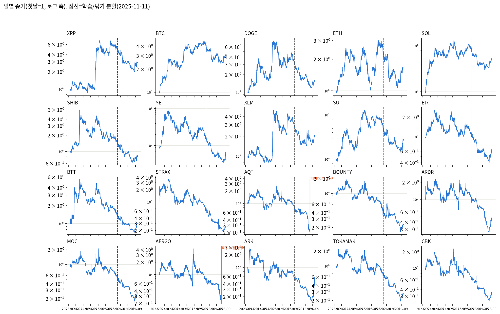
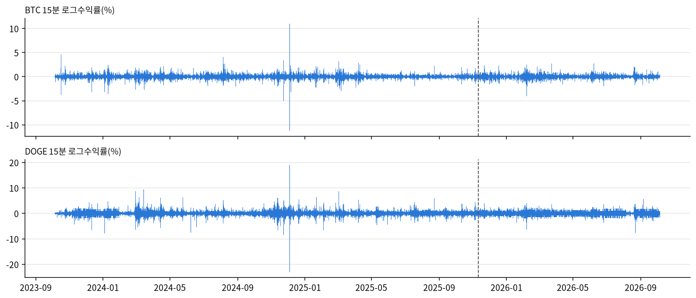
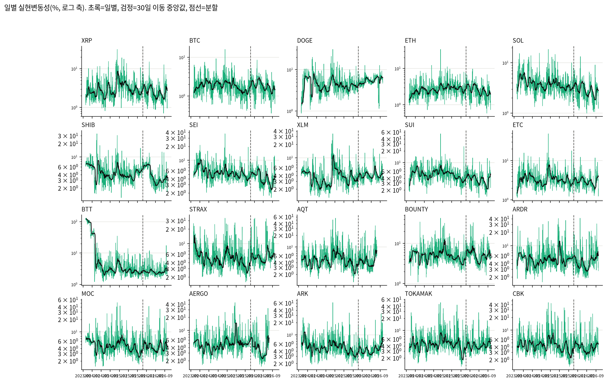
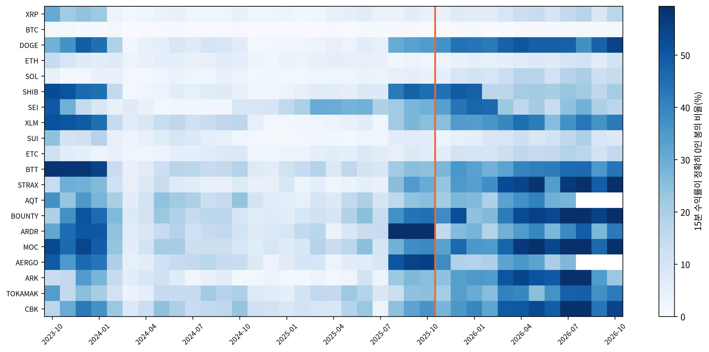
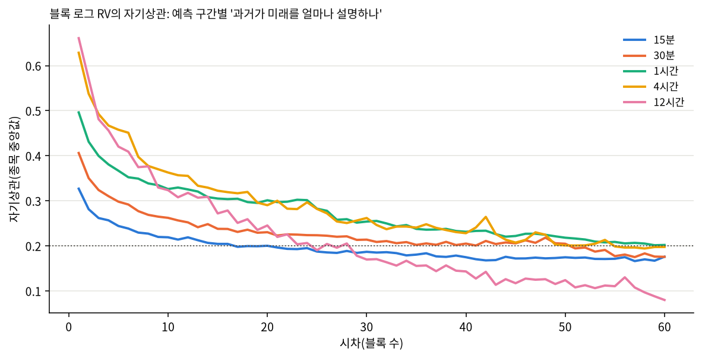
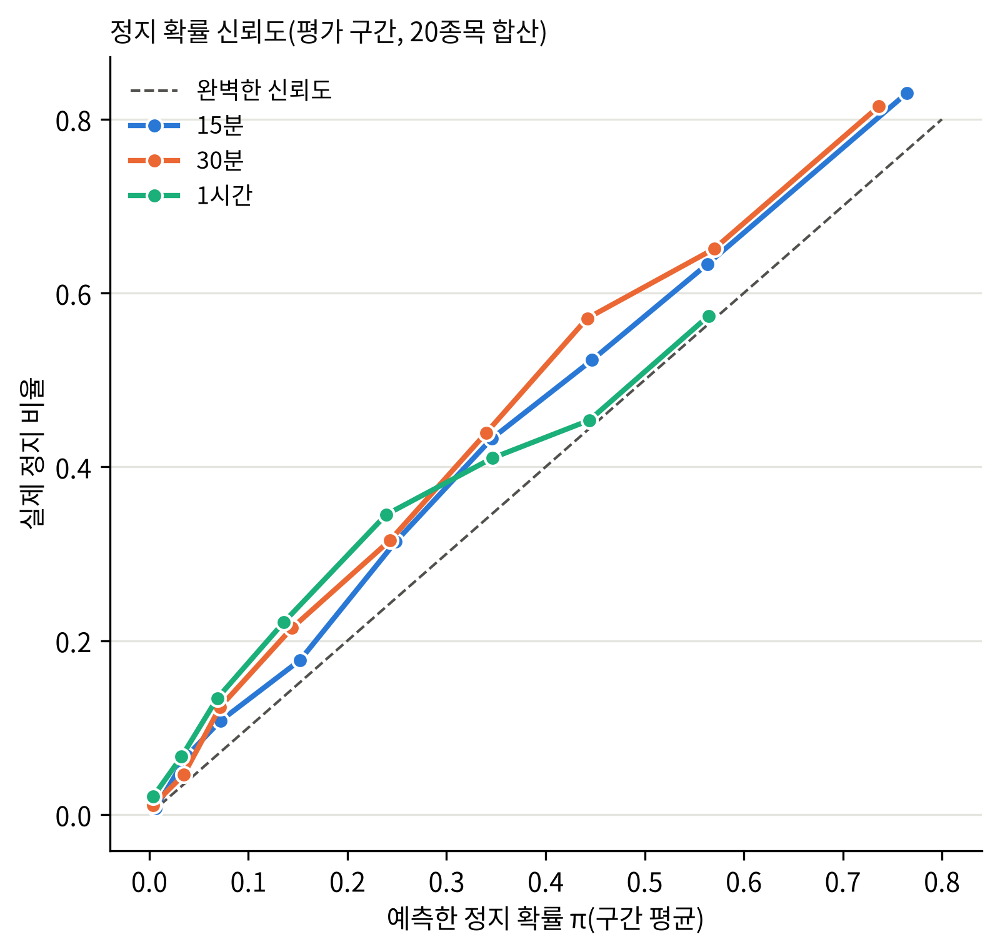
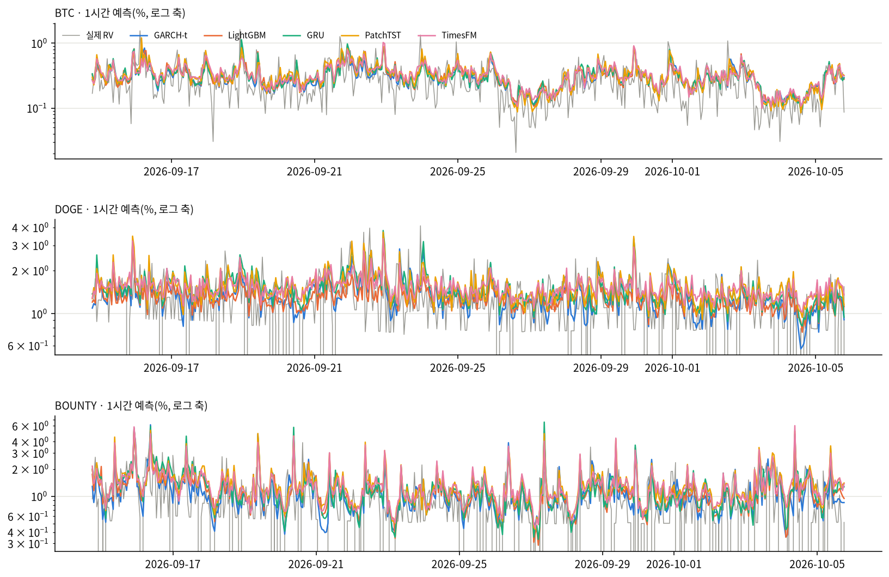
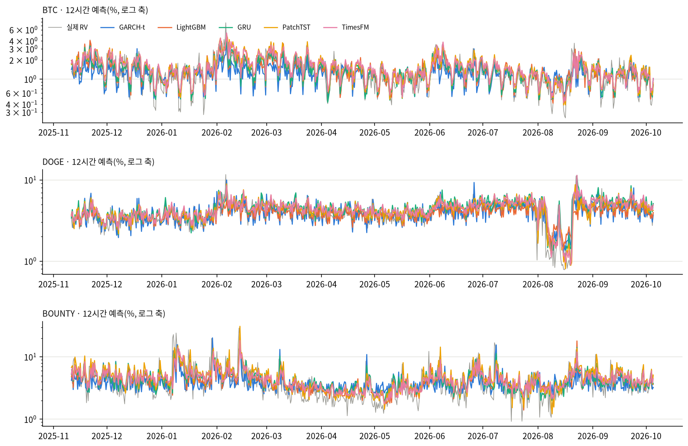

# 27b번: EDA·결과 점검·계열 단위 검정

데이터 창 2023-10-06 00:00:00 ~ 2026-10-05 20:45:00, 분할 2025-11-11 00:00:00, 20종목. 27번 결합 결과 있음.

## A. 거시 EDA: 데이터 자체가 어떤 모습인가

**읽는 법과 해석**: 각 칸은 종목 하나의 3년 가격 경로다. 3년 동안 오른 종목 8개, 내린 종목 12개이고, 가장 많이 오른 종목은 SOL(5.2배), 가장 많이 내린 종목은 AQT(0.22배)다. 가격은 방향 없이 떠돌며 종목마다 경로가 전혀 달라 가격 수준 자체는 예측 대상이 될 수 없다(비정상). 그래서 이 연구는 가격이 아니라 변동성을 예측한다. AQT·AERGO는 2026-07-18에 데이터가 끝난다(상장폐지, 평가 기간이 약 2.5개월 짧음).

**읽는 법과 해석**: 15분 수익률은 0 주변에서 오르내리지만 큰 움직임이 몰려서 나타난다(변동성 군집). 조용한 기간과 요동치는 기간이 번갈아 오는 이 구조가 변동성을 예측할 수 있는 근거다. 수익률의 부호는 예측할 수 없지만, 크기는 앞뒤로 이어진다.

| 종목 | 일별 RV 중앙값(학습) | 일별 RV 중앙값(평가) | 평가/학습 |
| :--- | ---: | ---: | ---: |
| XRP | 2.798% | 2.426% | 0.87 |
| BTC | 1.807% | 1.825% | 1.01 |
| DOGE | 4.281% | 5.622% | 1.31 |
| ETH | 2.629% | 2.487% | 0.95 |
| SOL | 3.711% | 2.793% | 0.75 |
| SHIB | 4.665% | 3.492% | 0.75 |
| SEI | 5.334% | 4.353% | 0.82 |
| XLM | 3.668% | 4.038% | 1.10 |
| SUI | 5.044% | 3.821% | 0.76 |
| ETC | 3.234% | 2.959% | 0.91 |
| BTT | 3.141% | 2.476% | 0.79 |
| STRAX | 4.708% | 5.186% | 1.10 |
| AQT | 4.475% | 4.305% | 0.96 |
| BOUNTY | 4.869% | 5.121% | 1.05 |
| ARDR | 4.995% | 4.323% | 0.87 |
| MOC | 4.763% | 4.125% | 0.87 |
| AERGO | 4.770% | 3.664% | 0.77 |
| ARK | 4.749% | 4.352% | 0.92 |
| TOKAMAK | 4.366% | 4.093% | 0.94 |
| CBK | 4.317% | 3.915% | 0.91 |

**읽는 법과 해석**: 변동성 수준은 몇 달 단위로 크게 바뀐다(이동 중앙값의 오르내림). 평가 기간의 일별 변동성은 학습 기간 대비 종목 중앙 0.91배이고, 범위는 0.75배(SHIB)~1.31배(DOGE)다. 학습 때와 수준이 다른 구간을 예측해야 하므로, 모델이 최근 수준에 얼마나 빨리 적응하는지와 보정(내부검증 배율)이 결과에 영향을 준다.

**읽는 법과 해석**: 진할수록 그 달에 가격이 한 칸도 안 움직인 15분 봉이 많다. 20종목 중 20종목에서 평가 기간의 정지 비율이 학습 기간보다 높다(종목 중앙 학습 15.8% → 평가 30.3%). 평가 기간에 시장 유동성이 줄었다는 뜻이며, 정지를 학습 평균으로 고정하지 않고 최근 정지 이력으로 따로 예측하는 두 부분 모형의 근거다. BTC·ETH·SOL처럼 정지가 거의 없는 종목은 이 처리의 영향을 받지 않는다.
시기별 정지 비율(종목·월 중앙값): 초기(2023-10~2024-01) 29.2%, 중기(2024-02~2025-07) 6.4%, 분할 직전(2025-08~2025-10) 25.2%, 평가(2025-11~) 28.4%. 정지 비율은 평가 기간에 갑자기 생긴 것이 아니라 수집 초기에 높았다가 중기에 낮아지고 2025년 8월부터 다시 오르는 U자 모양이다. 학습 구간 안에도 정지가 많던 시기가 있어 분류기가 그 패턴을 배울 수 있었지만, 평가 기간의 수준은 학습 구간 전체 평균보다 높다(B2절의 과소예측과 연결된다).

| 예측 구간 | 시차 1 | 시차 10 | 시차 60 | 0.2 아래로 처음 떨어지는 시차(블록) |
| :--- | ---: | ---: | ---: | ---: |
| 15분 | 0.327 | 0.219 | 0.176 | 17 |
| 30분 | 0.406 | 0.262 | 0.176 | 51 |
| 1시간 | 0.496 | 0.326 | 0.202 | 60 안에서 안 떨어짐 |
| 4시간 | 0.629 | 0.363 | 0.198 | 55 |
| 12시간 | 0.661 | 0.324 | 0.080 | 25 |

**읽는 법과 해석**: 직전 블록과의 자기상관은 15분 0.33에서 12시간 0.66로 예측 구간이 길수록 높다. 짧은 구간의 RV는 정지·호가 단위로 생기는 잡음이 커서 바로 앞 값과도 덜 비슷하고, 긴 구간은 잡음이 합쳐지며 평균으로 줄어 지속성이 또렷해진다. 자기상관이 수십 블록에 걸쳐 천천히 줄어드는 것(장기기억)은 긴 이력을 보는 모델(GARCH 재귀, 순환망, 긴 문맥의 파운데이션 모델)이 유리할 수 있다는 근거이고, 짧은 구간의 낮은 자기상관은 모델끼리 차이를 내기 어려운 이유다.

## B. 적용한 처리가 의도대로 작동했는가

### B1. 시간 격자 복원: 옛 '행 4개 = 1시간' 창의 실제 시간 길이

| 종목 | 60분 넘는 창 비율(전체) | 60분 넘는 창 비율(평가) | 평가 창 길이 99% 분위(분) |
| :--- | ---: | ---: | ---: |
| MOC | 16.0% | 39.5% | 255 |
| BOUNTY | 16.9% | 35.6% | 255 |
| CBK | 14.5% | 32.7% | 225 |
| TOKAMAK | 12.0% | 29.2% | 195 |
| ARK | 8.4% | 26.9% | 165 |
| AQT | 9.6% | 21.4% | 150 |
| STRAX | 7.5% | 21.3% | 150 |
| ARDR | 9.7% | 17.8% | 135 |
| AERGO | 5.8% | 11.2% | 105 |
| BTT | 2.4% | 6.4% | 90 |
| SEI | 0.7% | 2.2% | 75 |
| ETC | 0.4% | 1.2% | 75 |
| XLM | 0.2% | 0.1% | 60 |
| SUI | 0.1% | 0.1% | 60 |
| SHIB | 0.1% | 0.1% | 60 |
| DOGE | 0.1% | 0.0% | 60 |
| SOL | 0.1% | 0.0% | 60 |
| XRP | 0.1% | 0.0% | 60 |
| BTC | 0.1% | 0.0% | 60 |
| ETH | 0.1% | 0.0% | 60 |

**읽는 법과 해석**: 업비트는 체결이 없는 15분에는 캔들을 만들지 않으므로, 행 4개를 1시간으로 보면 실제로는 더 긴 시간이 된다. 평가 기간에 60분을 넘는 창이 가장 많은 종목은 MOC(39.5%)이고, BTC 등 유동성 높은 종목은 0%에 가깝다. 24·25번은 이 왜곡을 안고 있었고, 26번부터 15분 시간 격자로 복원해 모든 창이 정확히 같은 시간 길이가 됐다. 저유동 종목의 결과가 24·25번과 달라진 원인 중 하나다.

### B2. 정지 확률의 신뢰도(예측한 정지 확률 대 실제 정지 비율)

| 예측 구간 | π 평균 | 실제 정지 비율 | Brier(분류기) | Brier(상수, 평가 평균 사용) |
| :--- | ---: | ---: | ---: | ---: |
| 15분 | 0.234 | 0.286 | 0.1720 | 0.2042 |
| 30분 | 0.092 | 0.133 | 0.1007 | 0.1155 |
| 1시간 | 0.021 | 0.046 | 0.0419 | 0.0442 |
| 4시간·12시간 | 해당 없음 | 해당 없음 | 해당 없음 | 해당 없음(정지 표본이 거의 없어 분류기 미적합, π=0) |

**읽는 법과 해석**: 점이 대각선 위에 있으면 "π=0.3이라고 예측한 시점의 30%에서 실제로 정지"라는 뜻으로, 확률이 믿을 만하다. 대각선보다 아래면 정지를 과대예측, 위면 과소예측이다. 상수 기준 Brier는 평가 구간의 실제 평균 정지율을 미리 안다고 가정한 값이라 분류기에 불리한 비교인데도, 분류기가 이보다 작으면 시점마다 정지 가능성을 가려낸다는 뜻이다.
**이번 결과**: 15분 π 0.234 대 실제 0.286, 30분 π 0.092 대 실제 0.133, 1시간 π 0.021 대 실제 0.046로 분류기가 정지를 **평균적으로 낮게 예측**한다(신뢰도 그림의 점이 거의 모두 대각선 위). 분류기는 학습 구간으로 맞춰졌는데 평가 기간의 정지가 그보다 많기 때문이다(A3절). 그래도 Brier는 분류기 쪽이 작아서, 시점별로 정지 가능성의 높낮이는 가려낸다(순서는 맞고 수준이 낮다). 결과적으로 두 부분 모형은 정지 시점의 손실을 줄이지만 그 효과는 완전하지 않다. 수준까지 맞추려면 내부검증 구간의 정지율로 π를 재보정하는 방법이 있으나, 이번 회차는 26c와 같은 조건을 유지하려고 적용하지 않았다.

### B3. MS-GARCH 제약 모수화 전후

| 예측 구간 | 보정계수 원본(최소~최대) | 보정계수 제약(최소~최대) | QLIKE 원본(중앙) | QLIKE 제약(중앙) |
| :--- | :--- | :--- | ---: | ---: |
| 15분 | 0.064~1.211 | 0.857~1.216 | -9.697 | -9.705 |
| 30분 | 0.058~1.226 | 0.821~1.197 | -9.045 | -9.054 |
| 1시간 | 0.050~1.193 | 0.751~1.194 | -8.347 | -8.340 |
| 4시간 | 0.043~1.092 | 0.715~1.089 | -6.810 | -6.827 |
| 12시간 | 0.038~1.106 | 0.604~1.102 | -5.626 | -5.658 |

**읽는 법과 해석**: 원본 모수화에서는 일부 종목의 보정계수가 0.04까지 떨어졌다(내부학습 적합이 경계에 붙어 분산을 수십 배 과대예측). 제약 모수화 후에는 모든 칸이 0.60~1.22로 정상 범위이고 20종목 모두 수렴했다. 다만 10종목은 자유도 등이 허용 범위의 경계에 닿아 있어(꼬리가 아주 두꺼운 저유동 종목), 그 종목의 MS-GARCH는 꼬리 추정이 한계에 걸린 상태라는 단서가 붙는다.

## C. 결과 점검

### C1. 모델별 예측 품질 이상치

| 모델 | 15분 상관(최소) | 30분 상관(최소) | 1시간 상관(최소) | 4시간 상관(최소) | 12시간 상관(최소) |
| :--- | ---: | ---: | ---: | ---: | ---: |
| GARCH-t | 0.395 (0.305) | 0.472 (0.367) | 0.531 (0.397) | 0.600 (0.469) | 0.568 (0.312) |
| MS-GARCH | 0.399 (0.316) | 0.463 (0.365) | 0.544 (0.405) | 0.622 (0.464) | 0.610 (0.306) |
| TAR-GARCH | 0.391 (0.304) | 0.465 (0.361) | 0.530 (0.392) | 0.587 (0.425) | 0.536 (0.216) |
| KernelRidge-RBF | 0.370 (0.277) | 0.442 (0.343) | 0.522 (0.402) | 0.635 (0.514) | 0.604 (0.407) |
| SVR-RBF | 0.346 (0.099) | 0.419 (0.168) | 0.472 (0.224) | 0.537 (0.256) | 0.490 (0.046) |
| Nystroem+Ridge | 0.401 (0.282) | 0.472 (0.243) | 0.544 (0.420) | 0.624 (0.516) | 0.605 (0.439) |
| LightGBM | 0.385 (0.226) | 0.474 (0.344) | 0.553 (0.422) | 0.640 (0.508) | 0.628 (0.435) |
| XGBoost | 0.368 (0.215) | 0.474 (0.345) | 0.552 (0.420) | 0.639 (0.507) | 0.614 (0.436) |
| HistGBM | 0.402 (0.279) | 0.481 (0.369) | 0.552 (0.423) | 0.636 (0.504) | 0.629 (0.435) |
| GARCH+LightGBM | 0.387 (0.219) | 0.471 (0.346) | 0.554 (0.421) | 0.638 (0.508) | 0.633 (0.438) |
| GRU | 0.381 (0.305) | 0.473 (0.361) | 0.559 (0.411) | 0.658 (0.510) | 0.668 (0.422) |
| LSTM | 0.384 (0.263) | 0.465 (0.370) | 0.556 (0.407) | 0.657 (0.509) | 0.655 (0.421) |
| PatchTST | 0.399 (0.304) | 0.501 (0.377) | 0.556 (0.411) | 0.656 (0.511) | 0.650 (0.381) |
| iTransformer | 0.372 (0.171) | 0.433 (0.176) | 0.477 (0.269) | 0.577 (0.388) | 0.580 (0.297) |
| TCN | 0.399 (0.302) | 0.491 (0.358) | 0.535 (0.387) | 0.552 (0.386) | 0.462 (0.153) |
| Autoformer | 0.377 (0.284) | 0.444 (0.292) | 0.483 (0.292) | 0.599 (0.397) | 0.600 (0.344) |
| TimesNet | 0.396 (0.297) | 0.495 (0.364) | 0.549 (0.373) | 0.558 (0.419) | 0.553 (0.277) |
| TimeXer | 0.393 (0.301) | 0.490 (0.361) | 0.549 (0.397) | 0.640 (0.480) | 0.635 (0.344) |
| ModernTCN | 0.396 (0.299) | 0.491 (0.358) | 0.554 (0.394) | 0.654 (0.498) | 0.416 (0.109) |
| S-Mamba | 0.380 (0.295) | 0.468 (0.084) | 0.541 (0.137) | 0.631 (0.218) | 0.605 (0.137) |
| Chronos-Bolt | 0.382 (0.281) | 0.489 (0.352) | 0.553 (0.398) | 0.654 (0.484) | 0.646 (0.367) |
| TimesFM | 0.388 (0.295) | 0.483 (0.350) | 0.552 (0.394) | 0.654 (0.494) | 0.662 (0.388) |
| TTM | 0.351 (0.256) | 0.475 (0.343) | 0.545 (0.375) | 제외(TTM 지원 해상도 밖) | 제외(TTM 지원 해상도 밖) |
| Moirai-2 | 0.380 (0.285) | 0.481 (0.338) | 0.548 (0.387) | 0.653 (0.479) | 0.650 (0.373) |
| Sundial | 0.377 (0.281) | 0.477 (0.344) | 0.536 (0.374) | 0.643 (0.478) | 0.649 (0.359) |
| Time-MoE | 0.381 (0.284) | 0.479 (0.345) | 0.546 (0.382) | 0.651 (0.485) | 0.651 (0.381) |
| Lag-Llama | 0.351 (0.248) | 0.461 (0.326) | 0.519 (0.350) | 0.620 (0.459) | 0.624 (0.322) |

**읽는 법과 해석**: 셀은 예측과 실제의 로그 상관(RV>0 시점)의 종목 중앙값과 괄호 안 최솟값이다. 상관이 0.1보다 낮거나 필터로 바뀐 예측이 5%를 넘는 칸을 이상치로 본다. 이상치 칸: 없음.

### C2. 26c 공유 모델 값 대조

26c의 13개 모델 1300칸을 결합 결과와 대조했다. QLIKE 최대 차이 0.00e+00. **같다**(결합 과정에서 기존 결과가 바뀌지 않았다).

### C3. 예측-실제 겹쳐 그리기(결과를 보기 전에 정한 예시 모델)

**읽는 법과 해석**: 회색이 실제 RV, 색선이 각 계열 예시 모델의 예측이다(1시간은 평가 마지막 3주, 12시간은 평가 전체). 예측선이 실제의 오르내림을 따라가면 "폭 변화 추적력"이 있고, 평균 높이가 실제와 맞으면 "평균 폭 정확도"가 있다. 모든 모델이 급등 직후에야 따라 오르는 지연을 보이면 그것은 변동성 예측의 본질적 한계(충격은 예측 불가, 그 뒤의 지속만 예측 가능)다. 회색선이 그림 아래로 잘려 내려가는 곳은 RV=0(가격 정지) 시점이다. 로그 축에는 0을 그릴 수 없어 잘린다. 1시간 DOGE·BOUNTY에서 이런 시점이 잦은 것은 A절의 정지 비율과 맞는다.

## D. 계열 단위 검정: 순차 대 병렬 어텐션 대 파운데이션

**검정 설계**

| 항목 | 내용 |
| :--- | :--- |
| 비교 단위 | 계열(통계, 하이브리드, 트리, 순환 딥러닝, 커널, 어텐션, 합성곱, 상태공간, 파운데이션) |
| 계열 손실 | 시각 t마다, 그 계열에 속한 모든 모델의 QLIKE(무작위 모델은 시드 평균)를 종목·모델에 걸쳐 단순 평균. 대표 모델을 고르지 않으므로 선택 편향이 없다 |
| 비교 집단(코드) | `d_t = 계열A손실_t − 계열B손실_t`, 같은 시각의 대응 표본 |
| 귀무가설 H0 | E[d_t]=0, 두 계열의 전형적인 모델의 기대 손실이 같다 |
| 대립가설 H1 | E[d_t]≠0 |
| 통계량 | HAC t(Newey-West, lag=⌊4(n/100)^(2/9)⌋), 구간마다 계열 쌍 전체에 Holm 보정, 유의수준 0.05 |
| 기각의 의미 | 한 계열의 전형적인 모델이 다른 계열보다 평균적으로 낫다(부호가 음수면 A가 낫다). 계열의 최선 모델끼리의 비교가 아니다 |

### D1. 계열 평균 손실(낮을수록 좋음, 구간마다 최선 계열 대비 차)

| 계열 | 모델 수 | 15분 | 30분 | 1시간 | 4시간 | 12시간 |
| :--- | ---: | ---: | ---: | ---: | ---: | ---: |
| 통계 | 3 | +0.0000 | +0.0301 | +0.0554 | +0.0813 | +0.1290 |
| 하이브리드 | 1 | +0.0171 | +0.0004 | +0.0000 | +0.0006 | +0.0100 |
| 트리 | 3 | +0.0234 | +0.0000 | +0.0013 | +0.0000 | +0.0070 |
| 딥러닝 | 2 | +0.1522 | +0.0545 | +0.0224 | +0.0007 | +0.0000 |
| 커널 | 3 | +0.0646 | +0.0748 | +0.0782 | +0.0679 | +0.0820 |
| 어텐션 | 4 | +0.1513 | +0.1206 | +0.1053 | +0.0463 | +0.0598 |
| 합성곱 | 3 | +0.1015 | +0.0784 | +0.0609 | +0.0872 | +0.2627 |
| 상태공간 | 1 | +0.1511 | +0.1503 | +0.1036 | +0.0409 | +0.0584 |
| 파운데이션 | 7 | +0.1678 | +0.0912 | +0.0492 | +0.0139 | +0.0223 |

**읽는 법과 해석**: 셀은 그 계열 구성원 손실의 단순 평균에서 그 구간 최선 계열의 값을 뺀 차이다(0이 최선, 클수록 나쁨). 구간별 최선 계열은 15분 통계, 30분 트리, 1시간 하이브리드, 4시간 트리, 12시간 딥러닝이다. 모델 수 칸은 전체 구간 기준이며, 파운데이션 계열은 TTM 제외로 구간별 구성원 수가 15분 7, 30분 7, 1시간 7, 4시간 6, 12시간 6개다. 계열 평균은 약한 구성원에 끌려 내려가므로, 계열의 최선 모델이 경쟁력이 있는지는 D3(MCS)와 함께 본다.

### D2. 계열 쌍 DM 검정(Holm 보정)

**15분** (평가 시각 7,878, 최선 계열 통계)

| 계열 | 최선 계열 대비 평균차 | Holm p | 판정 |
| :--- | ---: | ---: | :--- |
| 통계 | 0(기준) | - | 최선 |
| 하이브리드 | +0.0171 | 0.0726 | H0 기각 못함: 최선 계열과 구분되지 않음 |
| 트리 | +0.0234 | 0.00313 | H0 기각: 최선 계열보다 유의하게 나쁨 |
| 커널 | +0.0646 | 5.39e-10 | H0 기각: 최선 계열보다 유의하게 나쁨 |
| 합성곱 | +0.1015 | 1.47e-20 | H0 기각: 최선 계열보다 유의하게 나쁨 |
| 상태공간 | +0.1511 | 1.73e-25 | H0 기각: 최선 계열보다 유의하게 나쁨 |
| 어텐션 | +0.1513 | 8.51e-41 | H0 기각: 최선 계열보다 유의하게 나쁨 |
| 딥러닝 | +0.1522 | 1.06e-66 | H0 기각: 최선 계열보다 유의하게 나쁨 |
| 파운데이션 | +0.1678 | 6.61e-35 | H0 기각: 최선 계열보다 유의하게 나쁨 |

**읽는 법과 해석**: 평균차는 (그 계열 − 통계) 손실의 시각 평균이고, 양수면 그 계열이 나쁘다. Holm 보정 후 통계와 구분되지 않는 계열은 하이브리드이다. 나머지 계열은 H0(기대 손실 같음)가 기각되어, 그 계열의 전형적인 모델은 통계의 전형적인 모델보다 평균적으로 손실이 크다.

**30분** (평가 시각 7,874, 최선 계열 트리)

| 계열 | 최선 계열 대비 평균차 | Holm p | 판정 |
| :--- | ---: | ---: | :--- |
| 트리 | 0(기준) | - | 최선 |
| 하이브리드 | +0.0004 | 1 | H0 기각 못함: 최선 계열과 구분되지 않음 |
| 통계 | +0.0301 | 2.98e-11 | H0 기각: 최선 계열보다 유의하게 나쁨 |
| 딥러닝 | +0.0545 | 1.45e-34 | H0 기각: 최선 계열보다 유의하게 나쁨 |
| 커널 | +0.0748 | 3.06e-35 | H0 기각: 최선 계열보다 유의하게 나쁨 |
| 합성곱 | +0.0784 | 1.32e-44 | H0 기각: 최선 계열보다 유의하게 나쁨 |
| 파운데이션 | +0.0912 | 4.06e-48 | H0 기각: 최선 계열보다 유의하게 나쁨 |
| 어텐션 | +0.1206 | 6.16e-91 | H0 기각: 최선 계열보다 유의하게 나쁨 |
| 상태공간 | +0.1503 | 4.67e-28 | H0 기각: 최선 계열보다 유의하게 나쁨 |

**읽는 법과 해석**: 평균차는 (그 계열 − 트리) 손실의 시각 평균이고, 양수면 그 계열이 나쁘다. Holm 보정 후 트리와 구분되지 않는 계열은 하이브리드이다. 나머지 계열은 H0(기대 손실 같음)가 기각되어, 그 계열의 전형적인 모델은 트리의 전형적인 모델보다 평균적으로 손실이 크다.

**1시간** (평가 시각 7,873, 최선 계열 하이브리드)

| 계열 | 최선 계열 대비 평균차 | Holm p | 판정 |
| :--- | ---: | ---: | :--- |
| 하이브리드 | 0(기준) | - | 최선 |
| 트리 | +0.0013 | 1 | H0 기각 못함: 최선 계열과 구분되지 않음 |
| 딥러닝 | +0.0224 | 2.66e-12 | H0 기각: 최선 계열보다 유의하게 나쁨 |
| 파운데이션 | +0.0492 | 1.86e-18 | H0 기각: 최선 계열보다 유의하게 나쁨 |
| 통계 | +0.0554 | 4.42e-41 | H0 기각: 최선 계열보다 유의하게 나쁨 |
| 합성곱 | +0.0609 | 4.21e-50 | H0 기각: 최선 계열보다 유의하게 나쁨 |
| 커널 | +0.0782 | 6.18e-27 | H0 기각: 최선 계열보다 유의하게 나쁨 |
| 상태공간 | +0.1036 | 8.71e-20 | H0 기각: 최선 계열보다 유의하게 나쁨 |
| 어텐션 | +0.1053 | 3.15e-54 | H0 기각: 최선 계열보다 유의하게 나쁨 |

**읽는 법과 해석**: 평균차는 (그 계열 − 하이브리드) 손실의 시각 평균이고, 양수면 그 계열이 나쁘다. Holm 보정 후 하이브리드와 구분되지 않는 계열은 트리이다. 나머지 계열은 H0(기대 손실 같음)가 기각되어, 그 계열의 전형적인 모델은 하이브리드의 전형적인 모델보다 평균적으로 손실이 크다.

**4시간** (평가 시각 1,964, 최선 계열 트리)

| 계열 | 최선 계열 대비 평균차 | Holm p | 판정 |
| :--- | ---: | ---: | :--- |
| 트리 | 0(기준) | - | 최선 |
| 하이브리드 | +0.0006 | 1 | H0 기각 못함: 최선 계열과 구분되지 않음 |
| 딥러닝 | +0.0007 | 1 | H0 기각 못함: 최선 계열과 구분되지 않음 |
| 파운데이션 | +0.0139 | 0.288 | H0 기각 못함: 최선 계열과 구분되지 않음 |
| 상태공간 | +0.0409 | 0.00428 | H0 기각: 최선 계열보다 유의하게 나쁨 |
| 어텐션 | +0.0463 | 2.72e-08 | H0 기각: 최선 계열보다 유의하게 나쁨 |
| 커널 | +0.0679 | 8.71e-11 | H0 기각: 최선 계열보다 유의하게 나쁨 |
| 통계 | +0.0813 | 5.88e-17 | H0 기각: 최선 계열보다 유의하게 나쁨 |
| 합성곱 | +0.0872 | 3.22e-32 | H0 기각: 최선 계열보다 유의하게 나쁨 |

**읽는 법과 해석**: 평균차는 (그 계열 − 트리) 손실의 시각 평균이고, 양수면 그 계열이 나쁘다. Holm 보정 후 트리와 구분되지 않는 계열은 하이브리드, 딥러닝, 파운데이션이다. 나머지 계열은 H0(기대 손실 같음)가 기각되어, 그 계열의 전형적인 모델은 트리의 전형적인 모델보다 평균적으로 손실이 크다.

**12시간** (평가 시각 651, 최선 계열 딥러닝)

| 계열 | 최선 계열 대비 평균차 | Holm p | 판정 |
| :--- | ---: | ---: | :--- |
| 딥러닝 | 0(기준) | - | 최선 |
| 트리 | +0.0070 | 1 | H0 기각 못함: 최선 계열과 구분되지 않음 |
| 하이브리드 | +0.0100 | 1 | H0 기각 못함: 최선 계열과 구분되지 않음 |
| 파운데이션 | +0.0223 | 0.224 | H0 기각 못함: 최선 계열과 구분되지 않음 |
| 상태공간 | +0.0584 | 0.0686 | H0 기각 못함: 최선 계열과 구분되지 않음 |
| 어텐션 | +0.0598 | 0.000151 | H0 기각: 최선 계열보다 유의하게 나쁨 |
| 커널 | +0.0820 | 8.75e-05 | H0 기각: 최선 계열보다 유의하게 나쁨 |
| 통계 | +0.1290 | 7.97e-14 | H0 기각: 최선 계열보다 유의하게 나쁨 |
| 합성곱 | +0.2627 | 3.36e-13 | H0 기각: 최선 계열보다 유의하게 나쁨 |

**읽는 법과 해석**: 평균차는 (그 계열 − 딥러닝) 손실의 시각 평균이고, 양수면 그 계열이 나쁘다. Holm 보정 후 딥러닝와 구분되지 않는 계열은 트리, 하이브리드, 파운데이션, 상태공간이다. 나머지 계열은 H0(기대 손실 같음)가 기각되어, 그 계열의 전형적인 모델은 딥러닝의 전형적인 모델보다 평균적으로 손실이 크다.

### D2b. 연구 질문 쌍: 순차(순환 딥러닝) 대 병렬 어텐션 대 파운데이션

비교 집단과 가설은 D2와 같다(H0: 두 계열의 전형적인 모델의 기대 손실이 같다, H1: 다르다). 평균차는 (앞 계열 − 뒤 계열)이고 음수면 앞 계열이 낫다. p는 D2와 같은 구간별 전 계열 쌍 Holm 보정값이다.

| 쌍 | 15분 | 30분 | 1시간 | 4시간 | 12시간 |
| :--- | :--- | :--- | :--- | :--- | :--- |
| 딥러닝 − 어텐션 | +0.0009 (p=1, 구분 안 됨) | -0.0661 (p=1.8e-17, 딥러닝) | -0.0829 (p=1.8e-27, 딥러닝) | -0.0456 (p=1.1e-05, 딥러닝) | -0.0598 (p=0.00015, 딥러닝) |
| 딥러닝 − 파운데이션 | -0.0156 (p=1, 구분 안 됨) | -0.0367 (p=7.7e-07, 딥러닝) | -0.0268 (p=0.00014, 딥러닝) | -0.0132 (p=0.91, 구분 안 됨) | -0.0223 (p=0.22, 구분 안 됨) |
| 어텐션 − 파운데이션 | -0.0165 (p=0.45, 구분 안 됨) | +0.0294 (p=3.2e-08, 파운데이션) | +0.0561 (p=7.8e-44, 파운데이션) | +0.0324 (p=3.4e-12, 파운데이션) | +0.0375 (p=1.4e-06, 파운데이션) |

**읽는 법과 해석**: 괄호 안 마지막 항목은 Holm 보정 유의수준 0.05에서 손실이 유의하게 작은 계열이고, 유의하지 않으면 '구분 안 됨'이다. 딥러닝 대 어텐션: 15분 구분 안 됨, 30분 딥러닝, 1시간 딥러닝, 4시간 딥러닝, 12시간 딥러닝. 딥러닝 대 파운데이션: 15분 구분 안 됨, 30분 딥러닝, 1시간 딥러닝, 4시간 구분 안 됨, 12시간 구분 안 됨. 어텐션 대 파운데이션: 15분 구분 안 됨, 30분 파운데이션, 1시간 파운데이션, 4시간 파운데이션, 12시간 파운데이션. 순환 딥러닝은 입력이 15분봉 96개이고 어텐션·파운데이션은 H분 블록 이력이므로, 이 차이에는 입력 표현의 차이가 섞여 있다.

### D3. 계열별 MCS 포함 수(모델 단위 MCS, 26b 결과)

| 계열 | 15분 | 30분 | 1시간 | 4시간 | 12시간 |
| :--- | :--- | :--- | :--- | :--- | :--- |
| 통계 | 3/3 | 0/3 | 0/3 | 0/3 | 0/3 |
| 하이브리드 | 1/1 | 1/1 | 1/1 | 1/1 | 1/1 |
| 트리 | 2/3 | 3/3 | 3/3 | 3/3 | 3/3 |
| 딥러닝 | 0/2 | 0/2 | 0/2 | 2/2 | 2/2 |
| 커널 | 1/3 | 0/3 | 0/3 | 1/3 | 1/3 |
| 어텐션 | 0/4 | 0/4 | 0/4 | 1/4 | 0/4 |
| 합성곱 | 0/3 | 0/3 | 0/3 | 1/3 | 0/3 |
| 상태공간 | 0/1 | 0/1 | 0/1 | 0/1 | 0/1 |
| 파운데이션 | 0/7 | 0/7 | 0/7 | 5/6 | 3/6 |

**읽는 법과 해석**: 셀은 그 계열 모델 중 최선 모델 집합(MCS)에 남은 수/계열 모델 수다. D2는 "계열의 전형적인 모델", D3는 "계열의 최선 모델"을 본다. 두 판정이 엇갈리면(예: 계열 평균은 나쁘지만 MCS에 한 모델이 남음) 그 계열은 모델 선택에 민감하다는 뜻이다.
