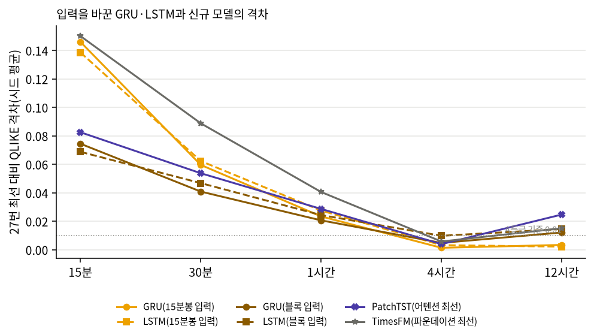

# 27c번: 순환망(GRU·LSTM)에 블록 입력을 넣은 순차 대 병렬 비교

## 0. 이 회차가 한 것과 이유

27번에서 순환 딥러닝(GRU·LSTM)이 30분~12시간에 병렬 어텐션 계열보다 유의하게 나았다(27b D2b). 두 계열은 같은 15분봉 종가에서 출발하지만 모델에 넣는 모양과 학습 표본이 달랐다. 이 회차는 GRU·LSTM에 신규 모델과 같은 블록 입력·표본을 주고 다시 비교해, 순환망이 이긴 이유가 **구조**인지 **입력·표본**인지 가른다.

| 항목 | 26c GRU·LSTM(27번에 쓰인 값) | 블록 입력 GRU·LSTM(이 회차) | 27번 신규 신경망 |
| :--- | :--- | :--- | :--- |
| 원천 데이터 | 15분봉 종가 | 같음 | 같음 |
| 입력 | 15분봉 96개의 (d, \|d\|) | 직전 L블록 표준화 로그 RV(1변수), L=96·96·96·60·30 | 같은 블록 이력(iTransformer·S-Mamba는 +블록 수익률) |
| 학습 표본 | 15분마다 겹치는 예측 시점 | 겹치지 않는 블록 | 겹치지 않는 블록 |
| 학습률·에폭 선택 | 내부검증 구간(학습률 3개, 최대 60에폭, 인내 10) | 같음(블록 단위 내부검증 구간) | 학습 구간 끝 15%로 조기종료 |
| 보정·정지 확률 π | 26c 내부검증 정시, 26c π | 27번 블록 경계 정시, 27번 π | 27번 블록 경계 정시, 27번 π |
| 배치 | 2,048 | 2,048 × (블록 표본 수 / 26c 학습 행 수) | 라이브러리·저자 설정 |

**배치 규칙의 이유**: 26c GRU는 학습 행 약 6만 개를 배치 2,048로 돌아 에폭당 약 30번 가중치를 갱신했다. 블록 표본은 12시간에 약 1,270개라 같은 배치면 에폭당 1번만 갱신되어, 입력이 아니라 학습량 때문에 결과가 갈린다. 그래서 같은 종목·구간의 26c와 에폭당 갱신 횟수가 같도록 배치만 줄였다. 시드 0의 종목 중앙값은 다음과 같다.

| 구간 | 블록 학습 표본 | 26c 학습 행 | 배치 |
| :--- | ---: | ---: | ---: |
| 15분 | 53,800 | 53,530 | 2,048 |
| 30분 | 29,868 | 59,356 | 1,032 |
| 1시간 | 15,416 | 61,336 | 515 |
| 4시간 | 3,839 | 61,522 | 128 |
| 12시간 | 1,266 | 60,850 | 43 |

**하지 않은 것**: 신규 모델에 15분봉을 넣는 반대 방향 통일은 하지 않았다. 신규 모델은 '같은 시계열의 다음 값'을 예측하는 라이브러리 구조라, 15분봉을 넣으려면 15분 값 여러 개를 예측해 합치는 다단계 예측으로 바꾸거나(출력 형태라는 새 차이가 생김) 학습 절차를 고쳐야 한다(표준 사용법에서 벗어남). GRU는 어떤 수열이든 받는 범용 순차 회귀라 입력만 바꿔도 절차가 그대로다.

## 1. 결과 산출 점검

- 읽은 시드: [0, 1, 2, 3, 4]. 시드마다 20종목 × 5구간 × 2모델 = 200행이 기대값이다. 실제 행 수: 시드 0 200행, 시드 1 200행, 시드 2 200행, 시드 3 200행, 시드 4 200행.
- QLIKE 결측 0행, (시드, 종목, 구간, 모델) 중복 0행, 적합 실패 0건.
- 평가 시각과 실제값은 27번 결합 결과와 100칸 모두 같다(합치는 단계에서 대조, 다르면 멈춘다).
- 정지 확률 π: 27번 결합 결과(26c GRU·LSTM이 쓴 π)와의 최대 절대차 0.00e+00. 0이면 두 GRU의 차이에 π는 관여하지 않는다. 15분은 블록 경계가 모든 15분 시점이라 보정 구간도 26c와 같으므로, 15분의 GRU 대 블록 입력 GRU 차이는 입력 표현 차이만 남는다.
- 보정계수(두 부분 모형의 크기 배율) 범위 1.05~5.46, 중앙 1.66. 27번 전체 범위(0.36~9.65) 안이면 정상으로 본다.

## 2. 구간별 손실: 27번 최선 대비 격차

| 모델 | 입력 | 15분 | 30분 | 1시간 | 4시간 | 12시간 |
| :--- | :--- | ---: | ---: | ---: | ---: | ---: |
| GRU | 15분봉 | +0.1460 | +0.0596 | +0.0234 | +0.0014 | +0.0034 |
| LSTM | 15분봉 | +0.1386 | +0.0623 | +0.0276 | +0.0032 | +0.0022 |
| GRU-block | 블록 | +0.0745 | +0.0409 | +0.0207 | +0.0048 | +0.0121 |
| LSTM-block | 블록 | +0.0688 | +0.0468 | +0.0244 | +0.0098 | +0.0146 |
| PatchTST | 블록 | +0.0825 | +0.0538 | +0.0287 | +0.0040 | +0.0248 |
| TimesFM | 블록(512) | +0.1501 | +0.0888 | +0.0406 | +0.0058 | +0.0151 |
| (27번 최선) | | MS-GARCH | HistGBM | GARCH+LightGBM | LightGBM | Nystroem+Ridge |

**읽는 법**: 셀은 종목마다 (그 모델 − 그 구간 27번 최선 모델)의 시드 평균 QLIKE 차를 20종목 평균한 값이다(0에 가까울수록 최선에 가깝고, 0.01 이하는 27번의 A등급 기준). PatchTST는 27번 어텐션 계열 최선, TimesFM은 파운데이션 계열 최선이다.

**해석**: 같은 GRU의 입력만 바꿨을 때 격차 변화는 15분 GRU +0.1460 → 블록 +0.0745, 30분 GRU +0.0596 → 블록 +0.0409, 1시간 GRU +0.0234 → 블록 +0.0207, 4시간 GRU +0.0014 → 블록 +0.0048, 12시간 GRU +0.0034 → 블록 +0.0121이다. 격차가 커지면 15분봉 입력·많은 표본이 GRU에 유리했던 것이고, 비슷하면 입력이 결과를 가르지 않았다는 뜻이다. 통계적 판정은 3절의 검정으로 한다.

## 3. 검정: 구조 효과와 입력 효과

**검정 설계**

| 검정 | 비교 집단(A − B) | H0 | H1 | H0 기각의 의미 |
| :--- | :--- | :--- | :--- | :--- |
| S1 구조 효과(같은 입력) | 순환(블록 입력: GRU-block·LSTM-block) − 병렬 어텐션(PatchTST·iTransformer·Autoformer·TimeXer) | 두 계열의 기대 손실이 같다 | 다르다 | 입력·표본을 맞춰도 차이가 남는다 → 구조(순차 대 병렬) 차이다 |
| S2 구조 효과(합성곱) | 순환(블록 입력) − 병렬 합성곱(TCN·TimesNet·ModernTCN) | 같다 | 다르다 | 같은 입력에서 순환과 합성곱 구조가 다르다 |
| S3 구조 효과(상태공간) | 순환(블록 입력) − S-Mamba | 같다 | 다르다 | 같은 입력에서 순환과 선택적 상태공간이 다르다 |
| I1 입력 효과(같은 구조) | 순환(15분봉 입력: GRU·LSTM) − 순환(블록 입력) | 같다 | 다르다 | 같은 구조에서 입력·표본만 바꿔도 손실이 달라진다 → 27번 차이에 입력 효과가 섞여 있었다 |
| R1 참고(27b 재현) | 순환(15분봉 입력) − 병렬 어텐션 | 같다 | 다르다 | 27b D2b의 결과(입력이 다른 상태의 비교) |
| R2 참고 | 순환(블록 입력) − 파운데이션(zero-shot) | 같다 | 다르다 | 입력 길이가 다르다(파운데이션은 512블록 이상)는 점이 남은 비교 |

계열 손실은 시각마다 구성원 QLIKE(시드 평균)를 단순 평균한 값을 종목에 걸쳐 평균한 것이다(27b D절과 같은 정의, 대표 모델을 고르지 않아 선택 편향이 없다). 통계량은 대응 차이 d_t의 HAC t(Newey-West, lag=⌊4(n/100)^(2/9)⌋)이고, 구간마다 위 6개 검정에 Holm 보정, 유의수준 0.05다. 평균차가 음수면 A가 낫다.

### 3-1. 계열 검정(Holm 보정 p, 구간마다 6개 검정)

| 검정 | 비교(A − B) | 15분 | 30분 | 1시간 | 4시간 | 12시간 |
| :--- | :--- | :--- | :--- | :--- | :--- | :--- |
| S1 | 순환(블록) − 어텐션 | -0.0728 (p=2e-61, 순환(블록) 우세) | -0.0822 (p=5.7e-89, 순환(블록) 우세) | -0.0848 (p=3e-55, 순환(블록) 우세) | -0.0461 (p=6.2e-13, 순환(블록) 우세) | -0.0464 (p=5.5e-06, 순환(블록) 우세) |
| S2 | 순환(블록) − 합성곱 | -0.0334 (p=8.3e-25, 순환(블록) 우세) | -0.0344 (p=4.7e-40, 순환(블록) 우세) | -0.0439 (p=8.9e-81, 순환(블록) 우세) | -0.0895 (p=6.4e-80, 순환(블록) 우세) | -0.2112 (p=1.5e-19, 순환(블록) 우세) |
| S3 | 순환(블록) − 상태공간 | -0.0802 (p=9.4e-27, 순환(블록) 우세) | -0.1081 (p=1.6e-22, 순환(블록) 우세) | -0.0823 (p=5.1e-18, 순환(블록) 우세) | -0.0378 (p=6.4e-05, 순환(블록) 우세) | -0.0413 (p=0.034, 순환(블록) 우세) |
| I1 | 순환(15분봉) − 순환(블록) | +0.0746 (p=2.8e-08, 순환(블록) 우세) | +0.0193 (p=2e-05, 순환(블록) 우세) | +0.0033 (p=0.35, 구분 안 됨) | -0.0040 (p=0.48, 구분 안 됨) | -0.0104 (p=0.2, 구분 안 됨) |
| R1 | 순환(15분봉) − 어텐션 | +0.0018 (p=0.9, 구분 안 됨) | -0.0629 (p=3e-19, 순환(15분봉) 우세) | -0.0814 (p=5.7e-27, 순환(15분봉) 우세) | -0.0501 (p=1.2e-07, 순환(15분봉) 우세) | -0.0568 (p=5.8e-05, 순환(15분봉) 우세) |
| R2 | 순환(블록) − 파운데이션 | -0.0993 (p=4.6e-35, 순환(블록) 우세) | -0.0512 (p=3.7e-35, 순환(블록) 우세) | -0.0288 (p=3.2e-15, 순환(블록) 우세) | -0.0088 (p=0.028, 순환(블록) 우세) | -0.0093 (p=0.2, 구분 안 됨) |

평가 시각 수: 15분 7,878, 30분 7,874, 1시간 7,873, 4시간 1,964, 12시간 651.

### 3-2. 모델 검정(Holm 보정 p, 구간마다 4개 검정)

| 검정 | 비교(A − B) | 15분 | 30분 | 1시간 | 4시간 | 12시간 |
| :--- | :--- | :--- | :--- | :--- | :--- | :--- |
| M1 | GRU − GRU-block | +0.0758 (p=1.4e-06, GRU-block 우세) | +0.0201 (p=8.7e-05, GRU-block 우세) | +0.0032 (p=0.68, 구분 안 됨) | -0.0021 (p=1, 구분 안 됨) | -0.0089 (p=0.25, 구분 안 됨) |
| M2 | LSTM − LSTM-block | +0.0733 (p=2.2e-09, LSTM-block 우세) | +0.0186 (p=0.00012, LSTM-block 우세) | +0.0035 (p=0.68, 구분 안 됨) | -0.0058 (p=0.79, 구분 안 됨) | -0.0119 (p=0.25, 구분 안 됨) |
| M3 | GRU-block − PatchTST | -0.0098 (p=0.024, GRU-block 우세) | -0.0137 (p=2.9e-06, GRU-block 우세) | -0.0079 (p=1.7e-05, GRU-block 우세) | +0.0008 (p=1, 구분 안 됨) | -0.0117 (p=0.25, 구분 안 됨) |
| M4 | LSTM-block − PatchTST | -0.0152 (p=0.0012, LSTM-block 우세) | -0.0079 (p=0.019, LSTM-block 우세) | -0.0042 (p=0.061, 구분 안 됨) | +0.0059 (p=0.52, 구분 안 됨) | -0.0096 (p=0.25, 구분 안 됨) |

## 4. 구간별 판정: 27번의 '순환 딥러닝 > 어텐션'은 구조 때문인가

| 구간 | R1 27번 비교(입력 다름) | S1 같은 입력(계열 평균) | M3 같은 입력(GRU 대 PatchTST) | I1 입력 효과 | 판정 |
| :--- | :--- | :--- | :--- | :--- | :--- |
| 15분 | 구분 안 됨 | 순환(블록) 우세 | GRU-block 우세 | 순환(블록) 우세 | 같은 입력에서만 순환이 낫다(15분봉 입력이 순환에 불리했음) |
| 30분 | 순환(15분봉) 우세 | 순환(블록) 우세 | GRU-block 우세 | 순환(블록) 우세 | 구조 효과: 입력·표본을 맞춰도 순환 계열이 낫다 (입력 효과도 함께 있음) |
| 1시간 | 순환(15분봉) 우세 | 순환(블록) 우세 | GRU-block 우세 | 구분 안 됨 | 구조 효과: 입력·표본을 맞춰도 순환 계열이 낫다 |
| 4시간 | 순환(15분봉) 우세 | 순환(블록) 우세 | 구분 안 됨 | 구분 안 됨 | 구조 효과: 입력·표본을 맞춰도 순환 계열이 낫다. 단 최선끼리(GRU 대 PatchTST)는 구분되지 않는다 |
| 12시간 | 순환(15분봉) 우세 | 순환(블록) 우세 | 구분 안 됨 | 구분 안 됨 | 구조 효과: 입력·표본을 맞춰도 순환 계열이 낫다. 단 최선끼리(GRU 대 PatchTST)는 구분되지 않는다 |

**읽는 법**: R1이 27번의 결론이고, S1이 입력·표본을 맞춘 뒤의 같은 비교다. I1은 GRU·LSTM의 입력만 바꿨을 때의 차이다. R1과 S1이 같은 방향으로 유의하면 순환 구조 자체가 낫다는 근거가 되고(계열 평균, 곧 전형적인 모델끼리의 비교), M3는 각 계열의 대표 모델끼리 같은 입력에서 비교한 결과다. 계열 평균의 우위가 약한 구성원(예: iTransformer·Autoformer) 때문이면 M3가 구분되지 않는다. R1은 유의한데 S1이 구분되지 않고 I1이 유의하면 27번 차이는 입력·표본에서 왔다고 본다. H0를 기각하지 못한 것은 같다는 증명이 아니라 차이의 증거가 부족하다는 뜻이다.

## 5. 시드 변동

| 모델 | 15분 | 30분 | 1시간 | 4시간 | 12시간 |
| :--- | ---: | ---: | ---: | ---: | ---: |
| GRU-block | 0.0295 | 0.0087 | 0.0057 | 0.0074 | 0.0146 |
| LSTM-block | 0.0238 | 0.0070 | 0.0061 | 0.0107 | 0.0133 |

**읽는 법**: 종목·구간마다 시드 5개의 QLIKE 표준편차를 구해 구간별 중앙값을 보였다. 0.01(27번 동률 폭)보다 크면 시드 하나만으로는 판정이 흔들릴 수 있으므로, 아래 표에서 시드마다 따로 검정해 판정이 유지되는지 확인한다.

### 5-1. 시드별 판정 일치(시드 5개 중 시드 평균 판정과 같은 시드 수)

| 검정 | 비교(A − B) | 15분 | 30분 | 1시간 | 4시간 | 12시간 |
| :--- | :--- | :--- | :--- | :--- | :--- | :--- |
| S1 | 순환(블록) − 어텐션 | 5/5 (순환(블록) 우세) | 5/5 (순환(블록) 우세) | 5/5 (순환(블록) 우세) | 5/5 (순환(블록) 우세) | 5/5 (순환(블록) 우세) |
| I1 | 순환(15분봉) − 순환(블록) | 5/5 (순환(블록) 우세) | 4/5 (순환(블록) 우세) | 5/5 (구분 안 됨) | 4/5 (구분 안 됨) | 3/5 (구분 안 됨) |
| R1 | 순환(15분봉) − 어텐션 | 5/5 (구분 안 됨) | 5/5 (순환(15분봉) 우세) | 5/5 (순환(15분봉) 우세) | 5/5 (순환(15분봉) 우세) | 5/5 (순환(15분봉) 우세) |
| M1 | GRU − GRU-block | 5/5 (GRU-block 우세) | 2/5 (GRU-block 우세) | 5/5 (구분 안 됨) | 5/5 (구분 안 됨) | 3/5 (구분 안 됨) |
| M3 | GRU-block − PatchTST | 2/5 (GRU-block 우세) | 5/5 (GRU-block 우세) | 4/5 (GRU-block 우세) | 5/5 (구분 안 됨) | 3/5 (구분 안 됨) |

**읽는 법**: 시드 하나의 예측만으로 같은 HAC 검정을 다시 하고(Holm은 R1·S1·I1 3개, M1·M3 2개 묶음), 그 판정이 괄호 안의 시드 평균 판정과 같은 시드 수를 셌다. 시드 하나는 시드 평균보다 잡음이 커서 '구분 안 됨'이 늘어나는 것이 정상이다. 결정론 모델(통계·커널·파운데이션)은 시드와 무관해 모든 시드에서 같은 예측을 쓴다. 시드별 판정 전체는 `27c_rnn_block_input_per_seed_verdicts.csv`에 있다.

**반대 방향으로 유의한 시드**: I1 4시간(시드 평균 '구분 안 됨', 시드 4에서 '순환(15분봉) 우세'); I1 12시간(시드 평균 '구분 안 됨', 시드 0·3에서 '순환(15분봉) 우세'); M1 12시간(시드 평균 '구분 안 됨', 시드 0·3에서 'GRU 우세'); M3 12시간(시드 평균 '구분 안 됨', 시드 0·1에서 'GRU-block 우세').

## 6. 그림

**읽는 법**: 가로축은 예측 구간, 세로축은 2절 표의 격차다(낮을수록 좋음, 점선 아래는 A등급). 같은 색의 진한 선이 블록 입력, 연한 선이 15분봉 입력이다. 두 선의 간격이 입력 효과이고, 진한 선과 PatchTST 선의 간격이 같은 입력에서의 구조 차이다.

