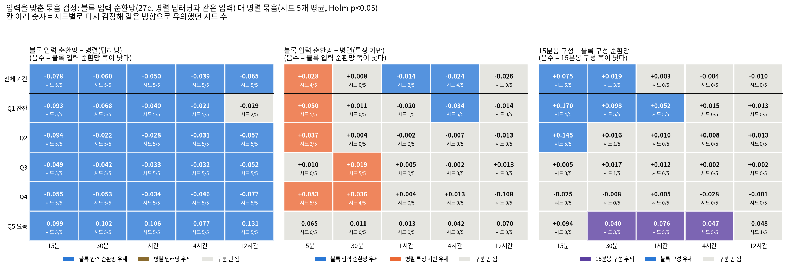
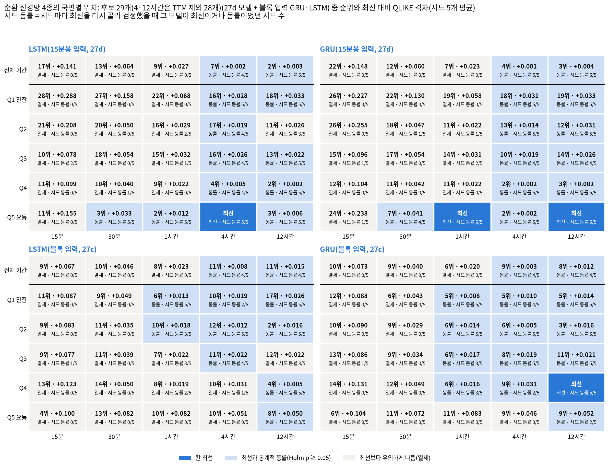
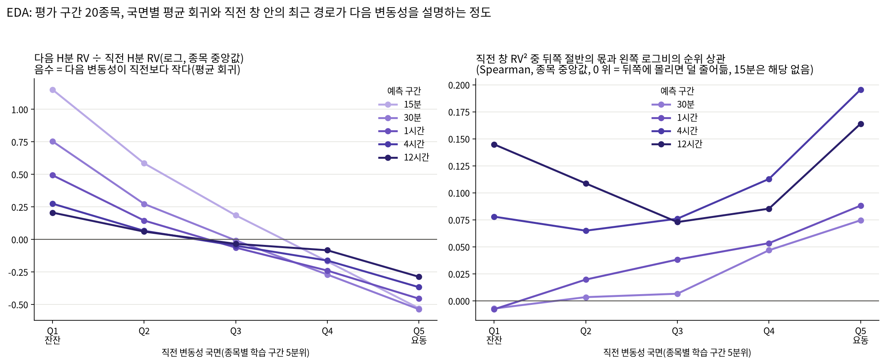

# 27e번: 변동성 국면별 결과의 입력 통제 점검(시드 5개)

### 0. 이번 회차 실제 분석 범위 ⚠

- **연구 대상(모집단)**: 상위 20종목 (아래 1절 목록)
- **이번 회차 실제 분석**: 대상 전체 20종목 ✅

## 분석 조건 (표준 헤더)

> 이 보고서만 읽어도 데이터 조건을 파악할 수 있도록, 매 회차 동일 항목을 싣는다(AGENTS.md 2.9g).

### 1. 데이터 출처·형식

- **DB / 테이블**: `data/upbit_data_20261005.db` (DuckDB) / `upbit_krw_candle` · 기간 창 2023-10-06 00:00:00 ~ 2026-10-05 20:45:00(끝 미포함)
- **봉 간격**: 15분봉 (하루 96봉)
- **원본 컬럼**: timestamp, open, high, low, close, volume, value
- **분석 종목 20개** — 이력 90,000봉(약 2.5년) 이상 종목 중 선정:

| # | 종목 | 선정 근거 | 봉 수 | 기간 | 표준편차 | 왜도 | 초과첨도 |
| ---: | :--- | :--- | ---: | :--- | ---: | ---: | ---: |
| 1 | KRW-AERGO | - | 95,289 | 2023-10-06~2026-07-18 | 0.007397 | 1.0272 | 80.88 |
| 2 | KRW-AQT | - | 93,269 | 2023-10-06~2026-07-18 | 0.007682 | 0.6870 | 168.97 |
| 3 | KRW-ARDR | - | 100,692 | 2023-10-06~2026-10-05 | 0.007661 | 1.6591 | 115.44 |
| 4 | KRW-ARK | - | 100,337 | 2023-10-06~2026-10-05 | 0.007291 | -0.6344 | 301.82 |
| 5 | KRW-BOUNTY | - | 94,720 | 2023-10-06~2026-10-05 | 0.007563 | 2.0739 | 137.71 |
| 6 | KRW-BTC | - | 104,960 | 2023-10-06~2026-10-05 | 0.002395 | -0.0149 | 105.04 |
| 7 | KRW-BTT | - | 104,118 | 2023-10-06~2026-10-05 | 0.027805 | 0.0090 | 29.22 |
| 8 | KRW-CBK | - | 96,803 | 2023-10-06~2026-10-05 | 0.007121 | 1.2697 | 205.42 |
| 9 | KRW-DOGE | - | 104,957 | 2023-10-06~2026-10-05 | 0.005761 | -0.1569 | 45.38 |
| 10 | KRW-ETC | - | 104,843 | 2023-10-06~2026-10-05 | 0.004447 | -2.2874 | 669.91 |
| 11 | KRW-ETH | - | 104,960 | 2023-10-06~2026-10-05 | 0.003418 | -0.8769 | 466.00 |
| 12 | KRW-MOC | - | 95,087 | 2023-10-06~2026-10-05 | 0.007382 | 1.3674 | 258.59 |
| 13 | KRW-SEI | - | 104,728 | 2023-10-06~2026-10-05 | 0.006328 | -0.2460 | 63.22 |
| 14 | KRW-SHIB | - | 104,943 | 2023-10-06~2026-10-05 | 0.005728 | 0.2729 | 58.16 |
| 15 | KRW-SOL | - | 104,958 | 2023-10-06~2026-10-05 | 0.004497 | 0.1954 | 27.80 |
| 16 | KRW-STRAX | - | 101,302 | 2023-10-06~2026-10-05 | 0.007742 | 1.8372 | 85.75 |
| 17 | KRW-SUI | - | 104,943 | 2023-10-06~2026-10-05 | 0.005967 | -1.0017 | 334.16 |
| 18 | KRW-TOKAMAK | - | 98,367 | 2023-10-06~2026-10-05 | 0.007254 | 1.8933 | 219.24 |
| 19 | KRW-XLM | - | 104,903 | 2023-10-06~2026-10-05 | 0.005160 | -0.1593 | 94.39 |
| 20 | KRW-XRP | - | 104,959 | 2023-10-06~2026-10-05 | 0.004173 | -0.4065 | 155.32 |

### 2. 수집 기간·규모·품질 (대표 종목 KRW-BTC)

- **기간**: 2023-10-06 00:00 ~ 2026-10-05 20:30
- **총 봉 수**: 104,960개 (약 3.00년)
- **연속성**: 15분이 아닌 간격 14개 (0.0133%) — 코인은 24시간 거래라 장 마감·주말 갭이 없다
- **결측**: 0개

### 3. 학습/검증 분할

- **방식**: 시간순 분할(셔플 없음) — 미래 정보 누설 방지
- **비율**: train 70% / validation 30%
- **train**: 2023-10-06 00:00 ~ 2025-11-10 23:45 (73,446봉, 약 765일)
- **validation**: 2025-11-11 00:00 ~ 2026-10-05 20:30 (31,514봉, 약 328일)
- 스케일러·모델 파라미터는 **train 구간에서만** 적합한다.

### 4. 기본 전처리 파이프라인과 가정

```
원본 close (KRW)
  → 로그 변환 log(close)        [스케일 안정화. 여전히 비정상: 단위근]
  → 1차 차분 r = Δlog(close)    [★ 여기서 정상성 확보 — 분석의 출발점]
  → (회차별 추가 처리)
  → 모델 적합
```

- **왜 차분하는가**: 로그가격은 단위근이 있어 비정상(ADF p=0.19)이고, 1차 차분하면 정상이 된다(ADF p=0.000). 정상성은 로그가 아니라 **차분**에서 온다.
- **예측 대상**: 수익률의 부호(방향)가 아니라 **크기(변동성)**. 방향은 자기상관이 0에 가까워 예측이 어렵고, 크기는 장기기억이 있어 예측 가능하다.

### 5. 기초통계량과 데이터 특성 (이전 EDA 확인 사항)

- **조건부 이분산**: ARCH-LM p=0.000 → 변동성이 시간에 따라 변한다(GARCH 계열 사용 근거)
- **장기기억**: |수익률| 자기상관이 하루(96봉) 뒤에도 0.12로 완만히 감소
- **두꺼운 꼬리**: 초과첨도 107 (정규분포는 0). 좌우 대칭(왜도 0.004)이나 양쪽 꼬리가 모두 두껍다. 4σ 초과가 정규 대비 약 100배, 6σ는 약 87만배 빈발
- **선형성 기각**: RESET·BDS 검정 p=0.000 → 선형 모델을 쓸 근거가 없다(비선형·커널 계열 필요)
- **방향 무예측성**: 수익률 자기상관 ≈ 0

### 6. 이번 회차에 적용한 변환

| 처리 | 적용 이유 |
| :--- | :--- |
| 15분 시간 격자 복원·점검 구간 제외·로그수익률 | 26c와 같다. 업비트는 무체결 구간에 캔들을 만들지 않고, 거래소 전체 중단 시각은 보간하지 않는다 |
| 타깃 = 다음 H분 실현변동성(RV), 손실 QLIKE | 26c와 같다. 가격 정지(RV=0)는 두 부분 모형(정지 확률 × 크기)으로 처리 |
| 변동성 국면 = 직전 H분 RV의 종목별 학습 구간 5분위 | 예측 시점에 아는 값으로 미리 나눈다(사후 실현 RV 분할은 예측자의 딜레마) |
| 시드 5개 손실 평균 | 학습 시드로 흔들리는 15종은 시드별 예측의 손실을 평균, 결정론 모델은 시드와 무관 |
| 블록 입력 GRU·LSTM(27c 예측 재사용) | 병렬 딥러닝과 같은 H분 블록 로그 RV 입력·겹치지 않는 블록 표본으로 학습한 순환망. 재학습 없음 |
| 국면별 EDA: 다음/직전 RV 로그비, 직전 창 뒤쪽 절반 몫 | 요동 국면에서 창 안 경로 정보가 중요한지 보는 기술 통계(3절) |


27번·27c의 저장된 평가 예측(시드 0~4)만 읽고 재학습하지 않았다.

## 0. 이 회차가 한 것과 이유

27d는 요동 국면(Q5)의 1시간·4시간·12시간 최선이 순환 신경망이고, 순환 신경망 묶음이 병렬 딥러닝 묶음보다 요동 국면에서 유의하게 낫다고 보고했다. 그러나 27d의 GRU·LSTM은 **15분봉 96개의 (수익률, 절대수익률)** 을 읽고 15분마다 겹치는 표본으로 학습했으며, 병렬 딥러닝은 **H분 블록 로그 RV 이력**을 겹치지 않는 블록 표본으로 학습했다. 27c는 GRU·LSTM에 병렬 딥러닝과 같은 블록 입력·표본을 주어 이 차이를 전체 기간에서만 통제했다. 이 회차는 27c의 블록 입력 GRU·LSTM을 27d와 같은 국면(직전 H분 RV의 종목별 학습 구간 5분위)으로 나눠, 27d의 국면별 결론이 입력 차이 때문인지 확인한다.

- **손실·국면·검정**: 27d와 같다(QLIKE, 시드별 손실의 평균, 직전 RV 학습 5분위, DM·Newey-West HAC·Holm).
- **게이트**: 27c 시드 0~4 예측 파일이 모두 있고, 100칸 모두 평가 시각·실제값이 27번과 같으며, 27d의 '순환 신경망 − 병렬(딥러닝)' 묶음 평균차를 같은 코드 경로로 재현해야(최대차 9e-17) 결과를 만든다. 이번 실행은 모두 통과했다.
- **남는 한계**: 블록 입력 순환망과 병렬 딥러닝도 학습 절차(학습률 탐색·검증 구간·재적합)는 맞추지 않았다(27c와 같음). iTransformer·S-Mamba는 블록 수익률 변수가 하나 더 있다.

## 1. 입력을 맞춘 묶음 검정



**읽는 법**: 세 비교마다 행은 범위(전체 기간, 국면 Q1~Q5), 열은 예측 구간이다. 숫자는 묶음 평균 QLIKE 차(A − B)로 음수면 A가 낫다. 색칠한 칸은 Holm 보정 후 유의(p < 0.05), 회색은 구분 안 됨이다. "시드 k/5"는 시드마다 다시 검정해 같은 방향으로 유의했던 시드 수다.

### 블록 입력 순환망 − 병렬(딥러닝)

비교 집단: A = GRU(블록), LSTM(블록) / B = 15종(TTM은 4·12시간 평가 제외라 그 구간은 14종). H0: 두 묶음 평균의 기대 QLIKE가 같다. H1: 같지 않다(양측). 비교마다 30칸에 Holm 보정.

| 범위 | 15분 | 30분 | 1시간 | 4시간 | 12시간 |
| :--- | :--- | :--- | :--- | :--- | :--- |
| 전체 기간 | 블록 입력 순환망 우세 -0.078 (p=1.4e-71, 시드 5/5) | 블록 입력 순환망 우세 -0.060 (p=3.2e-64, 시드 5/5) | 블록 입력 순환망 우세 -0.050 (p=8.2e-42, 시드 5/5) | 블록 입력 순환망 우세 -0.039 (p=8.1e-21, 시드 5/5) | 블록 입력 순환망 우세 -0.065 (p=6.2e-09, 시드 5/5) |
| Q1 | 블록 입력 순환망 우세 -0.093 (p=5.2e-78, 시드 5/5) | 블록 입력 순환망 우세 -0.068 (p=4.4e-52, 시드 5/5) | 블록 입력 순환망 우세 -0.040 (p=9.6e-15, 시드 5/5) | 블록 입력 순환망 우세 -0.021 (p=0.00025, 시드 5/5) | 구분 안 됨 -0.029 (p=0.063, 시드 2/5) |
| Q2 | 블록 입력 순환망 우세 -0.094 (p=2.6e-63, 시드 5/5) | 블록 입력 순환망 우세 -0.022 (p=9.8e-05, 시드 5/5) | 블록 입력 순환망 우세 -0.028 (p=1.3e-16, 시드 5/5) | 블록 입력 순환망 우세 -0.031 (p=1.4e-16, 시드 5/5) | 블록 입력 순환망 우세 -0.057 (p=0.00012, 시드 5/5) |
| Q3 | 블록 입력 순환망 우세 -0.049 (p=0.006, 시드 5/5) | 블록 입력 순환망 우세 -0.042 (p=9.3e-35, 시드 5/5) | 블록 입력 순환망 우세 -0.033 (p=3.2e-09, 시드 5/5) | 블록 입력 순환망 우세 -0.032 (p=4.9e-05, 시드 5/5) | 블록 입력 순환망 우세 -0.052 (p=2.8e-07, 시드 5/5) |
| Q4 | 블록 입력 순환망 우세 -0.055 (p=1.4e-15, 시드 5/5) | 블록 입력 순환망 우세 -0.053 (p=1.8e-47, 시드 5/5) | 블록 입력 순환망 우세 -0.034 (p=5.2e-13, 시드 5/5) | 블록 입력 순환망 우세 -0.046 (p=3.6e-14, 시드 5/5) | 블록 입력 순환망 우세 -0.077 (p=9.4e-05, 시드 5/5) |
| Q5 | 블록 입력 순환망 우세 -0.099 (p=1.2e-17, 시드 5/5) | 블록 입력 순환망 우세 -0.102 (p=2.8e-19, 시드 5/5) | 블록 입력 순환망 우세 -0.106 (p=2.2e-12, 시드 5/5) | 블록 입력 순환망 우세 -0.077 (p=2e-13, 시드 5/5) | 블록 입력 순환망 우세 -0.131 (p=2.2e-09, 시드 5/5) |

**해석**: 30칸 중 블록 입력 순환망 우세 29칸, 병렬 딥러닝 우세 0칸, 구분 안 됨 1칸이다. 요동 국면(Q5) 다섯 구간의 판정은 15분 블록 입력 순환망 우세(-0.099), 30분 블록 입력 순환망 우세(-0.102), 1시간 블록 입력 순환망 우세(-0.106), 4시간 블록 입력 순환망 우세(-0.077), 12시간 블록 입력 순환망 우세(-0.131)이다. 유의 칸은 H0를 기각하고 해당 쪽 묶음의 기대 손실이 작다는 뜻이며, 구분 안 됨은 차이의 증거가 부족하다는 뜻이다(같다는 증명은 아니다).

### 블록 입력 순환망 − 병렬(특징 기반)

비교 집단: A = GRU(블록), LSTM(블록) / B = LGBM, XGB, HGB, G+LGBM, Nys, KRR, SVR. H0: 두 묶음 평균의 기대 QLIKE가 같다. H1: 같지 않다(양측). 비교마다 30칸에 Holm 보정.

| 범위 | 15분 | 30분 | 1시간 | 4시간 | 12시간 |
| :--- | :--- | :--- | :--- | :--- | :--- |
| 전체 기간 | 병렬 특징 기반 우세 +0.028 (p=0.012, 시드 4/5) | 구분 안 됨 +0.008 (p=1.000, 시드 0/5) | 블록 입력 순환망 우세 -0.014 (p=0.035, 시드 2/5) | 블록 입력 순환망 우세 -0.024 (p=0.008, 시드 4/5) | 구분 안 됨 -0.026 (p=0.131, 시드 0/5) |
| Q1 | 병렬 특징 기반 우세 +0.050 (p=3e-07, 시드 5/5) | 구분 안 됨 +0.011 (p=1.000, 시드 0/5) | 구분 안 됨 -0.020 (p=0.266, 시드 1/5) | 블록 입력 순환망 우세 -0.034 (p=0.00066, 시드 5/5) | 구분 안 됨 -0.014 (p=1.000, 시드 0/5) |
| Q2 | 병렬 특징 기반 우세 +0.037 (p=0.004, 시드 3/5) | 구분 안 됨 +0.004 (p=1.000, 시드 0/5) | 구분 안 됨 -0.002 (p=1.000, 시드 0/5) | 구분 안 됨 -0.007 (p=1.000, 시드 0/5) | 구분 안 됨 -0.013 (p=1.000, 시드 0/5) |
| Q3 | 구분 안 됨 +0.010 (p=1.000, 시드 0/5) | 병렬 특징 기반 우세 +0.019 (p=0.001, 시드 5/5) | 구분 안 됨 +0.005 (p=1.000, 시드 0/5) | 구분 안 됨 -0.002 (p=1.000, 시드 0/5) | 구분 안 됨 +0.013 (p=1.000, 시드 0/5) |
| Q4 | 병렬 특징 기반 우세 +0.083 (p=3.1e-20, 시드 5/5) | 병렬 특징 기반 우세 +0.036 (p=0.004, 시드 4/5) | 구분 안 됨 +0.004 (p=1.000, 시드 0/5) | 구분 안 됨 +0.013 (p=1.000, 시드 0/5) | 구분 안 됨 -0.108 (p=1.000, 시드 0/5) |
| Q5 | 구분 안 됨 -0.065 (p=1.000, 시드 0/5) | 구분 안 됨 -0.011 (p=1.000, 시드 0/5) | 구분 안 됨 -0.013 (p=1.000, 시드 0/5) | 구분 안 됨 -0.042 (p=0.137, 시드 0/5) | 구분 안 됨 -0.070 (p=0.439, 시드 0/5) |

**해석**: 30칸 중 블록 입력 순환망 우세 3칸, 병렬 특징 기반 우세 6칸, 구분 안 됨 21칸이다. 요동 국면(Q5) 다섯 구간의 판정은 15분 구분 안 됨(-0.065), 30분 구분 안 됨(-0.011), 1시간 구분 안 됨(-0.013), 4시간 구분 안 됨(-0.042), 12시간 구분 안 됨(-0.070)이다. 유의 칸은 H0를 기각하고 해당 쪽 묶음의 기대 손실이 작다는 뜻이며, 구분 안 됨은 차이의 증거가 부족하다는 뜻이다(같다는 증명은 아니다).

### 15분봉 구성 − 블록 구성 순환망

비교 집단: A = GRU, LSTM / B = GRU(블록), LSTM(블록). H0: 두 묶음 평균의 기대 QLIKE가 같다. H1: 같지 않다(양측). 비교마다 30칸에 Holm 보정.

| 범위 | 15분 | 30분 | 1시간 | 4시간 | 12시간 |
| :--- | :--- | :--- | :--- | :--- | :--- |
| 전체 기간 | 블록 구성 우세 +0.075 (p=4.1e-07, 시드 5/5) | 블록 구성 우세 +0.019 (p=0.00053, 시드 3/5) | 구분 안 됨 +0.003 (p=1.000, 시드 0/5) | 구분 안 됨 -0.004 (p=1.000, 시드 0/5) | 구분 안 됨 -0.010 (p=1.000, 시드 0/5) |
| Q1 | 블록 구성 우세 +0.170 (p=0.005, 시드 4/5) | 블록 구성 우세 +0.098 (p=0.005, 시드 5/5) | 블록 구성 우세 +0.052 (p=2.1e-05, 시드 5/5) | 구분 안 됨 +0.015 (p=1.000, 시드 0/5) | 구분 안 됨 +0.013 (p=1.000, 시드 0/5) |
| Q2 | 블록 구성 우세 +0.145 (p=3.6e-08, 시드 5/5) | 구분 안 됨 +0.016 (p=0.130, 시드 1/5) | 구분 안 됨 +0.010 (p=0.660, 시드 0/5) | 구분 안 됨 +0.008 (p=1.000, 시드 0/5) | 구분 안 됨 +0.013 (p=1.000, 시드 0/5) |
| Q3 | 구분 안 됨 +0.005 (p=1.000, 시드 0/5) | 구분 안 됨 +0.017 (p=0.305, 시드 1/5) | 구분 안 됨 +0.012 (p=0.880, 시드 0/5) | 구분 안 됨 +0.002 (p=1.000, 시드 0/5) | 구분 안 됨 +0.002 (p=1.000, 시드 0/5) |
| Q4 | 구분 안 됨 -0.025 (p=1.000, 시드 0/5) | 구분 안 됨 -0.008 (p=1.000, 시드 0/5) | 구분 안 됨 +0.005 (p=1.000, 시드 0/5) | 구분 안 됨 -0.028 (p=0.083, 시드 0/5) | 구분 안 됨 -0.001 (p=1.000, 시드 0/5) |
| Q5 | 구분 안 됨 +0.094 (p=1.000, 시드 0/5) | 15분봉 구성 우세 -0.040 (p=0.0007, 시드 3/5) | 15분봉 구성 우세 -0.076 (p=0.002, 시드 5/5) | 15분봉 구성 우세 -0.047 (p=7.8e-07, 시드 5/5) | 구분 안 됨 -0.048 (p=0.162, 시드 1/5) |

**해석**: 30칸 중 15분봉 구성 우세 3칸, 블록 구성 우세 6칸, 구분 안 됨 21칸이다. 요동 국면(Q5) 다섯 구간의 판정은 15분 구분 안 됨(+0.094), 30분 15분봉 구성 우세(-0.040), 1시간 15분봉 구성 우세(-0.076), 4시간 15분봉 구성 우세(-0.047), 12시간 구분 안 됨(-0.048)이다. 유의 칸은 H0를 기각하고 해당 쪽 묶음의 기대 손실이 작다는 뜻이며, 구분 안 됨은 차이의 증거가 부족하다는 뜻이다(같다는 증명은 아니다).

## 2. 순환 신경망 4종의 국면별 위치(블록 입력 GRU·LSTM을 후보에 더해 국면 최선 재검정)



**읽는 법**: 27d의 후보에 블록 입력 GRU·LSTM을 더한 29개(4·12시간은 TTM 제외 28개)(naive 제외)로 칸마다 최선을 다시 고르고, 최선 대 나머지 각 모델의 DM 검정에 Holm 보정을 건다(27d 2절과 같은 정의, 후보가 늘어 Holm 보정 대상이 27d보다 2개 많다). H0: 최선과 기대 QLIKE가 같다. 칸 글씨는 순위와 최선 대비 격차, 진한 파랑은 칸 최선, 연한 파랑은 최선과 통계적 동률, 회색은 최선보다 유의하게 나쁜(열세) 칸이다. 최선·순위·격차·검정은 모두 같은 가중(시각마다 그 국면에 든 종목 평균을 낸 뒤 시각 평균)으로 계산한다.

- **최선이 바뀐 칸**: 12시간 Q4: LSTM → GRU-block.

| 예측 구간 | 국면 | 최선 | LSTM(15분봉 입력, 27d) | GRU(15분봉 입력, 27d) | LSTM(블록 입력, 27c) | GRU(블록 입력, 27c) |
| :--- | :--- | :--- | :--- | :--- | :--- | :--- |
| 15분 | 전체 기간 | MS-GARCH | 17위 열세 +0.141 (p=1.4e-76, 시드 동률 0/5) | 22위 열세 +0.148 (p=6.2e-42, 시드 동률 0/5) | 9위 열세 +0.067 (p=1.1e-15, 시드 동률 0/5) | 10위 열세 +0.073 (p=1.5e-17, 시드 동률 0/5) |
| 15분 | Q1 | LightGBM | 28위 열세 +0.288 (p=6.1e-15, 시드 동률 0/5) | 26위 열세 +0.227 (p=2.4e-07, 시드 동률 0/5) | 11위 열세 +0.087 (p=2.3e-12, 시드 동률 0/5) | 12위 열세 +0.088 (p=2.2e-12, 시드 동률 0/5) |
| 15분 | Q2 | GARCH+LightGBM | 21위 열세 +0.208 (p=9.4e-27, 시드 동률 0/5) | 26위 열세 +0.255 (p=1.7e-26, 시드 동률 0/5) | 9위 열세 +0.083 (p=1e-17, 시드 동률 0/5) | 10위 열세 +0.090 (p=9.8e-20, 시드 동률 0/5) |
| 15분 | Q3 | TAR-GARCH | 10위 열세 +0.078 (p=0.00011, 시드 동률 2/5) | 15위 열세 +0.096 (p=0.00021, 시드 동률 1/5) | 9위 열세 +0.077 (p=0.017, 시드 동률 1/5) | 13위 열세 +0.086 (p=0.017, 시드 동률 1/5) |
| 15분 | Q4 | Nystroem+Ridge | 11위 열세 +0.099 (p=2.7e-09, 시드 동률 0/5) | 12위 열세 +0.104 (p=7.4e-09, 시드 동률 0/5) | 13위 열세 +0.123 (p=2.5e-28, 시드 동률 0/5) | 14위 열세 +0.131 (p=2.1e-29, 시드 동률 0/5) |
| 15분 | Q5 | Nystroem+Ridge | 11위 열세 +0.155 (p=0.001, 시드 동률 0/5) | 24위 열세 +0.238 (p=0.005, 시드 동률 1/5) | 4위 열세 +0.100 (p=1.3e-05, 시드 동률 0/5) | 6위 열세 +0.104 (p=2.5e-06, 시드 동률 0/5) |
| 30분 | 전체 기간 | HistGBM | 13위 열세 +0.064 (p=8.2e-46, 시드 동률 0/5) | 12위 열세 +0.060 (p=1e-33, 시드 동률 0/5) | 10위 열세 +0.046 (p=3.1e-28, 시드 동률 0/5) | 9위 열세 +0.040 (p=1.3e-26, 시드 동률 0/5) |
| 30분 | Q1 | LightGBM | 27위 열세 +0.158 (p=5.4e-11, 시드 동률 0/5) | 22위 열세 +0.130 (p=4e-13, 시드 동률 0/5) | 9위 열세 +0.049 (p=1.5e-08, 시드 동률 0/5) | 6위 열세 +0.043 (p=7e-05, 시드 동률 0/5) |
| 30분 | Q2 | HistGBM | 20위 열세 +0.050 (p=6.2e-08, 시드 동률 0/5) | 18위 열세 +0.047 (p=3.7e-09, 시드 동률 1/5) | 11위 열세 +0.035 (p=1.4e-06, 시드 동률 0/5) | 9위 열세 +0.029 (p=0.00018, 시드 동률 0/5) |
| 30분 | Q3 | GARCH+LightGBM | 18위 열세 +0.054 (p=6.3e-19, 시드 동률 0/5) | 17위 열세 +0.054 (p=7.9e-18, 시드 동률 0/5) | 11위 열세 +0.039 (p=1.6e-15, 시드 동률 0/5) | 9위 열세 +0.034 (p=2.2e-12, 시드 동률 0/5) |
| 30분 | Q4 | GARCH+LightGBM | 10위 열세 +0.040 (p=6.3e-10, 시드 동률 1/5) | 11위 열세 +0.042 (p=6.7e-05, 시드 동률 0/5) | 14위 열세 +0.050 (p=1e-08, 시드 동률 0/5) | 12위 열세 +0.049 (p=2.7e-09, 시드 동률 0/5) |
| 30분 | Q5 | Nystroem+Ridge | 3위 동률 +0.033 (p=0.083, 시드 동률 5/5) | 7위 동률 +0.041 (p=0.064, 시드 동률 4/5) | 13위 열세 +0.082 (p=8e-07, 시드 동률 0/5) | 11위 열세 +0.072 (p=1.3e-07, 시드 동률 0/5) |
| 1시간 | 전체 기간 | GARCH+LightGBM | 9위 열세 +0.027 (p=2.3e-14, 시드 동률 0/5) | 7위 열세 +0.023 (p=2.8e-12, 시드 동률 0/5) | 8위 열세 +0.023 (p=1.3e-11, 시드 동률 0/5) | 6위 열세 +0.020 (p=2.1e-08, 시드 동률 0/5) |
| 1시간 | Q1 | GARCH+LightGBM | 22위 열세 +0.068 (p=8.9e-12, 시드 동률 0/5) | 19위 열세 +0.058 (p=1e-11, 시드 동률 0/5) | 6위 동률 +0.013 (p=0.368, 시드 동률 5/5) | 5위 동률 +0.008 (p=0.540, 시드 동률 5/5) |
| 1시간 | Q2 | LightGBM | 16위 열세 +0.029 (p=0.005, 시드 동률 2/5) | 11위 열세 +0.022 (p=0.00023, 시드 동률 1/5) | 10위 동률 +0.018 (p=0.159, 시드 동률 3/5) | 6위 동률 +0.014 (p=0.520, 시드 동률 5/5) |
| 1시간 | Q3 | XGBoost | 15위 열세 +0.032 (p=0.025, 시드 동률 1/5) | 14위 열세 +0.031 (p=0.009, 시드 동률 2/5) | 7위 열세 +0.022 (p=0.025, 시드 동률 3/5) | 6위 동률 +0.017 (p=0.054, 시드 동률 3/5) |
| 1시간 | Q4 | Nystroem+Ridge | 9위 열세 +0.022 (p=5.5e-05, 시드 동률 0/5) | 11위 열세 +0.022 (p=8.2e-05, 시드 동률 0/5) | 8위 열세 +0.019 (p=0.014, 시드 동률 2/5) | 6위 동률 +0.016 (p=0.065, 시드 동률 3/5) |
| 1시간 | Q5 | GRU | 2위 동률 +0.012 (p=0.746, 시드 동률 5/5) | 1위 최선 +0.000 (p=1.000, 시드 동률 5/5) | 10위 열세 +0.082 (p=0.0009, 시드 동률 0/5) | 11위 열세 +0.083 (p=0.002, 시드 동률 0/5) |
| 4시간 | 전체 기간 | LightGBM | 7위 동률 +0.002 (p=1.000, 시드 동률 4/5) | 4위 동률 +0.001 (p=1.000, 시드 동률 5/5) | 11위 동률 +0.008 (p=0.982, 시드 동률 4/5) | 9위 동률 +0.003 (p=1.000, 시드 동률 4/5) |
| 4시간 | Q1 | TimesFM | 16위 동률 +0.028 (p=0.339, 시드 동률 5/5) | 18위 동률 +0.031 (p=0.477, 시드 동률 5/5) | 10위 동률 +0.019 (p=0.073, 시드 동률 2/5) | 5위 동률 +0.010 (p=0.477, 시드 동률 4/5) |
| 4시간 | Q2 | HistGBM | 17위 동률 +0.019 (p=0.521, 시드 동률 4/5) | 13위 동률 +0.014 (p=1.000, 시드 동률 5/5) | 12위 동률 +0.012 (p=1.000, 시드 동률 5/5) | 6위 동률 +0.005 (p=1.000, 시드 동률 5/5) |
| 4시간 | Q3 | Nystroem+Ridge | 16위 동률 +0.026 (p=0.076, 시드 동률 4/5) | 10위 동률 +0.019 (p=0.264, 시드 동률 4/5) | 11위 동률 +0.022 (p=0.447, 시드 동률 4/5) | 8위 동률 +0.019 (p=0.697, 시드 동률 5/5) |
| 4시간 | Q4 | XGBoost | 4위 동률 +0.005 (p=1.000, 시드 동률 4/5) | 2위 동률 +0.002 (p=1.000, 시드 동률 5/5) | 10위 열세 +0.031 (p=0.048, 시드 동률 1/5) | 9위 동률 +0.031 (p=0.065, 시드 동률 2/5) |
| 4시간 | Q5 | LSTM | 1위 최선 +0.000 (p=1.000, 시드 동률 5/5) | 2위 동률 +0.002 (p=0.546, 시드 동률 5/5) | 10위 열세 +0.051 (p=1.8e-07, 시드 동률 0/5) | 9위 열세 +0.046 (p=7.5e-07, 시드 동률 0/5) |
| 12시간 | 전체 기간 | Nystroem+Ridge | 2위 동률 +0.003 (p=1.000, 시드 동률 5/5) | 3위 동률 +0.004 (p=1.000, 시드 동률 5/5) | 11위 동률 +0.015 (p=0.433, 시드 동률 4/5) | 8위 동률 +0.012 (p=0.713, 시드 동률 4/5) |
| 12시간 | Q1 | PatchTST | 18위 동률 +0.033 (p=1.000, 시드 동률 5/5) | 19위 동률 +0.033 (p=1.000, 시드 동률 5/5) | 17위 동률 +0.026 (p=1.000, 시드 동률 5/5) | 5위 동률 +0.014 (p=1.000, 시드 동률 5/5) |
| 12시간 | Q2 | Nystroem+Ridge | 11위 열세 +0.026 (p=0.048, 시드 동률 3/5) | 12위 동률 +0.031 (p=0.368, 시드 동률 5/5) | 2위 동률 +0.016 (p=1.000, 시드 동률 5/5) | 3위 동률 +0.016 (p=1.000, 시드 동률 5/5) |
| 12시간 | Q3 | Nystroem+Ridge | 13위 동률 +0.022 (p=0.137, 시드 동률 5/5) | 14위 동률 +0.026 (p=0.137, 시드 동률 4/5) | 12위 열세 +0.022 (p=0.035, 시드 동률 3/5) | 11위 동률 +0.021 (p=0.142, 시드 동률 5/5) |
| 12시간 | Q4 | GRU-block | 2위 동률 +0.002 (p=1.000, 시드 동률 5/5) | 3위 동률 +0.002 (p=1.000, 시드 동률 5/5) | 4위 동률 +0.005 (p=0.801, 시드 동률 5/5) | 1위 최선 +0.000 (p=1.000, 시드 동률 5/5) |
| 12시간 | Q5 | GRU | 3위 동률 +0.006 (p=0.703, 시드 동률 5/5) | 1위 최선 +0.000 (p=1.000, 시드 동률 5/5) | 8위 동률 +0.050 (p=0.050, 시드 동률 3/5) | 9위 동률 +0.052 (p=0.050, 시드 동률 2/5) |

**해석(요동 국면 Q5)**: 15분봉 입력 GRU·LSTM 중 하나가 최선이거나 최선과 동률인 구간은 30분, 1시간, 4시간, 12시간이고, 블록 입력 GRU·LSTM 중 하나가 최선과 동률인 구간은 12시간이다. 블록 입력 순환망의 Q5 순위는 15분 4위, 30분 11위, 1시간 10위, 4시간 9위, 12시간 8위다.

## 3. EDA 근거: 요동 국면에서 직전 창 안의 최근 경로가 더 중요한가



**무엇을 보는가**: 2절에서 요동 국면 1시간~12시간 최선은 15분봉을 차례로 읽는 순환 신경망이었고, 같은 순환망이라도 H분 블록 RV만 읽으면 순위가 내려갔다. 그렇다면 요동 국면에서는 직전 H분을 한 숫자(블록 RV)로 요약할 때 잃는 정보, 곧 창 안에서 변동성이 어떻게 움직였는지가 다음 변동성과 관련이 있어야 한다. 평가 구간의 예측 시점마다 두 값을 만든다. y = log(다음 H분 RV ÷ 직전 H분 RV)는 다음 변동성이 직전 수준에서 얼마나 바뀌는지, z = 직전 창 RV² 중 뒤쪽 절반이 차지하는 몫(0~1)은 직전 창 안에서 변동성이 뒤쪽에 몰렸는지(커지는 중) 앞쪽에 몰렸는지(잦아드는 중)다. z는 블록 RV 하나로는 알 수 없고 15분봉 경로를 읽어야 알 수 있다. 한쪽 절반이 가격 정지(0)인 창도 z가 정의되므로 국면마다 표본이 따로 골라지지 않는다. 민감도로 양쪽 절반 모두 거래한 창만 쓴 로그비 정의도 함께 적는다. 15분은 직전 창이 15분봉 1개라 z를 만들 수 없다(해당 없음). 게이트: 15분 격자에서 다시 만든 직전 RV가 저장된 naive 입력과 모든 시점에서 같아야 한다(통과).

**검정**: 비교 집단은 종목(최대 20개)이다. 종목마다 국면별 Spearman 순위 상관 ρ(y, z)를 구한다. (1) 국면별 부호 검정 — H0: ρ가 양수인 종목과 음수인 종목이 반반이다(창 안 경로가 다음 변동성 변화와 관계없다), H1: 반반이 아니다. 구간 × 국면 20칸에 Holm 보정. (2) Q5 대 Q1 — 같은 종목의 ρ(Q5) − ρ(Q1)에 윌콕슨 부호순위 검정, H0: 차이의 중앙값이 0이다, H1: 0이 아니다. 구간 4개에 Holm 보정. 시점 간 자기상관 때문에 시점 대신 종목을 단위로 썼다. 다만 종목들은 같은 기간의 같은 시장 충격을 겪어 완전히 독립이 아니므로 p값은 근사이고 다소 낙관적일 수 있다.

| 예측 구간 | 국면 | 평균 회귀: log 비 중앙값(음수 종목/유효 종목) | 경로 상관 ρ 중앙값(양수 종목/유효 종목) | 부호 검정 Holm p | 민감도 ρ 중앙값(양쪽 거래 창, 종목 수, 사용 비율) |
| :--- | :--- | ---: | ---: | ---: | ---: |
| 15분 | Q1 | +1.151(0/6) | 해당 없음(15분은 창이 1봉) | 해당 없음(15분은 창이 1봉) | 해당 없음(15분은 창이 1봉) |
| 15분 | Q2 | +0.585(0/14) | 해당 없음(15분은 창이 1봉) | 해당 없음(15분은 창이 1봉) | 해당 없음(15분은 창이 1봉) |
| 15분 | Q3 | +0.185(7/20) | 해당 없음(15분은 창이 1봉) | 해당 없음(15분은 창이 1봉) | 해당 없음(15분은 창이 1봉) |
| 15분 | Q4 | -0.169(13/20) | 해당 없음(15분은 창이 1봉) | 해당 없음(15분은 창이 1봉) | 해당 없음(15분은 창이 1봉) |
| 15분 | Q5 | -0.529(20/20) | 해당 없음(15분은 창이 1봉) | 해당 없음(15분은 창이 1봉) | 해당 없음(15분은 창이 1봉) |
| 30분 | Q1 | +0.754(0/16) | -0.007(6/14) | 1.000 | +0.035(13종목, 38%) |
| 30분 | Q2 | +0.273(2/20) | +0.003(11/20) | 1.000 | +0.024(18종목, 50%) |
| 30분 | Q3 | -0.008(10/20) | +0.007(13/20) | 1.000 | +0.030(20종목, 61%) |
| 30분 | Q4 | -0.270(18/20) | +0.047(20/20) | 3.8e-05 | +0.057(20종목, 70%) |
| 30분 | Q5 | -0.537(20/20) | +0.075(19/20) | 0.0006 | +0.084(20종목, 83%) |
| 1시간 | Q1 | +0.493(0/20) | -0.008(8/20) | 1.000 | +0.033(18종목, 63%) |
| 1시간 | Q2 | +0.145(5/20) | +0.020(17/20) | 0.023 | +0.015(20종목, 81%) |
| 1시간 | Q3 | -0.063(15/20) | +0.038(18/20) | 0.005 | +0.032(20종목, 85%) |
| 1시간 | Q4 | -0.240(19/20) | +0.053(20/20) | 3.8e-05 | +0.058(20종목, 90%) |
| 1시간 | Q5 | -0.456(20/20) | +0.088(20/20) | 3.8e-05 | +0.092(20종목, 96%) |
| 4시간 | Q1 | +0.275(0/20) | +0.078(17/20) | 0.023 | +0.076(20종목, 97%) |
| 4시간 | Q2 | +0.066(2/20) | +0.065(15/20) | 0.207 | +0.055(20종목, 100%) |
| 4시간 | Q3 | -0.048(15/20) | +0.076(20/20) | 3.8e-05 | +0.072(20종목, 100%) |
| 4시간 | Q4 | -0.163(20/20) | +0.113(19/20) | 0.0006 | +0.113(20종목, 100%) |
| 4시간 | Q5 | -0.367(20/20) | +0.195(20/20) | 3.8e-05 | +0.194(20종목, 100%) |
| 12시간 | Q1 | +0.206(0/20) | +0.145(14/17) | 0.076 | +0.145(17종목, 100%) |
| 12시간 | Q2 | +0.060(4/20) | +0.109(17/19) | 0.007 | +0.109(19종목, 100%) |
| 12시간 | Q3 | -0.034(15/20) | +0.073(17/20) | 0.023 | +0.073(20종목, 100%) |
| 12시간 | Q4 | -0.084(19/20) | +0.085(18/20) | 0.005 | +0.085(20종목, 100%) |
| 12시간 | Q5 | -0.288(20/20) | +0.164(18/19) | 0.00099 | +0.164(19종목, 100%) |

| 예측 구간 | ρ(Q5) − ρ(Q1) 중앙값 | Q5가 큰 종목 | 윌콕슨 Holm p |
| :--- | ---: | ---: | ---: |
| 15분 | 해당 없음(15분은 창이 1봉) | 해당 없음 | 해당 없음 |
| 30분 | +0.085 | 11/14 | 0.049 |
| 1시간 | +0.089 | 20/20 | 7.6e-06 |
| 4시간 | +0.122 | 17/20 | 0.001 |
| 12시간 | -0.000 | 8/16 | 0.528 |

**해석**: (1) 평균 회귀: 잔잔한 국면(Q1)은 다음 변동성이 직전보다 커지고(log 비 중앙값 +0.21~+1.15), 요동 국면(Q5)은 작아진다(-0.54~-0.29). 국면을 직전 RV로 나눴으므로 이 방향은 평균으로의 회귀에서 예상되는 것이고, 모든 학습 모델이 배울 수 있는 성질이라 그 자체로 모델을 가르는 근거는 아니다. (2) 창 안 경로: ρ 중앙값은 30분~12시간 Q1에서 -0.008~+0.145이고, Q5에서는 +0.075~+0.195로 약하지만 모든 구간에서 양(+)이다. ρ가 가장 큰 국면이 Q5인 구간은 30분, 1시간, 4시간, 12시간이고(국면이 커질수록 단조롭게 커지지는 않는다), Q5가 Q1보다 유의하게 큰 구간은 30분, 1시간, 4시간, 구분 안 되는 구간은 12시간이다. ρ가 양수라는 것은 직전 창 뒤쪽에 변동성이 몰려 있으면 다음 변동성이 덜 줄어든다는 뜻이고, 이 정보는 블록 RV 하나에는 없다.

**알고리즘 특성과의 연결(해석이며 인과 식별은 아니다)**: 창 안 경로 정보는 15분봉을 받는 모델, 곧 15분봉 순환 신경망, 1·4·16봉 RV·지연 |r| 같은 다중 척도 특징을 쓰는 트리·커널, 15분 수익률을 재귀로 읽는 GARCH 3종이 받는다. H분 블록 RV 이력만 받는 병렬 딥러닝은 받지 못한다. 요동 국면 1시간~12시간에서 15분봉 순환 신경망이 최선이고 트리·커널이 그와 동률이며 병렬 딥러닝이 모두 열세라는 2절·27d 결과는 이 구분과 같은 방향이다. 그러나 반례도 있다. GARCH 3종은 같은 정보를 받고도 요동 국면 4·12시간에서 모두 열세이고, 경로를 보지 못하는 블록 입력 순환망은 요동 국면에서 트리·커널 묶음과 구분되지 않는다(평균차 15분 -0.065, 30분 -0.011, 1시간 -0.013, 4시간 -0.042, 12시간 -0.070, 모두 구분 안 됨). 따라서 경로 정보는 요동 국면 결과를 설명하는 한 요인일 뿐이고, 모델의 비선형 표현력과 학습 절차도 함께 작용한다.

**뒷받침 문헌(방향이 비슷한 관찰이며, 문헌은 주가지수의 일·월 단위 RV라 15분~12시간 암호화폐로 옮기는 것은 유추다)**: Corsi(2009)의 HAR는 변동성이 여러 시간 척도의 성분으로 움직이고 짧은 척도 성분이 따로 예측력을 갖는다고 보고했다. 이 연구의 15분봉 경로·다중 척도 특징이 그 짧은 척도 성분에 해당한다. Bollerslev·Patton·Quaedvlieg(2016)의 HARQ는 RV의 측정오차가 큰 시기(대개 고변동 시기)에는 과거 RV의 지속성을 낮춰 써야 예측이 좋아진다고 보고했다. 요동 국면에서 다음 변동성이 직전보다 작아진다는 (1)과 비슷한 방향의 관찰이다. Bucci(2020)는 실현 변동성 예측에서 LSTM 등 순환 신경망이 HAR 등 계량 모형과 경쟁하거나 더 낫다고 보고했다. 요동 국면의 순환 신경망 결과와 같은 방향이다.

## 4. 결론: 27d 국면 결과를 어떻게 써야 하는가

1. **순환 신경망 묶음 > 병렬 딥러닝 묶음은 입력을 맞춰도 남는다**: 블록 입력 순환망이 병렬 딥러닝보다 30칸 중 29칸에서 유의하게 낫고, 요동 국면 다섯 구간 중 5구간에서 유의하게 낫다. 따라서 27d의 이 묶음 결론은 입력 차이만으로 생긴 것이 아니다(학습 절차 차이는 남는다).
2. **요동 국면의 '최선' 자리는 15분봉 구성의 순환 신경망에만 해당한다**: 요동 국면에서 최선이 순환 신경망인 구간은 1시간 GRU, 4시간 LSTM, 12시간 GRU이고 모두 15분봉 96개를 읽는 구성이다. 블록 구성(27c) GRU·LSTM은 위 2절처럼 이 칸들에서 순위가 내려가고 1시간, 4시간에서는 최선보다 유의하게 나쁘다. 두 구성의 직접 비교(15분봉 구성 − 블록 구성) 판정은 요동 국면에서 15분 구분 안 됨(+0.094), 30분 15분봉 구성 우세(-0.040), 1시간 15분봉 구성 우세(-0.076), 4시간 15분봉 구성 우세(-0.047), 12시간 구분 안 됨(-0.048)다. 12시간은 직접 비교가 유의하지 않아 어느 구성이 나은지 증거가 부족하다. 두 구성은 입력 표현(15분봉 96개 대 H분 블록 96·96·96·60·30개, 곧 긴 구간에서는 보는 과거 길이까지 다름), 학습 표본(15분마다 겹침 대 겹치지 않는 블록), 배치 크기가 함께 다르므로, 이 차이를 '입력 표현만의 효과'로 식별할 수는 없다. 쓸 수 있는 말은 "요동 국면 최선은 15분봉을 차례로 읽는 구성의 순환 신경망이었다"까지다.
3. **포스터 문구**: "요동 국면은 순환 신경망이 최선"은 "15분봉을 읽는 순환 신경망이 손실이 가장 작았다(트리·커널과는 통계적으로 구분되지 않음)"로 쓰고, 순차 대 병렬 묶음 차이는 "입력·표본을 맞춰도 순환 신경망 묶음이 병렬 딥러닝 묶음보다 낫다"로 쓴다. 구조만의 효과나 입력 표현만의 효과라고 쓰지 않는다(학습 절차·표본 구성 미통제).

## 5. 한계

1. 블록 입력 순환망과 병렬 딥러닝은 입력·표본은 같지만 학습 절차와 변수 수(iTransformer·S-Mamba)는 다르다.
2. 15분봉 구성과 블록 구성은 입력 표현·관측 길이·학습 표본·배치가 함께 다르다. 입력 표현만의 효과를 말하려면 관측 길이·학습 시점·최적화 조건을 맞춘 별도 비교가 필요하다.
3. 반대 방향 통제(병렬 딥러닝에 15분봉 입력)는 하지 않았다(27c 0절의 이유). 따라서 병렬 딥러닝도 15분봉을 읽으면 요동 국면에서 나아지는지는 답하지 못한다.
4. 국면별 표본은 12시간 국면당 관측 0.2만~0.3만으로 작다(27d 2절).
5. 3절 EDA는 평가 구간 표본의 기술 통계이고, 알고리즘 결과와의 연결은 해석이다(모델이 실제로 그 정보를 쓰는지는 직접 측정하지 않았다).