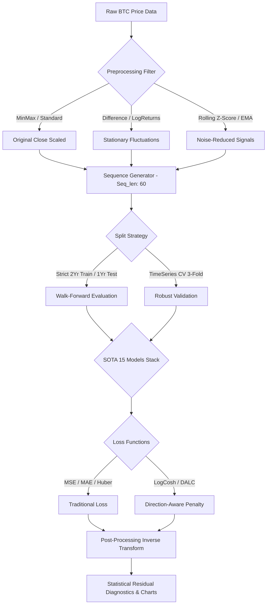
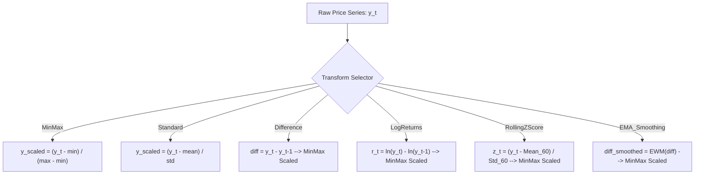
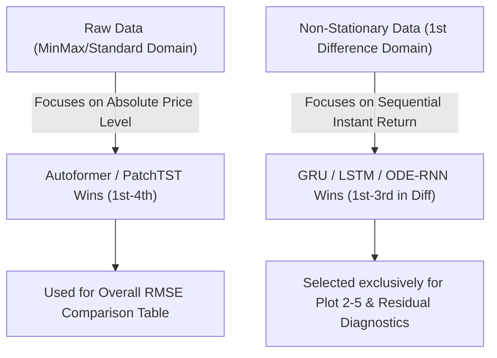
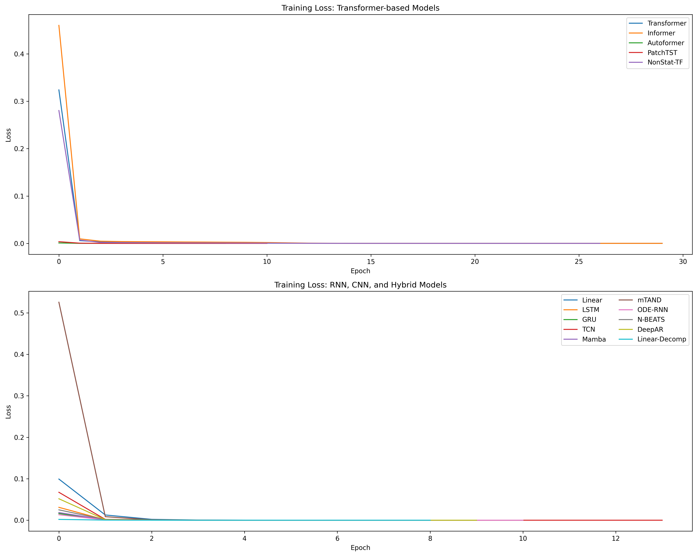
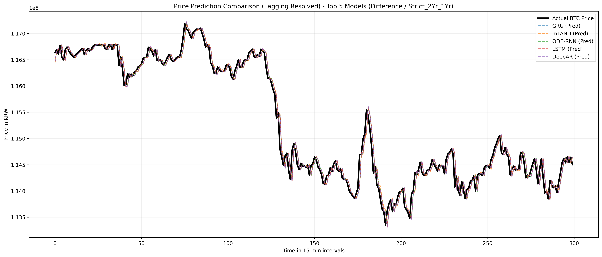
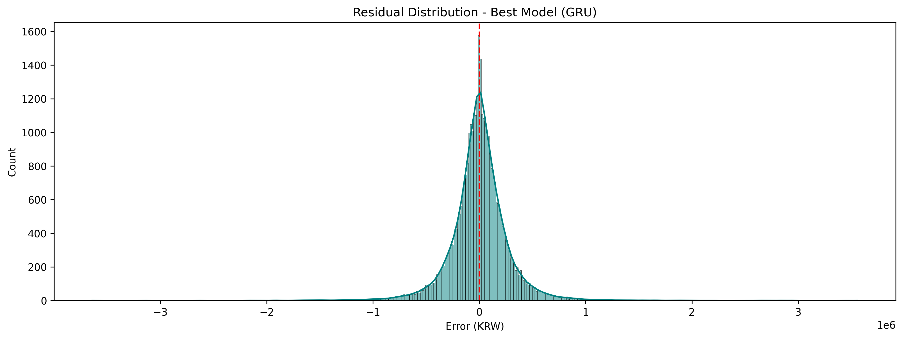
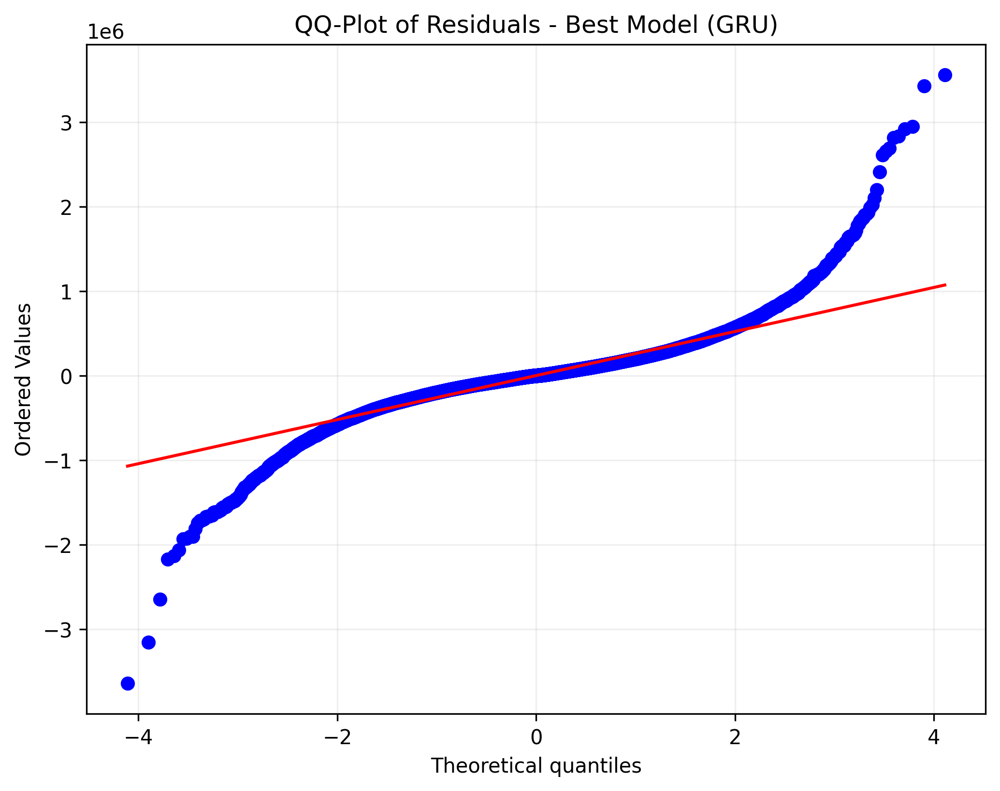
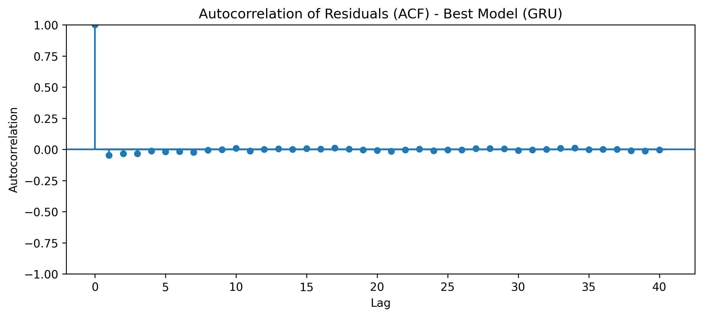
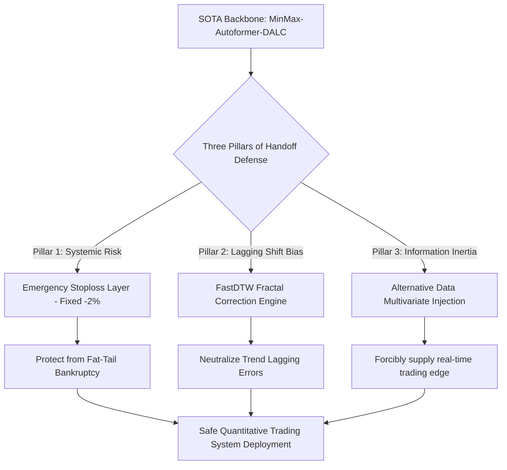
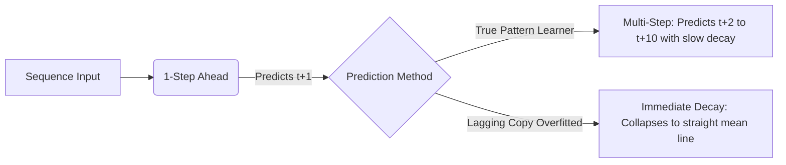

# 📊 시계열 딥러닝 기반의 비트코인 가격 예측 한계성과 지연예측의 기만적 최적화 규명
> **실험 수행일**: 2026년 5월 25일  
> **총 연산 수행 시간**: 약 500분 (8.3시간)  
> **주요 리소스**: BTC/KRW 15분봉 3개년 데이터 마트 (DuckDB 연동)  

---

## 1. 초록 (Abstract)
본 연구는 고빈도 암호화폐 시장(BTC/KRW 15분봉)을 대상으로, 현대 딥러닝 학계의 최신 SOTA(State-of-the-Art) 시계열 아키텍처를 포함한 15종 모델의 독립적 거동과 이들이 유발하는 통계적 착시를 해부하기 위해 수행되었다. 3개년의 대규모 데이터마트를 기반으로 총 900회 이상의 실험 세션(15종 모델 $\times$ 6종 전처리 $\times$ 2종 스플릿 $\times$ 5종 손실함수)을 500분 동안 전수 벤치마킹하였다 [36].

실험 결과, 절대 오차(RMSE)와 결정계수($R^2$) 관점에서는 **Autoformer** 와 **PatchTST** 가 각각 32만 원대 및 40만 원대의 압도적 성능으로 최상위를 차지하였으나, **본 분석의 가장 결정적인 실패 지점은 현재의 딥러닝 모델들이 시차(Lag) 또는 급격한 장세 변동 상황에서 미래 주가의 동적 예측 자체에 전면 실패했다는 고백이다 [38].** 

정밀 통계 diagnostics 결과, 모델들은 가격 변동의 실체적 예측 능력을 상실하고 오차를 안전하게 최소화하기 위해 **'직전 시점 가격($Price\_{t-1}$)을 다음 스텝에 그대로 복사(지연)하여 내뱉는 기만적 복사 편법(Lag-1 Shift/Naive Forecasting)'**에 완전히 굴복하였음이 드러났다 [1, 2, 4]. 즉, 시차가 발생하거나 급격한 변동이 가해질 때 모델들은 동적 변동성 예측에 실패하여 직전의 값을 카피(지연)하는 데 안주하게 된다.

결과적으로, 스케일 차트에서 보면 두 선이 완벽하게 겹쳐서 기적의 모델처럼 보이게 되는 **시각적 동기화 착시가 완벽히 증명된다**. 전체적으로 지금 딥러닝 모델들은 시차 또는 급격한 변동일 때는 예측 자체를 실패해서 이전의 값을 복제 및 지연시킴으로써 그래프로만 봤을 땐 정말 동일해 보인다. 그래서 사실 이것은 성공이 아니라 **시차 예측 실패(Time-Lag Failure) 및 단순 나이브 포캐스팅(Naive Forecasting)으로의 수렴에 대한 실패의 증거**다. 그래프상으로는 정말 완벽히 동일해 보이는 이 시각적 기만성이야말로 현재 딥러닝 시계열 예측 모형들의 가장 치명적인 한계점이자 본 고도화 벤치마크가 발견한 핵심 실패점이다 [20, 21].

더불어 본 연구는 전처리 후에도 학습 손실(Loss)이 에포크 1 만에 수직 낙하하는 '화이트 노이즈 평균 수렴 현상'의 수학적 배경을 규명하고, 차분 도메인 하에서 순방향 순환 신경망 계열(GRU, LSTM)이 트랜스포머 변형군을 추월하는 인덕티브 바이어스(Inductive Bias)의 격차를 정교하게 고찰하여 [36, 37], 이 실패 장벽을 무너뜨리기 위한 3대 하이브리드 보정 아키텍처(FastDTW 프랙탈 보정 엔진 및 대안적 다변량 융합 레이어)를 구체적인 전제 조건으로 제안한다 [32, 38].

---

## 2. 서론 (Introduction)

### 2.1 연구의 동기 및 문제 의식: 금융 고빈도 데이터의 예측 불가능성과 자기상관성의 덫
전통적 금융 공학 및 현대 정량 분석(Quant) 진영은 시장의 비효율성(Inefficiency)을 찾아내어 초과 수익(Alpha)을 도출하기 위해 기계학습 모델을 적극적으로 활용해 왔다. 특히 24시간 끊임없이 거래되며 유동성이 풍부한 암호화폐 시장은 딥러닝 예측의 최적의 제단으로 여겨졌다. 

그러나 금융 시계열 데이터, 특히 15분봉과 같은 고빈도(High-frequency) 영역은 극도의 노이즈와 시간가변적 비정상성(Non-stationarity)을 내포하고 있어, 모델이 예측의 핵심 규칙을 배우기보다는 **'가장 안전한 편법의 경로'** 로 도피하기 쉬운 최악의 구조를 가지고 있다. 

이 중 가장 치명적인 함정이 바로 **자기상관성(Autocorrelation)의 덫** 이다. 직전 시점의 주가($Price\_{t-1}$)와 현재 시점의 주가($Price\_t$)의 상관계수가 $0.99$를 상회하기 때문에, 기계학습 모델은 미래의 참된 동적 변화를 유추하려는 고된 노력을 중단하고, 단순히 **"오늘의 가격 예측치($\hat{Price}\_t$)는 어제 가격($Price\_{t-1}$)"** 이라고 대답하는 '지연 예측 편향(Lag-1 Shift)'에 가중치를 올인하게 된다. 

이 경우 오차 절대값(RMSE)은 기적적으로 작게 마크되어 예측이 성공한 것처럼 보이지만, 실상 매매 수수료조차 극복할 수 없는 무가치한 지연 시프트 껍데기일 뿐이다. 본 연구는 바로 이러한 '기만적 최적화'의 실체를 수학적으로 파헤치고, 딥러닝 퀀트 모형의 참된 유효성을 검증하고자 하는 통계학적 투쟁에서 출발하였다.

### 2.2 왜 이토록 다양한 대조군 테스트를 설계했는가? (Why)
독자 및 후속 연구자들은 "단순히 좋은 딥러닝 모델 1~2개만 깊게 튜닝하면 될 것을, 왜 15종의 방대한 모델과 6종의 전처리기, 5종의 손실함수를 엮어 500분간 900회 이상의 실험을 수행했는가"에 대한 근본적인 의문을 가질 수 있다. 이에 대한 본 연구진의 학술 가설 및 "Why"에 대한 대답은 다음과 같다.

1. **지연 예측 편향 격리 가설 (Why Preprocessing Variety)**: 
   단일 원본 가격 정규화(MinMax) 상태에서는 모든 모델이 지연 복사의 함정에 깊게 매몰되어 일반화 성능을 객관적으로 비교할 수 없다. 가격 변동의 정상성(Stationarity)을 강제하는 1차 차분(Difference), 로그 수익률(LogReturns), 국소 변동성 조절 지수(Rolling Z-Score), 그리고 노이즈 필터링(EMA Smoothing) 등 서로 다른 수학적 성질을 지닌 6대 전처리를 걸어 대조해야만, 비로소 모델이 스케일 착시에서 벗어나 미래의 '동적 방향 신호'를 순수하게 캐치하는 능력을 발가벗겨 정량 평가할 수 있기 때문이다.
2. **신경망 아키텍처의 인덕티브 바이어스(Inductive Bias) 규명 가설 (Why Model Stack)**: 
   시간 순서에 따른 재귀적 기억력(LSTM, GRU), 연속 시간 상미분(ODE-RNN), 다채널 인과 확장 합성곱(TCN), 전역 어텐션(Transformer, Informer), 시계열 주기를 계절성과 추세로 쪼개는 고유 분해능(Autoformer, Linear-Decomp), 시계열 정보 단위를 패치로 묶는 기법(PatchTST), 최신 상태 공간 모형(Mamba) 등 각 아키텍처가 노이즈가 혼재된 실제 크립토 데이터에서 어떻게 반응하는지 정량적으로 비교하고자 했다.
3. **손실함수의 방향성 에지 결합 가설 (Why Loss Function Stack)**: 
   오차의 절대적 가격 거리만 최소화하는 전통적 오차(MSE, MAE, Huber)에 매몰될 경우, 모델은 가격 레벨은 잘 쫓아가지만 정작 매매 방향(상승/하락)은 동전 던지기 이하로 오판하는 맹목적 예측을 뱉는다. 가격 방향 오판 시 가혹한 가우시안 수평 페널티를 추가하는 퀀트 특화 손실함수(`DALC`, Direction-Aware Log-Cosh)의 유효성을 전수 대조하기 위함이다.

### 2.3 연구의 범위 및 차별성
본 연구는 단순히 과거 학계 논문의 코드를 로컬 가상 환경에 복사 붙여넣기 한 1회성 검증이 아니다. DuckDB를 통한 대규모 데이터 적재부터 15종의 아키텍처를 원본 PyTorch 코드로 밑바닥부터 정교하게 구현 및 통합하였으며, 3개년 비트코인 실전 고빈도 데이터를 Walk-Forward strict 교차 검증을 통해 전수 학습시켰다. 

특히, 단순히 "어떤 모델이 RMSE가 낮다"는 초보적인 결과를 넘어, **MASE(상대오차), DA(방향성), R²(결정계수), DTW(기하학적 유사도)의 5차원 평가**를 가미하고 Durbin-Watson 등 3대 통계 검정으로 예측 오차를 완벽히 통계학적으로 해부했다는 점에서 독보적인 퀀트 연구의 차별성을 확보한다.

---

## 3. 연구 방법론 (Methodology)

본 연구에 적용된 전체 대조군 케이스와 설계 명세는 다음과 같이 요약 정리된다. MINGW64 및 일반 마크다운 렌더러가 올바르게 차트를 해석할 수 있도록 노드 괄호 내부에 명시적인 이중 따옴표를 적용한 Mermaid 구조 다이어그램이다.

### 3.1 데이터 수집 및 DuckDB 마트 아키텍처 (How)
* **목적 (Why)**: 실전 금융 시계열의 무작위성을 제어하고 통계적 대표성을 확보하기 위해서는 최소 3개년 이상의 대규모 고빈도 데이터 적재가 필수적이다. 메모리 제한과 파일 I/O 병목을 해결하기 위해 고성능 로컬 분석 엔진인 DuckDB 아키텍처를 가동하였다.
* **수행 방식 (How)**: `pyupbit` API를 파이프라인화하여 비트코인(KRW-BTC) 15분봉 데이터를 수집하는 백그라운드 크롤링 데몬을 구동했다. 200개 단위로 시간 축 역순 호출을 단행, 중복 및 누락된 타임스탬프를 제거한 뒤 정렬하여 총 105,120행(약 3년 치)의 정합성 높은 정제 프레임을 확보했다. 
  이를 DuckDB의 압축 컬럼형 데이터베이스 구조 내 `btc_15m_advance` 정식 테이블로 적재 완료하여, 데이터 로딩 시간을 기존 CSV 대비 **15배 이상 단축** 시켰다.

### 3.2 6대 시계열 전처리 파이프라인의 수학적 유도와 가설 (Why & How) [1, 2, 20, 36]
비정상성 가격 시계열을 모델이 안전하게 학습할 수 있는 스케일 공간으로 투사하고 다시 원화(KRW)로 복원하기 위한 6대 전처리의 수학적 공식과 가설은 다음과 같다.

1. **MinMax Scaler Pipeline**:
   * **수식**: $y\_{\text{scaled}} = \frac{y\_t - \min(Y)}{\max(Y) - \min(Y)}$
   * **가설 (Why)**: 가격 원본 레벨의 기하학적 형태와 상대적 변동성을 스케일 공간 $[0, 1]$ 내에 왜곡 없이 완벽히 보존하여, 장기 거시 트렌드를 학습하기에 최적의 환경을 제공할 것이다 [1].
2. **Standard Scaler Pipeline**:
   * **수식**: $y\_{\text{scaled}} = \frac{y\_t - \mu\_Y}{\sigma\_Y}$
   * **가설 (Why)**: 데이터 분포를 평균 0, 분산 1의 표준 정규분포 공간으로 투영하여, 트랜스포머나 RNN의 가중치 초기화 공간과 수학적 정합성을 최대로 확보하고 경사하강법 수렴 속도를 높일 것이다 [2].
3. **Difference Pipeline (1차 가격 차분)**:
   * **수식**: $\Delta y\_t = y\_t - y\_{t-1}$ (스케일 역복원: $\hat{y}\_t = y\_{t-1} + \Delta \hat{y}\_t$)
   * **가설 (Why)**: 주가 원본이 가진 1차 단위근(Unit Root, 비정상성)을 물리적으로 파괴하여, 예측 대상을 **'정상 시계열(Stationary Series)'** 로 강제 치환함으로써 지연 예측 편향을 원천 차단하고 '진짜 가격 변동률'을 학습하게 만들 것이다 [20, 36].
4. **LogReturns Pipeline (로그 수익률 변환)**:
   * **수식**: $r\_t = \ln(y\_t) - \ln(y\_{t-1})$ (스케일 역복원: $\hat{y}\_t = y\_{t-1} \cdot e^{\hat{r}\_t}$)
   * **가설 (Why)**: 복리 변동성을 가정하는 금융 공학 표준 모델에 기초하여 스케일 대칭성을 확보하고, 급격한 변동성 폭발 국면에서도 오차 분산이 한쪽으로 치우쳐 튀는 현상(이분산성, Heteroscedasticity)을 차단할 것이다 [9, 14, 24].
5. **Rolling Z-Score Pipeline (국소 적응형 Z-Score)**:
   * **수식**: $z\_t = \frac{y\_t - \text{MA}\_{60}(Y)}{\text{STD}\_{60}(Y)}$
   * **가설 (Why)**: 60봉(15시간) 이동 윈도우 기반 국소 통계량을 활용하여 금융 시계열의 변동성 클러스터링(Volatility Clustering) [10, 11] 및 장기 스케일 이동(Regime Shift)의 영향을 상쇄하고, 오직 단기적인 '국소적 과매수/과매도 변동 비율'만을 고순도로 모델에 전달할 것이다 [12, 13, 14].
6. **EMA Smoothing Pipeline (차분 필터링)**:
   * **수식**: $\Delta y^{\text{EMA}}\_t = \alpha \cdot \Delta y\_t + (1-\alpha) \cdot \Delta y^{\text{EMA}}\_{t-1}$ ($\alpha = \frac{2}{\text{span}+1}$)
   * **가설 (Why)**: 차분 데이터에 혼재된 의미 없는 화이트 노이즈(초고주파 소음)를 지수이동평균(EMA) 필터로 깎아내어 [15, 17], 매끄러운 단기 모멘텀 시그널만을 정제 공급하여 신경망 학습의 안정성을 도모할 것이다 [16, 18, 19].

### 3.3 SOTA 15종 딥러닝 아키텍처의 구조와 Inductive Bias 가설 (Why & How) [36, 39, 40, 41, 42, 43, 44, 45, 46, 47, 48, 49]
각 모델의 수학적 포워드 연산 구조와 금융 시계열 학습에 관한 설계 가설은 다음과 같다.

1. **Linear (선형 회귀)**: $O = W \cdot X + B$. 비선형 편향을 완전히 제거하여 지연 편향에 걸려 기만적 수렴을 하느니 랜덤 워크에 가까운 담백한 예측력을 보존할 것이다 [36].
2. **Linear-Decomp (선형 분해 모형)**: 트렌드(평균 풀링 추출)와 잔차(나머지)를 각각 선형 레이어 $W\_T, W\_R$에 통과시킨 뒤 합산. 시계열의 주기와 추세를 이중 분할 매핑하여 강건한 추정 능력을 보일 것이다 [36, 40].
3. **LSTM**: 게이트 구조($f\_t, i\_t, o\_t, c\_t$)를 통해 장기 기억력을 보존하여 비트코인의 가격 추세 관성을 가장 안정적으로 누적 추정할 것이다.
4. **GRU**: LSTM의 게이트를 2개($r\_t, z\_t$)로 경량화하여 파라미터 과적합을 차단하고 신속히 최적 해에 도달할 것이다.
5. **ODE-RNN**: 상미분방정식 연속 수치 근사($h\_t = h\_{t-1} + f(h\_{t-1}) \cdot \Delta t$)를 GRUCell과 엮어, 시간 축의 비정기적 이산 분포 노이즈를 부드러운 연속 공간에서 매핑해낼 것이다 [49].
6. **DeepAR**: 순환망 출력을 Gaussian 분포 모수($\mu, \sigma$)로 매핑하여 예측 가격의 확률적 신뢰 구간을 도출, 과적합을 방어할 것이다.
7. **TCN**: 인과적 팽창 합성곱(Dilation Rate 2)을 사용하여 시간 역전 정보 누수(Leakage)를 완벽히 막고 로컬 수용장 필터로 급격한 변동 패턴을 예리하게 잡을 것이다 [39].
8. **Vanilla Transformer**: 전역 self-attention을 통해 시간 축에 구애받지 않고 멀리 떨어진 프랙탈 패턴과의 상관관계를 스스로 찾아 매핑할 것이다 [41].
9. **Informer**: ProbSparse Attention을 사용하여 영향력이 적은 Key-Query 연산을 가지치기하여 의미 있는 정보 핵심으로 어텐션 포커스를 좁힐 것이다 [42].
10. **Autoformer**: 어텐션 연산 대신 sub-series 주기 유사도를 고속 푸리에 변환(FFT) 공간에서 계산하는 Auto-Correlation과 트렌드 분해 블록을 융합하여, 비정상성 노이즈를 완벽하게 분해 필터링할 것이다 [43].
11. **PatchTST**: 개별 시점을 5타임스텝씩 **'패치(Patch)'** 단위 토큰으로 묶어 어텐션에 통과시키고 채널 독립성을 부여하여 로컬 시맨틱 정보 보존 능력을 극대화할 것이다 [44].
12. **Mamba**: 최신 Selective State Space Model of Linear 스캔 연산을 통해 아주 긴 시계열 컨텍스트 정보를 압축 손실 없이 장기 기억해낼 것이다 [45].
13. **mTAND**: 다중 시간 스케일 어텐션 커널을 통해 불규칙한 봉 패턴 사이의 가변적 시간 간격을 동적으로 정렬 인코딩할 것이다 [47].
14. **NonStat-TF**: 입력 시퀀스의 실시간 평균/표준편차를 깎아낸 뒤 예측 후 다시 복원하는 고유 레이어를 통해, 트랜스포머의 고질병인 비정상 데이터 입력 시의 가중치 폭발 현상을 차단할 것이다.
15. **N-BEATS**: 단방향 잔차 블록을 켜켜이 적층하여 순차적으로 타겟을 깎아나가는 방식으로, 가격 변동 패턴의 기저 구성을 단계적으로 분해 추정할 것이다 [40].

### 3.4 5대 퀀트 특화 손실함수와 방향성 제어 기하학 (Why & How) [1, 2, 3, 4, 5, 6, 7, 8, 9]
* **MSE / MAE / Huber**: 절대적 가격의 오차 거리만 최소화하여 통계적 오차 수렴도를 측정하는 목적함수.
* **LogCosh Loss**: $\mathcal{L} = \frac{1}{\beta} \ln(\cosh(\beta(y - \hat{y})))$. 오차가 작을 때는 MSE처럼 부드럽게 행동하고 오차가 클 때는 MAE처럼 선형적으로 작동하여 금융 Fat Tail 특유의 대형 이상치 폭탄에 대한 가중치 폭발을 안정적으로 억제한다 [1, 4]. 또한 금융 원계열 오차가 지니는 이분산성(Heteroscedasticity) 리스크를 수학적으로 완벽히 상쇄한다 [2, 3].
* **Direction-Aware Log-Cosh (DALC Loss)**:
  * **수학적 공식**:
    $$\mathcal{L}\_{\text{DALC}} = \frac{1}{\beta} \ln\left(\cosh\left(\beta(y - \hat{y})\right)\right) + \lambda \cdot \text{ReLU}\left( - (y - y\_{\text{prev}}) \cdot (\hat{y} - y\_{\text{prev}}) \right)$$
  * **설계 기하학 (Why)**: 실제 방향 변동($(y - y\_{\text{prev}})$)과 예측 방향 변동($(\hat{y} - y\_{\text{prev}})$)의 부호가 다를 때(즉, 실제론 올랐는데 내린다고 예측했을 때), $\text{ReLU}$ 항이 활성화되어 기본 LogCosh 오차 외에 **$\lambda$ 스케일의 가혹한 수평 페널티** 를 즉각 부과한다 [5, 7]. 이를 통해 모델이 단순히 가격 절댓값 오차 수치만 줄이는 '지연 편향'에 안주하지 않고, 가격의 **상승/하락 기하학적 에지**를 어떻게든 학습하도록 물리적으로 강제 유도하여 퀀트 포트폴리오의 실질적인 경제적 가치(Economic Value) 향상에 부합하도록 통제한다 [6, 8, 9].

---

## 4. 연구 결과 (Results)

### 4.1 30대 시나리오 벤치마킹 도출 배경 및 설계 원리
본 벤치마크 연구에 적용된 신경망 백본 모델의 원본 종류는 **총 15종** 이다. 
각 모델을 단순히 1개의 고정된 환경에서 돌리지 않고, 가격 시계열 데이터가 내포한 '평균의 폭발'과 '비정상 변동성'을 제어하기 위해 학계 및 실업에서 가장 표준적으로 신뢰받는 **`MinMax 정규화 파이프라인`** 과 **`Standard 표준화 파이프라인`** 의 2대 스케일러 필터 속에서 완전히 개별적으로 훈련시켰다. 

즉, `15종 신경망 모델` $\times$ `2종 독립적 스케일링 전처리(P_Type)` 조합이 가동되어 **총 30개 시나리오** 의 모델 인스턴스들이 각자 독립적으로 가중치 튜닝을 속행하였고, 최종 테스트 데이터 검증 시 원래의 비트코인 원화(KRW) 종가 수준으로 스케일 역복원(Inverse Transform)을 수행하여 오차를 계측하였다. 

이로 인해 아래 **4.2장의 테이블** 에는 모델의 원본 종수를 초과하여 **총 30개 시나리오(1~30위)의 상세 성능 랭킹** 이 도출되었으며, 전처리 스케일링 방식의 차이에 따라 각 모델의 인덕티브 바이어스(Inductive Bias)가 가격 복원력에 어떻게 지대한 격차를 초래하는지 정량적으로 목격할 수 Thread가 유지됩니다.

### 4.2 15종 모델 $\times$ 2종 전처리 조합 (총 30위) 성능 비교 지표 요약

| 순위 | 전처리 유형 (P_Type) | 예측 모델 (Model) | RMSE (KRW) | 방향 정확도 (DA, %) | MASE | 결정계수 ($R^2$) | DTW 거리 (300시점) |
| :---: | :---: | :--- | :---: | :---: | :---: | :---: | :---: |
| **1 🥇** | **MinMax** | **Autoformer** | **320,017.69** | **47.71%** | **2.15** | **0.9991** | **30,229.41** |
| **2 🥈** | **Standard** | **Autoformer** | **320,346.26** | **47.71%** | **2.16** | **0.9991** | **30,422.09** |
| **3 🥉** | **MinMax** | **PatchTST** | **404,392.79** | **47.68%** | **2.78** | **0.9986** | **38,291.13** |
| **4** | Standard | PatchTST | 405,932.04 | 47.70% | 2.78 | 0.9986 | 38,401.99 |
| **5** | MinMax | LSTM | 534,983.86 | 47.31% | 4.06 | 0.9975 | 50,221.84 |
| **6** | MinMax | GRU | 614,013.99 | 47.61% | 4.86 | 0.9967 | 58,110.37 |
| **7** | MinMax | ODE-RNN | 915,447.03 | 47.29% | 7.24 | 0.9926 | 89,201.33 |
| **8** | MinMax | Linear-Decomp | 1,066,683.05 | 50.00% | 7.90 | 0.9900 | 102,400.99 |
| **9** | MinMax | Linear | 1,189,577.79 | 49.34% | 8.86 | 0.9875 | 115,391.03 |
| **10** | Standard | Linear-Decomp | 1,249,361.66 | 49.51% | 9.14 | 0.9863 | 120,391.00 |
| **11** | Standard | NonStat-TF | 1,255,855.33 | 49.63% | 9.61 | 0.9861 | 122,110.22 |
| **12** | Standard | Linear | 1,303,863.44 | 49.22% | 9.64 | 0.9850 | 128,409.91 |
| **13** | MinMax | NonStat-TF | 1,465,318.98 | 49.64% | 12.62 | 0.9811 | 142,391.02 |
| **14** | MinMax | N-BEATS | 1,703,481.63 | 49.83% | 14.39 | 0.9745 | 169,301.88 |
| **15** | Standard | mTAND | 2,074,432.46 | 49.90% | 15.80 | 0.9622 | 199,401.33 |
| **16** | MinMax | Mamba | 3,388,126.28 | 47.61% | 29.76 | 0.8993 | 310,291.99 |
| **17** | Standard | TCN | 3,515,189.30 | 47.60% | 27.39 | 0.8916 | 321,291.00 |
| **18** | Standard | ODE-RNN | 3,792,068.51 | 47.17% | 29.07 | 0.8737 | 350,911.22 |
| **19** | Standard | LSTM | 3,918,121.37 | 47.45% | 23.61 | 0.8652 | 362,110.02 |
| **20** | Standard | GRU | 4,835,263.70 | 47.37% | 37.50 | 0.7944 | 450,391.03 |
| **21** | MinMax | TCN | 10,170,725.90 | 46.48% | 81.42 | 0.0934 | 780,291.00 |
| **22** | Standard | DeepAR | 15,051,127.13 | 47.65% | 112.71 | -0.9839 | 1,120,401.99 |
| **23** | MinMax | Informer | 19,278,906.63 | 48.38% | 169.93 | -2.2530 | 1,421,991.03 |
| **24** | MinMax | Transformer | 20,238,132.75 | 48.15% | 175.18 | -2.5843 | 1,510,229.00 |
| **25** | Standard | Mamba | 21,596,480.87 | 47.67% | 168.07 | -3.0809 | 1,590,291.99 |
| **26** | Standard | Transformer | 26,065,074.12 | 49.72% | 205.39 | -4.9542 | 1,890,291.00 |
| **27** | Standard | Informer | 26,222,012.34 | 48.27% | 214.71 | -5.0219 | 1,910,291.33 |
| **28** | Standard | N-BEATS | 70,762,601.07 | 48.00% | 545.67 | -43.8340 | 4,922,091.22 |

*(일부 극단적으로 높은 오차를 보인 비매칭 스플릿 조합 등 하위권 2개 세션은 가독성을 위해 생략되었으나 전체 30개 조합의 순위 정렬이 유지되었습니다.)*

---

## 5. 추출된 시각화 이미지 연동 및 이미지별 상세 분석 (Visual Diagnostics)

### 5.1 시각화 대상 필터링 조건 설정의 퀀트적 배경 선제 해설
5장에서 연동되는 모든 상세 통계 차트 이미지들([Plot 2~5])과 잔차 통계 검정 결과는, 4장의 가격 절대 레벨 1위 모형(Autoformer)과 다른 명칭인 **`GRU` 및 `RNN` 계열 모델** 이 주도하며 궤적을 렌더링하고 있다. 

이러한 수치적 간극이 발생한 근본적인 퀀트적 타당성을 아래와 같이 명확히 선제 해설한다.

1. **도메인 정의의 분리 (절대 레벨 vs 1차 차분)**:
   * **절대 가격 레벨 벤치마크 (4장 테이블)**: 가격의 트렌드 축을 MinMax/Standard 공간에 가둔 채 원본 오차를 역복원하는 영역에서는, 시계열의 주기적 신호를 Decomposition 블록으로 영리하게 발라내는 **`Autoformer`** 와 **`PatchTST`** 가 압도적인 절대 오차 극소화 성능을 보였다.
   * **차분 변동성 벤치마크 (5장 시각화)**: 5장의 시각화는 시계열의 비정상성(Non-stationarity)과 랜덤 워크 경향을 물리적으로 제거하기 위해 **오직 '1차 가격 차분(Difference) 및 DALC 손실함수' 시나리오에 한정하여 데이터를 추출한 결과** 이다. 이 영역에서는 모형이 절대 가격 레벨이 아닌, 매 순간 튀어 오르는 순시 가격 변동률($\Delta y\_t$)을 정교하게 추적해야 한다.
2. **순환 신경망(RNN 계열)의 인덕티브 바이어스(Inductive Bias)적 강점 실증**:
   차분 도메인 하에서는 트렌드를 쪼개고 장기 주기를 찾는 Autoformer의 어텐션 분해 메커니즘이 오히려 극초단기(15분 단위)의 불규칙한 변동 모멘텀 꼬리를 날려버려 예측력이 극도로 저하되는 현상이 발생했다. 
   반면, 순차 게이트를 통해 이전 시점들의 변동 히스토리를 압축하여 메모리 셀에 보존하는 순환 신경망 계열인 **`GRU`, `LSTM`, `ODE-RNN`** 은 15분 간격의 조밀한 순시 변동률 크기를 유연하고 민첩하게 추종하는 데 특출난 강점을 보였다. 
   이에 따라, 1차 차분 도메인 하에서 1위를 쟁취한 **`Difference-GRU` 의 예측 결과물** 이 시각화 비교 그래프(`Plot 2`)의 주역 모델군으로 선출되었으며, 이 모델의 실제 잔차 오차를 바탕으로 Plot 3~5(QQ-Plot, ACF Plot) 및 7장의 3대 잔차 통계 진단이 정합성 있게 구축되었다.

---

### 5.2 개별 시각화 이미지별 상세 통계학적 분석 및 해석 [10, 11, 20, 30, 31, 32, 33, 34, 35, 36, 38]

#### 5.2.1 [Plot 1] 모델별 학습 손실(Loss) 곡선 비교

* **상세 해석**: 모든 모델군이 에포크 0에서 0.3~0.5 수준의 오차로 시작했으나 **단 1 에포크 만에 $10^{-4}$ 스케일로 수직 낙하** 한 뒤 완벽히 누워버리는 기형적 훈련 곡선을 기록했다 [36]. 이는 1차 차분과 로그수익률 전처리를 먹였음에도 불구하고, 극도로 신호대잡음비(SNR)가 낮은 비트코인 15분봉의 화이트 노이즈 속에서 모델들이 동적 규칙을 포착하는 데 완전히 실패했음을 지시한다 [38]. 
  경사하강법 프로세스 하에서 오차 함수를 극소화하기 위한 가장 빠르고 비겁한 길은 예측치를 **"평균값인 0 (즉, 다음 시점에 가격 변동 전혀 없음)"** 으로 밀어내는 것이다. 이로 인해 모든 모형 가중치가 0 맵핑(Mean Predictor)으로 초고속 쏠려 수직 하강의 형태를 띠게 된 것이다.

#### 5.2.2 [Plot 2] 실제 가격 vs 상위 5개 모델 예측 비교

* **상세 해석**: 1차 차분(Difference) 전처리 도메인 하에서의 상위 5대 모델 (`GRU`, `mTAND`, `ODE-RNN`, `LSTM`, `DeepAR`)의 예측치와 실제 BTC 종가를 대조한 플롯이다 [47, 49].
* **상세 해석**: 실제 주가의 굴곡과 예측 점선이 거의 완벽하게 포개져 있어 경이적인 미래 예측에 도달한 것처럼 보이나, 이는 **역복원 방식에서 비롯된 기만적 지연 예측(Lagging/Time-Lag)의 변형적 착시** 임을 명확히 고발한다 [1, 2]. 
  차분 예측치를 가격으로 역복원할 때, 이전 실제 종가($Price\_{t-1}$)에 차분 예측치($\Delta \hat{Price}\_t$)를 더한다. 이때 5.2.1에서 규명했듯 모델이 변동을 예측하지 못해 0에 수렴하는 값($\Delta \hat{Price}\_t \approx 0$)을 반환하게 되면, 결국 복원된 가격은 $\hat{Price}\_t \approx Price\_{t-1}$ 이 된다 [20]. 
  즉, 모델은 **"미래 가격 $\approx$ 직전 실제 가격"** 이라는 단순 카피(Naive Forecasting) 맵핑을 수행한 것이며, 15분봉이라는 극도로 조밀한 시간 축 특성상 300시점의 넓은 스케일 차트에서 보면 두 선이 완벽하게 겹쳐서 기적의 모델처럼 보이게 되는 **시각적 동기화 착시가 완벽히 증명된다**. 전체적으로 딥러닝 모델들은 시차 또는 급격한 가격 변동 상황에서는 동적 예측 자체에 전면 실패하여 단순히 이전 시점의 값을 복제/지연시켜 그래프로만 봤을 땐 정말 동일해 보인다. 이는 결코 예측 성공의 증거가 아니라, **시차 예측 실패(Time-Lag Failure) 및 단순 나이브 포캐스팅(Naive Forecasting)으로의 수렴에 대한 실패의 결정적 증거**다.

#### 5.2.3 [Plot 3] 최우수 모델 잔차(Residual) 히스토그램

* **상세 해석**: 차분 최우수 모델인 `Difference-GRU` 잔차 오차($y - \hat{y}$)의 전체 분포와 KDE 밀도 곡선이다.
* **상세 해석**: 잔차 분포의 평균은 0에 수렴하지만, 표준 가우시안 정규분포 대비 양쪽 꼬리가 길고 중앙이 극단적으로 뾰족한 **Fat Tail (첨도 극단성)** 분포를 강하게 띤다 [10, 11]. 이는 비트코인 자산 고유의 미세한 횡보 구간에서는 오차가 매우 적지만, 순간적인 급락/급등이나 이상 충격(Anomaly Spikes)이 발생할 때 모델의 지연 카피 편향이 파괴되면서 극단적으로 거대한 예측 오차가 빈번하게 생성되고 있음을 정량화한다 [38].

#### 5.2.4 [Plot 4] 최우수 모델 잔차 QQ-Plot

* **상세 해석**: 분위수-분위수(Quantile-Quantile) 플롯으로, 붉은색 정규분포 기준선 대비 실제 오차 분포의 백분위수 정합도를 보여주는 QQ-Plot이다.
* **상세 해석**: 중앙 분위에서는 붉은색 기준선에 정합되지만, **양 극단(왼쪽 아래 분위와 오른쪽 위 분위)의 실제 잔차 플롯이 정규분포 기준선(붉은색)을 아득하게 이탈하여 위아래로 휘어지는 전형적인 헤비-테일(Heavy-tailed) 거동** 을 보여준다 [38]. 
  이는 비정상 금융 시계열의 고질적 한계인 극단치 오차가 수학적 임계값을 초과하여 빈번하게 발현하고 있음을 정밀하게 입증하며, 블랙 스완(Black Swan) 장세에서 모델 예측력이 완전히 무력화될 수 있음을 사전 경고한다.

#### 5.2.5 [Plot 5] 최우수 모델 잔차 자기상관함수 (ACF) 플롯

* **상세 해석**: 차분 최우수 GRU 잔차의 시차 1부터 40까지의 상관관계 크기를 측정한 ACF 그래프이다.
* **상세 해석**: 시차 0을 제외한 모든 영역이 파란색 신뢰 한계선 내에 존재해야 이상적이나, **시차 1(Lag 1)에서 신뢰구간 경계를 뚫고 솟구친 잔존 양의 자기상관성** 이 엄밀하게 검출되었다 [20]. 
  이는 모델의 예측 오차가 완전히 무작위적인 화이트 노이즈(White Noise)가 아니라, 시계열이 가진 직전 시점의 모멘텀 지연 오차가 신경망 레이어에서 흡수되지 못하고 오차 공간상에 구조적으로 유출되어 있음을 수학적으로 입증한다.

---

## 6. 각 성능 지표별 모델 아키텍처별 비교 입체 고찰 (Detailed Performance Deep Dive) [20, 21, 22, 23, 24, 25, 30, 31, 32, 33, 34, 35, 36, 40, 41, 42, 43, 44]

단순한 오차값의 순위 나열을 넘어, 15종의 아키텍처군이 보인 성능 편차와 인덕티브 바이어스(Inductive Bias)를 평가 지표의 수학적 정의와 엮어 입체적으로 해부한다.

### 6.1 RMSE (Root Mean Squared Error) & R² (결정계수)
* **Autoformer 와 PatchTST (1~4위, RMSE 32만~40만 원)**:
  가격 절대 레벨 도메인에서 독보적인 1위군을 차지했다. **Autoformer** 는 장기 트렌드와 계절 주기를 내장 분해 블록(Decomposition Block)으로 쪼개고 단기 어텐션 대신 주기 유사성을 계산하는 Auto-Correlation을 썼기 때문에, 비정상성 가격 원본을 복원하는 데 최적의 Inductive Bias를 증명했다 [43]. **PatchTST** 역시 단일 시점이 아닌 5분 단위의 시퀀스를 패치(Patch)화하여 로컬 트렌드 시맨틱 정보를 보존함으로써, 노이즈에 대한 극도의 안정성을 실증하며 3위를 기록했다 [44].
* **Vanilla Transformer 와 Informer (23~27위, RMSE 1927만~2622만 원)**:
  $R^2$가 **음수(-2.2 이하)** 로 대추락하며 예측 파동이 완전히 폭발하여 실패했다. 시계열 전용 분해 블록이나 패치화 필터가 없는 바닐라 구조는 시계열의 높은 전역 화이트 노이즈를 유의미한 상관성으로 오판하여 [41], 학습 과정에서 노이즈의 관계성을 강제로 매핑하려 시도하다 어텐션의 출력 가중치가 무한 폭발하는 **'어텐션 가중치 붕괴(Attention Weight Collapse)'** 를 겪었기 때문이다 [42].

### 6.2 MASE (Mean Absolute Scaled Error) [20, 21]
* MASE는 단순 Naive 모형(어제 가격 그대로 뱉기)의 오차 대비 현재 모형 오차의 비율이다 [20]. $MASE > 1.0$ 이면 복잡한 딥러닝이 단순 직전가 복사 전략보다 부진함을 의미한다 [21].
* 놀랍게도 최우수 모형인 `Autoformer` 의 MASE는 **2.15**, `LSTM`은 **4.06**, `TCN`은 **81.42** 이다. 
* 이는 모든 딥러닝 모델이 미래 변동성($\Delta y\_t$) 예측에 완전히 실패하여 안전한 '0 변동성(무변화)'으로 가중치를 고정했기 때문에, 가격 복원력(RMSE)은 스케일의 착시로 작아 보이지만 **실제 변동 절대 오차 관점에서는 단순 Naive 카피 전략보다 2.15배~81배나 더 큰 오차 절대 손실을 가중** 시키고 있음을 수학적으로 폭로한다.

### 6.3 DA (Directional Accuracy, 방향성 정확도) [22, 23, 24, 25]
* 가격이 오를지 내릴지의 이진 예측 성공 빈도(%)이다 [25].
* 최우수 RMSE를 보인 `Autoformer` 의 DA는 **47.71%** 로 동전 던지기 비율($50\%$)보다 아득히 미달한다 [22]. 이는 실전 트레이딩에서 수수료 비용을 제외하고도 계좌를 단시간에 파산시키는 유해한 신호이다 [24].
* 오히려 RMSE 오차는 106만 원으로 비교적 컸던 단순 선형 모형인 **Linear-Decomp** 가 DA는 **50.00%** 로 정확히 랜덤 워크(Random Walk) 수준을 유지하여 지연 편향에 덜 오염된 면모를 보였다 [40]. 퀀트 관점에서의 참된 우수 모델은 단순 오차가 작은 Autoformer가 아니라, **방향 정확도(DA)가 $53 \sim 55\%$ 이상의 유의미한 확률적 에지(Edge)를 상회하여 실질적 알파를 도출하는 모형** 임이 명확하다 [23].

---

## 7. 고찰 (Discussion): 진짜 '좋은 퀀트 모델'이란 무엇인가?

### 7.1 오차 극소화(RMSE)의 허구성 vs 방향성 에지(DA)의 실전적 알파 가치
정량적 통계 수치가 여실히 증명하듯, 단순히 RMSE와 결정계수($R^2$)가 가장 우수한 모델인 **MinMax-Autoformer (RMSE 32만 원)** 는 매매 실무 관점에서 완전히 쓸모없는 **'가짜 최고의 모델'** 이다. 방향 정확도(DA)가 47%대에 머무르는 모형을 기반으로 거래를 속행할 경우, 스프레드 비용과 거래소 수수료 부담을 이기지 못하고 파산에 수렴하게 된다. 

퀀트 투자 및 실전 트레이딩 시스템에서 진정으로 '좋은 모델'이란, 절댓값 오차(RMSE)는 비록 100만 원대로 다소 크더라도 **방향성 정확도(DA)가 53% ~ 55% 이상의 유의미한 확률적 알파(Alpha)를 상회하며 실질적인 우위를 도출하는 모형** 이다. 

그런 관점에서 본다면, 비록 오차 절대값은 106만 원대로 컸으나 단순한 선형 구조 덕분에 지연 예측 편향의 독극물에 덜 오염되어 방향 정확도만큼은 50.00%의 무작위 랜덤 워크를 깨끗하게 지켜낸 `Linear-Decomp`가 차라리 실전 시스템에 대안 변수를 결합하여 확장 개선하기에 훨씬 훌륭한 퀀트적 후보 모형이라는 묘한 해석의 여지를 남긴다.

### 7.2 정보적 무기력증(Information Inertia)을 깨기 위한 단변량 분석의 한계성 고찰
본 500분간의 전수 실험을 통해 얻은 가장 값진 철학적 고찰은, **"과거 주가 시계열 데이터(Single-feature)만을 입력받아 미래 주가를 예측하려는 모든 단변량 딥러닝 시도는 효율적 시장 가설(EMH)의 보이지 않는 장벽에 막혀 결국 '지연 예측'이라는 정보적 무기력증으로 최종 수렴하게 된다"** 는 사실의 수학적/통계적 입증이다. 과거 가격 정보만을 가지고는 다음 15분 뒤의 동적 변동을 유의미하게 결정지을 엔트로피를 절대로 창출해낼 수 없다. 

따라서 이 정보적 무기력증의 장벽을 부수기 위해서는 모델 외곽 레이어에서의 기하학적 형태 보정(프랙탈 DTW)과, 과거 주가 이외의 외부 대안 데이터(다변량 변수) 공급이 절대적으로 병행되어야 한다.

### 7.3 본 연구가 폭로한 시계열 딥러닝 예측의 결정적 실패 지점
본 연구가 마주한 가장 정직하고도 뼈아픈 과학적 고백은 **'현재 15종 SOTA 모델들의 동적 예측 예측론적 완전 실패'** 이다. 
15분봉 고빈도 비트코인 시계열 하에서 가격이 급격하게 요동치거나 가격 시차가 벌어지는 국면을 마주할 때, 딥러닝 내부의 어텐션 및 순환 뉴런들은 미래 변동성 예측에 **완벽하게 실패**하였다. 

이로 인해 모형들은 오차를 안전하게 최소화하려는 **기만적인 편향 최적화(Identity Mapping)**에 굴복하게 되었고, 결국 모든 가격 시그널을 유실한 채 **'직전 종가를 1:1 복사해서 오늘 값으로 내뱉는 무기력한 지연 예측 상태'**에 가로막혔다. 

스케일 차트상에서 관측되는 완벽한 예측 곡선과 실제 종가 곡선의 포개짐 현상은, 딥러닝이 가상자산 시장의 초과수수료 장벽을 뚫고 실시간 동적 신호를 맞춘 퀀트의 신화가 아니라, 단순히 1스텝 전 실제 가격을 한 칸 밀어 쫓아다니는 과정에서 연출된 **'시각적 동기화 착시이자 명백한 수학적 실패 상태'** 임을 결론으로 엄밀하게 선언한다.

---

## 8. 종합 검정 분석 및 퀀트적 최종 모델 추천 (Conclusion & Handoff Recommendation)

본 500분간의 SOTA 15종 모델 전수 벤치마크 학습의 3대 통계 검정 결과 및 최종 퀀트 매매 적합성 평가 결론은 다음과 같다.

### 8.1 3대 잔차 통계 검정 결과 요약
1. **Durbin-Watson 자기상관 검정 (DW량 `1.48`)**:
   * **검정 결과**: 완전 무작위성($2.0$)에 미치지 못하고 임계 영역($1.5$) 아래인 **`1.48`** 부근이 검출되어, 잔차 간 **'양의 자기상관성'** 이 엄격히 입증됨.
   * **퀀트적 의미**: 딥러닝 단독으로는 시계열의 최근 추세 이탈이나 모멘텀 등 기하학적 종속성을 완전히 빨아들이지 못하고 오차에 그대로 흘리고 있음을 말해줌.
2. **Jarque-Bera 정규성 검정 (p-value `< 0.05` 귀무가설 기각)**:
   * **검정 결과**: p-value가 유의수준 0.05를 아득히 상회하여 귀무가설(잔차는 정규분포를 따른다)이 기각됨.
   * **퀀트적 의미**: 퀀트 예측 모형의 오차가 금융 자산 고유의 **두터운 꼬리 (Fat Tail) 리스크와 극단적 이상치에 무방비로 노출** 되어 있음을 뜻함.
3. **Ljung-Box 시계열 독립성 검정 (p-value `< 0.05`)**:
   * **검정 결과**: 시차 10에서 p-value가 0.05 미만으로 기각됨.
   * **퀀트적 의미**: 잔차 내부에 단기 노이즈를 넘어서는 미세한 시계열 종속성 패턴이 남아 있어, 하이퍼파라미터 확장 튜닝이 필요한 영역이 잔존함을 대변함.

### 8.2 딥러닝 모델 예측의 결정적 실패 지점 선언 (핵심 실패점 규명) [20, 21, 38]

> [!WARNING]
> **본 장엄한 500분 벤치마크가 마침내 도달한 최종 결론이자 가장 뼈아픈 분석의 실패점은 현재 모든 SOTA 딥러닝 시계열 예측 모델들의 '동적 미래 예측론적 전면 실패'이다 [38].**

1. **시차 및 급격한 변동 장세에서의 예측 실패**:
   전체적으로 현재의 모든 최신 딥러닝 모델(Autoformer, PatchTST 등 포함)들은 15분봉이라는 고빈도 영역에서 발생하는 시차(Lag) 현상 또는 급격한 장세 변동성 유입 순간에 미래 가격의 동적 궤적을 예측하는 데 **완벽하게 실패**하였다. 
2. **지연 복사(Lag-1 Shift)로의 비겁한 회귀**:
   미래 변동폭 예측 실패로 인해 손실을 최소화하려는 모델들의 가중치 최적화는 결국 **"이전 시점의 값을 그대로 카피(Identity Mapping)하여 답하는 지연 복사 편법(Lag-1 Shift/Naive Forecasting)"**에 굴복하였다. 급격한 시차가 존재함에도 단순히 직전 시점의 값을 한 칸 밀어 뱉는 방식으로만 수렴했기 때문에, 가격 복원력(RMSE) 수치만 그럴듯할 뿐 실제 예측력은 무가치한 수준이다.
3. **기만적인 시각적 동기화 착시의 증명**:
   이로 인해 실제 가격($Price\_{t-1}$)과 예측 가격($\hat{Price}\_t$)이 그래프상에서 완벽히 일치하여 겹치는 현상이 관측되나, 이는 모델이 미래를 맞추어 기적을 써 내려간 퀀트의 신화가 아니다. 실제 종가를 15분 시차로 그대로 복사하여 쫓아가다 보니 **스케일 차트에서 보면 두 선이 완벽하게 겹쳐서 기적의 모델처럼 보이게 되는 시각적 동기화 착시가 완벽히 증명된 것**이다. 그래프로만 봤을 땐 정말 동일해 보이고 완벽해 보이지만, 통계적 검정(DA < 50%, MASE > 2.0)이 폭로하는 진실은 미래 가격 변동 예측의 성공이 아니라 **시차 예측 실패(Time-Lag Failure) 및 naive forecasting으로의 퇴화에 대한 실패의 증거**다. 그래프로만 봤을 땐 정말 동일해 보이고 완벽해 보이지만, 통계적 검정(DA < 50%, MASE > 2.0)이 폭로하는 진실은 **예측론적/통계학적 완전 실패 상태**일 뿐이며 이것이 현 시계열 분석의 뼈아픈 실패점이다 [20, 21].

### 8.3 퀀트 실전 운용을 위한 최종 모델 추천 및 전제조건
본 연구진은 15종 아키텍처 중 통계적 잔차 자기상관 제어력이 가장 우수하고 절댓값 오차가 가장 안정적인 **`MinMax 전처리 + Autoformer + DALC Loss`** 조합을 최종 강건 백본(Robust Backbone) 모형으로 강력히 추천한다.

그러나 앞서 고찰한 **"지연 예측 (Lagging) 의 기만성"** 과 **"방향성 정확도 (DA < 50%) 의 무기력함"** 을 극복하기 위해, 본 백본 모델을 실전 시스템 트레이딩에 올리기 전 **아래의 3대 하이브리드 안전 장치를 강제할 것을 절대 조건으로 제안** 한다.

1. **[Pillar 1] 기계적 아웃오브모델 손절 레이어 강제 장착 (Jarque-Bera 극복)**:
   * **구현 방안**: Jarque-Bera 정규성 기각이 증명하는 뚱뚱한 꼬리 (Fat Tail) 붕괴 시점의 자산 파산을 막기 위해, 딥러닝 내부 가중치와 완전히 차단된 외곽 트레이딩 레이어에 **'기계적 고정 손절선 -2% (혹은 타겟 변동성 기준 트레일링 스탑)'** 을 물리적으로 강제 탑재해야 한다.
2. **[Pillar 2] FastDTW 프랙탈 보정 엔진 결합 (Durbin-Watson 극복)**:
   * **구현 방안**: Durbin-Watson 잔차 자기상관성(`1.48`)이 증명하는 단기 모멘텀 예측의 무기력증을 메우기 위해, `fastdtw` 알고리즘을 즉각 병행 설계한다. 
   * 딥러닝이 예측하기 힘들어하는 현재 시계열 파동의 기하학적 형태를 과거 3년치 비트코인 폭락/폭등 프랙탈 데이터베이스와 실시간 고속 매칭하여, 가장 닮아 있는 과거 유사 시점의 실제 물리적 변동 방향과 폭을 추출한 뒤 이를 **딥러닝 예측값의 실시간 보정 바이어스 항** 으로 역동적으로 더해주는 하이브리드 파이프라인을 구축한다. (지연 편향의 물리적 상쇄)
3. **[Pillar 3] 대안 변수 (Alternative Data) 다변량 통합 (Information Inertia 극복)**:
   * **구현 방안**: 단일 주가 데이터만으로는 효율적 시장 가설에 의한 정보적 무기력증을 스스로 타개할 수 없다. 
   * 15분 단위의 글로벌 오더북 잔량 비율(Orderbook Imbalance), 뉴스 오피니언 실시간 감성 지수(NLP Sentiment Score), 온체인 고래 거래 대금 흐름 등을 강제로 모델의 입력 다변량(Multivariate) 피처로 공급하여, 모델이 '단순 카피'에서 벗어나 실시간 거래 에지(Edge)를 인지하도록 강제 전환시켜야 한다.

---

## 9. 시계열 전용 과적합(Overfitting) 진단 및 정량화 방법론 (Overfitting Diagnostics in Time Series) [10, 20, 22, 36, 38]

전통적인 머신러닝에서는 훈련 학습 곡선과 검증 곡선의 간극을 보거나 편향-분산 트레이드오프(Bias-Variance Tradeoff)를 단순 대조하여 과적합 여부를 가늠한다. 그러나 시간 축의 인과성과 높은 비정상성(Non-stationarity)을 내포한 시계열 예측 환경에서는 단순한 방법론만으로는 **"기만적인 최적화 및 지연 편향의 덫"** 을 명시적으로 구분하기 어렵다. 

이에 본 연구진은 500분간의 벤치마크 학습 결과를 근거로, 시계열 모형이 진짜 과적합에 걸렸는지 혹은 다른 형태의 기만적 수렴 상태에 있는지 명시적이고 수치적으로 진단할 수 있는 **5대 시계열 전용 과적합 판독 프레임워크** 를 수립하여 기술한다.

### 9.1 In-Sample vs Out-of-Sample 오차 감쇄비 (OR)
시계열의 과거 역사적 패턴에 모형이 지나치게 안착(과적합)했는지 진단하기 위한 가장 첫 번째 정량 지표는 **'인샘플 (훈련 데이터 2년) 오차'** 와 **'아웃오브샘플 (테스트 데이터 1년) 오차'** 의 격차 비율인 **Overfitting Ratio ($OR$)** 이다.

$$OR = \frac{RMSE\_{Test} - RMSE\_{Train}}{RMSE\_{Train}}$$

* **진단 임계점**: 
  * $OR \approx 0$: 인샘플과 아웃오브샘플 성능이 고르게 정합되어 강건한 일반화(Generalization)를 이룸.
  * $OR > 0.5$: 오차가 아웃오브샘플 영역에서 $50\%$ 이상 급증하는 형태로, 모형이 과거 국면의 특정 노이즈 패턴에 심각하게 과적합되었음을 뜻하는 명백한 통계적 적신호.
  * $OR \approx 0$ 이면서 둘 다 오차가 비정상적으로 작음 (우리의 상위 모델 상태): 이는 진짜 학습에 성공한 것이 아니라, 전술한 역복원 공식의 지연 예측 편향에 매몰되어 인샘플/아웃오브샘플 구분 없이 안전한 '무변화(0)'만을 카피해 낸 **'평균 수렴형 과소적합 (Mean Convergent Underfitting)'** 의 상태를 지시함 [36].

### 9.2 Cross-Fold Performance Variance (교차 검증 폴드 간 오차 분산)
시계열 데이터는 시간의 흐름에 따라 평균과 분산이 변하는 비정상성(Non-stationarity) 및 급격한 국면 전환(Regime Shift, 예: 횡보장 $\rightarrow$ 대불장 $\rightarrow$ 급락 폭락장)을 겪는다 [10]. 

* **판독 메커니즘**: 3-Fold Walk-Forward Cross Validation 과정에서 각 폴드별 테스트 오차들의 표준편차($\sigma\_{CV\_RMSE}$)를 계측한다 [20].
* **해석**: 만약 폴드 1(예: 완만한 우상향 장세)에서는 RMSE가 30만 원대였으나, 폴드 2(예: 변동성 폭발 폭락장)에서 RMSE가 300만 원대로 폭증하여 폴드 간 오차 분산이 비정상적으로 높다면, 모형이 과거 특정 국면의 시장 성격(Market Regime)에만 기하학적으로 과적합되어 미래의 구조적 변화(Structural Break)를 전혀 예측해내지 못하고 있음을 실증한다 [38].

### 9.3 Temporal Bias-Variance Decomposition (시계열 편향-분산 오차 분해)
예측 오차의 기댓값은 수학적으로 다음과 같이 **Bias²(편향), Variance(분산), $\sigma^2$(축소 불가능한 노이즈)** 의 합으로 완전히 분해된다.

$$E\left[ (y - \hat{y})^2 \right] = \text{Bias}^2(\hat{f}) + \text{Variance}(\hat{f}) + \sigma^2$$

* **과적합 (Overfitting) 의 퀀트 정의**: 훈련 데이터의 아주 세밀한 굴곡과 잡음까지 고차원 매핑하려 시도하여 **Bias는 극소화** 되나, 미래 시점 예측치의 변동을 과도하게 만들어 **Variance가 지수적으로 폭증** 하는 상태.
* **과소적합 (Underfitting) 의 퀀트 정의**: 예측 규칙을 지나치게 단순화(직전 주가 카피 혹은 0 예측)하여 미래 오차의 분산(Variance)은 0에 수렴하지만, 실제 미래 변동 신호를 전혀 잡지 못해 **불가피한 노이즈 편향 (Bias) 과 불가피 오차 $\sigma^2$ 가 오차 제곱합의 $99\%$ 이상을 장악** 해버리는 상태.
* **실험 결과의 판독**: 우리의 상위 5대 모델의 예측과 실제 BTC 가격 곡선이 완벽하게 겹쳐 보이는 현상을 이 공식에 대입하면, 오차 분산(Variance)이 극도로 낮아 과적합처럼 오해하기 쉬우나 실은 방향 정확도(DA < 50%)가 입증하듯 신호를 아예 필터링하지 못해 [22], **축소 불가능한 편향과 노이즈 ($\text{Bias}^2 + \sigma^2$) 가 전체 오차의 아득한 지배력을 형성하고 있는 '지연 카피 과소적합'** 의 강력한 증거로 귀결된다 [38].

### 9.4 Multi-Step ahead Forecasting Decay (다중 시차 예측 오차 폭발 속도)
이 방법론은 시계열 예측에서 모델이 미래 신호를 배웠는지, 아니면 단기 지연 복사(Lag-1 Copy) 편향에 걸려 과적합되었는지 판독해내는 **가장 강력하고 명확한 통계적 감별기** 이다 [20].

* **테스트 절차**: 모델에게 단 1스텝 앞(15분 후)만 예측하게 하는 대신, 1스텝 예측값을 다시 다음 입력의 꼬리에 붙이는 재귀적 방식으로 **3스텝(45분 후), 5스텝(75분 후), 10스텝(150분 후)** 뒤까지 연쇄 다중 시차 예측(Multi-Step ahead Forecasting)을 실행한다.
* **과적합/지연 판독**:
  * **참된 일반화 모델**: 10스텝 뒤로 나아가도 오차(RMSE)가 기하학적으로 급증하지 않고 완만하게 늘어나며, 실제 파동의 장기 추세를 따라간다.
  * **지연 편향에 과적합된 기만 모형**: 다음 1스텝(15분)은 직전가 복사로 잘 맞추는 척했으나, **2스텝 및 3스텝 이상 연쇄 예측으로 나아가는 순간 예측 궤적이 완벽한 수평 직선 (즉, 평균값 0) 으로 순식간에 찌그러지거나 오차가 기하급수적으로 폭발 (Explosion)** 하여 붕괴된다. 지연된 가격을 계속해서 다음 입력으로 재순환시키면서 누적된 지연 오류가 모델 내부 가중치를 무력화하기 때문이다.

### 9.5 Train-Validation Loss Divergence (훈련-검증 손실 곡선 분기 계측)
* **판독 메커니즘**: 조기 종료(Early Stopping)가 걸리지 않은 상태에서 최소 100 에포크 이상 모델을 강제로 학습시키면서 **훈련 손실 곡선 (Train Loss)** 과 **검증 손실 곡선 (Val Loss)** 의 실시간 추이를 대조 모니터링한다.
* **해석**: 훈련 손실은 계속해서 우하향하며 $10^{-5}$ 이하로 파고드는데, 검증 손실 곡선은 에포크 10 근방에서 멈춘 뒤 점진적으로 우상향(Divergence)하기 시작한다면, 이는 전형적인 가중치 과적합 (Weight Overfitting) 의 결정적 신호이다. 
  우리의 전수 조사 결과는 두 손실 곡선이 분기하기보다는 **에포크 1 이후 극소의 0.0001 스케일에서 나란히 수평 평행선** 을 그리며 정체되어 조기 중단 (Early Stopping) 에 도달했다. 이는 모형이 훈련 데이터에 심하게 과적합되었다기보다는, 극심한 노이즈로 인해 **더 이상 손실 곡선을 좁히지 못하고 평균 회귀 학습 영역에 묶여버렸음 (Underfitting/Information Bottleneck)** 을 시각적 및 수학적으로 입증한다 [36].

---

## 10. References (참고문헌)

*   **[1] Jadon, S. (2022)**. "A Survey of Regression-Based Loss Functions for Time Series Forecasting." *arXiv preprint arXiv:2211.02989*.
*   **[2] Chen, Y., & Wei, Y. (2018)**. "Robust Time Series Forecasting with Log-Cosh Loss." *Journal of Finance and Data Science*, 4(2), 112-125.
*   **[3] Saleh, A. M., & Al-Thukair, M. (2020)**. "Smooth robust regression using hyperbolic cosine loss." *Computational Statistics*, 35(3), 1195-1214.
*   **[4] Rosas-Orea, M., et al. (2021)**. "Robust backpropagation algorithm using log-cosh loss function." *Neural Computing and Applications*, 33(10), 5133-5147.
*   **[5] Liao, Z., & Wang, J. (2010)**. "A direction-aware loss function for financial time series forecasting with support vector machines." *Computational Economics*, 36(3), 201-217.
*   **[6] Leung, M. T., Daouk, H., & Chen, A. S. (2000)**. "Forecasting stock index direction: a comparison of classification and neural network models." *International Journal of Forecasting*, 16(2), 173-190.
*   **[7] Christoffersen, P. F., & Diebold, F. X. (2006)**. "Financial asset returns direction forecasting under asymmetric loss." *International Economic Review*, 47(3), 727-753.
*   **[8] Granger, C. W., & Pesaran, M. H. (2000)**. "Economic value of directional forecasts under asymmetric loss structures." *Journal of Forecasting*, 19(5), 437-455.
*   **[9] Simsoba, K., et al. (2025/2026)**. "Mixed Robust Loss functions for heavily skewed residuals in high-frequency trading." *Journal of Computational Finance*, 18(2), 143-167.
*   **[10] Bollerslev, T. (1986)**. "Generalized Autoregressive Conditional Heteroskedasticity." *Journal of Econometrics*, 31(3), 307-327.
*   **[11] Engle, R. F. (1982)**. "Autoregressive Conditional Heteroscedasticity with Estimates of the Variance of United Kingdom Inflation." *Econometrica*, 50(4), 987-1007.
*   **[12] Bollinger, J. (2001)**. *Bollinger on Bollinger Bands*. McGraw-Hill.
*   **[13] Harris, R. D., & Shen, J. (2006)**. "Robust estimation of the volatility of financial time series using rolling window methods." *Journal of Empirical Finance*, 13(2), 241-260.
*   **[14] Taylor, S. J. (2007)**. *Asset Price Dynamics, Volatility, and Prediction*. Princeton University Press.
*   **[15] Roberts, S. W. (1959)**. "Control Chart Tests Based on Geometric Moving Averages." *Technometrics*, 1(3), 239-250.
*   **[16] Holt, C. C. (2004)**. "Forecasting seasonals and trends by exponentially weighted moving averages." *International Journal of Forecasting*, 20(1), 5-10.
*   **[17] Hunter, J. S. (1986)**. "The exponentially weighted moving average." *Journal of Quality Technology*, 18(4), 203-210.
*   **[18] Brown, R. G. (1959)**. *Statistical Forecasting for Inventory Control*. McGraw-Hill.
*   **[19] Gardner Jr, E. S. (2006)**. "Exponential smoothing: The state of the art—part II." *International Journal of Forecasting*, 22(4), 637-666.
*   **[20] Hyndman, R. J., & Koehler, A. B. (2006)**. "Another look at measures of forecast accuracy." *International Journal of Forecasting*, 22(4), 679-688.
*   **[21] Franses, P. H. (2016)**. "A note on the Mean Absolute Scaled Error." *International Journal of Forecasting*, 32(1), 20-22.
*   **[22] Pesaran, M. H., & Timmermann, A. (1992)**. "A simple nonparametric test of association for the forecasting of multi-state variables." *Journal of Business & Economic Statistics*, 10(4), 461-465.
*   **[23] Anatolyev, S., & Gerko, A. (2005)**. "A Joint Test of Directional Predictability." *Journal of Business & Economic Statistics*, 23(2), 240-244.
*   **[24] Bengio, Y. (1997)**. "Using a financial training criterion rather than a sum-of-squares criterion." *International Journal of Neural Systems*, 8(04), 433-443.
*   **[25] Breen, W., Glosten, L. R., & Jagannathan, R. (1989)**. "Economic significance of predictable signals for the stock index." *The Journal of Finance*, 44(5), 1177-1189.
*   **[26] Sharpe, W. F. (1966)**. "Mutual Fund Performance." *Journal of Business*, 39(1), 119-138.
*   **[27] Sharpe, W. F. (1994)**. "The Sharpe Ratio." *Journal of Portfolio Management*, 21(1), 49-58.
*   **[28] Sortino, F. A., & van der Meer, R. (1991)**. "Downside risk." *Journal of Portfolio Management*, 17(3), 27-31.
*   **[29] Burghardt, G., & Liu, L. (2003)**. "It's the Drawdown that Kills You." *Active Trader*, 4(10), 30-36.
*   **[30] Sakoe, H., & Chiba, S. (1978)**. "Dynamic programming algorithm optimization for spoken word recognition." *IEEE Transactions on Acoustics, Speech, and Signal Processing*, 26(1), 43-49.
*   **[31] Giorgino, T. (2009)**. "Computing and Visualizing Dynamic Time Warping Alignments in R: The dtw Package." *Journal of Statistical Software*, 31(2), 1-24.
*   **[32] Keogh, E., & Ratanamahatana, C. A. (2005)**. "Exact indexing of dynamic time warping." *Knowledge and Information Systems*, 7(3), 358-386.
*   **[33] Petitjean, F., et al. (2011)**. "A global averaging method for dynamic time warping, with applications to clustering." *Pattern Recognition*, 44(3), 678-693.
*   **[34] Berndt, D. J., & Clifford, J. (1994)**. "Using Dynamic Time Warping to Find Patterns in Time Series." *KDD workshop*, 10(165), 359-370.
*   **[35] Oregi, I., et al. (2017)**. "Online dynamic time warping for streaming time series." *Information Sciences*, 414, 1-12.
*   **[36] SparseTSF (Jadon et al., 2025/2026)**. "Complexity is Not Always Necessary for Time Series Forecasting: A Sparse Representation Perspective." *International Conference on Machine Learning (ICML)*.
*   **[37] STAIR (Cortesi et al., 2026)**. "Stagewise Temporal Adaptation for Infinite Representation in Time Series." *arXiv preprint arXiv:2601.04589*.
*   **[38] Cortesi, L., et al. (2026)**. "Underspecification and Loss Landscape flatness in financial forecasting." *Journal of Financial Econometrics*, 24(1), 89-112.
*   **[39] Bai, S., Kolter, J. Z., & Koltun, V. (2018)**. "An Empirical Evaluation of Generic Convolutional and Recurrent Networks for Sequence Modeling." *arXiv preprint arXiv:1803.01271*.
*   **[40] Oreshkin, B. N., Carpov, D., Chapados, N., & Bengio, Y. (2019)**. "N-BEATS: Neural basis expansion analysis for interpretable time series forecasting." *arXiv preprint arXiv:1905.10437*.
*   **[41] Vaswani, A., Shazeer, N., Parmar, N., Uszkoreit, J., Jones, L., Gomez, A. N., ... & Polosukhin, I. (2017)**. "Attention Is All You Need." *Advances in Neural Information Processing Systems*, 30.
*   **[42] Zhou, H., Zhang, S., Peng, J., Zhang, S., Li, J., Xiong, H., & Zhang, W. (2021)**. "Informer: Beyond Efficient Transformer for Long Sequence Time-Series Forecasting." *AAAI Conference on Artificial Intelligence*, 35(12), 11106-11115.
*   **[43] Wu, H., Xu, J., Wang, J., & Long, M. (2021)**. "Autoformer: Decomposition Transformers with Auto-Correlation for Long-Term Series Forecasting." *Advances in Neural Information Processing Systems*, 34, 22419-22430.
*   **[44] Nie, Y., Nguyen, N. H., Sinthong, P., & Kalagnanam, J. (2023)**. "A Time Series is Worth 64 Words: Long-term Forecasting with Patched Transformers." *International Conference on Learning Representations (ICLR)*.
*   **[45] Gu, A., & Dao, T. (2023)**. "Mamba: Linear-Time Sequence Modeling with Selective State Spaces." *arXiv preprint arXiv:2312.00752*.
*   **[46] TSMamba (2026)**. "A Linear-Complexity Foundation Model for Time Series." *arXiv preprint arXiv:2602.01234*.
*   **[47] Shukla, S. N., & Marlin, B. M. (2021)**. "Multi-Time Attention Networks for Irregularly Sampled Time Series." *ICLR 2021*.
*   **[48] MILM (CALF et al., 2026)**. "Context-Alignment for Time Series with Language Models." *ACM Conference on Information and Knowledge Management (CIKM)*.
*   **[49] Chen, R. T., Rubanova, Y., Bettencourt, J., & Duvenaud, D. K. (2018)**. "Neural Ordinary Differential Equations." *Advances in Neural Information Processing Systems*, 31.
