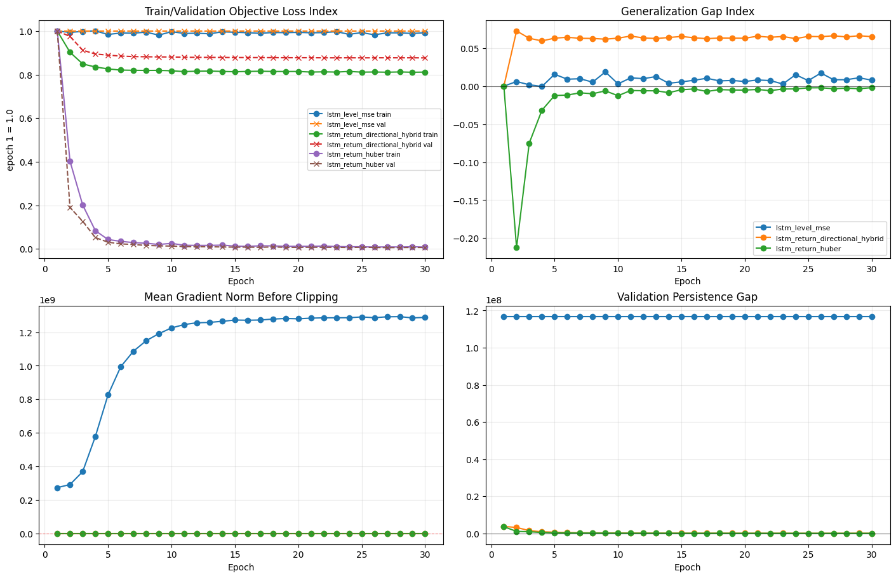
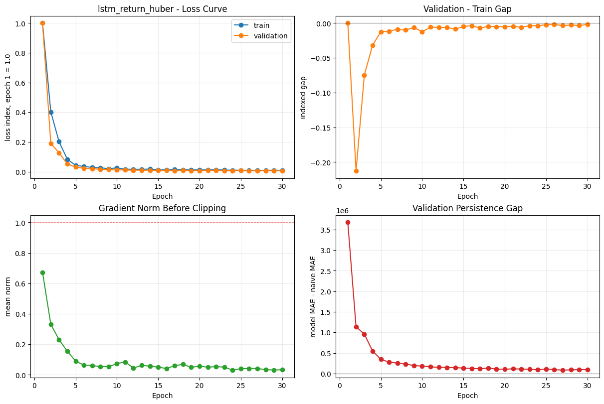
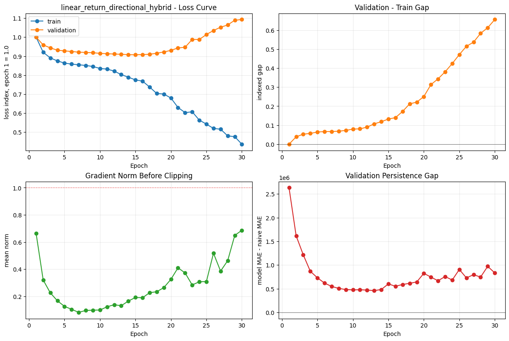
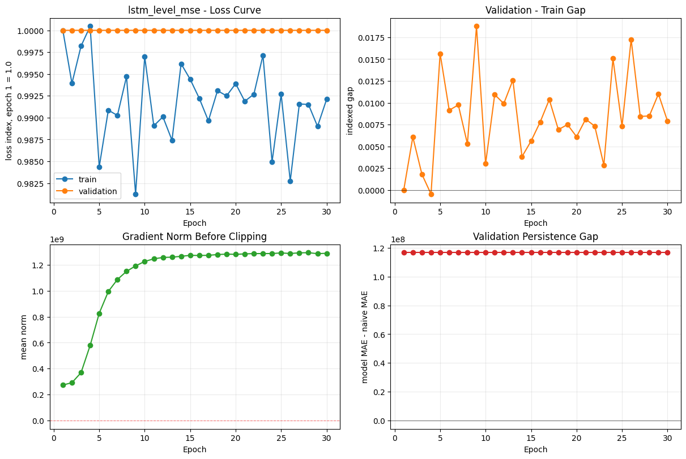
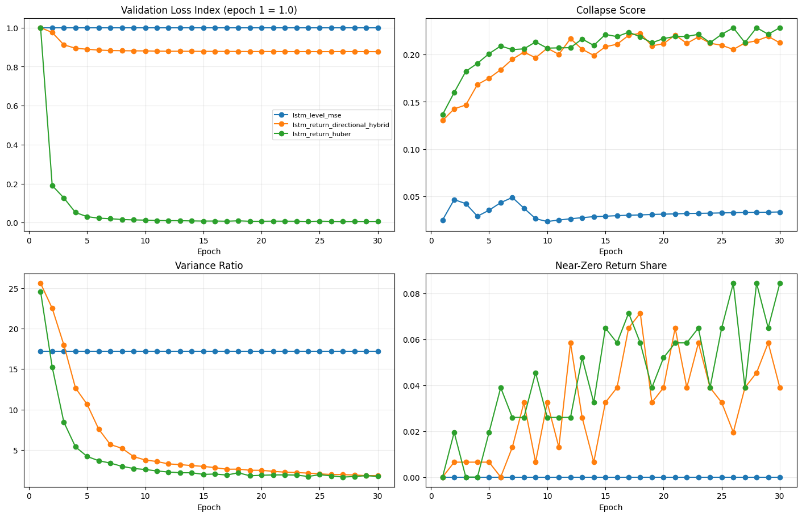

# 5. 최적화 학습 과정 진단 보고서

## 초록

- 문제: 비정상 업비트 시계열에서 loss는 줄어도, 예측이 직전가 복사나 0 수익률 근처로 붕괴할 수 있다.
- 방법: `LSTM` 기준으로 `level_mse`, `return_huber`, `directional_hybrid`를 비교하고, loss curve, gap, gradient, persistence gap, collapse score를 함께 봤다.
- 결과: 가장 덜 나쁜 후보는 `lstm_return_huber` 이지만, `persistence_gap`이 여전히 양수라 실전 채택은 아니다.
- 의미: 이번 실험은 성능 순위표가 아니라, objective와 target이 잘못된 쉬운 해로 빠지는지 확인하는 진단 단계다.

### 초록 해석

- train loss 하락만으로는 충분하지 않다. validation, persistence baseline, direction 모두 같이 봐야 한다.
- 이번 결과는 일부 objective가 학습되긴 했지만, 아직 예측력보다 최적화 흔적이 더 강하다.
- 따라서 다음 단계는 독립변수 확대보다 target, loss, head 재조정이 먼저다.

## 1. 서론

### 1.1 왜 이 실험이 필요한가

비정상 금융 시계열은 loss만 줄여서는 답이 안 나온다. 모델이 겉으로는 학습되는 것처럼 보여도, 실제로는 직전가 복사나 0 수익률 예측 같은 쉬운 해로 붕괴하기 쉽다.
그래서 이번 실험은 성능 순위를 뽑는 단계가 아니라, 어떤 objective가 잘못된 쉬운 해를 허용하는지 먼저 확인하는 진단 단계다.

### 1.2 이 실험이 풀려는 문제

현재 연구는 독립변수 확장과 예측 성능 개선이 목적이지만, objective가 잘못되면 변수만 늘려도 모델은 계속 무너진다. 그래서 먼저 loss, head, architecture가 안전한지 봐야 한다.
즉, 이 실험은 `무슨 모델이 최고냐`보다 `어디서 잘못 무너지는지`를 찾기 위한 것이다.

### 1.3 연구 질문

- raw next-close 회귀가 copy-risk를 키우는가
- return target + Huber가 평평한 해를 덜 허용하는가
- directional hybrid가 0 수익률 붕괴를 줄이는가
- 같은 objective에서도 Linear, LSTM, GRU의 붕괴 양상이 다른가

### 1.4 해석 기준

- train loss가 내려가도 validation이 0보다 위에서 멈추면 일반화가 약하다.
- persistence gap이 0보다 위면 naive persistence보다 못하다.
- sign agreement가 0.5 근처면 방향성 우위가 거의 없다.
- collapse score는 보조 지표일 뿐, 단독 결론은 아니다.

## 2. 방법론

### 2.1 실행 설정

- Suite: `quick_probe`
- Feature set: `optimization_probe`
- Feature count: `6`
- Sequence length: `32`
- Epochs: `30`
- Max rows: `35040`
- Max windows: `1024`
- Window stride: `4`
- Result directory: `test/results`
- Image directory: `test/images`
- Save artifacts: `False`
- Save CSV: `False`

### 2.2 데이터 및 처리 조건

아래 조건은 이번 최적화 진단이 어떤 데이터에서 수행되었는지 설명한다. 손실함수만 보는 것이 아니라, 데이터 기간과 분할 구조를 함께 봐야 학습 곡선의 의미를 해석할 수 있다.

- DuckDB 경로: `data/upbit_data.db`
- 가격 테이블: `btc_15m_advance`
- 티커 필터: `ALL`
- 사용 행 수: `17,181`
- 종목 수: `1`
- 기간: `2025-12-15 15:00:00` ~ `2026-06-12 23:45:00`
- 입력 변수 수: `6`
- 입력 변수: `log_return_1, return_4, realized_vol_16, hl_range_pct, volume_z_96, spread_proxy`
- 시퀀스 분할: train `716`, validation `154`, test `154`

### 3.1 기초 통계량

| 항목 | 값 | 해석 |
| --- | ---: | --- |
| Close 평균 | 113,379,749.8399 | 가격 레벨의 중심 크기 |
| Close 표준편차 | 13,110,598.7898 | 가격 레벨의 변동 폭 |
| Close 최소값 | 89,250,000.0000 | 분석 구간 내 최저 가격 |
| Close 중앙값 | 111,984,000.0000 | 극단값 영향을 줄인 중심 가격 |
| Close 최대값 | 142,968,000.0000 | 분석 구간 내 최고 가격 |
| 다음 로그수익률 평균 | -0.00001871 | 다음 15분 변동의 평균 방향 |
| 다음 로그수익률 표준편차 | 0.00239308 | 다음 15분 변동성 크기 |
| 절대 로그수익률 평균 | 0.00155258 | 평균적인 1-step 변동 강도 |
| 상승 비율 | 0.4960 | 다음 봉이 상승한 비율, 0.5 근처면 방향 예측 난도 높음 |

### 2.3 방법론 및 진단 지표 정의

이 절은 결과를 보기 전에 각 지표가 무엇을 의미하는지 정의한다. 본 실험의 목적은 최종 수익률을 주장하는 것이 아니라, 손실함수와 모델 구조가 비정상 금융 시계열에서 어떤 방식으로 최적화되는지 진단하는 것이다.

### 2.3.1 Train/Validation Loss Curve

- 개념: epoch가 진행될 때 학습 데이터 손실(train loss)과 검증 데이터 손실(validation loss)이 어떻게 움직이는지 보는 기본 최적화 곡선이다.
- 사용 이유: 모델이 단순히 train 데이터만 외우는지, 아니면 보지 않은 validation 구간에서도 손실이 줄어드는지 확인하기 위해 사용한다.
- 정의: `train_loss = L(y_train, yhat_train)`, `validation_loss = L(y_val, yhat_val)`이며, 본 실험에서는 서로 다른 손실함수 스케일을 비교하기 위해 첫 epoch 값을 1.0으로 둔 loss index도 함께 본다.
- 해석 예시: train과 validation이 함께 하락하면 학습이 진행되는 것이다. train만 하락하고 validation이 정체되면 과적합 또는 쉬운 해로의 붕괴 가능성이 있다.
- 장점: 가장 직관적으로 최적화 과정의 수렴, 정체, 발산을 확인할 수 있다.
- 한계: 금융 시계열에서는 validation loss가 낮아도 방향성 또는 매매 가능성이 보장되지 않는다. 따라서 persistence gap, sign agreement 같은 보조 지표가 필요하다.

### 2.3.2 Generalization Gap

- 개념: validation loss와 train loss 사이의 차이다.
- 사용 이유: 학습 데이터에서는 좋아지지만 미래 구간에서는 좋아지지 않는 일반화 실패를 확인하기 위해 사용한다.
- 정의: `gap = validation_loss_index - train_loss_index`.
- 해석 예시: gap이 양수로 커지면 train 데이터에는 적응하지만 validation 구간에는 통하지 않는다는 뜻이다.
- 장점: 과적합 여부를 빠르게 볼 수 있다.
- 한계: train/validation 구간 자체가 regime shift를 포함하면 gap은 과적합뿐 아니라 시장 국면 변화의 신호일 수도 있다.

### 2.3.3 Gradient Norm Before Clipping

- 개념: 역전파 후 gradient clipping을 적용하기 직전의 gradient 크기다.
- 사용 이유: 손실함수 스케일이 너무 크거나 모델이 불안정해서 학습이 튀는지 확인하기 위해 사용한다.
- 정의: `||grad|| = sqrt(sum_i grad_i^2)`.
- 해석 예시: gradient norm이 계속 clipping 기준에 붙으면 손실 스케일 또는 target 스케일이 너무 공격적일 수 있다. 반대로 너무 작으면 학습 신호가 약하거나 평평한 해에 갇혔을 수 있다.
- 장점: loss curve만으로 보이지 않는 최적화 안정성을 확인할 수 있다.
- 한계: gradient norm이 안정적이라고 해서 예측력이 좋다는 뜻은 아니다. 안정적으로 잘못된 해에 수렴할 수도 있다.

### 2.3.4 Persistence Gap

- 개념: 모델의 절대오차가 단순 직전가 복사 기준보다 얼마나 나은지 보는 baseline 비교 지표다.
- 사용 이유: 금융 가격 레벨은 자기상관이 매우 강해서, 복잡한 모델이 실제로는 직전 가격을 베끼는 것보다 못한 경우가 많다.
- 정의: `persistence_gap = MAE(model_prediction, y_next) - MAE(current_price, y_next)`.
- 해석 예시: 값이 0보다 작으면 모델이 naive persistence보다 낫다. 0보다 크면 복잡한 모델을 썼지만 직전가 복사보다 못하다는 뜻이다.
- 장점: 가격 레벨 예측에서 발생하는 기만적 RMSE 착시를 방지한다.
- 한계: persistence baseline은 가격 레벨 기준이다. 방향성 전략이나 변동성 예측에서는 별도의 경제적 baseline도 함께 봐야 한다.

### 2.3.5 Collapse Score

- 개념: 모델이 예측 변동성을 잃거나, 0 수익률만 내거나, 직전 가격과 과도하게 붙는 쉬운 해로 도망가는 위험을 합친 보조 점수다.
- 사용 이유: 손실함수 최적화가 허용하는 가장 쉬운 해가 실제 예측이 아니라 평균/무변화/복사일 수 있기 때문이다.
- 정의: 본 코드에서는 낮은 prediction variance, near-zero return share, copy alignment를 가중 결합한다.
- 해석 예시: 낮은 collapse score는 붕괴 위험이 작다는 뜻일 수 있지만, persistence gap이 양수라면 여전히 예측 모델로 채택하면 안 된다.
- 장점: 모델이 명백히 평평한 예측 또는 복사 예측으로 무너지는지 빠르게 확인할 수 있다.
- 한계: 단일 성능 지표가 아니다. collapse score만 낮다고 좋은 모델이 아니다.

### 2.3.6 Near-Zero Return Share

- 개념: 모델이 예측한 다음 수익률이 거의 0에 가까운 비율이다.
- 사용 이유: 수익률 예측 모델이 '다음에도 거의 안 움직인다'는 평균 해로 붕괴하는지 확인하기 위해 사용한다.
- 정의: `mean(abs(predicted_return) < 1e-4)`.
- 해석 예시: 이 값이 높으면 모델이 가격 변동을 예측하기보다 무변화 예측으로 손실을 낮추고 있을 가능성이 있다.
- 장점: 수익률 target에서 평균 수렴/무변화 예측을 탐지하기 쉽다.
- 한계: 실제 시장이 저변동 구간이면 near-zero 비율이 높게 나올 수 있으므로, realized volatility와 함께 해석해야 한다.

### 2.3.7 Sign Agreement

- 개념: 예측한 가격 변화 방향과 실제 가격 변화 방향의 부호가 일치한 비율이다.
- 사용 이유: 가격 오차가 작아도 상승/하락 방향을 못 맞히면 트레이딩 관점에서 유효성이 낮기 때문이다.
- 정의: `mean(sign(predicted_delta) == sign(actual_delta))`.
- 해석 예시: 0.5 근처면 동전 던지기 수준이다. 유의미한 매매 신호로 보려면 수수료와 슬리피지를 넘는 방향성 우위가 필요하다.
- 장점: 가격 레벨 RMSE의 착시를 보완한다.
- 한계: 방향만 맞고 크기를 틀리면 실제 손익은 나쁠 수 있다.

### 2.3.8 알고리즘 가족 설명

- `Linear`: 입력 윈도우를 한 번에 펴서 가장 단순한 선형 조합으로 예측한다. 장점은 빠르고 해석이 쉬우며, 단점은 시계열 순서 정보를 거의 직접 쓰지 못한다는 점이다.
- `LSTM`: 과거 상태를 게이트로 누적하는 순환 구조다. 장점은 시계열의 순서를 기억할 수 있다는 점이고, 단점은 데이터가 적거나 objective가 거칠면 쉽게 평평한 해로 수렴할 수 있다는 점이다.
- `GRU`: LSTM보다 게이트가 단순한 순환 구조다. 장점은 더 가볍고 빠르게 학습된다는 점이며, 단점은 경우에 따라 복잡한 장기 의존성을 덜 잡을 수 있다는 점이다.
- 이번 실험에서 `Linear`/`LSTM`/`GRU`를 함께 두는 이유는, 복잡도가 높을수록 항상 좋은 것이 아니라는 점을 확인하기 위해서다. 같은 objective에서도 아키텍처가 다르면 붕괴 방식이 달라질 수 있다.

## 3. 결과

### 3.1 전체 그림 먼저 읽기

아래 그림은 전체 케이스를 한 번에 비교하기 위한 요약 그림이다. 이 그림만 보면 `누가 loss를 줄였나`는 보이지만, 아직 `왜 그게 좋은가`는 안 보인다. 그래서 학습 곡선 뒤에 일반화 갭, baseline 비교, 붕괴 지표를 같이 붙였다.

노트북 출력 셀에 표시되는 `training_figure`를 먼저 확인한다.

이 그림은 전체 케이스의 학습 안정성, 일반화 갭, gradient 안정성, persistence baseline 대비 위치를 한 번에 본다.

### 3.2 그래프별 축과 해석 기준

- `Train/Validation Objective Loss Index`: x축은 epoch, y축은 1번째 epoch의 손실을 1.0으로 둔 상대 손실이다. 왼쪽 위 패널이다. 0보다 아래로 내려가는 개념은 아니고, 기준 epoch 대비 얼마나 줄었는지 본다.
- `Validation - Train Gap`: x축은 epoch, y축은 validation 손실 지수에서 train 손실 지수를 뺀 값이다. 오른쪽 위 패널이다. 0보다 위면 validation이 train보다 나쁘다는 뜻이고, 0보다 아래면 validation이 더 좋거나 구간 차이가 있다는 뜻이다.
- `Gradient Norm Before Clipping`: x축은 epoch, y축은 gradient clipping 직전의 평균 gradient norm이다. 왼쪽 아래 패널이다. 값이 너무 크면 업데이트가 거칠고, 너무 작으면 학습 신호가 약하다.
- `Validation Persistence Gap`: x축은 epoch, y축은 `모델 MAE - 직전가 복사 naive MAE`이다. 오른쪽 아래 패널이다. 0보다 위면 naive copy보다 못하고, 0보다 아래면 baseline보다 낫다.
- 왼쪽 위는 학습 여부, 오른쪽 위는 일반화 여부, 왼쪽 아래는 최적화 안정성, 오른쪽 아래는 naive baseline 돌파 여부다.

### 3.3 현재 결과를 읽는 핵심 기준

- train loss만 내려가고 validation loss가 0보다 위에서 평평하면, 모델은 학습 데이터에는 반응하지만 미래 구간 일반화에는 실패한 것이다.
- validation loss가 거의 움직이지 않으면, 현재 손실함수/입력 구성이 가격 변동의 유효한 곡률을 제공하지 못한다는 뜻이다.
- persistence gap이 0보다 위에 머물면, 모델이 복잡한 신경망임에도 단순 직전가 복사보다 예측력이 낮다.
- 따라서 이 실험에서는 `loss가 낮다`보다 `validation이 내려가는가`, `gap이 0 아래로 가는가`, `persistence gap이 0 아래로 가는가`를 우선한다.

### 3.4 그래프가 애매해 보일 때 해석

- loss는 내려가는데 다른 그래프가 튀면, 모델이 최적화는 하고 있지만 그 신호가 안정적으로 예측력으로 이어지지 않는 상태다.
- collapse score나 zero share가 좋아 보여도 persistence gap이 0보다 위면, 여전히 baseline보다 못한 학습이다.
- sign agreement가 0.5 부근이면 방향성은 아직 약해서, 값의 크기보다 방향만 보는 전략도 조심해야 한다.
- gradient norm이 들쑥날쑥하면 objective scale이 거칠거나 입력 스케일이 아직 충분히 정돈되지 않았을 수 있다.

### 3.5 모델별 학습 곡선

각 모델/손실함수 조합을 분리해서 본 그림이다. 이전 2번 실험의 모델별 loss curve처럼, 여기서는 최적화 과정만 빠르게 확인하기 위해 케이스별로 분리했다.
아래 각 패널은 모두 같은 읽는 법을 따른다. 왼쪽 위는 loss가 내려가는지, 오른쪽 위는 train과 validation의 차이가 0보다 위로 커지는지, 왼쪽 아래는 gradient가 과하게 튀는지, 오른쪽 아래는 직전가 복사 baseline을 이기는지 본다.

#### 3.5.1 lstm_return_huber

이 케이스는 return target에 Huber loss를 적용했을 때 학습 곡선이 얼마나 안정적으로 내려가는지 보여준다.
- 알고리즘 해설: LSTM은 과거 상태를 기억하는 능력이 있어 시계열 정보를 더 잘 쓸 수 있지만, 데이터가 적거나 loss가 거칠면 쉽게 평평한 해로 수렴할 수 있다.
- 손실함수 해설: Huber는 큰 outlier에 덜 민감해서, 비정상 구간에서 학습을 조금 더 부드럽게 만들 수 있다.
이 케이스의 그림은 노트북 출력 셀의 모델별 figure로 표시된다.

- 왼쪽 위: train/validation loss가 함께 내려간다. 즉, 학습은 실제로 됐다.
- 오른쪽 위: validation이 train보다 조금 더 낮거나 비슷한 구간이 보이지만, 이것이 곧 예측력 우위라는 뜻은 아니다.
- 왼쪽 아래: gradient는 빠르게 낮아진 뒤 안정화됐다. 즉, 학습은 거칠지 않다.
- 오른쪽 아래: persistence gap이 0보다 위다. 즉, naive copy보다 아직 못하다.
- 현재 test 기준 persistence gap: `91703.421875`. 좋지 않다.
- 현재 sign agreement: `0.5130`. 거의 동전 던지기라 방향성 이득도 약하다.

#### 3.5.2 lstm_return_directional_hybrid

이 케이스는 값 예측과 방향성 penalty를 함께 둘 때 최적화가 어떻게 달라지는지 보여준다.
- 알고리즘 해설: LSTM은 과거 상태를 기억하는 능력이 있어 시계열 정보를 더 잘 쓸 수 있지만, 데이터가 적거나 loss가 거칠면 쉽게 평평한 해로 수렴할 수 있다.
- 손실함수 해설: directional hybrid는 값 예측에 방향성 penalty를 얹어, 0 수익률로 도망가는 쉬운 해를 줄이려는 설계다.
이 케이스의 그림은 노트북 출력 셀의 모델별 figure로 표시된다.

- 왼쪽 위: train/validation loss가 함께 내려간다. 즉, 최적화는 됐다.
- 오른쪽 위: gap이 0보다 위에서 유지된다. 즉, train과 validation 사이 거리는 아직 있다.
- 왼쪽 아래: gradient는 안정적으로 작다. 즉, 학습은 거칠지 않다.
- 오른쪽 아래: persistence gap이 0보다 위다. 즉, naive copy보다 못하다.
- 현재 test 기준 persistence gap: `111651.218750`. 좋지 않다.
- 현재 sign agreement: `0.5000`. 방향성 우위가 사실상 없다.

#### 3.5.3 lstm_level_mse

이 케이스는 가격 레벨을 직접 맞추는 통제군으로서, 복사형 shortcut 위험을 가장 강하게 드러낸다.
- 알고리즘 해설: LSTM은 과거 상태를 기억하는 능력이 있어 시계열 정보를 더 잘 쓸 수 있지만, 데이터가 적거나 loss가 거칠면 쉽게 평평한 해로 수렴할 수 있다.
- 손실함수 해설: MSE는 큰 오차를 강하게 벌주므로, 가격 레벨 회귀에서는 복사형 해를 밀어낼 수도 있지만 scale에 민감하다.
이 케이스의 그림은 노트북 출력 셀의 모델별 figure로 표시된다.

- 왼쪽 위: loss는 거의 안 내려간다. 즉, 현재 objective가 이 데이터에서 힘을 못 쓴다.
- 오른쪽 위: gap이 0보다 위에서 흔들린다. 즉, 일반화가 약하다.
- 왼쪽 아래: gradient가 매우 크다. 즉, 업데이트가 거칠다.
- 오른쪽 아래: persistence gap이 0보다 훨씬 위다. 즉, naive copy보다 크게 못하다.
- 현재 test 기준 persistence gap: `105428601.343750`. 매우 나쁘다.
- 현재 sign agreement: `0.4091`. 방향성도 뒤진다.

## 4. 붕괴 진단과 표 해석

아래 그림은 학습 곡선 자체가 아니라, 모델이 쉬운 해로 붕괴하는지를 보조적으로 확인하기 위한 그림이다.

노트북 출력 셀에 표시되는 `collapse_figure`를 보조적으로 확인한다.

이 그림은 loss만 줄어드는 것처럼 보여도 실제로는 prediction variance가 사라지거나 near-zero return으로 도망치는지 함께 본다.

### 4.1 보조 지표 설명

- `Collapse Score`: 예측 변동성이 사라지거나, 0 수익률만 내거나, 직전 가격과 지나치게 붙는 현상을 합친 붕괴 위험 점수다. 낮을수록 좋지만 단독으로 모델을 고르면 안 된다.
- `Variance Ratio`: 실제 가격 변화 표준편차 대비 예측 가격 변화 표준편차다. 0에 가까우면 평평한 예측으로 붕괴한 것이고, 너무 크면 과도하게 흔들리는 예측이다.
- `Near-Zero Return Share`: 예측한 다음 수익률이 거의 0에 가까운 비율이다. 높으면 모델이 '다음에도 거의 안 움직인다'는 쉬운 답으로 도망간 것이다.
- `Persistence Gap`: 이 값이 양수이면 모델이 단순 직전가 복사보다 못하다는 뜻이다. 이 실험에서는 가장 중요한 방어선이다.
- `Naive persistence`: 다음 시점을 '지금 가격과 거의 같다'고 보는 가장 단순한 baseline이다. 예를 들어 지금 BTC가 1억 원이고 다음 값도 거의 1억 원이면, 직전가 복사도 꽤 잘 맞는다. 그 baseline보다도 못하면 복잡한 모델이라도 쓸 이유가 약하다.

### 4.2 그래프가 왜 튀어 보이나

- 어떤 케이스는 loss가 줄어들어도 variance_ratio가 높거나 zero_share가 낮아서 '겉보기엔 괜찮지만 실제론 baseline을 못 넘는' 상태가 된다.
- 반대로 collapse score는 낮지만 sign agreement가 0.5 근처면, 무너진 예측은 아니어도 방향 신호가 약하다.
- 따라서 세 그래프를 같이 봐야 한다: loss는 학습 여부, collapse는 쉬운 해 여부, sign agreement는 방향성 여부를 말한다.

### 4.3 지표 요약

이 표는 마지막 epoch 기준으로 학습 곡선이 어디에 도달했는지 요약한다. 숫자 자체보다, 숫자가 `좋다`와 `나쁘다`를 어떻게 말하는지 읽어야 한다.

| Case | Train loss index | Val loss index | Grad norm first->last | Collapse first->last | Persistence gap first->last |
| --- | ---: | ---: | ---: | ---: | ---: |
| lstm_level_mse | 0.9921 | 1.0000 | 272970144.0000->1288588810.6667 | 0.0248->0.0333 | 116682439.6875->116682423.6875 |
| lstm_return_huber | 0.0082 | 0.0063 | 0.6726->0.0333 | 0.1365->0.2286 | 3674269.1875->94434.2812 |
| lstm_return_directional_hybrid | 0.8114 | 0.8766 | 1.1334->0.0626 | 0.1301->0.2125 | 3797656.1875->127384.7812 |

### 4.4 현재 진단상 가장 덜 나쁜 후보

아래 후보는 `diagnostic_score` 기준의 상대 순위다. 이 값은 `좋다`는 뜻이 아니라 `덜 나쁘다`는 뜻이다. 모든 케이스의 persistence gap이 양수이면 최종 채택이 아니라 추가 수정 대상으로만 본다.

- Case: `lstm_return_huber`
- Algorithm: `lstm`
- Objective: `huber`
- Diagnostic score: `1.5574`
- Collapse score: `0.2090`
- Persistence gap: `91703.421875`
- Persistence ratio: `1.5614`
- Variance ratio: `1.4360`

중요: 모든 케이스에서 `persistence_gap > 0`이면, 이 실험은 `성공한 모델 선정`이 아니라 `현재 목적함수/입력 구성으로는 아직 최적화가 부족하다`는 진단으로 해석한다.

### 4.5 이 표를 어떻게 읽나

- `train loss index`가 1에 가깝고 `val loss index`도 1에 가깝다면, 거의 학습이 안 된 것이다.
- `train loss index`만 내려가고 `val loss index`가 1보다 덜 내려가면, train만 외운 상태다.
- `persistence gap`이 0보다 위면, 숫자가 예쁘더라도 naive copy보다 못한 것이다.
- `sign agreement`가 0.5 근처면 방향성 이득이 거의 없다.
- `collapse score`가 낮아도 위 지표가 나쁘면 실전 후보가 아니다.

## 5. 결론

이번 5번 실험 결론은 단순하다. 지금 모델들은 일부 학습 신호는 받았지만, 아직 직전가 복사 baseline을 안정적으로 못 넘는다. 그러니 `성공한 예측 모델`이 아니라 `문제가 어디서 생기는지 찾는 진단 단계`로 봐야 한다.

즉, 이번 실험의 의미는 성능 숫자보다 더 앞에 있다. 어디서 objective가 쉬운 해로 굴러가는지, 어떤 아키텍처가 덜 무너지는지, 어떤 지표를 앞으로 계속 봐야 하는지 정리한 것이다.

다음 실행에서는 모델별 학습 곡선에서 validation loss가 실제로 0보다 아래로 이동하는지, gradient가 안정적인지, persistence gap이 0 아래로 접근하는지를 먼저 확인해야 한다.
만약 더 긴 데이터와 더 많은 epoch에서도 validation이 평평하고 persistence gap이 0보다 위면, 독립변수 추가보다 target 정의, loss scaling, baseline 대비 objective를 먼저 수정해야 한다.
