# 9번 전처리 진단 최종 보고서

## 1. 결론부터

9번 실험은 전처리만 바꾸어도 8번에서 나타난 두 실패 유형, 즉 `0수익률 평탄화`와 `출력 분산 폭주`가 완화될 수 있는지 확인했다. 실제 실행은 28개 전처리와 4개 모델을 조합한 112개 케이스였다.

가장 낮은 원화 MAE는 `PatchTSTLike + seasonal_diff16`의 약 227,412원이었다. 그러나 단순 기준선인 persistence MAE 약 190,608원보다 약 19.3% 컸다. 따라서 이번 실험에서도 persistence를 이긴 모델은 없었다.

그럼에도 다음 단계 방향은 이전보다 명확해졌다.

- `PatchTSTLike + seasonal_diff16`은 가격 오차가 가장 작은 후보였다.
- `PatchTSTLike + winsor_025`는 방향 정확도 약 55.45%로 상위 후보 중 방향 정보를 가장 많이 남겼다.
- `TimesNetLike`는 가격선이 persistence와 거의 겹쳐 보이지만 수익률 예측이 0 근처로 눌린 평탄화 사례였다.
- `AutoformerLike`는 실제보다 훨씬 큰 수익률을 장기간 예측하는 분산 폭주 사례였다.
- 전처리는 실패의 정도와 형태를 바꾸었지만, Huber 손실이 선택하는 쉬운 해 자체를 제거하지는 못했다.

따라서 10번은 전처리 종류를 더 늘리는 실험이 아니라, 9번에서 선별한 전처리를 고정하고 `손실함수의 목적`, `seed 재현성`, `validation-only ensemble`을 확인해야 한다.

## 2. 왜 9번을 수행했는가

8번에서는 14개 모델 모두 persistence를 이기지 못했다. 일부 모델은 예측을 0수익률 근처로 축소했고, 다른 모델은 실제보다 지나치게 큰 수익률을 출력했다.

이 결과만으로는 원인이 모델 구조인지, 극단값과 heavy-tail인지, 추세와 주파수 성분인지, 변동성 변화인지 구분하기 어려웠다. 9번에서는 모델을 무작정 추가하지 않고 같은 모델에 여러 전처리를 적용해 입력 표현이 실패 형태를 바꾸는지 확인했다.

## 3. 핵심 용어

### 3.1 Persistence

Persistence는 “다음 가격도 현재 가격과 같을 것”이라고 예측하는 가장 단순한 기준선이다.

현재 비트코인 가격이 1억 원이라면 다음 15분 가격도 1억 원이라고 예측한다. 수익률로 표현하면 다음 수익률을 항상 0%로 예측하는 것과 같다.

금융 가격은 인접한 시점끼리 매우 비슷하기 때문에 이 단순한 기준선도 강하다. 복잡한 모델은 persistence보다 MAE가 낮아야 직전 가격 복사 이상의 정보를 학습했다고 주장할 수 있다.

### 3.2 MAE와 copy-risk ratio

MAE는 예측 가격과 실제 가격의 차이를 절댓값으로 바꾼 뒤 평균낸 값이다. 이번 보고서는 KRW 원본 스케일 MAE를 사용하므로 “평균적으로 몇 원 틀렸는가”로 읽을 수 있다.

`copy-risk ratio`는 다음과 같이 계산한다.

```text
모델 MAE / persistence MAE
```

- 1 미만: 모델이 persistence보다 정확하다.
- 1: persistence와 같다.
- 1보다 큼: 복잡한 모델이 persistence보다 나쁘다.

이번 최선의 값은 1.193이었다. 이는 가장 좋은 모델도 persistence보다 약 19.3% 큰 오차를 냈다는 뜻이다.

### 3.3 0수익률 평탄화

실제 다음 수익률이 `+1.0%, -0.8%, +0.6%, -1.2%`처럼 움직이는데 모델이 `+0.02%, -0.01%, 0.00%, -0.02%`처럼 거의 0만 예측하는 현상이다.

가격 수준 그래프에서는 15분 변화가 작기 때문에 이 예측도 persistence와 거의 겹쳐 좋아 보일 수 있다. 하지만 수익률 그래프에서는 실제 파란 선이 위아래로 움직이는 동안 예측 주황 선은 0 근처의 가는 선으로 남는다. 이 경우 시장의 상승·하락 크기를 학습했다고 볼 수 없다.

### 3.4 예측 분산과 variance ratio

분산은 값이 평균에서 얼마나 넓게 퍼지는지를 나타낸다. `variance ratio`는 예측 수익률 분산을 실제 수익률 분산으로 나눈 값이다.

- 1에 가까움: 예측의 움직임 폭이 실제와 비슷하다.
- 0에 가까움: 예측이 평평해졌다.
- 1보다 매우 큼: 예측이 실제보다 과도하게 흔들린다.

분산이 실제와 비슷하다는 것은 필요한 조건이지만 충분한 조건은 아니다. 실제와 반대 방향으로 움직여도 분산은 비슷할 수 있기 때문이다.

### 3.5 방향 정확도

실제 다음 수익률과 예측 수익률의 양수·음수 부호가 같은 비율이다.

- 실제 상승을 상승으로, 실제 하락을 하락으로 예측하면 맞힌다.
- 약 50%는 동전 던지기와 비슷한 수준이다.
- 50%보다 조금 높더라도 여러 seed와 여러 시간 구간에서 반복되어야 의미가 있다.

## 4. 실행 환경과 데이터

| 항목 | 값 |
|---|---:|
| Python | 3.13.13 |
| PyTorch | 2.10.0+cu126 |
| CUDA | 12.6 |
| GPU | NVIDIA GeForce RTX 4090, 약 24GB |
| RAM | 약 15.53GB, 실행 시 가용 약 8.81GB |
| 자원 프로필 | `school_4090_15gb` |
| 데이터 테이블 | `btc_15m_advance` |
| 데이터 행 | 39,935 |
| 기간 | 2023-05-21 10:30 ~ 2024-07-11 11:30 |
| 수익률 표준편차 | 약 0.002240 |
| 수익률 첨도 | 약 22.204 |
| 결측 셀 | 0 |

수익률 첨도 22.204는 정규분포보다 중앙과 꼬리가 훨씬 뾰족하고 두껍다는 뜻이다. 대부분의 수익률은 0 근처에 몰리지만 드물게 큰 급등락이 나온다. 따라서 평균 오차만 줄이는 손실은 큰 변동을 포기하고 0 근처를 예측하는 쉬운 해를 선택하기 쉽다.

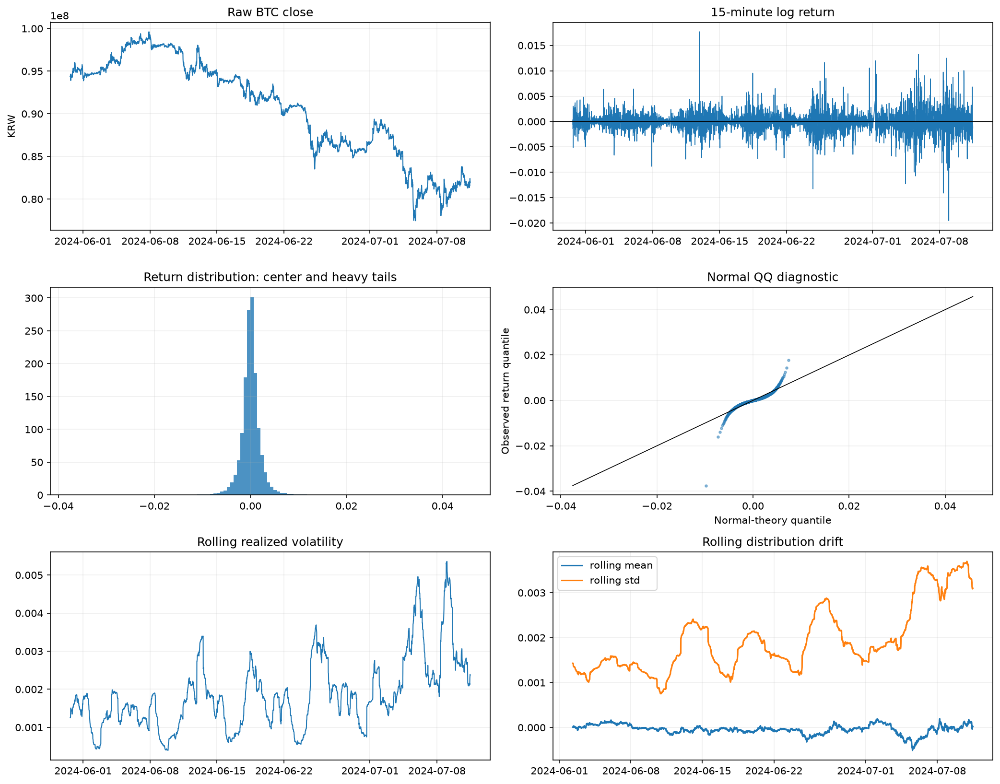

이 그림은 모델 결과를 보기 전에 입력 데이터가 어떤 문제를 가지고 있는지 설명하는 출발점이다. 사용한 데이터는 업비트 비트코인 15분봉이다.

왼쪽 위 `Raw BTC close`의 x축은 시간, y축은 원화 종가다. 가격이 약 1억 원 부근에서 8천만 원 부근까지 장기간 이동하므로 가격 수준이 일정한 평균 주변에 머물지 않는다는 점을 보여준다. 가격 수준을 그대로 목표로 사용하면 모델이 장기 추세나 직전 가격을 복사하는 쉬운 해를 선택할 수 있으므로, 본 실험에서는 다음 로그수익률을 목표로 사용했다.

오른쪽 위 `15-minute log return`의 x축은 시간, y축은 15분 로그수익률이다. 값이 0 위에 있으면 해당 15분 동안 상승했고, 0 아래에 있으면 하락했다는 뜻이다. 초반에는 진폭이 작지만 후반에는 위아래 폭이 커진다. 이는 같은 모델이라도 시기에 따라 입력 분포가 달라지는 변동성 군집 현상이다. 따라서 10번에서는 저변동 구간만 많이 본 모델이 고변동 구간을 무시하지 않도록 regime 균형 objective를 확인한다.

중앙 왼쪽 `Return distribution`의 x축은 수익률, y축은 해당 수익률 구간이 나타난 횟수다. 막대가 0 주변에 매우 높고 양 끝에 드문 큰 값이 남아 있다. 이 구조에서는 모든 예측을 0 근처에 두어도 다수의 평온한 구간에서 손실을 줄일 수 있다. TimesNetLike가 선택한 평탄화가 왜 가능한지 설명하는 데이터 근거다.

중앙 오른쪽 `Normal QQ diagnostic`은 x축에 정규분포라면 기대되는 분위수, y축에 실제 수익률 분위수를 둔다. 점이 검은 직선 위에 놓이면 정규분포와 비슷하다. 이번 점들은 중앙에서는 직선과 가깝지만 양 끝에서 크게 벗어난다. 이는 급등락이 정규분포 가정보다 자주 나온다는 뜻이다. 10번에서는 Huber 기준군과 tail 가중 objective를 함께 비교해 이 극단 구간을 무시하지 않는지 본다.

왼쪽 아래 `Rolling realized volatility`의 x축은 시간, y축은 최근 구간에서 계산한 실현 변동성이다. 오른쪽 아래 `Rolling distribution drift`는 x축이 시간이고, 파란 선은 이동평균, 주황 선은 이동표준편차다. 주황 선이 기간별로 크게 달라지는 모습은 수익률 분산이 고정되어 있지 않다는 뜻이다. 따라서 하나의 전역 분산 가정만 사용하는 대신 window normalization과 분산 보정 objective를 유지한다.

결국 이 데이터 진단은 “전처리를 많이 쓰자”는 결론이 아니라, 평탄화와 폭주가 모두 데이터 분포에서 자연스럽게 생길 수 있으므로 목표함수와 평가 기준이 두 실패를 동시에 구분해야 한다는 방향으로 이어진다.

## 5. 실제 실행 범위

실행된 suite는 `preprocessing_matrix`다.

- 모델: `Linear`, `PatchTSTLike`, `TimesNetLike`, `AutoformerLike`
- 전처리: 28개
- seed: 42
- hidden width: 96
- 손실함수: `return_huber`
- 정규화: `window_standard`
- epoch: 12
- 최대 window: 4,096
- 총 케이스: 112

시간 순서를 유지해 train 70%, validation 15%, test 15%로 나누었다.

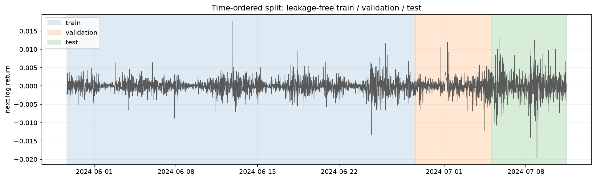

이 그래프는 모델이 어떤 시기를 보고 학습했으며 어느 시기를 처음 보는 데이터로 평가했는지를 설명한다. 데이터는 동일한 비트코인 15분 로그수익률이다. x축은 시간, y축은 다음 15분 로그수익률이다. 파란 배경은 train, 주황 배경은 validation, 초록 배경은 test다.

금융 시계열에서는 미래 데이터를 무작위로 과거 학습 구간에 섞으면 실제 운용에서 사용할 수 없는 정보를 미리 본 것과 같아진다. 그래서 시간 순서를 유지한 분할이 필요하다. 이번 그림에서는 test 구간의 수익률 진폭이 train 구간보다 크다. 모델은 상대적으로 조용한 구간을 더 많이 학습한 뒤 더 거친 시장을 맞혀야 했다.

이 차이는 결과 해석에 직접 연결된다. TimesNetLike처럼 0 근처를 예측하는 모델은 train의 다수 평온 구간에서는 손실을 쉽게 줄이지만 test의 큰 변동을 놓친다. AutoformerLike처럼 출력 진폭이 큰 모델은 고변동 구간을 따라가려다가 실제보다 훨씬 큰 움직임을 만들 수 있다. 따라서 10번에서는 validation 성능만으로 모델을 선택하되, 저변동·고변동 구간 손실을 나누어 기록하고 seed가 바뀌어도 같은 실패가 반복되는지 확인한다.

중요한 범위 제한이 있다. 9번 코드에는 `uncertainty_probe`와 `capacity_probe`가 준비되어 있지만, 현재 노트북 출력은 preprocessing matrix만 수행했다. 따라서 이번 결과만으로 seed 불확실성, conformal interval, Double Descent를 실증했다고 말하면 안 된다.

## 6. 상위 결과

| 순위 | 모델 | 전처리 | MAE(KRW) | persistence 대비 | 방향 정확도 | variance ratio | 해석 |
|---:|---|---|---:|---:|---:|---:|---|
| 1 | PatchTSTLike | seasonal_diff16 | 227,412 | 1.193 | 51.71% | 0.389 | 가장 낮은 MAE, 다만 persistence 미달과 분산 축소 잔존 |
| 2 | PatchTSTLike | frequency_bandpass | 233,318 | 1.224 | 49.76% | 0.341 | 오차 2위지만 방향은 우연 수준 |
| 3 | Linear | median_residual_5 | 233,583 | 1.225 | 50.24% | 0.353 | 단순 모델 중 최저 MAE, 분산 축소 |
| 4 | PatchTSTLike | linear_detrend+asinh_robust | 234,966 | 1.233 | 52.52% | 0.376 | 방향성은 소폭 양호, 분산은 작음 |
| 5 | PatchTSTLike | none | 238,178 | 1.250 | 51.22% | 0.408 | 전처리 없이도 일부 움직임 보존 |
| 7 | PatchTSTLike | winsor_025 | 240,822 | 1.263 | 55.45% | 0.486 | 상위권 중 방향 정확도 최고 |
| 14 | Linear | none | 246,196 | 1.292 | 55.45% | 0.600 | 방향·분산은 더 보존했지만 가격 오차 증가 |

모든 상위 케이스의 collapse score가 1이었다. 이번 score에서 copy-risk ratio가 0.95보다 크면 경고가 추가되므로, persistence를 못 이긴 모든 케이스가 최소 한 개의 붕괴 경고를 가진다.

## 7. 방향을 잡기 좋은 그래프

### 7.1 전체 copy-risk와 정보 보존

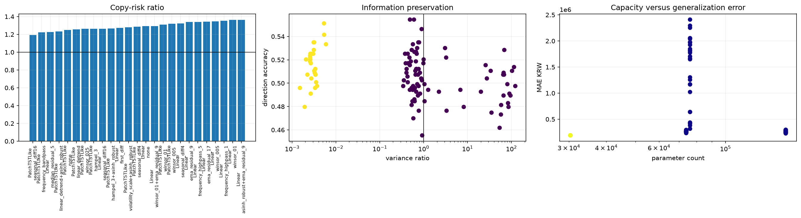

이 그림은 112개 조합을 개별적으로 읽기 전에 “통과 모델이 있는가”, “평탄화와 폭주가 어디에 모여 있는가”, “모델 크기가 성능을 자동으로 개선했는가”를 한 번에 판단하기 위한 종합 지도다. 점과 막대에는 Linear, PatchTSTLike, TimesNetLike, AutoformerLike와 28개 전처리 조합이 들어 있다.

왼쪽 `Copy-risk ratio`의 x축은 성능이 상대적으로 좋은 조합의 이름, y축은 모델 MAE를 persistence MAE로 나눈 값이다. 검은 수평선 1 아래로 내려가야 모델이 단순 직전가 예측을 이긴다. 하지만 가장 낮은 막대도 약 1.19이고 모든 막대가 1 위에 있다. 따라서 이번 전처리 탐색에서 최종 통과 조합은 없었다. 이 결과 때문에 10번은 전처리 후보를 더 늘리지 않고 objective를 바꾸는 단계로 넘어간다.

가운데 `Information preservation`의 x축은 variance ratio이며 로그 축이다. 1은 예측 변동 폭이 실제와 비슷하다는 뜻이고, 왼쪽으로 갈수록 예측이 평평해지며 오른쪽으로 갈수록 실제보다 크게 폭주한다. y축은 상승·하락 방향 정확도다. 0.5는 우연 수준이다. 이상적인 후보는 x축 1 근처이면서 y축이 0.5보다 반복적으로 위에 있어야 한다. 노란 점들은 x축 0.01 미만에 몰려 있어 수익률 움직임을 거의 버린 TimesNetLike 계열이다. 보라색 점들은 분산을 더 남겼지만 방향 정확도가 0.5 주변에 넓게 흩어져 있다. 이는 “움직임을 만들었다”와 “올바르게 움직였다”가 다른 문제임을 보여준다.

오른쪽 `Capacity versus generalization error`의 x축은 학습 파라미터 수, y축은 KRW MAE다. 점 하나는 모델·전처리 조합 하나다. 이번 실행은 hidden width를 바꾸지 않았기 때문에 x축에는 사실상 네 모델의 고정 크기만 나타난다. 이 그래프는 파라미터가 많은 모델이 자동으로 정확해지지 않았다는 점을 보여주지만, Double Descent를 검증하는 그래프로는 사용할 수 없다. Double Descent는 같은 모델의 width와 parameter count를 여러 단계로 바꾼 10번 이후 별도 capacity 실행에서 확인해야 한다.

### 7.2 전처리와 모델의 상호작용

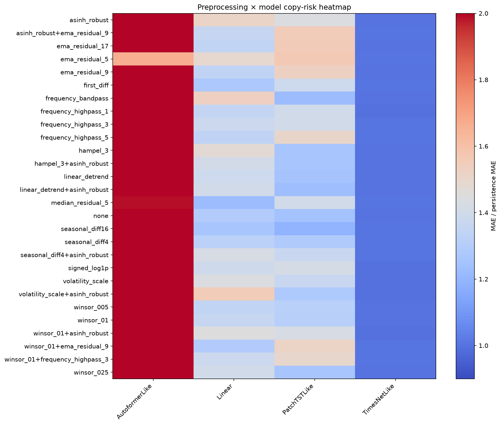

이 heatmap은 어떤 전처리가 모든 모델에 공통으로 좋은지, 아니면 모델 구조에 따라 효과가 달라지는지를 확인하기 위한 그림이다. y축은 28개 전처리, x축은 네 모델이다. 각 칸의 색은 해당 조합의 `MAE / persistence MAE`다. 파란색이 1에 가깝고 붉어질수록 persistence보다 오차가 크다. 1보다 작아야 진정한 통과지만, 색상 범위 하단이 약 0.9로 설정되어 있어 다른 지표와 함께 읽어야 한다.

AutoformerLike 열은 거의 모든 전처리에서 색상 상한 2에 걸린 붉은색이다. 즉 전처리를 바꾸어도 MAE가 persistence의 최소 두 배 수준에서 잘리지 않고 계속 나빴으며, 구조와 objective 사이의 문제가 입력 변환보다 강했다.

TimesNetLike 열은 파란색이라 얼핏 가장 좋아 보인다. 그러나 개별 수익률 그림에서는 예측이 0에 붙어 있다. persistence가 곧 0수익률 예측이므로, TimesNetLike는 새로운 신호를 학습해서 파란색이 된 것이 아니라 persistence와 비슷한 답을 출력해 파란색이 된 것이다. 이 열은 heatmap 하나만으로 모델을 선택하면 생기는 착시 사례다.

Linear와 PatchTSTLike 열은 전처리에 따라 색이 실제로 변한다. 이는 이 두 모델이 입력 표현의 영향을 받으며, 다음 실험에서 전처리 후보를 좁혀 objective 효과를 비교할 수 있다는 뜻이다. 특히 PatchTSTLike의 `seasonal_diff16`, `frequency_bandpass`, `linear_detrend+asinh_robust`, `winsor_025`와 Linear의 `median_residual_5`를 10번 후보로 넘긴다.

### 7.3 가장 낮은 MAE 후보

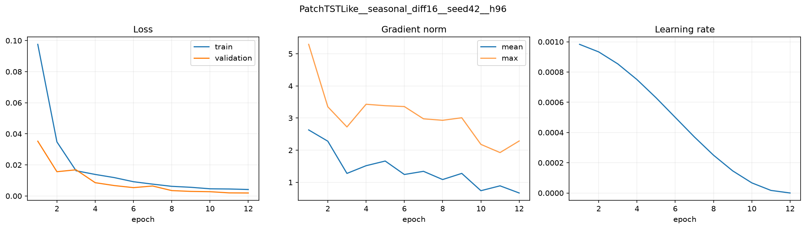

이 그래프는 `seasonal_diff16` 전처리를 적용한 비트코인 15분봉을 PatchTSTLike 모델에 입력한 학습 과정이다. Seasonal difference 16은 현재 입력에서 16개 15분봉 전, 즉 약 4시간 전 값과의 차이를 사용해 느린 수준 변화와 반복 성분을 줄이는 전처리다.

왼쪽 패널의 x축은 epoch, y축은 Huber loss다. 파란 선은 train, 주황 선은 validation이다. 두 선이 함께 내려가고 후반에도 validation이 크게 치솟지 않으므로 단순 과적합이나 학습 발산의 증거는 약하다.

가운데 패널의 x축은 epoch, y축은 gradient norm이다. 파란 선은 배치 평균, 주황 선은 최대값이다. 최대 기울기는 초반 약 5.3에서 후반 약 2 수준으로 내려간다. 기울기가 0으로 사라지지도 않고 무한히 커지지도 않았으므로, 이 후보의 남은 문제는 기울기 계산 실패보다 objective가 어떤 예측을 좋은 답으로 선택했는지에 가깝다.

오른쪽 패널의 x축은 epoch, y축은 learning rate다. Cosine scheduler에 따라 학습률이 0.001에서 0에 가깝게 줄어든다. 이 그림은 설정대로 최적화가 진행되었음을 확인하는 용도이며 성능 우위를 직접 증명하지는 않는다.

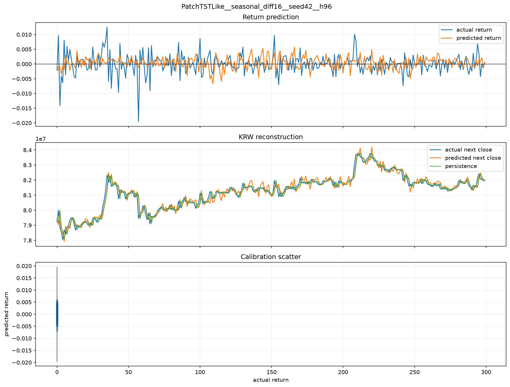

이 그림은 같은 `PatchTSTLike + seasonal_diff16` 모델의 test 예측이다.

위쪽 `Return prediction`의 x축은 test 구간의 순서 0~299, y축은 다음 15분 로그수익률이다. 파란 선이 실제, 주황 선이 예측이다. 예측은 TimesNetLike처럼 0에 붙어 있지 않고 양수와 음수를 오가므로 일부 움직임 정보를 보존한다. 그러나 실제의 큰 하락과 상승 봉우리를 축소하고, 여러 구간에서 반대 방향으로 움직인다. variance ratio 0.389는 실제 움직임 폭의 약 38.9%만 남겼다는 뜻이다.

중간 `KRW reconstruction`의 x축은 같은 test 시점 순서, y축은 다음 15분 원화 종가다. 파란 선은 실제 다음 종가, 주황 선은 모델 예측, 초록 선은 현재 가격을 그대로 사용한 persistence다. 주황 선이 초록 선에서 벗어나 새로운 변화를 시도하지만, 그 변화가 실제 파란 선보다 정확하지 않아 MAE 227,412원, copy-risk ratio 1.193을 기록했다.

아래 calibration scatter는 원래 x축이 실제 수익률, y축이 예측 수익률이어야 한다. 그러나 현재 코드의 공유 x축 문제 때문에 점들이 x=0 부근에 눌려 있어 이 패널은 해석에서 제외한다.

따라서 이 조합은 “최종 우승 모델”이 아니라 10번에서 objective를 바꿔 볼 첫 번째 후보이다.

### 7.4 방향 정보를 상대적으로 많이 남긴 후보

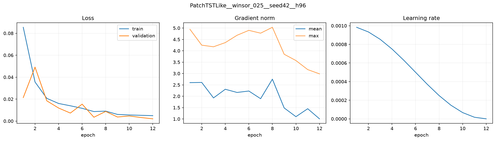

이 그래프는 입력 window의 양 끝 2.5% 값을 경계값으로 잘라 극단값의 영향력을 제한한 `winsor_025` 전처리와 PatchTSTLike 모델의 학습 과정이다.

왼쪽 패널의 x축은 epoch, y축은 train·validation Huber loss다. Validation loss가 2 epoch에서 일시적으로 올라가지만 이후 train과 함께 내려간다. 극단값을 잘랐다고 해서 validation이 완전히 매끄러워진 것은 아니며, 학습 초반에는 여전히 불안정성이 있다.

가운데 패널의 x축은 epoch, y축은 gradient norm이다. 최대값은 약 3~5 사이에서 움직이다 후반에 3 수준으로 내려간다. 수치적 폭발은 아니지만 seasonal_diff16 후보보다 기울기 변동이 크다. 오른쪽 learning-rate 패널은 같은 cosine schedule이 적용됐음을 보여준다.

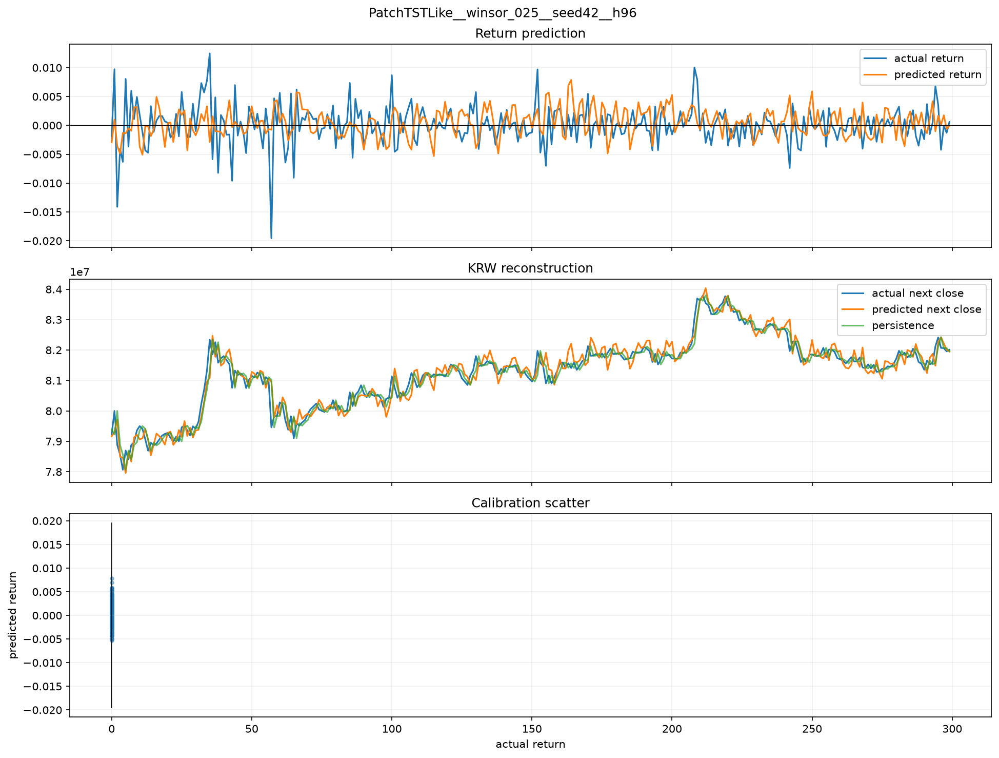

위쪽 패널의 x축은 test 시점 순서, y축은 다음 로그수익률이다. 주황 예측선은 실제 파란 선과 비슷한 빈도로 0 위와 아래를 오가며 방향 정확도 약 55.45%를 기록했다. 이는 이번 단일 seed에서는 우연 수준 50%보다 높다는 긍정적 신호다. 하지만 실제의 약 -2% 급락을 주황 선은 훨씬 작게 예측하고, 일부 구간에서는 실제와 반대 부호를 낸다.

중간 패널의 x축은 test 시점, y축은 다음 원화 종가다. 주황 예측선은 persistence에서 더 자주 벗어나지만 실제 파란 선을 정확히 따라가지 못한다. 그 결과 MAE는 약 240,822원으로 persistence보다 약 26.3% 크다.

즉 이 모델은 “상승·하락 방향을 일부 남겼다”는 장점과 “가격 변화 크기를 정확히 맞히지 못했다”는 단점이 동시에 있다. 10번에서는 이 후보에 방향성만 더 강조하는 것이 아니라 분산과 원화 오차를 함께 제한하는 balanced objective를 적용해야 한다.

이는 좋은 점과 나쁜 점이 함께 있는 후보다.

- 좋은 점: 평탄화가 덜하고 방향 정보가 남아 있다.
- 나쁜 점: 방향이 일부 맞아도 크기가 부정확해 원화 가격 오차가 크다.
- 다음 활용: 방향 항과 분산 보정 항을 포함한 objective 후보로 확인한다.

## 8. 좋지 않은 결과 그래프

### 8.1 TimesNetLike의 평탄화

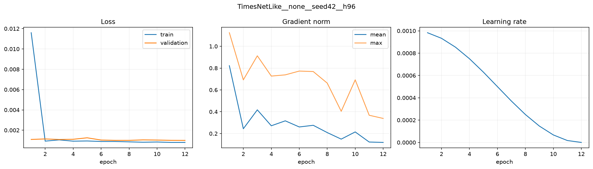

이 그래프는 별도 전처리를 적용하지 않은 `TimesNetLike + none` 학습 결과다. 입력은 window standard normalization된 정상성 중심 피처이며, 목표는 다음 15분 로그수익률이다.

왼쪽 패널의 x축은 epoch, y축은 Huber loss다. Train loss는 첫 두 epoch 안에 약 0.012에서 0.001 아래로 급락하고, validation loss는 약 0.001 부근에서 거의 평평하다. 이 그림만 보면 모델이 매우 빠르게 수렴하고 일반화도 안정적인 것처럼 보인다.

가운데 패널의 x축은 epoch, y축은 gradient norm이다. 평균과 최대 기울기가 작아지며 안정적인 범위에 있다. 오른쪽 learning rate도 계획대로 감소한다. 즉 최적화 과정 자체에는 뚜렷한 수치 오류가 없다.

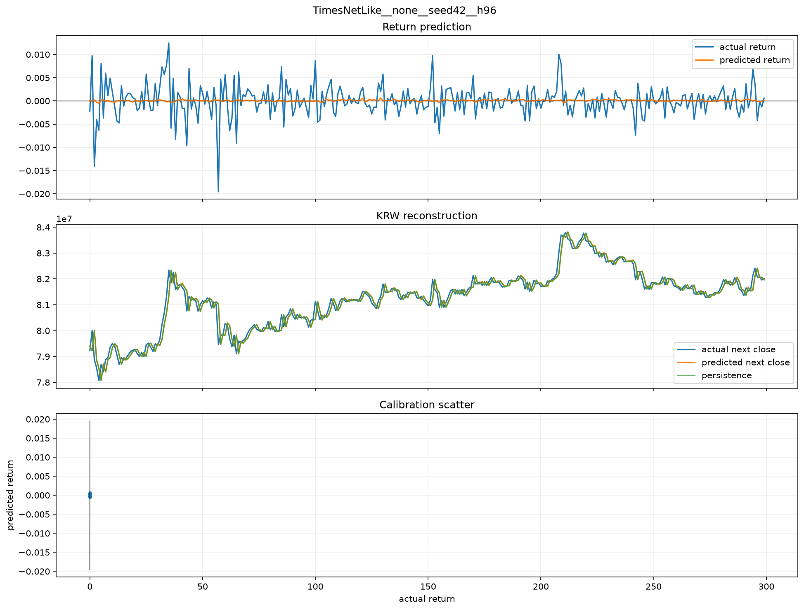

위쪽 패널의 x축은 test 시점, y축은 다음 로그수익률이다. 실제 파란 선은 약 -2%에서 +1% 사이를 움직이지만, 주황 예측선은 거의 0에 붙어 있다. 모델은 상승과 하락 크기를 학습한 것이 아니라 “대부분의 다음 변화는 작다”는 데이터 중심부만 선택했다.

중간 패널의 x축은 test 시점, y축은 원화 종가다. 주황 예측선과 초록 persistence 선이 거의 완전히 겹친다. 가격은 인접 시점끼리 비슷하므로 파란 실제선과도 가까워 보여 시각적으로 우수한 모델처럼 착각할 수 있다. 그러나 새로운 방향 신호를 만들지 않았으므로 연구 목표에는 부합하지 않는다.

이 결과를 10번에 반영하는 방법은 TimesNetLike를 우승 후보로 쓰는 것이 아니라 평탄화 통제군으로 유지하는 것이다. 분산 보정 objective를 적용했을 때 예측선이 0에서 벗어나면서도 MAE가 악화되지 않는지를 확인해야 한다.

이 사례는 “loss가 작고 가격 그래프가 실제와 겹친다”는 사실만으로 모델을 고르면 안 되는 가장 명확한 예다.

### 8.2 AutoformerLike의 분산 폭주

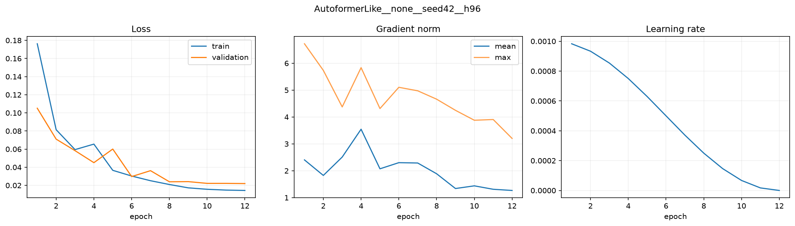

이 그래프는 별도 전처리를 적용하지 않은 `AutoformerLike + none` 학습 결과다. 목표와 정규화, optimizer는 TimesNetLike와 같다.

왼쪽 패널의 x축은 epoch, y축은 Huber loss다. Train loss는 약 0.18에서 0.014로, validation loss는 약 0.10에서 0.02 수준으로 감소한다. Loss만 보면 학습이 성공한 것처럼 보인다.

가운데 패널의 x축은 epoch, y축은 gradient norm이다. 최대 기울기는 초반 약 6.7에서 후반 약 3.2로 내려간다. 값이 크기는 하지만 무한대로 발산하지 않는다. 따라서 이 사례를 단순한 기울기 폭발이나 기울기 소실로 설명하기 어렵다. 오른쪽 패널은 동일한 cosine learning-rate 감소를 보여준다.

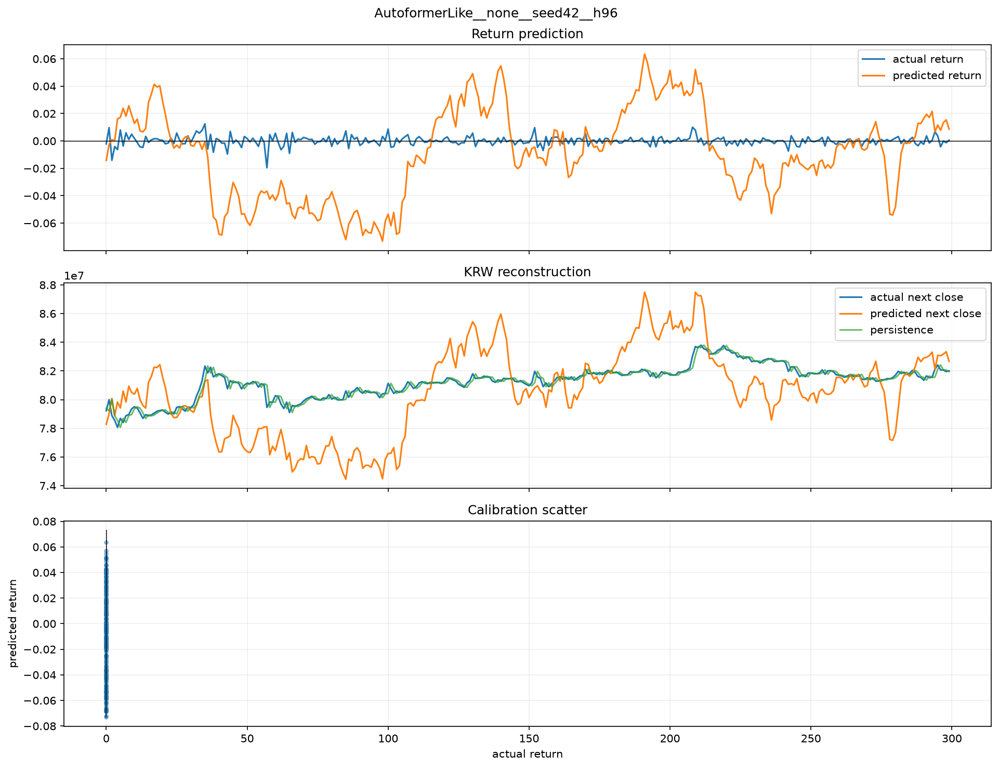

위쪽 패널의 x축은 test 시점, y축은 다음 로그수익률이다. 실제 파란 선은 대부분 -2%에서 +1% 사이인데, 주황 예측선은 약 -7%에서 +6%까지 움직인다. 더 큰 문제는 실제 수익률처럼 짧게 튀는 것이 아니라 수십 시점 동안 같은 방향의 큰 값을 유지한다는 점이다. 모델이 실제 단기 변동이 아니라 느린 가짜 파동을 출력하고 있다.

중간 패널의 x축은 test 시점, y축은 다음 원화 종가다. 주황 예측선은 실제와 persistence보다 수백만 원 위아래로 크게 이탈한다. loss가 감소했어도 최종 가격 예측은 사용할 수 없는 수준이다.

이 결과를 10번에 반영하는 방법은 AutoformerLike를 분산 폭주 통제군으로 유지하는 것이다. 대칭형 variance penalty와 correlation penalty가 가짜 장기 파동을 줄이는지 확인하고, 줄어들더라도 persistence보다 MAE가 낮아지는지를 별도로 확인한다.

이는 기울기 값이 무한대로 폭발한 문제가 아니라, 손실함수 아래에서 모델이 지나치게 큰 출력 변동을 허용하는 해를 선택한 사례다. 따라서 gradient clipping만 강화해서 해결될 문제로 보기 어렵고, 예측 분산을 목표 분산에 맞추는 objective가 필요하다.

## 9. 시각화에서 발견한 문제

각 예측 그림의 맨 아래 `Calibration scatter`는 현재 결론 근거로 사용하지 않는다.

코드에서 세 패널이 `sharex=True`로 묶여 있다. 첫 두 패널의 x축은 0~299 시점 인덱스인데, 산점도의 x축은 실제 수익률이어야 한다. 두 축이 공유되면서 실제 수익률 점들이 x=0 부근에 눌려 보인다.

10번에서는 패널별 x축을 분리하고 다음을 추가해야 한다.

- 실제 수익률 대 예측 수익률 산점도
- 45도 기준선
- Pearson/Spearman 상관
- 분산 비율과 회귀 기울기

## 10. 9번에서 확정할 수 있는 것과 없는 것

### 확정할 수 있는 것

- 28개 전처리만으로 persistence를 넘은 조합은 없었다.
- 전처리는 모델별 실패 형태와 정도를 바꾼다.
- PatchTSTLike는 전처리 변화에 반응하며 다음 objective 실험 후보가 되었다.
- TimesNetLike 평탄화와 AutoformerLike 폭주는 서로 다른 실패 유형이다.
- loss 감소만으로 예측 품질을 판단하면 안 된다.

### 아직 확정할 수 없는 것

- seed가 바뀌어도 순위가 유지되는지
- conformal interval의 coverage와 width가 적절한지
- hidden width 변화에서 Double Descent가 나타나는지
- ensemble이 단일 모델보다 안정적인지

이번 실행은 단일 seed preprocessing matrix이므로 위 항목들은 10번 이후의 별도 실행으로 확인해야 한다.

## 11. 10번에 반영할 설계

10번은 다음처럼 좁힌다.

1. 입력 전처리 후보
   - `seasonal_diff16`: 최저 MAE 후보
   - `frequency_bandpass`: 두 번째 MAE 후보
   - `median_residual_5`: Linear 최저 MAE 후보
   - `linear_detrend+asinh_robust`: 방향성과 MAE 균형 후보
   - `winsor_025`: 방향 정확도 후보
   - `none`: 전처리 기준군
2. 모델
   - 주 실험: `Linear`, `PatchTSTLike`
   - 실패 통제군: `TimesNetLike`, `AutoformerLike`
3. Objective
   - Huber 기준군
   - 방향성
   - 분산 보존
   - 상관
   - tail 가중
   - regime 균형
   - anti-collapse
   - balanced composite
4. 실행 단계
   - objective screen
   - 실패 통제군 확인
   - seed 3개 재현성
   - validation-only ensemble
5. 통과 기준
   - copy-risk ratio 1 미만
   - variance ratio가 극단적으로 작거나 크지 않음
   - 방향 정확도가 여러 seed에서 우연 수준을 넘음
   - ensemble 구성에 test 결과를 사용하지 않음

## 12. 최종 판단

9번은 “어떤 전처리가 문제를 완전히 해결했는가”에 대한 답을 주지는 못했다. 대신 문제를 다음과 같이 분해했다.

- TimesNetLike: 오차를 줄이기 위해 움직임을 포기하는 평탄화
- AutoformerLike: 움직임을 과도하게 만드는 분산 폭주
- Linear/PatchTSTLike: 일부 방향과 분산을 남기지만 persistence보다 가격 오차가 큼

이제 연구 질문은 더 분명하다. 다음 단계는 전처리를 더 많이 추가하는 것이 아니라, 모델이 값 오차뿐 아니라 방향·분산·상관·tail 구간을 함께 학습하도록 objective를 설계하고, 그 결과가 seed와 ensemble에서도 재현되는지 확인하는 것이다.
