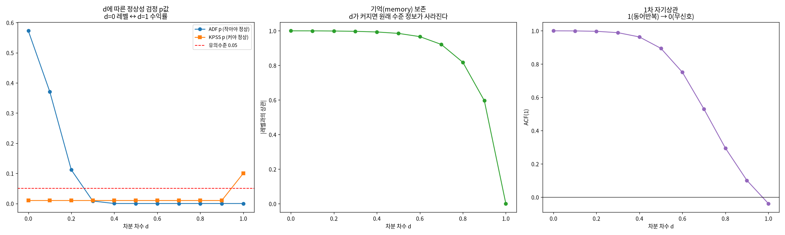
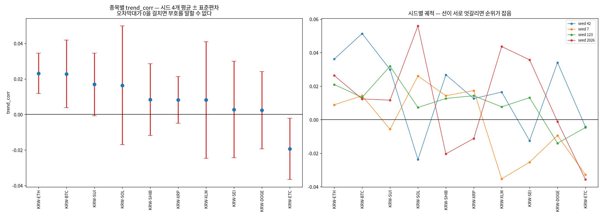

# 종합 보고서 — 차분 문제부터 재실행 검증까지 (2026-08-13 ~ 08-14)

브랜치 `stock` · 데이터 `upbit_krw_candle`(KRW 전 종목 269개 / 16,081,696행 / 2023-07 ~ 2026-07)
· 실행 환경 서버(RTX 4090 24GB) · 문헌 검증 arxiv MCP

> **이 문서의 목적**: 이번 작업에서 나온 모든 내용을 한 곳에 모아 렌더링으로 확인할 수 있게 한다.
> 세부 근거는 개별 보고서로 링크하고, 여기서는 **무엇을 발견했고 무엇이 바뀌는지**를 다룬다.
>
> 개별 문서: [18번 차분 결정](18_differencing_decision_report_20260814.md) ·
> [재실행 검증노트](18b_rerun_verification_20260814/verification_note.md) ·
> [17번 준비작업 그림](17_eda_prep_figures_report_20260810.md)

---

## 0. 한눈에 보기

이번 작업은 사용자 지적 하나에서 시작했다: *"비정상성 모델링을 하는 줄 알았는데 실제로는 차분해서
분석·모델링했고, 보고서에 차분 등 전처리가 전혀 없어서 제동이 걸렸다."*

확인한 결과 **지적이 정확했고**, 파고들면서 예상보다 큰 문제 세 개가 더 나왔다.

| # | 발견 | 영향 |
| ---: | :--- | :--- |
| 1 | 차분은 실험별 선택이 아니라 **엔진 최하층에 내장**돼 있었다 | 전 실험이 차분축. 문서에 없던 계보를 만들었다 |
| 2 | **레벨축 R²는 무모델과 실모델을 구별하지 못한다**(차이 0.0000001) | 평가축 선언이 필수. 척도-자유 지표 병기 |
| 3 | **GARCH 반감기·지속성은 식별되지 않는다**(표본에 따라 55배) | 교수님 브리프 정정 필요. 판정을 표본외 성능으로 교체 |
| 4 | **t8의 종목별 trend_corr는 시드 잡음이 신호보다 크다**(SNR 0.58, 부호 뒤집힘 7/10) | 종목 간 비교·순위 해석 전면 무효 |

**결론이 유지된 것**: "방향은 예측 불가, 크기(변동성)는 예측 가능"이라는 연구의 핵심 논지는
축 교정·재실행·다중시드를 모두 거쳐도 흔들리지 않았다. 무효화된 것은 **부수적 근거들**이다.

---

## 1. 사용자 질문에 대한 답 (먼저 정리)

### 1.1 S0~S6가 무엇인가 (17번 EDA의 섹션)

| 섹션 | 무엇을 하나 | 결과 |
| :--- | :--- | :--- |
| **S0** | `describe` — 규모·기간·결측·기초통계 | 104,734행, 결측 0 |
| **S1** | 4단 시계열 그림 ①종가(레벨) ②로그수익률(차분) ③롤링표준편차 ④거래량 | ①은 표류(비정상), ③은 변동성 군집 |
| **S2** | 히스토그램·QQ, 첨도·왜도 | 정규분포보다 훨씬 두꺼운 꼬리, 좌우 대칭 |
| **S3** | ACF/PACF를 **수익률 vs \|수익률\|** 두 세트로 | **핵심 그림.** 방향 −0.05→0.00 즉시 붕괴 / 크기 0.36→0.12 느린 감소 |
| **S4** | ADF·KPSS·ARCH-LM을 **레벨 vs 수익률** 양쪽에 | 레벨 명백 비정상 / 수익률 평균-정상·분산-비정상 |
| **S5** | 로그가격 STL 분해(추세·계절·잔차) | 레벨 변동은 대부분 저주파 추세 |
| **S6** | 파생변수 60개 × 4시간 타깃 상관·상호정보량 전수 | 가장 강한 것도 R² 미미 |

그림은 S1·S2·S3·S5·S6 다섯 장이고 **S4는 그림 없이 검정 표만** 있다.

### 1.2 S1은 레벨·차분을 둘 다 보여준다

①종가가 레벨, ②로그수익률이 차분이다. **그림·검정에서는 양쪽을 봤고 모델 학습만 차분축**이었는데,
그 구분이 문서에서 흐려진 것이 문제였다.

### 1.3 "레벨"이란 — 그 시점의 가격 그 자체

- **레벨**: "지금 얼마인가" (종가 1억 3천만 원, 그 숫자)
- **차분**: "직전 대비 얼마나 변했나" (+0.77%)

주의할 점 하나: **로그 변환은 차분이 아니다.** 단위를 바꾼 것(곱셈적 변동 → 덧셈적 변동)일 뿐이라
로그 종가도 여전히 비정상이다(ADF p=0.5727 실측). 순서는 이렇다.

```
종가(레벨) → log(종가)(여전히 레벨) → diff()(여기서 처음 차분) → 로그수익률
```

### 1.4 왜 BTC만 했나 — 4번에서 갈라졌고 데이터 교정 후에도 안 고쳐졌다

실험 드라이버 **10개가 전부** `default="btc_15m_advance"`였다(4·5·8·9·10·11·12·14·15·17번).
전종목 테이블을 쓰던 코드는 3·5·16번·`marts/historical_flow.py`·`pipelines/rebuild_price_mart.py`뿐이었다.

시간순으로 보면:

1. **3번**은 설계대로 다중 종목(명세서 "KRW 마켓 전수 조사")
2. **4번에서 단일 테이블이 기본값**으로 들어가고 5~15번이 계승
3. **2026-07-18 데이터 축 교정** — `upbit_krw_candle` 269종목 수집 완료
4. **그런데 코드 기본값은 교정되지 않았다** — 그 증거가 교정 *이후*에 만든 17번 EDA도 BTC 단일이었다는 점

### 1.5 git pull로는 데이터가 오지 않는다

DB는 `.gitignore`의 `*.db*`로 제외돼 있다(1.28GB DuckDB). 커밋된 건 빈 `.gitkeep`뿐이다.
다른 환경에서는 복사가 아니라 **재수집**해야 한다.

```bash
uv run pipelines/rebuild_price_mart.py --tickers all
```

### 1.6 반감기(half-life)란

큰 사건이 터지면 변동성이 뛰고 서서히 가라앉는다. **그 부풀어 오른 변동성이 절반으로 줄어드는
시간**이다. `α+β`(지속성)가 "직전 봉의 초과 변동성이 다음 봉에 얼마나 남는가"이므로
`반감기 = ln(0.5) / ln(α+β)`.

| α+β | 반감기 |
| ---: | ---: |
| 0.9500 | 3.4시간 |
| **0.9800** | **8.6시간** ← 브리프가 쓴 값 |
| 0.9900 | 17.2시간 |
| 0.9950 | 1.4일 |
| **0.9990** | **7.2일** ← 전체 데이터 실측 |
| 0.9999 | 72.2일 |

파라미터가 0.019 움직이는데 반감기는 **20배** 뛴다. `ln(α+β)`가 1 근처에서 0으로 붕괴하기
때문이다. 이것이 5절에서 반감기를 판정 기준에서 빼는 수학적 이유다.

---

## 2. 그동안 문서에 없던 전처리 계보

제동의 실제 원인. 코드에서 일어나는 변환은 3단계다.

| 단계 | 코드 위치 | 계열 | 평균 | 표준편차 | 최소 | 최대 |
| :--- | :--- | :--- | ---: | ---: | ---: | ---: |
| ① 원본 레벨 | `upbit_krw_candle.close` | 종가(KRW) | 106,042,913 | 38,419,597 | 34,171,000 | 179,810,000 |
| ② 로그 변환 | `data.py:120` `log_close` | log(종가) | 18.3968 | 0.4348 | 17.3469 | 19.0074 |
| ③ **1차 차분** | `data.py:121` `log_return_1` | 로그수익률 | 0.00000857 | 0.002386 | −0.112385 | 0.109872 |

- **예측 대상 자체가 차분값이다**: `data.py:133` `target_return = log_return_1.shift(-1)`
- `features.py`의 파생변수 60여 개도 대부분 이 위에 얹힌다
- `data.py:138`에 레벨 타깃(`target_close`)이 있으나 학습·평가에 쓰인 흔적은 없다

### 왜 문서에 없었나 — 정확한 형태

17번 S4가 레벨 vs 차분을 **이미 비교했고** 17번 보고서 3절이 이 질문에 답까지 했다. 그러나 그것은
*데이터 성질 진단*("레벨은 비정상, 수익률은 평균-정상")이었고 *우리 선택의 선언*("따라서 우리
타깃은 차분값이다")이 아니었다. 그래서 1~16번 보고서와 교수님 브리프에 전파되지 않았다.

즉 제동 원인은 **"차분 논의 부재"가 아니라 "진단이 계보로 승격되지 않은 것"**이다.
`AGENTS.md` 2.9b에 규칙으로 성문화했다.

---

## 3. 차분이 무엇을 바꾸는가 — 원인은 하나다

레벨 ACF(1) **0.9997** vs 차분 **−0.0381**. 이 하나가 세 곳에서 다르게 드러난다.
레벨의 자기상관 1은 정보가 아니라 **"어제와 오늘이 비슷하다"는 동어반복**이다.

### 3.1 진단이 뒤집힌다


| 계열 | ADF 통계량 | ADF p | KPSS 통계량 | KPSS p | ADF 판정 | KPSS 판정 | ACF(1) |
| :--- | ---: | ---: | ---: | ---: | :--- | :--- | ---: |
| 레벨 (d=0) | −1.420 | 0.5727 | 33.332 | 0.0100 | **비정상** | **비정상** | **0.9997** |
| 분수차분 d=0.3 | −3.492 | 0.0082 | 30.352 | 0.0100 | 정상 | **비정상** | 0.9887 |
| 분수차분 d=0.5 | −6.437 | 0.0000 | 27.978 | 0.0100 | 정상 | **비정상** | 0.8945 |
| 1차 차분 (d=1) | −29.560 | 0.0000 | 0.106 | 0.1000 | 정상 | 정상 | **−0.0381** |

ADF 귀무가설은 "단위근(비정상)", KPSS는 "정상" — **방향이 반대**다. statsmodels의 KPSS p는
[0.01, 0.10]으로 절단되므로 통계량을 함께 본다.

### 3.2 성과가 뒤집힌다 — 모델 고정, 평가축만 교체 (가장 중요)


무모델(직전값 복사)과 실모델(수익률 AR(1))을 각각 레벨축·차분축에서 평가했다.
네 조합 모두 **완전히 동일한 시점 집합**(뒤쪽 30%, 31,465행)을 본다.

| 모델 | 평가축 | R² | MASE |
| :--- | :--- | ---: | ---: |
| 무모델 (직전값 복사) | 레벨축 | **0.999871** | 1.0000 |
| 무모델 (직전값 복사) | 차분축 | **−0.000055** | 1.0000 |
| 실모델 (AR(1)) | 레벨축 | **0.999871** | 0.9978 |
| 실모델 (AR(1)) | 차분축 | **0.000461** | 0.9978 |

1. 아무것도 학습하지 않은 무모델이 레벨축에서 **R² 0.999871**을 받는다
2. **레벨축은 실모델과 무모델을 구별하지 못한다** — 두 R²의 차이가 **0.00000007**
3. 차분축에서만 구별된다(0.000461 vs −0.000055)
4. MASE는 축을 바꿔도 값이 같다(1.0000/0.9978) — 척도-자유 지표가 필요한 이유

> **차분 여부는 전처리 취향이 아니라 평가의 정직성을 결정하는 선언이다.**
> 레벨축으로 성적을 내면 R²·상관이 부풀고, 그 숫자로는 모델이 나아졌는지 알 수 없다.

### 3.3 전종목에서 재현된다


| 지표 | 상위 20종목 결과 |
| :--- | :--- |
| ACF(1) 레벨 | 평균 0.9995 (최소 0.9983) |
| ACF(1) 차분 | 평균 −0.1322 |
| 무모델 R² 레벨축 | 평균 0.999865 — **20/20 종목이 0.99 초과** |
| 무모델 R² 차분축 | 평균 −0.000004 |
| GARCH 지속성 | 레벨 입력 0.9994 vs 차분 입력 0.9838 |

17번 보고서 5절이 한계로 남긴 후속 항목 (a)를 이로써 닫는다.

---

## 4. GARCH 입력 — "미사용"이 아니라 "입력 오류"


동일한 추정기(scipy 정규 MLE, 외부 패키지 미사용)로 두 입력을 적합했다.

### 4.1 전제 위반의 직접 증거는 파라미터가 아니라 표준화 잔차다

| 입력 | 표준화 잔차 ACF(1) | Ljung-Box(20) p | 판정 |
| :--- | ---: | ---: | :--- |
| 레벨 (log 종가) | **0.9885** | 0.0000 | **자기상관 잔존 → 전제 위반** |
| 1차 차분 | **−0.0225** | 0.1038 | 백색잡음 → 전제 충족 |

GARCH는 분산만 다루고 평균의 표류를 다루지 않으므로, 레벨 입력에서는 평균의 자기상관이
0.9885로 거의 그대로 남는다. **"GARCH가 안 맞는다"는 판정을 레벨 입력으로 내려선 안 된다.**

### 4.2 지속성·반감기는 식별되지 않는다

| 표본 | α+β | 반감기(시간) |
| :--- | ---: | ---: |
| 전체 104,882 | 0.99895 | 165.1 |
| 최근 40,000 | 0.99823 | 97.6 |
| 최근 20,000 | 0.99966 | 511.2 |
| **최근 10,000** | **0.98168** | **9.4** |
| 앞 40,000 | 0.99959 | 423.2 |

**표본만 바꿔도 반감기가 9.4 ~ 511.2시간(55배) 요동한다.** 브리프의 "8.6시간"은 위 표의
"최근 10,000" 행과 거의 같다 — **틀린 계산이 아니라 재현되지 않는 추정**이다.

Kaur(2026)는 고베타 알트코인에서 **α+β=1의 EWMA/IGARCH가 유일하게 견고한 추정**이었고,
정상성(평균회귀)을 부과하면 5% VaR 하방위험을 **절반으로 과소평가**한다고 보고했다.
암호화폐에서 α+β→1은 고쳐야 할 결함이 아니라 데이터의 성질일 수 있다.

---

## 5. 그러면 GARCH를 쓸지 무엇으로 판정하나


학습 73,417행에서 추정하고 평가 31,465행은 **파라미터 고정 전진 필터링**(재적합 없음).
지표는 QLIKE = mean(log σ² + r²/σ²), **낮을수록 좋다**.

| 모델 | QLIKE | corr(예측σ, \|r\|) |
| :--- | ---: | ---: |
| **GARCH(1,1)** | **−11.5895** | 0.4452 |
| EWMA(α=0.06) | −11.5502 | 0.4245 |
| 롤링분산(96봉) | −11.4386 | 0.3523 |
| HAR-RV (일·주·월) | −11.4023 | 0.3478 |
| 상수분산 | −11.1836 | n/a |

### 5.1 horizon을 바꾸면 결론이 뒤집힌다 (결정적)

| horizon | GARCH(1,1) | HAR-RV | 최우수 | GARCH−HAR |
| :--- | ---: | ---: | :--- | ---: |
| h=1 (15분) | **−11.5809** | −11.3970 | GARCH | **+0.184** |
| h=16 (4시간) | **−11.4195** | −11.3418 | GARCH | **+0.078** |
| h=64 (16시간) | −11.2869 | **−11.3148** | **HAR-RV** | **−0.028** |

GARCH의 우위가 horizon과 함께 **단조 감소하다 16시간에서 역전**된다. B(변동성) 갈래의
target horizon이 정확히 4~16시간이므로 **교차점이 target 구간 안에 있다.**

### 5.2 판정 기준 (초안 수정판)

초안에서 지속성·반감기를 관문으로 두었으나, 4.2에서 식별되지 않음이 확인되어 관문에서 내렸다.

| # | 관문 | 기준 | 실측 | 판정 |
| ---: | :--- | :--- | ---: | :--- |
| 1 | 입력이 평균-정상인가 | ADF p < 0.05 | 0.0000 | 통과 |
| 2 | 표준화 잔차가 백색잡음인가 | \|ACF(1)\| < 0.1 | −0.0225 | 통과 |
| 3 | 조건부 이분산이 있는가 | ARCH-LM p < 0.05 | 0.0000 | 통과 |
| 4 | 표본외에서 베이스라인을 이기는가 | QLIKE < 롤링분산 | −11.5895 vs −11.4386 | 통과 |
| 5 | **target horizon에서도 이기는가** | QLIKE < HAR-RV @ 4~16h | h=16 통과, h=64 **탈락** | **부분** |
| — | ~~지속성 < 0.999~~ | ~~IGARCH 확인~~ | 식별 불가 | **제외** |
| — | ~~반감기가 horizon과 맞는가~~ | ~~같은 자릿수~~ | 55배 요동 | **제외** |

**적용 규칙**: ① 레벨축에서 판정하지 않는다 ② 파라미터로 판정하지 않는다(점추정 대신 범위 제시)
③ 판정은 표본외 QLIKE ④ **target horizon에서 판정** ⑤ 주기 성분(시간대/요일 eta² 각 약 2%) 사전 제거

**결론**: GARCH(1,1)은 관문 1~4를 통과하므로 **베이스라인으로 채택할 근거는 있다.** 그러나
관문 5가 부분 탈락이므로 **B 갈래의 기본 모델로 확정할 수 없다** — target horizon에서
장기기억 계열과 정면 비교한 뒤 정해야 한다.

---

## 6. 장기기억은 가격이 아니라 변동성에 있다


### 6.1 분수차분이란

1차 차분은 직전 값 **하나만** 뺀다. 분수차분은 그 "1번"을 실수 d로 일반화해 과거를
**가중치를 두고 조금씩** 뺀다. `(1−B)^d` 의 이항급수: `w₀=1, wₖ = −wₖ₋₁·(d−k+1)/k`.

- **d = 0** → 레벨 (비정상, 기억 100% 보존)
- **d = 1** → 지금 쓰는 로그수익률 (정상, 기억 소실)
- **0 < d < 1** → 정상성을 얻을 만큼만 빼고 장기기억은 남긴다

### 6.2 로그가격에는 중간지대가 없다



ADF만 보면 d=0.3부터 정상이지만 **KPSS는 d<1 전 구간에서 비정상**이라 한다. 두 검정이 동시에
통과하는 지점이 사실상 **d=1**이다 → 로그가격에는 "정상성은 얻고 기억은 남기는" 중간지대가 없다.

### 6.3 그런데 변동성 채널에는 강하게 있다

| 계열 | GPH d | 허스트 H | 판정 |
| :--- | ---: | ---: | :--- |
| 수익률 r (방향 채널) | **0.0754** | 0.5519 | 무기억에 가까움 |
| \|수익률\| (크기 채널) | **0.4037** | 0.8727 | **장기기억** |
| 로그 \|수익률\| | 0.3778 | 0.8784 | **장기기억** |
| 실현변동성(96봉) | 0.3407 | 0.8333 | **장기기억** |
| 로그 실현변동성 | 0.4028 | 0.8432 | **장기기억** |

d ≈ 0.34~0.40은 실현변동성 문헌의 통상 범위이며, Hassler & Pohle(2019)가 선험적으로 권한
d=0.5 근방이다(그들은 **추정된 d**를 쓰는 방법의 결함을 지적하고 **고정 d=0.5**가 최선이었다고 보고).

> **C(분수차분)는 폐기가 아니라 이동한다** — 가격 축에서 변동성 축으로.
> 그러면 C는 B와 경쟁하는 별개 갈래가 아니라 **B를 구현하는 방법**이 된다.

### 6.4 이것이 4.2와 5.1을 동시에 설명한다

위 그림 오른쪽(로그-로그)에서 실제 \|수익률\| ACF는 **하이퍼볼릭 직선**을 따라가고,
GARCH류의 **지수 감쇠 0.98^k는 시차 40 이후 급락**해 꼬리를 맞추지 못한다.

- 진짜 감쇠는 하이퍼볼릭(장기기억, d≈0.4)
- GARCH(1,1)은 지수 감쇠만 표현할 수 있다
- 지수함수로 하이퍼볼릭을 흉내내려면 **α+β를 1로 밀어붙일 수밖에 없다**
- 그래서 (a) 지속성이 1에 붙고 (b) 반감기가 요동하고 (c) 긴 horizon에서 HAR-RV에 밀린다

**즉 반감기 불안정은 추정 잡음이 아니라 모델 오지정(misspecification)의 증상이다.**

---

## 7. 교정 축 재실행 검증 — 결론은 모두 유지

기본 테이블을 `btc_15m_advance` → `upbit_krw_candle`로 교정한 것이 기존 결론을 바꾸는지 확인했다.
상세: [검증노트](18b_rerun_verification_20260814/verification_note.md)

| 실험 | 기존(7월) | 재실행 | 판정 |
| :--- | :--- | :--- | :--- |
| **17번 EDA** | ACF(1) −0.051299 / \|r\| 0.363992 | −0.05136 / 0.363948 | 동일 |
| | 레벨 ADF p 0.652007 | 0.581288 | 둘 다 비정상 |
| **16번 t3** (30종목) | trend_corr 양수 **14/30**, 평균 +0.0027 | 양수 **14/30**, 평균 +0.0048 | 동일 |
| | | `cross_sectional_ic` 0.0136, DA 평균 0.4968 | 신호 없음 |
| **15번 t8** (10종목) | 4종목 평균 +0.0055 | 10종목 평균 +0.0167, 양수 7/10 | 신호 없음 유지 |

두 테이블이 사실상 같은 데이터(행수 차 0.03%, 양끝 2일)이므로 예상된 결과이며,
**"교정 때문에 과거 결과가 무효가 되지는 않는다"**는 확인이다.

### 7.1 재실행 중 내 실수 하나 (기록)

15번은 suite 간 우승 구성을 **CLI로 승계**하는 구조인데 처음에 기본값으로 돌려 7월과 다른
실험이 됐다.

| | 모델 | objective |
| :--- | :--- | :--- |
| 기존(7월) | ITransformerLike | huber |
| 기본값 실행(오류) | PatchTSTLike | balanced_composite |

그 탓에 같은 KRW-ETH의 variance_ratio가 **0.093 → 1.378(15배)**로 벌어져 축 교정 효과로
오해할 수 있었다. 구성을 맞추자 0.058~0.338로 복귀 — 축이 아니라 구성 탓임이 확정됐다.
**교훈**: 15번 재실행 시 `--models`·`--objective`를 반드시 명시하고, 리더보드 CSV의
`model`/`objective` 컬럼으로 구성 일치를 먼저 확인한다.

---

## 8. t8 다중 시드 — 종목 간 비교는 무효다



시드 4개(42/7/123/2026) + **시드 42 반복 1회**로 5번 실행해 두 잡음원을 분리했다.
분석: `test/models/18c_t8_seed_noise.py` · 원시 수치:
[t8_seed_noise_raw.md](18b_rerun_verification_20260814/t8_seed_noise_raw.md)

### 8.1 GPU 비결정성은 0이다

시드 42를 두 번 돌린 결과가 **10종목 전부 완전히 동일**(절대차 0.0000). 즉 이 실행 경로는
재현 가능하고, 앞서 7절에서 관측한 4종목 이동(최대 +0.0355)은 GPU가 아니라
**데이터 차이**(테이블 간 37행/2일)에서 온 것이었다.

> 이는 이전 보고에서 "GPU 비결정성 + 데이터 차이"라고 추정한 것을 정정한다 — GPU 요인은 없었다.

### 8.2 시드 민감도가 신호를 압도한다

| 종목 | 평균 | 표준편차 | 최소 | 최대 | 범위 | 부호 일치 |
| :--- | ---: | ---: | ---: | ---: | ---: | :--- |
| KRW-ETH | 0.0231 | 0.0114 | 0.0089 | 0.0361 | 0.0272 | 예 |
| KRW-BTC | 0.0228 | 0.0190 | 0.0124 | 0.0514 | 0.0390 | 예 |
| KRW-SUI | 0.0169 | 0.0176 | −0.0057 | 0.0319 | 0.0375 | **아니오** |
| KRW-SOL | 0.0164 | 0.0334 | −0.0237 | 0.0559 | **0.0797** | **아니오** |
| KRW-SHIB | 0.0083 | 0.0202 | −0.0204 | 0.0268 | 0.0472 | **아니오** |
| KRW-XRP | 0.0083 | 0.0131 | −0.0112 | 0.0174 | 0.0286 | **아니오** |
| KRW-XLM | 0.0081 | 0.0327 | −0.0353 | 0.0436 | **0.0789** | **아니오** |
| KRW-SEI | 0.0028 | 0.0272 | −0.0253 | 0.0357 | 0.0610 | **아니오** |
| KRW-DOGE | 0.0024 | 0.0218 | −0.0140 | 0.0341 | 0.0481 | **아니오** |
| KRW-ETC | −0.0193 | 0.0172 | −0.0356 | −0.0042 | 0.0314 | 예 |

- **종목 내 시드 표준편차 평균(잡음) = 0.0214**
- **종목 간 평균의 표준편차(신호 후보) = 0.0124**
- **신호대잡음비 = 0.58** (1 미만)
- **4시드 부호 일치 = 3/10** → **7종목은 시드에 따라 부호가 뒤집힌다**

### 8.3 무엇이 무효가 되고 무엇이 남는가

t8의 원래 판독 기준은 *"여러 종목에서 trend_corr가 함께 양수면 신호가 구조적, 한 종목만이면
우연·과적합 의심"*이었다. 그런데 **양수 개수는 시드가 결정한다** — 이 기준은 성립하지 않는다.

예: KRW-SOL은 시드에 따라 −0.0237 ~ +0.0559(범위 0.0797)로 움직인다. 7월 결과의 SOL 음수는
시드 42의 우연이었다.

| 무효 | 유지 |
| :--- | :--- |
| 종목별 trend_corr 값·순위 해석 | "평균 수준이 0에 가깝다 = 신호 없음" |
| "양수 N/M개" 기반 판독 | 방향 예측 불가라는 핵심 논지 |
| 종목 간 "이 코인이 더 잘 된다" 비교 | ACF 기반 구조 확인(D6, 20/20 재현) |

**조치**: t8 결과는 앞으로 "신호 없음"의 근거로만 쓰고, 종목 간 비교에는 쓰지 않는다.
종목별 비교가 필요하면 시드 ≥5의 평균±표준오차를 함께 보고한다.

---

## 9. 도구·환경 정비

| 항목 | 상태 |
| :--- | :--- |
| **arxiv MCP** | 등록만 돼 있고 바이너리 미설치라 미동작 → 설치 완료(툴 14종). 문헌 인용은 초록 대조본만 사용 |
| **Hugging Face MCP** | 신규 등록(익명). **논문 검색 툴 없음**(모델·데이터셋 전용) 확인 → 문헌은 arxiv 전담 |
| `mcp_client.py` | MCP는 세션 시작 시점에만 로드되므로 세션 중 호출용 우회 도구 신설 |
| **git-lfs** | 미설치로 push 차단 → 3.7.1 설치. 12번 ipynb 포인터(134B) → 실파일 173MB 실체화 |
| `core.hooksPath` | **미설정 상태였음**(정책 훅이 안 돌고 있었다) → 설정. develop/main 지침파일 차단이 이제 실제 작동 |
| **GPU/NVML** | 아래 9.1 |

### 9.1 NVML — 패키지 업그레이드로는 해결되지 않는다

`nvidia-smi`가 `Failed to initialize NVML: Driver/library version mismatch`로 동작하지 않는다.

| 항목 | 버전 |
| :--- | :--- |
| 설치된 NVIDIA 패키지 전부 | **595.84** (2026-06-30 설치, 이미 최신) |
| 실행 중인 커널 모듈 | **595.71.05** (`/proc/driver/nvidia/version`) |

패키지는 이미 최신인데 **커널 모듈이 구버전으로 돌고 있다** — 6월 30일 업그레이드 후 재부팅을
하지 않은 상태다. 요청대로 `nvidia-ml-py`(파이썬 래퍼) 설치를 실제로 시험했으나 같은
`libnvidia-ml.so`를 감싸므로 동일하게 실패했다:

```
NVMLError_LibRmVersionMismatch: RM has detected an NVML/RM version mismatch.
```

RM은 커널 모듈이다. **근본 해결은 재부팅(또는 커널 모듈 재적재)이며 root 권한이 필요하다**
(이 계정은 `sudo` 불가 — 학교 서버 관리자에게 요청해야 한다).

**계산에는 영향이 없다.** torch는 NVML이 아니라 CUDA 드라이버 API(`libcuda.so`)를 쓰고
그쪽은 버전이 맞는다(RTX 4090 실연산·30종목 학습 정상 완주).

**대체 도구**: `test/scripts/gpu_status.py` 신설. 드라이버 API로 장치명·메모리를 조회하고,
NVML이 필요한 항목(사용률·온도·전력)은 가능할 때만 덧붙인다(재부팅 후 자동으로 함께 나온다).

```bash
python test/scripts/gpu_status.py            # 1회
python test/scripts/gpu_status.py --watch 10 # 학습 중 감시
```

---

## 10. 부수 교정 목록

| 교정 | 내용 |
| :--- | :--- |
| **다종목 테이블 가드** | `--ticker` 없이 `upbit_krw_candle`을 읽으면 269종목이 시간순으로 섞여 `log_close.diff()`가 **코인 간 차분**을 계산했다(KRW-ELF 366원 → KRW-HBAR 66원 = "−171% 수익률"). 에러 없이 조용히 진행되므로 `engine/data.py`에서 예외로 차단(8번 자체 복사본에도 적용) |
| **드라이버 10개 기본값** | `btc_15m_advance` → `upbit_krw_candle` + `--ticker KRW-BTC` |
| **훅과 문서 불일치** | `AGENTS.md` 2.9는 `test/scripts/`에 재사용 도구를 허용하는데 훅은 신규 `.py`를 무조건 차단 → `TEST_SCRIPTS_ALLOWED` 명시적 허용목록 추가 |
| **캐시 파일 손상** | `conversation_l2_cache.md`에 이물 태그 `</content>`(HEAD~1부터 있던 기존 손상) 제거 |
| **산출물 출처** | 재실행이 7월 날짜 디렉터리를 덮어쓰는 문제 → 7월분 git 복원, 재실행분은 `18b_rerun_verification_20260814/`로 분리 |
| **신설 규칙** | `AGENTS.md` 2.9b(전처리 계보 명시)·2.9c(다종목 테이블 가드) |

---

## 11. 교수님 브리프 정정안 (검토 요청)

`professor_brief_publication_case_20260722.md` 4.6절의 **3개 항목**이 정정 대상이다.
아래는 초안이며, **발송 전 사용자 확인**을 받는다.

### 정정 1 — 변동성 반감기 8.6시간

- **현재 서술**: "GARCH 변동성 반감기는 8.6시간으로 B의 목표 horizon을 구체화했다"
- **문제**: 재현되지 않는다. 표본에 따라 9.4~511.2시간(55배). `α+β`가 1 근처면 우도가 평평해져
  식별이 안 되기 때문이다(4.2절)
- **정정안**: "GARCH(1,1) 지속성은 이 데이터에서 1에 근접해 반감기가 표본에 따라 9~511시간으로
  요동합니다(식별 불안정). 따라서 반감기로 target horizon을 정하지 않고, **표본외 예측 성능이
  단순 베이스라인을 이기는 horizon 구간**으로 정하는 방식으로 바꿨습니다."

### 정정 2 — 허스트 H=0.58로 분수차분 근거 확보

- **현재 서술**: "허스트 지수 H=0.58로 분수차분을 시도할 근거를 확보했습니다"
- **문제**: 레벨(로그가격)에 R/S를 적용한 값으로 보인다. **적분된 계열에 R/S를 쓰면 H가 1 근처로
  밀려 해석이 안 된다** — 실측 H=1.0213, GPH d=1.0263으로 정의 범위(0~1)를 벗어난다.
  증분(수익률) 기준으로는 H=0.5519·GPH d=0.0754로 **무기억에 가깝다**
- **정정안**: "장기기억 판정을 증분에서 다시 했습니다. **수익률에는 장기기억이 없고(d=0.08),
  변동성 계열에 강하게 있습니다(\|수익률\| d=0.40, 로그 실현변동성 d=0.40).** 따라서 분수차분은
  가격이 아니라 **변동성 모델링에 적용**하는 것이 맞고, C(분수차분) 갈래는 B(변동성)와 경쟁하는
  별개 갈래가 아니라 **B를 구현하는 방법**으로 재배치했습니다."

### 정정 3 — 거래량이 미래 변동을 선행

- **현재 서술**: "거래량이 미래 변동을 lag=1에서 +0.20으로 선행합니다"
- **문제**: 동시상관 0.357·역방향(k=−1) 0.276이 순방향(k=+1) 0.200보다 크다. "선행 예고"는
  과장이며, 실제로는 공통 정보도착에 동시 반응하는 구조다(혼합분포가설)
- **정정안**: "거래량과 변동성은 같은 정보 도착에 **동시에** 반응하며, 그 공통 성분이 한 봉 뒤까지
  남아 0.20의 상관으로 관측됩니다. 다만 \|수익률\|의 자기상관을 통제한 뒤에도 **증분 설명력이
  유의하게 남아**(ΔR² 0.0182, HAC t=14.37) 변동성 모델의 입력으로는 유효합니다."

### 유지되는 항목 (정정 불필요)

- "방향은 15분봉에서 예측 불가(자기상관 0.05, 정확도 0.48~0.54)" — 재실행·전종목·다중시드 전부 확인
- "크기(변동성)는 예측 가능(자기상관 0.36)" — 유지
- "전종목 20개 모두 동일 구조, BTC 특정 아님" — ACF 기반이라 견고(D6에서 20/20 재현)
- "방향 신호가 2일 이상 horizon에서 재등장(+0.09@6일)" — 이번 작업에서 재검증하지 않음(별도 확인 필요)

### 추가 제안 — A/B/C 프레이밍 재구성

현재 브리프는 A(방향)/B(변동성)/C(추세·분수차분)를 **병렬 경쟁**으로 놓는다. 이번 결과를 반영하면
다음 구조가 더 정확하다.

> **B(변동성)를 주축으로 하고, 그 안에서 단기 모델(GARCH/EWMA)과 장기기억 모델(HAR/FIGARCH)을
> target horizon에서 겨룬다. C는 후자의 구현 수단이고, A는 별도 horizon(2일+)·외생 채널 실험으로
> 분리한다.**

---

## 12. 남은 일

| 항목 | 상태 |
| :--- | :--- |
| 교수님 브리프 정정 반영 | **사용자 검토 대기**(11절 초안) |
| A/B/C 갈래 최종 선택 | 교수님 답변 대기 |
| B 갈래 target horizon에서 GARCH vs HAR/FIGARCH 정면 비교 | 미착수(5.1의 후속) |
| 주기 성분 제거 후 GARCH 재추정 | 미착수 |
| 상장폐지 종목 누락 여부 확인(생존편의) | 미착수 — 수집 파이프라인 구조상 현재 감사로는 답 못 함 |
| s7~s9 재현 코드 복원 | 미착수 — 교수님께 보낸 수치인데 생성 코드가 없다 |
| NVML 정상화 | **서버 재부팅 필요**(관리자 요청 사항) |

---

## 13. 재현 명령 전체

```bash
# 18번 차분 결정 (그림 7장)
uv run test/models/18_differencing_decision_test.py

# 17번 준비작업 그림 s10~s13
uv run test/models/17_eda_prep_figures.py

# 교정 축 재실행
uv run test/models/17_eda_direction_signal_test.py
uv run test/models/16_nonstationary_crosssectional_test.py \
    --suite t3_crosssection --normalization revin --loss pinball --n-tickers 30
uv run test/models/15_trend_capture_defense_test.py --suite t8_multiasset \
    --models ITransformerLike --objective huber \
    --tickers KRW-XRP,KRW-BTC,KRW-DOGE,KRW-ETH,KRW-SOL,KRW-SHIB,KRW-SEI,KRW-XLM,KRW-SUI,KRW-ETC

# t8 다중 시드 + 잡음 분석
bash test/scripts/run_t8_multiseed.sh
uv run test/models/18c_t8_seed_noise.py

# 도구
python test/scripts/gpu_status.py --watch 10
python test/scripts/mcp_client.py arxiv search_papers '{"query": "...", "max_results": 6}'
```

**주의**: 15·16·17번 재실행은 `EXPERIMENT_TAG`가 7월 날짜로 고정돼 있어 7월 산출물을 덮어쓴다.
실행 후 `git checkout -- test/results/<7월디렉터리>/ test/images/<7월디렉터리>/`로 복원한다
(`run_t8_multiseed.sh`는 자동 복원한다).

---

## 14. 참고문헌

arxiv MCP로 초록까지 대조한 것만 인용한다.

1. **Kaur, E. (2026).** *The Limits of Conditional Volatility: Assessing Cryptocurrency VaR under
   EWMA and IGARCH Models.* arXiv:2601.13757 — 4.2절
2. **Hassler, U., & Pohle, M.-O. (2019).** *Forecasting under Long Memory and Nonstationarity.*
   arXiv:1910.08202 — 6.3절
3. **Wang, W., An, R., & Zhu, Z. (2021).** *Volatility prediction comparison via robust volatility
   proxies.* arXiv:2110.01189 — 5절(robust 손실)
4. **Singha, M. (2025).** *Hidden Order in Trades Predicts the Size of Price Moves.*
   arXiv:2512.15720 — 크기는 예측·방향은 우연 수준
5. **Hansen, P. R., Kim, C., & Kimbrough, W. (2021).** *Periodicity in Cryptocurrency Volatility
   and Liquidity.* arXiv:2109.12142 — 주기 성분
6. **Yan, X. (2021).** *Multiplicative Component GARCH Model of Intraday Volatility.*
   arXiv:2111.02376 — 주기 분해
7. **Burnie, A. (2018).** *Exploring the Interconnectedness of Cryptocurrencies using Correlation
   Networks.* arXiv:1806.06632 — 공통 요인
8. **Ranse, H. S. (2026).** *Survivorship Bias in Emerging Market Small-Cap Indices.*
   arXiv:2603.19380 — 생존편의
9. **Barjašić, I., & Antulov-Fantulin, N. (2020).** *Time-varying volatility in Bitcoin market and
   information flow at minute-level frequency.* arXiv:2004.00550 — 혼합분포가설
10. **Chi, Y., Chu, Q., & Hao, W. (2024).** *Return and Volatility Forecasting Using On-Chain Flows
    in Cryptocurrency Markets.* arXiv:2411.06327 — 부호 있는 외생 채널

**미검증 인용**(직접 대조 못 함, 방법론 출처로만 언급): Corsi(2009) HAR-RV,
López de Prado(2018) 고정폭 분수차분, Geweke & Porter-Hudak(1983) GPH, Hosking(1981),
Engle(2012), Andersen & Bollerslev(1998).
