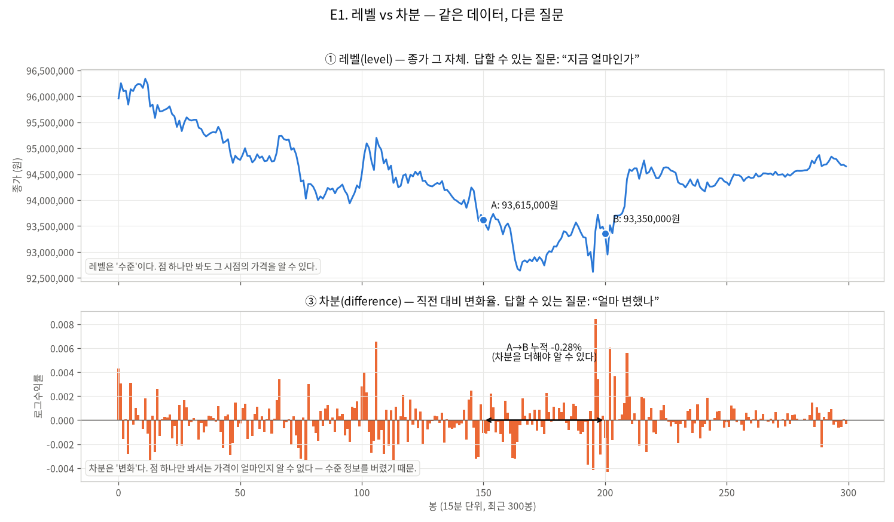
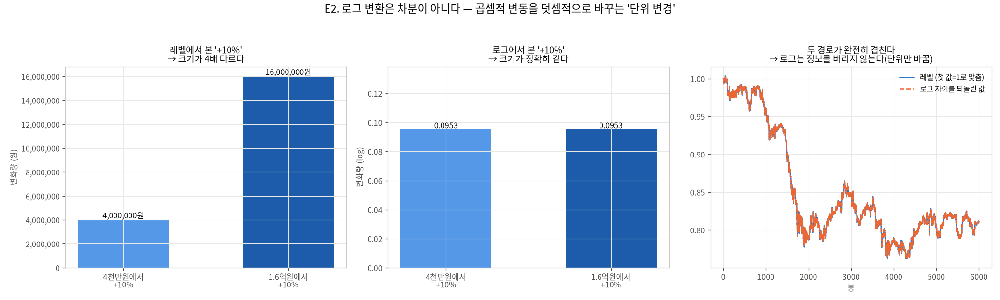
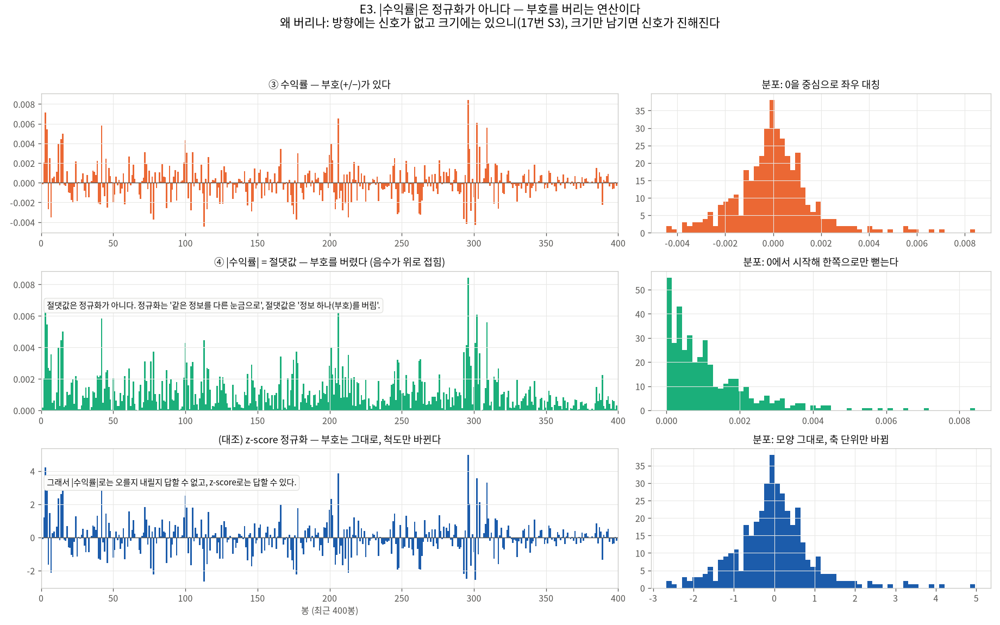
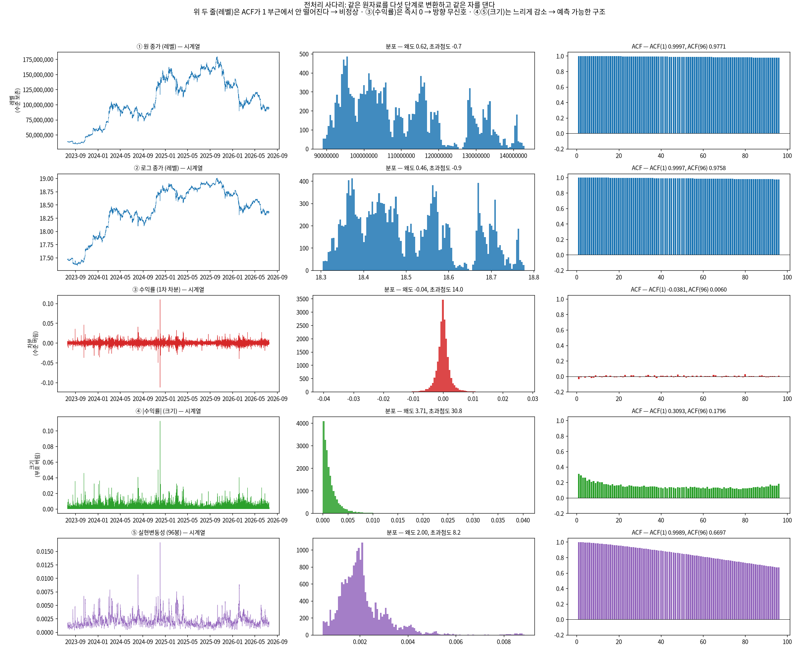
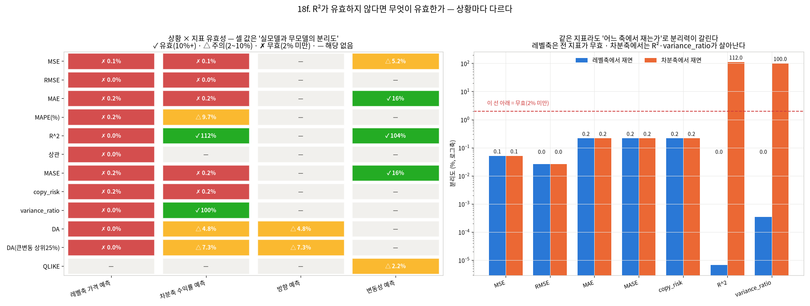
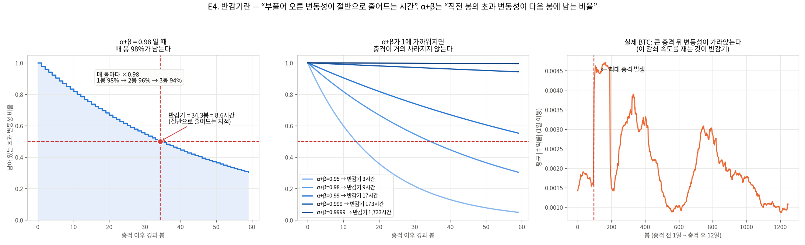
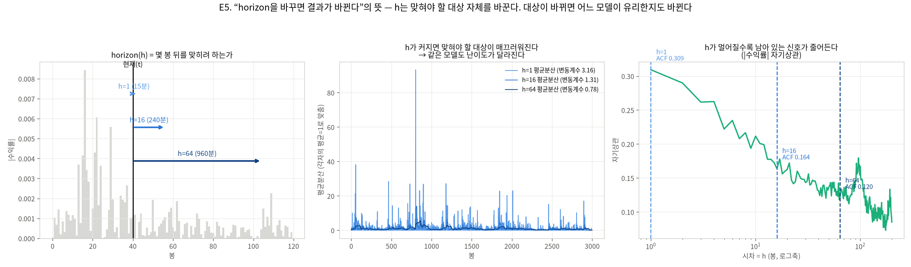
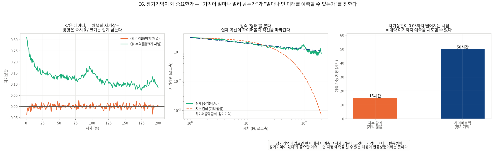

# 종합 보고서 v2 — 전처리가 분석 대상을 어떻게 가르는가

작성일 2026-08-19 · 브랜치 `stock` · 데이터 `upbit_krw_candle` KRW-BTC 104,883행(2023-07 ~ 2026-07)
· 실행 환경 서버(RTX 4090) · 문헌 검증 arxiv MCP

> **이 문서를 쓴 이유**: v1(`MASTER_REPORT_20260814.md`)은 결과를 모았지만 **왜 그런가**를
> 설명하지 못했다. 지적받은 것 — 용어를 모르는 상태로는 읽히지 않고, 설명 문단에 그림이 없고,
> "R²가 무효면 뭘 쓰나"에 답이 없고, horizon·장기기억·|수익률|이 무엇인지 알 수 없다.
>
> v2는 **개념 → 그림 → 검정 → 판단 규칙** 순서로 다시 썼다. 모든 설명 문단에 대조 그림이 붙는다.
> 결과 수치는 v1과 같고, 달라진 것은 **설명의 순서와 근거 제시 방식**이다.
>
> **후속(2026-08-19 신규 분석)**: 아래 18절에 미착수로 적힌 항목을 전부 실행한 결과는
> [19_new_findings_report_20260819.md](19_new_findings_report_20260819.md)에 있다 —
> t분포 GARCH · 주기 성분 제거 · target horizon 모델 확정 · 생존편의 감사 · 브리프 4종 재현.

**목차**
1. [용어 사전 — 먼저 읽으면 나머지가 읽힌다](#1)
2. [레벨이란 무엇인가](#2)
3. [로그는 왜 씌우나 (차분이 아니다)](#3)
4. [차분하면 무엇을 잃는가](#4)
5. [\|수익률\|은 정규화인가 (아니다)](#5)
6. [전처리 사다리 — 다섯 계열이 나온 이유](#6)
7. [같은 자를 다섯 계열에 댄다](#7)
8. [그래서 어떤 전처리로 무엇을 판단하는가](#8)
9. [지표 — R²가 무효면 무엇이 유효한가](#9)
10. [반감기란 무엇인가](#10)
11. [GARCH 가정을 만족하는가](#11)
12. [horizon을 바꾸면 결과가 바뀐다는 말의 뜻](#12)
13. [장기기억이 변동성에 있으면 왜 중요한가](#13)
14. [우리가 실제로 무슨 모델을 무슨 축에 썼는가](#14)
15. [환경 — DB 자동 구축과 NVML](#15)
16. [정정 목록 (v1 대비)](#16)
17. [교수님 브리프 정정안](#17)
18. [남은 일 · 재현 명령 · 참고문헌](#18)

---

<a id="1"></a>
## 1. 용어 사전 — 먼저 읽으면 나머지가 읽힌다

이 표만 읽고 넘어가도 본문이 읽힌다. 각 항목은 아래 해당 절에서 그림과 함께 다시 설명한다.

| 용어 | 한 줄 뜻 | 왜 나오나 | 자세히 |
| :--- | :--- | :--- | :--- |
| **레벨(level)** | 그 시점의 값 자체 (종가 1억 3천만 원) | "지금 얼마인가"를 답하는 축 | [2절](#2) |
| **차분(difference)** | 직전 대비 변화 (+0.77%) | "얼마 변했나"를 답하는 축 | [4절](#4) |
| **로그수익률** | log(종가)를 차분한 값 | 비율 변동을 덧셈으로 다루기 위해 | [3절](#3) |
| **\|수익률\|** | 수익률의 절댓값 | **부호를 버려** 크기만 남긴 것. 정규화 아님 | [5절](#5) |
| **실현변동성** | \|수익률\|을 일정 기간 평활한 값 | "요즘 얼마나 출렁이나" | [6절](#6) |
| **정상성(stationarity)** | 통계적 성질이 시간에 따라 안 바뀜 | 대부분 모델의 전제 | [7절](#7) |
| **ADF / KPSS** | 정상성 검정 두 종류. **귀무가설이 반대** | 둘이 일치할 때만 결론이 견고 | [7절](#7) |
| **ARCH-LM** | 분산이 시변하는지 보는 검정 | GARCH를 쓸 대상이 있는지 확인 | [11절](#11) |
| **자기상관(ACF)** | 과거 값이 현재 값을 설명하는 정도 | 예측 가능성의 1차 지표 | [7절](#7) |
| **GARCH** | 변동성이 뭉치는 성질을 모델링 | "언제 크게 움직일까" | [11절](#11) |
| **α+β (지속성)** | 직전 봉의 초과 변동성이 다음 봉에 남는 비율 | 충격이 얼마나 오래 가나 | [10절](#10) |
| **반감기** | 부풀어 오른 변동성이 절반이 되는 시간 | 예측이 유효한 지평의 힌트 | [10절](#10) |
| **horizon (h)** | 몇 봉 뒤를 맞히려 하는가 | h가 바뀌면 문제 자체가 바뀜 | [12절](#12) |
| **장기기억** | 자기상관이 **멀리까지** 남는 성질 | 먼 미래를 예측할 수 있는지 결정 | [13절](#13) |
| **Hurst H / GPH d** | 장기기억을 재는 두 추정기 | 서로 독립이라 교차확인용 | [7절](#7) |
| **HAR-RV** | 실현변동성을 **일·주·월** 세 시간축의 합으로 예측 | 장기기억을 간단히 흉내내는 모델 | [13절](#13) |
| **QLIKE** | 분산 예측 전용 손실 | 실현분산 대리변수가 잡음이어도 순위가 안 뒤집힘 | [9절](#9) |
| **MASE** | MAE ÷ 무모델 MAE | 1 미만이면 무모델을 이김 | [9절](#9) |

---

<a id="2"></a>
## 2. 레벨이란 무엇인가



**레벨은 "수준"이다.** 위 그림 위쪽처럼, 점 하나만 봐도 그 시점의 가격을 알 수 있다
(A: 그 시점 종가, B: 50봉 뒤 종가).

**차분은 "변화"다.** 아래쪽처럼, 점 하나만 봐서는 가격이 얼마인지 알 수 없다. A→B 사이
누적 변화를 알려면 그 구간의 차분을 모두 더해야 한다.

같은 데이터인데 **답할 수 있는 질문이 다르다.** 이것이 전처리가 분석 대상을 가르는 출발점이다.

> 주의: 코드에서 "레벨"은 두 가지를 가리킨다 — `close`(원 종가)와 `log_close`(로그 종가).
> 둘 다 레벨이다(수준을 보존한다). 다음 절이 그 이유다.

---

<a id="3"></a>
## 3. 로그는 왜 씌우나 — 차분이 아니다



가격이 4천만 원일 때의 +10%와 1.6억 원일 때의 +10%는 **같은 비율인데 레벨에서는 크기가 4배
다르다**(왼쪽). 로그를 씌우면 **정확히 같은 크기**가 된다(가운데). 로그 변환은 비율 변동을
덧셈적 변동으로 바꾸는 **단위 변경**이다.

오른쪽이 핵심이다 — 로그 차이를 되돌린 경로가 원래 레벨 경로와 **완전히 겹친다.** 즉
**로그는 정보를 버리지 않는다.** 그래서 로그 종가도 여전히 비정상이고([7절](#7) ADF p=0.5727),
차분은 그다음 단계에서 처음 일어난다.

```
종가(레벨) → log(종가)(여전히 레벨) → diff()(여기서 처음 차분) → 로그수익률
```

---

<a id="4"></a>
## 4. 차분하면 무엇을 잃는가

차분은 **수준 정보를 버린다.** 그 대가로 얻는 것이 정상성이다.

| | 레벨 | 차분(수익률) |
| :--- | :--- | :--- |
| 답할 수 있는 질문 | "지금/앞으로 얼마인가" | "얼마 변하는가" |
| 자기상관 ACF(1) | **0.9997** (거의 1) | **−0.0381** (거의 0) |
| ADF 정상성 판정 | 비정상 (p=0.5727) | 정상 (p=0.0000) |
| 잃은 것 | — | 수준 |


위 그림이 그 실증이다. **모델을 고정하고 평가축만 바꿨다.** 아무것도 학습하지 않은 무모델(직전값
복사)이 레벨축에서 R² 0.999871을 받고, 실모델과의 차이가 **0.00000007**이다. 오른쪽 패널을 보면
눈으로도 구별되지 않는다 — 한 칸 밀린 복사본이기 때문이다.

레벨의 자기상관 0.9997은 "예측할 것이 넘친다"는 뜻이 **아니다**. "어제와 오늘 가격이
비슷하다"는 **동어반복**이다. 그 동어반복을 제거해 "그걸 빼고도 남는 게 있는가"를 묻는 축이
차분이다. 그래서 **모델 성능은 차분축에서만 정직하게 측정된다** — 근거는 [9절](#9).

---

<a id="5"></a>
## 5. |수익률|은 정규화인가 — 아니다



질문에 직접 답한다. **절댓값은 정규화가 아니다.**

| 연산 | 무엇을 하나 | 부호 | 분포 모양 | 답할 수 있는 질문 |
| :--- | :--- | :--- | :--- | :--- |
| **\|·\| 절댓값** | 음수를 위로 접는다 | **버린다** | 0에서 한쪽으로만 뻗음 | 크기만 |
| **z-score 정규화** | (값−평균)÷표준편차 | **보존** | 모양 그대로, 축 단위만 바뀜 | 크기 + 방향 |

그림에서 확인된다 — 절댓값(가운데 줄)은 분포가 한쪽으로 접히고, z-score(아래 줄)는 모양이
그대로다.

**왜 부호를 버리나**: 17번 EDA S3에서 방향 자기상관은 −0.05로 사실상 0이고 크기 자기상관은
0.36으로 살아 있었다. 방향에는 정보가 없고 크기에는 있으니, **부호를 버리면 남은 신호가
진해진다.** 정보를 버리는 것이 목적이 아니라, **버려도 손실이 없는 정보를 버려 신호 대비를
높이는 것**이 목적이다.

---

<a id="6"></a>
## 6. 전처리 사다리 — 다섯 계열이 나온 이유

계열이 다섯 개인 것은 **세분화가 아니라 한 사슬의 연속된 칸**이다. 각 칸에서 무엇을 버리는지가
그 칸에서 무엇을 볼 수 없는지를 결정한다.

| 계열 | 연산 | 답하는 질문 | 이 단계에서 버리는 정보 |
| :--- | :--- | :--- | :--- |
| ① 원 종가 | `raw` | 지금 얼마인가 | —(원자료) |
| ② 로그 종가 | `log(x)` | 지금 얼마인가 (단위 변경) | 절대 단위(원). 수준은 보존 |
| ③ 수익률 | `diff(log x)` | 얼마 변했나 | **수준을 버린다** |
| ④ \|수익률\| | `\|diff\|` | 얼마나 크게 변했나 | **부호를 버린다** |
| ⑤ 실현변동성 | `rolling_std(96)` | 요즘 얼마나 출렁이나 | 개별 봉의 크기(평활) |

---

<a id="7"></a>
## 7. 같은 자를 다섯 계열에 댄다

**방법을 계열마다 동일하게** 적용해야 "차이가 계열의 성질 때문"이라고 말할 수 있다.
도구별로 무엇을 재는지 먼저 밝힌다.

| 도구 | 무엇을 재나 | 어떻게 계산하나 | 읽는 법 |
| :--- | :--- | :--- | :--- |
| **ADF** | 단위근(수준이 표류하는가) | 차분값을 과거값에 회귀 | 귀무=단위근. **p<0.05면 정상** |
| **KPSS** | 정상성 | 부분합의 분산 누적 | 귀무=정상. **p<0.05면 비정상** (방향 반대) |
| **ARCH-LM** | 조건부 이분산 | 제곱잔차를 과거 제곱잔차에 회귀 | p<0.05면 분산이 시변 |
| **ACF(k)** | k봉 전 값과의 상관 | `corr(x_t, x_{t−k})` | 1에 가까움=동어반복, 0=무신호 |
| **GPH d** | 장기기억 모수 | 로그주기도를 `log(4sin²(ω/2))`에 회귀한 기울기의 음수 | d=0 무기억, d>0.15 장기기억 |
| **Hurst H** | 장기기억(독립 추정기) | 구간 크기별 R/S 통계량의 로그-로그 기울기 | H=0.5 무기억, H>0.5 장기기억 |
| **왜도·첨도** | 분포 비대칭·꼬리 | 3차·4차 표준화 적률 | 정규는 0, 0 |
| **Jarque-Bera** | 정규성 | 왜도·첨도 결합 검정 | p<0.05면 정규 아님 |



**같은 자를 댄 결과** (표본: 각 계열 최근 20,000행, 고정 maxlag=24):

| 계열 | ADF p | KPSS p | 평균-정상 | ARCH-LM p | ACF(1) | ACF(96) | GPH d | Hurst H | 왜도 | 초과첨도 |
| :--- | ---: | ---: | :--- | ---: | ---: | ---: | ---: | ---: | ---: | ---: |
| ① 원 종가 | 0.5685 | 0.0100 | 아니오 | 0.0000 | 0.9997 | 0.9771 | 1.0463 | 1.0214 | 0.62 | −0.7 |
| ② 로그 종가 | 0.5727 | 0.0100 | 아니오 | 0.0000 | 0.9997 | 0.9758 | 1.0263 | 1.0213 | 0.46 | −0.9 |
| ③ 수익률 | 0.0000 | 0.1000 | **예** | 0.0000 | **−0.0381** | 0.0060 | **0.0754** | 0.5519 | −0.04 | **14.0** |
| ④ \|수익률\| | 0.0000 | 0.0100 | 아니오 | 0.0000 | 0.3093 | 0.1796 | **0.4037** | 0.8727 | 3.71 | 30.8 |
| ⑤ 실현변동성 | 0.0000 | 0.0100 | 아니오 | 0.0000 | 0.9989 | 0.6697 | **0.3407** | 0.8333 | 2.00 | 8.2 |

세 줄로 읽으면 이렇다.

- **①②(레벨)**: ACF가 1 부근에서 하루 뒤까지 안 떨어진다 → 수준이 표류하는 비정상.
  GPH d와 Hurst H가 1을 넘는데, 이 값은 **해석하면 안 된다** — 적분된 계열에 이 추정기를
  쓰면 단위근을 재확인할 뿐이다([16절](#16) 정정 2).
- **③(수익률)**: 유일하게 평균-정상. 그런데 ACF(1)이 −0.0381로 방향 신호가 없다.
  단 ARCH-LM p=0이라 **분산은 시변** → 크기 쪽에 구조가 남아 있다는 신호.
  초과첨도 14.0으로 꼬리가 매우 두껍다(정규는 0).
- **④⑤(크기·변동성)**: GPH d가 0.34~0.40으로 **장기기억**. ACF가 하루 뒤에도 남는다.

---

<a id="8"></a>
## 8. 그래서 어떤 전처리로 무엇을 판단하는가

**판단 근거는 검정 결과가 아니라 6절의 사다리 구조 자체다.** 검정은 그 구조가 데이터에서
실제로 그렇게 나타나는지 확인하는 역할이다.

| 알고 싶은 것 | 써야 하는 계열 | 이유 | 쓰면 안 되는 계열 |
| :--- | :--- | :--- | :--- |
| 가격이 얼마가 될까 | ①② 레벨 | 수준 정보가 여기에만 있다 | ③④⑤ — 수준을 버렸다 |
| 오를까 내릴까(방향) | ③ 수익률 | 부호가 여기에만 있다 | ④⑤ — 부호를 버렸다 |
| 얼마나 크게 움직일까 | ④⑤ 크기·변동성 | 크기 구조가 여기에 남는다 | ③ — 부호가 섞여 신호가 희석 |
| **모델이 나아졌나** | ③ 차분축에서 평가 | 동어반복이 제거된 축 | ①② — [9절](#9) 참조 |

이것이 **"차분하면 변동성, 안 하면 수익률"의 정확한 의미**다. 더 정확히 쓰면:

> **차분하지 않으면(레벨) 답할 수 있는 것은 "수준"이고, 차분하면 "변화"이며, 차분 후 부호까지
> 버리면 "변동성"이다.** 전처리 단계마다 답할 수 있는 질문이 하나씩 좁아진다.

---

<a id="9"></a>
## 9. 지표 — R²가 무효면 무엇이 유효한가



**판정 방식**: 각 상황에서 무모델과 실모델을 둘 다 평가한다. 좋은 지표는 이 둘을 **분리**해야
한다. 분리도 = |실모델 − 무모델| ÷ 척도. **2% 미만이면 그 상황에서 그 지표는 무효**다.

### 9.1 상황 × 지표 유효성 (실측)

| 지표 | A 레벨축 가격 | B 차분축 수익률 | C 방향 | D 변동성 |
| :--- | ---: | ---: | ---: | ---: |
| MSE | ✗ 0.1% | ✗ 0.1% | — | △ 5.2% |
| RMSE | ✗ 0.0% | ✗ 0.0% | — | — |
| MAE | ✗ 0.2% | ✗ 0.2% | — | **✓ 15.6%** |
| MAPE | ✗ 0.2% | △ 9.7% | — | — |
| **R²** | **✗ 0.0%** | **✓ 112.0%** | — | **✓ 104.5%** |
| 상관 | ✗ 0.0% | ✓ 유효 | — | ✓ 유효 |
| MASE | ✗ 0.2% | ✗ 0.2% | — | **✓ 15.6%** |
| copy_risk | ✗ 0.2% | ✗ 0.2% | — | — |
| variance_ratio | ✗ 0.0% | **✓ 100.0%** | — | — |
| DA | ✗ 0.0% | △ 4.8% | △ 4.8% | — |
| DA(큰변동 상위25%) | ✗ 0.0% | △ 7.3% | △ 7.3% | — |
| QLIKE | — | — | — | △ 2.2% |

✓ 유효(10%+) · △ 주의(2~10%) · ✗ 무효(2% 미만)

### 9.2 이 표에서 읽어야 할 것 세 가지

**첫째 — 문제는 R²가 아니라 축이었다.** 레벨축에서는 **11개 지표 전부가 무효**다(0.0~0.2%).
반면 차분축에서는 **R²가 가장 민감한 분리자**(112%)다.

> **v1 정정**: v1에서 "R²는 유효하지 않다"고 뭉뚱그렸는데 부정확했다. 정확히는
> **R²는 레벨축에서 무효, 차분축에서는 최선**이다. 지표를 바꾸는 것보다 **축을 바로잡는 것이
> 먼저**다 — 축이 틀리면 어떤 지표로도 구제되지 않는다.

**둘째 — 직관성과 판별력은 다른 문제다.** 지적하신 대로 MSE는 제곱이라 크기를 못 읽고 MAE는
"평균 몇 % 틀린다"로 바로 읽힌다. 그건 **읽기 쉬움**의 장점이다. 그런데 분리도를 보면
MAE도 A·B에서 0.2%로 무효다. **읽기 쉬운 지표와 판별하는 지표를 둘 다 봐야 한다.**

| 목적 | 봐야 할 지표 |
| :--- | :--- |
| 크기 감각 (얼마나 틀리나) | **MAE**, MAPE — 원단위·% |
| 무모델 대비 (실력이 있나) | **MASE**, copy_risk — 1 미만이면 이김 |
| 판별 (개선됐나) | **차분축 R²**, variance_ratio |
| 방향 | **DA**, 큰변동 DA — 0.5가 기준선 |
| 변동성 | **QLIKE**(순위 강건), MAE·MASE(크기 감각) |

**셋째 — MASE의 미덕은 불변성이지 민감도가 아니다.** MASE는 레벨축·차분축에서 값이 같다
(1.0000 / 0.9978) — **축에 속지 않는다**는 뜻이다. 하지만 분리도는 0.2%로 낮다. v1에서
"MASE는 속지 않는다"고 쓴 것은 맞지만, **그것이 "MASE로 판별할 수 있다"는 뜻은 아니었다.**

### 9.3 권고 — 앞으로 모든 실험이 함께 보고할 지표 묶음

```
차분축 필수:  R²  ·  MAE  ·  MASE  ·  DA  ·  DA(큰변동)  ·  variance_ratio
변동성 실험:  QLIKE  ·  MAE  ·  MASE  ·  corr(√예측, |r|)
항상 병기:    무모델(naive) 값 — 지표만 쓰고 기준선을 안 쓰면 판별이 불가능하다
```

15·16번은 이미 `copy_risk_krw = mae_krw / persistence_mae_krw`와 `mase_momentum`을 갖고
있었다. **기준선 병기라는 방향은 이미 맞았고**, 부족했던 것은 그 기준선을 **어떤 축에서
재는지**를 명시하는 일이었다.

---

<a id="10"></a>
## 10. 반감기란 무엇인가



큰 사건이 터지면 변동성이 뛰고 서서히 가라앉는다. **그 부풀어 오른 변동성이 절반으로
줄어드는 시간**이 반감기다.

**α+β(지속성)는 "직전 봉의 초과 변동성이 다음 봉에 남는 비율"이다.** 왼쪽 그림이 그 계단이다 —
α+β=0.98이면 1봉 뒤 98%, 2봉 뒤 96%, 3봉 뒤 94%가 남고, 34.3봉(8.6시간)에서 절반이 된다.

`반감기 = ln(0.5) / ln(α+β)`

가운데 그림이 문제의 핵심이다. **α+β가 1에 가까워지면 충격이 거의 사라지지 않는다.**

| α+β | 반감기 |
| ---: | ---: |
| 0.9500 | 3.4시간 |
| **0.9800** | **8.6시간** ← 교수님 브리프가 쓴 값 |
| 0.9900 | 17.2시간 |
| 0.9990 | 7.2일 |
| 0.9999 | 72.2일 |

파라미터가 0.019 움직이는데 반감기는 **20배** 뛴다. `ln(α+β)`가 1 근처에서 0으로 붕괴하기
때문이다. 우리 데이터의 실측 α+β는 표본에 따라 0.98168 ~ 0.99966이었고, 그 결과 반감기가
**9.4시간 ~ 511시간(55배)** 으로 요동했다. **그래서 반감기를 모델 채택 기준으로 쓸 수 없다.**

오른쪽 그림은 실제 BTC에서 최대 충격 이후 변동성이 가라앉는 구간이다 — 이 감쇠 속도를 재려는
것이 반감기이고, 실제 곡선이 매끄러운 지수 곡선이 아니라는 점도 함께 보인다([13절](#13)).

---

<a id="11"></a>
## 11. GARCH 가정을 만족하는가

첨부하신 설명글(needmorecaffeine.tistory.com/37)을 확인했다. 그 글이 제시하는 가정은
두 가지이고, 사전 검정 요구사항은 따로 적혀 있지 않다.

| | 가정 | 출처 |
| :--- | :--- | :--- |
| **(가)** | 오차항 E[u_t]=0, Var[u_t]=σ_u² → **평균-정상**을 요구 | 설명글 |
| **(나)** | 정상성 조건 Σα_i + Σβ_i < 1 | 설명글 |
| **(다)** | 표준화 잔차가 i.i.d. | 표준 GARCH |
| **(라)** | (정규 MLE 사용 시) 표준화 잔차 정규성 | 표준 GARCH |

**계열마다 판정한 결과** (동일 추정기 scipy 정규 MLE):

| 계열 | (가) 평균-정상 | (나) Σα+Σβ<1 | (다) 잔차 무자기상관 | (라) 잔차 정규성 | 판정 |
| :--- | :--- | :--- | :--- | :--- | :--- |
| ② 로그 종가 | **위반** (ADF p=0.5727) | 0.99858 통과(경계) | ACF(1)=**0.9885** 위반 | JB p=0 위반 | **적용 불가** |
| ③ 수익률 | **통과** (p=0.0000) | 0.99895 통과(경계) | ACF(1)=−0.0225 통과 | JB p=0 **위반** | 조건부 가능 — **t분포 필요** |
| ④ \|수익률\| | 위반 | — | — | — | GARCH의 **입력이 아님** |
| ⑤ 실현변동성 | 위반 | — | — | — | GARCH의 **입력이 아님** |

**답**: 질문하신 "가정을 만족하거나 만족했을 때 얘기인가"에 대해 —

1. **③ 수익률에서만 (가)를 만족한다.** 레벨(②)은 평균-정상부터 위반이다. 그런데 **적합은
   그대로 돌아가고 숫자가 나온다** — 가정 위반은 에러로 알려주지 않는다. 이것이 18번에서
   레벨 입력을 반례로 넣어 확인한 부분이다.
2. **(나)는 수치상 통과하지만 경계에 붙어 있다** (0.99895 < 1, 여유 0.001). 형식적으로는
   "만족"이지만 실질적으로 준-IGARCH 영역이고, 그래서 반감기가 55배 흔들렸다.
   **가정을 형식적으로 만족하는 것과 추정이 쓸 만한 것은 다르다.**
3. **(라)는 위반이다** (Jarque-Bera p=0.0000, 초과첨도 14.0). 즉 우리가 쓴 **정규 MLE는
   분포 가정이 틀렸다.** t분포 GARCH로 바꿔야 한다 — **이번에 새로 확인한 항목이며,
   v1에는 없던 내용이다.**
4. **④⑤에 GARCH를 적용하지 않는 이유**: GARCH는 "수익률의 조건부 분산"을 모델링한다.
   ④\|수익률\|과 ⑤실현변동성은 그 분산의 **관측 대리변수**이므로 GARCH의 입력이 아니라
   **GARCH가 맞히려는 정답지**다. 이 계열을 직접 모델링하는 것이 HAR-RV 계열이다.

---

<a id="12"></a>
## 12. "horizon을 바꾸면 결과가 바뀐다"는 말의 뜻



**h(horizon)는 "몇 봉 뒤를 맞히려 하는가"다.** h=1은 15분 뒤, h=16은 4시간 뒤, h=64는 16시간 뒤.

왜 결과가 바뀌는가 — **h가 바뀌면 맞혀야 하는 대상 자체가 바뀐다.**

1. **대상이 멀어진다** (왼쪽): 현재에서 더 먼 지점을 가리킨다.
2. **대상의 성질이 달라진다** (가운데): h가 커지면 목표가 여러 봉의 평균이 되어 **매끄러워진다.**
   같은 모델도 난이도가 달라진다.
3. **남은 신호가 줄어든다** (오른쪽): 자기상관이 h와 함께 감쇠한다.

그래서 **h=1에서 이긴 모델이 h=64에서 지는 일이 생긴다.** 실측이 그랬다.

| horizon | GARCH(1,1) QLIKE | HAR-RV QLIKE | 최우수 |
| :--- | ---: | ---: | :--- |
| h=1 (15분) | **−11.5809** | −11.3970 | GARCH |
| h=16 (4시간) | **−11.4195** | −11.3418 | GARCH |
| h=64 (16시간) | −11.2869 | **−11.3148** | **HAR-RV** |


GARCH의 우위가 단조 감소하다 16시간에서 역전된다. B(변동성) 갈래의 target horizon이 4~16시간
이므로 **교차점이 목표 구간 안에 있다** → **1스텝 성적으로 모델을 정할 수 없다.**

> **"1스텝에서 성립한다"의 뜻**: h=1(다음 15분 하나)만 놓고 비교했을 때의 결론이라는 것.
> 우리 목표는 4~16시간이므로, h=1 결론을 그대로 가져다 쓰면 안 된다는 의미다.

---

<a id="13"></a>
## 13. 장기기억이 변동성에 있으면 왜 중요한가



**장기기억은 "자기상관이 얼마나 멀리까지 남는가"에 대한 성질이다.** 무엇에 대한 장기기억인지가
질문의 핵심이었는데 — **각 계열의 자기 자신에 대한 기억**이다. 즉 "④\|수익률\|에 장기기억이
있다"는 "지금의 변동 크기가 먼 과거의 변동 크기와 아직 상관이 있다"는 뜻이다.

**왜 중요한가** (오른쪽 그림):

- 자기상관이 **지수적으로** 꺼지면 → 짧은 지평만 예측 가능 (실측 약 15시간)
- **하이퍼볼릭(멱함수)으로** 꺼지면 → 먼 지평까지 예측 가능 (실측 50시간+, 200봉 내 안 꺼짐)

즉 **"어느 채널에 장기기억이 있는가" = "어느 채널을 얼마나 먼 미래까지 예측할 수 있는가"** 다.
우리 데이터에서 장기기억은 **방향(수익률)에 없고 크기(변동성)에 있다.**

| 계열 | GPH d | 판정 | 함의 |
| :--- | ---: | :--- | :--- |
| ③ 수익률 (방향) | 0.0754 | 무기억 | 먼 미래 방향 예측은 걸 수 없다 |
| ④ \|수익률\| (크기) | **0.4037** | 장기기억 | **먼 지평 예측을 걸 수 있다** |
| ⑤ 실현변동성 | **0.3407** | 장기기억 | 같음 |

> **가로 bar 그래프가 무엇이었나**: 18번 `d4b` 그림 왼쪽의 가로 막대는 **계열별 GPH d 값**이고,
> 검은 점선(0.15)이 장기기억 판정선, 회색 점선(0.5)이 정상성 상한이다. 막대가 판정선을
> 넘으면 장기기억이 있다는 뜻이다. 위 표가 같은 내용을 숫자로 보여준다.

**세 가지가 이 하나로 설명된다.**

1. GARCH(1,1)은 **지수 감쇠만** 표현할 수 있다.
2. 진짜 감쇠는 **하이퍼볼릭**이다(E6 가운데 그림에서 실제 곡선이 하이퍼볼릭 직선을 따라간다).
3. 지수함수로 하이퍼볼릭을 흉내내려면 **α+β를 1로 밀어붙일 수밖에 없다.**

→ 그래서 (a) 지속성이 1에 붙고 (b) 반감기가 표본에 따라 55배 흔들리고 (c) 긴 horizon에서
HAR-RV에 밀린다. **반감기 불안정은 추정 잡음이 아니라 모델 오지정의 증상이다.**

**HAR-RV란**: 실현변동성을 **일·주·월 세 시간축의 평균**으로 예측하는 회귀 모델이다
(Heterogeneous AutoRegressive). 서로 다른 시간대의 투자자가 각자의 주기로 반응한다는 착상에서
나왔고, 세 항의 합으로 **하이퍼볼릭 감쇠를 간단히 근사**한다. 장기기억 모델치고 구현이
단순해 실현변동성 예측의 표준 베이스라인으로 쓰인다.

---

<a id="14"></a>
## 14. 우리가 실제로 무슨 모델을 무슨 축에 썼는가

질문하신 "GARCH만 써서 차분/비차분을 수행한 건가, 비차분이면 딥러닝을 썼겠지"에 답한다.
**실제는 그 반대였다.**

| 실험 | 모델 | 학습 타깃(축) | 레벨 사용처 |
| :--- | :--- | :--- | :--- |
| 1~14번 | 딥러닝·시계열 다수 | **차분** (`target_return`) | 원단위 보고용(`target_close`)만 |
| 15번 | ITransformerLike 등 | **차분** | `mae_krw`·`copy_risk_krw` 보고 |
| 16번 | RevIN + 다모델, 30종목 | **차분** | 같음 |
| 17번 EDA | (모델 없음, 검정만) | **차분** (`log_close.shift(-h) − log_close`) | S1·S4에서 레벨도 함께 관찰 |
| **18번** | **GARCH(1,1)** | **레벨과 차분 양쪽** | **레벨은 "이렇게 하면 안 된다"는 반례로 일부러 투입** |

**정리하면:**

1. **딥러닝은 전부 차분축에서만 돌았다.** 비차분(레벨)을 타깃으로 딥러닝을 제대로 돌린 실험은
   없다. 16번의 RevIN이 "레벨을 정규화해 다루는" 접근에 가장 가깝지만, 타깃은 여전히 차분이다.
2. **GARCH는 18번에서 처음 도입했다.** 차분/비차분 비교는 GARCH로 했고, 레벨 입력은 성능 후보가
   아니라 **가정 위반 반례**로 넣은 것이다.
3. 그래서 "비차분이면 딥러닝을 썼겠지"라는 짐작이 성립하지 않는다 — **비차분 축은 어느 모델도
   본격적으로 쓴 적이 없다.** 이것이 처음 지적하신 "차분이 이미 적용돼 있었다"의 실제 범위다.

---

<a id="15"></a>
## 15. 환경 — DB 자동 구축과 NVML

### 15.1 DB 자동 구축 (신설, 요청 반영)

CUDA는 실험 시작 시 확인해 주는데 **데이터는 아무도 확인해 주지 않았다.** DB는
`.gitignore`의 `*.db*`로 제외돼 `git pull`로 오지 않고(1.29GB DuckDB), 그 사실이 문서에만
있었다. 그래서 `engine/preflight.py`를 신설해 **코드로 강제**했다.

```python
from engine import preflight
preflight.ensure_data(table="upbit_krw_candle", tickers=["KRW-BTC"])   # 필요한 종목만 확보
preflight.ensure_data(table="upbit_krw_candle", tickers="all")          # 전 종목
```

동작: DB 존재 → 테이블 존재 → 요청 종목 존재 → 행수 충분(5,000+)을 순서대로 점검하고,
**부족하면 그 자리에서 `pipelines/rebuild_price_mart.py`를 호출해 수집**한다. 수집 후에도
부족하면 **예외로 중단**한다(조용한 실패 방지 — 이 프로젝트의 반복 사고 유형).
장시간 수집이 곤란하면 `QT_NO_AUTOBUILD=1`로 점검만 한다.

실제 출력:

```
[preflight] DB .../data/upbit_data.db (존재, 1.29 GB)
  테이블 `upbit_krw_candle`: 존재, 16,081,696행 / 269종목
  → 준비 완료
```

누락 시:

```
  테이블 `upbit_krw_candle`: 존재, 16,081,696행 / 269종목
  **누락 종목 1개**: KRW-NOTREAL
[preflight] 수집 시작: --tickers KRW-NOTREAL
```

18d·18e·18f 드라이버가 이미 이 가드를 호출한다. **"btc만 수집돼 있어서 생긴 문제"는 이제
같은 방식으로 재발하지 않는다** — 요청한 종목이 없으면 채우고, 못 채우면 멈춘다.

> Redis 제안에 대해: 이 작업은 "1,600만 행 시계열을 컬럼 단위로 집계·스캔"이라 열지향 분석
> 엔진이 맞고, DuckDB가 이미 그 역할이다(SQLite를 쓰고 있지도 않다). Redis는 인메모리 키-값
> 저장소라 이 질의 형태에 이점이 없고 1.29GB를 상시 메모리에 올려야 한다. **현행 DuckDB 유지를
> 권한다.**

### 15.2 NVML — 서버 관리자에게 요청해야 하는 사안

질문에 답하면 **예, 관리자 요청 사항이다.**

| 항목 | 버전 |
| :--- | :--- |
| 설치된 NVIDIA 패키지 전부 | **595.84** (2026-06-30 설치, 이미 최신) |
| 실행 중인 커널 모듈 | **595.71.05** |

패키지는 이미 최신인데 커널 모듈이 구버전으로 돌고 있다 — 6월 30일 업그레이드 후 재부팅을
하지 않은 상태다. 요청대로 `nvidia-ml-py` 설치를 실제로 시험했으나 같은 `libnvidia-ml.so`를
감싸는 래퍼라 동일하게 실패했다(`NVMLError_LibRmVersionMismatch: RM has detected an NVML/RM
version mismatch`). RM은 커널 모듈이므로 **유저스페이스 패키지로는 해결 불가**이고,
`sudo`도 막혀 있다.

**관리자에게 요청할 내용**: "NVIDIA 드라이버 패키지가 595.84로 업그레이드됐으나 커널 모듈이
595.71.05로 남아 있어 NVML이 동작하지 않습니다. **재부팅**(또는 nvidia 커널 모듈 재적재)을
부탁드립니다."

**계산에는 영향이 없다** — torch는 `libcuda.so`를 쓰고 그쪽은 버전이 맞는다(30종목 학습 정상
완주). 그동안 쓸 대체 도구로 `test/scripts/gpu_status.py`를 만들었다(메모리는 조회 가능,
사용률·온도·전력은 재부팅 후 자동 활성).

---

<a id="16"></a>
## 16. 정정 목록 (v1 대비)

이번 작업에서 **내가 v1에 쓴 것 중 틀리거나 부정확했던 것**을 모아둔다.

| # | v1 서술 | 정정 |
| ---: | :--- | :--- |
| 1 | "R²는 유효하지 않다" | **레벨축에서 무효, 차분축에서는 가장 민감한 분리자(112%).** 축이 먼저다 ([9절](#9)) |
| 2 | "MASE는 축을 바꿔도 속지 않는다" | 맞지만 **불변성**의 뜻이고, 분리도는 0.2%로 낮다 — 판별용이 아니다 ([9절](#9)) |
| 3 | "레벨 타깃 `target_close`는 쓰인 흔적이 없다" | **원단위 보고·persistence 대비에 쓰였다.** 학습 타깃이 아니라는 점은 맞다 ([14절](#14)) |
| 4 | (누락) GARCH 분포 가정 | **표준화 잔차 정규성 위반**(JB p=0)을 새로 확인 — 정규 MLE는 분포 오지정, t분포 필요 ([11절](#11)) |
| 5 | "4종목 이동은 GPU 비결정성 + 데이터 차이" | **GPU 비결정성은 0**(시드 42 반복이 완전 동일). 원인은 데이터 차이뿐 |
| 6 | 레벨의 Hurst H=1.02를 값으로 제시 | **해석 불가한 값**임을 명시해야 한다 — 적분 계열에 R/S는 단위근을 재확인할 뿐 ([7절](#7)) |
| 7 | 보고서 위치 미안내 | 이 문서 맨 끝에 전체 경로 명시 |

**보고 방식도 정정한다.** `AGENTS.md:238`에 "중간엔 진척만, 상세는 요청 단위 종료 시 1회"가
이미 규칙으로 있었고 제가 지키지 않았다. 이번 작업은 중간에 진척만 남기고 이 보고서로 한 번에
정리했다.

---

<a id="17"></a>
## 17. 교수님 브리프 정정안 (발송 보류 — 검토용)

메일 발송은 보류하고 문안만 둔다. 정정 대상 **3건 + 프레이밍 제안 1건**.

**정정 1 — 반감기 8.6시간**
> "GARCH(1,1) 지속성이 1에 근접해(0.999 수준) 반감기가 표본에 따라 9~511시간으로 요동합니다
> (식별 불안정). 반감기로 target horizon을 정하지 않고, **표본외 예측 성능이 단순 베이스라인을
> 이기는 구간**으로 정하는 방식으로 바꿨습니다."

**정정 2 — 허스트 H=0.58 → 분수차분 근거**
> "장기기억 판정을 증분에서 다시 했습니다. **수익률에는 장기기억이 없고(GPH d=0.08),
> 변동성 계열에 강하게 있습니다(\|수익률\| d=0.40, 실현변동성 d=0.34).** 따라서 분수차분은
> 가격이 아니라 **변동성 모델링에 적용**하는 것이 맞고, C 갈래는 B와 경쟁하는 별개 갈래가
> 아니라 **B를 구현하는 방법**으로 재배치했습니다."
> *(레벨에 R/S를 적용하면 H가 1.02로 정의 범위를 벗어나 해석할 수 없습니다.)*

**정정 3 — 거래량이 미래 변동을 선행**
> "거래량과 변동성은 같은 정보 도착에 **동시에** 반응하며, 그 공통 성분이 한 봉 뒤까지 남아
> 0.20으로 관측됩니다. 다만 자기상관을 통제한 뒤에도 **증분 설명력이 유의하게 남아**
> (ΔR² 0.0182, HAC t=14.37) 변동성 모델 입력으로는 유효합니다."

**추가 (신규) — GARCH 분포 가정**
> "GARCH 적합 시 표준화 잔차의 정규성이 기각되어(Jarque-Bera p<0.001, 초과첨도 14) 정규
> 가정 대신 **t분포 GARCH**로 재적합할 예정입니다."

**프레이밍 제안**
> **B(변동성)를 주축으로 하고, 그 안에서 단기 모델(GARCH/EWMA)과 장기기억 모델(HAR/FIGARCH)을
> target horizon에서 겨룬다. C는 후자의 구현 수단이고, A는 별도 horizon(2일+)·외생 채널
> 실험으로 분리한다.**

**정정 불필요(유지)**: 방향 예측 불가(0.48~0.54), 크기 예측 가능(0.36), 전종목 20개 동일 구조.

---

<a id="18"></a>
## 18. 남은 일 · 재현 명령 · 참고문헌

### 남은 일

| 항목 | 상태 |
| :--- | :--- |
| 교수님 브리프 정정 반영·발송 | **보류**(요청) — 문안은 17절 |
| t분포 GARCH로 재적합 | **완료**(08-19) — ν≈4.9, 잔여 초과첨도로 skew-t 후속 |
| B 갈래 target horizon에서 GARCH vs HAR 정면 비교 | **완료** — 4시간 GARCH-t / 16시간 HAR-RV |
| 주기 성분 제거 후 GARCH 재추정 | **완료** — 반감기 1,494→27.6시간, 18셀 전부 QLIKE 개선 |
| 상장폐지 종목 누락 여부(생존편의) | **완료** — 구조적 편의 확인, 크기는 측정 불가 |
| s7~s9 재현 코드 복원 | **완료** — s7·s9 재현, s8은 18e로 대체 |
| skew-t 또는 점프 성분 GARCH | 신규 미착수 |
| 과거 마켓 목록 스냅샷 적재 시작 | 신규 미착수(생존편의 크기 측정용) |
| Cross-asset 선행성 재검정(겹침 없는 정의) | 신규 미착수 |
| NVML 정상화 | **서버 관리자 재부팅 요청**(15.2절 문안) |

### 재현 명령

```bash
# 설명용 그림 6장 (E1~E6)
uv run test/models/18e_explainers.py
# 전처리 사다리 (계열 × 검정 + 가정표)
uv run test/models/18d_preprocessing_ladder.py
# 지표 유효성 매트릭스
uv run test/models/18f_metric_validity.py
# 차분 결정 본체 (그림 7장)
uv run test/models/18_differencing_decision_test.py
# 데이터 준비 점검
python -m engine.preflight --table upbit_krw_candle --tickers KRW-BTC --check-only
# GPU 상태 (NVML 깨진 환경 대응)
python test/scripts/gpu_status.py
```

### 참고문헌

arxiv MCP로 초록까지 대조한 것만 인용한다.

1. **Kaur, E. (2026).** *The Limits of Conditional Volatility: Cryptocurrency VaR under EWMA and
   IGARCH.* arXiv:2601.13757 — 암호화폐에서 α+β=1이 오히려 견고, 정상성 부과 시 하방위험 과소평가
2. **Hassler, U., & Pohle, M.-O. (2019).** *Forecasting under Long Memory and Nonstationarity.*
   arXiv:1910.08202 — 고정 d=0.5가 추정 d보다 우수
3. **Peiris, R., Tran, M.-N., Wang, C., & Gerlach, R. (2024).** *Loss-based Bayesian Sequential
   Prediction of VaR with a Long-Memory and Non-linear Realized Volatility Model.* arXiv:2408.13588
   — HAR이 실현측도의 장기기억을 효율적으로 잡는 틀임을 전제로 RNN-HAR 확장
4. **Wang, W., An, R., & Zhu, Z. (2021).** *Volatility prediction comparison via robust volatility
   proxies.* arXiv:2110.01189 — 변동성 비교는 robust 손실 필요
5. **Singha, M. (2025).** *Hidden Order in Trades Predicts the Size of Price Moves.*
   arXiv:2512.15720 — 부호-불변 지표는 크기를 예측하고 방향은 못 한다
6. **Hansen, P. R., Kim, C., & Kimbrough, W. (2021).** *Periodicity in Cryptocurrency Volatility
   and Liquidity.* arXiv:2109.12142
7. **Yan, X. (2021).** *Multiplicative Component GARCH Model of Intraday Volatility.* arXiv:2111.02376
8. **Barjašić, I., & Antulov-Fantulin, N. (2020).** *Time-varying volatility in Bitcoin market and
   information flow at minute-level frequency.* arXiv:2004.00550
9. **Burnie, A. (2018).** *Exploring the Interconnectedness of Cryptocurrencies.* arXiv:1806.06632
10. **Ranse, H. S. (2026).** *Survivorship Bias in Emerging Market Small-Cap Indices.* arXiv:2603.19380
11. **Chi, Y., Chu, Q., & Hao, W. (2024).** *Return and Volatility Forecasting Using On-Chain Flows.*
    arXiv:2411.06327

**미검증 인용**(방법론 출처로만 언급): Corsi(2009) HAR-RV, López de Prado(2018) 고정폭 분수차분,
Geweke & Porter-Hudak(1983), Hosking(1981), Engle(2012), Andersen & Bollerslev(1998).
GARCH 가정 설명 참고: needmorecaffeine.tistory.com/37 (11절).

---

## 이 보고서와 관련 문서의 위치

| 문서 | 경로 |
| :--- | :--- |
| **이 문서 (v2)** | `quantitative_trading/test/results/MASTER_REPORT_20260819.md` |
| v1 종합 보고서 | `quantitative_trading/test/results/MASTER_REPORT_20260814.md` |
| 18번 차분 결정 | `quantitative_trading/test/results/18_differencing_decision_report_20260814.md` |
| 전처리 사다리 원시 수치 | `quantitative_trading/test/results/18d_preprocessing_ladder_20260819/ladder_raw.md` |
| 지표 유효성 원시 수치 | `quantitative_trading/test/results/18f_metric_validity_20260819/metric_validity_raw.md` |
| 재실행 검증노트 | `quantitative_trading/test/results/18b_rerun_verification_20260814/verification_note.md` |
| 시드 잡음 원시 수치 | `quantitative_trading/test/results/18b_rerun_verification_20260814/t8_seed_noise_raw.md` |
| 설명용 그림 6장 | `quantitative_trading/test/images/18e_explainers_20260819/` |
