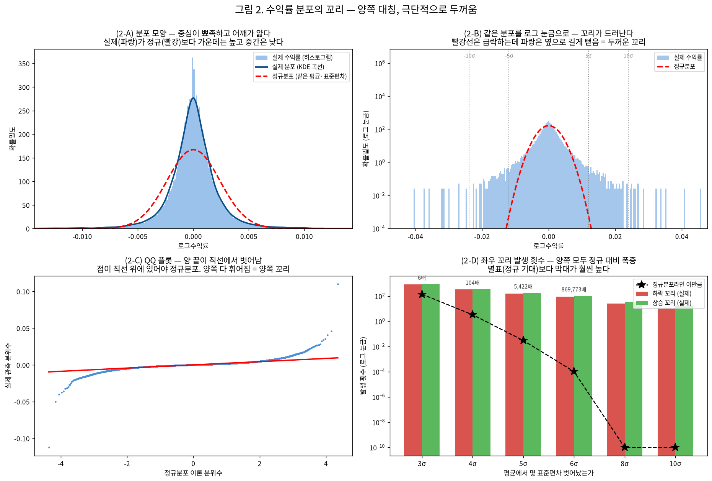
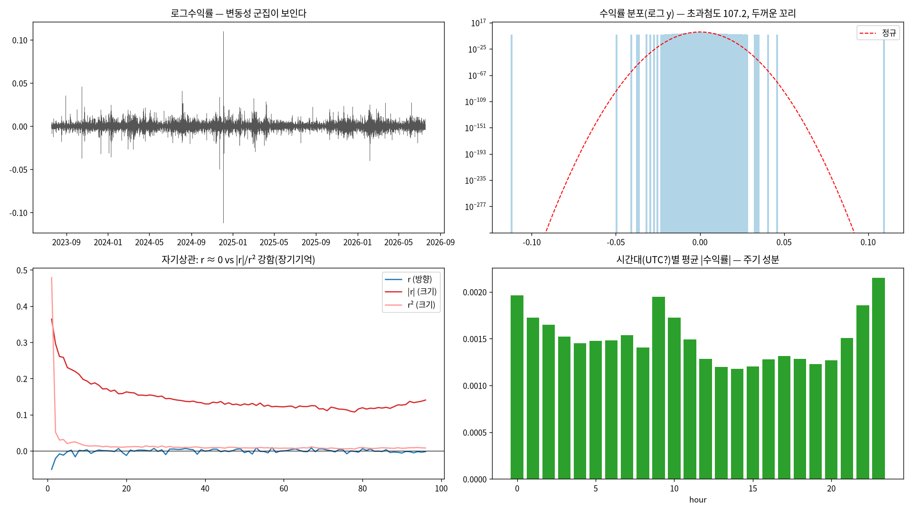
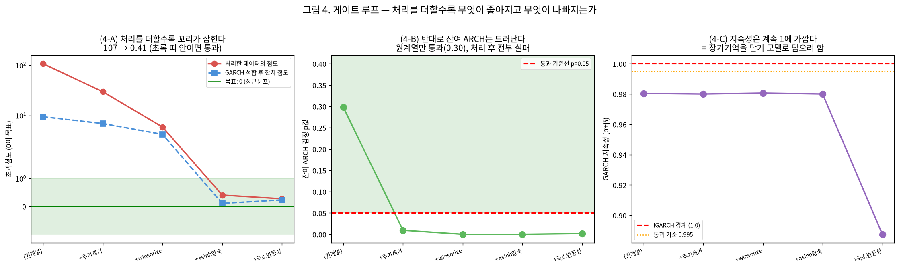
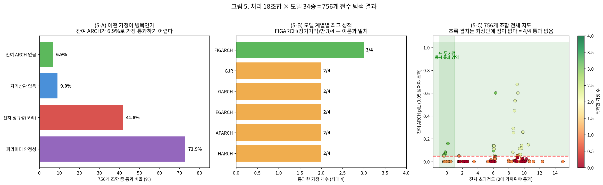
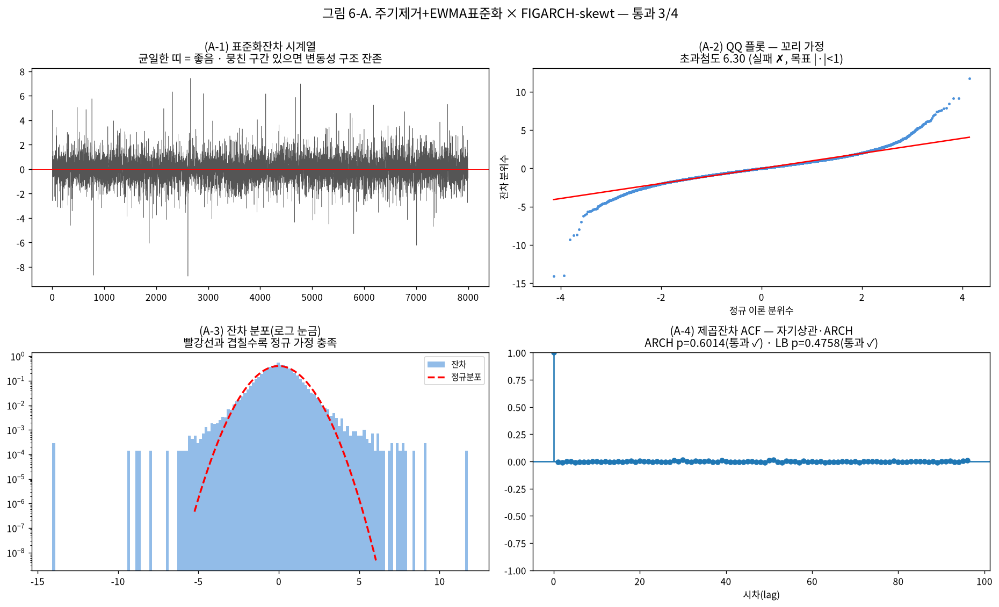
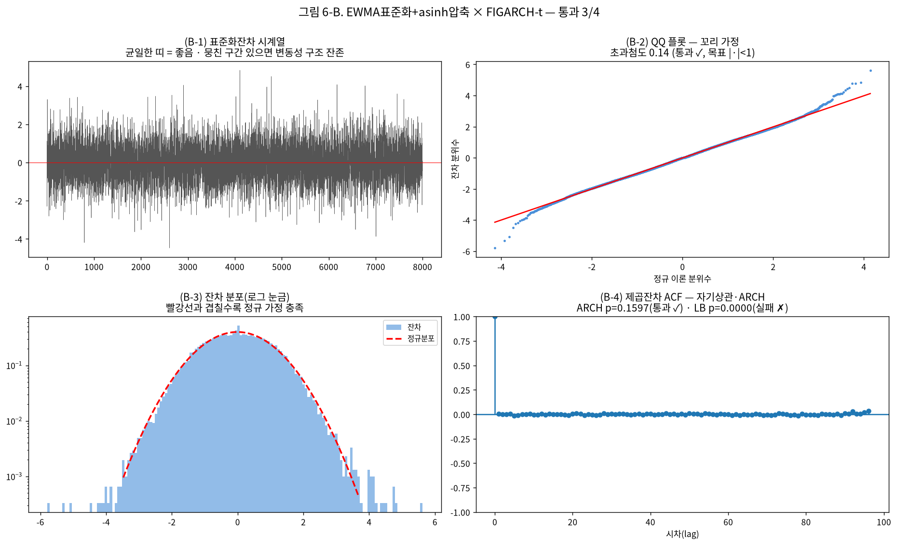
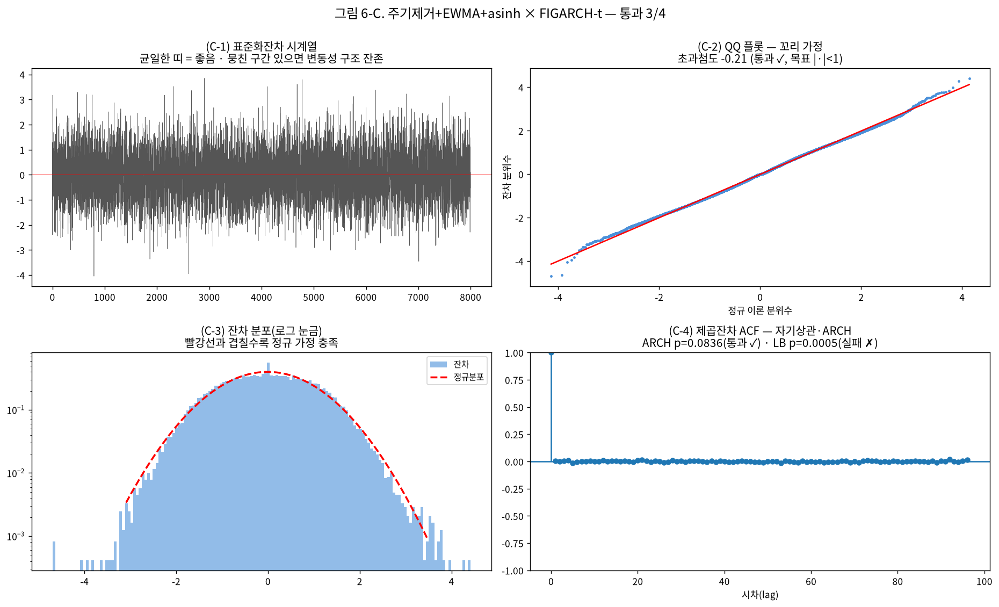
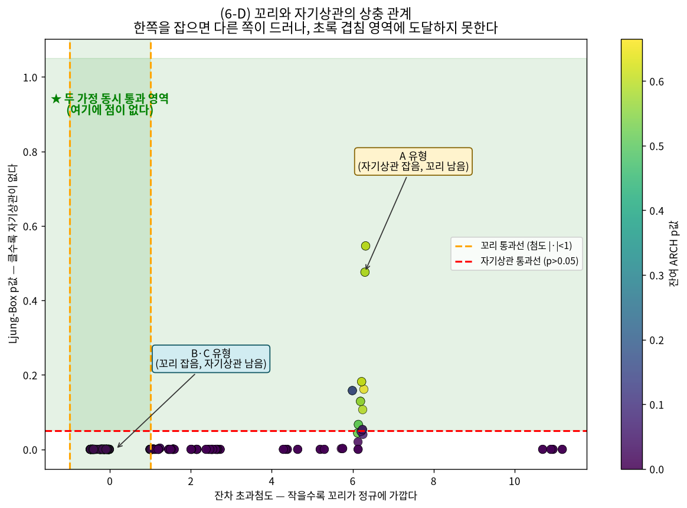

# 변동성 모델 가정 진단 보고서

작성일 2026-09-07 · 브랜치 `stock` · 대상 KRW-BTC 15분봉 104,882개
· 앞선 [임시 탐색 보고서](scratch_volatility_report_20260907.md)의 **정정 및 심화**입니다.

> **읽는 법**: 그림은 `그림 2`처럼 번호가 있고, 그 안의 각 패널은 `(2-A)`, `(2-B)`처럼
> 라벨이 붙어 있습니다. 본문에서 `(2-B)`라고 하면 그림 2의 B 패널을 가리킵니다.

---

## 0. 요약 — 세 줄

1. 이전에 전달드린 "구간이 길어지면 GARCH가 좋아진다"는 **코드 버그(미래 정보를 미리 봄)** 때문이었고, 바로잡으니 결과가 반대로 나왔습니다.
2. 그래서 성능 비교를 멈추고 **통계 모델의 가정이 실제로 충족되는지**부터 검정했더니, **756개 조합 어디에서도 4개 가정을 동시에 만족시키지 못했습니다.**
3. 원인은 데이터에 있습니다 — **양쪽 꼬리가 극단적으로 두껍고**, **꼬리를 잡으면 자기상관이 드러나는 상충**이 있습니다. 다만 **FIGARCH(장기기억 모델)가 일관되게 최상위**로, 이론적 예측과는 일치했습니다.

---

## 1. 문제 ① — 이전 결과의 코드 버그 (정정)

**무엇이 잘못됐나.** GARCH로 "h구간 뒤 변동성"을 예측할 때, 그 구간 안에서 **실제로 일어난 미래 수익률**을 계산식에 그대로 넣고 있었습니다. 시험 문제를 풀면서 답안지를 미리 본 셈이라, 성능이 비현실적으로 높게(R² 0.81~0.99) 나왔습니다.

**어떻게 고쳤나.** 미래 정보를 전혀 쓰지 않고 현재까지 알려진 값만으로 예측하는 방식(GARCH의 닫힌 형태 다단계 예측식, 이후 `arch` 패키지의 정식 API)으로 교체했습니다.

| 항목 | 이전(버그) | 수정 후 |
| :--- | :--- | :--- |
| 구간이 길어질 때 GARCH | 성능이 크게 올라감 | **오히려 나빠짐** (예측이 장기 평균값으로 수렴해서) |
| 짧은 구간에서 트리 계열 1등 | 맞음 | **유지** |
| 딥러닝이 전반적으로 부진 | 맞음 | **유지** |

---

## 2. 문제 ② — 데이터 분포: 꼬리가 얼마나 두꺼운가

### 왜 이걸 봤나

통계 모델은 대부분 "오차가 정규분포를 따른다"고 가정합니다. 그 가정이 맞는지부터 확인해야 모델을 고를 수 있습니다.

### 무엇을 봤나



**(2-A) 분포 모양.** 실제 분포(파란 곡선)를 같은 평균·표준편차의 정규분포(빨간 점선)와 겹쳐 그렸습니다. 실제는 **가운데가 훨씬 뾰족하고 어깨(중간 부분)는 오히려 얇습니다.** 평소에는 거의 안 움직이다가 가끔 크게 튄다는 뜻입니다.

**(2-B) 같은 분포를 로그 눈금으로.** (2-A)에서는 꼬리가 너무 납작해서 안 보입니다. 세로축을 로그로 바꾸면 **빨간 정규분포선은 급격히 떨어져 사라지는데, 실제 데이터(파랑)는 옆으로 길게 뻗어 있습니다.** 이 뻗은 부분이 바로 "두꺼운 꼬리"입니다.

**(2-C) QQ 플롯.** 점들이 빨간 직선 위에 놓이면 정규분포입니다. 실제로는 **양쪽 끝이 모두 직선에서 크게 벗어납니다.** 왼쪽 아래로, 오른쪽 위로 휘어 있어서 **한쪽이 아니라 양쪽 꼬리 모두** 두껍다는 것을 보여줍니다.

**(2-D) 실제로 몇 배나 자주 일어나는가.** 정규분포라면 이만큼 일어나야 한다는 기대치(검은 별)와 실제 발생 횟수(막대)를 비교했습니다.

| 기준 | 하락 | 상승 | 정규분포 기대 | 배수 |
| :--- | ---: | ---: | ---: | ---: |
| 3σ 초과 | 830회 | 883회 | 141.6회 | 약 6배 |
| 4σ 초과 | 345회 | 360회 | 3.3회 | **약 100배** |
| 5σ 초과 | 163회 | 181회 | 0.03회 | **약 5,400배** |
| 6σ 초과 | 90회 | 106회 | 거의 0회 | **약 87만배** |

### 결론

- **양쪽 꼬리가 모두 두껍고, 좌우는 거의 완벽히 대칭입니다** (왜도 0.0045). 주식은 보통 하락 꼬리가 더 두꺼운데, 이 데이터는 상승·하락이 대등합니다.
- **초과첨도 107.19** (정규분포는 0). 최대 급변은 하락 -47σ, 상승 +46σ였습니다.
- **의미**: 정규분포를 가정하는 모델은 이 급변 위험을 크게 과소평가합니다. 그래서 t분포·skew-t를 써야 하는데, 뒤에서 보듯 그것으로도 부족했습니다.

---

## 3. 문제 ③ — EDA가 확인한 데이터 특성

### 왜 이걸 봤나

어떤 모델을 쓸지는 데이터 특성이 결정합니다. 특성과 모델 구조가 맞아야 가정도 충족됩니다.



| 특성 | 실측값 | 이론적으로 필요한 모델 |
| :--- | :--- | :--- |
| **조건부 이분산** (변동성이 시간에 따라 변함) | ARCH-LM p=0.000 | GARCH 계열 |
| **장기기억** (과거 영향이 오래 감) | \|수익률\| 자기상관이 하루(96봉) 뒤에도 0.12 | **FIGARCH**(분수적분), HAR |
| **두꺼운 꼬리** | 초과첨도 107 | t분포·skew-t |
| **방향은 예측 불가** | 수익률 자기상관 ≈ 0 | (변동성만 예측 대상) |

**핵심 불일치**: 가장 널리 쓰는 GARCH(1,1)은 **과거 영향이 빠르게 사라지는 구조**입니다. 그런데 우리 데이터는 영향이 오래 남는 **장기기억**입니다. 이 불일치가 이후 모든 문제의 근원입니다.

---

## 4. 시도 ① — 처리하고 검정하고 다시 처리하는 반복

### 왜 이렇게 했나

가정이 안 맞으면 성능을 비교해도 의미가 없습니다. 그래서 **"처리 → 검정 → (불만족이면) 추가 처리 → 재검정"**을 반복해서, 가정이 충족될 때까지 데이터를 다듬는 방식으로 바꿨습니다.



**(4-A) 꼬리는 잡혔습니다.** 처리를 하나씩 더할 때마다 초과첨도가 **107 → 29 → 5.9 → 0.41**로 떨어졌습니다. 특히 asinh 압축(큰 값을 눌러주는 변환)에서 초록 통과 구간에 들어왔습니다.

**(4-B) 그런데 잔여 ARCH는 오히려 드러났습니다.** 원계열에서는 통과(p=0.298)했는데, 처리를 할수록 실패로 바뀌었습니다. 이유는 **원계열의 극단값들이 검정을 가리고 있었기 때문**입니다. 이상치를 정리하니 GARCH(1,1)이 잡지 못하는 **진짜 구조가 노출**된 것입니다.

**(4-C) 지속성은 계속 1에 가까웠습니다.** 이 값이 1에 붙는다는 건 **장기기억을 단기 모델로 억지로 담으려 한다**는 신호입니다. 3절의 불일치가 여기서 수치로 확인됩니다.

---

## 5. 시도 ② — 756개 조합 전수 탐색

### 왜 이렇게 했나

처음에는 모델을 GARCH(1,1)로 고정하고 처리만 골랐는데, 이러면 **다른 차수에서만 통과할 조합을 놓칩니다.** 실제로 어떤 처리는 GARCH(1,1)에서는 나빴지만 GARCH(2,2)에서는 통과했습니다. 그래서 **처리와 모델을 전부 교차**해서 다시 했습니다.

- **처리 18조합**: 시간대 주기 제거 · 점프 분리 · EWMA 표준화 · 장기성분 제거 · 극단값 절단 · asinh 압축의 조합
- **모델 34종**: GARCH 차수 (1,1)~(3,3) · GJR · EGARCH · APARCH · FIGARCH · HARCH × (t분포, skew-t)
- **총 756개 적합 + 4개 가정 검정**



**(5-A) 무엇이 병목인가.** 4개 가정 중 통과율이 가장 낮은 것을 찾았습니다. **잔여 ARCH가 6.9%로 최대 병목**이고, 자기상관(9.0%)이 그다음입니다. 꼬리(41.8%)와 안정성(72.9%)은 상대적으로 쉽게 통과합니다.

**(5-B) 어떤 모델 계열이 나은가.** **FIGARCH만 3/4를 통과**했고 나머지는 전부 2/4에 그쳤습니다. 상위 14위까지 전부 FIGARCH였습니다. FIGARCH는 장기기억을 직접 모델링하는 구조라, **3절에서 확인한 데이터 특성과 이론적으로 일치**합니다.

**(5-C) 전체 지도.** 가로축은 꼬리(왼쪽일수록 좋음), 세로축은 잔여 ARCH(위쪽일수록 좋음)입니다. 두 초록 영역이 겹치는 **좌상단이 목표 지점인데, 거기에 점이 하나도 없습니다.** 756개 조합 중 4/4 통과가 0개라는 뜻입니다.

---

## 6. 문제 ④ — 꼬리와 자기상관의 상충

### 왜 이걸 봤나

4/4 통과가 없다면, **무엇 때문에 막히는지** 알아야 다음 수를 정할 수 있습니다. 최상위 후보 세 개의 잔차를 자세히 진단했습니다.

### (6-A) 유형 A — 자기상관은 잡았지만 꼬리가 남음



`주기제거 + EWMA표준화 × FIGARCH-skewt` (3/4 통과)

- **(A-4)** 잔여 ARCH p=0.601, Ljung-Box p=0.476 — **시간 구조를 완전히 제거**했습니다. 막대들이 파란 신뢰구간 안에 들어와 있습니다.
- **(A-2)** 그런데 QQ 플롯 양 끝이 여전히 휘어 있고 초과첨도 6.30 — **꼬리가 남았습니다.**

### (6-B) 유형 B — 꼬리는 잡았지만 자기상관이 남음



`EWMA표준화 + asinh압축 × FIGARCH-t` (3/4 통과)

- **(B-2)** 초과첨도 0.14 — **꼬리를 완벽하게 잡았습니다.** QQ 점들이 직선에 거의 붙어 있습니다.
- **(B-4)** 대신 Ljung-Box p=0.000 — **제곱잔차 자기상관이 드러났습니다.**

### (6-C) 유형 C — B와 같은 패턴



`주기제거 + EWMA + asinh × FIGARCH-t` (3/4 통과). 초과첨도 -0.21로 꼬리는 완벽하지만 Ljung-Box p=0.0005로 자기상관이 남습니다.

### (6-D) 상충의 구조



세 유형을 한 그림에 놓으면 패턴이 명확합니다. **왼쪽(꼬리를 잡은 조합)은 전부 바닥에 깔려 있고(자기상관 실패), 위쪽(자기상관을 잡은 조합)은 오른쪽에 있습니다(꼬리 실패).** 두 초록 영역이 겹치는 지점에 도달한 조합이 없습니다.

**원인**: 꼬리를 잡는 asinh 압축이 큰 변동의 크기 정보를 뭉개면서, 제곱잔차에 구조를 남깁니다. 이를 피하려고 **분위수 정규화**(순위를 정규분포로 바꾸는 변환, 순서 구조는 보존)와 **단기 EWMA**를 추가해 294개 조합을 더 탐색했지만, 여전히 4/4는 없었습니다.

---

## 7. 현재까지의 결론

1. **통계 모델(GARCH 계열) 단독으로는 이 데이터의 가정을 충족시킬 수 없습니다.** 처리·차수·비대칭·장기기억·분포를 모두 조합한 1,050개 탐색에서 4개 가정을 동시에 만족하는 조합이 없었습니다.
2. **다만 이론적 예측은 맞았습니다.** 장기기억을 직접 다루는 FIGARCH가 일관되게 최상위였고, 데이터 특성과 모델 구조가 부합할수록 성적이 좋아졌습니다.
3. **병목은 잔여 ARCH(6.9% 통과)와 꼬리–자기상관 상충**입니다.

---

## 8. 다음에 할 일

| 순위 | 할 일 | 이유 |
| :--- | :--- | :--- |
| 1 | **하이브리드 모델** — GARCH·FIGARCH가 뽑아낸 조건부분산을 머신러닝·딥러닝의 입력으로 결합 | 통계 모델이 못 잡는 잔여 구조를 비모수 방법으로 보완 |
| 2 | **레짐 전환 모델**(Markov-switching GARCH) 검토 | 상충의 원인이 국면 전환일 가능성 |
| 3 | **선형 모델 재검토** | 선형성 검정(RESET·BDS)이 전부 기각되어 선형 모델을 쓸 근거가 없음 → 비선형·커널 계열(SVR·KernelRidge·GP)로 대체 |
| 4 | **전 종목 확대 검증** | 현재 BTC 단일. 상위 20종목에서 같은 상충이 재현되는지 확인 |
| 5 | **가정 미충족 상태의 보고 규칙 확립** | 가정을 못 맞춘 채 성능만 비교하면 통계적으로 무의미하므로, 한계를 명시하는 서술 규칙 필요 |

---

## 부록 — 방법론

**데이터 파이프라인**

```
DuckDB upbit_krw_candle (15분봉 원본 OHLCV)
  → close 컬럼
  → 로그 변환 log(close)          [비정상: 단위근, ADF p=0.19]
  → 1차 차분 r = Δlog(close)      [정상성 확보, ADF p=0.000]
  → 추가 처리(주기제거·EWMA·asinh 등)
  → GARCH 계열 적합 + 잔차 진단
```

차분(로그수익률)이 모든 분석의 출발점이고, 그 위에 처리를 얹는 구조입니다.

**사용한 검정**

| 검정 | 무엇을 보나 | 통과 기준 |
| :--- | :--- | :--- |
| ADF / KPSS | 정상성(평균이 일정한가) | ADF p<0.05, KPSS p>0.05 |
| Jarque-Bera, 초과첨도 | 정규성(꼬리가 정상인가) | 초과첨도 \|·\|<1 |
| ARCH-LM | 조건부 이분산이 남았는가 | p>0.05 |
| Ljung-Box | 자기상관이 남았는가 | p>0.05 |
| RESET, BDS | 선형성(직선 관계인가) | p>0.05 |
| Breusch-Pagan, White | 등분산 | p>0.05 |
| Kolmogorov-Smirnov | train/test 분포 이동 | p>0.05 |

**비용 통제**: 격자 탐색은 최근 40,000봉(약 1.1년)으로 제한하고 16개 프로세스로 병렬 처리했습니다. 원시 수치는 `test/results/_stage1*.csv`에 있습니다.
