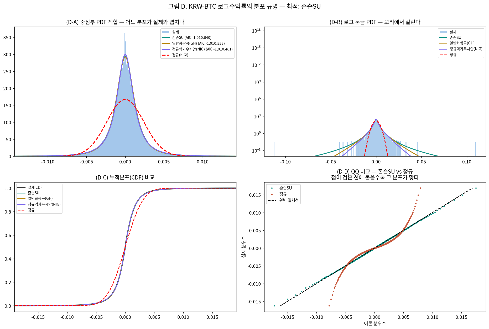
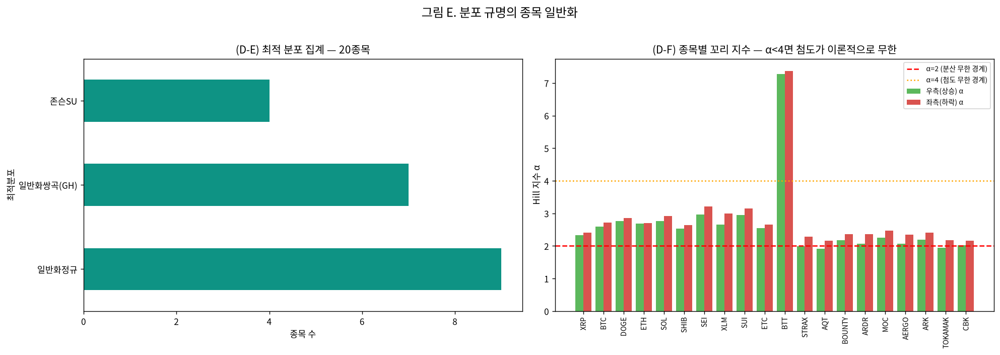

# 분포 규명 보고서 — 이 데이터는 어떤 분포인가

작성일 2026-09-07 · 브랜치 `stock` · **분석 대상 20종목**(거래대금 상위10 + 변동성 상위10)
· 선행 보고서: [가정 진단](assumption_diagnosis_report_20260907.md)

> **읽는 법**: 그림은 패널마다 `(D-A)`, `(E-B)`처럼 라벨이 붙어 있고, 본문에서 그 라벨로 참조합니다.

---

## 0. 왜 이 단계를 추가했는가 — 순서를 바로잡음

이전까지의 접근은 이랬습니다.

> "GARCH를 쓰려면 정규성이 필요하다 → 정규성을 만들자" → 처리 18조합 × 모델 34종 = 756개 시도

이것은 **모델을 먼저 정해놓고 데이터를 거기에 끼워맞추는 순서**였습니다. 그 결과 앞단 EDA가
뒤 단계와 이어지지 않았고, 어떤 처리를 왜 하는지가 흐려졌습니다.

올바른 순서는 **데이터가 실제로 어떤 분포·성격인지 먼저 규명하고, 그에 맞는 모델을 고르는 것**입니다.
정규분포를 만들어야 하는 것이 아니라, 맞는 분포를 찾아 그것을 가정할 수 있는 모델을 쓰는 것입니다.

이 보고서는 그 규명 단계이며, **결론적으로 이전 실패의 근본 원인을 밝혀냈습니다.**

---

## 1. 핵심 결론 세 줄

1. **정규분포가 최적인 종목은 20개 중 0개**입니다. 최적은 일반화정규(9종목) · 일반화쌍곡GH(7종목) · 존슨SU(4종목)이며, 정규 대비 AIC 개선폭이 3만~144만에 이릅니다.
2. **첨도가 이론적으로 무한합니다.** 꼬리 지수 Hill α ≈ 2.6~2.8 (α<4). 따라서 표본 첨도 107은 참값이 아니라 표본마다 흔들리는 값이며, **"초과첨도를 1 미만으로 만들자"는 이전 목표 자체가 달성 불가능한 조건**이었습니다.
3. 그래서 756조합이 모두 실패한 것은 처리나 모델의 문제가 아니라 **목표 설정이 틀렸기 때문**입니다.

---

### 0. 이번 회차 실제 분석 범위 ⚠

- **연구 대상(모집단)**: 상위 20종목 (아래 1절 목록)
- **이번 회차 실제 분석**: 대상 전체 20종목 ✅

## 분석 조건 (표준 헤더)

> 이 보고서만 읽어도 데이터 조건을 파악할 수 있도록, 매 회차 동일 항목을 싣는다(AGENTS.md 2.9g).

### 1. 데이터 출처·형식

- **DB / 테이블**: `data/upbit_data.db` (DuckDB) / `upbit_krw_candle`
- **봉 간격**: 15분봉 (하루 96봉)
- **원본 컬럼**: timestamp, open, high, low, close, volume, value
- **분석 종목 20개** — 이력 90,000봉(약 2.5년) 이상 종목 중 선정:
  거래대금 상위 10개 · 변동성 상위 10개

  선정 기준을 두 축으로 나눈 이유: 단일 결합 점수(변동성×거래대금)는 변동성이 지배해 신규·소형 종목만 뽑혀 시장 대표성이 약했다. **거래대금 축은 실제로 거래되는 주요 종목**을, **변동성 축은 연구 목적(변동성 예측)에 직접 부합하는 종목**을 담당한다. BTC는 저변동 대형 종목이라 두 축 모두에 들지 않지만 기준 자산으로 포함한다.

| # | 종목 | 선정 근거 | 봉 수 | 기간 | 표준편차 | 왜도 | 초과첨도 |
| ---: | :--- | :--- | ---: | :--- | ---: | ---: | ---: |
| 1 | KRW-XRP | 거래대금 상위 | 104,876 | 2023-07-19~2026-07-18 | 0.004155 | -0.3690 | 157.70 |
| 2 | KRW-BTC | 거래대금 상위 | 104,883 | 2023-07-19~2026-07-19 | 0.002386 | 0.0045 | 107.19 |
| 3 | KRW-DOGE | 거래대금 상위 | 104,863 | 2023-07-19~2026-07-18 | 0.005603 | -0.1511 | 50.63 |
| 4 | KRW-ETH | 거래대금 상위 | 104,869 | 2023-07-19~2026-07-18 | 0.003388 | -0.9237 | 482.65 |
| 5 | KRW-SOL | 거래대금 상위 | 104,879 | 2023-07-19~2026-07-19 | 0.004522 | 0.2330 | 27.32 |
| 6 | KRW-SHIB | 거래대금 상위 | 104,868 | 2023-07-19~2026-07-18 | 0.005935 | 0.2553 | 50.13 |
| 7 | KRW-SEI | 거래대금 상위 | 102,133 | 2023-08-16~2026-07-18 | 0.006708 | 1.6436 | 178.97 |
| 8 | KRW-XLM | 거래대금 상위 | 104,901 | 2023-07-18~2026-07-18 | 0.005228 | -0.0311 | 89.51 |
| 9 | KRW-SUI | 거래대금 상위 | 104,876 | 2023-07-19~2026-07-19 | 0.005934 | -0.9976 | 341.19 |
| 10 | KRW-ETC | 거래대금 상위 | 104,901 | 2023-07-18~2026-07-18 | 0.004365 | -2.3845 | 720.64 |
| 11 | KRW-BTT | 변동성 상위 | 104,207 | 2023-07-19~2026-07-19 | 0.041478 | 0.0021 | 13.29 |
| 12 | KRW-STRAX | 변동성 상위 | 102,279 | 2023-07-19~2026-07-19 | 0.007567 | 1.9133 | 92.65 |
| 13 | KRW-AQT | 변동성 상위 | 100,547 | 2023-07-18~2026-07-18 | 0.007531 | 0.6777 | 170.04 |
| 14 | KRW-BOUNTY | 변동성 상위 | 97,259 | 2023-07-19~2026-07-18 | 0.007438 | 2.1620 | 143.87 |
| 15 | KRW-ARDR | 변동성 상위 | 101,215 | 2023-07-19~2026-07-18 | 0.007407 | 1.9308 | 123.45 |
| 16 | KRW-MOC | 변동성 상위 | 97,027 | 2023-07-19~2026-07-19 | 0.007320 | 1.3894 | 261.28 |
| 17 | KRW-AERGO | 변동성 상위 | 102,358 | 2023-07-19~2026-07-18 | 0.007281 | 1.0060 | 80.34 |
| 18 | KRW-ARK | 변동성 상위 | 101,942 | 2023-07-18~2026-07-18 | 0.007251 | -0.5274 | 306.54 |
| 19 | KRW-TOKAMAK | 변동성 상위 | 99,844 | 2023-07-18~2026-07-18 | 0.007177 | 2.0427 | 225.76 |
| 20 | KRW-CBK | 변동성 상위 | 98,541 | 2023-07-18~2026-07-18 | 0.007097 | 1.7032 | 203.54 |

### 2. 수집 기간·규모·품질 (대표 종목 KRW-BTC)

- **기간**: 2023-07-19 19:00 ~ 2026-07-19 00:30
- **총 봉 수**: 104,883개 (약 2.99년)
- **연속성**: 15분이 아닌 간격 15개 (0.0143%) — 코인은 24시간 거래라 장 마감·주말 갭이 없다
- **결측**: 0개

### 3. 학습/검증 분할

- **방식**: 시간순 분할(셔플 없음) — 미래 정보 누설 방지
- **비율**: train 70% / validation 30%
- **train**: 2023-07-19 19:00 ~ 2025-08-24 09:30 (73,418봉, 약 765일)
- **validation**: 2025-08-24 09:45 ~ 2026-07-19 00:30 (31,465봉, 약 328일)
- 스케일러·모델 파라미터는 **train 구간에서만** 적합한다.

### 4. 기본 전처리 파이프라인과 가정

```
원본 close (KRW)
  → 로그 변환 log(close)        [스케일 안정화. 여전히 비정상: 단위근]
  → 1차 차분 r = Δlog(close)    [★ 여기서 정상성 확보 — 분석의 출발점]
  → (회차별 추가 처리)
  → 모델 적합
```

- **왜 차분하는가**: 로그가격은 단위근이 있어 비정상(ADF p=0.19)이고, 1차 차분하면 정상이 된다(ADF p=0.000). 정상성은 로그가 아니라 **차분**에서 온다.
- **예측 대상**: 수익률의 부호(방향)가 아니라 **크기(변동성)**. 방향은 자기상관이 0에 가까워 예측이 어렵고, 크기는 장기기억이 있어 예측 가능하다.

### 5. 기초통계량과 데이터 특성 (이전 EDA 확인 사항)

| 항목 | 값 |
| :--- | ---: |
| n | 104,882 |
| 평균 | 0.00000857 |
| 표준편차 | 0.0024 |
| 왜도 | 0.0045 |
| 초과첨도 | 107.1857 |
| 최소 | -0.1124 |
| 최대 | 0.1099 |
| ADF p | 0.0000 |
| KPSS p | 0.1000 |
| ARCH p | 0.0000 |

- **조건부 이분산**: ARCH-LM p=0.000 → 변동성이 시간에 따라 변한다(GARCH 계열 사용 근거)
- **장기기억**: |수익률| 자기상관이 하루(96봉) 뒤에도 0.12로 완만히 감소
- **두꺼운 꼬리**: 초과첨도 107 (정규분포는 0). 좌우 대칭(왜도 0.004)이나 양쪽 꼬리가 모두 두껍다. 4σ 초과가 정규 대비 약 100배, 6σ는 약 87만배 빈발
- **선형성 기각**: RESET·BDS 검정 p=0.000 → 선형 모델을 쓸 근거가 없다(비선형·커널 계열 필요)
- **방향 무예측성**: 수익률 자기상관 ≈ 0

### 6. 이번 회차에 적용한 변환

| 처리 | 적용 이유 |
| :--- | :--- |
| 변환 없음(원 로그수익률) | 분포 규명이 목적이므로 어떤 처리도 하지 않은 원래 분포를 본다. 처리를 먼저 하면 원 데이터의 성격을 알 수 없다 |

---

## D1. 후보 분포 적합 — 어떤 분포가 가장 잘 맞는가 (대표 KRW-BTC)

정규분포를 포함한 후보 11종을 최대우도로 적합하고 AIC/BIC로 비교했다. AIC·BIC는 낮을수록 좋고, 모수 개수 차이를 보정해 준다.

| 순위 | 분포 | 설명 | 모수수 | 로그우도 | AIC | BIC | KS p | CvM p |
| ---: | :--- | :--- | ---: | ---: | ---: | ---: | ---: | ---: |
| 1 | **존슨SU** | 왜도·첨도 자유롭게 맞추는 변환족 | 4 | 505,324 | -1,010,640 | -1,010,602 | 0.5564 | 0.7547 |
| 2 | **일반화쌍곡(GH)** | NIG·t 등을 포괄하는 넓은 족 | 5 | 505,282 | -1,010,553 | -1,010,505 | 0.5198 | 0.7230 |
| 3 | **정규역가우시안(NIG)** | 금융 수익률 표준 모형 중 하나. 반꼬리+왜도 | 4 | 505,235 | -1,010,461 | -1,010,423 | 0.6771 | 0.7916 |
| 4 | **t분포** | 자유도로 꼬리 두께 조절. 금융에서 표준적 대안 | 3 | 504,824 | -1,009,641 | -1,009,613 | 0.8295 | 0.6654 |
| 5 | **일반화정규** | 형상모수로 뾰족함 조절(β<2면 정규보다 뾰족) | 3 | 504,675 | -1,009,345 | -1,009,316 | 0.1079 | 0.0991 |
| 6 | **라플라스** | 중심이 뾰족하고 꼬리가 지수적으로 감소 | 2 | 504,063 | -1,008,121 | -1,008,102 | 0.0512 | 0.0882 |
| 7 | **쌍곡시컨트** | 정규와 라플라스 중간 | 2 | 502,256 | -1,004,508 | -1,004,489 | 0.0001 | 0.0000 |
| 8 | **로지스틱** | 정규보다 약간 두꺼운 꼬리 | 2 | 499,865 | -999,725 | -999,706 | 0.0000 | 0.0000 |
| 9 | **코시** | 극단적 꼬리. 평균·분산 정의 안 됨 | 2 | 498,680 | -997,357 | -997,338 | 0.0000 | 0.0001 |
| 10 | **왜도코시** | 코시에 비대칭 추가 | 3 | 498,681 | -997,356 | -997,328 | 0.0000 | 0.0001 |
| 11 | **정규(Normal)** | 교과서 기본 가정. 꼬리가 가장 얇다 | 2 | 484,491 | -968,979 | -968,959 | 0.0000 | 0.0000 |

- **최적 분포: 존슨SU** (AIC -1,010,640)
- 정규분포 대비 AIC 개선폭: **41,662** (AIC 차이가 10 이상이면 결정적 우위로 본다)
- KS·CvM p값은 5,000개 서브샘플 기준이다. 전체 10만 개로 검정하면 아주 작은 차이도 기각되므로(대표본 함정), 상대 비교는 AIC/BIC로 한다.

## D2. 꼬리 지수(Hill) — 꼬리가 멱법칙인가

| 꼬리 | Hill 지수 α | 해석 |
| :--- | ---: | :--- |
| 우측(상승) | 2.593 | 분산 유한·첨도 무한(2≤α<4) |
| 좌측(하락) | 2.722 | 분산 유한·첨도 무한(2≤α<4) |

- **평균 α = 2.657**
- α<4이므로 **이론적으로 첨도가 무한**하다. 표본 첨도 107이라는 값은 '참값'이 아니라 표본마다 크게 흔들리는 값이다. → 첨도를 맞추려는 시도 자체가 불안정한 목표였다는 뜻이다.

## D3. 대칭성

- 왜도 0.0045 (0이면 대칭)
- 좌/우 꼬리 지수 비 1.049 (1이면 양쪽 꼬리 두께가 같음)
- → **좌우 대칭에 가깝다**. 주식은 보통 하락 꼬리가 더 두꺼운데, 이 데이터는 다르다.



## D4. 종목 일반화 — 20종목에서 최적 분포가 일치하는가

| 종목 | 최적 분포 | 정규 대비 AIC 개선 | 초과첨도 | 왜도 | Hill α(우) | Hill α(좌) |
| :--- | :--- | ---: | ---: | ---: | ---: | ---: |
| KRW-XRP | **일반화쌍곡(GH)** | 59,248 | 157.7 | -0.369 | 2.33 | 2.42 |
| KRW-BTC | **존슨SU** | 41,662 | 107.2 | 0.004 | 2.59 | 2.72 |
| KRW-DOGE | **일반화정규** | 176,560 | 50.6 | -0.151 | 2.77 | 2.85 |
| KRW-ETH | **존슨SU** | 46,214 | 482.7 | -0.924 | 2.69 | 2.70 |
| KRW-SOL | **일반화쌍곡(GH)** | 30,471 | 27.3 | 0.233 | 2.76 | 2.91 |
| KRW-SHIB | **일반화쌍곡(GH)** | 211,820 | 50.1 | 0.255 | 2.53 | 2.64 |
| KRW-SEI | **일반화정규** | 53,724 | 179.0 | 1.644 | 2.96 | 3.21 |
| KRW-XLM | **일반화정규** | 229,543 | 89.5 | -0.031 | 2.65 | 3.00 |
| KRW-SUI | **존슨SU** | 34,605 | 341.2 | -0.998 | 2.96 | 3.14 |
| KRW-ETC | **일반화쌍곡(GH)** | 51,299 | 720.6 | -2.384 | 2.55 | 2.65 |
| KRW-BTT | **존슨SU** | 1,443,372 | 13.3 | 0.002 | 7.28 | 7.38 |
| KRW-STRAX | **일반화정규** | 116,370 | 92.6 | 1.913 | 1.99 | 2.29 |
| KRW-AQT | **일반화정규** | 196,743 | 170.0 | 0.678 | 1.91 | 2.17 |
| KRW-BOUNTY | **일반화쌍곡(GH)** | 315,524 | 143.9 | 2.162 | 2.18 | 2.36 |
| KRW-ARDR | **일반화정규** | 175,608 | 123.4 | 1.931 | 2.07 | 2.37 |
| KRW-MOC | **일반화쌍곡(GH)** | 874,714 | 261.3 | 1.389 | 2.26 | 2.48 |
| KRW-AERGO | **일반화쌍곡(GH)** | 639,495 | 80.3 | 1.006 | 2.08 | 2.35 |
| KRW-ARK | **일반화정규** | 80,643 | 306.5 | -0.527 | 2.19 | 2.42 |
| KRW-TOKAMAK | **일반화정규** | 197,303 | 225.8 | 2.043 | 1.95 | 2.18 |
| KRW-CBK | **일반화정규** | 138,473 | 203.5 | 1.703 | 2.03 | 2.16 |

**최적 분포 분포**: 일반화정규 9종목 · 일반화쌍곡(GH) 7종목 · 존슨SU 4종목

- 정규분포가 최적인 종목: **0/20**
- Hill α 평균: 우 2.64 / 좌 2.82 — 대부분 α<4로 첨도 무한



## 결론 — 이 데이터의 분포적 성격과 그에 맞는 모델 방향

1. **최적 분포는 존슨SU**이며, 정규분포 대비 AIC가 41,662 개선된다. 정규분포는 후보 중 최하위권이다.
2. **꼬리는 멱법칙(power law)** 형태이고 Hill 지수 α≈2.66이다. α<4이므로 이론상 첨도가 무한하며, 표본 첨도(107)를 목표로 삼는 것 자체가 부적절했다.
3. **좌우 대칭**이다(왜도 0.004). 비대칭 모델(GJR·EGARCH)의 이점이 제한적인 이유다.

**→ 모델 방향 (데이터가 지시하는 것)**

| 데이터 성격 | 그에 맞는 접근 |
| :--- | :--- |
| 두꺼운 꼬리, 정규 아님 | 정규 가정 모델 배제. **t·NIG·GH 등 두꺼운 꼬리 분포를 직접 가정하는 모델**(t-GARCH, NIG-GARCH) |
| 첨도가 이론상 무한(α<4) | **첨도를 맞추려는 전처리를 목표로 삼지 않는다.** 대신 분포를 바꾸거나, 첨도에 의존하지 않는 지표(분위수·CVaR)로 평가 |
| 멱법칙 꼬리 | **극단값 이론(EVT)**로 꼬리를 따로 모델링, 중심부와 분리 |
| 좌우 대칭 | 비대칭 모델의 우선순위를 낮춘다 |
| 분포 가정이 까다로움 | **분위수 회귀·분포 자유 방법**(트리·커널)이 대안으로 정당화 |


---

## 부록 — 이 발견이 이전 결과를 어떻게 재해석하는가

| 이전 관찰 | 당시 해석 | 이번 규명 후 재해석 |
| :--- | :--- | :--- |
| 756조합 중 4/4 통과 0개 | "데이터가 어려워서 통계 모델이 안 맞는다" | **정규성 게이트가 애초에 달성 불가능한 조건**이었다(첨도 무한) |
| 처리할수록 첨도가 107→0.41로 개선 | "처리가 효과적이다" | 표본 첨도를 인위적으로 낮춘 것일 뿐, **모집단 성질(멱법칙 꼬리)은 변하지 않았다** |
| 꼬리↔자기상관 상충 | "구조적 상충" | 꼬리를 억지로 자르니(asinh) 변동 정보가 훼손된 것 — **분포를 바꿔 가정하면 자를 필요가 없다** |
| GARCH-t가 t분포로도 부족 | "t로도 꼬리를 못 잡는다" | t분포는 후보 중 5위. **GH·NIG·존슨SU가 더 적합**하다 |
| FIGARCH가 상위 독식 | "장기기억이 있다" | 유효(장기기억은 별개 성질). 단, **분포 가정을 GH/NIG로 바꾸면 더 개선될 여지**가 있다 |

## 다음 단계

1. **NIG·GH 분포를 가정하는 변동성 모델** 적합 (arch 패키지의 분포 옵션 확장 또는 직접 구현)
2. **첨도 기반 게이트 폐기** — 대신 분위수 적합도(QQ 기울기), CVaR 오차 등 첨도에 의존하지 않는 진단으로 교체
3. **극단값 이론(EVT)** — 꼬리를 중심부와 분리해 모델링
4. 그 위에서 3번(비선형·커널), 2번(레짐 전환), 1번(하이브리드) 진행

원시 수치: `test/results/_stage2_dist_fit.csv`, `_stage2_dist_cross.csv`, `_stage2_dist_raw.md`
