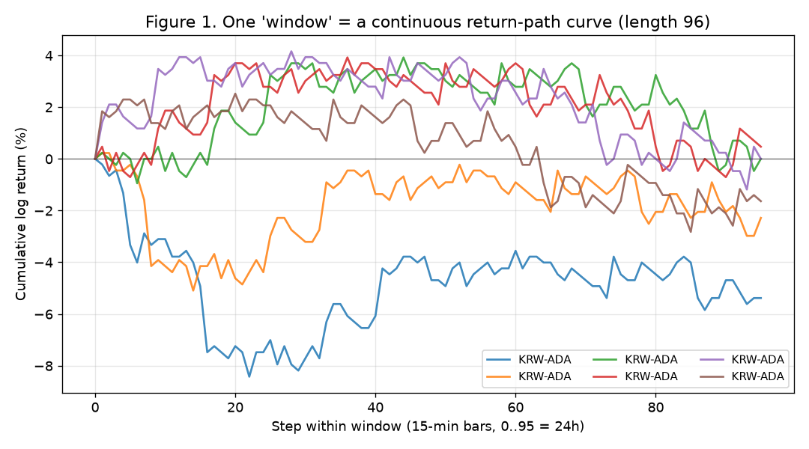
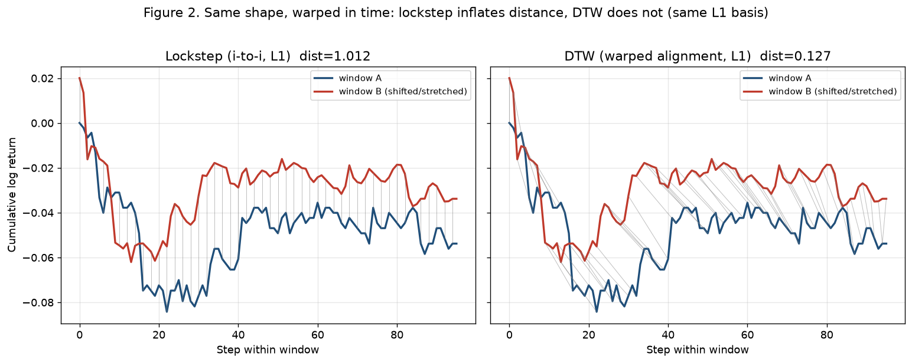
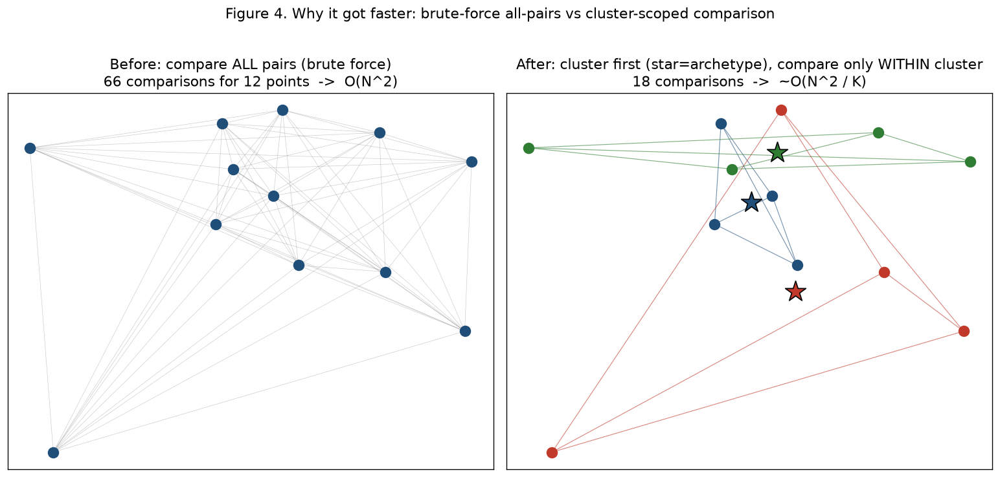
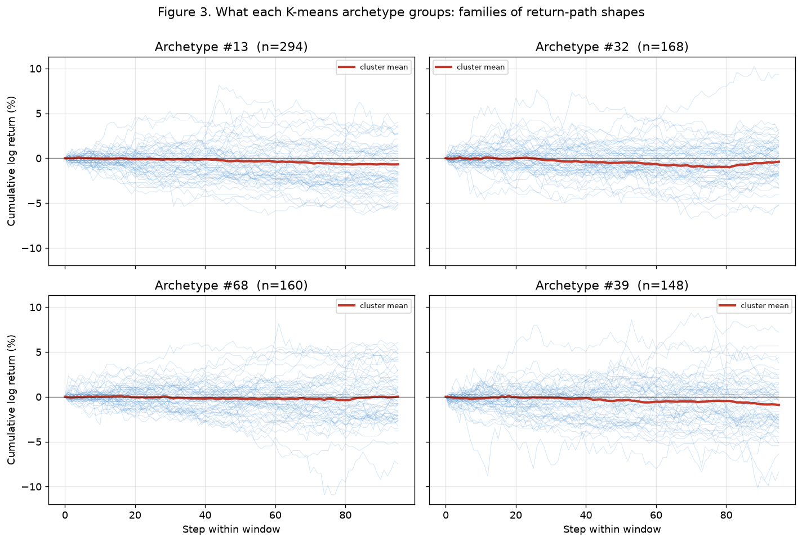
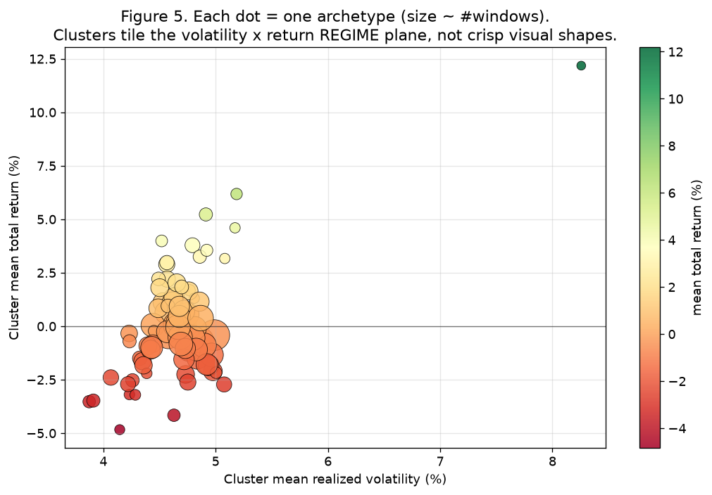

# 과거 유사 국면 검색(historical_flow) — 무엇을 저장하고 어떻게 비교하는가

작성일: 2026-07-23 · 관련 커밋: `13fc731`(마트 빌드 최적화) 이후
그림 생성기: `test/scripts/historical_flow_method_figures.py` (실제 마트 데이터 사용)

이 문서는 두 가지 질문에 답한다.
1. **"과거 데이터"가 이 마트 안에 정확히 어떤 형태로 들어있는가?**
2. **유사 국면을 찾을 때 (기존) 전수비교와 (지금) 클러스터 기반 방식의 차이는 무엇이고,
   DTW(시계열 정렬) 관점에서 지금 방식은 정당한가?**

> **결론 먼저 (정직한 요약)**
> - 당신의 직관은 옳다. 시계열 모양 비교에는 시간 왜곡을 흡수하는 **DTW가 격자대응(lockstep)
>   유클리드보다 적합**하다(그림 2).
> - 그런데 **마트 빌드는 원래부터 DTW를 쓰지 않았다.** 빌드의 이웃 정밀 순위는 예전 코드도 지금
>   코드도 **유클리드(lockstep)** 를 쓰고, **DTW는 오직 실시간 쿼리(`query_similar_flows`)에서만**
>   쓴다. 이번 "12일→7분" 최적화는 어디서도 DTW를 빼지 않았다(원래 없던 것).
> - 이번에 추가한 **K-means 클러스터링(archetype)은 시계열 정렬이 아니라 유클리드 기반**이라,
>   당신이 걱정한 "시간 연속성 미반영"이 실제로 있다. 데이터로 확인해보니(그림 3·5) 클러스터는
>   **곡선 모양이 아니라 변동성×수익률 '국면'으로** 갈라진다. 즉 지금 클러스터링은 "속도용 대략
>   버킷팅"이지 "모양 정렬"이 아니다.
> - **권고**: 속도와 당신의 DTW 의도를 둘 다 살리려면 §5의 **하이브리드(대략 버킷 → DTW 재순위)**
>   로 가는 게 맞다.

---

## 1. window 하나 = 연속적인 누적수익률 곡선 (당신 표현대로 "함수형 그래프")

마트의 최소 단위는 **window**다. 한 종목의 연속된 N개 15분봉을 잘라, 그 구간의
**누적 로그수익률 경로**(`return_path_json`, 길이 N)로 저장한다. N=96이면 24시간짜리 곡선이다.

- x축: window 안에서의 스텝(0..95 = 24시간), y축: 시작점 대비 누적 로그수익률(%).
- 각 선이 하나의 window다. 시작점을 0으로 맞춰 "모양"만 비교할 수 있게 정규화돼 있다.
- 이게 당신이 말한 "2차원 평면 위의 연속 함수 그래프"와 정확히 일치한다.

한 window에는 이 곡선(shape) 말고도 **요약 통계 벡터**(factor: 총수익률·실현변동성·MDD·추세기울기·
RSI·ROC·볼린저폭·Amihud 비유동성 등)와 **텍스트/컨텍스트 벡터**(context, 현재는 외생변수 미수집이라 0)
가 함께 저장된다. 이웃 거리는 이 셋을 가중합(shape 0.5 / factor 0.3 / context 0.2)한다.

전체 규모: 유동성 상위 50종목 × 창길이 4종(16·48·96·288) × 최대 2000구간 = **window 40만 개**,
사전계산된 이웃쌍 397만 개.

---

## 2. 왜 DTW인가 — 시간 왜곡을 흡수하는 정렬 (당신의 직관이 옳은 지점)

같은 모양이라도 시간축으로 밀리거나 늘어나면, **격자대응(lockstep, i번째-i번째를 그대로 비교)**
은 거리를 크게 부풀린다. **DTW(Dynamic Time Warping)** 는 두 곡선을 최적으로 정렬하는 경로를 찾아,
모양이 비슷하면 시간이 밀려도 낮은 거리를 준다.

- 두 곡선은 **같은 모양**인데 오른쪽(빨강)은 시간축으로 비선형으로 늘린 것이다(위치 비교용으로 살짝 위로 띄움).
- 공정 비교를 위해 **둘 다 '점별 절대차의 합(L1)' 기준**으로 계산했다. lockstep은 DTW가 고를 수
  있는 여러 정렬 경로 중 하나(대각선)이므로, 수학적으로 **DTW ≤ lockstep** 이 항상 보장된다.
- 결과: lockstep=1.012 vs **DTW=0.127**. 같은 모양인데 격자대응은 8배 부풀렸고, DTW는 제대로 낮게 봤다.

즉 "시계열이니 DTW 계열로 비교해야 한다"는 당신의 기획은 방법론적으로 타당하다.

---

## 3. 그런데 — 마트 빌드는 원래부터 DTW를 안 썼다 (정직한 현황)

코드 사실관계(파일 `marts/historical_flow.py`):

| 경로 | 함수 | 곡선(shape) 비교 방식 |
|---|---|---|
| **오프라인 마트 빌드** (사전계산) | `_build_neighbors` | **유클리드/lockstep** (예전=`np.linalg.norm`, 지금=`scipy.cdist`) |
| **실시간 쿼리** (지금 이 종목의 최신 구간) | `query_similar_flows` | **DTW** (`fastdtw`, 라인 223) |

- 이번 "12일 → 7분" 최적화는 **DTW를 빼거나 유클리드로 바꾼 게 아니다.** 빌드는 처음부터 유클리드였고,
  나는 그 유클리드 계산을 (a) 파이썬 반복문 → `cdist` 벡터화, (b) 클러스터 버킷팅, (c) 비유동 종목
  윈도우 생성 생략으로 빠르게 만든 것뿐이다.
- DTW는 여전히 살아있고, **가장 중요한 최종 순위(실시간 쿼리)에서만** 쓴다 — 이건 합리적 설계다.
  오프라인에서 40만×40만 DTW는 비현실적이라, 오프라인은 싼 근사, 온라인은 정밀 DTW로 나눈 것.

---

## 4. 이번에 추가한 클러스터링(archetype)의 정직한 한계

속도를 위해, 창길이별로 K개(=80)의 **국면 원형(archetype)** 을 K-means로 먼저 정의하고,
같은 원형 안에서만 이웃을 찾게 했다. 전수비교(O(N²))를 군집 내부(≈O(N²/K))로 줄이는 게 목적이다.

문제는 **K-means가 유클리드 기반**이라는 것. 당신이 지적한 "시간 연속성 미반영"이 여기서 실제로 발생한다.
데이터로 확인해보자.

**(a) 같은 클러스터의 곡선들이 뚜렷한 '모양 가족'으로 안 갈린다.**

- 상위 4개 archetype의 소속 곡선들을 겹쳐 그렸다(빨강=클러스터 평균). 네 클러스터 모두 0 근처
  노이즈 구름이고 평균선이 거의 평평하다 — 시각적으로 "상승형/하락형/V자" 같은 모양 가족으로
  깔끔히 갈리지 않는다.

**(b) 클러스터는 '모양'이 아니라 변동성×수익률 국면으로 갈린다.**

- 80개 archetype을 (평균 실현변동성, 평균 총수익률) 평면에 찍으면, 클러스터가 이 국면 평면을
  타일처럼 덮는다. 실제로 축별 분리력(클러스터간 표준편차 / 전체 표준편차)은
  **수익률 0.61 > MDD 0.24 > 변동성 0.17** 로, 수익률 국면으로 가장 잘 갈린다.

정리하면, 지금 클러스터링은 **"시계열 모양 정렬(DTW)"이 아니라 "요약통계 국면 버킷팅"** 이다.
속도용 근사로는 쓸 만하지만, 당신이 그린 "모양이 비슷한 과거 구간" 의도와는 결이 다르다.

---

## 5. 권고 — 속도와 DTW 의도를 둘 다 살리는 하이브리드

세 가지 선택지:

| 안 | 방식 | 장점 | 단점 |
|---|---|---|---|
| A (현재) | 오프라인=유클리드+클러스터, 온라인=DTW | 매우 빠름(7분) | 오프라인 이웃이 모양정렬이 아님 |
| B | 오프라인도 DTW 네이티브(k-Shape / DTW k-medoids / DBA 센트로이드) | 의도에 충실 | 무겁고 구현 복잡 |
| **C (권고)** | 싼 유클리드/클러스터로 **후보 pruning** → 살아남은 후보만 **DTW로 재순위** | 빠르면서 최종 순위는 DTW 충실 | 2단계 파이프라인 |

**C안(표준 ANN + 정밀 재랭크 패턴)** 을 권한다. 클러스터링은 "이 구간이 어떤 국면 원형에 속하나"
(국면 라벨·해석)로 그대로 쓰고, "과거 유사 구간 top-k"는 그 안에서 **DTW로 정밀 재순위**해서 뽑는다.
이러면:
- 계산량은 여전히 군집 내부로 제한돼 빠르고,
- 최종적으로 사용자(LLM 자문)에게 주는 "가장 닮은 과거 구간"은 DTW 기준이라 당신 의도에 맞고,
- archetype은 "지금은 고변동 급락 국면" 같은 **해석 가능한 국면 태그**로 별도 활용된다.

---

## 6. 다음 스텝 (결정 필요)

- [ ] C안 채택 시: `query_similar_flows`의 DTW 재순위를 오프라인 이웃 생성에도 2단계로 붙일지
      (오프라인 top-k를 "유클리드 top-M 후보 → DTW로 top-k 재순위"로 교체).
- [ ] K-means를 시계열 네이티브(k-Shape 등)로 바꿀지, 아니면 archetype은 국면 태그 용도로만 두고
      모양 유사도는 전적으로 DTW에 맡길지.
- [ ] archetype 특성화(각 원형이 뭘 의미하는지 라벨링)와 "어떤 원형이 자문에 실제로 유용한지"
      평가는 별도 분석으로 진행.
