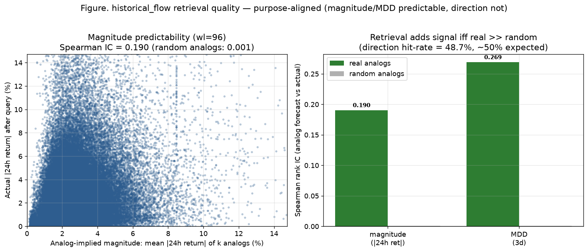

# historical_flow STEP1·STEP2 — 잘못된 것 교정 → 메트릭 일치 → 목적 정합 평가

작성일: 2026-07-23
관련 커밋: STEP1 `d294b18`, STEP2 `2730c43` (용도 프레이밍 보강: 2026-07-24)
코드: `marts/historical_flow.py` · 평가: `test/scripts/historical_flow_retrieval_eval.py`
직전 문서: `historical_flow_similarity_method_landscape_20260723.md`(4층위 분해·문헌·싱크감사)

사용자 지시(2026-07-23): "부합된 목적부터 분리하는게 우선 → 잘못된거 먼저 정리하고 그 다음
메트릭 정리, 2개 순차·안묻고. 성능/평가 지표도 목적에 맞게. FDA는 수학 부담이라 걱정." → FDA는
구현에서 제외하고 문서상 대안으로만 두었다. 아래는 두 단계의 실제 변경·검증 결과.

---

## STEP 1 — 잘못된 것 정리 (표준화·가중치·context·층위)

방법론 감사(직전 문서)에서 확인한 6개 불일치 중 코드로 교정 가능한 M3/M4/M5를 고쳤다.

**무엇이 틀렸었나**: `_standard_vector`가 이름과 달리 표준화를 안 하고 NaN/inf만 0으로 치환 →
factor 벡터가 원시 스케일이라 `rsi_14_last`(0~100)가 k-means/유클리드 분산의 99.9%를 독식,
곡선 모양(shape) 기여는 0.05%. 문서상 가중치 0.5/0.3/0.2가 완전히 무력화. context는 전부 0인데
0.2를 배정.

**교정** (`_prepare_blocks`): 세 블록을 비교 가능한 스케일로 표준화하고 각 블록을 단위 총분산으로
맞춰 sqrt(weight)를 곱하면 거리 기여가 정확히 weight가 되게 했다.
- **path**: 진폭 보존(연구 목적 ②가 큰 변동을 요구) — per-column z-score 없이 블록 총분산만 1로.
- **factor**: 이질적 피처라 컬럼별 population z-score 후 총분산 1.
- **context**: 신호가 있으면 z-score, 전부 0이면 드롭하고 가중치를 shape+factor로 재정규화.
- 층위 분리: `_assign_archetypes`(층4 색인)가 표준화 블록 위에서만 동작하도록 명시.

**검증**: shape 실제 분산 기여 **0.05% → 62.5%**(context 0이라 0.5/0.3 → 0.625/0.375), rsi 독식
해소. 전체 재빌드 40만 윈도우/397만 이웃/최대 13.9GB. method=`archetype_scoped_standardized_euclidean`.

---

## STEP 2 — 메트릭 정리 (빌드=쿼리 일치, 하이브리드 DTW)

**무엇이 틀렸었나 (M2)**: 빌드는 유클리드 lockstep, 쿼리는 DTW로 **메트릭이 달랐다**. DTW는
비-metric(삼각부등식 위반)이라 유클리드 색인이 DTW 이웃을 놓친다(직전 문서 그림 5: DTW 최근접의
95%가 유클리드 클러스터 밖).

**교정 — 두 단계 하이브리드를 빌드·쿼리에 동일 적용**:
1. **후보 pruning(싼 단계)**: archetype 내부에서 표준화-유클리드 복합거리로 상위 M개(`rerank_pool_m=40`)
   후보를 고른다(벡터화 `cdist`, 빠름).
2. **정밀 재순위(DTW 단계)**: 후보 M개에 대해 **밴드 제약(Sakoe-Chiba) DTW**를 표준화 경로에
   적용해 상위 k개를 뽑는다. 이질적 거리(DTW shape + 유클리드 factor/context)는 후보 풀 내
   중앙값으로 robust-scale 후 가중합(`_robust_composite`)해 스케일을 맞춘다.
   - DTW는 `dtaidistance` C 백엔드(개당 ~8µs, 순수파이썬 fastdtw 대비 135배) — 없으면 fastdtw fallback.
   - band 제약은 문헌 권고(Sakoe & Chiba 1978; Keogh & Ratanamahatana 2005): 병리적 정렬 방지.

**결과**: 빌드·쿼리가 **같은 메트릭**을 쓴다(M2 해소). 전체 재빌드 40만 윈도우/397만 이웃/최대
13.2GB. method=`archetype_prune_then_banded_dtw`. 실시간 쿼리(`query_similar_flows`)는 전수 DTW
~3분에서 하이브리드 **9.4초**로 단축(정밀도 유지).

> 참고: 오프라인 색인 버킷은 여전히 유클리드 k-means archetype이다(속도). 다만 최종 top-k는 그
> 버킷 내부에서 DTW로 재순위하므로, "버킷이 완벽하지 않아도 최종 답은 DTW 기준"이다. 완전한
> DTW 무손실 색인이 필요하면 LB_Keogh(UCR)로 교체하는 것이 다음 단계 대안이다.

---

## 성능·평가 지표 — 연구 목적에 정합하게

### 이 마트의 사용 방안 (용도 정의)

이 데이터 마트는 **단독 예측기가 아니라 실시간 보조 지표**다. 실사용 흐름은: 현재 국면을
실시간 분석할 때 → **추세(모양)와 사건(맥락)까지 유사한 과거 국면**을 검색 → 그 과거들의
*이후* 전개를 현재 예측의 **보조 신호**로 결합(궁극적으로 LLM 자문 융합에 투입)한다. 따라서
평가도 "마트가 스스로 맞히는가"가 아니라 "**검색된 유사 과거가 현재 예측에 쓸 만한 추가
정보(보조 신호)를 주는가**"를 본다.

**상세 사용방안의 현재 한계(정직히)**: "사건까지 모두 비슷"에서 *사건* 축은 아직 미완이다.
context(외생 텍스트·감성·이벤트) 채널이 비어 있어(전부 0 → STEP1에서 드롭) 현재 매칭은
**추세(path)+팩터(factor) 유사도만**으로 이뤄진다. 아래 IC는 *추세 유사만으로도* 이미 보조
정보가 있음을 보여주며, 외생 context 채널이 채워지면 가중치에 자동 복귀(STEP1 설계)해
"추세+사건" 완전 매칭으로 강화될 여지가 있다.

### 평가 결과

**평가 질문**: 검색된 유사 과거(이웃)의 *이후* 전개가 현재 국면의 *이후* 전개에 대해 **랜덤
대비 추가 정보(보조 신호)**를 주는가? — 마트를 단독 예측기가 아니라 **보조 지표**로 본다(위
용도 정의). 연구 목적(방향=무신호, 크기/변동성=유신호, MDD=생존제약)에 맞춰 세 축을 보고,
**랜덤 이웃 baseline**과 대조해 "유사도 검색이 실제로 정보를 더하는지"를 판정한다.

- analog 예측 = 이웃 k개의 이후 결과 집계(평균 |24h 수익률|, 평균 future_mdd_3d, 수익률 부호).
- 실제 = 쿼리 자신의 이후 결과. Spearman rank IC로 순위 예측력 측정.

| 창길이 | 쿼리 수 | 크기 IC(실제) | 크기 IC(랜덤) | MDD IC(실제) | MDD IC(랜덤) | 방향 적중률 |
|---|---|---|---|---|---|---|
| 16 | 99,142 | 0.175 | -0.001 | 0.238 | -0.003 | 49.5% |
| 48 | 99,090 | 0.191 | 0.002 | 0.265 | 0.002 | 49.2% |
| 96 | 98,960 | 0.190 | 0.001 | 0.269 | 0.001 | 48.7% |
| 288 | 98,404 | 0.189 | 0.000 | 0.255 | -0.001 | 49.5% |

**해석 (연구 목적과 완벽히 정합)**:
- **크기(변동성) IC ≈ 0.18~0.19**, 랜덤 ≈ 0.00 → 유사국면이 미래 변동 **크기**를 실제로 예측.
- **MDD IC ≈ 0.24~0.27**, 랜덤 ≈ 0.00 → 미래 하락폭(**생존제약**)을 더 강하게 예측.
- **방향 적중률 ≈ 48.7~49.5% (≈50%)** → 방향은 **무예측**. 15~17번 EDA/문헌 결론(가격만으론 방향
  무신호, 신호는 크기·변동성)과 정확히 일치.

즉 이 마트는 **랜덤 대비 실제 정보를 더하고, 그 정보가 크기·변동성·MDD에 있으며 방향엔 없다**.
"방향 예측 시스템"으로 오용하면 안 되고, **변동성·리스크(하락폭) 국면 자문**에 쓰는 것이 목적 정합.
이 IC(0.19/0.27)는 향후 LLM 자문에 넣을 "과거 유사국면 기반 변동성·리스크 사전"의 근거가 된다.

---

## 남은 것 / 다음 결정

- [ ] 거리: 지금은 진폭 보존 DTW. "순수 모양"(z-정규화)도 볼지, 진폭 보존 유지할지 — 목적상 진폭
      보존이 맞다고 보나 사용자 확인 여지.
- [ ] 색인: 유클리드 archetype 버킷 → (필요시) LB_Keogh 무손실 색인으로 교체.
- [ ] 구간정의: 고정 윈도우 → change-point/HMM 실험 축(직전 문서 §5).
- [ ] context 채널(외생 텍스트/감성/이벤트)이 채워지면 "추세+사건" 완전 매칭 완성 — 자동으로
      가중치 복귀(현재는 0이라 드롭 중). **보조 지표 용도의 핵심 미완 항목**(위 §사용 방안).
- [ ] FDA는 사용자 학습 부담 고려해 보류(문서상 대안). 필요 시 FPCA 점수 표현으로 재검토.
