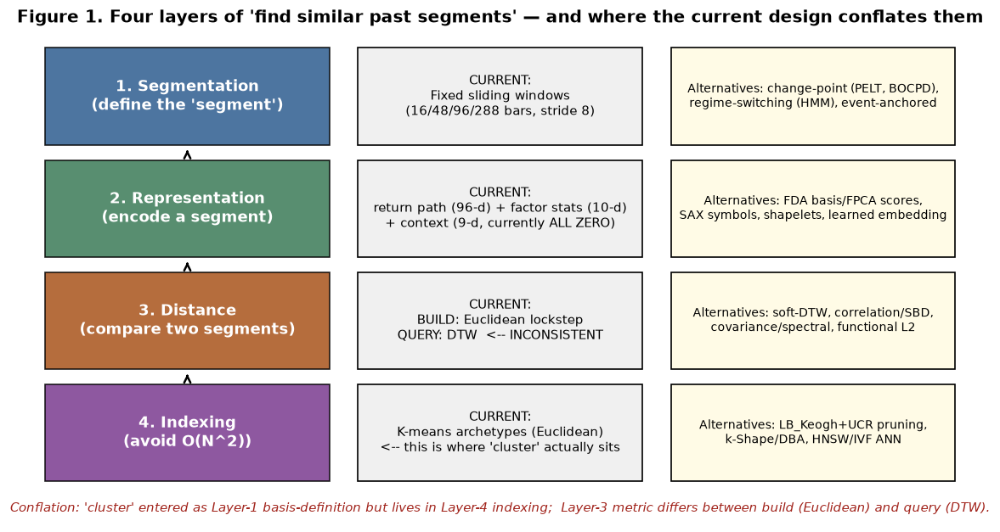
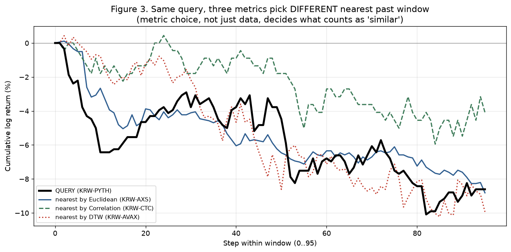
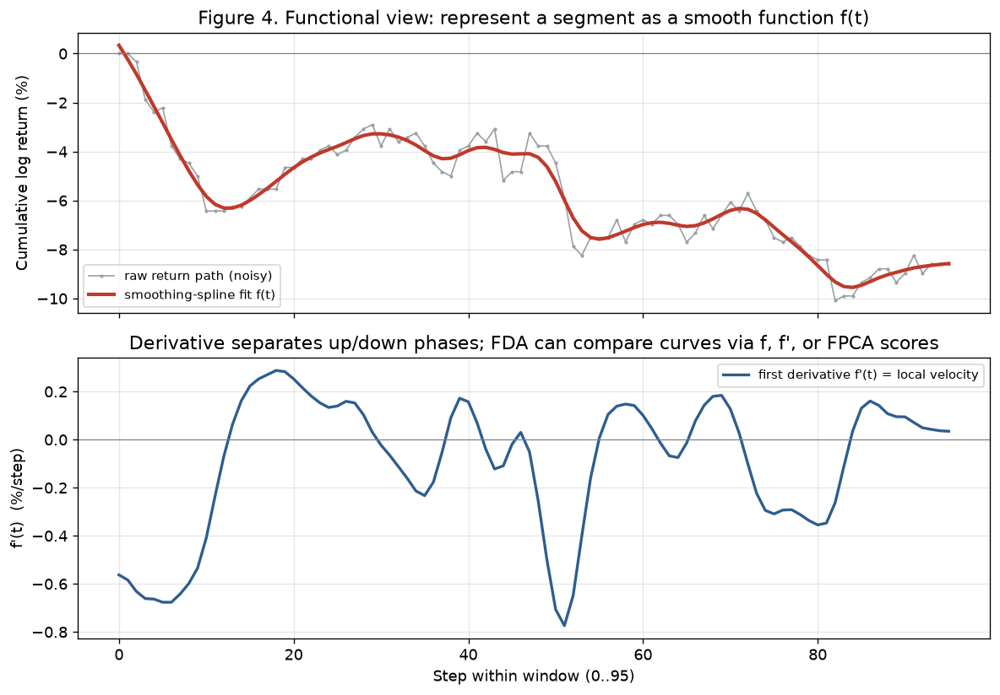
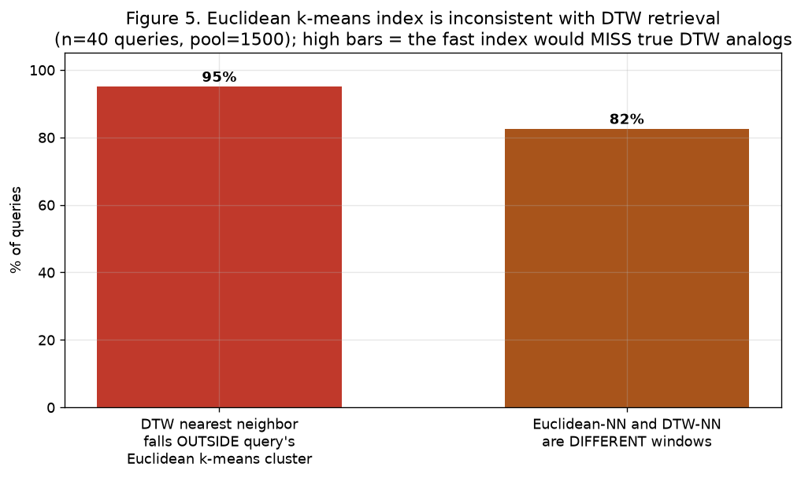

# 과거 유사 국면 비교 — 구간 정의·표현·거리·색인의 분리와 방법론 지형 (문헌 근거 포함)

작성일: 2026-07-23
그림 생성기: `test/scripts/historical_flow_methods_deep_figures.py` (실제 마트 데이터)
직전 문서: `historical_flow_method_explainer_20260723.md`(DTW vs 클러스터 1차 설명)

---

## 0. 요약과 핵심 진단

당신의 두 직관이 모두 옳았다.
1. **"시계열은 연속 함수이니 시계열 방식(DTW 등)으로 비교해야 한다"** — 맞다. 그리고 DTW만이
   답은 아니다. 상관/공분산/스펙트럼/함수형(FDA) 등 정당한 대안이 각각 문헌 전통을 갖고 있고,
   목적에 따라 더 낫다(§3).
2. **"큰 틀뿐 아니라 부분적으로도 싱크가 안 맞는 게 있을 것 같다"** — 맞다. 실측으로 6개의
   불일치를 찾았고, 그중 하나는 치명적이다.

**가장 치명적 발견 (그림 2):** 문서상 클러스터 가중치는 `shape 0.5 / factor 0.3 / context 0.2`
지만, factor 벡터가 **표준화되지 않은 원시값**이라 스케일이 큰 `rsi_14_last`(0~100)가 분산을
독식한다. 실제 k-means 거리를 좌우하는 비중을 재보면:

| 블록 | 의도한 가중치 | 실제 분산 기여 |
|---|---|---|
| shape (곡선 모양, 96차원) | 50% | **0.05%** |
| factor (요약통계, 10차원) | 30% | **99.95%** (대부분 rsi 하나) |
| context (9차원) | 20% | **0%** (전부 0) |

즉 지금 "국면 원형(archetype)"은 사실상 **RSI 한 개 값으로만** 나뉜다. 정작 당신이 비교하고
싶은 곡선 모양은 클러스터 결정에 거의 0 기여다. 이것이 "구간을 정의한다"던 클러스터의 실체다.

**목적 conflation:** 클러스터링은 "과거와 유사하다고 판단할 기준(구간)"을 정의하려는 의도로
들어왔지만, 코드에서는 O(N²)를 줄이는 **속도용 색인**에 놓였고, 그나마도 위 스케일 문제로
의도한 일을 못 한다. "구간 정의"와 "색인"과 "거리 기준"이라는 서로 다른 층위가 한 덩어리로
섞였다(§1의 4층위 분해로 정리).

---

## 1. 문제를 4개 층위로 분해한다

"지금 국면과 비슷한 과거 국면을 찾는다"는 하나의 작업이 아니라 **네 개의 독립적 결정**이다.
이걸 분리하지 않으면 지금처럼 한 도구(클러스터)가 여러 층을 어정쩡하게 겸임하게 된다.

| 층위 | 결정하는 것 | 현재 선택 | 주요 대안 |
|---|---|---|---|
| **1. 구간 정의**(Segmentation) | 연속 스트림을 어떤 단위로 자르나 | 고정 슬라이딩 윈도우(16/48/96/288봉, stride 8) | change-point(PELT, BOCPD), regime-switching(HMM) |
| **2. 표현**(Representation) | 한 구간을 무엇으로 인코딩하나 | 수익률경로(96d)+요약통계(10d)+컨텍스트(9d, 전부 0) | FDA 기저/FPCA 점수, SAX, shapelet, 학습 임베딩 |
| **3. 거리**(Distance) | 두 구간을 어떻게 비교하나 | 빌드=유클리드 lockstep / 쿼리=DTW (불일치) | soft-DTW, 상관/SBD, 공분산·스펙트럼, 함수형 L2 |
| **4. 색인**(Indexing) | O(N²)를 어떻게 피하나 | K-means archetype(유클리드) | LB_Keogh+UCR pruning, k-Shape/DBA, HNSW/IVF |

핵심: **거리(층 3)와 색인(층 4)의 메트릭이 같아야 한다.** 지금은 색인은 유클리드, 쿼리는 DTW라
서로 다르다. DTW는 삼각부등식을 만족하지 않는 비(非)-metric이라(Keogh & Ratanamahatana 2005;
Vidal et al. 1985), 유클리드 색인은 DTW 최근접 이웃 순위를 보존하지 못한다(§6에서 실측).

---

## 2. 현재 파이프라인 정직한 감사 — 확인된 6개 불일치

| # | 불일치 | 근거 | 영향 |
|---|---|---|---|
| M1 | 클러스터가 "구간 정의"로 이해됐지만 실제론 "속도용 색인" | 코드 `_assign_archetypes`는 `_build_neighbors` 내부 버킷팅용 | 층위 혼선, 해석 혼란 |
| M2 | 색인 메트릭(유클리드) ≠ 쿼리 메트릭(DTW) | 빌드=`cdist`, 쿼리=`fastdtw` | DTW 이웃을 색인이 놓침(§6, 95%) |
| **M3** | **가중치 무력화**: factor 미표준화로 rsi가 분산 독식 | 그림 2, 실측 shape 0.05% | 곡선 모양이 클러스터에 거의 무기여 |
| M4 | `_standard_vector`가 이름과 달리 **표준화 안 함**(NaN→0만) | 코드 확인 | M3의 근본 원인 |
| M5 | context 전부 0인데 가중치 0.2 배정 | 그림 2, DB 확인(abs합=0) | composite가 실제론 0.5/0.3/0 → 재정규화 시 0.57/0.43 |
| M6 | 고정 슬라이딩 윈도우 = 구간이 regime 경계와 무관 | 설계상 stride 8 균일 절단 | "국면"이 데이터가 아니라 격자로 정의됨 |

M3가 특히 중요하다. 이건 버그라기보다 **표현(층2)과 거리(층3) 설계가 스케일 정규화 없이 붙어서**
생긴 구조적 문제다. 유클리드/상관/k-means 계열은 전부 축의 스케일에 민감하므로, 표준화(z-정규화)를
빼면 "가장 큰 숫자를 가진 축"이 거리를 지배한다(UCR 계열이 z-정규화를 필수로 두는 이유,
Rakthanmanon et al. 2012).

---

## 3. 거리(층 3) 방법 지형 — "무엇으로 닮음을 재는가"

### 3.1 메트릭 선택이 곧 답을 바꾼다 (실증)

같은 표현(수익률 경로)에 대해 세 메트릭으로 "가장 닮은 과거 구간"을 뽑으면 **서로 다른 창을**
고른다:

- 유클리드(파랑)·상관(초록)·DTW(빨강)가 각기 다른 이웃을 뽑았다(3개 모두 상이).
- 즉 "닮음"은 데이터가 아니라 **메트릭 정의가 결정**한다. 그래서 층 3 선택이 방법론의 핵심이다.

### 3.2 DTW와 그 변형 (당신이 아는 방법 + 확장)

- **DTW 원류**: Sakoe & Chiba (1978) — 음성인식의 동적계획 시간정규화, "Sakoe-Chiba band" 제약의
  기원. Berndt & Clifford (1994) — 이를 시계열 데이터마이닝으로 가져온 정본. 모양이 같고 시간만
  밀린/늘어난 두 경로를 정렬한다.
- **제약 DTW**: Itakura (1975) parallelogram, Sakoe-Chiba band. 제약이 없으면 한 점이 상대의 긴
  구간에 매핑되는 병리적 정렬이 생기고, 제약이 있어야 하한(LB_Keogh)이 타이트해져 색인이 가능.
- **soft-DTW**: Cuturi & Blondel (2017, ICML) — min을 매끄럽게 바꿔 미분가능. DTW 기하로 prototype/
  clustering·학습손실에 쓸 수 있다.
- **shapeDTW**: Zhao & Itti (2018, Pattern Recognition) — 점이 아니라 **국소 shape descriptor**를
  정렬해, 누적 레벨만 같고 국소 모양이 다른 잘못된 매칭을 교정. 기울기·반전(모멘텀) 일치를 선호.

### 3.3 상관/유클리드 — 사실은 같은 것 (중요한 정리)

- **z-정규화된 경로에서 제곱 유클리드 거리 = 2m(1−r)** (r=피어슨 상관; Berthold & Höppner 2016,
  arXiv 프리프린트). 즉 **z-정규화 유클리드 최근접 = 상관 최근접**으로 완전히 동일한 순위다.
- 함의: "상관으로 비교"와 "z-정규화 유클리드로 비교"는 별개가 아니다. 둘 다 시간축을 고정한
  **격자대응(rigid)** 측도다. 단 **우리 마트는 z-정규화를 안 하고**(경로를 시작점만 0으로 맞춤)
  원시 크기로 비교하므로, 모양+크기가 섞여 비교된다(순수 모양 비교가 아님).

### 3.4 공분산 / 스펙트럼 — 단변량엔 부적합, 다변량엔 강력

- 당신이 언급한 "공분산 비교"는 **여러 자산/피처가 함께 움직이는 다변량 구간**에서 의미가 있다.
  각 구간을 공분산행렬(SPD)로 표현해 **리만 기하 거리**로 비교(Barachant et al. 2012 IEEE TBME;
  2013 Neurocomputing; log-Euclidean은 Arsigny et al. **2006** MRM / SPD 벡터공간은 Arsigny et al.
  2007 SIAM; 이론틀 Pennec et al. 2006).
- **단변량 수익률 경로 하나**에는 공분산이 1×1(=분산)로 퇴화해 비교할 구조가 없다. 이 경우엔
  **스펙트럼 밀도/자기공분산·모델기반 거리**가 맞다: Piccolo (1990) ARIMA 계수 거리, Maharaj (2000)
  AR 유의성 거리, (다변량 스펙트럼) Kakizawa, Shumway & Taniguchi (1998).
- 실무 함의: "공분산 비교"를 쓰려면 **먼저 구간을 다변량으로 표현**(예: 여러 유동 종목의 동시
  경로, 또는 구간별 피처 패널)해야 한다. 그게 오히려 "시장 공통요인"과도 연결된다.

### 3.5 함수형(FDA) — "곡선을 함수로" 당신 직관에 가장 직접 부합

- 노이즈 경로를 평활 스플라인으로 적합해 **함수 f(t)** 로 다루고, 도함수 f'(t)(국소 속도=국면)나
  소수의 **functional PCA 점수**로 요약해 비교한다. 정본: Ramsay & Silverman (2005); 적용서
  Ramsay, Hooker & Graves (2009); B-스플라인 de Boor (2001), 거칠기 벌점 Green & Silverman (1994);
  FPCA 리뷰 Wang, Chiou & Müller (2016); 곡선 semi-metric Ferraty & Vieu (2006).
- **암호화폐/금융 직접 선례**: Kokoszka et al. (2019)는 **누적 일중 수익률 곡선(CIDR)**
  R(t)=logP(t)−logP(0) — 정확히 우리 객체 — 을 함수형 데이터로 다룬다. Jasiak & Zhong (2026,
  arXiv 2505.20508)은 **암호화폐 일중 수익률 곡선에 FPCA**를 적용해 예측한다.
- **DTW vs FDA의 근본 차이**: DTW는 시간축을 **왜곡**해 정렬(타이밍 차이를 흡수). FDA는 공통
  정의역에서 평활 후 **같은 시각끼리 수직 비교**(언제 움직였는지가 중요할 때 강함). FDA의
  **curve registration**(Ramsay & Li 1998)이 DTW의 시간왜곡에 대응하는, 위상/진폭을 명시적으로
  분리하는 원리적 대안이다.

### 3.6 언제 무엇을 — 요약

| 상황 | 권장 거리 |
|---|---|
| 모양이 같고 타이밍만 밀림/늘어남을 흡수하고 싶다 | **DTW**(제약 필수), 또는 shapeDTW |
| 절대 시각(세션·펀딩·이벤트 시점)이 중요하다 | **FDA L2/FPCA**(정렬 없이) |
| 크기 무시, 순수 등락 패턴만 | **z-정규화 유클리드 = 상관** |
| 여러 자산 공동 구조를 비교 | **공분산/리만**(다변량 표현 선행) |
| 저차원 요약 후 다운스트림(군집·회귀) | **FPCA 점수** 또는 model-based(Piccolo) |

---

## 4. 표현(층 2) 방법

- **원시 경로**(현재): 96차원 벡터. 단순하지만 노이즈·차원 그대로. z-정규화 여부가 "모양 vs 크기"를
  가른다(현재 미적용).
- **FDA 기저/FPCA 점수**: 곡선을 소수 계수로 요약 → 노이즈 저항·저차원. §3.5.
- **SAX 심볼**(Lin et al. 2003; iSAX 색인 Shieh & Keogh 2008): PAA+구간이산화로 문자열화, 하한거리로
  대규모 색인 용이.
- **shapelet**(Ye & Keogh 2009): 판별력 높은 국소 부분수열로 구간 특성화.
- **학습 임베딩**: (오토인코더/대조학습) 데이터가 충분하면 유사도에 맞는 표현을 학습.

여기서도 원칙: **표현을 정하면 그에 맞는 거리·색인이 따라와야 한다**(표현·거리·색인 정합).

---

## 5. 구간 정의(층 1) 방법 — 고정 윈도우를 넘어서

현재는 stride 8 고정 절단이라 "국면"이 데이터가 아니라 격자로 정의된다(M6). 방어 가능한 대안:

- **Regime-switching / HMM**: Hamilton (1989, Econometrica) 마르코프 스위칭 — 잠재 이산상태(예:
  강세/약세/고변동)가 AR 파라미터를 지배, 경계가 데이터에서 도출·재현. HMM 일반론 Rabiner (1989).
- **Change-point detection**: PELT (Killick, Fearnhead & Eckley 2012, JASA) — 선형복잡도 최적 다중
  변화점. BOCPD (Adams & MacKay 2007) — 온라인/스트리밍 변화점(실시간 구간 절단에 적합).

이렇게 하면 구간이 **통계적 성질이 실제로 바뀌는 지점**에서 잘려, 내부가 동질적이고 비교가능해진다.
고정 윈도우는 baseline으로만 두는 게 맞다.

---

## 6. 색인(층 4) — 유클리드 k-means는 왜 부적합하고 무엇이 정합인가

### 6.1 실증: 유클리드 클러스터 색인은 DTW 이웃을 놓친다

- 40개 쿼리에 대해 진짜 DTW 최근접 이웃을 구했더니, **95%가 쿼리의 유클리드 k-means 클러스터
  밖**에 있었다. 유클리드-NN과 DTW-NN이 **82% 불일치**.
- 즉 지금처럼 유클리드 클러스터로 후보를 좁힌 뒤 DTW로 순위를 매기면, **진짜 DTW 이웃의 대부분을
  후보 단계에서 이미 버린다.** 색인/쿼리 메트릭 불일치(M2)의 정량 증거다.

### 6.2 문헌 근거

- DTW는 **삼각부등식 위반 → 비-metric**(Keogh & Ratanamahatana 2005; Vidal et al. 1985; 재확인
  Shen et al. 2021). metric 가정에 기댄 유클리드/k-means 색인은 DTW 순위를 보존하지 못한다.
- 올바른 색인은 **DTW 하한(LB_Keogh)+early abandoning**으로 false dismissal 없이 가지치기하는 것:
  Keogh & Ratanamahatana (2005), UCR Suite(Rakthanmanon et al. 2012).
- 굳이 군집을 쓰려면 **거리와 정합하는 군집**을 써야 한다: **k-Shape**(Paparrizos & Gravano 2015,
  정규화 교차상관 SBD + 정합 centroid, 위상 불변) 또는 **DTW k-means with DBA**(Petitjean et al.
  2011, DTW 정합 barycenter). 유클리드 k-means의 산술평균 centroid는 위상차/시간왜곡을 벌점화해
  경로 비교의 불변성을 깨뜨린다(Aghabozorgi et al. 2015; Liao 2005 서베이).

### 6.3 정리

| 색인 방식 | 어떤 쿼리 메트릭과 정합? | 우리 경우 판정 |
|---|---|---|
| 유클리드 k-means (현재) | 유클리드/상관 | DTW 쿼리와 **불일치**(그림 5) |
| LB_Keogh + UCR pruning | DTW | DTW 쓰려면 이것 |
| k-Shape (SBD) | 위상불변 상관 | 모양+위상불변이면 적합 |
| DTW k-means + DBA | DTW | DTW 군집이 필요하면 |
| HNSW/IVF ANN | 임의 벡터거리(정의역 일치 시) | FPCA 점수 등 고정길이 표현에 |

---

## 7. "왜 클러스터가 나왔나"에 대한 정직한 답과 권고

### 7.1 왜 나왔나 (경위)
빌드가 원래 O(N²) 전수비교(유클리드)라 12일이 걸려서, 나는 **속도**를 위해 (a) 벡터화, (b)
K-means 버킷팅, (c) 유동종목만 생성을 넣었다. 이때 클러스터는 순수하게 **색인(층 4) 가속**
목적이었다. 그런데 결과물에 `archetype_id`를 남기면서 마치 "국면 원형(구간 정의)"인 것처럼
보이게 됐고 — 실제로는 §2의 M3(스케일 문제)로 인해 그 archetype이 곡선 모양도 국면도 제대로
반영하지 못한다. **층위 혼선 + 표준화 부재**가 겹친 것이 지금 상태다.

### 7.2 권고안 (층위별 분리 설계)

1. **층 1(구간)**: 우선 고정 윈도우 유지(baseline). 다음 단계로 change-point/HMM 세그멘테이션을
   실험 축으로 추가해 "국면"을 데이터로 정의.
2. **층 2(표현)**: 경로를 **z-정규화**할지(순수 모양) vs 원시(모양+크기)로 둘지 명시적으로 결정.
   장기적으로 **FPCA 점수** 표현을 후보로(노이즈·차원 이점, 크립토 선례 있음).
3. **층 3(거리)**: 목적이 "타이밍 흡수 모양 유사"면 **제약 DTW**(또는 shapeDTW)를 1급 거리로.
   "절대 시각 중요"면 FDA L2. 이 결정을 문서에 못 박고 빌드/쿼리에서 **동일 메트릭** 사용.
4. **층 4(색인)**: DTW를 쓰기로 하면 유클리드 k-means를 버리고 **LB_Keogh+UCR pruning**(정확·무손실)
   또는 **k-Shape/DBA**(정합 군집)로 교체. 아니면 FPCA 점수 위에 **HNSW**.
5. **즉시 교정(저비용)**: M3/M4/M5 — factor를 **population z-정규화**하고, context가 0인 동안은
   가중치에서 제외(0.5/0.3/0 명시). 이것만 해도 현재 archetype이 rsi 독식에서 벗어난다.

### 7.3 하이브리드(현실적 최선)
싼 거리(**z-정규화 유클리드 = 상관**, 또는 LB_Keogh 하한)로 후보 top-M을 **무손실에 가깝게**
추리고, 그 위에서만 **DTW(또는 FDA)로 정밀 top-k 재순위**. archetype은 "지금은 고변동 급락 국면"
같은 **해석 태그** 용도로만 두고(단, 먼저 z-정규화로 M3 교정), 유사도 자체는 정합 메트릭에 맡긴다.

---

## 8. 참고문헌 (웹 검증 완료; 플래그는 명시)

**거리/DTW**
- Sakoe, H., & Chiba, S. (1978). Dynamic Programming Algorithm Optimization for Spoken Word
  Recognition. *IEEE TASSP* 26(1), 43–49. doi:10.1109/TASSP.1978.1163055
- Berndt, D. J., & Clifford, J. (1994). Using Dynamic Time Warping to Find Patterns in Time
  Series. *AAAI-94 KDD Workshop*, WS-94-03, 359–370.
- Itakura, F. (1975). Minimum Prediction Residual Principle Applied to Speech Recognition.
  *IEEE TASSP* 23(1), 67–72. doi:10.1109/TASSP.1975.1162641 (저자/페이지 판본 확인 권장)
- Keogh, E., & Ratanamahatana, C. A. (2005). Exact indexing of dynamic time warping.
  *Knowledge and Information Systems* 7(3), 358–386. doi:10.1007/s10115-004-0154-9
- Rakthanmanon, T., et al. (2012). Searching and Mining Trillions of Time Series Subsequences
  under DTW (UCR Suite). *KDD '12*, 262–270. doi:10.1145/2339530.2339576
- Cuturi, M., & Blondel, M. (2017). Soft-DTW: a Differentiable Loss Function for Time-Series.
  *ICML*, PMLR 70, 894–903. arXiv:1703.01541
- Zhao, J., & Itti, L. (2018). shapeDTW: Shape Dynamic Time Warping. *Pattern Recognition* 74,
  171–184. doi:10.1016/j.patcog.2017.09.020
- Berthold, M. R., & Höppner, F. (2016). On Clustering Time Series Using Euclidean Distance and
  Pearson Correlation. arXiv:1601.02213 **[프리프린트, 비피어리뷰]**
- Vidal, E., Casacuberta, F., et al. (1985). Is the DTW "distance" really a metric? *Speech
  Communication* 4(4). doi:10.1016/0167-6393(85)90058-5 **[저자목록/페이지 확인 권장]**
- Shen, Y., et al. (2021). TC-DTW... arXiv:2101.07731 (비-metric 재확인, 보조)

**함수형(FDA)**
- Ramsay, J. O., & Silverman, B. W. (2005). *Functional Data Analysis* (2nd ed.). Springer.
- Ramsay, J. O., Hooker, G., & Graves, S. (2009). *Functional Data Analysis with R and MATLAB*.
  Springer. doi:10.1007/978-0-387-98185-7
- de Boor, C. (2001). *A Practical Guide to Splines* (rev. ed.). Springer.
- Green, P. J., & Silverman, B. W. (1994). *Nonparametric Regression and Generalized Linear
  Models: A Roughness Penalty Approach*. Chapman & Hall.
- Wang, J.-L., Chiou, J.-M., & Müller, H.-G. (2016). Functional Data Analysis. *Annual Review of
  Statistics and Its Application* 3, 257–295. doi:10.1146/annurev-statistics-041715-033624
- Ferraty, F., & Vieu, P. (2006). *Nonparametric Functional Data Analysis*. Springer.
  doi:10.1007/0-387-36620-2
- Hörmann, S., & Kokoszka, P. (2010). Weakly dependent functional data. *Annals of Statistics*
  38(3), 1845–1884. doi:10.1214/09-AOS768
- Kokoszka, P., & Reimherr, M. (2017). *Introduction to Functional Data Analysis*. CRC Press.
  doi:10.1201/9781315117416
- Kokoszka, P., Miao, H., Stoev, S., & Zheng, B. (2019). Risk Analysis of Cumulative Intraday
  Return Curves. *Journal of Time Series Econometrics* 11(2). doi:10.1515/jtse-2018-0011
- Jasiak, J., & Zhong, C. (2026). Intraday Functional PCA Forecasting of Cryptocurrency Returns.
  *Journal of Forecasting* (early view). doi:10.1002/for.70127; arXiv:2505.20508 **[early-view]**
- Ramsay, J. O., & Li, X. (1998). Curve registration. *JRSS-B* 60(2), 351–363.
  doi:10.1111/1467-9868.00129

**공분산/스펙트럼/구간정의/군집**
- Barachant, A., et al. (2012). Multiclass BCI Classification by Riemannian Geometry. *IEEE TBME*
  59(4), 920–928. doi:10.1109/TBME.2011.2172210
- Barachant, A., et al. (2013). Classification of covariance matrices using a Riemannian-based
  kernel for BCI. *Neurocomputing* 112, 172–178. doi:10.1016/j.neucom.2012.12.039
- Arsigny, V., et al. (2006). Log-Euclidean metrics for fast and simple calculus on diffusion
  tensors. *Magnetic Resonance in Medicine* 56(2), 411–421. doi:10.1002/mrm.20965
- Arsigny, V., et al. (2007). Geometric Means in a Novel Vector Space Structure on SPD Matrices.
  *SIAM J. Matrix Anal. Appl.* 29(1), 328–347. doi:10.1137/050637996
- Pennec, X., Fillard, P., & Ayache, N. (2006). A Riemannian Framework for Tensor Computing.
  *IJCV* 66(1), 41–66. doi:10.1007/s11263-005-3222-z
- Kakizawa, Y., Shumway, R. H., & Taniguchi, M. (1998). Discrimination and Clustering for
  Multivariate Time Series. *JASA* 93(441), 328–340. doi:10.1080/01621459.1998.10474114
- Piccolo, D. (1990). A Distance Measure for Classifying ARIMA Models. *J. Time Series Analysis*
  11(2), 153–164. doi:10.1111/j.1467-9892.1990.tb00048.x
- Maharaj, E. A. (2000). Cluster of Time Series. *Journal of Classification* 17(2), 297–314.
  doi:10.1007/s003570000023
- Hamilton, J. D. (1989). A New Approach to the Economic Analysis of Nonstationary Time Series
  and the Business Cycle. *Econometrica* 57(2), 357–384. doi:10.2307/1912559
- Rabiner, L. R. (1989). A Tutorial on Hidden Markov Models... *Proc. IEEE* 77(2), 257–286.
  doi:10.1109/5.18626
- Killick, R., Fearnhead, P., & Eckley, I. A. (2012). Optimal Detection of Changepoints with a
  Linear Computational Cost. *JASA* 107(500), 1590–1598. doi:10.1080/01621459.2012.737745
- Adams, R. P., & MacKay, D. J. C. (2007). Bayesian Online Changepoint Detection. arXiv:0710.3742
- Aghabozorgi, S., Shirkhorshidi, A. S., & Wah, T. Y. (2015). Time-series clustering – A decade
  review. *Information Systems* 53, 16–38. doi:10.1016/j.is.2015.04.007
- Liao, T. W. (2005). Clustering of time series data — a survey. *Pattern Recognition* 38(11),
  1857–1874. doi:10.1016/j.patcog.2005.01.025
- Paparrizos, J., & Gravano, L. (2015). k-Shape: Efficient and Accurate Clustering of Time
  Series. *SIGMOD '15*, 1855–1870. doi:10.1145/2723372.2737793
- Petitjean, F., Ketterlin, A., & Gançarski, P. (2011). A global averaging method for DTW, with
  applications to clustering (DBA). *Pattern Recognition* 44(3), 678–693.
  doi:10.1016/j.patcog.2010.09.013
- Lin, J., Keogh, E., Lonardi, S., & Chiu, B. (2003). A Symbolic Representation of Time Series
  (SAX). *DMKD '03*, 2–11. doi:10.1145/882082.882086
- Shieh, J., & Keogh, E. (2008). iSAX: indexing and mining terabyte sized time series.
  *KDD '08*, 623–631. doi:10.1145/1401890.1401966
- Ye, L., & Keogh, E. (2009). Time series shapelets. *KDD '09*, 947–956.
  doi:10.1145/1557019.1557122

> 인용 정확도 플래그: Berthold & Höppner(2016)는 arXiv 프리프린트; Vidal et al.(1985)은 저자목록·
> 페이지 최종 확인 권장; Jasiak & Zhong(2026)은 early-view(arXiv 2505.20508 fallback); Karhunen-
> Loève 원전은 직접 인용 대신 Wang et al.(2016)/Ramsay & Silverman(2005) 경유 권장.
