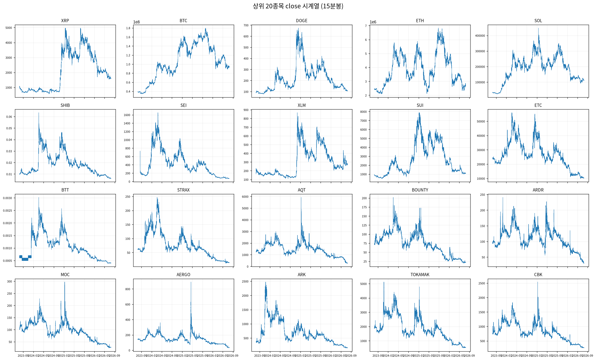
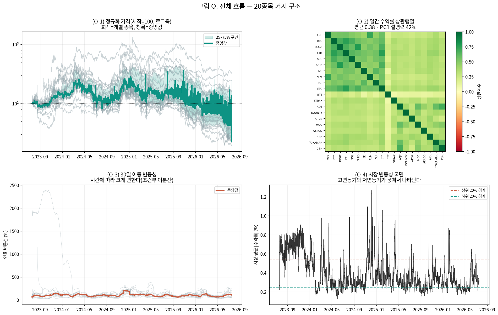
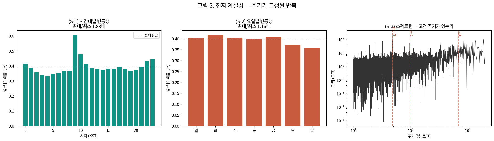
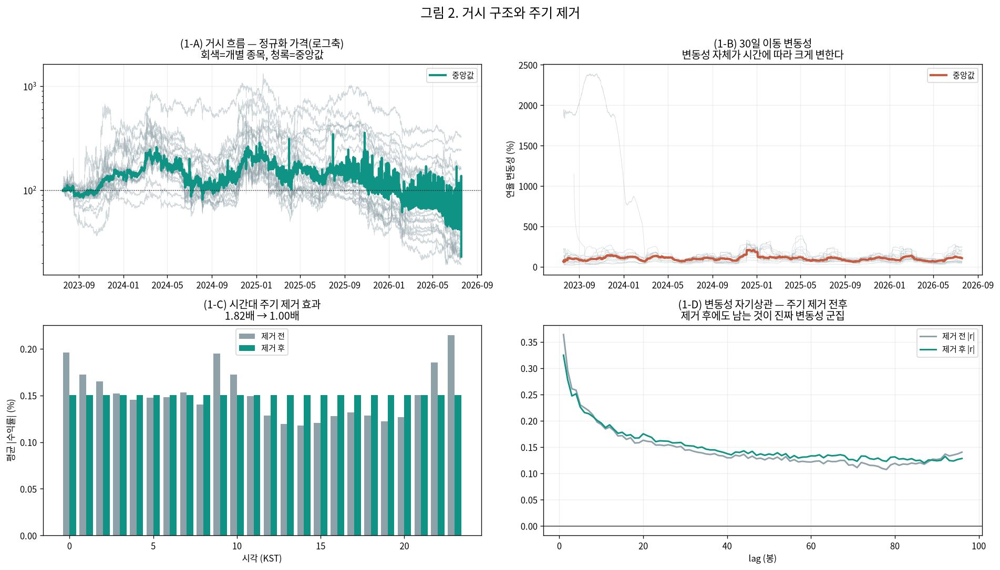

# 변동성 예측 연구 — 거시 EDA와 앞으로의 계획

작성일 2026-09-08 · 브랜치 `stock` · **20종목 15분봉**
· 선행 보고서: [분포 규명](distribution_identification_report_20260907.md) · [가정 진단](assumption_diagnosis_report_20260907.md)

> **읽는 법**: 그림은 패널마다 `(B-3)`, `(1-C)`처럼 라벨이 붙어 있고, 본문에서 그 라벨로 참조합니다.

---

## 0. 이 보고서의 목적 — 방법론을 바로잡고 계획을 세운다

지금까지 통계 검정 수치만 뽑고 **눈으로 보는 EDA를 건너뛰었습니다.** 그 결과 앞단 분석이 뒤
단계와 이어지지 않고, 어떤 처리를 왜 하는지가 흐려졌습니다.

이 보고서는 두 가지를 합니다.

1. **거시 EDA부터 다시** — 전체 그림을 보고 데이터가 어떤 구조인지 파악
2. **앞으로의 실험 계획 확정** — 각 모델의 가정을 맞추면서 매 처리마다 EDA를 붙이는 파이프라인

꼬리(두꺼움) 문제는 지도교수님과 협의한 대로 **t분포로 이론적 보완만 하고**, 완전한 처리는
후속 연구로 넘깁니다.

---

### 0. 이번 회차 실제 분석 범위 ⚠

- **연구 대상(모집단)**: 상위 20종목 (아래 1절 목록)
- **이번 회차 실제 분석**: 대상 전체 20종목 ✅

## 분석 조건 (표준 헤더)

> 이 보고서만 읽어도 데이터 조건을 파악할 수 있도록, 매 회차 동일 항목을 싣는다(AGENTS.md 2.9g).

### 1. 데이터 출처·형식

- **DB / 테이블**: `data/upbit_data.db` (DuckDB) / `upbit_krw_candle`
- **봉 간격**: 15분봉 (하루 96봉)
- **원본 컬럼**: timestamp, open, high, low, close, volume, value
- **분석 종목 20개** — 이력 90,000봉(약 2.5년) 이상 종목 중 선정:
  거래대금 상위 10개 · 변동성 상위 10개

  선정 기준을 두 축으로 나눈 이유: 단일 결합 점수(변동성×거래대금)는 변동성이 지배해 신규·소형 종목만 뽑혀 시장 대표성이 약했다. **거래대금 축은 실제로 거래되는 주요 종목**을, **변동성 축은 연구 목적(변동성 예측)에 직접 부합하는 종목**을 담당한다. BTC는 저변동 대형 종목이라 두 축 모두에 들지 않지만 기준 자산으로 포함한다.

| # | 종목 | 선정 근거 | 봉 수 | 기간 | 표준편차 | 왜도 | 초과첨도 |
| ---: | :--- | :--- | ---: | :--- | ---: | ---: | ---: |
| 1 | KRW-XRP | 거래대금 상위 | 104,876 | 2023-07-19~2026-07-18 | 0.004155 | -0.3690 | 157.70 |
| 2 | KRW-BTC | 거래대금 상위 | 104,883 | 2023-07-19~2026-07-19 | 0.002386 | 0.0045 | 107.19 |
| 3 | KRW-DOGE | 거래대금 상위 | 104,863 | 2023-07-19~2026-07-18 | 0.005603 | -0.1511 | 50.63 |
| 4 | KRW-ETH | 거래대금 상위 | 104,869 | 2023-07-19~2026-07-18 | 0.003388 | -0.9237 | 482.65 |
| 5 | KRW-SOL | 거래대금 상위 | 104,879 | 2023-07-19~2026-07-19 | 0.004522 | 0.2330 | 27.32 |
| 6 | KRW-SHIB | 거래대금 상위 | 104,868 | 2023-07-19~2026-07-18 | 0.005935 | 0.2553 | 50.13 |
| 7 | KRW-SEI | 거래대금 상위 | 102,133 | 2023-08-16~2026-07-18 | 0.006708 | 1.6436 | 178.97 |
| 8 | KRW-XLM | 거래대금 상위 | 104,901 | 2023-07-18~2026-07-18 | 0.005228 | -0.0311 | 89.51 |
| 9 | KRW-SUI | 거래대금 상위 | 104,876 | 2023-07-19~2026-07-19 | 0.005934 | -0.9976 | 341.19 |
| 10 | KRW-ETC | 거래대금 상위 | 104,901 | 2023-07-18~2026-07-18 | 0.004365 | -2.3845 | 720.64 |
| 11 | KRW-BTT | 변동성 상위 | 104,207 | 2023-07-19~2026-07-19 | 0.041478 | 0.0021 | 13.29 |
| 12 | KRW-STRAX | 변동성 상위 | 102,279 | 2023-07-19~2026-07-19 | 0.007567 | 1.9133 | 92.65 |
| 13 | KRW-AQT | 변동성 상위 | 100,547 | 2023-07-18~2026-07-18 | 0.007531 | 0.6777 | 170.04 |
| 14 | KRW-BOUNTY | 변동성 상위 | 97,259 | 2023-07-19~2026-07-18 | 0.007438 | 2.1620 | 143.87 |
| 15 | KRW-ARDR | 변동성 상위 | 101,215 | 2023-07-19~2026-07-18 | 0.007407 | 1.9308 | 123.45 |
| 16 | KRW-MOC | 변동성 상위 | 97,027 | 2023-07-19~2026-07-19 | 0.007320 | 1.3894 | 261.28 |
| 17 | KRW-AERGO | 변동성 상위 | 102,358 | 2023-07-19~2026-07-18 | 0.007281 | 1.0060 | 80.34 |
| 18 | KRW-ARK | 변동성 상위 | 101,942 | 2023-07-18~2026-07-18 | 0.007251 | -0.5274 | 306.54 |
| 19 | KRW-TOKAMAK | 변동성 상위 | 99,844 | 2023-07-18~2026-07-18 | 0.007177 | 2.0427 | 225.76 |
| 20 | KRW-CBK | 변동성 상위 | 98,541 | 2023-07-18~2026-07-18 | 0.007097 | 1.7032 | 203.54 |

### 2. 수집 기간·규모·품질 (대표 종목 KRW-BTC)

- **기간**: 2023-07-19 19:00 ~ 2026-07-19 00:30
- **총 봉 수**: 104,883개 (약 2.99년)
- **연속성**: 15분이 아닌 간격 15개 (0.0143%) — 코인은 24시간 거래라 장 마감·주말 갭이 없다
- **결측**: 0개

### 3. 학습/검증 분할

- **방식**: 시간순 분할(셔플 없음) — 미래 정보 누설 방지
- **비율**: train 70% / validation 30%
- **train**: 2023-07-19 19:00 ~ 2025-08-24 09:30 (73,418봉, 약 765일)
- **validation**: 2025-08-24 09:45 ~ 2026-07-19 00:30 (31,465봉, 약 328일)
- 스케일러·모델 파라미터는 **train 구간에서만** 적합한다.

### 4. 기본 전처리 파이프라인과 가정

```
원본 close (KRW)
  → 로그 변환 log(close)        [스케일 안정화. 여전히 비정상: 단위근]
  → 1차 차분 r = Δlog(close)    [★ 여기서 정상성 확보 — 분석의 출발점]
  → (회차별 추가 처리)
  → 모델 적합
```

- **왜 차분하는가**: 로그가격은 단위근이 있어 비정상(ADF p=0.19)이고, 1차 차분하면 정상이 된다(ADF p=0.000). 정상성은 로그가 아니라 **차분**에서 온다.
- **예측 대상**: 수익률의 부호(방향)가 아니라 **크기(변동성)**. 방향은 자기상관이 0에 가까워 예측이 어렵고, 크기는 장기기억이 있어 예측 가능하다.

### 5. 기초통계량과 데이터 특성 (이전 EDA 확인 사항)

- **조건부 이분산**: ARCH-LM p=0.000 → 변동성이 시간에 따라 변한다(GARCH 계열 사용 근거)
- **장기기억**: |수익률| 자기상관이 하루(96봉) 뒤에도 0.12로 완만히 감소
- **두꺼운 꼬리**: 초과첨도 107 (정규분포는 0). 좌우 대칭(왜도 0.004)이나 양쪽 꼬리가 모두 두껍다. 4σ 초과가 정규 대비 약 100배, 6σ는 약 87만배 빈발
- **선형성 기각**: RESET·BDS 검정 p=0.000 → 선형 모델을 쓸 근거가 없다(비선형·커널 계열 필요)
- **방향 무예측성**: 수익률 자기상관 ≈ 0

### 6. 이번 회차에 적용한 변환

| 처리 | 적용 이유 |
| :--- | :--- |
| 로그 + 1차 차분 | 정상성 확보(레벨은 단위근) |
| 주기 제거(전/후 비교) | 시간대·요일 주기가 GARCH 지속성을 왜곡하고 모델이 '쉬운 부분'만 학습해 성능이 부풀 수 있어 두 조건을 비교 |

---

## 1. 거시 EDA — 20종목 전체를 눈으로 본다

### 1.1 종목별 가격 궤적



20종목을 한 화면에 놓으면 **큰 흐름이 서로 닮았습니다.** 2025년 하반기 고점 후 대부분
하락했습니다. 다만 가격 스케일이 종목마다 크게 달라(BTC는 1억 단위, SHIB는 0.01 단위)
직접 비교에는 정규화가 필요합니다.

### 1.2 정규화 궤적·연동·변동성 국면



| 관찰 | 수치 | 의미 |
| :--- | :--- | :--- |
| **(O-1)** 정규화 가격 | 중앙값 고점 357 → 최종 43 (**-88%**) | 종목별 최종값 19~327로 편차가 큼 |
| **(O-2)** 종목 간 상관 | 일간 수익률 평균 상관 **0.376**, PC1 설명력 **42.1%** | 연동은 있으나 절대적이지 않음. 종목별 고유 움직임도 상당 |
| **(O-3)** 30일 이동 변동성 | 60% ~ 209% (**3.5배** 변동) | 변동성 자체가 시간에 따라 크게 변함 |
| **(O-4)** 변동성 국면 | 고변동기가 저변동기의 **3.9배**, 첨도는 253 vs 14 (**17배**) | 국면(레짐)이 뚜렷하게 존재 |

**중요한 정정**: 20종목이 비슷해 보인 것은 **계절성이 아니라 시장 연동** 때문입니다.
다만 PC1이 42%뿐이라 "다 같이 움직인다"고 단정할 수는 없습니다.

### 1.3 진짜 계절성 — 주기가 고정된 반복



| 주기 | 스펙트럼 피크/중앙값 | 판정 |
| :--- | ---: | :--- |
| **반나절(12시간)** | **232배** | 매우 뚜렷 |
| **1주** | **143배** | 뚜렷 |
| 하루 | 58.8배 | 뚜렷 |

시간대별로는 **9시가 최대(0.607%), 4시가 최소(0.331%)로 1.83배** 차이가 납니다. 요일별로는
1.16배로 약합니다.

**의미**: 반나절 주기가 가장 강한 것은 아시아·미국 거래 시간대가 교대되는 패턴으로 보입니다.
이 주기를 그대로 두면 모델이 "지금 9시니까 변동성 높겠지"라는 쉬운 부분만 학습해 성능이
부풀 수 있습니다.

---

## 2. 처리 단계별 EDA — 무엇이 어떻게 바뀌는가

여기서부터가 이번에 새로 도입한 방식입니다. **처리를 할 때마다 데이터가 어떻게 변하는지
매번 확인**합니다.


### 2.1 단계별 기초통계량과 검정

| 단계 | 표준편차 | 왜도 | 초과첨도 | ADF p | KPSS p | ARCH p |
| :--- | ---: | ---: | ---: | ---: | ---: | ---: |
| **P0 로그가격(레벨)** | 0.4348 | -0.897 | -0.1 | **0.8929** | 0.0100 | 0.0000 |
| **P1 로그수익률(차분)** | 0.0024 | 0.004 | **107.2** | **0.0000** | 0.1000 | 0.0000 |
| **P2 +주기 제거** | 0.0023 | -0.105 | **29.7** | 0.0000 | 0.1000 | 0.0000 |

### 2.2 각 단계에서 읽히는 것

**P0 → P1 (차분): 정상성 확보**
- **(A-1)** 로그가격은 추세가 뚜렷하고 ADF p=0.89로 비정상입니다.
- **(A-2)** 분포가 여러 봉우리로 갈라져 있습니다 — 가격대별로 머문 구간이 달라서입니다.
  이 상태로 모델에 넣으면 안 되는 이유가 눈에 보입니다.
- **(B-1)** 차분하면 0 주위로 안정되고 ADF p=0.000으로 **정상성이 확보**됩니다.

**P1의 핵심 발견: 방향은 예측 불가, 크기는 예측 가능**
- **(B-3)** 회색선(수익률 자기상관)은 0에 붙어 있고, 주황선(|수익률|)은 **0.36에서 천천히
  감소**합니다. 우리 연구의 전제가 이 한 그림에 담겨 있습니다.
- **(B-2)** 다만 초과첨도 107로 정규분포(빨간선)와 크게 다릅니다.

**P1 → P2 (주기 제거): 부수 효과로 꼬리도 완화**
- 시간대 최대/최소 비율이 **1.82배 → 1.00배**로 완전히 제거됐습니다.
- **초과첨도가 107 → 29.7로 3.6배 감소**했습니다. 주기가 첨도를 상당히 부풀리고 있었습니다.
- **(C-3)** 그런데 |수익률| 자기상관은 여전히 0.32에서 천천히 감소합니다.
  **즉 주기를 없애도 변동성 군집은 남습니다.** 이것이 진짜 예측 대상입니다.



**(1-C)**에서 주기 제거 전후를 나란히 보면 시간대별 차이가 평탄해지는 것이 보이고,
**(1-D)**에서 제거 후에도 변동성 자기상관이 남는 것을 확인할 수 있습니다.

---

## 3. 앞으로의 실험 계획

### 3.1 파이프라인 — 각 단계에 EDA를 붙인다

```
[E0] 원본 EDA          거시 plot · 기초통계 · 분포          ← 완료
  ↓ [P1] 로그 + 1차 차분
[E1] 변환 후 EDA       정상성 확보 확인 · 분포 변화          ← 완료
  ↓ [P2] 주기 제거(전/후 두 조건)
[E2] 주기 제거 EDA     주기가 실제로 사라졌는가              ← 완료
  ↓ [P3] 모델군별 전처리
[E3] 입력 분포 EDA     모델군마다 다른 입력이 어떻게 생겼는가  ← 다음
  ↓ [M] 모델 적합
[E4] 잔차 EDA          가정 충족 진단 + 시각화               ← 다음
  ↓ [V] 평가
QLIKE · MZ-R² · MASE + 예측 vs 실제 궤적                    ← 다음
```

### 3.2 모델군별 가정 맞춤 전처리

각 모델은 요구하는 가정이 다르므로 **입력을 모델군마다 다르게** 만듭니다. 모든 모델에
같은 전처리를 적용하는 것은 공정한 비교가 아닙니다.

| 모델군 | 이론적 가정 | 맞추는 전처리 | 가정 미충족 시 |
| :--- | :--- | :--- | :--- |
| **GARCH 계열** | 정상성 · 조건부 이분산 | 원 수익률(표준화 금지 — 분산 자체가 추정 대상) + **t/skew-t 분포** | 잔차 진단을 보고서에 명시 |
| **HAR-RV** | 선형성 · 등분산 | 로그 실현변동성(우편향 대칭화) | 선형성 검정이 기각됨 → 참고용 벤치마크로 표기 |
| **트리(GBM)** | 없음(비모수) | 원 스케일 + **시간구조 feature 주입**(다중창 실현변동성, 창간 비율, lag) | — |
| **딥러닝** | 스케일 민감 · 분포 이동 취약 | **RevIN**(시퀀스별 정규화) + 그래디언트 클리핑 | 분포 이동 잔존 여부 명시 |

### 3.3 두 조건 비교

**주기 제거 전 / 후**를 모두 돌립니다. 제거가 실제로 성능을 개선하는지 자체가 결과입니다.

- 제거하면: 모델이 진짜 신호에 집중, GARCH 지속성 왜곡 해소
- 제거 안 하면: 실전에서는 주기도 예측의 일부(9시에 변동성이 높은 것은 사실)

### 3.4 평가 지표 (변동성 예측 문헌 표준)

| 지표 | 설명 | 방향 |
| :--- | :--- | :--- |
| **QLIKE** | 변동성 예측 평가의 사실상 표준. 과소예측에 더 큰 벌점 | 낮을수록 좋음 |
| MSE | QLIKE와 함께 강건한 손실 | 낮을수록 좋음 |
| Mincer-Zarnowitz R² | 실제를 예측에 회귀한 R². 문헌에서 널리 보고 | 높을수록 좋음 |
| MASE | 나이브 대비 상대 성능(축 불변) | <1이면 나이브보다 우수 |

**벤치마크는 HAR-RV**입니다. 문헌에서 이기기 어려운 표준으로 알려져 있어, 이를 넘는지가
판단 기준이 됩니다.

---

## 4. 꼬리 문제 처리 방침

앞선 [분포 규명 보고서](distribution_identification_report_20260907.md)에서 확인한 내용입니다.

- 정규분포가 최적인 종목 **0/20**. 최적은 일반화정규·GH·존슨SU
- Hill 꼬리지수 α ≈ 2.6~2.8 → **첨도가 이론적으로 무한**
- 분봉을 바꿔도 α는 2.5~3.1로 거의 불변 → **간격 조정으로 해결 불가**

**방침**: 지도교수님과 협의한 대로 **t분포로 이론적 보완만 하고 넘어갑니다.** "정규 가정이
부적절하다"는 근거는 남기고, 완전한 처리(GH·NIG·극단값이론)는 후속 연구로 제안합니다.
주기 제거로 첨도가 107 → 29.7로 낮아지는 부수 효과도 확인했습니다.

---

## 5. 정리

| 확인한 것 | 다음 단계에 어떻게 쓰이나 |
| :--- | :--- |
| 정상성은 1차 차분에서 확보(ADF 0.89 → 0.000) | 전처리 기본 골격 |
| 방향 자기상관 ≈ 0, 크기 0.36(완만 감소) | 예측 대상은 변동성(크기)임을 재확인 |
| 반나절 주기 232배·시간대 1.83배 | 주기 제거 조건을 실험 변수로 |
| 주기 제거로 첨도 107 → 29.7 | 꼬리 완화의 부수 효과 |
| 고/저변동 국면 첨도 17배 차이 | 레짐 전환 모델 후속 검토 근거 |
| PC1 42% (연동은 있으나 절대적 아님) | 종목별 모델링이 의미 있음 |

**다음**: 모델군별 전처리 적용 → 적합 → 잔차 EDA → 평가. 주기 제거 전/후 두 조건, 20종목.

원시 수치: `test/results/22_volatility_pipeline_20260908/`
