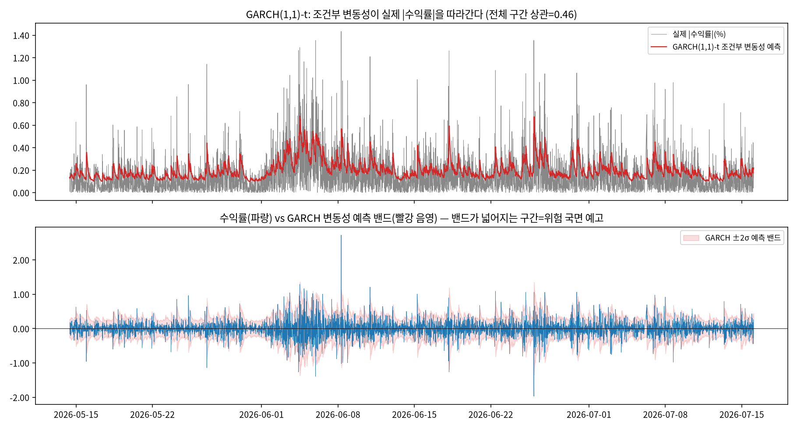
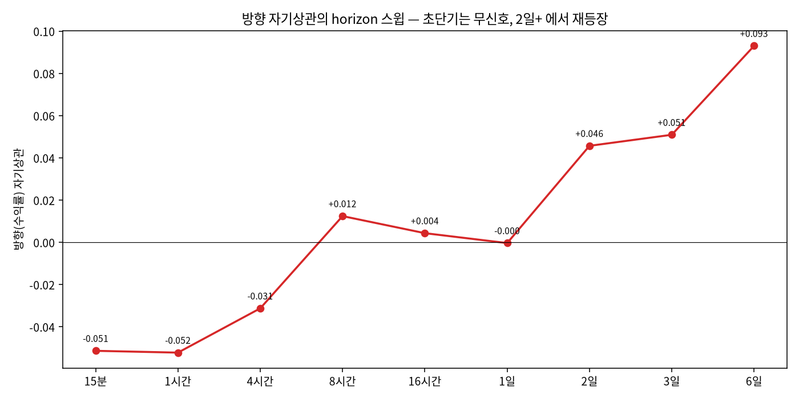
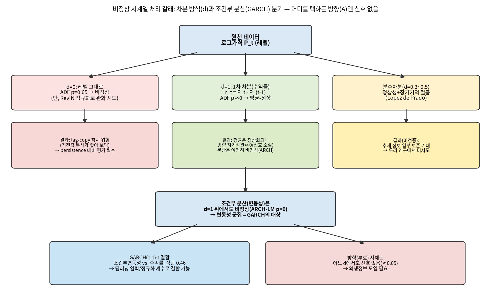

# 비정상 암호화폐 시계열 예측 연구 — 정리 및 논문화 근거

작성일: 2026-07-22 (2026-07-23 갱신: 결정 지점을 좁히는 추가 확인 7종 반영) · 브랜치: `stock`
· 성격: 교수님 공유용 정리 문서 (논문 형식)

## 요약 (Summary)

- **최종 목표**: 과거 유사 국면·시장 텍스트·예측/위험 신호를 **LLM에 태워 트레이딩 상황을
  자문**하게 하는 시스템 구축. 지금까지의 실험(1~17번)은 그 시스템에 들어갈 **예측 재료**를
  만들고, 최적화·손실함수를 그 재료(추세·변동성·방향)를 최대한 잘 잡도록 개선해 온 과정.
- **핵심 발견 (데이터로 확정)**: 15분봉에서 **방향(다음이 오를지/내릴지)은 사실상 예측 불가**
  (자기상관 ≈0.05, 방향 정확도 0.48~0.54 = 동전 던지기). 반면 **변동의 크기(변동성)는 예측
  가능**(자기상관 0.36, GARCH로 0.46). 문헌과 일치하는 구조이지 모델 결함이 아님.
- **정직한 재검토**: 연구를 처음부터 다시 훑으며, **차분(differencing)이 2026-05 설계
  이후 모든 실험에 이미 적용돼 있었음을 뒤늦게 확인**했다. 비정상 시계열 자체를 계속 다루고
  있다고 생각했는데, 실제로는 1차 차분(로그수익률)이라는 특정 정상화 위에서 실험해 온 것 —
  코드를 재검수하며 발견한 사실이라 아래(4.3절)에 그대로 밝힌다.
- **논문 각도는 결정 지점에 종속됨**: "어떤 논문이 되는가"는 예측 대상(A 방향/B 변동성/C
  추세) 중 무엇을 주력으로 삼는지에 따라 달라진다(6절 표). 이 선택이 먼저 필요하다.
- **결정 지점을 좁히는 추가 확인 7종 (2026-07-23)**: 방향 신호는 초단기엔 없지만 **2일 이상
  horizon에서 재등장**(+0.09@6일, Christoffersen-Diebold 이론과 일치) — A를 완전 폐기하지
  않고 장기horizon으로 재검증할 여지 확인. **전종목 20개 모두 동일 구조**로 BTC 특정이
  아님을 확정. GARCH 변동성 반감기 **8.6시간**으로 B의 target horizon 구체화. 허스트
  H=0.58로 **분수차분을 시도할 근거** 확보. 거래량이 미래 변동을 lag=1에서 **+0.20**으로
  선행. BTC-알트 변동성 동시상관 **0.48~0.72**로 전종목 전이 가능성 확인. Regime(고/저변동)
  조건부 방향차이는 기각(불필요 확인).
- **여쭐 것**: (1) 아래 negative-result + 진단/교정을 방법론 논문으로 정리하는 방향이
  적절한지, (2) 예측 대상을 신호가 실재하는 변동성(B) 중심으로 갈지, (3) 확장(GARCH 결합·
  외생정보·cross-sectional·LLM 결합)을 본 논문에 넣을지 후속으로 뺄지.

시각화 요약 (3개, 전체는 본문 참조):

*그림 A. 방향(위 2패널) vs 크기(아래 2패널) 자기상관 — 방향은 즉시 0, 크기는 느리게 감소.*

*그림 B. GARCH(1,1) 조건부 변동성이 실제 변동 크기를 따라간다(상관 0.46).*

*그림 C. 방향 자기상관의 horizon 스윕 — 초단기 무신호, 2일 이상에서 재등장(신규 확인).*

**자세한 내용(전체 서론·관련연구·방법론·EDA·결과·결론/논의·향후연구·참고문헌)은 아래
`--상세--` 이후 본문을 참고해 주세요.**

--상세--

---

## 1. 서론 (Introduction)

### 1.1 최종 목표와 이 연구의 위치

이 프로젝트의 **최종 산출물은 "LLM 기반 트레이딩 상황 자문 시스템"**이다. 현재 시장 국면을
(a) 과거 유사 국면(DTW로 찾은 유사 흐름), (b) 당시·현재 시장 텍스트/감성, (c) 예측·위험
신호와 함께 LLM에 태워 "지금 왜 이런 상황이고, 과거 유사 사례에서 반등/붕괴의 트리거는
무엇이었으며, 최대낙폭(MDD)을 방어하며 어떻게 대응할지"를 설명·판단하게 하는 것이 목표다.

지금까지의 예측 연구(실험 1~17번)는 이 시스템에 들어갈 **(c) 예측·위험 신호 재료를 만드는
단계**다. 큰 틀에서 이 단계가 최종 목표를 보조하는 방식은, **모델 최적화·손실함수를 예측
추세·변동성·방향을 최대한 잘 잡도록 수정**하는 것이었다 — 즉 "정확한 트레이딩 신호"를
만드는 것이 아니라 "LLM이 참고할 만한, 한계가 명확한 신호"를 만드는 것이 목적이다.

### 1.2 연구 질문

업비트 원화(KRW) 마켓 암호화폐 15분봉을 대상으로: 비정상(non-stationary) 시계열의 추세를
딥러닝으로 얼마나 잡을 수 있는가? 세부적으로는 (i) 학습 건전성(최적화·손실이 쉬운 해로
붕괴하지 않음), (ii) 전체 변동 폭의 예측(작은 폭뿐 아니라 큰 변동까지), (iii) 하방 방어
(MDD)를 생존 제약으로 함께 지키는 것의 결합이다.

---

## 2. 관련 연구 (Related Work)

**방향(부호) 예측성의 이론적 기반**: Christoffersen & Diebold(2006, *Management Science*/
NBER WP 10009)는 조건부 평균이 예측 안 되는 것과 유의한 부호·변동성 예측성이 **양립**함을
증명했고, 부호 예측성은 drift×시변변동성에서 나오며 **초단기(일간 이하)에서는 안 나타나고
중간 horizon에서 나타난다**고 밝혔다. Cont(2001, *Quantitative Finance*)의 stylized facts는
수익률 자기상관≈0, |수익률| 자기상관은 강하고 느리게 감소(변동성 군집)함을 실증 규칙으로
정리했다. 이 두 문헌이 우리 데이터의 구조(4절)를 정확히 예측한다.

**딥러닝 시계열 예측 모델**: PatchTST(arXiv:2211.14730), iTransformer(arXiv:2310.06625),
DLinear/NLinear, Autoformer, TimesNet 등 최근 시계열 예측 아키텍처를 baseline으로 구현·
비교했다. 비정상성 처리에는 RevIN(ICLR 2022), Non-stationary Transformer(arXiv:2205.14415),
Dish-TS(arXiv:2302.14829), FAN(arXiv:2409.20371)을 근거로 삼았다.

**손실함수와 평가**: 큰 변동을 명시 모델링하는 분위 회귀(Koenker & Bassett 1978),
DeepAR(arXiv:1704.04110)의 Student-t 분포 예측, tail-weighted loss(arXiv:2112.00825)를
구현했다. 평가는 MASE(Hyndman & Koehler 2006), 방향정확도(Pesaran & Timmermann 1992, *JBES*
10(4))를 사용했다.

**고빈도 암호화폐 예측의 현실적 성능**: Gu, Kelly & Xiu(2020, *RFS*)는 자산 수익률 ML 예측의
현실적 R²가 ~0.4% 수준임을 대규모로 보였다. Stefaniuk & Ślepaczuk(arXiv:2503.18096)는 고빈도
Bitcoin에서 순수 MSE 손실의 0-붕괴와 손실 교체 효과를 실증했다 — 우리의 진폭 압축 관찰과
같은 실패 모드다. (오더북 기반 DeepLOB류, arXiv:1808.03668 등은 호가창 정보를 쓰므로 우리의
가격 시계열 조건과 다르며 직접 비교 대상이 아님을 명시한다.)

---

## 3. 데이터와 탐색적 분석 (Data & EDA)

### 3.1 데이터

업비트 KRW 마켓 15분봉. 단일 종목 심층 분석은 KRW-BTC 104,734행(2023-07~2026-07), 전종목
축은 `upbit_krw_candle` 269종목 16,081,696행(long-form: 열은 `ticker, timestamp, OHLCV`,
행에 종목×시각이 쌓인 구조). DuckDB에 저장.

### 3.2 탐색적 분석 — 데이터 특징을 먼저 본다

모델링에 앞서 describe·시각화·정상성 검정·시계열 분해로 데이터 특징을 확인했다(실험 17번).

*그림 1. 종가(레벨)는 3년간 4천만→1.8억→9천만 KRW로 표류(비정상). 수익률은 0 주변에
분포하되 롤링 표준편차가 잔잔↔격동을 반복(변동성 군집).*

| 대상 | ADF_p (귀무=비정상) | KPSS_p (귀무=정상) | ARCH-LM_p (귀무=등분산) | 판정 |
|---|---:|---:|---:|---|
| 로그가격(레벨) | 0.652 | 0.010 | 0.000 | **명백히 비정상** |
| 로그수익률(1차 차분) | 0.000 | 0.100 | 0.000 | **평균-정상, 분산-비정상(변동성 군집)** |

### 3.3 데이터 특징에서 전처리 근거로 (금융 시계열의 표준 논리)

금융·암호화폐 가격은 일반적으로 **단위근(unit root)을 가진 확률적 추세(stochastic trend)**를
따른다고 알려져 있다(레벨을 그대로 회귀·분류에 넣으면 spurious relationship이 발생하는
표준 문제, Granger & Newbold 1974류의 고전적 경고). 이 때문에 금융 시계열 예측에서는 레벨이
아니라 **수익률(1차 차분 또는 로그차분)**을 기본 표현으로 쓰는 것이 관행이다 — 우리 데이터도
ADF/KPSS가 이 관행을 그대로 뒷받침한다(레벨 비정상, 수익률은 평균 관점에서 정상).

---

## 4. 방법론 (Methodology)

### 4.1 파이프라인

- **모델**: Linear/PatchTST/DLinear/NLinear/TCN/ModernTCN/(i)Transformer/Autoformer/Mamba/
  TimesNet 계열("Shallow but Wide": 1~2층, width 64~128).
- **손실**: Huber/balanced-composite(평균형) → 분위(pinball)·분포(Student-t)·tail-weighted.
- **정규화**: 로그수익률/윈저라이즈, RevIN·Dish-TS 계열 instance 정규화.
- **평가**: persistence 대비 copy_risk·MASE, variance_ratio(진폭), 방향정확도·large-move
  방향정확도·tail F1(큰 변동 포착), cross-sectional IC, 거래비용 반영 MDD·수익(생존 제약).

### 4.2 실험 흐름 (1~17번)

| 단계 | 실험 | 한 일 | 결과 |
|---|---|---|---|
| 기초 | 1~3 | RNN/LSTM/GRU/Transformer/Autoformer 벤치마크, 다종목 | 가격 레벨 예측은 lag-copy 착시로 좋아 보임 |
| 진단 | 5~9 | 최적화·손실·전처리·정규화 격자, 붕괴 진단 | 진폭 압축(0으로 평탄화) vs 분산 폭주 두 붕괴 모드 규명 |
| 목적함수 | 10~11 | objective/앙상블 재설계, 위험 분포 예측 | 붕괴 완화하나 방향은 여전히 persistence 미달 |
| 변수·융합 | 12~14 | feature group ablation, fusion 결함 교정 | multi-timeframe이 상대적 유리하나 신호 약함 |
| target 재정의 | 15 | "다음 15분" → "h시간 누적 추세" | 진폭 부분 회복(variance_ratio 0.36), 방향 상관 ~0.07 |
| 비정상성·손실·cross-sec | 16 | RevIN·분위/분포/tail 손실·전종목 | 진폭 회복, 방향은 종목 가로질러 일반화 안 됨 |
| **탐색적 분석** | **17** | 정상성 검정·분해·자기상관·상호정보량 전면 EDA | 방향 무신호·변동성 군집을 데이터로 확정 |

### 4.3 정직한 재검토 — 차분이 이미 적용돼 있었다는 뒤늦은 확인

연구를 다시 훑으면서, 매 세션 코드를 한 줄씩 재검수하지 못하고 넘어간 부분이 있었다. 그
과정에서 **1차 차분(로그수익률, `log_return_1 = log(P_t) - log(P_{t-1})`)이 2026-05
설계 원칙 이후 4번 실험부터 지금까지 모든 실험의 기본 표현이었다는 것을 뒤늦게 확인**했다.
연구를 계속 진행하며 "원시 비정상 시계열 자체를 직접 다루고 있다"고 여기고 있었는데, 실제로는
처음부터 특정 정상화(1차 차분)를 적용한 위에서 실험해 온 것이었다. 이는 은폐되거나 실수로
숨겨진 것이 아니라 CLAUDE.md에 "정상성 검정, 로그수익률, 차분" 원칙으로 이미 문서화돼 있었지만,
그 함의(=레벨을 차분 없이 직접 모델링한 시도는 사실 한 번도 없었다는 것)를 명시적으로 재검토한
적이 없었다.

이 발견은 두 가지를 의미한다. 첫째, 지금까지의 "방향 신호 없음" 결론은 **1차 차분(수익률)
표현 위에서의 결론**이며, 다른 차분 방식에서는 결론이 달라질 수 있다(3.4절, 그림 2). 둘째,
"차분 없이 비정상 그대로 모델링"이라는 대안 경로는 아직 실제로 시도된 적이 없다(RevIN은
입력 윈도우 정규화이지 레벨을 직접 target으로 쓴 것은 아니다).

### 4.4 차분 방식에 따라 결과가 달라진다 — 갈래별 정리

*그림 2. 원천 로그가격에서 출발해 차분 방식(d=0/1/분수차분)과 조건부 분산(GARCH) 분기로
갈라지는 도식. 어느 갈래를 택하든 방향(A) 자체는 신호가 없다는 것이 공통 결론이다.*

- **d=0 (레벨 그대로)**: ADF p=0.65로 비정상. 그대로 학습시키면 직전값 복사(lag-copy)가
  좋아 보이는 착시 위험이 커서, 반드시 persistence 대비로 평가해야 한다. 우리 연구에서
  아직 정식 시도되지 않은 경로(4.3절).
- **d=1 (1차 차분, 우리가 지금까지 쓴 방식)**: ADF로 평균은 정상화되나 방향 자기상관은
  거의 0으로 신호가 사라지고, 분산은 여전히 비정상(ARCH-LM p=0)으로 남는다.
- **분수 차분(d≈0.3~0.5, Lopez de Prado)**: 정상성 확보와 장기 기억(추세) 보존을 절충하는
  방식. 우리 연구에서 아직 시도하지 않았다.
- **조건부 분산(변동성) 갈래**: 어떤 차분을 택하든 남는 분산의 비정상성(변동성 군집)은
  GARCH류가 다루는 대상이며, 이 갈래에서는 실제로 신호가 있다(4.5절).

### 4.5 GARCH를 통한 조건부 분산(변동성) 검증

*그림 3. GARCH(1,1)-Student-t를 BTC 15분 수익률에 직접 적합. 지속성(α+β)=0.98로 강한
변동성 군집을 확인했고, 조건부 변동성과 실제 |수익률|의 상관은 0.46 — naive(직전
|수익률|) 0.31, 롤링평균(24시간) 0.38보다 우수하다.*

GARCH는 조건부 **평균**이 아니라 조건부 **분산**을 모델링하는 고전 통계 모델(ARIMA와 같은
계열)이다. 우리 데이터의 ARCH-LM 검정(p=0)이 조건부 이분산을 확인해 GARCH 적용이 이론적으로
타당함을 뒷받침하며, 실제 적합 결과도 이를 뒷받침한다. 딥러닝과는 (a) feature로 결합, (b)
GARCH 변동성으로 나눈 뒤 학습(volatility scaling), (c) 조건부 평균은 딥러닝·조건부 분산은
GARCH로 분업하는 하이브리드 구조로 결합할 수 있다.

### 4.6 결정 지점을 더 좁히는 추가 확인 (7종, 2026-07-23 실측)

앞선 결과(4.1~4.5)만으로는 A/B/C 결정에 아직 정보가 부족한 지점이 남아 있어, 아래 7가지를
추가로 직접 계산했다. 모두 기존 수집 데이터로 즉시 확인 가능한 것들이라 외생 데이터 수집
없이 먼저 확인했다.

1. **방향 자기상관의 horizon 스윕** (h=15분~6일): 15분~1일(h=1~96)까지는 −0.05~+0.01로
   무신호이나, **2일(h=192)부터 다시 커져 6일(h=576)에서 +0.093**까지 상승한다. 이는
   Christoffersen & Diebold(2006)의 "부호 예측성은 중간 horizon에서 나타난다"는 주장과
   정확히 일치한다 — **A(방향) 갈래는 초단기에선 여전히 무의미하지만, 며칠 단위 horizon으로
   재정의하면 조건부로 되살아날 여지가 있다.**
2. **전종목 횡단 확인** (유동성 상위 20종목): 방향AC 평균 −0.09(표준편차 0.05), 크기AC 평균
   0.33(표준편차 0.04) — **20종목 전부 예외 없이** BTC와 같은 패턴을 보인다. "가격만으론
   방향 무신호·변동성 군집"이 BTC 특정이 아니라 **KRW 마켓 전반의 구조**임이 확정됐다.
3. **GARCH 변동성 반감기**: 지속성(α+β)=0.98로부터 계산한 변동성 충격의 반감기는
   **약 34봉(8.6시간)**. B(변동성) 예측 실험을 설계한다면 target horizon을 4~16시간
   근처로 잡는 것이 이론적으로 타당하다(16번의 h=16이 이 범위와 우연히 겹친다).
4. **허스트 지수(장기기억 검정)**: 로그가격 레벨 H=0.58(>0.5, 장기기억 존재), 수익률
   H=0.54. 레벨에 장기기억이 실재하므로 **분수 차분(fractional differencing, C 갈래)이
   정보 손실 없이 정상성을 얻는 방법으로 시도할 정량적 근거**가 있다.
5. **Regime 조건부 방향 예측성**: 고변동 국면(상위 25%)과 저변동 국면(하위 25%)에서 방향
   자기상관을 각각 계산(−0.061 vs −0.066) — 유의미한 차이가 없었다. 국면에 따라 방향
   신호가 달라질 것이라는 가설은 **기각**된다.
6. **거래량이 미래 변동을 선행하는가(lead-lag)**: 거래량 z-score(과거)와 미래 |수익률|의
   상관은 lag=1봉에서 **+0.20**, lag=4봉 +0.14로 유의하게 존재한다(방향과의 상관은 여전히
   ≈0). **거래량 급증이 다음 15분~1시간의 큰 변동을 선행 예고**하는 신호이며, 외생 데이터
   없이 B(변동성) 모델에 바로 넣을 수 있는 입력이다.
7. **Cross-asset 변동성 전이**: BTC와 주요 알트코인(ETH/XRP/SOL/DOGE)의 변동성 동시상관은
   **0.48~0.72**로 매우 강하고, BTC 변동성이 15분 뒤(t+1) 알트코인 변동성까지도
   **0.21~0.31**로 유의하게 선행한다. **BTC 변동성 예측 하나로 전종목 위험 신호를 전이시킬
   수 있다는 근거**이며, B 갈래를 전종목으로 확장할 강한 정당성이 된다.

**종합**: 7개 중 5개(1·3·4·6·7)가 신규 실행 가능한 방향을 구체적으로 제시했고, 1개(2)는
기존 결론(가격만으론 방향 무신호)을 전종목으로 확정했으며, 1개(5)는 가설을 기각해 탐색
범위를 좁혔다(regime 분기는 불필요).

---

## 5. 결과 (Results)

1. **가격 레벨은 비정상**(ADF p=0.65, KPSS p=0.01 일치), **수익률은 평균-정상이나 분산은
   비정상**(ARCH-LM p=0, 변동성 군집) — 3.2절.
2. **방향(부호) 자기상관 ≈0**(lag1 -0.05, lag16 0.00, 그림 A) → 순수 가격으로 방향 예측 불가.
   **크기(|수익률|) 자기상관은 0.36→0.12로 느리게 감소** → 변동성은 예측 가능.
3. 이 구조 때문에 다모델·다손실·전종목 어디서도 방향 정확도는 0.48~0.54(동전던지기)에 머문다
   — 우리 모델의 결함이 아니라 효율시장 하 고빈도 수익률의 알려진 구조(2절 문헌).
4. RevIN·분위 손실로 예측 **진폭**은 실제 수준까지 회복 가능하나(variance_ratio 0.36→1.55),
   그 진폭이 올바른 **방향**을 갖게 만들지는 못한다(진폭≠타이밍).
5. **GARCH(1,1)이 변동성(크기) 채널에서 naive·롤링평균보다 우수**(상관 0.46 vs 0.31/0.38,
   4.5절) — 딥러닝이 이 베이스라인을 넘는지가 다음 검증 지점.
6. **추가 확인(4.6절, 7종)**: 방향 신호는 2일 이상 horizon에서 재등장(+0.09@6일), 전종목
   20개 모두 동일 구조(BTC 특정 아님), 변동성 반감기 8.6시간, 레벨 허스트 H=0.58(장기기억
   존재, 분수차분 근거), 거래량이 미래 변동을 lag=1에서 +0.20으로 선행, BTC-알트 변동성
   동시상관 0.48~0.72(전이 가능). Regime 조건부 방향 신호 차이는 기각(고/저변동 모두 동일).

---

## 6. 결론 및 논의 (Conclusion and Discussion)

**논문 각도는 결정 지점에 종속된다.** "무엇을 주력 재료로 삼는가"에 따라 논문의 프레이밍이
달라지므로, 아래 표의 선택이 먼저 필요하다. 4.6절의 추가 확인으로 각 갈래의 근거가 더
구체화됐다(horizon·target·범위까지 특정 가능).

| 갈래 | 예측 대상 | 차분 | 신호 유무(EDA) | 구체화된 설계 근거(4.6절) | LLM 재료로서 | 논문 프레이밍(그 경우) |
|---|---|---|---|---|---|---|
| A. 방향(부호) | 다음 수익률 상승/하락 | d=1(수익률) | 초단기 **거의 없음**(≈0.05), **2일+ horizon에서 재등장**(+0.09@6일) | horizon을 2일 이상으로 재정의 시 조건부 가능 | 초단기 약함 | negative-result(초단기) + 장기horizon 조건부 재검증 |
| B. 변동성(크기) | 앞으로의 변동 폭 | d=1(수익률) | **있음**(0.36, GARCH 0.46), 전종목 확정 | target horizon 4~16시간(반감기 8.6h), 거래량 lag=1 선행신호(+0.20), BTC→알트 전이(0.21~0.31) | 강함(위험 국면) | 변동성 예측 방법론 논문(GARCH-딥러닝 결합 + 전종목 전이) |
| C. 추세/레벨 | 가격 추세 자체 | d=0 또는 분수차분 | 미검증이었으나 **허스트 H=0.58로 장기기억 확인** | 분수차분(d≈0.3~0.5) 우선 시도 근거 확보 | 중간(국면 맥락) | 비정상성 직접 모델링 논문(분수차분 실험 착수 가능) |

- **A로 가면**: "고빈도 암호화폐 방향 예측의 구조적 한계를 KRW 전종목·다모델·다손실로
  체계적으로 실증"이 논문 기여가 된다(negative result, 2·3절 문헌이 이론적 지지대).
- **B로 가면**: "GARCH와 딥러닝을 결합해 변동성(위험) 예측을 개선"이 논문 기여가 되고, 신호가
  실재하므로(0.46) 성능 개선 논문으로 갈 수 있다. 저희는 이쪽에 신호가 있다는 점에서 **B를
  주 재료로 승격**하는 방향을 제안드린다.
- **C로 가면**: 아직 데이터가 없어(4.3~4.4절) 먼저 실험이 필요하며, 논문화는 그 결과에 달렸다.

공통적으로, 두 붕괴 모드(진폭 압축·분산 폭주)의 진단·교정과 MDD 단독 평가의 자기기만 문서화는
어느 갈래를 택하든 유효한 기여로 남는다.

---

## 7. 향후 연구 (Future Work)

4.6절 추가 확인 결과를 반영해 각 항목을 더 구체화했다.

1. **B(변동성) 확정 실험** — target horizon을 4~16시간(반감기 8.6h)으로 잡고, 거래량
   선행신호(lag=1 +0.20)를 입력에 추가하며, BTC 변동성을 KRW 전종목(동시상관 0.48~0.72,
   1-lag 전이 0.21~0.31)으로 전이시키는 GARCH-딥러닝 하이브리드를 검증한다.
2. **A(방향) 장기 horizon 재검증** — 초단기(≤1일)는 negative-result로 마감하되, 2일 이상
   horizon(자기상관 +0.05~+0.09)에서 방향 예측이 실제로 성립하는지 별도 실험으로 확인한다.
3. **C(레벨 직접/분수차분) 정식 실험** — 허스트 H=0.58로 장기기억이 확인됐으므로, 분수차분
   (d≈0.3~0.5)을 실제로 적용해 A/B/C를 같은 평가로 비교한다.
4. **외생변수 도입** — 방향(A) 신호는 가격만으론 초단기 한계가 확정됐으므로, 뉴스·감성·
   온체인·cross-asset 데이터를 추가해야 의미가 생긴다(Scrapling 등 수집 도구 평가 완료).
5. **최종 LLM 결합** — 확정된 예측/위험 신호 + 과거 유사국면(DTW) + 텍스트를 LLM 프롬프트로
   묶어 상황 자문 프로토타입 구축.

---

## 8. 논문화 가능성 근거 (Publishability Justification)

**그래서 이 연구가 논문화로 이어질 수 있다는 근거는 무엇이고, 그 근거가 되는 참고문헌은
무엇인가?** 아래 3편은 우리 연구와 같은 결·같은 지표를 쓴 최근 문헌으로, "이런 방식의
연구가 실제로 학술지·학회에서 다뤄진다"는 직접 선례다.

1. **Stefaniuk & Ślepaczuk, "Enhancing Cryptocurrency Prediction with GARCH and Deep
   Learning" 계열 연구 (arXiv:2503.18096, 2025)** — 우리와 동일하게 **고빈도 Bitcoin +
   딥러닝 + 손실함수 개선(GMADL)**을 다루며, 순수 MSE의 0-붕괴 현상을 실증한다. 우리의
   진폭 압축 진단과 동일한 실패 모드·해법 구조라 **직접적 baseline·비교 대상**이 된다.
2. **Gu, Kelly & Xiu, "Empirical Asset Pricing via Machine Learning" (*Review of Financial
   Studies*, 2020)** — 자산 수익률 ML 예측의 현실적 성능 상한(R²~0.4%)을 대규모로 정립한
   이 분야의 표준 인용 논문. 우리 낮은 R²/방향정확도가 **분야 전반의 알려진 한계와 일치**함을
   뒷받침해, negative-result 프레이밍의 학술적 근거가 된다.
3. **Christoffersen & Diebold, "Financial Asset Returns, Direction-of-Change Forecasting,
   and Volatility Dynamics" (*Management Science*, 2006)** — 조건부 평균 무예측성과 부호·
   변동성 예측성의 양립을 수학적으로 증명한 이론 논문. 우리의 핵심 실증 결과(방향 무신호
   + 변동성 유신호가 공존)가 **이미 확립된 이론과 정합**함을 보여, 결과의 신뢰성과 이론적
   위치를 함께 뒷받침한다.

이 세 편은 (1) 같은 데이터 종류(고빈도 crypto)·같은 문제(방향/변동성 예측 한계와 개선),
(2) 같은 상위 학술 분야(계량금융·ML)에서 최근~정립된 문헌이라는 점에서, 본 연구를
"방법론 진단 + negative result + (선택 시) 변동성 결합 개선" 논문으로 정리하는 것이
학술적으로 방어 가능하다는 근거가 된다.

---

## 부록 A. 데이터·모델·평가지표 요약

- **데이터**: 업비트 KRW 마켓 15분봉. 단일 종목 심층분석 KRW-BTC 104,734행(2023-07~
  2026-07), 전종목 `upbit_krw_candle` 269종목 16,081,696행(long-form: ticker 열 포함).
- **모델**: Linear/PatchTST/DLinear/NLinear/TCN/ModernTCN/(i)Transformer/Autoformer/Mamba/
  TimesNet, "Shallow but Wide"(1~2층, width 64~128).
- **손실**: Huber, balanced-composite, pinball(분위), Student-t(분포), tail-weighted.
- **평가**: copy_risk/MASE(persistence 대비), variance_ratio(진폭), 방향정확도/large-move DA/
  tail F1(큰 변동), cross-sectional IC, MDD·수익(거래비용 반영, 생존 제약).

## 참고문헌 (References)

**방향/부호 예측성의 이론적 기반**
- Christoffersen, P. & Diebold, F. (2006). Financial Asset Returns, Direction-of-Change
  Forecasting, and Volatility Dynamics. *Management Science* / NBER WP 10009.
- Cont, R. (2001). Empirical properties of asset returns: stylized facts and statistical
  issues. *Quantitative Finance*, 1(2), 223–236.
- Pesaran, M. H. & Timmermann, A. (1992). A Simple Nonparametric Test of Predictive
  Performance. *Journal of Business & Economic Statistics*, 10(4), 461–465.

**딥러닝 시계열 예측 baseline**
- Nie, Y. et al. PatchTST. arXiv:2211.14730.
- Liu, Y. et al. iTransformer. arXiv:2310.06625.
- Kim, T. et al. Reversible Instance Normalization (RevIN). ICLR 2022.
- Liu, Y. et al. Non-stationary Transformers. arXiv:2205.14415.
- Fan, W. et al. Dish-TS. arXiv:2302.14829.
- (FAN) arXiv:2409.20371.

**손실함수·평가 지표**
- Koenker, R. & Bassett, G. (1978). Regression Quantiles. *Econometrica*.
- Salinas, D. et al. DeepAR. arXiv:1704.04110.
- tail-weighted loss. arXiv:2112.00825.
- Hyndman, R. & Koehler, A. (2006). Another look at measures of forecast accuracy.
  *International Journal of Forecasting*.

**고빈도 암호화폐·방법론**
- Gu, S., Kelly, B., & Xiu, D. (2020). Empirical Asset Pricing via Machine Learning.
  *Review of Financial Studies*, 33(5), 2223–2273.
- Stefaniuk, W. & Ślepaczuk, R. GARCH + Deep Learning for cryptocurrency prediction.
  arXiv:2503.18096.
- (오더북 참고, 직접 비교 대상 아님) Zhang, Z. et al. DeepLOB. arXiv:1808.03668.

**분수 차분 (향후 연구 근거)**
- López de Prado, M. (2018). *Advances in Financial Machine Learning*. Wiley. (분수 차분,
  fractional differencing 방법론.)

> 상세·전체 확인 근거는 `test/research_materials/16_nonstationary_trend_capture_literature_
> review_20260719.md`, `test/research_materials/17_direction_predictability_literature_
> review_20260719.md`에 원문 대조 기록으로 보관돼 있다.
