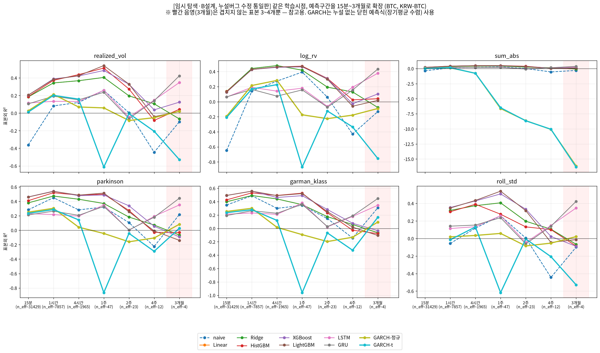
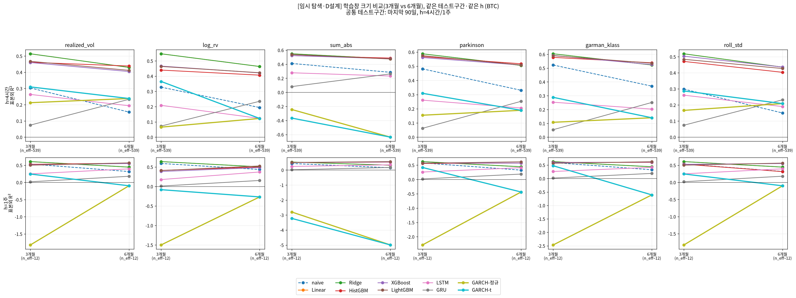

# 임시 탐색 — 변동성 예측 모델 비교 (정정 포함)

작성일 2026-09-07 · 브랜치 `stock` · **정식 번호가 붙은 실험이 아니라, 방향(변동성) 확정 뒤
모델을 다시 처음부터 가볍게 훑어보는 임시 탐색입니다.** 모든 수치는 BTC 15분봉 단일 종목 기준.

---

## 0. 한 줄 요약

> 짧은 구간(15분~1주)은 트리 계열(LightGBM/XGBoost/HistGBM)이 가장 강하고, 구간이 길어질수록
> **GARCH는 좋아지는 게 아니라 오히려 나빠집니다.** 지난번 말씀드린 "구간이 길어지면 GARCH
> 성능이 확 올라간다"는 **정정**합니다 — 그 결과는 예측 구간 안의 실제 수익률을 모델이 미리
> 들여다보는 코드 버그(look-ahead) 때문이었고, 바로잡고 나니 정반대 결과가 나왔습니다.

---

## 1. 정정 — "구간이 길어지면 GARCH가 좋아진다"는 틀렸습니다

이전에 "짧은 구간엔 트리 계열 1등, 기간이 길어지면 GARCH 성능이 확 올라간다"고 말씀드렸는데,
**뒷부분(GARCH 관련)이 틀렸습니다.**

**원인**: GARCH로 "1주 뒤 변동성"을 예측할 때, 그 1주 동안 **실제로 일어난 수익률**을 계산에
그대로 사용하는 코드 버그가 있었습니다. 즉 답을 미리 보고 맞힌 것이라 성능이 비현실적으로
높게(R² 0.8~0.99) 나왔습니다.

**수정**: GARCH(1,1)의 닫힌 형태 다단계 예측식(미래 정보를 전혀 쓰지 않고, 지금까지 알려진
값만으로 h구간 뒤까지 예측)으로 다시 계산했습니다. 그 결과:

- **정정된 결론**: 구간이 길어질수록 GARCH의 예측은 "장기평균 분산"으로 수렴해 거의 상수가
  되고, 학습 기간과 테스트 기간의 변동성 수준 자체가 다르면(레짐 변화) 오차가 커집니다. 즉
  **구간이 길어질수록 GARCH는 나빠집니다.**
- 나머지 부분("짧은 구간엔 트리 계열 1등", "딥러닝은 전반적으로 부진")은 재검증 후에도
  그대로 유지됩니다.

---

## 2. 실험 조건 (공통)

- **데이터**: 업비트 KRW-BTC, 15분봉, 약 2.99년(104,883봉)
- **타깃(종속변수, 6종)**: 변동성을 정의하는 여러 방식 — 실현변동성(√Σr²), 로그실현변동성,
  Σ\|r\|, Parkinson(고저범위), Garman-Klass(고저+시종범위), 구간내 표준편차
- **모델(10종)**: naive(직전값 지속), Linear, Ridge, HistGBM, XGBoost, LightGBM, LSTM, GRU,
  GARCH-정규, GARCH-t (모델 크기는 가볍게: 트리 250개 estimator, RNN hidden 48·8epoch)
  — **모델을 하나로 미리 정하지 않고 여러 종류를 동시에 가볍게 적합해 비교**하는 방식입니다.
- **채점**: 표본외(학습에 안 쓴 구간) R². 구간(h)이 클수록 인접 테스트 시점끼리 타깃이 겹쳐
  R²가 부풀 수 있어, **겹치지 않는 독립 표본만 골라 채점**했습니다(그림 x축의 n_eff 표기).
- GARCH는 학습 구간까지만의 정보로 필터링한 뒤, 닫힌 예측식으로 h구간 뒤를 추정합니다(누설 없음).

---

## 3. 실험 ① — 예측 구간을 15분~3개월로 확장 (B)

**질문**: 같은 학습 시점에서, 얼마나 먼 미래까지 예측할 수 있는가?

- **15분~1주**: 트리 계열(HistGBM/XGBoost/LightGBM, 빨강·보라·갈색)이 꾸준히 최상위(R²
  0.4~0.55). GARCH(청록·올리브)는 이 구간에서 나쁘지 않지만(R² 0.08~0.20) 트리보다는 낮습니다.
- **2주 이상**: 전반적으로 하락하고, GARCH는 **음수(-0.1~-0.4)**로 떨어집니다(`sum_abs`
  타깃 제외 기준 — 아래 한계 참조).
- **4주~3개월에서 GRU/LSTM이 다시 오르는 것처럼 보이는 지점**은 독립 표본이 3~12개뿐이라
  **우연일 가능성이 커 참고만** 해야 합니다(그림의 빨간 음영 = 3개월, 표본 3~4개).

**한계(정직하게 밝힘)**: `sum_abs` 타깃에서 GARCH만 유독 크게 무너지는 것(-16까지)은 실력
문제가 아니라 **GARCH가 추정하는 값(분산의 합)과 이 타깃(절댓값의 합)의 척도가 달라서**
생기는 인공적 왜곡입니다. 그래서 위 요약에서 GARCH 평균을 말할 때는 이 타깃을 제외했습니다.

---

## 4. 실험 ② — 학습 데이터 양 비교: 3개월 vs 6개월 (D)

**질문**: 같은 테스트 구간에서, 학습에 3개월 치를 쓰는 것과 6개월 치를 쓰는 것 중 무엇이
나은가? (B와 다른 질문 — B는 "얼마나 멀리 볼까", D는 "얼마나 많이 겪고 볼까")

공통 테스트 구간(마지막 90일)에 두 학습 크기를 동일하게 채점했습니다.

| 예측 구간 | 결과 | 신뢰도 |
| :--- | :--- | :--- |
| **4시간**(짧음) | **3개월 학습이 6개월보다 낫다**(대부분 모델에서 R² 소폭 우위) | 높음(독립표본 ~539개) |
| **1주**(김) | **6개월 학습이 3개월보다 확실히 낫다** — 3개월 학습은 R²만 비슷하고 실제 오르내림 상관은 거의 0(심지어 음수)인데, 6개월 학습은 상관이 0.55~0.65로 확 좋아짐 | 낮음(독립표본 ~12개, 참고용) |

**해석**: 짧은 예측은 "최근 상황"이 더 중요해 오래된 데이터가 오히려 방해가 될 수 있고, 긴
예측은 다양한 과거 패턴을 더 많이 봐야 학습이 됩니다. **GARCH는 학습량을 늘려도 나아지지
않고 오히려 나빠지는 경향**을 보였는데, 이는 학습 구간을 늘릴수록 그 구간의 평균 변동성
수준이 최근 테스트 구간과 더 어긋나기 때문으로 보입니다(레짐 변화).

---

## 5. 종합 — 다음에 참고할 점

- **짧은 예측(하루 이내)**: 트리 계열 + 비교적 최근 데이터(3개월 안팎)로 학습.
- **긴 예측(1주 이상)**: 더 많은 과거 데이터(6개월 이상)가 필요해 보이나, 표본이 적어
  추가 검증 필요.
- **GARCH**: 짧은 구간에서는 쓸 만하지만, 구간이 길어지거나 레짐이 바뀌면 급격히 약해짐.
  단독으로 먼 미래를 보는 용도로는 권장하지 않음.
- **딥러닝(LSTM/GRU)**: 이번 가벼운 설정에서는 전 구간 하위권. 아키텍처·학습을 제대로
  투자하지 않는 한 우선순위 낮음.

이 결과는 임시 탐색이라 정식 결론으로 확정하지 않고, 다음 정식 실험(전종목·정식 하이퍼파라미터
탐색)의 방향을 잡는 참고 자료로 씁니다.
