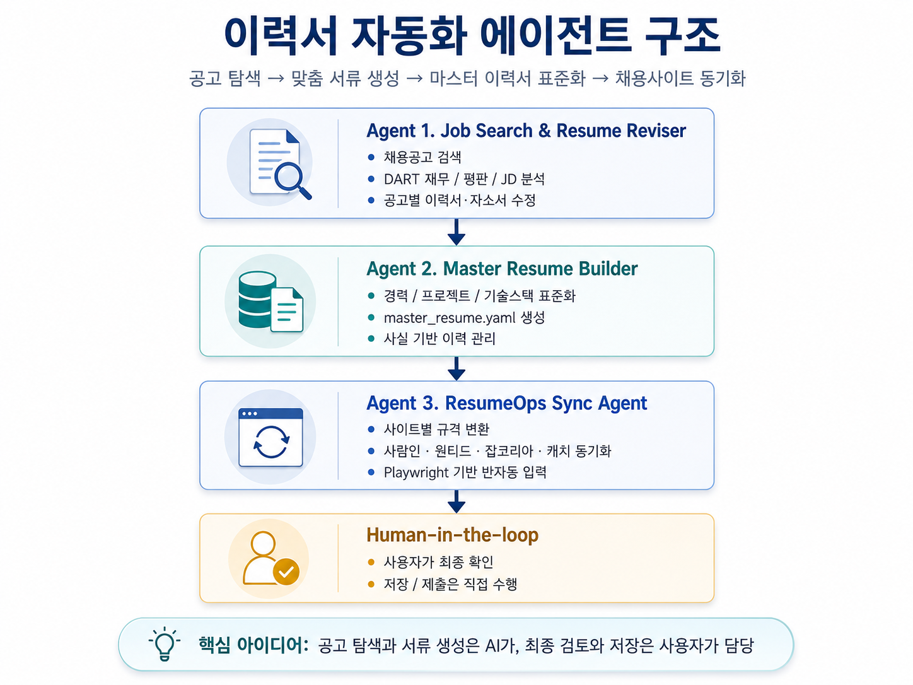

# 🚀 이력서 자동화 에이전트: AI 커리어 어시스턴트 (LangGraph + GPT/Gemini)

이 프로젝트는 **LangGraph** 기반의 전문 에이전트들이 **공고 탐색 → 맞춤 서류 생성 → 마스터 이력서 표준화 → 채용사이트 동기화**의 흐름을 처리하는 이력서 자동화 시스템입니다.

**핵심 아이디어:** 공고 탐색과 서류 생성은 AI가 담당하고, **최종 검토와 저장·제출은 사용자가 직접** 수행합니다(Human-in-the-loop). AI는 사실에 근거한 초안까지만 만들고, 사람의 확인 없이 대신 제출하지 않습니다.

## 🏗️ 시스템 아키텍처



역할 분리(Separation of Concerns)를 통해 각 단계의 전문성과 정확도를 높였습니다. 아래 표의 **구현 상태**는 과장 없이 현재 코드 기준으로 표기합니다.

### 1. 🔍 Agent 1 — Job Search & Resume Reviser (`job_hunter.py`, `revise_resume.py`)
*   **역할**: 채용공고 검색 · DART 재무/평판/JD 분석 · 공고별 이력서·자소서 수정.
*   **구현 상태**: **실행 가능.** 공고 검색·기업 분석·리포트 저장 루프가 동작합니다(GPT 경로 검증 완료). 이력서/자소서 수정은 `revise_resume.py`에 구현.
*   **데이터 출처 현황 (사실성 관련 중요)**:
    *   **승인된 채용 API는 공공기관 ALIO 하나뿐**입니다(`.env`의 `opendata_alio`). 사람인·잡플래닛 등 민간 채용 API는 개인 신청 승인이 나지 않습니다. (ALIO 도구화는 예정, 현재 `job_hunter.py`는 미사용)
    *   민간 사이트(원티드·사람인·잡코리아·점핏·캐치 등)는 별도 API가 아니라 **Tavily 웹 검색 + `site:` 필터**로 best-effort 수집하며, 누락·중복·신선도(마감 여부) 한계가 있습니다.
    *   재무(DART)·평판(잡플래닛) 정보도 공식 API 결합이 아니라 Tavily 검색 결과 요약이므로, 수치는 **참고용**이며 단정하지 않습니다.
*   **산출물**: 선별된 정예 공고 리포트(`result/job_search_results.md`), 맞춤 자소서·이력서 전략(`result/revised/`).

### 2. 🗃️ Agent 2 — Master Resume Builder
*   **역할**: 경력/프로젝트/기술스택을 표준화하여 `master_resume.yaml` 단일 원천으로 관리(사실 기반 이력 관리).
*   **구현 상태**: **설계 단계.** 아직 전용 구현 파일이 없습니다. `knowledge/`의 사실 데이터를 정규화한 마스터 이력서를 만드는 것이 목표입니다.
*   **의도**: Agent 1이 공고별로 이력서를 수정할 때, 매번 원본을 다시 파싱하지 않고 이 표준 이력서를 근거(single source of truth)로 사용합니다.

### 3. 🔁 Agent 3 — ResumeOps Sync Agent (`site_resume_agent.py`, `site_form_mapper.py`, `site_form_connector.py`)
*   **역할**: 사이트별 규격 변환 · 사람인/원티드/잡코리아/캐치 동기화 · Playwright 기반 **반자동** 입력.
*   **구현 상태**: **부분 구현.** 사이트별 입력 패키지 생성과 폼 요소(selector) 추출·연결까지 동작합니다. **실제 로그인·폼 자동 입력·저장 클릭은 수행하지 않습니다** — 브라우저는 열어주되 로그인과 최종 저장은 사용자가 합니다.
    *   `site_resume_agent.py`: 이력 데이터를 사이트 양식에 맞춘 JSON/Markdown 패키지로 변환 → `result/site_resumes/`.
    *   `site_form_mapper.py`: 채용 사이트 입력 화면에서 `input`/`textarea`/`select`/버튼/라벨/selector 추출.
    *   `site_form_connector.py`: 패키지 필드와 실제 DOM selector 후보를 연결한 매핑 계획 생성.
*   **가드레일**: 연락처·주소·희망연봉 등 민감 필드는 사용자가 명시한 경우에만 채우고, `knowledge/`와 사용자가 제공한 사실에 없는 경력·수치·자격은 만들지 않습니다.

### 👤 Human-in-the-loop
*   사용자가 최종 확인하고, **저장/제출은 직접 수행**합니다. AI는 대신 제출 버튼을 누르지 않습니다.

#### Agent 3 실행 예시
```bash
# 정적 폼 스냅샷 (공개 URL·로그인 리다이렉트·접근 가능 여부)
python site_form_mapper.py --mode static

# 브라우저를 열어 직접 로그인 후 폼 요소를 JSON으로 저장 (사용자가 로그인)
.\.venv\Scripts\python.exe site_form_mapper.py --mode playwright --sites wanted --headed --wait-seconds 120

# 이력서 패키지 필드 ↔ DOM selector 후보 연결
python site_form_connector.py --package result/site_resumes/example.json --form-map result/site_form_maps/wanted_playwright_xxx.json
```

---

## 🛡️ 가드레일 (Guardrails) 및 환각 방지 전략

AI 에이전트가 흔히 저지르는 '없는 경력 지어내기'나 '영혼 없는 찬양'을 방지하기 위해 다음과 같은 장치를 마련했습니다.

### 1. `/knowledge` (나의 사실적 데이터베이스)
*   에이전트는 이 폴더 내의 파일들(`resume.txt`, `career.docx` 등)에 명시된 프로젝트, 기술, 경력 사항만 사용할 수 있습니다.
*   이력서에 없는 기술이나 경력이 JD에 있다고 해서 이를 거짓으로 추가하지 않도록 프롬프트 수준에서 엄격히 통제됩니다.

### 2. `/more_info` (나의 커리어 철학 및 가이드라인)
*   **작성 스타일**: "간결하고 데이터 중심적인 문체", "인사이트 도출을 강조하는 서술" 등 사용자가 원하는 톤앤매너를 설정합니다.
*   **가치관 주입**: 단순한 기업 찬양 대신, 사용자가 평소 중요하게 생각하는 직업적 가치(예: '효율적인 협업의 즐거움', '기술적 난제 해결의 쾌감')를 자소서의 메인 테마로 활용하게 합니다.

---

## 🤖 에이전트 작업 지침

서버와 로컬 Claude/Codex가 같은 작업 기준을 공유하도록 루트 Markdown 문서를 추적합니다.

*   `AGENTS.md`: 강제 규칙, 실행 경계, 세션 시작 규칙
*   `skills.md`: 기술 철학, 에이전트 설계 기준, 권장 워크플로우
*   `process.md`: 현재 운용 절차와 반복 작업 방식
*   `history.md`: 의미 있는 변경 이력
*   `conversation_l2_cache.md`: 최근 사용자 의도와 제약의 압축 캐시
*   `CLAUDE.md`: 로컬 Claude 계열 도구용 진입 문서

`.agents/`, `.codex/`, `.claude/settings.local.json`은 로컬 스킬과 플러그인 설정이므로 Git에 포함하지 않습니다.

---

## 🧪 문서 파싱 및 MCP 연동 (`kordoc`)

본 프로젝트는 **kordoc**을 활용하여 HWP, PDF, DOCX 등 다양한 형식의 문서를 마크다운으로 변환하여 학습합니다.

### 1. kordoc 설정 (MCP 연동)
AI 에이전트(Gemini CLI, Cursor 등)가 문서를 직접 읽을 수 있게 하려면 다음 명령어를 실행하세요.
```bash
npx -y kordoc@latest setup
```
*   설정 과정에서 사용하는 에이전트(예: Gemini CLI 또는 VS Code)를 선택하면 해당 도구의 설정 파일이 자동으로 업데이트됩니다.

### 2. Resume Reviser에서의 활용
`revise_resume.py`는 내부적으로 `kordoc` 엔진을 사용하여 `knowledge/` 폴더 내의 모든 문서를 실시간으로 파싱합니다. 따라서 사용자는 파일을 별도로 변환할 필요 없이 원본 파일을 그대로 넣어두면 됩니다.

---

## 🚀 사용 방법

에이전트 실행 시 모델을 선택합니다.

*   **Gemini 2.0 Flash**: 무료 티어. `agent.py`에서 `gemini-1.5-pro`가 2025-09-24 단종됨에 따라 교체됨. `GEMINI_MODEL` 환경변수로 다른 모델 지정 가능. (무료 티어 quota 소진 시 429 발생 가능 — 계정/결제 확인)
*   **GPT-5-mini**: 논리적인 문장 구성과 JD-이력서 간의 세밀한 매칭 능력이 뛰어납니다. (추천, 실행 검증 완료)

```bash
uv run job_hunter.py     # Agent 1: 공고 탐색·분석
uv run revise_resume.py  # 이력서/자소서 맞춤화
```

---

## 📂 주요 결과물
*   `result/job_search_results.md`: 통합 공고 분석 리포트
*   `result/revised/{기업명}_cover_letter.md`: 맞춤형 자기소개서
*   `result/revised/{기업명}_resume_strategy.md`: 이력서 보완 및 면접 전략 가이드
*   `result/site_resumes/{기업명}_{사이트}.json`: 사이트별 이력서 입력 패키지
*   `result/site_resumes/{기업명}_{사이트}.md`: 사람이 검수하기 쉬운 사이트별 저장 초안
*   `result/site_form_maps/*.json`: 채용 사이트 페이지에서 추출한 폼/버튼 selector 스냅샷
*   `result/site_field_mappings/*.json`: 이력서 패키지 필드와 DOM selector 후보의 연결 계획

---

## 🧪 테스트 및 프로토타이핑 (`temp_search.py`)
*   **용도**: 에이전트를 실행하기 전, Tavily 검색 엔진의 쿼리 결과가 어떻게 나오는지 원시 데이터(Raw Data)를 미리 확인하는 테스트 스크립트입니다.
*   **사용 시점**: 검색 키워드나 사이트 필터(`site:wanted.co.kr` 등)를 수정했을 때, API 비용을 절약하며 검색 품질을 검증하고 싶을 때 사용합니다.
*   **실행**: `uv run temp_search.py`
