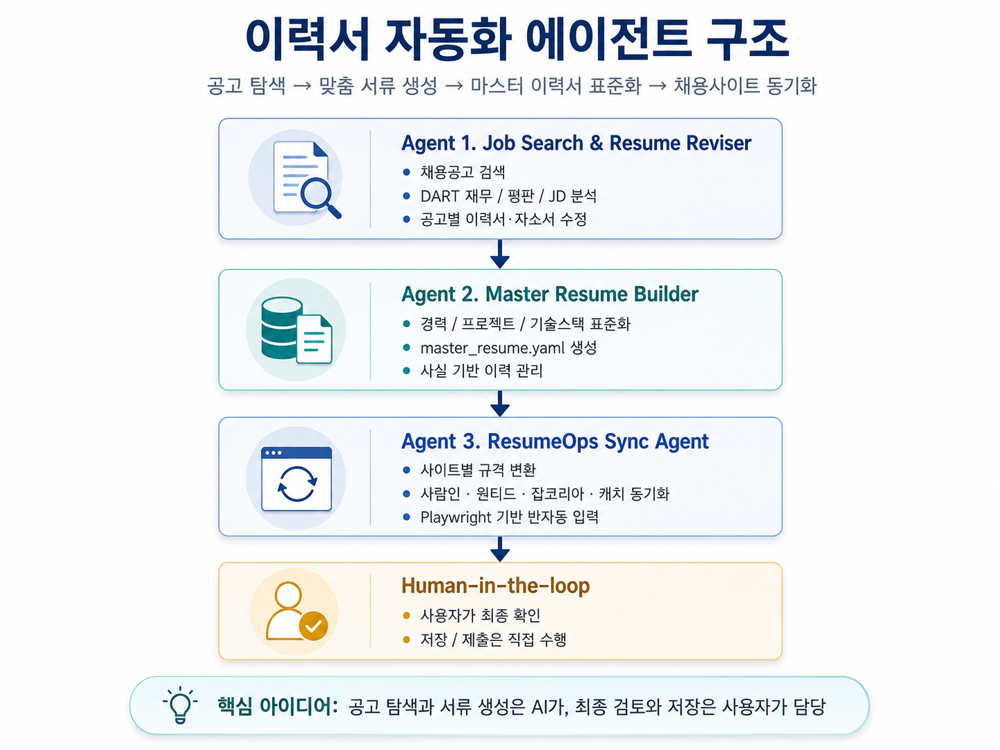

# 🚀 이력서 자동화 에이전트: AI 커리어 어시스턴트 (LangGraph + GPT/Gemini)

이 프로젝트는 **LangGraph** 기반의 전문 에이전트들이 **공고 탐색 → 맞춤 서류 생성 → 마스터 이력서 표준화 → 채용사이트 동기화**의 흐름을 처리하는 이력서 자동화 시스템입니다.

**핵심 아이디어:** 기본 정리·변환·입력은 LLM 없이 수행하고 AI 분석/문장 생성은 선택합니다. **최종 검토와 제출은 사용자**가 담당합니다(Human-in-the-loop). 기존 이력서 저장은 UI에서 선택 항목과 저장 동작을 검수·승인한 뒤 실행할 수 있으며, 지원서 제출은 자동 실행하지 않습니다.

## UI 빠른 실행

### 주 기능: 채용 플랫폼 이력서 전환·저장

**플랫폼 이력서 전환**에서 캐치·잡코리아·사람인·원티드·인크루트 중 원하는 곳을 여러 개 체크하고 진행합니다. 공통 원본 또는 검수한 정리 결과를 선택합니다. 회사 자체 사이트의 target/폼/연결 JSON은 접힌 **고급 변환**에 보존하며, 5개 플랫폼 흐름에서는 JSON 준비가 필요하지 않습니다.

공개 웹은 본인 PC 연결 도구로 이력서와 선택 플랫폼만 전달합니다. 로컬 창에서 출처·내용을 승인하고 재검수·반영한 뒤 진행하면 선택 사이트 브라우저를 엽니다. 로그인·MFA는 직접 수행하고, 전용 `result/browser_profiles/<site>/` 세션은 사이트가 허용하는 동안 재사용합니다. 일반 Chrome 쿠키/비밀번호 추출이나 웹 세션 업로드는 하지 않습니다. 사용자 PC의 세션 파일도 민감한 인증 자료이므로 공용 PC 사용을 피하고 로그아웃·삭제를 관리해야 합니다.

사이트별 **검수·저장**에서 명확한 단일 항목명 일치/길이/선택값을 통과한 연결, 기존 성공 연결과 단일 저장 버튼을 제안합니다. 모호한 항목이나 반복 행은 추측하지 않습니다. 별도 승인 후 기존 선택 항목 입력·저장·재접속 확인을 수행하며, 새 경력 행 생성·첨부·공개 설정·지원서 제출은 하지 않습니다. 실제 5개 사이트 전체 양식의 저장 검증이 완료됐다는 의미는 아닙니다.

### 별도 공개 배포와 기존 환경 보존

기존 로컬 UI/Cloudflare 공유는 그대로 유지합니다. `python -m job_agent.hosting.build --backup`으로 **개인 환경의 로컬 백업**과 **키·이력서·세션 없는 Vercel 배포본**을 분리해 생성합니다. 공개 화면은 공통 이력서와 현재 결과만 탭 메모리에 보관하고, 실행 자료만 저장 없는 Python 함수로 처리합니다. 새로고침 전 다운로드가 필요하며 사이트 로그인·MFA·저장은 각 사용자의 본인 PC 연결 도구에서 수행합니다. Supabase는 아직 필요하지 않아 연결하지 않았습니다. 개인 API는 공개 배포에서 선택·호출할 수 없습니다. [PowerShell/Linux 실행·환경 복사·Vercel/GitHub 배포·제한](docs/public_hosting.md)을 참고하세요.

첫 화면의 **처음 사용하기**에서 서비스 목적과 작업 흐름을 확인합니다. **공고 탐색은 독립 기능**으로 이력서 없이 사용할 수 있고, **공통 이력서 작성 → 이력서 정리 → 결과 검수 → 회사 양식 변환**은 이어지는 작업입니다. 원본을 바로 변환해도 됩니다. 각 단계의 버튼으로 해당 화면을 열고, **사용 예시**에서 공통 이력서·공고 탐색·이력서 정리·회사 양식·사이트 저장의 입력/확인 순서를 볼 수 있습니다. **결과 기록·외부 공유 링크 메뉴는 제거**했으며, 공개 웹은 이전 실행 결과 목록을 보관하지 않습니다. 고정 배포 주소로 직접 접속합니다. 기존 로컬 파일과 CLI 기록·공유 기능은 삭제하지 않습니다. 각 작업 화면의 도움말 아이콘은 해당 예시로 바로 연결됩니다. 가상 공고/JD 넣기는 입력만 채우고 자동 실행·공통 이력서 덮어쓰기·사이트 저장은 하지 않습니다. `/#examples/search`처럼 예시 주소를 직접 열 수 있습니다.

이력서는 **공통 이력서** 한 곳에서 작성합니다. 기본 **Word(.docx) 양식 다운로드·업로드**, Markdown·JSON 선택과 화면 직접 입력을 지원합니다. 경력·기술·프로젝트·학력·자격증·수상·어학·교육·활동·논문·특허·링크는 **추가 버튼으로 항목마다** 등록합니다. 회사명·재직 기간·재직 중, 자격번호·발급기관·취득일 등을 각각 입력하며 키워드 한 칸을 임의로 나누지 않습니다. 내부 규격은 `job-agent.resume/v1`이며 변경·가져오기 후 검수해야 실행할 수 있습니다. **이력서 정리 → 결과 검수 → 정리 결과로 회사 양식 변환**으로 이어지고 공통 원본은 보존합니다. [항목·양식 작성·검수 절차](docs/resume_input.md)를 참고하세요. 개인 자료는 공개 배포/Git에 포함하지 않습니다.

`resum/` 폴더에서 실행합니다. 기본 모드는 **LLM 없음**이며 모델/API 키 없이 공고 JSON 정렬, DOCX 원문 읽기·문단 재배열, 검수된 회사 양식 변환과 결과 기록을 사용할 수 있습니다. OpenAI/Gemini/자체 LLM은 화면에서 선택합니다. AI는 API 사용 동의를 체크하고 실행할 때만 호출됩니다. 공공기관/ALIO 연동은 보류합니다.

### 다운로드·사이트 저장

**표준 입력과 사이트 저장:** **빈 양식**·**작성본 다운로드**는 선택한 DOCX·Markdown·JSON으로 내려받습니다. Word 표의 제목·항목명을 유지하고 값 칸에 작성한 뒤 **표준 이력서 업로드**로 가져옵니다. 일반 DOCX는 원문만 소개 칸에 보존하며 자동 분류하지 않습니다. **회사 양식 변환** 화면에서는 전용 브라우저 로그인/기존 편집 화면 → 현재 화면 확인 → 항목·목적지·저장 동작 검수 → 동의 → **선택 항목 입력·저장** 순서입니다. 성공한 연결은 본인 PC에 저장하며 사이트별로 순서대로 처리합니다. 내부 항목 추가와 실제 포털의 반복 행 추가는 별개이며 후자는 아직 자동화하지 않습니다.

포털의 일반 Chrome 로그인과 전용 Playwright 프로필은 별개입니다. 원티드는 자동저장, 나머지는 화면에서 수집한 저장 전용 버튼을 선택합니다. 새로고침 후 선택 값이 유지될 때만 저장 확인 완료로 표시합니다. 섹션 편집을 다시 열어야 하거나 저장 확인 팝업/custom UI가 있는 경우 수동 확인이 필요할 수 있습니다. **실제 5개 포털 저장의 종단 검증은 아직 하지 않았으며**, 로컬 테스트 사이트에서 실행 흐름을 검증했습니다. 경력 항목 생성·파일 업로드·동의·공개 설정·지원서 제출은 실행하지 않습니다. 입력 전 선택 항목의 기존 값을 ignored `result/site_sync/`에 백업하고 불확실한 저장은 자동 재시도/원복하지 않습니다.

### PowerShell (Windows)

```powershell
cd "C:\Users\jun99\OneDrive - 계명대학교\바탕 화면\Analysis\toy_agent_project\resum"
code .  # 선택: VS Code로 폴더 열기
uv sync --extra browser
uv run job-agent ui
```

### Linux / Bash

```bash
cd /path/to/toy_agent_project/resum
code .  # 선택: VS Code로 폴더 열기
uv sync --extra browser
uv run job-agent ui
```

브라우저가 자동으로 열립니다. 기본 주소는 `http://127.0.0.1:8765`이고 사용 중이면 다음 빈 포트를 사용합니다. **실제 주소는 터미널 출력에서 확인**하세요. 종료는 `Ctrl+C`입니다. 원격 Linux/WSL에서는 자동 열기 대신 아래처럼 실행합니다. 외부 접속은 아래의 인증된 Cloudflare 공유를 사용하세요.

```bash
uv run job-agent ui --no-open --port 8765
```

기존 가상환경에서도 실행할 수 있습니다(의존성 설치 후).

```powershell
.\.venv\Scripts\python.exe -m job_agent ui
```

```bash
./.venv/bin/python -m job_agent ui
```

### 화면별 작업과 비용

| 화면 | 기본 모드 | 선택형 AI / 주의점 |
| --- | --- | --- |
| 공고 탐색 | 직접 입력한 JSON의 제외 키워드 필터·키워드 일치 정렬·URL 중복 제거 | 웹 검색은 별도 Tavily API 동의/키 필요. AI는 같은 수집 결과를 한 번 분석. 검색 snippet의 지역·경력·마감은 미검증 |
| 이력서 정리 | 검수·저장된 공통 이력서의 원문 문단 재배열 | AI 선택 시 입력 원문/JD를 외부 모델로 전송하여 초안 생성. 결과는 원문 대조 검수 필요 |
| 회사 양식 변환 | 공통 이력서와 target/form-map 및 선택 bindings JSON으로 기존 `ApplicationAdapter` 실행 | 별도 사이트 저장 영역에서 5개 포털의 화면 수집·승인된 기존 필드 입력·저장·재접속 확인. 회사 자체 URL의 실제 입력은 기존 CLI 사용 |
| 결과 기록 | 실행 결과 재열람·JSON 다운로드·텍스트 복사 | 개인 내용은 `result/ui_runs/`에 로컬 저장, Git 제외. 공유를 켜면 인증한 방문자도 열람 가능 |

OpenAI/Gemini 사용 시 모델 ID는 `OPENAI_MODEL`/`GEMINI_MODEL`을 초기값으로 표시하고 화면에서 해당 실행만 변경할 수 있습니다. 해당 키는 서버의 환경변수/로컬 `.env`에서 읽으며 화면에 표시하거나 입력받지 않습니다. 키 설정 여부와 실제 모델 접근 가능 여부는 다릅니다. OpenAI 모델은 기존 엔진의 Responses API/추론 설정과 호환되어야 합니다. 자체 LLM 연결 키는 아래 별도 설정을 사용합니다. 웹 검색 키는 `TAVILY_API_KEY`입니다. `.env` 변경 후 서버를 다시 실행하세요.

AI 결과와 기본 결과를 탭으로 비교하고 처리 시간·공급자가 반환한 토큰 사용량을 확인합니다. **자동 품질 평가나 금액 계산은 아직 없으며**, 토큰 사용량이 없으면 추정하지 않습니다. API 요청 실패 시 기본 결과를 보존하고 오류를 표시합니다. 자동 재호출/모델 전환은 하지 않습니다. 기본 정렬은 의미 적합도나 합격 확률이 아닙니다. 무료 사이트 스크래퍼를 새로 구현한 것이 아니라 **검색 API와 LLM 조정을 분리한 UI 경로**입니다. 기존 `job-search`/`revise`/`site-package` CLI의 LLM 흐름도 유지됩니다.

서버는 `127.0.0.1`에만 바인딩하고 요청 origin/host와 세션 토큰을 검사합니다. 정해진 UI 파일만 제공하며 임의 파일/명령 실행을 허용하지 않습니다. 아이콘은 로컬에 포함한 Lucide 0.468.0을 사용하며 라이선스는 `job_agent/ui/static/lucide-LICENSE`에 보존했습니다.

### 자체 LLM 연결

PC/서버의 로컬 화면에서 **모델 연결**을 열고 API 기본 URL(IP·포트 포함), 모델 ID, 필요한 경우 해당 서버의 API 키를 입력합니다. 연결 동의 후 **연결 적용**, 실행 화면에서 **AI · 자체 LLM**을 선택합니다. **모델 목록**은 서버의 `/models`를 조회합니다. 입력은 UI의 선택형 분석에 적용되며 기존 에이전트 CLI의 모델 설정을 바꾸지 않습니다.

| 서버 | API 기본 URL 예시 |
| --- | --- |
| Ollama | `http://127.0.0.1:11434/v1` |
| LM Studio | `http://127.0.0.1:1234/v1` |
| vLLM 또는 내부 서버 | `http://192.168.0.10:8000/v1` |
| 인증된 내부 API | `https://llm.example.com/v1` |

서버는 **OpenAI 호환 `/chat/completions`**를 제공해야 합니다([Ollama 공식 안내](https://docs.ollama.com/api/openai-compatibility)). 다른 API 규격은 호환 프록시가 필요합니다. 모델 서버는 미리 실행해야 하며, GGUF/모델 폴더를 앱이 직접 로드하지 않습니다. 경로는 서버가 그 경로를 모델 ID로 등록한 경우에만 사용합니다. 주소의 `127.0.0.1`은 휴대폰이 아니라 **이 앱을 실행하는 PC/서버**입니다.

연결 설정과 키는 서버 메모리에만 유지하고 재시작 시 다시 입력합니다. 키를 조회 응답/결과 파일에 저장하지 않으며 OpenAI 키를 대신 사용하지 않습니다. 빈 키로 적용하면 기존 연결 키도 제거됩니다. 실행별 AI 전송 동의가 필요하고 실패 시 기본 결과를 유지합니다. 원격 서버에 연결하면 이력서/JD가 해당 서버로 전송되므로 신뢰하는 주소만 사용하고, 외부 네트워크에서는 HTTPS를 사용하세요. 실제 보유 모델의 생성 품질은 별도 검증이 필요합니다.

### 플랫폼 로그인·2차 인증 연결

웹의 **플랫폼 연결** 메뉴에서 캐치·잡코리아·사람인·원티드·인크루트를 선택하고 4단계를 따라 진행합니다. 웹 서비스에 계정 비밀번호/OTP/쿠키를 맡기는 방식이 아니라 **본인 PC의 전용 브라우저**를 이용합니다. 일반 Chrome에 이미 로그인했어도 전용 프로필은 별도로 로그인해야 할 수 있습니다.

1. 웹에서 **내 PC 연결 도구 다운로드**를 눌러 코드 전용 ZIP을 받고 본인 PC에 압축을 풉니다. `.env`, 이력서 원문/결과, 로그인 프로필, 개인 설정은 포함하지 않습니다. [uv 설치](https://docs.astral.sh/uv/getting-started/installation/) 후 압축을 푼 폴더에서 실행합니다.
2. 아래 명령의 웹 주소를 현재 공유 페이지에 표시되는 주소로 바꿉니다. Linux/PowerShell에서 동일하며 실제 포트는 터미널 출력으로 확인합니다.

```sh
uv sync --extra browser
uv run job-agent ui --port 8780 --handoff-origin 'https://현재-공유-호스트'
# Linux 또는 설치된 Chrome/Edge가 없을 때
uv run playwright install chromium
```

3. 공개 웹의 로컬 주소 입력 → 이력서 전달 동의 → **내 PC 연결 창 열기**를 누릅니다. 새 로컬 창에서 출처·이력서를 확인하고 별도로 가져오기를 승인합니다. 이력서는 자동 저장/사이트 입력되지 않으며 다시 검수·저장합니다. 출처는 CLI에서 정확히 한 origin만 허용, 메시지는 opener/source/origin과 요청 ID를 확인합니다. 로컬 API 토큰·쿠키·계정 정보는 웹으로 돌려보내지 않습니다.
4. 로컬 창에서 **로그인·편집 화면 열기** → 사이트 직접 로그인 → 문자/앱/PASS/소셜 로그인/보안 문자 직접 완료 → 기존 이력서 수정 화면으로 이동합니다. **인증·편집 상태 확인**은 흔한 로그인/MFA/보안 확인 표시를 점검할 뿐 인증 성공을 보장하지 않습니다. 인증 화면에서는 필드 수집·입력을 차단합니다. **현재 편집 화면 확인**으로 실제 항목과 저장 동작을 검수한 뒤 선택 항목 입력·저장을 실행합니다. 저장 후 재접속 readback만 성공 기준이며 지원서 제출은 하지 않습니다.

휴대폰만으로 이 로컬 PC 도구를 실행할 수는 없습니다. 본인 PC에서 연결하거나 표준 JSON을 내려받아 직접 사이트에 반영하세요. 브라우저가 연결 창을 차단하면 팝업·실행 포트·CLI의 허용 웹 주소를 확인하고, 보안 경고는 무시하지 않습니다. 연결이 제한되면 JSON 다운로드→로컬 UI 업로드로 진행할 수 있습니다. 회사 자체 채용 사이트는 현재 양식 변환 후 수동 로그인/입력/저장이며 이 연결의 5개 플랫폼 자동 저장과 구분합니다.

본인 PC의 `result/resume_profile/`, `result/ui_runs/`, `result/browser_profiles/<site>/`, `result/site_sync/`에는 이력서·로그인 프로필·실행 기록이 남을 수 있습니다. 종료 시 사이트에서 로그아웃하고 브라우저를 닫으며 공용 PC는 피하세요. [Playwright 인증 안내](https://playwright.dev/docs/auth)처럼 세션 상태는 계정을 대신 사용할 수 있는 민감 정보라 공개 웹에 업로드하거나 전달하지 않습니다. 외부 웹의 메모리 전용 보관과 본인 PC의 로컬 보관 정책은 별개입니다.

### 공개 웹 공유

외부 방문자 화면에는 처리 모드 선택창과 `LLM 없음` 표시를 포함한 모델 설정을 노출하지 않습니다. 결과/기록에도 모델명·토큰 정보를 표시하지 않습니다. 실행 권한은 서버 CLI 정책으로만 정하며 이 화면 변경으로 개인 API 사용을 허용하지 않습니다. 로컬 운영자 화면은 기존 모델 설정과 진단 정보를 유지합니다.

공식 `cloudflared`를 설치한 뒤 UI를 실행합니다([공식 다운로드](https://developers.cloudflare.com/tunnel/downloads/)). Windows에서 프로젝트 내부에 휴대용 실행 파일을 두는 예시:

```powershell
New-Item -ItemType Directory -Force result/tools
Invoke-WebRequest https://github.com/cloudflare/cloudflared/releases/latest/download/cloudflared-windows-amd64.exe -OutFile result/tools/cloudflared.exe
$env:CLOUDFLARED_PATH = (Resolve-Path result/tools/cloudflared.exe).Path
uv run job-agent ui
```

Linux는 공식 배포 패키지로 `cloudflared`를 PATH에 설치한 뒤 `uv run job-agent ui --no-open`을 실행합니다. 별도 설치 경로는 다음처럼 지정할 수 있습니다.

```bash
CLOUDFLARED_PATH=/path/to/cloudflared uv run job-agent ui --no-open
```

코드 입력 없이 공개 체험을 제공하려면 아래 명령으로 실행합니다(Linux/PowerShell 동일).

```sh
uv run job-agent ui --public-demo
```

로컬 UI의 **외부 공유 링크** 탭에서 공유 동의 → **링크 생성** → 복사 아이콘을 누릅니다. 휴대폰은 HTTPS 링크만 열면 됩니다. 코드 입력·코드 표시·코드 복사 UI는 없습니다. 브라우저별 빈 임시 작업 공간을 제공하며 PC 운영자의 기존 이력서·결과·로그인된 포털 세션은 노출하지 않습니다. 본인 표준 이력서 JSON 업로드/작성/검수, 직접 입력 공고 정리, 이력서 재배열, 회사 양식 변환과 결과 다운로드를 사용할 수 있습니다. DOCX 추출·실제 사이트 저장과 운영자 모델/검색 API는 공개 체험에서 차단합니다.

공개 체험은 **메모리 전용**입니다. 이력서·결과를 앱의 서버 파일/DB/내용 로그에 기록하지 않습니다. 세션 시작 1시간 후 접근이 만료되고 주기 작업이 60초 이내 메모리 참조를 정리합니다. 하단 **임시 데이터 삭제**로 이력서/기록/작성 중 입력을 비우거나, 서버 정상 종료로 세션을 정리할 수 있습니다. 탭 닫기·쿠키 삭제만으로 서버 메모리가 즉시 지워지지는 않습니다. 동시 32개 공간, 결과 기록은 세션별 최근 20개/약 10MB 범위에서만 유지합니다.

사용자 기기의 자동 localStorage/IndexedDB 저장은 하지 않으며 보관은 이력서/결과 **다운로드**로 선택합니다. 다운로드 파일·클립보드는 사용자가 관리합니다. 서버 요청 처리와 세션 메모리 사용은 여전히 존재하므로 완전한 기기 내 처리라고 표현하지 않습니다. OS 스왑/충돌 덤프와 Cloudflare 네트워크 기록까지 앱이 통제하지는 못합니다. 기존 운영자 로컬 공간은 파일 저장 방식 그대로이며 공개 체험과 분리됩니다. `--public-demo`와 운영자 자원 허용 플래그의 병용은 시작 시 거부합니다.

모든 페이지 최하단 **개인정보 처리 안내**에서 목적·입력 항목·보유/삭제·쿠키·전송 경로·다운로드 책임을 확인할 수 있습니다. 문의처는 서버 환경변수로 등록합니다.

```powershell
$env:RESUME_PRIVACY_CONTACT = '공개용 문의 이메일'
uv run job-agent ui --public-demo
```

```bash
RESUME_PRIVACY_CONTACT='공개용 문의 이메일' uv run job-agent ui --public-demo
```

문의처 미등록 상태에서는 미등록으로 표시합니다. 운영자 실명/공개 연락처를 임의로 채우지 않습니다. 현재 안내는 구현된 처리 방식의 설명이지 정식 법률 검토나 준수 인증이 아닙니다. 실제 서비스화 전 운영 주체·문의처·적법한 처리 근거와 [개인정보 처리방침 항목](https://m.privacy.go.kr/front/contents/cntntsView.do?contsNo=319), [Cloudflare 처리 정책](https://www.cloudflare.com/privacypolicy/)을 검토해야 합니다. 계정 기반 영구 저장·사용자별 BYOK는 미지원입니다.

**외부 허용 모델은 서버 실행 명령으로만 설정합니다.** 외부/로컬 공유 화면의 ON/OFF와 소유자 코드는 제거했습니다. 기본 실행은 외부 LLM 없음만 허용하고 운영자의 OpenAI·Gemini·자체 LLM·Tavily API를 외부에서 사용하지 못하게 차단합니다. 허용하지 않은 공급자는 선택지/키 설정 상태/모델 ID에서 제외하고 직접 요청도 차단합니다.

외부 페이지는 서버가 HTML을 반환하기 전부터 비허용 모델과 검색 API 선택지를 제거합니다. 방문자 화면에는 과금 동의를 표시하지 않으며, AI 사용이 명시 허용된 경우에도 자료 전송 동의만 받습니다. 방문자의 동의는 운영자 자원 사용 정책을 바꾸지 못합니다.

```powershell
# 기본: 외부 LLM과 개인 검색 API 모두 차단
uv run job-agent ui

# 운영자가 명시적으로 자체 서버 사용을 허용할 경우
uv run job-agent ui --remote-providers none custom

# 개인 유료 API까지 허용하려는 경우에만 비용 허용 플래그 추가
uv run job-agent ui --remote-providers none custom openai gemini --allow-remote-paid-api

# 개인 Tavily 검색 API의 외부 사용도 별도 명시 허용
uv run job-agent ui --allow-remote-web-search
```

Linux에서도 같은 실행 옵션을 사용합니다. 설정 변경은 명령을 바꿔 서버를 재시작하며 기존 터널/로그인 세션도 종료됩니다. OpenAI·Gemini 외부 허용에 비용 플래그가 없으면 시작 자체를 거부합니다. 자체 모델은 로컬 소유자가 먼저 연결해야 합니다. 원격 접속자는 모델 정책·연결 주소·키·터널 설정을 바꿀 수 없습니다. 외부 방문자가 자신의 키/모델을 등록하는 사용자별 격리된 BYOK 서비스는 아직 지원하지 않습니다.

위 모델 허용 명령은 `--public-demo`가 아닌 인증된 개인 작업 공간 공유용입니다. 기존 개인 공유는 로그인 보호를 유지하며 인증 정보는 로컬 관리 API에서만 조회합니다. 개인 공간을 무인증으로 공개하지 마세요. HTTPS 트래픽은 Cloudflare를 통과합니다. 사이트 자동화는 PC의 전용 브라우저와 로그인 상태를 사용하며 공개 체험에서는 실행되지 않습니다.

[Quick Tunnel](https://developers.cloudflare.com/tunnel/get-started/quick-tunnels/)은 계정/도메인 없이 무료 임시 주소를 생성하는 개발·시험용 방식입니다. **노트북/서버가 켜져 있고 인터넷과 UI가 실행 중일 때만** 접속할 수 있으며 재생성하면 주소가 바뀝니다. 고정 주소/상시 운영에는 별도 Named Tunnel·도메인 설정이 필요하고 현재 UI는 이를 자동 구성하지 않습니다. 가용성 보장이나 SSE 지원은 없으며 동시 요청 제한이 있습니다.

## 🏗️ 시스템 아키텍처



역할 분리(Separation of Concerns)를 통해 각 단계의 전문성과 정확도를 높였습니다. 아래 표의 **구현 상태**는 과장 없이 현재 코드 기준으로 표기합니다.

### 1. 🔍 Agent 1 — Job Search & Resume Reviser (`job_agent/agents/job_hunter.py`, `job_agent/agents/resume_reviser.py`)
*   **역할**: 채용공고 검색 · DART 재무/평판/JD 분석 · 공고별 이력서·자소서 수정.
*   **구현 상태**: **실행 가능.** 공고 검색·기업 분석·리포트 저장 루프의 과거 GPT 실행 기록이 있습니다. GPT-6 Luna 전환의 검증 범위는 아래 모델 안내를 참고하세요. 이력서/자소서 수정은 `job_agent/agents/resume_reviser.py`에 구현.
*   **데이터 출처 현황 (사실성 관련 중요)**:
    *   현재 우선 대상은 **캐치·잡코리아·사람인·원티드·인크루트**입니다. ALIO 연동은 진행하지 않습니다. 이력서 편집은 로그인한 실제 화면의 DOM을 조사하여 Playwright로 연결합니다. 채용정보 조회 API와 개인 이력서 편집 기능은 별개입니다.
    *   민간 사이트(원티드·사람인·잡코리아·점핏·캐치 등)는 별도 API가 아니라 **Tavily 웹 검색 + `site:` 필터**로 best-effort 수집하며, 누락·중복·신선도(마감 여부) 한계가 있습니다.
    *   재무(DART)·평판(잡플래닛) 정보도 공식 API 결합이 아니라 Tavily 검색 결과 요약이므로, 수치는 **참고용**이며 단정하지 않습니다.
*   **산출물**: 선별된 정예 공고 리포트(`result/job_search_results.md`), 맞춤 자소서·이력서 전략(`result/revised/`).

#### Agent 1 확장 방향: 지원 의사결정

목표는 직무 적합도뿐 아니라 **이 회사·팀에서 일할 이유, 경력 성장, 사업/재무 신호, 보상·근무 조건, 지원 전 확인할 질문**을 개인의 검수된 실제 경험과 연결하는 것입니다. 회사 정보와 개인 경험의 근거를 분리해 추적하고, 확인된 사실·추론·미확인을 구분합니다. 적합도 점수를 합격 확률로 표시하지 않습니다.

**현재는 확장 설계 단계입니다.** 기존 Hunter에는 고정된 검색 날짜, 검색 snippet 기반 마감 제외, 재무/평판 출처 소실 등의 한계가 있어 먼저 보완해야 합니다. 원문·활성 상태·필수/우대 요건·출처 계약을 확보한 뒤 심층 분석과 지원 이력으로 확장합니다. JobPT, JobA!, career-ops, ai-job-search 및 추가 오픈소스·서비스의 구현 비교, 재사용 후보와 라이선스 주의사항은 [Agent 1 조사 및 도입 계획](docs/agent1_landscape_2026-10-08.md)에 정리했습니다. 외부 코드 복사나 확장 기능의 실제 실행 검증은 아직 수행하지 않았습니다.

### 2. 🗃️ Agent 2 — Master Resume Builder
*   **역할**: 경력/프로젝트/기술스택을 표준화하여 `master_resume.yaml` 단일 원천으로 관리(사실 기반 이력 관리).
*   **구현 상태**: **부분 구현.** `job_agent/documents/source.py`로 원문을 추출하고, `job_agent/documents/library.py`로 명시 선택한 DOCX의 문단 근거를 연결한 검수 초안을 JSON/Markdown으로 컴파일합니다. 완전 자율 정규화·문장 사실성 판정은 아직 지원하지 않습니다.
*   **의도**: Agent 1이 공고별로 이력서를 수정할 때, 매번 원본을 다시 파싱하지 않고 이 표준 이력서를 근거(single source of truth)로 사용합니다.

### 3. 🔁 Agent 3 — ResumeOps Sync Agent (`job_agent/agents/site_resume.py`, `job_agent/browser/mapper.py`, `job_agent/browser/connector.py`, `job_agent/browser/filler.py`)
*   **역할**: 캐치/잡코리아/사람인/원티드/인크루트 양식 변환 · Playwright 기반 **반자동** 입력.
*   **구현 상태**: **부분 구현.** 입력 패키지 생성, DOM 추출·연결, 검수된 기존 텍스트 필드 입력 실행기가 있습니다. UI에는 명시 승인 후 저장·재접속 확인 실행기를 추가했고 실제 포털 저장의 종단 검증은 남아 있습니다. 로그인은 사용자가 합니다. 반복 항목 생성·태그·custom 선택 UI는 사이트별 구현이 추가로 필요합니다. 실제 계정 입력 범위와 과거 저장 검증 여부는 [작성 기록](docs/resume_authoring.md)에 구분했습니다.
    *   `job_agent/agents/site_resume.py`: 이력 데이터를 사이트 양식에 맞춘 JSON/Markdown 패키지로 변환 → `result/site_resumes/`.
    *   `job_agent/browser/mapper.py`: 채용 사이트 입력 화면에서 `input`/`textarea`/`select`/버튼/라벨/selector 추출.
    *   `job_agent/browser/connector.py`: 패키지 필드와 실제 DOM selector 후보를 연결한 매핑 계획 생성.
    *   `job_agent/browser/filler.py`: 개별 검수 표시가 있는 필드만 검증/입력. 자동 저장·제출 클릭은 없음.
*   **가드레일**: 연락처·주소·희망연봉 등 민감 필드는 사용자가 명시한 경우에만 채우고, `knowledge/`와 사용자가 제공한 사실에 없는 경력·수치·자격은 만들지 않습니다.

### 👤 Human-in-the-loop
*   사용자가 최종 확인하고 제출합니다. UI의 사이트 저장은 선택 항목·저장 동작을 승인한 뒤 실행하며, AI는 대신 제출 버튼을 누르지 않습니다. 기존 CLI의 최종 저장은 수동입니다.

#### Agent 3 실행 예시
```bash
# 정적 폼 스냅샷 (공개 URL·로그인 리다이렉트·접근 가능 여부)
python -m job_agent form-map --mode static

# 브라우저를 열어 직접 로그인 후 폼 요소를 JSON으로 저장 (사용자가 로그인)
uv sync --extra browser
.\.venv\Scripts\python.exe -m job_agent form-map --mode playwright --sites catch --headed --interactive

# 이력서 패키지 필드 ↔ DOM selector 후보 연결
python -m job_agent form-connect --package result/site_resumes/example.json --form-map result/site_form_maps/wanted_playwright_xxx.json

# 검수한 mapping 항목에 "approved": true 표시 후 실행 (기본은 검증만)
python -m job_agent form-fill --site wanted --package result/site_resumes/example.json --mapping result/site_field_mappings/example.json
# 실제 입력은 --apply 추가 후 터미널에서 APPLY 입력
```

기본 대상 순서는 캐치 → 잡코리아 → 사람인 → 원티드 → 인크루트입니다. `--interactive`에서는 로그인·편집 화면 이동 후 터미널에서 Enter를 누르면 해당 사이트의 열린 탭과 iframe을 수집합니다. 경력/프로젝트 추가 폼이나 팝업을 열고 다시 Enter를 눌러 여러 상태를 기록한 뒤 `q`로 종료합니다. 실제 화면에서 확인한 URL은 `--sites wanted --url <URL>`로 지정할 수 있습니다. 실제 화면 조사 결과는 [사이트별 관찰 기록](docs/site_form_observations.md)에 있습니다.

전용 로그인 프로필은 `result/browser_profiles/<site>/`, 스냅샷은 `result/site_form_maps/`에 보관하며 Git에서 제외합니다. 평소 Chrome 프로필과 별개라 전용 브라우저에서는 첫 로그인이 필요합니다. 입력값 미리보기는 기본 제외이며 `--include-values`로 선택할 수 있습니다. 비밀번호와 hidden 입력값은 항상 제외합니다. 셀렉터 후보는 중복 대상·동점·글자수 초과를 표시하는 검토용 계획이며 자동 저장·지원 동작은 없습니다. 인증 상태 관리 방식은 [Playwright 공식 문서](https://playwright.dev/python/docs/auth)를 참고합니다.

---

## 🛡️ 가드레일 (Guardrails) 및 환각 방지 전략

AI 에이전트가 흔히 저지르는 '없는 경력 지어내기'나 '영혼 없는 찬양'을 방지하기 위해 다음과 같은 장치를 마련했습니다.

### 1. `/knowledge` (나의 사실적 데이터베이스)
*   에이전트는 이 폴더 내의 파일들(`resume.txt`, `career.docx` 등)에 명시된 프로젝트, 기술, 경력 사항만 사용할 수 있습니다.
*   이력서에 없는 기술이나 경력이 JD에 있다고 해서 이를 거짓으로 추가하지 않도록 프롬프트 수준에서 엄격히 통제됩니다.

### 2. `/more_info` (나의 커리어 철학 및 가이드라인)
*   **작성 스타일**: "간결하고 데이터 중심적인 문체", "인사이트 도출을 강조하는 서술" 등 사용자가 원하는 톤앤매너를 설정합니다.
*   **가치관 주입**: 단순한 기업 찬양 대신, 사용자가 평소 중요하게 생각하는 직업적 가치(예: '효율적인 협업의 즐거움', '기술적 난제 해결의 쾌감')를 자소서의 메인 테마로 활용하게 합니다.

---

## 🤖 에이전트 작업 지침

서버와 로컬 Claude/Codex가 같은 작업 기준을 공유하도록 루트 Markdown 문서를 추적합니다.

*   `AGENTS.md`: 강제 규칙, 실행 경계, 세션 시작 규칙
*   `skills.md`: 기술 철학, 에이전트 설계 기준, 권장 워크플로우
*   `process.md`: 현재 운용 절차와 반복 작업 방식
*   `history.md`: 의미 있는 변경 이력
*   `conversation_l2_cache.md`: 최근 사용자 의도와 제약의 압축 캐시
*   `CLAUDE.md`: 로컬 Claude 계열 도구용 진입 문서

`.agents/`, `.codex/`, `.claude/settings.local.json`은 로컬 스킬과 플러그인 설정이므로 Git에 포함하지 않습니다.

---

## 🧪 문서 파싱 및 MCP 연동 (`kordoc`)

실제 DOCX 입력 테스트는 LLM/kordoc 없이 `job_agent/documents/source.py`로 원문과 문단 근거를 추출할 수 있습니다. 이번 원본 양식의 명시된 경력/소개 경계를 사용하며, 다른 양식은 검수가 필요합니다.

```powershell
.\.venv\Scripts\python.exe -m job_agent source --source 'knowledge/윤태준 경력 이력서.docx'
$env:RESUME_TEST_DOCX = 'knowledge/윤태준 경력 이력서.docx'
.\.venv\Scripts\python.exe -m unittest discover -s tests -v
```

개인 결과물은 Git에서 제외하는 `result/source_resume_test/`에 저장합니다. [실제 입력 테스트 기록](docs/real_source_test.md)에 사이트별 결과와 미검증 범위를 구분했습니다. 원티드는 포커스 이동 시 자동 저장되므로 최종 버튼을 누르지 않아도 내용이 전송될 수 있습니다.

여러 자료로 공통 이력서를 작성할 때는 파일을 명시적으로 선택합니다. 폴더 전체를 자동 수집하지 않아 주민등록·계약·금융자료 등이 섞이지 않도록 합니다.

```powershell
python -m job_agent library extract --source "<최신 경력 이력서.docx>" --source "<경험기술서.docx>"
python -m job_agent library build --corpus result/resume_library/corpus.json --draft result/master_resume/reviewed_draft.json
```

검수 초안의 `blocks`에는 `field`, `text`, `evidence`를 작성합니다. `evidence`는 `source_id`와 `paragraph_indices`로 원문을 참조합니다. 컴파일러는 원본 SHA256, 추출문, 참조 문단의 존재를 검사하지만 의미상 사실 여부를 자동 판정하지는 않습니다. 출력은 `result/master_resume/master_resume.md` 및 JSON과 사이트별 공통 입력 패키지입니다. custom 선택 UI/반복 항목은 사이트별 추가 검수가 필요합니다. [최신 실제 작성 범위](docs/resume_authoring.md)를 참고하세요.

본 프로젝트는 **kordoc**을 활용하여 HWP, PDF, DOCX 등 다양한 형식의 문서를 마크다운으로 변환하여 학습합니다.

### 1. kordoc 설정 (MCP 연동)
AI 에이전트(Gemini CLI, Cursor 등)가 문서를 직접 읽을 수 있게 하려면 다음 명령어를 실행하세요.
```bash
npx -y kordoc@latest setup
```
*   설정 과정에서 사용하는 에이전트(예: Gemini CLI 또는 VS Code)를 선택하면 해당 도구의 설정 파일이 자동으로 업데이트됩니다.

### 2. Resume Reviser에서의 활용
`UserContextLoader`는 DOCX를 로컬에서 읽고, HWP/PDF는 `kordoc`으로 변환하여 `knowledge/` 폴더 내의 모든 문서를 실시간으로 파싱합니다. 따라서 사용자는 파일을 별도로 변환할 필요 없이 원본 파일을 그대로 넣어두면 됩니다.

---

## 🚀 사용 방법

에이전트 실행 시 `1`은 Gemini, `2`는 OpenAI를 선택합니다. 아래 OpenAI 모델 안내는 2026-10-07 공식 문서 확인 기준입니다.

*   **GPT-6 Luna (`gpt-6-luna`)**: 이 프로젝트의 OpenAI 기본 모델입니다. 공식 문서상 비용 효율적인 반복 작업용 모델이므로 공고 요약·문서 변환·이력서 초안 생성의 기본 후보로 사용합니다. 실제 이력서 품질은 원문과 대조해 검수해야 합니다. [공식 모델 문서](https://developers.openai.com/api/docs/models/gpt-6-luna)
*   **Gemini**: 기존 기본값은 `gemini-2.0-flash`이며, `GEMINI_MODEL`로 변경할 수 있습니다. 무료 사용 가능 여부·지원 모델·할당량은 계정에서 확인하며 무료 실행을 보장하지 않습니다.

OpenAI 경로는 **Responses API + `reasoning.effort=medium`**을 사용합니다. Luna의 Chat Completions 도구 호출은 `reasoning_effort=none`일 때만 지원되므로, 모델명만 교체하지 않고 추론과 도구 호출을 함께 사용할 수 있는 경로로 변경했습니다. `temperature`는 전송하지 않습니다. [공식 이전 안내](https://developers.openai.com/api/docs/guides/latest-model)

로컬 `.env`에서 `OPENAI_MODEL=gpt-6-luna`와 `OPENAI_API_KEY`를 설정합니다. `OPENAI_MODEL`을 생략해도 Luna를 사용합니다. 다른 모델로 변경할 때는 Responses API·도구 호출·`medium` 추론 지원을 확인하세요. 이 엔진은 API 키로 호출하며, 이 설정이 ChatGPT/Codex 로그인 세션을 재사용하는 것은 아닙니다.

개인 이력서 처리 시 Responses 객체 저장을 비활성화(`store=False`)하고, 도구 실행 이후 추론 상태는 암호화된 콘텐츠로 재전달합니다. 이것이 별도 데이터 보존 정책이나 Zero Data Retention 보장을 의미하지는 않습니다. [공식 추론 상태 안내](https://developers.openai.com/api/docs/guides/reasoning)

**검증 범위:** 과거 GPT 경로 실행 기록은 당시 `gpt-5-mini` 기준입니다. Luna 전환의 요청 형식·도구 왕복·텍스트 출력은 외부 호출 없는 회귀 테스트로 확인하며, 실제 Luna API의 계정 접근·과금·이력서 생성 품질은 별도 실호출 검증이 필요합니다.

```bash
uv run job-agent job-search     # Agent 1: 공고 탐색·분석
uv run job-agent revise  # 이력서/자소서 맞춤화
```

---

## 📂 주요 결과물
*   `result/job_search_results.md`: 통합 공고 분석 리포트
*   `result/revised/{기업명}_cover_letter.md`: 맞춤형 자기소개서
*   `result/revised/{기업명}_resume_strategy.md`: 이력서 보완 및 면접 전략 가이드
*   `result/site_resumes/{기업명}_{사이트}.json`: 사이트별 이력서 입력 패키지
*   `result/site_resumes/{기업명}_{사이트}.md`: 사람이 검수하기 쉬운 사이트별 저장 초안
*   `result/site_form_maps/*.json`: 채용 사이트 페이지에서 추출한 폼/버튼 selector 스냅샷
*   `result/site_field_mappings/*.json`: 이력서 패키지 필드와 DOM selector 후보의 연결 계획

---

## 🧪 테스트 및 프로토타이핑 (`job_agent/examples/search_probe.py`)
*   **용도**: 에이전트를 실행하기 전, Tavily 검색 엔진의 쿼리 결과가 어떻게 나오는지 원시 데이터(Raw Data)를 미리 확인하는 테스트 스크립트입니다.
*   **사용 시점**: 검색 키워드나 사이트 필터(`site:wanted.co.kr` 등)를 수정했을 때, API 비용을 절약하며 검색 품질을 검증하고 싶을 때 사용합니다.
*   **실행**: `uv run python -m job_agent.examples.search_probe`

## 회사 자체 채용사이트

고정된 5개 플랫폼 외에도 사용자가 지정한 회사 채용 URL을 등록할 수 있습니다. 회사별 설정은 코드가 아닌 ignored `result/company_targets/`에 저장하며, `SiteRegistry`가 접속 범위를, `ApplicationAdapter`가 관찰한 양식과 검수된 공통 이력서의 변환을 담당합니다. LLM 호출 없이 동작합니다.

```powershell
uv run job-agent target-register --key company-example --name "Example Company" --url "https://careers.example.com/apply"
uv run job-agent form-map --target result/company_targets/company-example.json --mode playwright --headed --interactive
uv run job-agent application-prepare --target result/company_targets/company-example.json --master result/master_resume/master_resume.json --form-map "<수집된 form-map JSON>" --output-dir result/company_applications/example
```

직접 로그인하고 실제 작성 화면에서 Enter로 수집합니다. 여러 단계/팝업은 각 화면을 따로 수집하고 서로 다른 출력 폴더를 사용합니다. 등록 URL과 같은 origin(프로토콜·호스트·포트)만 허용합니다. 다른 채용 대행 호스트/iframe이 필요하면 확인 후 등록 시 `--allow-origin "https://ats.example.com"`을 추가합니다. 로그인 비밀번호·토큰이 포함된 URL은 등록하지 마세요.

출력은 `schema.json`(문항·필수값·제한·선택지), `bindings.json`(입력칸과 공통 이력서 경로 연결), `package.json`, `mapping.json`, `review.json`입니다. 자동 연결은 휴리스틱 후보이며 승인된 입력이 아닙니다. `review.json`의 `source_fields`를 참고해 `bindings.json`의 `bindings`를 수정합니다. 예: `"field_2": ["summary", "experience"]`는 두 검수 문단을 순서대로 합칩니다. 양식이 바뀌면 digest 검사로 기존 연결을 거부합니다.

```powershell
uv run job-agent application-prepare --target result/company_targets/company-example.json --master result/master_resume/master_resume.json --form-map "<동일한 form-map JSON>" --bindings result/company_applications/example/bindings.json --output-dir result/company_applications/example
uv run job-agent form-fill --site company-example --target result/company_targets/company-example.json --package result/company_applications/example/package.json --mapping result/company_applications/example/mapping.json
```

`mapping.json`의 입력값·selector를 개별 검수해 필요한 항목만 `approved: true`로 표시합니다. 위 입력 명령은 검증만 수행합니다. 실제 입력은 `--apply` 및 `APPLY` 확인이 필요하며, 사이트 자동저장으로 전송될 수 있습니다. 최종 저장/지원은 사용자만 수행합니다.

새로운 회사 전용 자기소개 문항은 답을 지어내지 않고 `review.json`에 미작성 항목으로 남깁니다. 기존 `revise` 흐름으로 문항에 맞게 작성·원문 검수한 뒤 공통 master에 근거와 함께 추가하고 재변환합니다. 글자수 초과는 자동 절단하지 않습니다. 파일 업로드·동의 체크박스·반복 경력 추가·custom 선택 UI·캡차는 자동 처리하지 않으며 수동 작업/별도 어댑터가 필요합니다. 일반 텍스트·native select·contenteditable 입력과 iframe/open shadow 수집을 사용하는 기반은 [Playwright 공식 입력 문서](https://playwright.dev/python/docs/input)를 따릅니다. 실제 회사 채용사이트에서의 전체 흐름은 회사별 검증이 필요합니다.

## 패키지 구조

```text
resum/
  job_agent/
    core/        # LangGraph 엔진, 프로젝트 경로, 결과 저장
    agents/      # 공고 탐색, 서류 수정, 사이트 패키지 생성
    documents/   # DOCX 읽기, 문서 컨텍스트, 근거 검증/컴파일
    browser/     # 브라우저 세션, DOM 수집, 필드 연결/입력
    sites/       # 사이트 URL/별칭 및 작성 규격
    ui/          # 로컬 HTTP 서버, 선택형 AI 작업/결과, 정적 화면
    examples/    # 독립 실행 가능한 실험 코드
    cli.py       # 통합 명령 진입점
  tests/
  docs/
  knowledge/     # 기존 개인 자료, Git 제외
  more_info/     # 기존 작성 지침, Git 제외
  result/        # 기존 결과와 로그인 프로필, Git 제외
```

`ProjectPaths`가 프로젝트 기준 경로를 관리하고, `ArtifactStore`가 저장 범위를 제한합니다. `DocxReader`, `ResumeLibrary`, `UserContextLoader`는 문서 처리를 담당합니다. `BrowserSession`은 로그인 프로필과 세션 수명을 소유하고, `FormFiller`는 검수된 입력 계획의 복사본을 보관하며 실제 필드를 재검증합니다. 사이트 규격은 LLM 코드와 분리했습니다.

```powershell
uv sync --extra browser
uv run job-agent --help
uv run job-agent job-search
uv run job-agent revise
uv run job-agent site-package
uv run job-agent library extract --source "<이력서.docx>"
uv run job-agent library build --corpus result/resume_library/corpus.json --draft result/master_resume/reviewed_draft.json
uv run job-agent form-map --mode playwright --sites wanted --headed --interactive
```

`python -m job_agent <명령>`도 동일하게 지원합니다. 상대 자료/결과 경로는 현재 작업 디렉토리가 아닌 `resum/` 기준입니다. 설치된 `job-agent` 명령은 다른 디렉토리에서도 기존 자료와 로그인 프로필을 사용합니다. 개발 설치(`uv sync`)를 기준으로 하며, 휠 배포 시 자료 디렉토리 설정은 별도 구성이 필요합니다. 기존 루트 Python 파일을 직접 실행하던 명령은 통합 CLI로 변경했습니다.

### 화면으로 따라 하기

Windows에서는 [PC 연결 도구 ZIP](https://job-agent-resume-web.vercel.app/resume-local-connector.zip)을 내려받아 **우클릭 → 모두 압축 풀기 → Start-Resume-Connector.cmd 더블클릭**으로 시작할 수 있습니다. 기존 프로젝트 폴더에 덮어 풀지 말고 새 폴더를 사용하세요. EXE가 아닌 Windows 실행 스크립트이며, uv가 없으면 공식 WinGet 설치를 묻습니다. 설치 동의는 직접 선택하고 보안 경고·회사 관리자 정책은 우회하지 마세요. 첫 실행에는 인터넷이 필요하고, 실행 중 창을 유지해야 합니다. 준비 후 브라우저가 자동으로 열리며 실제 로컬 주소가 표시됩니다. 종료는 Ctrl+C입니다.

수동 실행은 Windows 압축 폴더의 빈 곳에서 **Shift+우클릭 → 터미널에서 열기(PowerShell)**로 시작합니다. uv가 없으면 `winget install --id astral-sh.uv --exact` 실행 후 터미널을 다시 열고, 다음 명령을 한 줄씩 입력하세요. Linux/macOS도 [공식 uv 설치 안내](https://docs.astral.sh/uv/getting-started/installation/)에 따라 uv를 설치한 뒤 압축 폴더의 터미널에서 마지막 두 명령을 실행합니다.

```powershell
uv sync --locked --extra browser
uv run --no-sync python -m job_agent.ui.launcher
```

Chrome/Edge가 없으면 런처가 전용 Chromium을 준비합니다. Linux의 시스템 라이브러리 제한은 관리자에게 확인하세요. 웹의 다운로드 버튼은 현재 서비스의 정확한 출처를 `connector.json`에 넣습니다. 고정 ZIP 직접 다운로드는 공식 고정 Vercel 주소를 사용합니다. 로그인 세션/키를 함께 내려받거나 공개 서버에 업로드하지 않습니다.

[사용 예시](https://job-agent-resume-web.vercel.app/#examples/profile)에 Codex 내 브라우저에서 직접 수행한 캡처를 넣었습니다. 공통 이력서 작성·검수, 공고 입력·결과, JD 입력·정리 결과, 플랫폼 선택, 웹→본인 PC 가져오기 승인, 항목 연결·저장 확인을 탭별로 볼 수 있습니다. 사진을 누르면 확대됩니다.

공개 사진 14장은 가상 자료만 사용합니다. 저장 사진은 별도 루프백 테스트 양식에 실제 입력·저장 후 재접속해서 선택 값을 확인한 기록이며, 실제 채용포털 계정 저장·전체 이력서 완성·지원 완료를 증명하지 않습니다. 로그인·2차 인증은 본인 PC 전용 브라우저에서 직접 수행해야 합니다. 사진의 임시 포트는 복사하지 말고 연결 도구 실행 시 출력된 주소를 사용하세요.

캡처 자산은 `job_agent/ui/static/tutorials/`이며 `ui/tutorials.py`의 검토된 파일 목록만 로컬 UI·공개 배포·연결 도구 ZIP에 포함합니다. 운영자 자료·세션·키는 포함하지 않습니다. 개발용 `tests/capture_tutorial_fixture.py`는 임시 로컬 작업 공간과 테스트 편집 양식을 제공하며 `stop` 입력 시 종료합니다. 실제 포털에 접속하지 않으며 공개 배포나 연결 ZIP에 포함하지 않습니다.
