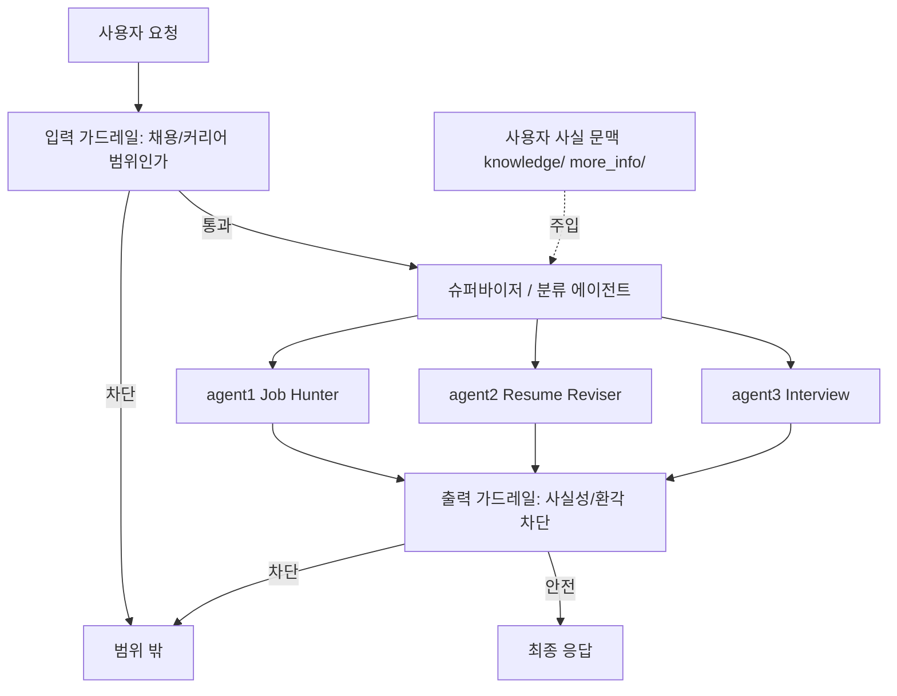

# process.md

## 현재 운용 절차

1. 작업 전 `git status --short --branch`로 브랜치와 미커밋 변경을 확인한다.
2. `AGENTS.md`, `skills.md`, `history.md`, `conversation_l2_cache.md`를 확인한다.
3. Codex/Claude 중 다른 에이전트가 남긴 변경이 있으면 임의로 되돌리지 않고 이어서 작업한다.
4. 요청과 관련된 코드, README, 입력 자료를 검색한다.
5. 변경 범위를 작게 정하고 필요한 파일만 수정한다.
6. 가능한 한 경량 검증을 실행한다.
7. 의미 있는 변경은 `history.md`에 남긴다.
8. 반복될 작업 방식이나 정책은 이 파일에 반영한다.
9. 다음 세션에서 이어야 할 사용자 의도와 남은 작업은 `conversation_l2_cache.md`에 압축한다.

## Codex/Claude 인계 프로토콜

- 작업 시작자는 `conversation_l2_cache.md`를 읽고 현재 의도와 금지사항을 확인한다.
- 작업 종료자는 `conversation_l2_cache.md`에 다음 작업자가 알아야 할 맥락만 짧게 남긴다.
- 완료된 변경은 `history.md`에 기록하고, 아직 진행 중인 TODO는 `conversation_l2_cache.md`에 둔다.
- 반복 가능한 절차, 커밋 정책, 검증 방식은 `process.md`에 둔다.
- 작업 문서가 서로 충돌하면 `AGENTS.md`를 우선하고, 이후 충돌 내용을 정리한다.

## Git 운용

- `.agents/`, `.codex/`, `.claude/settings.local.json`은 로컬 도구 설정이므로 커밋하지 않는다.
- `quantitative_trading/`은 별도 프로젝트로 보고 이 저장소 커밋에 포함하지 않는다.
- 개인정보, 원본 이력서, 생성 결과물, 키 파일은 커밋하지 않는다.

## 향후 아키텍처: 슈퍼바이저(분류) + 전문 에이전트 (설계만, 미구현)

`../ai_agent/part9_customer_support_agent`의 "입력 가드레일 → 분류 에이전트 → 전문 에이전트 → 출력 가드레일" 패턴을 이 프로젝트에 적용하는 목표 구조다. part9는 OpenAI Agents SDK 기반이므로 **개념만 차용**하고, 구현은 기존 `LangGraphAgentEngine`(상태 그래프 + 조건부 엣지) 위에 노드/엣지로 확장한다.

매핑·설계 원칙:
- **출력 가드레일 = 환각 차단.** part9는 정책 위반 검사지만, 이 프로젝트에서는 "자소서가 `knowledge/`에 없는 경력·수치를 지어냈는지"를 검증하는 사실성 게이트로 둔다. 이것이 슈퍼바이저 구조를 도입하는 가장 큰 이유다.
- **context 주입 = `knowledge/`+`more_info/`를 요청 1회 동안의 런타임 문맥으로 전달.** 전역 변수화하지 않는다.
- **전문 에이전트는 이미 분리돼 있다**(agent1/2/3). 슈퍼바이저는 이들을 새로 만드는 게 아니라 라우팅으로 엮는 상위 노드다.
- 구현 순서 권장: agent1 실행 복구(완료) → agent2/3 실행 검증 → 슈퍼바이저 라우팅 노드 → 가드레일 노드. 한 번에 하나씩.

## 향후 아키텍처: 사이트별 이력서 저장 에이전트

`site_resume_agent.py`는 이력서 원본을 채용 사이트별 입력 양식으로 변환하는 1단계 에이전트다.

현재 범위:
- 원티드, 사람인, 잡코리아, 점핏, 캐치, LinkedIn 사이트 프로필을 코드에 둔다.
- `knowledge/`와 `more_info/`를 읽어 사이트별 JSON/Markdown 입력 패키지를 만든다.
- 산출물은 `result/site_resumes/`에 저장한다.
- `site_form_mapper.py`로 공개 접근/로그인 화면/이력서 화면의 DOM 요소를 추출한다.
- `site_form_connector.py`로 입력 패키지 필드와 DOM selector 후보를 연결한다.
- 실제 자동 입력과 저장 버튼 클릭은 아직 수행하지 않는다.

다음 확장 순서:
1. 사용자가 실제로 많이 쓰는 사이트 1개를 고른다.
2. 해당 사이트의 이력서 입력 화면 필드와 필수값을 수동으로 확인한다.
3. `site_form_mapper.py --mode playwright --headed`로 로그인 후 실제 이력서 화면 selector를 추출한다.
4. `site_form_connector.py`로 입력 패키지와 selector를 매핑한다.
5. 브라우저 자동화는 "초안 입력 → 사용자 검수 → 저장" 순서로만 붙인다.
6. 제출/지원 버튼은 별도 명시 승인 없이는 누르지 않는다.

현재 접근 결과:
- 정적 fetch만으로는 대부분 로그인/SPA에 막힌다.
- Playwright headless 접근은 사람인, 원티드, 잡플래닛, 캐치, 잡코리아, 링크드인 모두 JSON 스냅샷 저장까지 성공했다.
- 다만 headless 결과는 로그인 전 화면이므로 실제 이력서 입력칸 매핑에는 `--headed` 로그인 후 재추출이 필요하다.

## 검증 기준

- 문법 변경: 가능한 경우 `py_compile` 또는 해당 스크립트 단위 실행.
- 에이전트 흐름 변경: 입력 하나로 최소 실행 경로 확인.
- 프롬프트 변경: 사실성 가드레일 위반 가능성 점검.
- 문서 변경: 역할 중복과 경로 오기를 확인.
