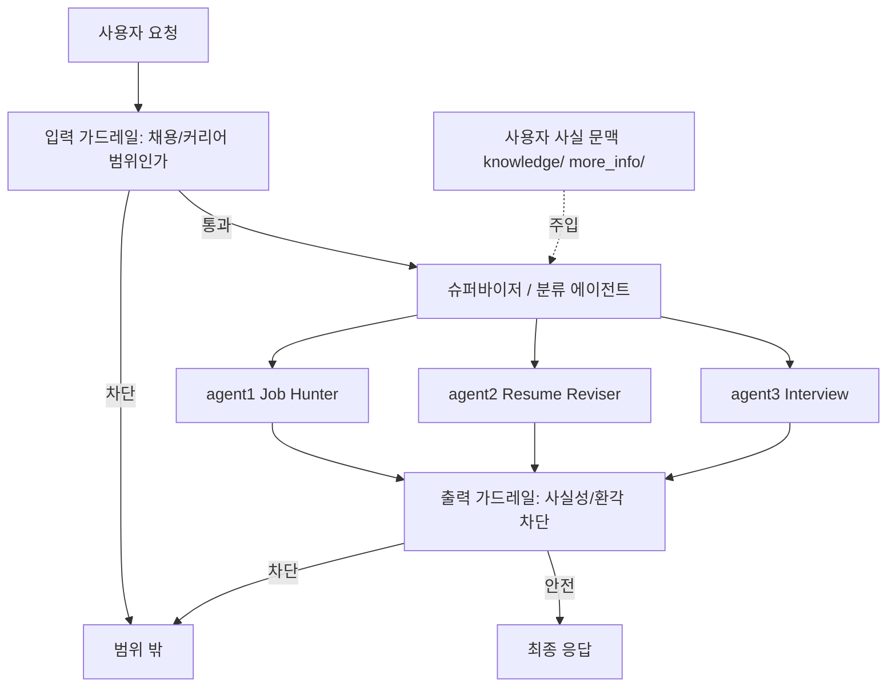

# process.md

## 단일 체크아웃·프로젝트별 커밋 (2026-10-09, 최신 정책)

- 사용자가 워크트리 분리를 취소했다. 추가 worktree 3개와 작업 공간 파일 제거, 기존 root/프로젝트 자료는 보존. 모든 폴더는 같은 현재 브랜치를 공유하므로 한 프로젝트씩 작업한다.
- 작업 전 `git status --short --branch`, 명시 프로젝트 파일만 git add, staged diff 검수·공통 소유권 검사 후 커밋. push도 origin job_agent/stock/apple 중 해당 브랜치를 명시한다. 미커밋 변경이 있으면 다른 프로젝트 브랜치로 강제 전환·자동 stash하지 않는다.
- stock 서버 push 이후 로컬 변경을 먼저 정리한 뒤 stock으로 전환하고 `git pull --ff-only origin stock`. 현재 dirty job_agent는 유지. 훅/브랜치 보호는 로컬이며 서버 자동 적용 아님. 상세 운영은 ../tools/isolation/README.md.

## 플랫폼 전환 중심 흐름 (2026-10-08)

- `#prepare`: 5개 플랫폼 다중 체크/진행. 회사 자체 JSON 변환은 접힌 고급 기능이다.
- 공개 웹→본인 PC popup에 이력서/선택 목록만 승인 전달. exact origin/opener/request ID/사이트 allowlist 유지; 쿠키/OTP/API 권한 전달 금지.
- 로컬 재검수 후 진행 → 전용 브라우저 열기·상태 확인 → 로그인/MFA → 사이트별 검수·저장. persistent profile만 재사용, 명확한 단일 일치/성공 연결 선제안 후 별도 승인·readback.
- 선택 프로필/공통 원본 digest 변화는 stale preview 차단. 원본 보존, 불확실 저장 자동 재시도 금지.

## 첫 화면과 작업 흐름 (2026-10-08)

- 기본 `#guide`에서 목적과 흐름을 확인하고 작업을 선택한다. 공고 탐색은 이력서 없이 독립 사용한다.
- 공통 이력서 작성·검수 → 이력서 정리 → 결과 검수 → 회사 양식 변환으로 연결한다. 검수된 원본 바로 변환도 가능하다.
- 결과 기록·외부 공유 링크 UI는 제공하지 않는다. 공개 웹은 현재 결과만 유지하므로 새로고침 전 다운로드한다. 기존 로컬 파일·CLI 기록·공유 기능은 보존한다.

## 기존 환경을 보존하는 공개 배포

`python -m job_agent.hosting.build --backup`은 private ZIP(기존 `.env` 포함 가능, 업로드 금지)과 별도의 allowlist 코드 전용 배포 디렉토리를 `result/hosting/`에 생성한다. 기존 앱·자료·로그인 프로필·가상환경은 삭제/이동하지 않는다. 공개 프로필/기록은 탭 RAM, 실행은 요청별 `WorkspaceService(ephemeral=True)`와 `finally close`, 모델/검색/실제 포털 API 차단. 배포 대상은 export만이며 `.env*`/`.vercel`/개인 자료 제외 여부를 CLI dry-run으로 확인한다. Vercel Hobby 무료 플랜 확인, GitHub 자동배포·MCP 인증을 CLI 배포 성공과 구분한다. `deploy/github/vercel-workflow.yml`은 미활성 수동 CI 템플릿이다. 상세: `docs/public_hosting.md`.

## 사용자 플랫폼 연결

Windows 연결 도구 ZIP은 새 폴더에 모두 압축 풀기 후 `Start-Resume-Connector.cmd` 더블클릭으로 시작한다. uv 부재 시 공식 WinGet 설치를 명시 선택하고, locked sync 후 런처가 브라우저 준비/loopback 서버 실행/브라우저 열기를 수행한다. 보안 경고·실행 정책 우회 금지. 실행 창 유지·Ctrl+C 종료. 수동 안내는 PowerShell 여는 방법과 명령 한 줄씩 실행을 설명한다. 웹 다운로드 시 `connector.json`에 정확한 현재 origin을 설정하고 런처가 검증한다. 운영자 파일/세션/키는 포함하지 않는다.

공개 웹의 플랫폼 연결에서 코드 전용 로컬 ZIP 다운로드 → 본인 PC uv 설치/압축 폴더에서 `uv sync --extra browser` → `uv run job-agent ui --port 8780 --handoff-origin <현재 HTTPS origin>` → 웹 이력서 전달 동의/로컬 창 열기 → 로컬 출처/이력서 확인·가져오기 승인 → 재검수/저장 → 전용 사이트 브라우저 로그인·MFA 직접 완료 → 기존 이력서 편집 → 인증 상태/필드 확인·검수·저장. 로그인 세션/API 토큰/OTP는 공개 웹으로 전송 금지. 세션 프로필과 실행 기록은 본인 PC 파일이며 공유 PC 피하기/로그아웃·정리 안내. 모바일만은 무설치 자동 저장 미지원, 다운로드 수동 반영 대안. 포트/팝업/허용 origin 문제는 경고 우회 대신 확인하며 JSON 업로드 대안을 제공한다.

## 코드 없는 공개 체험

`uv run job-agent ui --public-demo` 실행 후 로컬 공유 탭에서 링크 생성·복사. 공개 UI에는 코드 입력/표시/복사 없음. 메모리 전용 브라우저별 공간, 파일/DB/내용 로그 및 브라우저 자동 localStorage/IndexedDB 저장 없음. 세션 시작 1시간 후 만료·60초 이내 주기 정리, 하단 임시 데이터 삭제/정상 종료 정리. 보관은 내 기기 다운로드. 운영자 데이터/키/포털 세션 재사용 금지. 표준 JSON/직접 작성·검수와 기본 정리·변환만 허용; DOCX/실제 사이트 저장/모델·검색 자원은 원격 차단. 하단 개인정보 처리 안내·문의처 `RESUME_PRIVACY_CONTACT` 제공. 완전한 기기 내 처리/OS·네트워크까지 무저장/법적 준수 인증으로 설명하지 않는다. 기존 개인 로컬/인증 공유는 별도 파일 저장 모드.

## 자체 모델과 외부 접속

외부 사용 모델은 서버 시작의 `--remote-providers`로만 지정한다. 기본 LLM 없음만 허용, 자체 서버도 명시 허용 필요. 개인 유료 모델에는 `--allow-remote-paid-api`, 개인 Tavily에는 `--allow-remote-web-search` 별도 필요. UI/HTTP API의 정책 변경과 소유자 코드는 제거됨. 설정 변경은 서버 재시작, 방문자 코드에는 관리 권한 없음. 운영자 키를 사용자별 BYOK로 오인하지 않는다.

로컬 UI의 모델 연결에서 OpenAI 호환 기본 URL·모델 ID·선택 키를 적용한다. 연결 설정/키는 메모리 전용이며 재시작 후 다시 설정한다. UI AI 분석에만 적용하며 기본 LLM 없는 흐름과 기존 CLI는 유지한다. 원격 서버에는 개인 원문이 전송되므로 실행별 동의를 받는다.

공식 cloudflared 설치 후 로컬 UI 외부 공유 링크 탭에서 전체 작업 공간 접근 동의·생성을 수행한다. URL/접근 코드는 결과·Git에 기록하지 않는다. 방문자는 코드 인증 후 열람/편집/실행 가능, 모델 설정과 공유 관리는 로컬 전용. 공유 중지/서버 종료 시 로그인 세션 폐기. PC 종료/절전에는 접속 불가, 재생성 주소 변경. 단일 소유자의 신뢰된 공유이며 다중 사용자 SaaS로 취급하지 않는다.

## 공통 이력서 입력

Word 기본 양식·Markdown·JSON 다운로드/업로드와 항목별 반복 폼을 사용한다. `documents/sections.py` 단일 스키마 → `items` 배열 → 결정론적 `value` 텍스트로 연결, 기술/자격/수상/학력/경력/프로젝트를 한 칸에서 임의 파싱하지 않는다. 공개 DOCX 읽기·생성은 브라우저 fflate/XML이며 서버 `/api/extract`는 계속 차단한다. 일반 DOCX는 소개 원문으로 보존 후 직접 분류/검수. 첫 반영 시 직접 입력의 미검수 근거를 붙이고, 사용자 승인 후 재반영한다. 이력서 정리 결과는 레코드 단위로 정렬하고 명시 검수 후 회사 양식 입력으로 선택하며 원본은 보존한다. 최신 사용 절차는 `docs/resume_input.md`를 따른다.

UI의 사용 예시 탭은 작업 흐름 안내용이며 개인 사실 입력을 자동 생성하지 않는다. 가상 공고/JD 버튼은 검색/정리 양식에만 입력하고 API 실행·공통 프로필 저장·사이트 입력을 하지 않는다. 새 서비스 안내는 실제 구현 범위와 로그인/검수/저장 한계를 구분하며 모델/운영자 설정은 외부 예시에 노출하지 않는다.

UI의 이력서 입력은 `job-agent.resume/v1`으로 통일한다(`docs/resume_input.md`). 공통 항목 편집/원문 가져오기 → 저장(변경 시 승인 해제) → 사실·근거 검수 → 재저장 → 서류 정리/회사 양식 변환 순서다. `ResumeProfile`이 버전·타입·ID·근거·미검수를 검사하고 기존 package로 변환한다. `result/resume_profile/`은 개인정보 저장본이며 Git 제외. AI 초안은 자동으로 이 저장본에 반영하지 않는다. 기존 CLI 입력은 호환성을 유지한다.

## 패키지 실행 기준

- 사용자 UI는 `uv run job-agent ui` 또는 `python -m job_agent ui`로 실행한다. localhost 전용이며 `--no-open`/`--port`를 지원한다. 화면 기본값은 LLM 없음, 검색 API와 AI 사용 동의를 별도로 받는다. `result/ui_runs/`의 개인 결과는 Git에 포함하지 않는다. UI 사이트 저장은 전용 브라우저 로그인 → 편집 화면 수집 → 항목/저장 버튼 검수 동의 → 기존 필드 입력·저장 → 재접속 확인 순서다. 성공한 연결·기존 값 백업·실행 기록은 ignored `result/site_sync/`에 둔다. 지원/공개 설정/custom UI는 조작하지 않는다. 기존 CLI 저장은 수동이며 실제 5개 포털 저장의 종단 검증은 별도이다.

- 실행은 `uv sync --extra browser` 후 `uv run job-agent <명령>` 또는 `python -m job_agent <명령>`을 사용한다. 전체 명령은 `uv run job-agent --help`에서 확인한다.
- Python 코드는 `job_agent/{core,agents,documents,browser,sites,examples}/`에 둔다. 지침 Markdown은 루트에 유지하고, 운영 기록은 `docs/`, 테스트는 `tests/`에 둔다.
- 자료·결과의 상대 경로는 `ProjectPaths`를 통해 프로젝트 루트 기준으로 해석한다. `knowledge/`, `more_info/`, `result/` 및 사이트 로그인 프로필은 옮기지 않는다.
- 문서 원문/근거는 `DocxReader`와 `ResumeLibrary`, 로컬 컨텍스트는 `UserContextLoader`, 세션 수명은 `BrowserSession`, 검수된 입력은 `FormFiller`, 출력 경계는 `ArtifactStore`가 담당한다. 순수 매핑 로직은 상태 없는 함수로 유지한다.
- 리팩터링 검증은 실제 자료 통합 환경변수와 함께 `python -m unittest discover -s tests -v`로 수행한다. 기존 master package를 재컴파일해 비교하되, 새 검증 결과는 ignored `result/refactor_verification/`에 저장해 원본 결과를 덮어쓰지 않는다.

## 현재 운용 절차

회사 자체 사이트는 `target-register --key company-<slug> --name <회사명> --url <작성URL>`로 등록한다. 다른 host/iframe은 확인한 origin만 `--allow-origin`에 추가한다. `form-map --target <JSON> --mode playwright --headed --interactive`로 로그인 후 화면별 수집한다. `application-prepare --target <JSON> --master <검수master> --form-map <JSON>`으로 schema/bindings/package/mapping/review를 생성한다. 미연결 문항은 검수 master에 근거와 함께 먼저 작성하고, bindings 수정 후 `--bindings <JSON>`으로 재변환한다. 생성 mapping은 항상 미승인, `form-fill --site company-<slug> --target <JSON>` 기본은 검증만이다. 단계별 출력 폴더를 분리하고 최종 저장/지원은 수동으로 수행한다.

1. 작업 전 `git status --short --branch`로 브랜치와 미커밋 변경을 확인한다.
2. `AGENTS.md`, `skills.md`, `history.md`, `conversation_l2_cache.md`를 확인한다.
3. Codex/Claude 중 다른 에이전트가 남긴 변경이 있으면 임의로 되돌리지 않고 이어서 작업한다.
4. 요청과 관련된 코드, README, 입력 자료를 검색한다.
5. 변경 범위를 작게 정하고 필요한 파일만 수정한다.
6. 가능한 한 경량 검증을 실행한다.
7. 의미 있는 변경은 `history.md`에 남긴다.
8. 반복될 작업 방식이나 정책은 이 파일에 반영한다.
9. 다음 세션에서 이어야 할 사용자 의도와 남은 작업은 `conversation_l2_cache.md`에 압축한다.

## Codex/Claude 인계 프로토콜

- 작업 시작자는 `conversation_l2_cache.md`를 읽고 현재 의도와 금지사항을 확인한다.
- 작업 종료자는 `conversation_l2_cache.md`에 다음 작업자가 알아야 할 맥락만 짧게 남긴다.
- 완료된 변경은 `history.md`에 기록하고, 아직 진행 중인 TODO는 `conversation_l2_cache.md`에 둔다.
- 반복 가능한 절차, 커밋 정책, 검증 방식은 `process.md`에 둔다.
- 작업 문서가 서로 충돌하면 `AGENTS.md`를 우선하고, 이후 충돌 내용을 정리한다.

## Git 운용

- **브랜치: `resum/` 작업은 `job_agent`에서만 한다. 머지는 `job_agent` → `develop` → `main` 순.** (강제 규칙은 `AGENTS.md §6` 참조)
  - 승격 예시:
    ```bash
    git checkout develop && git merge --ff-only job_agent   # 1단계 승격
    git checkout main && git merge --ff-only develop         # 2단계 승격
    git checkout job_agent                                   # 작업 브랜치로 복귀
    ```
  - 별도 feature/fix 브랜치를 파지 않는다. 커밋은 `job_agent`에 선형으로 쌓는다.
- `.agents/`, `.codex/`, `.claude/settings.local.json`은 로컬 도구 설정이므로 커밋하지 않는다.
- `quantitative_trading/`, `../stock`은 별도 프로젝트로 보고 이 저장소 커밋에 포함하지 않는다.
- 개인정보, 원본 이력서, 생성 결과물, 키 파일은 커밋하지 않는다.

## 향후 아키텍처: 슈퍼바이저(분류) + 전문 에이전트 (설계만, 미구현)

`../ai_agent/part9_customer_support_agent`의 "입력 가드레일 → 분류 에이전트 → 전문 에이전트 → 출력 가드레일" 패턴을 이 프로젝트에 적용하는 목표 구조다. part9는 OpenAI Agents SDK 기반이므로 **개념만 차용**하고, 구현은 기존 `LangGraphAgentEngine`(상태 그래프 + 조건부 엣지) 위에 노드/엣지로 확장한다.


```mermaid
flowchart TD
    U[사용자 요청] --> IG[입력 가드레일: 채용/커리어 범위인가]
    IG -->|차단| X[범위 밖]
    IG -->|통과| SUP[슈퍼바이저 / 분류 에이전트]
    CTX[사용자 사실 문맥 knowledge/ more_info/] -. 주입 .-> SUP
    SUP --> A1[agent1 Job Hunter]
    SUP --> A2[agent2 Resume Reviser]
    SUP --> A3[agent3 Interview]
    A1 --> OG[출력 가드레일: 사실성/환각 차단]
    A2 --> OG
    A3 --> OG
    OG -->|안전| R[최종 응답]
    OG -->|차단| X
```

매핑·설계 원칙:
- **출력 가드레일 = 환각 차단.** part9는 정책 위반 검사지만, 이 프로젝트에서는 "자소서가 `knowledge/`에 없는 경력·수치를 지어냈는지"를 검증하는 사실성 게이트로 둔다. 이것이 슈퍼바이저 구조를 도입하는 가장 큰 이유다.
- **context 주입 = `knowledge/`+`more_info/`를 요청 1회 동안의 런타임 문맥으로 전달.** 전역 변수화하지 않는다.
- **전문 에이전트는 이미 분리돼 있다**(agent1/2/3). 슈퍼바이저는 이들을 새로 만드는 게 아니라 라우팅으로 엮는 상위 노드다.
- 구현 순서 권장: agent1 실행 복구(완료) → agent2/3 실행 검증 → 슈퍼바이저 라우팅 노드 → 가드레일 노드. 한 번에 하나씩.

## 향후 아키텍처: 사이트별 이력서 저장 에이전트

2026-10-08 연결 Chrome의 실계정 확인: 원티드 선택 필드 자동저장과 인크루트 경력/학력 섹션 저장 성공 및 재접속 readback 확인. 캐치는 초안만 확인, 잡코리아/사람인은 로그인 필요 상태다. `docs/resume_authoring.md`의 최신 표가 기준이며 UI 전용 Playwright 프로필 E2E와 구분한다. 외부 휴대폰 사용자는 localhost UI를 열 수 없으므로 연결 PC에서 실행 가능한 범위를 먼저 처리하고, 인증/근거 없는 필수값만 구체적으로 인계한다. 무인증 외부 UI 공개는 하지 않는다.

2026-10-07 실제 작성에는 `job_agent/documents/library.py extract --source <DOCX>`(반복 지정)로 명시 선택 자료만 추출하고, 문단 근거를 연결한 로컬 `reviewed_draft.json`을 `build --corpus <JSON> --draft <JSON>`으로 컴파일했다. 공통 master/사이트 패키지는 ignored `result/`에만 둔다. 5개 사이트에 검수용 이력서를 입력했으며, 이번에는 원복하지 않았다. 원티드만 자동저장 후 새로고침 유지까지 확인했고, 나머지 최종 저장은 사용자에게 넘긴다. 작성 상세 및 미작성 항목은 `docs/resume_authoring.md`가 최신 기준이다.

2026-10-06 우선 대상은 캐치·잡코리아·사람인·원티드·인크루트다. ALIO API 연동은 취소한다. 로그인된 실제 화면을 조사하고, 확인되지 않은 이력서 편집 URL이나 selector를 확정값으로 사용하지 않는다.

수집 명령: `uv sync --extra browser` 후 `python -m job_agent form-map --mode playwright --sites catch --headed --interactive`. 전용 프로필은 `result/browser_profiles/`에서 재사용하며, Enter마다 해당 사이트 탭과 iframe을 수집한다. 섹션 추가/편집 팝업을 열고 반복 수집한다. 값 미리보기는 기본 제외, 필요하면 `--include-values`를 사용한다. 연결기의 후보를 개별 검수하여 `approved: true`를 표시한다. `job_agent/browser/filler.py` 기본 실행은 검증만, `--apply`와 터미널 `APPLY` 입력 시 기존 텍스트/native select/contenteditable에 입력한다. 저장 버튼은 사용자가 처리하며, 사이트 자동저장이 있을 수 있으므로 실제 입력 전 값을 검수한다. 반복 항목 생성과 custom 선택 UI는 미구현이다.

`job_agent/agents/site_resume.py`는 이력서 원본을 채용 사이트별 입력 양식으로 변환하는 1단계 에이전트다.

현재 범위:
- 캐치, 잡코리아, 사람인, 원티드, 인크루트를 우선 지원한다. 기존 점핏/LinkedIn 프로필은 보조 대상이다.
- `knowledge/`와 `more_info/`를 읽어 사이트별 JSON/Markdown 입력 패키지를 만든다.
- 산출물은 `result/site_resumes/`에 저장한다.
- `job_agent/browser/mapper.py`로 공개 접근/로그인 화면/이력서 화면의 DOM 요소를 추출한다.
- `job_agent/browser/connector.py`로 입력 패키지 필드와 DOM selector 후보를 연결한다.
- 검수된 기존 필드의 입력 실행기가 있다. 실제 DOCX로 캐치/잡코리아/사람인 경력 및 원티드 소개 입력 smoke test 후 기존 값 복원 완료. 원티드 blur 자동저장 확인 및 복원 새로고침 검증. 전체 저장 흐름과 Python 전용 로그인 CLI의 실사이트 실행은 아직 미검증. 저장 버튼은 사용자가 처리한다. 자세한 범위는 `docs/real_source_test.md` 참조.

다음 확장 순서:
1. 사용자가 실제로 많이 쓰는 사이트 1개를 고른다.
2. 해당 사이트의 이력서 입력 화면 필드와 필수값을 수동으로 확인한다.
3. `job_agent/browser/mapper.py --mode playwright --headed`로 로그인 후 실제 이력서 화면 selector를 추출한다.
4. `job_agent/browser/connector.py`로 입력 패키지와 selector를 매핑한다.
5. 브라우저 자동화는 "초안 입력 → 사용자 검수 → 저장" 순서로만 붙인다.
6. 제출/지원 버튼은 별도 명시 승인 없이는 누르지 않는다.

현재 접근 결과:
- 정적 fetch만으로는 대부분 로그인/SPA에 막힌다.
- Playwright headless 접근은 사람인, 원티드, 잡플래닛, 캐치, 잡코리아, 링크드인 모두 JSON 스냅샷 저장까지 성공했다.
- 다만 headless 결과는 로그인 전 화면이므로 실제 이력서 입력칸 매핑에는 `--headed` 로그인 후 재추출이 필요하다.

## 검증 기준

- 문법 변경: 가능한 경우 `py_compile` 또는 해당 스크립트 단위 실행.
- 에이전트 흐름 변경: 입력 하나로 최소 실행 경로 확인.
- 프롬프트 변경: 사실성 가드레일 위반 가능성 점검.
- 문서 변경: 역할 중복과 경로 오기를 확인.
# 사용 예시 화면 캡처

- 공개 문서 캡처는 가상 자료만 사용하고 Codex 내 브라우저에서 입력·실행·결과를 실제 수행한다. 빈 화면을 결과 증거로 취급하지 않는다.
- 포털 저장 예시에는 개발용 루프백 테스트 양식을 사용할 수 있으나 실제 포털 인증·저장 성공과 명확히 구분한다. 로그인/MFA를 조작하거나 개인 쿠키를 공개하지 않는다.
- `job_agent/ui/tutorials.py` allowlist, 각 서비스 예시의 캡션/대체 텍스트, 모바일/데스크톱 이미지 로딩·확대·키보드 닫기 검증을 함께 갱신한다. 테스트 서버를 종료하고 임시 공간을 정리한다.
