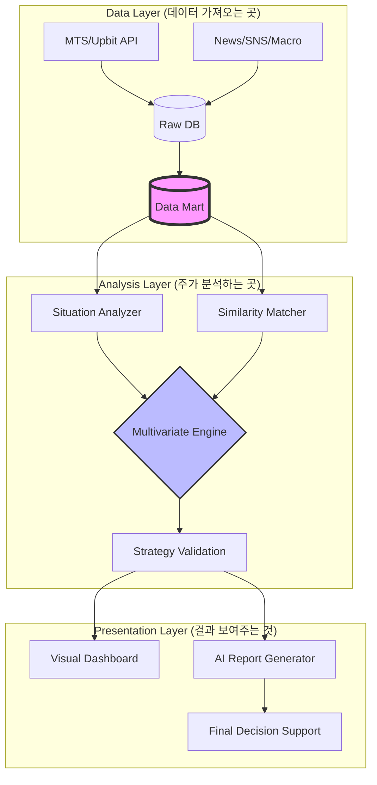

# AI 퀀트 트레이딩 연구: "최하방 방어 기반 다변량 예측 모델"

## 1. 연구 개요 (Research Overview)
본 연구는 전통적인 통계학적 시계열 모델의 한계를 극복하고, LLM(거대언어모델)과 다변량 분석(Multivariate Analysis)을 결합하여 **'최하방 지지선 방어'**에 특화된 퀀트 매매 전략을 탐색합니다. 단순히 수익률을 극대화하는 것이 아니라, 역사적 패턴 유사도와 거시적 감성 분석을 결합하여 하락장에서의 손실을 원천 차단하는 '절대로 잃지 않는' 모델 구축이 핵심 목표입니다.

## 2. 핵심 연구 방향 (Strategic Direction)
- **Univariate to Multivariate:** 주가 데이터(단변량)만 보는 것이 아니라 뉴스, 전쟁, 지표, SNS 반응 등 외부 변수를 포함한 다변량 분석 수행.
- **Pattern & Sentiment Matcher:** 현재의 주가 모양과 비슷한 과거 시점을 찾고, 당시의 '뉴스 맥락(감성)'까지 비교하여 현재의 흐름을 예측.
- **Data Mart 기반 분석:** 매번 API를 호출하는 대신, 섹터별/이슈별로 정제된 데이터 마트를 구축(DB/AWS)하여 효율적인 백테스트 환경 조성.
- **AI-Agentic Workflow:** 연구의 전 과정(데이터 수집, 코딩, 분석, 리포트)을 AI 에이전트와 협업하여 수행.

## 3. 시스템 아키텍처 (Architecture)

## 4. 연구 수행 가이드 (Usage & Skills)
본 프로젝트는 세션의 효율성을 위해 단계별 프로세스를 엄격히 준수합니다.

### 4.1 에이전트 활용 방법
- **kordoc MCP 활용:** 프로젝트 내 모든 문서는 `kordoc`을 통해 파싱되어 에이전트가 문맥을 정확히 파악하도록 합니다. 
- **AI Coding:** `skills.md`에 정의된 기술셋을 바탕으로 Codex, Claude 등의 도구를 활용하여 코드를 생성하고 분석합니다.

### 4.2 파일 구조 및 관리
- `process.md`: 전체 연구 단계 정의 및 세션별 가이드.
- `history.md`: 수행 완료된 단계 기록 (세션 초기화 시 에이전트가 상황 파악용으로 사용).
- `skills.md`: 연구에 필요한 통계/AI 분석 기법 명세.
- `/materials`: 연구 개요 및 교수님 피드백 등 원천 자료 보관.

## 5. 시작하기
1. `process.md`에서 현재 수행해야 할 단계(Step)를 확인합니다.
2. `history.md`를 통해 이전 세션에서 수행된 결과를 파악합니다.
3. 해당 단계에 맞는 분석 또는 코딩을 수행하고 결과를 기록합니다.
